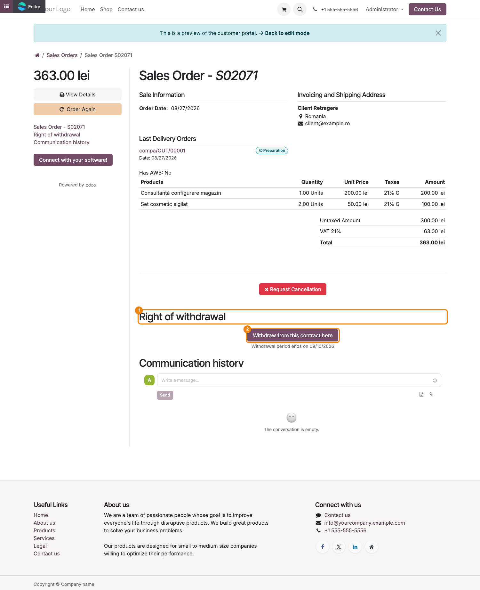
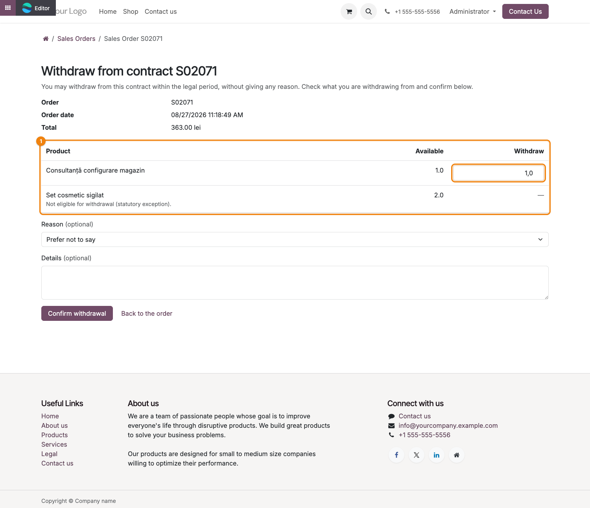
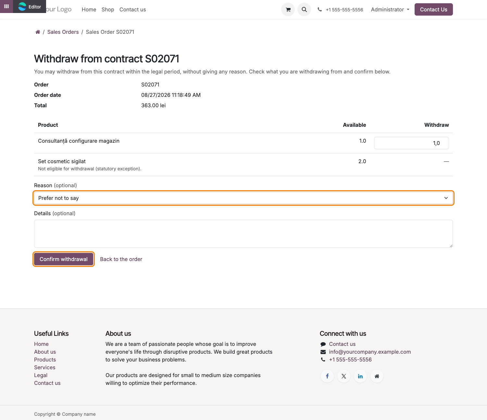
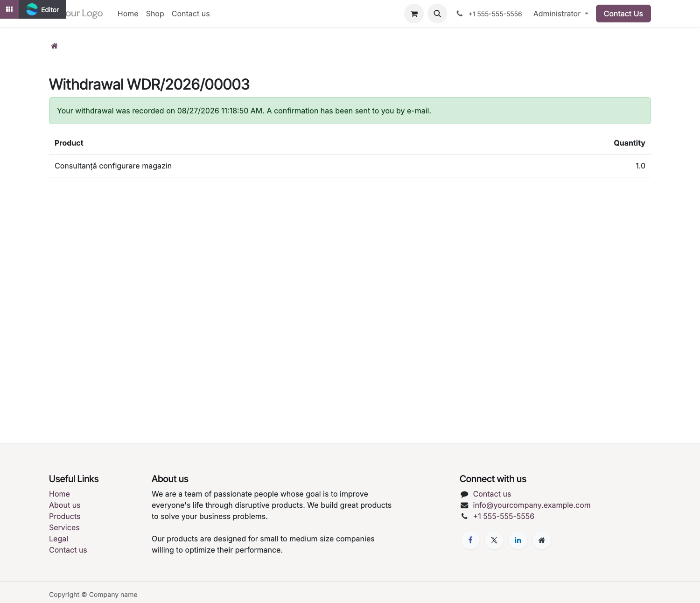
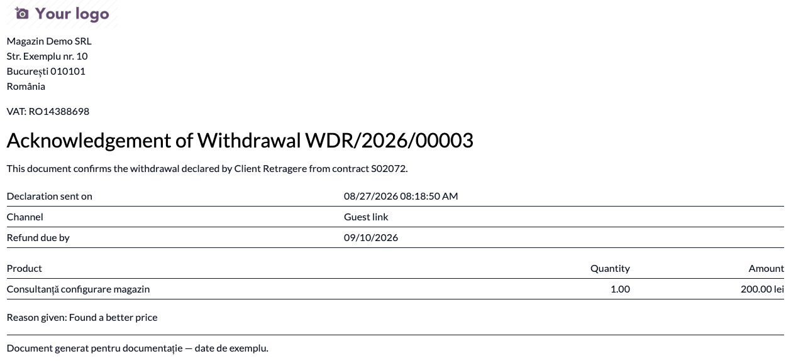
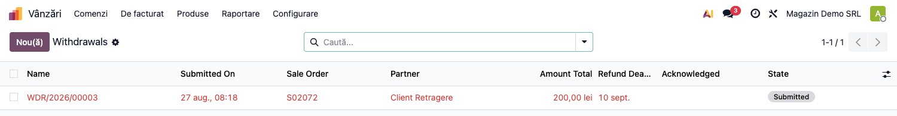
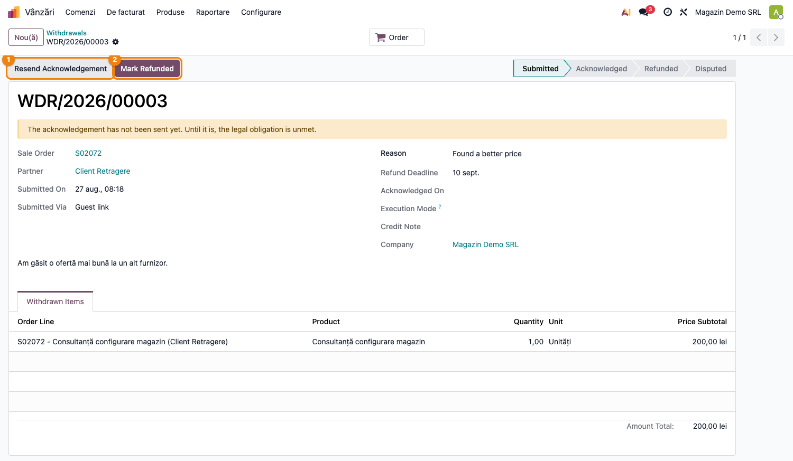

# Fișă Modul: Buton de retragere din contract (Directiva UE 2023/2673)

**Modul:** `bitshop_sale_withdrawal`
**Utilizator principal:** Administrator magazin online, Operator vânzări/portal
**Prioritate:** 🔴 Ridicată (obligație legală din 19 iunie 2026, aplicabilă oricărui comerciant care vinde online către consumatori din UE)

---

## 1. Scop business

Această fișă descrie modulul `bitshop_sale_withdrawal`, care adaugă pe portalul clienților
**butonul de retragere din contract** cerut de Directiva (UE) 2023/2673 (transpusă în România prin
OUG 18/2026). Consumatorul își poate exercita dreptul de retragere direct de pe pagina comenzii,
fără cont, fără motiv, iar comerciantul primește automat un registru al retragerilor și confirmarea
legală trimisă pe suport durabil (e-mail cu PDF).

Modulul e gândit ca soluție de sine stătătoare: chiar dacă magazinul vinde doar servicii (fără
gestiune de stoc), instalarea lui singur este suficientă din punct de vedere legal.

## 2. Bază legală și context

Directiva 2011/83/UE privind drepturile consumatorilor, modificată de Directiva (UE) 2023/2673 —
articolele **11a** (obligația de a pune la dispoziție o funcție de retragere) și **14a** (efectele
retragerii), aplicabile din **19 iunie 2026** oricărui comerciant care vinde la distanță către
consumatori din UE. În România, transpusă prin **OUG 18/2026**.

Puncte esențiale ale legii, reflectate în modul:
- retragerea este un **act unilateral** al consumatorului — produce efecte din momentul confirmării,
  comerciantul o **confirmă de primire**, nu o aprobă (art. 11a);
- **fără motiv obligatoriu** (art. 9);
- perioada minimă de retragere este de **14 zile** (poate fi prelungită comercial, nu scurtată);
- rambursarea se face în cel mult 14 zile de la informare (art. 13);
- anumite categorii de bunuri/servicii sunt **excluse** prin lege (art. 16): produse la comandă,
  produse sigilate igienice desigilate, produse perisabile, suporturi audio/video/software
  desigilate, presă, conținut digital sau servicii deja furnizate cu acord expres.

## 3. Utilizatori și roluri

Administrator magazin (configurare), Operator vânzări/suport (gestionează registrul de retrageri
și rambursările), Consumator (pe portal, fără cont necesar).

Roluri recomandate pentru testare:
- Administrator funcțional: instalează modulul, configurează setările și excepțiile pe produse
- Utilizator operațional: urmărește registrul de retrageri, marchează rambursarea
- Consumator (testat ca vizitator portal, cu și fără cont): parcurge fluxul de retragere

## 4. Conturi și date implicate

Modulul nu generează el însuși note contabile — înregistrează retragerea și programează o
activitate de rambursare pe responsabilul comenzii. Nota de credit / rambursarea efectivă se face
manual, prin fluxul obișnuit de facturare (comportamentul standard "Manual" este suficient legal
de unul singur).

Date minime pentru demo:
- companie cu `website_sale` instalat și modul de vânzare online activ
- o comandă de vânzare confirmată, cu acces de portal (cu sau fără cont de client)
- cel puțin un produs marcat cu o excepție art. 16 (ex. "Produse sigilate igienice"), ca să se vadă
  și cazul de neeligibilitate

## 5. Configurare inițială

1. Instalați modulul `bitshop_sale_withdrawal` (necesită `sale` și `portal`).
2. Mergeți la **Vânzări → Configurare → Setări → Withdrawal from Contract** și verificați:
   - **Withdrawal Function** activă (implicit pornită) — expune butonul pe portal;
   - **Withdrawal Period (days)** — implicit 14 (minimul legal);
   - **Refund Deadline (days)** — implicit 14 (termenul de rambursare, art. 13);
   - **Withdrawal Execution** — modul "Manual" (implicit, suficient legal de unul singur).
3. Pe categoriile de produse sau pe produsele care intră sub o excepție art. 16, setați câmpul
   **Withdrawal Exception** (ex. produs făcut la comandă, produs sigilat igienic desigilat etc.).
4. Verificați că e-mailul de confirmare a comenzii conține link-ul de portal cu token de acces —
   altfel un client fără cont nu poate ajunge la butonul de retragere.
5. Confirmați o comandă de test și accesați-o din portal ca și consumator.

## 6. Flux de utilizare

### Pasul 1 — Consumatorul accesează comanda din portal

Consumatorul deschide comanda din link-ul primit prin e-mail (**Contul meu → Comenzi**, sau
link-ul direct din e-mailul de confirmare). Secțiunea are propriul titlu, **„Drept de retragere”**,
care apare și ca ancoră proprie în meniul rapid din bara laterală a portalului (alături de „Istoric
comunicare”), astfel încât un client care doar derulează pagina o poate găsi și din navigare, nu
doar dând scroll. Sub titlu apare butonul **„Retrage-te din acest contract aici”** — stilizat ca
buton primar (nu gri secundar, cum era inițial), pentru vizibilitate mai bună — vizibil pe toată
durata perioadei legale de retragere, cu data limită afișată dedesubt. După expirarea perioadei,
butonul rămâne vizibil dar dezactivat, cu explicația aferentă — nu dispare, pentru ca dovada
existenței lui să rămână verificabilă ulterior. Interfața urmează limba portalului: pagina este
disponibilă și integral tradusă în română.



### Pasul 2 — Recapitulare și selectarea articolelor de retras

La accesarea butonului, pagina afișează un recapitulativ al contractului: comandă, dată, total, și
un tabel cu fiecare articol, cantitatea disponibilă pentru retragere și un câmp editabil de
cantitate. Articolele excluse printr-o excepție art. 16 apar în listă cu mențiunea „Not eligible for
withdrawal (statutory exception)” — niciodată ascunse, pentru că ascunderea lor ar constitui ea
însăși o practică comercială incorectă.



### Pasul 3 — Confirmarea retragerii (pas separat, fără motiv obligatoriu)

Consumatorul poate opțional alege un motiv și adăuga detalii, apoi apasă **„Confirm withdrawal”** —
un buton separat de recapitulare, exact cum cere legea (confirmare explicită, nu o simplă bifă).
Din acest click, retragerea este legal efectivă.



Consumatorul este redirecționat spre o pagină de status, reaccesibilă ulterior prin același link.



### Pasul 4 — Confirmarea de primire pe suport durabil

Imediat după confirmare, sistemul trimite automat un e-mail de confirmare de primire, cu un PDF
atașat care conține data **și ora exactă** a transmiterii declarației — elementul cerut legal ca
dovadă. Trimiterea este sincronă și urmărită: dacă eșuează, retragerea rămâne înregistrată dar
"neconfirmată", iar responsabilul comenzii primește o activitate de avertizare, pentru că până la
trimiterea confirmării obligația legală este neîndeplinită și perioada de retragere se extinde la
12 luni. Un job orar reîncearcă automat trimiterile eșuate.



### Pasul 5 — Registrul de retrageri și rambursarea

În back office, retragerile apar în **Vânzări → Comenzi → Withdrawals**. Înregistrările fără
confirmare trimisă apar în roșu (`decoration-danger`) — semnal vizual că obligația legală e încă
neîndeplinită. Fiecare retragere are termenul de rambursare (art. 13) calculat automat și o
activitate programată pe responsabilul comenzii, cu titlul „Process withdrawal ...: refund the
consumer”.



După efectuarea rambursării (nota de credit se emite prin fluxul obișnuit de facturare, în afara
acestui modul), operatorul apasă **„Mark Refunded”** pe fișa retragerii pentru a închide ciclul.



### Note de monografie și raportare

Acest modul **nu generează note contabile**. Rambursarea consumatorului (notă de credit, restituire
plată) se face manual, prin fluxul standard de facturare/plăți — modulul doar înregistrează
retragerea, calculează termenul legal de rambursare și programează activitatea de urmărire pe
responsabilul comenzii.

## 7. Legături cu alte module / declarații

| Modul / proces | Rol în flux | Tip legătură |
|---|---|---|
| `sale` | comanda de vânzare, liniile și accesul de portal | dependență (manifest) |
| `portal` | autentificarea/accesul consumatorului fără cont (link cu token) | dependență (manifest) |
| `website_sale` | canalul prin care se generează comenzile online supuse retragerii | context de utilizare (nu dependență directă) |
| `bitshop_sale_withdrawal_stock` | calculează începutul perioadei de retragere de la livrarea efectivă (recepția fizică a bunurilor) și adaugă execuția operațională (retur marfă) | extensie opțională |
| `account` | emiterea notei de credit / rambursarea efectivă | integrare manuală, în afara modulului |

Ce este automat: expunerea butonului pe portal, recapitularea comenzii, înregistrarea retragerii,
confirmarea pe suport durabil (e-mail + PDF cu timestamp), calculul termenului de rambursare,
activitatea de urmărire pe responsabil.
Ce rămâne manual: emiterea notei de credit/rambursarea efectivă a banilor, marcarea retragerii ca
„Rambursată”, gestionarea returului fizic al mărfii (dacă nu e instalat `bitshop_sale_withdrawal_stock`).

## 8. Verificări pentru consultant

- [ ] Modulul se instalează fără erori (dependențe: `sale`, `portal`).
- [ ] Butonul de retragere apare pe pagina portalului unei comenzi confirmate, cu termenul limită afișat.
- [ ] Un consumator fără cont (link direct) poate accesa fluxul de retragere.
- [ ] Un produs marcat cu o excepție art. 16 apare în recapitulare ca neeligibil, nu ascuns.
- [ ] Confirmarea retragerii este un pas separat de recapitulare, motivul rămâne opțional.
- [ ] După confirmare, e-mailul cu PDF-ul de confirmare (dată **și oră**) ajunge la consumator.
- [ ] Registrul din **Vânzări → Comenzi → Withdrawals** arată corect starea (roșu = neconfirmat).
- [ ] Termenul de rambursare (implicit 14 zile) e calculat corect pe fișa retragerii.
- [ ] Setarea „Use Odoo's Native Withdrawal Button” ascunde butonul acestui modul fără să șteargă registrul.
- [ ] Secțiunea de retragere are titlul „Drept de retragere”/„Right of withdrawal” și apare ca ancoră separată în meniul rapid din bara laterală a portalului (nu doar ca bloc fără titlu).
- [ ] Pe un portal setat în română, titlul secțiunii, textul butonului și mențiunea termenului limită apar traduse (nu în engleză) — traducerea vine din `i18n/ro.po`.

## 9. Mesaje de eroare frecvente

| Mesaj / simptom | Cauză probabilă | Remediere |
|-----------------|-----------------|-----------|
| „Select at least one item before confirming.” | Consumatorul a trimis formularul de retragere fără nicio cantitate completată | Reveniți pe pagina de recapitulare și introduceți cantitatea de retras pentru cel puțin un articol |
| „You cannot withdraw X of <produs>: only Y left.” | Cantitatea cerută depășește cantitatea încă disponibilă pentru retragere (parțial deja retrasă anterior) | Introduceți o cantitate mai mică sau egală cu disponibilul afișat |
| „The withdrawn quantity must be positive.” | S-a încercat crearea unei linii de retragere cu cantitate 0 sau negativă | Corectați cantitatea; validarea se aplică și la creare manuală din back office |
| „The withdrawal acknowledgement template is missing.” | Șablonul de e-mail `mail_template_withdrawal_ack` a fost șters sau dezinstalat | Reinstalați/actualizați modulul (`-u bitshop_sale_withdrawal`) pentru a recrea datele demo |
| Butonul de retragere nu apare pe portal | „Withdrawal Function” e dezactivată pe companie, sau „Use Odoo's Native Withdrawal Button” e activă | Verificați cele două setări din **Vânzări → Configurare → Setări** |
| Retragerea rămâne roșie (neconfirmată) în registru | Trimiterea e-mailului de confirmare a eșuat (SMTP) | Verificați activitatea de avertizare de pe retragere; job-ul orar reîncearcă automat, sau folosiți „Resend Acknowledgement” |

## 10. Capturi de ecran

Capturile (`readme/screenshots/`) sunt **generate automat** din `tests/test_screenshots.py`
(mixinul `ScreenshotCase` din `l10n_ro_doc_screenshots`, import defensiv), pe compania „Magazin
Demo SRL" (RO, RON), regenerate la 2026-08-27 — arată interfața curentă: titlul de secțiune „Right
of withdrawal", butonul primar (nu mai e gri secundar) și ancora proprie în navigarea rapidă a
portalului (vizibilă în bara laterală din `01_portal_buton.png`).

Modulul are acum traducere completă în română (`i18n/ro.po`) pentru titlu, buton și mențiunea
termenului limită — confirmat direct în `ir_ui_view.arch_db['ro_RO']` după instalare. **Capturile
de portal (01-04) rămân totuși în engleză**: paginile `website=True` își aleg limba dintr-un
website/cookie de limbă frontend, nu din limba operatorului autentificat, iar baza de test
folosită aici nu are un website cu `ro_RO` activat ca limbă frontend (un prefix `/ro/` în URL dă
404). Capturile de back office (06, 07) apar corect în română, pentru că acolo limba vine direct
din `admin.lang`. Pe un site cu multi-limbă configurat (ca la producția Damira, care a raportat
inițial acest tichet), aceleași pagini de portal ies traduse.

1. `01_portal_buton.png` — butonul de retragere pe pagina portalului comenzii, cu termenul limită afișat.
2. `02_portal_recapitulare.png` — recapitularea contractului: cantitatea disponibilă pe fiecare
   articol și produsul exclus prin excepția art. 16, marcat ca neeligibil.
3. `03_portal_confirmare.png` — motivul opțional și butonul „Confirm withdrawal".
4. `04_portal_status.png` — pagina de status a retragerii, după confirmare.
5. `05_pdf_confirmare.png` — documentul de confirmare a retragerii, cu data și ora declarației.
6. `06_registru_retrageri.png` — registrul de retrageri, cu înregistrarea neconfirmată în roșu.
7. `07_fisa_retragere.png` — fișa unei retrageri, cu starea și butoanele de acțiune.

Regenerare:

```bash
./odoo/odoo-bin -c odoo.conf -d <db> -i bitshop_sale_withdrawal,l10n_ro_doc_screenshots \
    --test-tags=fise_screenshots --stop-after-init
```

## 11. Observații pentru manual

În manualul final, păstrați accentul pe caracterul **legal obligatoriu** al fluxului: butonul de
retragere trebuie să rămână vizibil (chiar dezactivat după expirare), motivul rămâne opțional,
confirmarea pe suport durabil cu timestamp nu este opțională, iar excepțiile art. 16 se afișează,
nu se ascund. Explicați clar diferența dintre acest modul (suficient legal de unul singur) și
extensia `bitshop_sale_withdrawal_stock` (doar pentru comercianții care livrează bunuri fizice și
vor gestiunea returului integrată).
