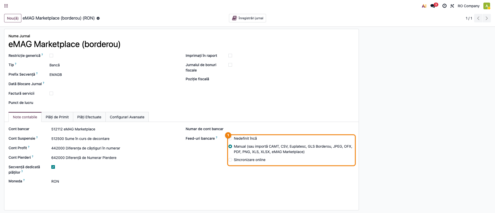
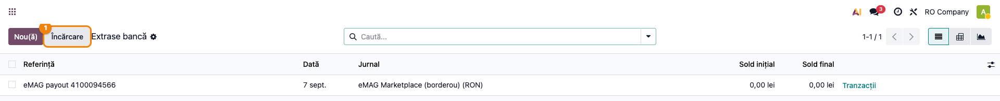
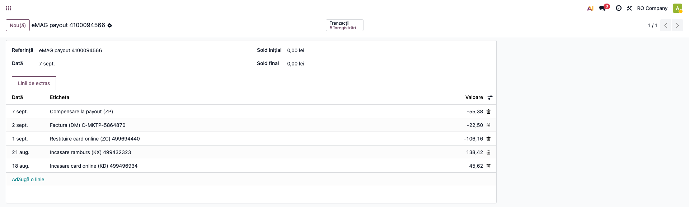

# Fișă Modul: Import borderou de plăți eMAG ca extras de cont

**Modul:** `deltatech_account_bank_statement_import_emag`
**Utilizator principal:** Contabil încasări, Operator marketplace
**Prioritate:** 🔴 Ridicată (la fiecare virare eMAG; fără el, zeci de încasări se operează manual)

---

## 1. Scop business

Comercianții care vând pe eMAG Marketplace nu încasează bani de la fiecare client în parte: eMAG
colectează încasările (card online și ramburs), își reține comisioanele și virează periodic o
**singură sumă** în contul comerciantului. Detalierea acelei virări este raportul **Account
statement details** (XLSX), descărcat din panoul de comerciant — numit uzual *borderou de plăți*.

Fără modul, borderoul ar trebui mapat coloană cu coloană în asistentul de import, iar sumele
interpretate manual: eMAG scrie valorile din perspectiva lui, deci încasările comerciantului apar
cu minus. Modulul încarcă **fișierul exact cum vine**, îl recunoaște singur, creează câte un extras
de cont pentru fiecare virare și pregătește liniile pentru reconciliere, cu clientul deja completat
acolo unde referința permite.

## 2. Bază legală și context

Nu există un temei legal specific — este un flux operațional de **reconciliere a încasărilor prin
marketplace**. Contextul contabil: banii încasați de eMAG de la clienți nu sunt încă în contul
bancar al comerciantului, deci tranzitează un cont propriu de disponibilități (un analitic de
**512x**, pe un jurnal dedicat eMAG), iar virarea efectivă în bancă se închide prin contul **581
„Viramente interne"** (OMFP 1802/2014, funcțiunea conturilor).

Creanța față de client se stinge la reconcilierea liniei de încasare, indiferent că banii au fost
încasați de eMAG în numele comerciantului.

## 3. Utilizatori și roluri

Contabilul care operează încasările și operatorul care administrează contul de marketplace.

Roluri recomandate pentru testare:
- Administrator funcțional: instalează modulul, creează jurnalul și contul de tranzit eMAG;
- Utilizator operațional: descarcă borderoul din panoul eMAG și îl încarcă în Odoo;
- Contabil/manager: reconciliază extrasul și verifică închiderea contului de tranzit.

## 4. Conturi și date implicate

- **cont dedicat jurnalului eMAG** (ex. 512112 analitic „eMAG Marketplace" — banii aflați la eMAG);
- **4111 Clienți** — se închide la reconcilierea liniilor de încasare (KD, KX);
- **401 Furnizori** — facturile de comision emise de eMAG (DM), dacă sunt deja înregistrate;
- **581 Viramente interne** — contrapartida liniei de virare (ZP), care se regăsește în extrasul băncii;
- **512x Conturi la bănci** — unde intră efectiv virarea eMAG.

Date minime pentru demo:
- companie românească cu localizarea contabilă instalată;
- un jurnal de tip **Bancă** dedicat eMAG, în RON, cu cont tranzitoriu (suspense) configurat;
- un fișier *Account statement details* descărcat din eMAG (sau o mostră sintetică echivalentă);
- opțional, facturi de client postate, cu numărul comenzii eMAG în referință, pentru reconciliere.

Codurile de document care apar în borderou:

| Cod | Ce înseamnă | Semnul în fișierul eMAG |
|-----|-------------|-------------------------|
| `KD` | încasare card online | negativ |
| `KX` | încasare ramburs | negativ |
| `ZC` | restituire card online (retur) | pozitiv |
| `DM` | factură eMAG (comisioane, servicii) | pozitiv |
| `C3` | notificare de închidere pre-înrolare | pozitiv |
| `ZP` | virarea efectivă către comerciant | pozitiv, egal cu suma tuturor celorlalte cu semn schimbat |

## 5. Configurare inițială

1. Instalați modulul `deltatech_account_bank_statement_import_emag`.
2. Creați contul de tranzit: **Contabilitate → Configurare → Plan de conturi**, un analitic de
   disponibilități (ex. 512112 „eMAG Marketplace"), cu reconciliere activată.
3. Creați jurnalul: **Contabilitate → Configurare → Jurnale**, tip *Bancă*, monedă RON, cu numele
   „eMAG Marketplace (borderou)". Atenție la cod: dacă aveți deja un jurnal de vânzări cu codul
   `EMAG`, alegeți altul (ex. `EMAGB`).
4. Pe jurnal, verificați **contul tranzitoriu** (suspense) — fără el, Odoo refuză crearea liniilor
   de extras.
5. Verificați că în lista formatelor de import ale jurnalului apare **eMAG Marketplace** — semnul că
   modulul e activ pe această instanță (vezi Pasul 1).

## 6. Flux de utilizare

### Pasul 1 — Configurarea jurnalului eMAG

Accesați **Contabilitate → Configurare → Jurnale** și deschideți jurnalul „eMAG Marketplace
(borderou)". În secțiunea **Feed-uri bancare** trebuie să apară, printre formatele de import
acceptate, și **eMAG Marketplace** — semnul că modulul este activ pe această instanță. Verificați
tot aici contul bancar și contul de suspensie ale jurnalului.

La import, modulul verifică singur dacă suma tuturor liniilor unei virări este zero. Fișierul eMAG
se închide pe zero prin construcție — linia `ZP` este negativul tuturor celorlalte — deci o sumă
diferită înseamnă că fișierul descărcat este incomplet, iar importul se oprește. Verificarea nu se
poate dezactiva: un extras parțial s-ar reconcilia pe jumătate și ar lăsa contul de tranzit cu un
sold care seamănă cu o diferență obișnuită de reconciliere, iar reîncărcarea fișierului complet nu
l-ar repara, fiindcă liniile deja aduse sunt sărite ca duplicate.



### Pasul 2 — Încărcarea borderoului original

Descărcați din panoul de comerciant eMAG raportul **Account statement details** pentru perioada
dorită. Nu îl deschideți și nu îl resalvați — se încarcă exact cum vine.

Din **Contabilitate → Tablou de bord**, pe cardul jurnalului eMAG, deschideți meniul **⋮** și
alegeți **Extrase**, apoi apăsați **Încărcare** și selectați fișierul. Modulul recunoaște borderoul
după coloanele din antet, deci **nu se mai deschide asistentul de mapare a coloanelor**.

> Dacă în locul importului direct se deschide asistentul cu „Coloană fișier / Câmp Odoo", înseamnă
> că fișierul nu a fost recunoscut ca borderou eMAG — vezi secțiunea 9.



### Pasul 3 — Verificarea extrasului importat

Se creează câte un extras pentru fiecare virare din fișier (grupare după *Clearing document*),
numit **eMAG payout &lt;număr virare&gt;**, cu data liniei `ZP`.

1. **Găsiți pe ecran**: fiecare linie poartă tipul documentului eMAG și referința (numărul comenzii
   pentru încasări, numărul facturii eMAG pentru comisioane). Clientul este completat automat acolo
   unde referința a putut fi identificată. Semnele sunt **inversate** față de fișier: încasările
   intră cu plus, virarea către bancă iese cu minus.
2. **Verificați**: numărul liniilor corespunde borderoului; soldul extrasului este **zero** (soldul
   inițial și cel final sunt ambele 0,00); linia `ZP` are exact valoarea încasării primite în bancă.
3. **Treceți mai departe**: reconciliați liniile de încasare cu facturile clienților, liniile `DM`
   cu facturile de comision primite de la eMAG, iar linia `ZP` cu virarea din extrasul bancar real,
   prin contul 581.



### Note de monografie și raportare

La reconcilierea extrasului de pe jurnalul eMAG:

- încasare card online sau ramburs (`KD`, `KX`): **Dr 512112 (eMAG) = Cr 4111 Clienți**;
- restituire către client (`ZC`): **Dr 4111 Clienți = Cr 512112 (eMAG)** — de regulă se stinge direct
  cu încasarea corespunzătoare a aceleiași comenzi;
- factură de comision eMAG (`DM`): **Dr 401 Furnizori = Cr 512112 (eMAG)**;
- virarea către bancă (`ZP`): **Dr 581 Viramente interne = Cr 512112 (eMAG)**;
- pe extrasul băncii reale, încasarea de la eMAG se închide: **Dr 512x Bancă = Cr 581 Viramente interne**.

După reconcilierea completă a unei virări, contul de tranzit **512112 trebuie să ajungă la sold zero**.
Un sold rămas înseamnă o linie nereconciliată, nu o diferență de curs sau de rotunjire.

Modulul **nu postează** note contabile singur — creează liniile de extras; notele rezultă din
reconcilierea standard Odoo.

> Protecție la duplicate: fiecare linie primește un identificator unic de import
> (`EMAG-<SAP document ID>`), deci reîncărcarea aceluiași fișier nu dublează operațiunile.

## 7. Legături cu alte module / declarații

| Modul / proces | Rol în flux | Tip legătură |
|---|---|---|
| `account_bank_statement_import` (Enterprise) | mecanismul standard de import al extraselor | dependență (manifest) |
| `account_bank_statement_import_csv` (Enterprise) | interceptorul de wizard peste care modulul are prioritate | dependență (manifest) |
| `deltatech_account_bank_statement_import` | identificarea clientului după numărul comenzii; detecția fișierului după antet | dependență (manifest) |
| `deltatech_marketplace_emag` | importă comenzile eMAG și scrie numărul comenzii în referință — baza identificării automate a clientului | complementar (recomandat) |
| `deltatech_account_bank_statement_import_gls` / `..._euplatesc` | același tipar, pentru borderourile GLS și decontările Euplatesc | frați (opțional) |

Ce este automat: recunoașterea fișierului, sărirea rândurilor de sold, gruparea pe virări,
inversarea semnelor, completarea clientului, verificarea închiderii pe zero și protecția la duplicate.
Ce rămâne manual: reconcilierea liniilor cu facturile și închiderea contului 581 pe extrasul bancar.

## 8. Verificări pentru consultant

- [ ] Modulul se instalează fără erori și formatul **eMAG Marketplace** apare în lista formatelor de import de pe jurnal.
- [ ] Jurnalul eMAG are cont propriu de disponibilități și cont tranzitoriu configurat.
- [ ] Formatul „eMAG Marketplace" apare în secțiunea Feed-uri bancare a jurnalului.
- [ ] Un fișier *Account statement details* original se importă fără nicio prelucrare manuală și fără asistentul de mapare.
- [ ] Un fișier care acoperă mai multe virări produce **câte un extras per virare**, fiecare cu data liniei `ZP`.
- [ ] Soldul fiecărui extras importat este zero, iar linia `ZP` este egală cu suma primită în bancă.
- [ ] Încasările apar cu plus, virarea cu minus (semnele sunt inversate față de fișierul eMAG).
- [ ] Clientul este completat pe liniile de încasare ale căror comenzi există în Odoo.
- [ ] Un borderou incomplet (fără linia `ZP`) este refuzat cu mesajul de neînchidere.
- [ ] Reîncărcarea aceluiași fișier nu dublează liniile.
- [ ] După reconcilierea completă a unei virări, contul de tranzit are sold zero.

## 9. Mesaje de eroare frecvente

| Mesaj / simptom | Cauză probabilă | Remediere |
|-----------------|-----------------|-----------|
| „Borderoul eMAG pentru virarea ... nu se închide pe zero: liniile însumează ... în loc de 0." | Fișierul descărcat este incomplet (interval de date care taie o virare în două) | Descărcați din eMAG virarea întreagă, nu un interval calendaristic, și reluați importul |
| „Fișierul eMAG nu conține nicio linie de extras." | Fișierul are doar rândurile de sold, fără operațiuni | Verificați perioada aleasă la descărcare |
| Se deschide asistentul de mapare a coloanelor în locul importului | Fișierul nu a fost recunoscut: nu e XLSX-ul original (a fost resalvat/convertit) sau îi lipsesc coloane din antet | Reluați descărcarea din eMAG fără a deschide fișierul; dacă eMAG a schimbat structura raportului, trimiteți mostra către Terrabit |
| „You already have imported that file." | Borderoul a fost deja importat | Nu e o eroare — verificați extrasul creat anterior |
| „You can't create a new statement line without a suspense account..." | Jurnalul nu are cont tranzitoriu configurat | Setați contul tranzitoriu pe jurnal |
| Clientul nu e completat pe unele linii de încasare | Comanda eMAG nu există în Odoo sau referința nu se potrivește unic | Completați manual partenerul la reconciliere; verificați importul comenzilor din `deltatech_marketplace_emag` |
| Contul de tranzit rămâne cu sold după reconciliere | O linie a rămas nereconciliată (frecvent o comandă neîncasată integral sau un voucher eMAG) | Identificați linia rămasă în widgetul de reconciliere |

## 10. Capturi de ecran

Capturile (`readme/screenshots/`) sunt **generate automat** din `tests/test_screenshots.py`
(mixinul `ScreenshotCase` din `l10n_ro_doc_screenshots`, import defensiv), în **limba română**, pe
compania „RO Company" în RON (`prepare_ro_company`):

1. `01_configurare_jurnal.png` — jurnalul eMAG: conturile și formatele de import, între care „eMAG Marketplace".
2. `02_incarcare_borderou.png` — lista Extrase bancă, de unde se încarcă fișierul original.
3. `03_extras_importat.png` — extrasul importat: liniile borderoului, semnele inversate, soldul zero.

Regenerare:

```bash
./odoo/odoo-bin -c odoo.conf -d <db> -i deltatech_account_bank_statement_import_emag,l10n_ro_doc_screenshots \
    --test-tags=fise_screenshots/deltatech_account_bank_statement_import_emag --stop-after-init
```

## 11. Observații pentru manual

Păstrați accentul pe promisiunea fluxului: **fișierul de la eMAG se încarcă exact cum vine**, fără
mapări de coloane și fără corectarea semnelor. Explicați rolul contului de tranzit („banii sunt la
eMAG, nu încă în bancă") și faptul că soldul lui trebuie să ajungă la zero după fiecare virare —
este cea mai simplă verificare că borderoul a fost reconciliat complet. Menționați și că virarea
`ZP` este contrapartida liniei din extrasul bancar real, nu o reținere a eMAG.
