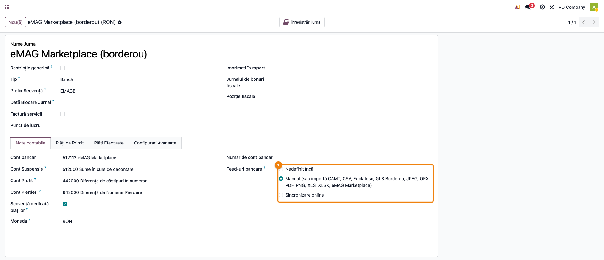
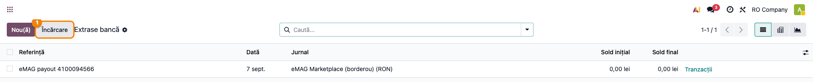
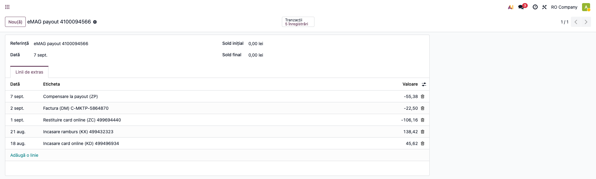

# Fișă Modul: Import borderou de plăți eMAG ca extras de cont

**Modul:** `deltatech_account_bank_statement_import_emag`
**Utilizator principal:** Contabil încasări, Operator marketplace
**Prioritate:** 🔴 Ridicată (la fiecare virare eMAG; fără el, zeci de încasări se operează manual)

---

## 1. Scop business

Comercianții care vând pe eMAG Marketplace nu încasează bani de la fiecare client în parte: eMAG
colectează încasările (card online și ramburs), își reține comisioanele și virează periodic o
**singură sumă** în contul comerciantului. Detalierea acelei virări este raportul **Account
statement details** (XLSX), descărcat din panoul de comerciant — numit uzual *borderou de plăți*.

Fără modul, borderoul ar trebui mapat coloană cu coloană în asistentul de import, iar sumele
interpretate manual: eMAG scrie valorile din perspectiva lui, deci încasările comerciantului apar
cu minus. Modulul încarcă **fișierul exact cum vine**, îl recunoaște singur, creează câte un extras
de cont pentru fiecare virare și pregătește liniile pentru reconciliere, cu clientul deja completat
acolo unde referința permite.

## 2. Bază legală și context

Nu există un temei legal specific — este un flux operațional de **reconciliere a încasărilor prin
marketplace**. Contextul contabil: banii încasați de eMAG de la clienți nu sunt încă în contul
bancar al comerciantului, deci tranzitează un cont propriu de **sume în curs de decontare** (un analitic al lui
5125, notat în fișă **5125.EMAG**, pe un jurnal dedicat eMAG), iar virarea efectivă în bancă se închide prin contul **581
„Viramente interne"** (OMFP 1802/2014, funcțiunea conturilor 512 și 581; pct. 302 alin. (2) cere
evidența distinctă a sumelor în curs de decontare în 5125).

Partenerul de decontare este **Dante International SA** (operatorul eMAG): el încasează pentru
comerciant, facturează comisioanele și face compensarea. Plătitorul din extrasul băncii poate fi
**HeyBlu Financial Services IFN SA** (instituția de plată din grupul eMAG, prin care pleacă virările);
HeyBlu nu este client sau furnizor al comerciantului și **nu primește sold** pe 4111, 401 sau 461.
Cine ține banii și cine are dreptul de compensare se verifică în contractul cu eMAG.

Creanța față de client se stinge la reconcilierea liniei de încasare, indiferent că banii au fost
încasați de eMAG în numele comerciantului.

## 3. Utilizatori și roluri

Contabilul care operează încasările și operatorul care administrează contul de marketplace.

Roluri recomandate pentru testare:
- Administrator funcțional: instalează modulul, creează jurnalul și contul de tranzit eMAG;
- Utilizator operațional: descarcă borderoul din panoul eMAG și îl încarcă în Odoo;
- Contabil/manager: reconciliază extrasul și verifică închiderea contului de tranzit.

## 4. Conturi și date implicate

> **Notație.** „5125.EMAG" și „473.EMAG" sunt nume simbolice în această fișă. În Odoo contul are un
> **cod numeric**, următorul analitic liber al sinteticului respectiv, după schema planului de conturi
> al companiei (de exemplu `512501` pentru un analitic al lui 5125, la coduri de 6 cifre), cu numele
> „Sume în curs de decontare — eMAG Marketplace". Peste tot în fișă, „5125.EMAG" înseamnă acel cont.

- **5125.EMAG „Sume în curs de decontare — eMAG Marketplace"** — cont dedicat jurnalului eMAG (banii aflați la eMAG);
- **4111 Clienți** — se închide la reconcilierea liniilor de încasare (KD, KX);
- **401 Furnizori** — facturile de comision emise de Dante International (DM), dacă sunt deja înregistrate;
- **461 Debitori diverși** (analitic Dante) — creanța față de Dante, la reclasificarea soldului din 5125.EMAG la închiderea lunii;
- **581 Viramente interne** — contrapartida liniei de virare (ZP), care se regăsește în extrasul băncii;
- **5121 Conturi la bănci** — unde intră efectiv virarea eMAG.

Date minime pentru demo:
- companie românească cu localizarea contabilă instalată;
- un jurnal de tip **Bancă** dedicat eMAG, în RON, cu cont tranzitoriu (suspense) configurat;
- un fișier *Account statement details* descărcat din eMAG (sau o mostră sintetică echivalentă);
- opțional, facturi de client postate, cu numărul comenzii eMAG în referință, pentru reconciliere.

Codurile de document care apar în borderou:

| Cod | Ce înseamnă | Semnul în fișierul eMAG |
|-----|-------------|-------------------------|
| `KD` | încasare card online | negativ |
| `KX` | încasare ramburs | negativ |
| `ZC` | restituire card online (retur) | pozitiv |
| `DM` | factură eMAG (comisioane, servicii) | pozitiv |
| `C3` | notificare de închidere pre-înrolare | pozitiv |
| `ZP` | virarea efectivă către comerciant | pozitiv, egal cu suma tuturor celorlalte cu semn schimbat |

## 5. Configurare inițială

1. Instalați modulul `deltatech_account_bank_statement_import_emag`.
2. Creați contul de tranzit: **Contabilitate → Configurare → Plan de conturi**, analiticul lui 5125
   (codul numeric liber, de ex. `512501`; în fișă **5125.EMAG**) „Sume în curs de decontare — eMAG Marketplace", de tip **Bancă și numerar** (altfel
   Odoo nu îl acceptă drept cont al jurnalului de tip Bancă; la acest tip reconcilierea se dezactivează
   singură și nici nu e necesară — în extras se reconciliază contul tranzitoriu, nu contul jurnalului).
   Pentru contul tranzitoriu (pasul de mai jos) creați și un analitic al lui 473 (în fișă **473.EMAG**) de tip *Active
   circulante*.
3. Creați jurnalul eMAG, cu setările din tabelul de mai jos (**Contabilitate → Configurare →
   Jurnale → Nou**).
4. Verificați că în lista formatelor de import ale jurnalului apare **eMAG Marketplace** — semnul că
   modulul e activ pe această instanță (vezi Pasul 1).

### Definirea jurnalului eMAG

Un jurnal separat pentru fiecare cont de vânzător eMAG și pentru fiecare monedă a borderoului
(coloana *Document currency*).

| Câmp (fila Setări avansate / Informații) | Valoare | De ce |
|---|---|---|
| **Tip** | *Bancă* | doar jurnalele de tip Bancă au import de extrase |
| **Nume** | `eMAG Marketplace (borderou)` | numele apare pe cardul din tabloul de bord |
| **Cod scurt** | `EMAGB` (max. 5 caractere) | să nu se suprapună cu un jurnal de vânzări `EMAG` existent |
| **Monedă** | aceeași cu *Document currency* din fișier (de regulă RON) | extrasul se creează în moneda din fișier; jurnalul trebuie să fie în aceeași monedă |
| **Cont bancă / de numerar** (`default_account_id`) | **5125.EMAG** „Sume în curs de decontare — eMAG Marketplace", tip *Bancă și numerar*, fără reconciliere | aici stau banii cât timp sunt la eMAG; **nu** se pune un cont 5121 și nici un cont de bancă real |
| **Cont tranzitoriu** (`suspense_account_id`) | recomandat un cont dedicat, analiticul **473.EMAG** (tip *Active circulante*); acceptabil contul implicit al planului românesc (**5125**) | primește contrapartida fiecărei linii importate, până la reconciliere; fără el Odoo refuză crearea liniilor de extras. Cu 5125 implicit, contrapartida se anulează pe sinteticul 5125 (părintele lui 5125.EMAG), iar un sold nereconciliat nu se mai poate atribui jurnalului eMAG |
| **Cont bancar (IBAN)** | se lasă gol | jurnalul nu reprezintă un cont bancar; banii ajung în IBAN-ul real abia la virare |
| **Feed-uri bancare** | *Import* (formatul **eMAG Marketplace** apare în listă) | activează butonul de încărcare pe cardul jurnalului |

Jurnalul **nu** se folosește pentru nimic altceva (plăți furnizori, încasări directe): tot ce intră
în 5125.EMAG trebuie să vină din borderou, ca soldul lui să rămână o verificare curată.

## 6. Flux de utilizare

### Pasul 1 — Configurarea jurnalului eMAG

Accesați **Contabilitate → Configurare → Jurnale** și deschideți jurnalul „eMAG Marketplace
(borderou)", definit conform tabelului din secțiunea 5. În secțiunea **Feed-uri bancare** trebuie să
apară, printre formatele de import acceptate, și **eMAG Marketplace** — semnul că modulul este activ
pe această instanță. Verificați tot aici că *Cont bancă / de numerar* este 5125.EMAG și că jurnalul
are cont tranzitoriu.

La import, modulul verifică singur dacă suma tuturor liniilor unei virări este zero. Fișierul eMAG
se închide pe zero prin construcție — linia `ZP` este negativul tuturor celorlalte — deci o sumă
diferită înseamnă că fișierul descărcat este incomplet, iar importul se oprește. Verificarea nu se
poate dezactiva: un extras parțial s-ar reconcilia pe jumătate și ar lăsa contul de tranzit cu un
sold care seamănă cu o diferență obișnuită de reconciliere, iar reîncărcarea fișierului complet nu
l-ar repara, fiindcă liniile deja aduse sunt sărite ca duplicate.



### Pasul 2 — Încărcarea borderoului original

Descărcați din panoul de comerciant eMAG raportul **Account statement details** pentru perioada
dorită. Nu îl deschideți și nu îl resalvați — se încarcă exact cum vine.

Din **Contabilitate → Tablou de bord**, pe cardul jurnalului eMAG, deschideți meniul **⋮** și
alegeți **Extrase**, apoi apăsați **Încărcare** și selectați fișierul. Modulul recunoaște borderoul
după coloanele din antet, deci **nu se mai deschide asistentul de mapare a coloanelor**.

> Contează de unde porniți importul: fișierul e recunoscut doar când îl încărcați **de pe jurnal**,
> pe drumul descris mai sus. Un „Import înregistrări" pornit din alt ecran (de pildă din lista de
> tranzacții bancare) ocolește modulul și deschide asistentul de mapare a coloanelor, chiar dacă
> fișierul e cel corect. Dacă ajungeți acolo, nu completați maparea — închideți și reluați de pe
> jurnal; vezi secțiunea 9.



### Pasul 3 — Verificarea extrasului importat

Se creează câte un extras pentru fiecare virare din fișier (grupare după *Clearing document*),
numit **eMAG payout &lt;număr virare&gt;**, cu data liniei `ZP`.

1. **Găsiți pe ecran**: fiecare linie poartă tipul documentului eMAG și referința (numărul comenzii
   pentru încasări, numărul facturii eMAG pentru comisioane). Clientul este completat automat acolo
   unde referința a putut fi identificată. Semnele sunt **inversate** față de fișier: încasările
   intră cu plus, virarea către bancă iese cu minus.
2. **Verificați**: numărul liniilor corespunde borderoului; soldul extrasului este **zero** (soldul
   inițial și cel final sunt ambele 0,00); linia `ZP` are exact valoarea încasării primite în bancă.
**Ce face importul pentru fiecare tip de linie (*Document code* / *Document type*)**

Pentru toate liniile: data = *Document date*; eticheta = *Document type* + *Reference ID*
(ex. `Incasare card online (KD) 499496934`); referința liniei = *Reference ID*; identificatorul unic
= `EMAG-<SAP document ID>`; **semnul = −*Document amount*** (încasările intră cu plus, ce iese spre
eMAG sau spre bancă intră cu minus). Rândurile *Initial balance* / *Actual balance* se sar.

| Cod | Document type | Sumă în fișier → în extras | Cum se află clientul / furnizorul | Ce face operatorul |
|---|---|---|---|---|
| `KD` | Incasare card online | negativă → **pozitivă** | comanda cu numărul din *Reference ID* (`client_order_ref`) → clientul comenzii | reconciliază cu factura clientului (sau cu avansul, dacă s-a plătit înainte de livrare) |
| `KX` | Incasare ramburs | negativă → **pozitivă** | la fel ca `KD` | reconciliază cu factura clientului |
| `ZC` | Restituire card online | pozitivă → **negativă** | la fel ca `KD` (comanda returnată) | reconciliază cu încasarea aceleiași comenzi (se anulează reciproc) sau cu nota de credit către client |
| `DM` | Factura (comisioane, servicii) | pozitivă → **negativă** | factura de furnizor din Odoo cu `ref` = *Reference ID* (`C-MKTP-…`, `A-MKTP-…`), dacă e unică → Dante International | reconciliază cu factura de furnizor, integral sau parțial |
| `C3` | Notificare închidere pre-înrolare | pozitivă → **negativă** | ca `DM` (`E-MKTP-…`) | tratată ca `DM`: reconciliază cu factura de furnizor corespunzătoare |
| `ZP` | Compensare la payout | pozitivă → **negativă** | **fără partener** (nu are *Reference ID*) | se reconciliază cu linia unică din extrasul băncii reale, prin 581; **data ei devine data extrasului** |

Dacă *Reference ID* nu se potrivește cu nicio comandă / factură sau se potrivește cu mai multe,
partenerul rămâne gol și se completează la reconciliere; linia se importă oricum. Un cod de document
nou, necunoscut, se importă la fel, cu semnul inversat și fără partener — nu blochează importul.


3. **Treceți mai departe**: reconciliați liniile de încasare cu facturile clienților, liniile `DM`
   cu facturile de comision primite de la eMAG, iar linia `ZP` cu virarea din extrasul bancar real,
   prin contul 581.



### Note de monografie și raportare

**La import** Odoo generează automat, pentru fiecare linie de extras, o notă între jurnalul eMAG și
contul tranzitoriu: pentru o linie pozitivă **Dr 5125.EMAG = Cr tranzitoriu**, pentru una negativă
**Dr tranzitoriu = Cr 5125.EMAG**. **La reconcilierea** liniei, contul tranzitoriu este înlocuit cu
contrapartida reală. Rezultatul final, pe tip de document:

| Cod | Operațiune | Nota după reconciliere | Cu ce se reconciliază |
|---|---|---|---|
| `KD` | încasare card online | **Dr 5125.EMAG = Cr 4111 Clienți** | factura clientului; dacă încasarea precede livrarea, vezi nota de TVA de mai jos (**Cr 419**) |
| `KX` | încasare ramburs | **Dr 5125.EMAG = Cr 4111 Clienți** | factura clientului |
| `ZC` | restituire card online | **Dr 4111 Clienți = Cr 5125.EMAG** (**Dr 419 = Cr 5125.EMAG** dacă încasarea inițială a mers pe avans) | de regulă se stinge cu încasarea (`KD`) a aceleiași comenzi; factura de stornare către client se emite separat |
| `DM` | factură de comision / servicii Dante | **Dr 401 Furnizori (Dante) = Cr 5125.EMAG** | factura de furnizor deja înregistrată (OMFP 1802, pct. 56 alin. (3): compensarea se face numai după contabilizarea creanțelor și datoriilor; valoarea brută se prezintă în notele explicative) |
| `C3` | notificare închidere pre-înrolare | **Dr 401 Furnizori (Dante) = Cr 5125.EMAG** | factura de furnizor cu `ref` = `E-MKTP-…`; tratament identic cu `DM` **doar dacă există factura Dante**. Fără factură, nota pe 401 nu are document justificativ (OMFP 1802, pct. 56 alin. (2)): provizoriu **Dr 473 = Cr 5125.EMAG**, apoi la primirea facturii **Dr 401 = Cr 473**, sau **Dr 6xx = Cr 473** dacă se stabilește că e o reținere fără factură. Natura documentului se verifică în contractul cu eMAG |
| `ZP` | virare către bancă | **Dr 581 Viramente interne = Cr 5125.EMAG** | linia unică din extrasul băncii reale; ambele linii se închid pe 581, deci verificarea este **sold 581 = 0** (reconcilierea pe 581 se face doar dacă contul o permite în baza voastră) |
| — | extrasul băncii reale (încasare de la Dante sau HeyBlu) | **Dr 5121 Bancă = Cr 581 Viramente interne** | linia `ZP`, prin 581 |

Verificare: pe o virare completă, suma liniilor `KD`+`KX`−`ZC`−`DM`−`C3` este egală cu `ZP`, deci
5125.EMAG iese pe zero (în borderoul Agroamat din 09.09.2026: 3.565,73 + 3.212,65 − 215,19 − 945,73
− 113,67 = 5.503,79).

Nu se folosește **Dr 5121 = Cr 4111** cu partener HeyBlu sau Dante (clientul este clientul final) și nici
**Dr 5121 = Cr 401 Dante** direct (suma virată este netă, iar pct. 56 cere evidența brută).

După reconcilierea completă a unei virări, contul de tranzit **5125.EMAG trebuie să ajungă la sold zero**
pe acea virare, la fel și contul tranzitoriu al jurnalului eMAG. Un sold rămas înseamnă o linie nereconciliată, nu o diferență de curs sau de rotunjire.

Banii ținuți la eMAG săptămâni întregi sunt, economic, o creanță față de Dante (pct. 57, prevalența
fondului economic). Dacă la închiderea lunii rămâne sold în 5125.EMAG, se reclasifică:
**Dr 461 Debitori diverși (Dante) = Cr 5125.EMAG**, ca să nu fie umflat numerarul în bilanț. Varianta
alternativă este să se țină creanța direct în 461 (Dr 5121 = Cr 461 Dante, fără 581).

**TVA la plata cu cardul înainte de livrare:** încasarea (`KD`) înainte de livrare este avans, cu TVA
exigibil la încasare (art. 282 alin. (2) lit. b) Cod fiscal). Dacă încasarea și livrarea cad în luni
diferite, se emite factură de avans și suma se ține în 419 (Dr 5125.EMAG = Cr 419), nu în 4111.

Modulul creează doar liniile de extras; contrapartidele (4111, 401, 581) rezultă din reconcilierea
standard Odoo, făcută de operator.

> Protecție la duplicate: fiecare linie primește un identificator unic de import
> (`EMAG-<SAP document ID>`), deci reîncărcarea aceluiași fișier nu dublează operațiunile.

### Comandă anulată după încasare

Clientul plătește cu cardul, comanda se anulează (de client sau de vânzător), iar eMAG restituie
banii. În borderou apar două linii pe același *Reference ID*: `KD` (încasarea) și `ZC` (restituirea),
cu aceeași sumă. Cazul e real: borderoul Agroamat din 01.08–09.09.2026 conține patru astfel de
perechi (de exemplu 14,95 încasat pe 26.08 și restituit pe 01.09; 106,16; 41,86; 52,22), toate în
aceeași virare, deci se anulează între ele în suma `ZP`.

Ce face importul: aduce ambele linii (`KD` cu plus, `ZC` cu minus) și le pune pe același client, găsit
după numărul comenzii; faptul că comanda e anulată nu oprește importul.

Ce face operatorul:

1. **Fără factură** (comanda a fost anulată înainte de livrare, deci nefacturată): reconciliază `KD` cu
   `ZC` direct între ele. Nota netă pe 4111 este zero, iar 5125.EMAG iese pe zero:
   **Dr 5125.EMAG = Cr 4111** (încasare) și **Dr 4111 = Cr 5125.EMAG** (restituire).
2. **Cu factură de avans emisă** (încasarea s-a ținut în 419): restituirea este **Dr 419 = Cr 5125.EMAG**,
   iar factura de avans se stornează, ca TVA-ul exigibil la încasare să fie regularizat.
3. **Restituirea vine într-o virare ulterioară** (anulare după ce încasarea a fost virată): `KD` rămâne
   în prima virare ca avans al clientului (credit nereconciliat în 4111 sau 419), până când `ZC` din
   virarea următoare îl stinge. Ambele extrase se închid pe zero fiecare; avansul se vede doar pe
   contul clientului.

Nu se emite factură de stornare pe o comandă care n-a fost facturată și nu se trece restituirea pe
cheltuială.

**Vouchere pe comanda anulată:** regula verificată este cea de la comenzile obișnuite — partea de
voucher suportată de eMAG nu e încasată de la client, ci este creanță la eMAG (decontul `V-MKTP`),
deci diferența dintre comandă și `KD` nu e rotunjire. Cum se restituie un voucher pe o comandă anulată
(dacă `ZC` iese pe suma plătită sau pe cea a comenzii) **nu e verificat pe un borderou real**: la
primul caz, verificați suma `ZC` față de `KD` și confirmați cu eMAG, înainte de a reconcilia diferența.

### Transportul în borderou

Borderoul **nu are linie sau cod de document pentru transport**: coloanele sunt cele ale raportului
*Account statement details*, iar codurile sunt doar `KD`, `KX`, `ZC`, `DM`, `C3` și `ZP`. Ce rezultă:

- **Transportul plătit de client** nu apare separat: este inclus în totalul liniei `KD` / `KX` a
  comenzii, iar importul o ia ca atare, fără s-o împartă pe produse și transport. Pe factura clientului
  transportul este o linie proprie, deci suma liniei de extras se compară cu **totalul facturii**, nu
  cu valoarea produselor.
- **Costul transportului sau al serviciilor facturate de eMAG** nu are linie proprie: dacă eMAG îl
  facturează, vine în facturile `DM` (`C-MKTP-…`, `A-MKTP-…`) sau `C3`, amestecat cu comisioanele. Ce
  conține fiecare factură se vede doar în factura de furnizor Dante, nu în borderou.
- **Livrare în locker, cu voucher:** partea de voucher aplicată pe transport nu intră pe factura
  clientului și scade din ramburs (comportamentul conectorului `deltatech_marketplace_emag`).

**Când suma încasată diferă de factură:** o diferență între linia `KD` / `KX` și totalul facturii poate
veni dintr-un voucher eMAG, dintr-o rotunjire (±0,01–0,06) sau dintr-un transport tratat diferit în
comandă față de factură. Borderoul nu spune care dintre ele; se stabilește pe comandă. În borderoul
Agroamat din 09.09.2026, din 64 de potriviri, 5 diferențe erau reale (−42,42; −27,55; −25,00; +29,80;
−0,90) și **cauza lor nu a fost confirmată** — nu se presupune transport sau voucher fără să se
verifice comanda.

## 7. Legături cu alte module / declarații

| Modul / proces | Rol în flux | Tip legătură |
|---|---|---|
| `account_bank_statement_import` (Enterprise) | mecanismul standard de import al extraselor | dependență (manifest) |
| `account_bank_statement_import_csv` (Enterprise) | interceptorul de wizard peste care modulul are prioritate | dependență (manifest) |
| `deltatech_account_bank_statement_import` | identificarea clientului după numărul comenzii; detecția fișierului după antet | dependență (manifest) |
| `deltatech_marketplace_emag` | importă comenzile eMAG și scrie numărul comenzii în referință — baza identificării automate a clientului | complementar (recomandat) |
| `deltatech_account_bank_statement_import_gls` / `..._euplatesc` | același tipar, pentru borderourile GLS și decontările Euplatesc | frați (opțional) |

Ce este automat: recunoașterea fișierului, sărirea rândurilor de sold, gruparea pe virări,
inversarea semnelor, completarea clientului, verificarea închiderii pe zero și protecția la duplicate.
Ce rămâne manual: reconcilierea liniilor cu facturile și închiderea contului 581 pe extrasul bancar.

## 8. Verificări pentru consultant

- [ ] Modulul se instalează fără erori și formatul **eMAG Marketplace** apare în lista formatelor de import de pe jurnal.
- [ ] Jurnalul eMAG are cont propriu de disponibilități și cont tranzitoriu configurat.
- [ ] Formatul „eMAG Marketplace" apare în secțiunea Feed-uri bancare a jurnalului.
- [ ] Un fișier *Account statement details* original se importă fără nicio prelucrare manuală și fără asistentul de mapare.
- [ ] Un fișier care acoperă mai multe virări produce **câte un extras per virare**, fiecare cu data liniei `ZP`.
- [ ] Soldul fiecărui extras importat este zero, iar linia `ZP` este egală cu suma primită în bancă.
- [ ] Încasările apar cu plus, virarea cu minus (semnele sunt inversate față de fișierul eMAG).
- [ ] Clientul este completat pe liniile de încasare ale căror comenzi există în Odoo.
- [ ] Un borderou incomplet (fără linia `ZP`) este refuzat cu mesajul de neînchidere.
- [ ] Reîncărcarea aceluiași fișier nu dublează liniile.
- [ ] După reconcilierea completă a unei virări, contul de tranzit are sold zero.
- [ ] O comandă anulată după încasare (`KD` + `ZC` pe același *Reference ID*) se reconciliază cu ea însăși și lasă 4111 pe zero.

## 9. Mesaje de eroare frecvente

| Mesaj / simptom | Cauză probabilă | Remediere |
|-----------------|-----------------|-----------|
| „Borderoul eMAG pentru virarea ... nu se închide pe zero: liniile însumează ... în loc de 0." | Fișierul descărcat este incomplet (interval de date care taie o virare în două) | Descărcați din eMAG virarea întreagă, nu un interval calendaristic, și reluați importul |
| „Fișierul eMAG nu conține nicio linie de extras." | Fișierul are doar rândurile de sold, fără operațiuni | Verificați perioada aleasă la descărcare |
| Se deschide asistentul de mapare a coloanelor în locul importului | Cel mai des: importul a fost pornit din alt ecran („Import înregistrări" pe lista de tranzacții), care ocolește modulul. Mai rar: fișierul nu e XLSX-ul original (a fost resalvat/convertit) sau îi lipsesc coloane din antet | Închideți asistentul fără să completați maparea și reluați importul **de pe jurnal** (pasul 2). Dacă și de acolo se deschide asistentul, reluați descărcarea din eMAG fără a deschide fișierul; dacă eMAG a schimbat structura raportului, trimiteți mostra către Terrabit |
| „You do not have enough rights to access the field «attachment_id» … (account.edi.document)" | Apare în asistentul de mapare: maparea automată a legat o coloană de câmpul „Document EDI", iar citirea lui cere drepturi de Setări | Nu este o problemă de drepturi ale utilizatorului și nu se rezolvă acordându-i-le — borderoul nu are nicio legătură cu documentele EDI. Închideți asistentul și importați de pe jurnal |
| „You already have imported that file." | Borderoul a fost deja importat | Nu e o eroare — verificați extrasul creat anterior |
| „You can't create a new statement line without a suspense account..." | Jurnalul nu are cont tranzitoriu configurat | Setați contul tranzitoriu pe jurnal |
| Clientul nu e completat pe unele linii de încasare | Comanda eMAG nu există în Odoo sau referința nu se potrivește unic | Completați manual partenerul la reconciliere; verificați importul comenzilor din `deltatech_marketplace_emag` |
| Contul de tranzit rămâne cu sold după reconciliere | O linie a rămas nereconciliată (frecvent o comandă neîncasată integral sau un voucher eMAG) | Identificați linia rămasă în widgetul de reconciliere |

## 10. Capturi de ecran

Capturile (`readme/screenshots/`) sunt **generate automat** din `tests/test_screenshots.py`
(mixinul `ScreenshotCase` din `l10n_ro_doc_screenshots`, import defensiv), în **limba română**, pe
compania „RO Company" în RON (`prepare_ro_company`):

1. `01_configurare_jurnal.png` — jurnalul eMAG: conturile și formatele de import, între care „eMAG Marketplace".
2. `02_incarcare_borderou.png` — lista Extrase bancă, de unde se încarcă fișierul original.
3. `03_extras_importat.png` — extrasul importat: liniile borderoului, semnele inversate, soldul zero.

Regenerare:

```bash
./odoo/odoo-bin -c odoo.conf -d <db> -i deltatech_account_bank_statement_import_emag,l10n_ro_doc_screenshots \
    --test-tags=fise_screenshots/deltatech_account_bank_statement_import_emag --stop-after-init
```

## 11. Observații pentru manual

Păstrați accentul pe promisiunea fluxului: **fișierul de la eMAG se încarcă exact cum vine**, fără
mapări de coloane și fără corectarea semnelor. Explicați rolul contului de tranzit („banii sunt la
eMAG, nu încă în bancă") și faptul că soldul lui trebuie să ajungă la zero după fiecare virare —
este cea mai simplă verificare că borderoul a fost reconciliat complet. Menționați și că virarea
`ZP` este contrapartida liniei din extrasul bancar real, nu o reținere a eMAG.
