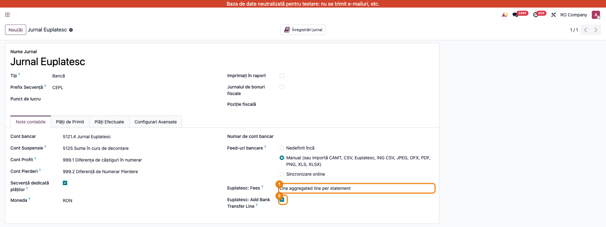
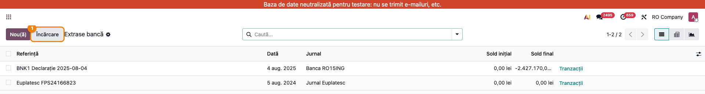
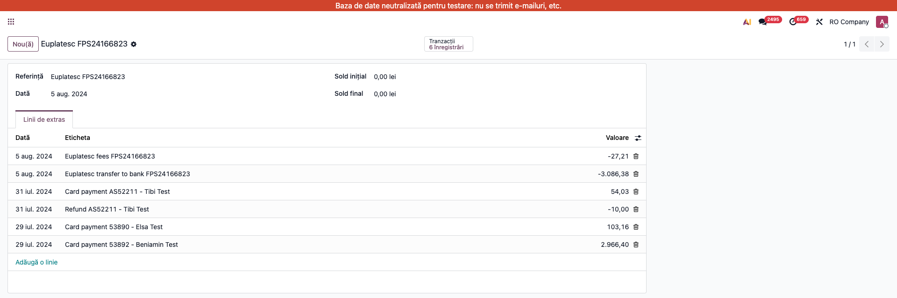

# Fișă Modul: Import decontări Euplatesc.ro ca extras de cont

**Modul:** `deltatech_account_bank_statement_import_euplatesc`
**Utilizator principal:** Contabil încasări, Operator e-commerce
**Prioritate:** 🟡 Medie (recurent la magazinele online cu plăți card prin Euplatesc)

---

## 1. Scop business

Magazinele online care încasează cu cardul prin procesatorul **Euplatesc.ro** primesc, la
fiecare decontare (lot „FPS..."), un fișier Excel de **detaliere**: tranzacțiile brute,
refund-urile și comisioanele reținute. Fără acest modul, fișierul trebuia prelucrat manual și
mapat în asistentul de import. Modulul importă **fișierul original** direct ca extras de cont
pe un jurnal de tip bancă dedicat („Jurnal Euplatesc"): o linie per plată cu cardul (cu numărul
comenzii web sau al facturii și numele clientului), refund-urile ca linii separate, comisionul
Euplatesc (configurabil) și, opțional, linia de echilibrare cu netul virat către bancă.

## 2. Bază legală și context

Nu există un temei legal specific — este un flux operațional de **reconciliere a încasărilor
prin procesator de plăți**. Contextul contabil: sumele decontate de Euplatesc tranzitează un
cont de „bani la procesator" (jurnal dedicat), comisionul se înregistrează pe cheltuieli
(**627 „Cheltuieli cu serviciile bancare și asimilate"**), iar virarea netului către contul
bancar real se închide prin **581 „Viramente interne"** (OMFP 1802/2014, funcțiunea conturilor).

## 3. Utilizatori și roluri

Contabil încasări, operator e-commerce care preia detalierile de la Euplatesc.

Roluri recomandate pentru testare:
- Administrator funcțional: instalează modulul și configurează jurnalul Euplatesc
- Utilizator operațional: încarcă detalierile primite la fiecare decontare
- Contabil/manager: reconciliază încasările cu facturile/comenzile și verifică comisioanele

## 4. Conturi și date implicate

- **cont dedicat jurnalului Euplatesc** (ex. 5125 analitic „Euplatesc" — banii la procesator);
- **4111 Clienți** — se închide la reconcilierea fiecărei plăți cu cardul;
- **627 Cheltuieli cu serviciile bancare** — contrapartida liniei de comision;
- **581 Viramente interne** — contrapartida liniei de transfer către bancă;
- **512x Conturi la bănci** — unde intră efectiv decontarea (pe extrasul băncii).

Date minime pentru demo:
- companie românească cu localizarea contabilă instalată;
- un jurnal de tip **Bancă** dedicat Euplatesc, în RON;
- un fișier de detaliere Euplatesc (mostră reală sau sintetică, un sheet per lot FPS);
- opțional, comenzi/facturi postate care corespund tranzacțiilor (pentru reconciliere).

## 5. Configurare inițială

1. Instalați modulul `deltatech_account_bank_statement_import_euplatesc` pe baza demo.
2. Creați un jurnal **Contabilitate → Configurare → Jurnale** de tip *Bancă*, numit de ex.
   „Jurnal Euplatesc", în moneda RON, cu un cont dedicat (ex. 5125 analitic).
3. Pe formularul jurnalului, tabul **Note contabile**, configurați:
   - **Euplatesc: Fees** — cum se importă comisioanele (Minim1RON + Diff1RON):
     *o linie agregată per extras* (implicit), *o linie per tranzacție* sau *deloc*;
   - **Euplatesc: Add Bank Transfer Line** (implicit bifată) — adaugă linia negativă cu netul
     virat către bancă, astfel încât extrasul se închide la zero.
4. Verificați că utilizatorul de test are drepturi de contabilitate.

> Cele două opțiuni ale modulului apar în engleză în formular („Euplatesc: Fees",
> „Euplatesc: Add Bank Transfer Line") — nu sunt încă traduse în română.

## 6. Flux de utilizare

### Pasul 1 — Configurarea jurnalului Euplatesc

Accesați **Contabilitate → Configurare → Jurnale** și deschideți jurnalul „Jurnal Euplatesc".
În tabul **Note contabile** se află cele două opțiuni ale modulului: modul de import
al comisioanelor și bifa pentru linia de transfer către bancă.



### Pasul 2 — Încărcarea detalierii originale

Din **Contabilitate → Tablou de bord**, pe cardul jurnalului „Jurnal Euplatesc", deschideți
meniul **⋮** și alegeți **Extrase** (secțiunea *Vizualizare*) — se deschide lista
**Extrase bancă**. Apăsați butonul **Încărcare** și alegeți fișierul de detaliere primit de
la Euplatesc — **nemodificat**. Modulul recunoaște fișierul după antetul de coloane
(MerchantID / InvoiceId / ... / RRN); nu se mai deschide asistentul de mapare. Se creează
câte un extras per lot de decontare (sheet „FPS...").

> Alternativ, același import se poate porni din meniul **⋮** al cardului, linkul
> **Importă fișier** (secțiunea *Nou*), sau trăgând fișierul peste lista de tranzacții.



### Pasul 3 — Verificarea extrasului importat

După import se creează extrasul **Euplatesc <FPS...>**, cu data încasării (data decontării).

1. **Găsiți pe ecran**: fiecare plată cu cardul are eticheta `Card payment <InvoiceId> - <client>`
   — `InvoiceId` este numărul comenzii web sau al facturii, iar referința liniei îl reia pentru
   reconciliere. Refund-urile (dacă există) apar ca linii negative `Refund ...`. Comisionul apare
   ca linie negativă `Euplatesc fees <FPS...>` (în modul agregat), iar ultima linie negativă
   `Euplatesc transfer to bank <FPS...>` este netul virat.
2. **Verificați**: brut − refund-uri − comisioane = netul din linia de transfer (cu ambele
   opțiuni active, soldul extrasului este zero); comisionul agregat corespunde totalului
   Minim1RON + Diff1RON din fișier; data extrasului = data încasării din fișier.
3. **Treceți mai departe**: reconciliați plățile cu facturile/comenzile (după InvoiceId),
   comisionul pe **627**, iar linia de transfer pe **581 Viramente interne**.



### Note de monografie și raportare

La reconcilierea extrasului de pe jurnalul Euplatesc:

- încasare card (per tranzacție): **Dr 5125 (Euplatesc) = Cr 4111 Clienți**;
- refund: **Dr 4111 Clienți = Cr 5125 (Euplatesc)**;
- comision Euplatesc: **Dr 627 Cheltuieli servicii bancare = Cr 5125 (Euplatesc)**
  (TVA nu se aplică — comision de procesare scutit, art. 292 alin. (2) lit. a) Cod Fiscal).
  Dacă totuși Euplatesc emite factură cu TVA pentru comision, comisionul se preia din
  factura de la furnizor (**Dr 627 + Dr 4426 = Cr 401**), nu direct din linia de extras;
- linia de transfer: **Dr 581 Viramente interne = Cr 5125 (Euplatesc)**;
- pe extrasul băncii reale, decontarea Euplatesc se închide: **Dr 5121 Bancă = Cr 581**.

Modulul **nu postează** note contabile singur — creează liniile de extras; notele rezultă din
reconcilierea standard Odoo (widget bancar + reguli de reconciliere, ex. regulă pe 627 pentru
liniile de comision).

> Protecție la duplicate: fiecare tranzacție primește un id unic de import (`EPL-<RRN>`);
> reimportul aceluiași fișier este detectat și refuzat.

## 7. Legături cu alte module / declarații

| Modul / proces | Rol în flux | Tip legătură |
|---|---|---|
| `account_bank_statement_import` (Enterprise) | mecanismul standard de import extrase | dependență (manifest) |
| `account_bank_statement_import_csv` (Enterprise) | interceptorul de wizard peste care modulul are prioritate | dependență (manifest) |
| `deltatech_account_bank_statement_import_gls` | același tipar pentru borderourile GLS | frate (opțional) |
| `l10n_ro_account_bank_statement_import_ing_csv` | extrasul ING în care sosește decontarea | complementar (opțional) |
| `sale` / e-commerce | comenzile web (`InvoiceId`) — baza identificării automate a partenerului (faza următoare) | opțional |

Ce este automat: detecția fișierului, un extras per lot FPS, liniile de plată/refund, comisionul
(pe modul configurat), linia de transfer, protecția la duplicate.
Ce rămâne manual: reconcilierea liniilor cu facturile/comenzile (asistată de widgetul bancar),
regula de reconciliere pentru 627 și închiderea 581 pe extrasul băncii reale.

## 8. Verificări pentru consultant

- [ ] Modulul se instalează fără erori pe baza demo.
- [ ] Jurnalul afișează opțiunile „Euplatesc: Fees" și „Euplatesc: Add Bank Transfer Line".
- [ ] O detaliere Euplatesc originală se importă fără nicio prelucrare manuală.
- [ ] Se creează câte un extras per sheet FPS, cu data încasării din fișier.
- [ ] Fiecare plată conține InvoiceId (comandă web / factură) și numele clientului.
- [ ] Refund-urile apar ca linii negative separate.
- [ ] Comisionul respectă modul configurat (agregat / per tranzacție / deloc) și totalul
      Minim1RON + Diff1RON din fișier.
- [ ] Brut − refund − comision = netul liniei de transfer; soldul extrasului e zero.
- [ ] Reimportul aceluiași fișier este refuzat (mesaj standard Odoo, în engleză:
      „You already have imported that file.").

## 9. Mesaje de eroare frecvente

| Mesaj / simptom | Cauză probabilă | Remediere |
|-----------------|-----------------|-----------|
| „The Euplatesc file does not contain any settled transaction." | Fișier gol sau sheet fără rânduri cu RRN | Verificați fișierul primit; cereți retransmiterea detalierii |
| „You already have imported that file." | Detalierea a fost deja importată (id unic per RRN) | Nu e o eroare — liniile există deja; verificați extrasul creat anterior |
| „Cannot find in which journal to import this statement..." | Jurnalul nu e în RON (moneda detalierii) sau importul s-a făcut de pe alt jurnal | Importați de pe jurnalul Euplatesc configurat în RON |
| „You can't create a new statement line without a suspense account..." | Jurnalul nu are cont tranzitoriu (suspense) configurat | Setați contul tranzitoriu pe jurnal (Contabilitate → Configurare → Jurnale) |
| Fișierul deschide asistentul de mapare în loc de import direct | Antetul nu corespunde formatului Euplatesc (alt export) | Verificați că e detalierea Euplatesc originală; alte formate se importă prin asistent |
| Soldul extrasului nu e zero | Comisioanele setate pe „deloc" dar linia de transfer activă | Aliniați opțiunile jurnalului (transferul scade mereu și comisioanele reale) |

## 10. Capturi de ecran

Capturile (`readme/screenshots/`) sunt **generate automat** din `tests/test_screenshots.py`
(mixinul `ScreenshotCase` din `l10n_ro_doc_screenshots`, import defensiv), în **limba română**,
pe compania „RO Company" în RON (`prepare_ro_company`):

1. `01_configurare_jurnal.png` — jurnalul Euplatesc, opțiunile de comision și transfer.
2. `02_incarcare_detaliere.png` — lista Extrase bancă, cu butonul „Încărcare" evidențiat.
3. `03_extras_importat.png` — extrasul importat: plăți card, refund, comision agregat, transfer.

Regenerare:

```bash
./odoo/odoo-bin -c odoo.conf -d <db> -i deltatech_account_bank_statement_import_euplatesc,l10n_ro_doc_screenshots \
    --test-tags=fise_screenshots --stop-after-init
```

## 11. Observații pentru manual

Păstrați accentul pe cele trei „bucăți de bani" din fiecare decontare — brut, refund, comision —
și pe verificarea că netul virat corespunde încasării din extrasul băncii reale. Explicați
opțiunile jurnalului (comision agregat vs per tranzacție) și recomandați o regulă de
reconciliere pe 627 pentru liniile de comision.
