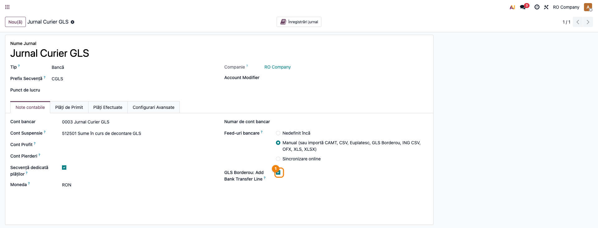
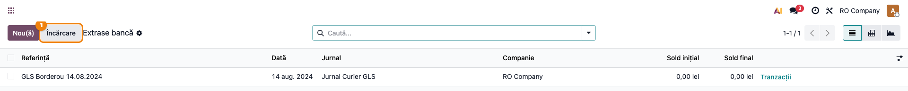
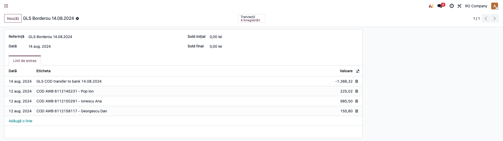

# Fișă Modul: Import borderou ramburs GLS ca extras de cont

**Modul:** `deltatech_account_bank_statement_import_gls`
**Utilizator principal:** Contabil încasări, Operator e-commerce
**Prioritate:** 🟡 Medie (zilnic la magazinele online cu plata ramburs prin GLS)

---

## 1. Scop business

Magazinele online care livrează cu plata ramburs prin GLS primesc periodic un **borderou**
(fișier Excel) cu sumele încasate de curier de la destinatari și virate în banca firmei.
Fără acest modul, fișierul trebuia „curățat" manual (șters antetul și rândul de total) și
mapat coloană cu coloană în asistentul de import — operație repetitivă și predispusă la erori.
Modulul importă **fișierul original, exact cum vine de la GLS**, direct ca extras de cont pe un
jurnal de tip bancă („Jurnal Curier"): o linie per colet (cu numărul AWB și destinatarul) plus,
opțional, o linie de echilibrare cu totalul virat către bancă.

## 2. Bază legală și context

Nu există un temei legal specific — este un flux operațional de **reconciliere a încasărilor
ramburs**. Contextul contabil: sumele încasate de curier tranzitează un cont de „bani în curs
de decontare" (jurnal dedicat curierului), iar virarea către contul bancar real se închide
prin contul **581 „Viramente interne"** (OMFP 1802/2014, funcțiunea conturilor).

## 3. Utilizatori și roluri

Contabil încasări, operator e-commerce care preia borderourile de la GLS.

Roluri recomandate pentru testare:
- Administrator funcțional: instalează modulul și configurează jurnalul de curier
- Utilizator operațional: încarcă borderourile primite pe e-mail de la GLS
- Contabil/manager: reconciliază încasările cu facturile și verifică soldul jurnalului

## 4. Conturi și date implicate

- **cont dedicat jurnalului de curier** (ex. 5125 analitic „GLS ramburs" — banii aflați la curier);
- **4111 Clienți** — se închide la reconcilierea fiecărei linii de ramburs;
- **581 Viramente interne** — contrapartida liniei de transfer către bancă;
- **512x Conturi la bănci** — unde intră efectiv transferul GLS (pe extrasul băncii).

Date minime pentru demo:
- companie românească cu localizarea contabilă instalată;
- un jurnal de tip **Bancă** dedicat curierului GLS, în RON;
- un fișier borderou GLS (mostră reală sau sintetică, cu preambul + linii + total);
- opțional, facturi de client postate care corespund rambursurilor (pentru reconciliere).

## 5. Configurare inițială

1. Instalați modulul `deltatech_account_bank_statement_import_gls` pe baza demo.
2. Creați un jurnal **Contabilitate → Configurare → Jurnale** de tip *Bancă*, numit de ex.
   „Jurnal Curier GLS", în moneda RON, cu un cont dedicat (ex. 5125 analitic).
3. Pe formularul jurnalului, tabul **Note contabile**, verificați opțiunea
   **GLS Borderou: Add Bank Transfer Line** (implicit bifată): adaugă automat linia negativă
   cu totalul virat către bancă, astfel încât extrasul se închide la zero.
4. Verificați că utilizatorul de test are drepturi de contabilitate (facturare/contabil).

## 6. Flux de utilizare

### Pasul 1 — Configurarea jurnalului de curier

Accesați **Contabilitate → Configurare → Jurnale** și deschideți jurnalul „Jurnal Curier GLS".
În tabul **Note contabile**, sub sursa extraselor, se află bifa
**GLS Borderou: Add Bank Transfer Line**. Lăsați-o activă dacă vreți ca fiecare borderou să
producă și linia de transfer către bancă (recomandat — extrasul se echilibrează la zero).



### Pasul 2 — Încărcarea borderoului original

Din **Contabilitate → Tablou de bord**, pe cardul jurnalului „Jurnal Curier GLS", deschideți
meniul **⋮** și alegeți **Extrase** (secțiunea *Vizualizare*) — se deschide lista
**Extrase bancă**. Apăsați butonul **Încărcare** și alegeți fișierul primit de la GLS —
**nemodificat**, cu tot cu antet și rândul de total. Modulul recunoaște automat borderoul
după semnătura GLS din prima celulă; nu se mai deschide asistentul de mapare a coloanelor.

> Alternativ, același import se poate porni din meniul **⋮** al cardului, linkul
> **Importă fișier** (secțiunea *Nou*), sau trăgând fișierul peste lista de tranzacții.



### Pasul 3 — Verificarea extrasului importat

După import se creează un extras numit **GLS Borderou <data transferării banilor>**, cu data
din preambulul fișierului.

1. **Găsiți pe ecran**: fiecare linie de ramburs are eticheta `COD AWB <număr colet> - <destinatar>`,
   referința = numărul de referință GLS, iar numele destinatarului apare în coloana Partener
   (ca text, până la identificarea partenerului). Ultima linie, negativă, este
   `GLS COD transfer to bank <data>` — totalul virat către bancă.
2. **Verificați**: numărul liniilor de ramburs corespunde borderoului; suma liniilor pozitive
   este egală cu totalul din fișier (modulul refuză importul dacă nu corespunde); cu linia de
   transfer inclusă, soldul extrasului este zero.
3. **Treceți mai departe**: reconciliați liniile pozitive cu facturile clienților (după AWB /
   nume destinatar) și linia negativă cu contul **581 Viramente interne**.



### Note de monografie și raportare

La reconcilierea extrasului de pe jurnalul de curier:

- încasare ramburs (per colet): **Dr 5125 (GLS ramburs) = Cr 4111 Clienți**;
- linia de transfer către bancă: **Dr 581 Viramente interne = Cr 5125 (GLS ramburs)**;
- pe extrasul băncii reale (ex. ING), încasarea „TRANSFER RAMBURS" de la GLS se închide:
  **Dr 5121 Bancă = Cr 581 Viramente interne**.

Modulul **nu postează** note contabile singur — creează liniile de extras; notele rezultă din
reconcilierea standard Odoo (widget bancar + reguli de reconciliere).

> Protecție la duplicate: fiecare colet primește un id unic de import (`GLS-<AWB>`); reimportul
> aceluiași borderou este detectat și refuzat.

## 7. Legături cu alte module / declarații

| Modul / proces | Rol în flux | Tip legătură |
|---|---|---|
| `account_bank_statement_import` (Enterprise) | mecanismul standard de import extrase | dependență (manifest) |
| `account_bank_statement_import_csv` (Enterprise) | interceptorul de wizard peste care modulul are prioritate | dependență (manifest) |
| `deltatech_account_bank_statement_import_euplatesc` | același tipar pentru decontările Euplatesc | frate (opțional) |
| `l10n_ro_account_bank_statement_import_ing_csv` | extrasul ING în care sosește transferul GLS | complementar (opțional) |
| `stock_delivery` / integrare GLS | AWB-ul (`carrier_tracking_ref`) pe livrări — baza identificării automate a partenerului (faza următoare) | opțional |

Ce este automat: detecția fișierului, parcurgerea preambulului/totalului, crearea extrasului și
a liniilor, verificarea totalului, protecția la duplicate, linia de transfer (dacă e bifată).
Ce rămâne manual: reconcilierea liniilor cu facturile (asistată de widgetul bancar) și
închiderea 581 pe extrasul băncii reale.

## 8. Verificări pentru consultant

- [ ] Modulul se instalează fără erori pe baza demo.
- [ ] Jurnalul de curier afișează bifa „GLS Borderou: Add Bank Transfer Line" în formular.
- [ ] Un borderou GLS original (cu antet și total) se importă fără nicio prelucrare manuală.
- [ ] Extrasul creat poartă data transferării banilor din preambulul fișierului.
- [ ] Fiecare linie de ramburs conține AWB-ul și destinatarul; referința = numărul GLS.
- [ ] Suma liniilor pozitive = totalul din fișier; cu linia de transfer, soldul extrasului e zero.
- [ ] Reimportul aceluiași fișier este refuzat (mesaj standard Odoo, în engleză:
      „You already have imported that file.").
- [ ] Un XLSX care nu e borderou GLS urmează fluxul vechi (asistentul de mapare), neschimbat.

## 9. Mesaje de eroare frecvente

| Mesaj / simptom | Cauză probabilă | Remediere |
|-----------------|-----------------|-----------|
| „The GLS borderou total (...) does not match the sum of the lines (...)" | Fișier GLS trunchiat sau modificat manual | Cereți borderoul original de la GLS și reîncărcați-l nemodificat |
| „You already have imported that file." | Borderoul a fost deja importat (id unic per AWB) | Nu e o eroare — liniile există deja; verificați extrasul creat anterior |
| „Cannot find in which journal to import this statement..." | Jurnalul nu e în RON (moneda borderoului) sau importul s-a făcut de pe alt jurnal | Importați de pe jurnalul de curier configurat în RON |
| „You can't create a new statement line without a suspense account..." | Jurnalul nu are cont tranzitoriu (suspense) configurat | Setați contul tranzitoriu pe jurnal (Contabilitate → Configurare → Jurnale) |
| Fișierul deschide asistentul de mapare în loc de import direct | Fișierul nu are semnătura GLS în prima celulă (alt format/export) | Verificați că e borderoul GLS original; alte formate se importă prin asistent |
| „Could not find the column header row in the GLS borderou file." | Structura fișierului diferă (antetul de coloane lipsește/alt nume) | Trimiteți mostra către Terrabit pentru extinderea parserului |

## 10. Capturi de ecran

Capturile (`readme/screenshots/`) sunt **generate automat** din `tests/test_screenshots.py`
(mixinul `ScreenshotCase` din `l10n_ro_doc_screenshots`, import defensiv), în **limba română**,
pe compania „RO Company" în RON (`prepare_ro_company`):

1. `01_configurare_jurnal.png` — jurnalul de curier, tabul cu opțiunea „GLS Borderou: Add Bank Transfer Line".
2. `02_incarcare_borderou.png` — lista Extrase bancă, cu butonul „Încărcare" evidențiat.
3. `03_extras_importat.png` — extrasul importat: linii de ramburs cu AWB + linia de transfer negativă.

Regenerare:

```bash
./odoo/odoo-bin -c odoo.conf -d <db> -i deltatech_account_bank_statement_import_gls,l10n_ro_doc_screenshots \
    --test-tags=fise_screenshots --stop-after-init
```

## 11. Observații pentru manual

Păstrați accentul pe promisiunea fluxului: **fișierul de la GLS se încarcă exact cum vine** —
fără șters antet, fără mapări de coloane. Explicați rolul jurnalului de curier ca „bani la
curier" și închiderea prin 581 pe extrasul băncii reale, cu verificarea că totalul borderoului
corespunde încasării „TRANSFER RAMBURS" din bancă.
