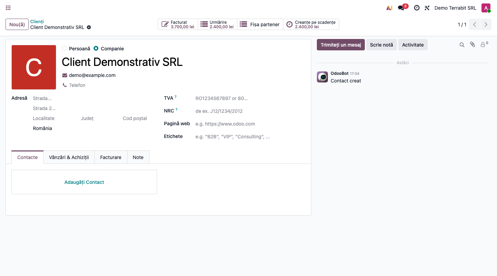
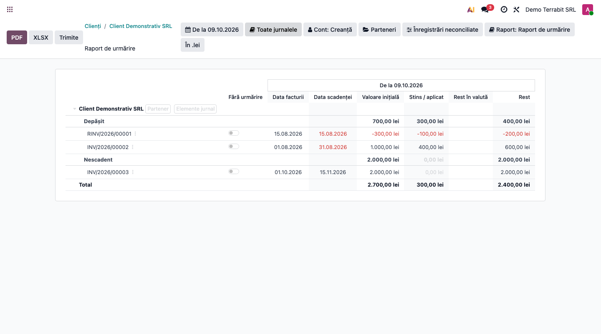
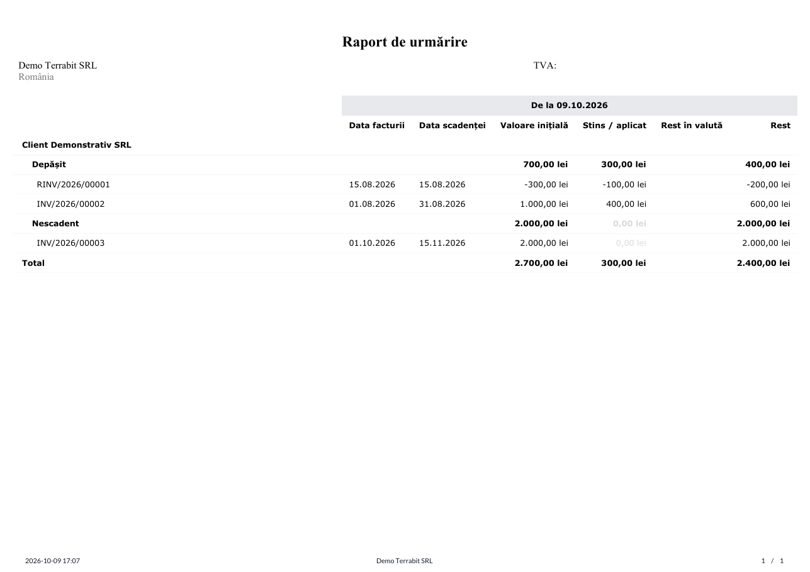
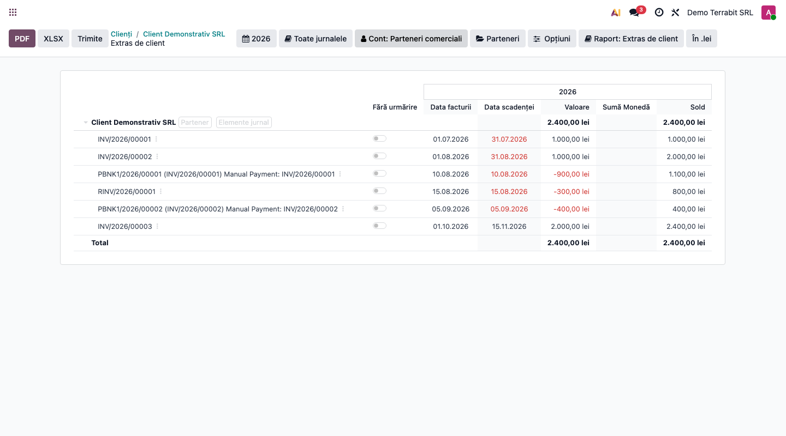
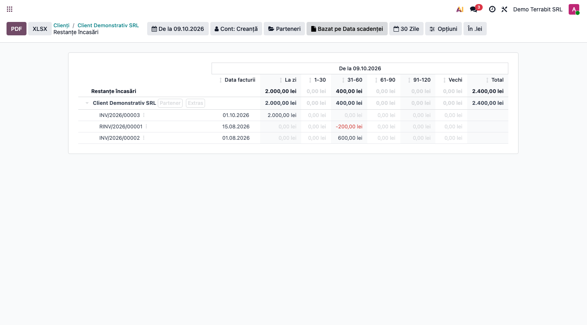
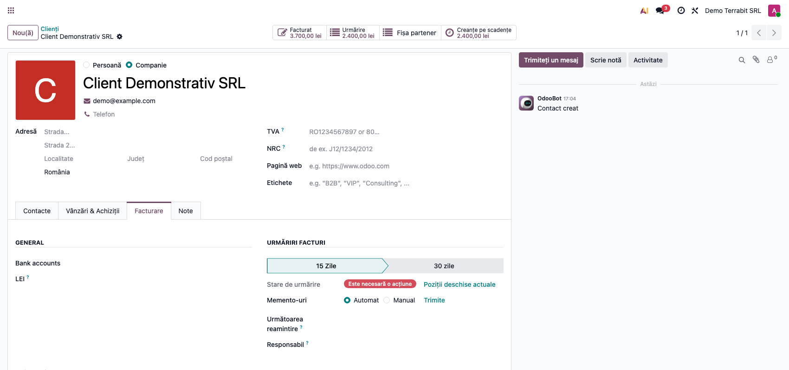
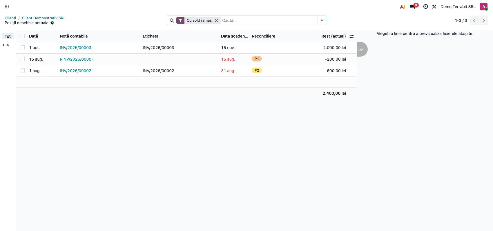
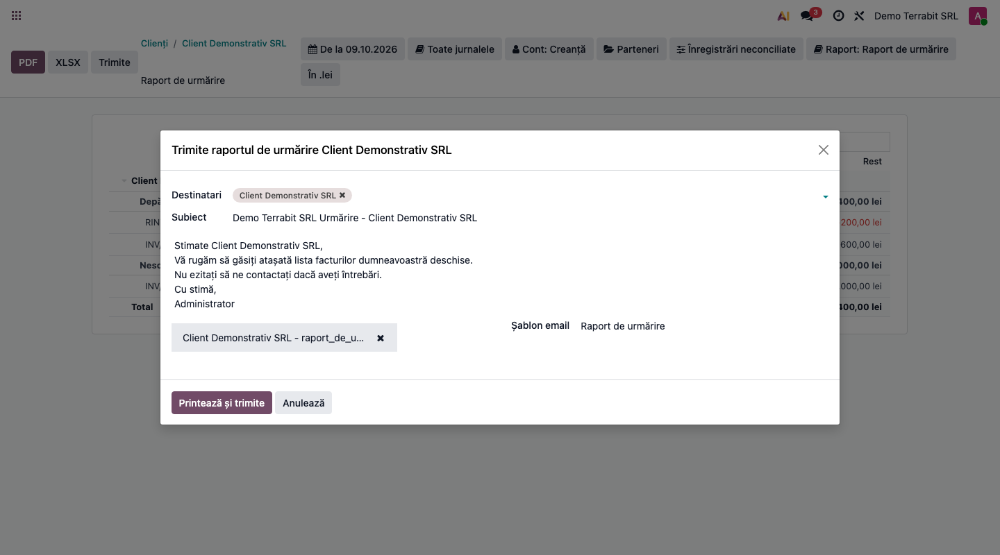

# Fișă Modul: Urmărire clienți cu sold rămas la zi

**Modul:** `deltatech_account_enterprise`
**Utilizator principal:** Contabil clienți, responsabil de încasări
**Prioritate:** 🟡 Medie (rapoartele de urmărire sunt folosite zilnic, dar modulul doar corectează cifrele rapoartelor native Enterprise)

---

## 1. Scop business

Raportul nativ de urmărire (follow-up) arăta facturile și notele de credit parțial decontate cu
suma lor inițială, deși o parte fusese deja încasată sau compensată. Totalul afișat nu mai
corespundea cu ce are de încasat firma. Modulul păstrează rapoartele native (urmărire, extras de
client, creanțe pe scadențe, exporturile și fereastra de trimitere) și corectează doar cifrele: arată
separat **Valoare inițială**, **Stins / aplicat** și **Rest**, la data aleasă în raport.

## 2. Bază legală și context

Modulul nu are un temei legal propriu. Este un instrument operațional de urmărire a creanțelor,
peste contul **4111 „Clienți”** (OMFP 1802/2014). Nu modifică înregistrări contabile, nu face
reconcilieri și nu scrie taxe: citește reconcilierile parțiale existente.

## 3. Utilizatori și roluri

- **Contabil clienți / responsabil de încasări** — deschide raportul de urmărire, verifică restul
  de încasat și trimite memento-uri.
- **Contabil șef** — compară soldul din urmărire cu extrasul de client și cu balanța pe scadențe.
- Butoanele de pe fișa partenerului sunt vizibile pentru grupurile **Facturare** și **Contabilitate
  (doar citire)**; regulile de acces (record rules) se aplică în continuare.

## 4. Conturi și date implicate

| Cont | Rol |
|---|---|
| 4111 „Clienți” (și 4118 etc.) | conturile de creanță pe care se bazează rapoartele din modul |
| 5121 / 5311 | încasările care decontează facturile |
| 707 / 4427 | venituri și TVA colectată (nu sunt afectate de modul) |

Date minime pentru demo (cele din capturi):
- companie românească, plan de conturi RO, moneda RON; facturile din capturi sunt fără TVA (cifre rotunde);
- un client cu: factura **INV/2026/00001** de 1.000 lei, decontată prin plată de 900 lei și 100 lei din
  nota de credit; factura **INV/2026/00002** de 1.000 lei, cu 400 lei încasați; factura
  **INV/2026/00003** de 2.000 lei cu scadența în viitor; nota de credit **RINV/2026/00001** de
  300 lei, din care 100 lei aplicați.

## 5. Configurare inițială

1. Instalați modulul `deltatech_account_enterprise` (dependențe: `account`, `account_accountant`,
   `account_reports`, `account_followup`).
2. Verificați că firma are planul de conturi RO și nivelurile de urmărire din **Facturare →
   Configurare → Facturare → Nivelurile Urmaririlor** (meniu pentru Administrator contabilitate).
3. Opțional, în **Setări → Facturare**, opțiunea **Reamintire înainte de scadență** (în engleză „Reminder Before Due Date”) (memento cu o zi
   înainte de scadență, adăugată de modul în versiunea 19.0.0.1.0) creează nivelul de urmărire
   corespunzător; nu influențează cifrele descrise în această fișă.

## 6. Flux de utilizare

### Pasul 1 — Deschiderea fișei partenerului

Accesați **Facturare → Clienți → Clienți** și deschideți partenerul. Pe fișă apar patru butoane:
**Facturat**, **Urmărire**, **Fișa partener** și **Creanțe pe scadențe**. Verificați pe ecran:

- butonul **Urmărire** arată soldul semnat al pozițiilor eligibile (exemplu: 2.400,00 lei), nu doar
  partea restantă;
- **Creanțe pe scadențe** arată același total (2.400,00 lei);
- **Fișa partener** nu afișează un total pe buton și deschide raportul **Extras de client** (istoricul nativ);
- **Facturat** (3.700,00 lei) este totalul facturat net, inclusiv facturile deja decontate, deci diferă de rest.

### Pasul 2 — Raportul de urmărire (sold rămas la zi)

Apăsați **Urmărire**. Raportul grupează pozițiile în **Depășit** și **Nescadent**. Găsiți pe ecran
coloanele **Valoare inițială**, **Stins / aplicat** și **Rest**. Verificați:

- pentru fiecare linie, **Valoare inițială − Stins / aplicat = Rest** (INV/2026/00002: 1.000 − 400 =
  600; RINV/2026/00001: −300 − (−100) = −200);
- subtotalul **Depășit** = 400,00 lei (600 − 200) și **Nescadent** = 2.000,00 lei;
- **Total** = 2.700,00 inițial, 300,00 stins / aplicat, 2.400,00 rest;
- facturile complet decontate (INV/2026/00001) și plățile **nu** apar în urmărire;
- nota de credit apare cu semn negativ, cu restul ei de −200,00 lei.

### Pasul 3 — Export PDF și XLSX

După ce ați citit cifrele pe ecran, apăsați **PDF** (sau **XLSX**). Fișierul trebuie să conțină exact
aceleași valori, inclusiv subtotalurile Depășit / Nescadent și Totalul. În exportul XLSX verificat,
valorile numerice sunt: Depășit 700 / 300 / 400, Nescadent 2.000 / 0 / 2.000, Total 2.700 / 300 /
2.400.

### Pasul 4 — Extrasul de client (istoric)

Din fișa partenerului apăsați **Fișa partener**, care deschide raportul **Extras de client**. Este raportul istoric nativ: arată și mișcările
decontate (facturi, plăți, nota de credit) și coloana **Sold** este soldul cumulat. Verificați că
soldul final (2.400,00 lei) este egal cu **Rest**-ul din urmărire, pentru aceeași dată.

### Pasul 5 — Creanțe pe scadențe

Apăsați **Creanțe pe scadențe**, care deschide raportul **Restanțe încasări**. Raportul nativ de vechime arată pozițiile pe intervale: 2.000,00 lei
**La zi** (nescadent) și 400,00 lei în intervalul **31-60** (600,00 factura minus 200,00 nota de
credit). Totalul este 2.400,00 lei, ca în urmărire. Această balanță include și pozițiile marcate
**Fără urmărire**.

### Pasul 6 — Poziții deschise actuale

Pe fișa partenerului, în tabul **Facturare**, secțiunea **Urmăriri facturi** (în RO „URMĂRIRI FACTURI”), apăsați linkul
**Poziții deschise actuale**.

Se deschide lista nativă de elemente de jurnal, intitulată **Poziții deschise actuale**, filtrată pe liniile cu rest diferit de zero, cu
coloana **Rest (actual)** și totalul ei (2.400,00 lei). Debit, Credit și Sold rămân disponibile ca
coloane opționale. Lista arată restul **de azi**: o reconciliere cu dată viitoare poate face ca ea să
difere de un raport la o dată anterioară.

### Pasul 7 — Trimiterea memento-ului

În raportul de urmărire, **Trimite** deschide fereastra nativă de trimitere, cu destinatarul,
subiectul, mesajul și PDF-ul atașat. Modulul nu trimite mesaje singur; apăsați **Anulează** dacă doar
verificați.

### Note de monografie și raportare

Modulul nu generează note contabile. Cifrele provin din cele existente. În exemplul din capturi,
facturile sunt fără TVA, ca să rămână cifre rotunde; la o vânzare cu TVA 21% notele sunt cele de
mai jos, iar restul se calculează pe totalul cu TVA.

| Operațiune | Dr | Cr |
|---|---|---|
| Factură client 1.210 lei (1.000 + TVA 210) | 4111 1.210 | 707 1.000 + 4427 210 |
| Încasare 900 lei | 5121 / 5311 900 | 4111 900 |
| Încasare parțială 400 lei | 5121 / 5311 400 | 4111 400 |
| Notă de credit 363 lei (300 + TVA 63) | 707 300 + 4427 63 | 4111 363 |

Decontarea dintre nota de credit și factură (în exemplu, 100 lei) este doar o reconciliere parțială,
fără notă contabilă separată.

Restul din urmărire = soldul conturilor de creanțe-clienți (4111, 4118 etc.) ale partenerului, pe
pozițiile deschise la data raportului, fără pozițiile marcate **Fără urmărire**.

## 7. Legături cu alte module / declarații

| Modul | Rol |
|---|---|
| `account_reports` | motorul rapoartelor (urmărire, extras, vechime), exporturi, wizard Trimite |
| `account_followup` | niveluri de urmărire, memento-uri automate / manuale |
| `account` | reconcilierile parțiale pe care se bazează restul |
| `account_accountant` | dependență Enterprise, widgetul de reconciliere |

**Automat:** calculul restului la data raportului, subtotalurile pe stări, excluderea pozițiilor
**Fără urmărire** în ecran și în PDF.
**Manual:** alocarea plăților, trimiterea memento-urilor, marcarea pozițiilor **Fără urmărire**.

## 8. Verificări pentru consultant

- [ ] Pentru fiecare linie: Valoare inițială − Stins / aplicat = Rest.
- [ ] Totalul **Rest** din urmărire = totalul din **Creanțe pe scadențe** = soldul din **Fișa
      partener** la aceeași dată, dacă nu există poziții **Fără urmărire** și partenerul nu are
      solduri de furnizor (extrasul le include).
- [ ] Butonul **Urmărire** de pe fișă = totalul **Rest** din raport.
- [ ] Subtotalurile **Depășit** / **Nescadent** rămân corecte la paginare (raport cu multe linii).
- [ ] Factura complet decontată nu apare în urmărire, dar apare în **Fișa partener**.
- [ ] Nota de credit parțial aplicată apare cu semn negativ și rest negativ.
- [ ] O poziție marcată **Fără urmărire** lipsește și din PDF, nu doar din ecran.
- [ ] Un plătitor cu mai multe persoane de contact: raportul grupează după partenerul comercial.
- [ ] PDF și XLSX au aceleași cifre ca ecranul.
- [ ] Raportul funcționează la fel în română și în engleză (etichetele **Depășit / Nescadent**).

## 9. Mesaje de eroare frecvente

| Mesaj / simptom | Cauză probabilă | Remediere |
|---|---|---|
| Butoanele de urmărire lipsesc de pe fișa partenerului | Utilizatorul nu are drept de facturare / contabilitate | Acordați grupul **Facturare** sau **Contabilitate (doar citire)** |
| Totalul din urmărire diferă de lista **Poziții deschise actuale** | O reconciliere are dată ulterioară datei raportului | Setați în raport data de azi |
| Raportul nu arată o factură deschisă | Poziția e marcată **Fără urmărire** sau contul nu e de creanță | Verificați comutatorul **Fără urmărire** și filtrul **Cont: Creanță** |
| Coloana **Rest în valută** e goală | Pozițiile sunt în moneda companiei | Normal: coloana se completează la pozițiile în valută |

## 10. Capturi de ecran

Capturile (`readme/screenshots/`) au fost generate în română, pe plan de conturi RO, cu date
sintetice (partener demonstrativ), dintr-o bază de test: un script Playwright a deschis fiecare ecran
și l-a salvat. Modulul nu are `tests/test_screenshots.py`, deci nu se regenerează automat.

1. `01_fisa_partener.png` — fișa partenerului, cu butoanele de urmărire.
2. `02_urmarire.png` — raportul de urmărire cu Valoare inițială / Stins / Rest.
3. `03_urmarire_pdf.png` — PDF-ul raportului de urmărire.
4. `04_extras_client.png` — extrasul de client (istoric).
5. `05_creante_pe_scadente.png` — creanțe pe scadențe.
6. `06_tab_facturare.png` — tabul Facturare, linkul Poziții deschise actuale.
7. `07_pozitii_deschise_actuale.png` — lista pozițiilor deschise actuale.
8. `08_trimite_wizard.png` — fereastra de trimitere a raportului.

Filtrul de dată arată „De la 09.10.2026”: în acest raport înseamnă „la data de 09.10.2026” (traducere nativă).

Capturile `followup-residuals.jpg`, `current-open-items.jpg` și `native-aged-receivable.jpg` sunt cele
din `USAGE.md`. Extrasul XLSX nu e inclus ca imagine; valorile lui sunt în Pasul 3.

## 11. Observații pentru manual

- Explicați întâi problema (suma inițială afișată pentru un document parțial decontat), apoi regula
  **Valoare inițială − Stins / aplicat = Rest**.
- Păstrați exemplul unic din capturi (2.700 inițial, 300 aplicat, 2.400 rest; 400 depășit, 2.000
  nescadent) în toate ecranele.
- Subliniați diferența dintre cele trei rapoarte: urmărirea arată pozițiile deschise la dată, extrasul
  arată istoricul cu mișcările decontate, balanța pe scadențe grupează pe intervale.
- Precizați că **Poziții deschise actuale** reflectă restul de azi, nu un raport la o dată din trecut.
