# Fișă Modul: Planificare avansată producție & livrări (Advanced Planner)

**Modul:** `deltatech_advanced_planner`
**Utilizator principal:** Planificator producție, Responsabil achiziții, Vânzător (la ofertare)
**Prioritate:** 🟡 Medie (modul specializat APS — important pentru producătorii cu cerere variabilă și termene ferme)

---

## 1. Scop business

Modulul `deltatech_advanced_planner` adaugă în Odoo capabilități de tip **APS (Advanced Planning &
Scheduling)** pe care planificarea nativă nu le acoperă: răspunde concret la întrebarea vânzătorului
și a logisticianului — *„Data de livrare promisă clientului este realizabilă, ținând cont de stocul
disponibil, lead time-urile furnizorilor și durata reală a producției?"*. Pornind de la data dorită
(`commitment_date`) a comenzii de vânzare, calculează **înapoi pe calendarul de lucru** (backward
scheduling) datele de lansare achiziții, recepție componente, start și final producție, verifică
**capacitatea reală a posturilor de lucru** (RCCP/CRP) și emite un verdict semaforizat: **OK /
Avertisment / Blocat**. Pentru cererile fără SO (transferuri, consum intern) generează automat
comenzi de reaprovizionare ca să prevină stocul negativ.

Consultantul folosește documentul pentru reproducerea fluxului în baza demo și pentru pregătirea
capitolului de manual dedicat planificării.

## 2. Bază legală și context

Modulul **nu are bază legală fiscală** — nu generează note contabile și nu alimentează declarații
ANAF. Este un instrument **operațional** de planificare a producției și aprovizionării.

Contextul de utilizare: producători sau distribuitori care promit clienților date ferme de livrare și
care au nevoie să valideze fezabilitatea acestor date înainte de confirmarea comenzii. Modulul
acoperă selectiv funcții APS (backward scheduling, capacitate finită, netting cronologic) **fără
integrări externe** de tip frePPLe / APS4MFG.

## 3. Utilizatori și roluri

- **Vânzător / Ofertant** — rulează planificatorul din fază de ofertă (SO ciornă) ca să comunice o
  dată realistă clientului.
- **Planificator producție** — revizuiește comenzile planificate, urmărește capacitatea (CRP) și
  nivelează supraîncărcările.
- **Responsabil achiziții** — lansează RFQ-urile din comenzile planificate de tip achiziție.
- **Manager logistică** — monitorizează tabloul Risc de livrare, rulează planificarea globală și
  gestionează escaladările.

Grupuri de acces livrate de modul:
- **Advanced Planner / User** (`group_planner_user`) — acces operațional (citire, recalculare,
  vizualizări).
- **Advanced Planner / Manager** (`group_planner_manager`) — în plus: planificare globală, nivelare
  CRP, ștergere comenzi planificate, fixare (firming).

## 4. Date implicate (nu există conturi contabile)

Modulul **nu folosește conturi contabile** — efectul contabil apare ulterior, în mod standard, când
RFQ-urile devin comenzi de achiziție recepționate și ordinele de producție se finalizează.

Date minime pentru demo:
- companie cu **calendar de lucru** definit pe posturile de lucru (atendanțe + eficiență
  `time_efficiency`);
- **liste de materiale (BOM)** pe mai multe niveluri (subansamblu → componentă → materie primă), cu
  operații pe posturi de lucru (`time_cycle_manual`, `time_start`, `time_stop`);
- **furnizori** cu lead time (`delay`) și cantitate minimă de comandă (`min_qty` / MOQ) pe
  `product.supplierinfo`;
- **stoc inițial** pe produse și componente;
- **comenzi de vânzare** cu produs cu BOM și `commitment_date` (data dorită de livrare) completată.

## 5. Configurare inițială

1. Instalați modulul `deltatech_advanced_planner` pe baza demo (depinde de `sale_management`, `mrp`,
   `purchase`, `stock`, `resource`, `mail`).
2. Deschideți **Setări → Inventar → Advanced Planner** și verificați parametrii: safety buffer (zile),
   lead time achiziție/producție implicit, zile expediere operator→client, adâncime maximă BOM,
   comportament la dată imposibilă (avertizare sau blocare confirmare SO), retenție log-uri,
   replanificare automată la schimbare dată, fereastră consolidare RFQ, detecție abateri zilnică,
   prag escaladare.
3. Asigurați-vă că posturile de lucru au **calendar de lucru** și `time_efficiency` setate (intră în
   calculul RCCP al lead time-ului de producție).
4. Verificați că furnizorii componentelor au `delay` (lead time) și, unde e cazul, `min_qty` (MOQ).
5. Verificați că utilizatorul de test are grupul **Advanced Planner / User** (și Manager pentru
   acțiunile globale).

## 6. Flux de utilizare

### Pasul 1 — Configurarea parametrilor planificatorului

În **Setări → Inventar → Advanced Planner** stabiliți marja de siguranță și lead time-urile
implicite. Acestea sunt folosite ori de câte ori datele de pe produs/furnizor lipsesc.

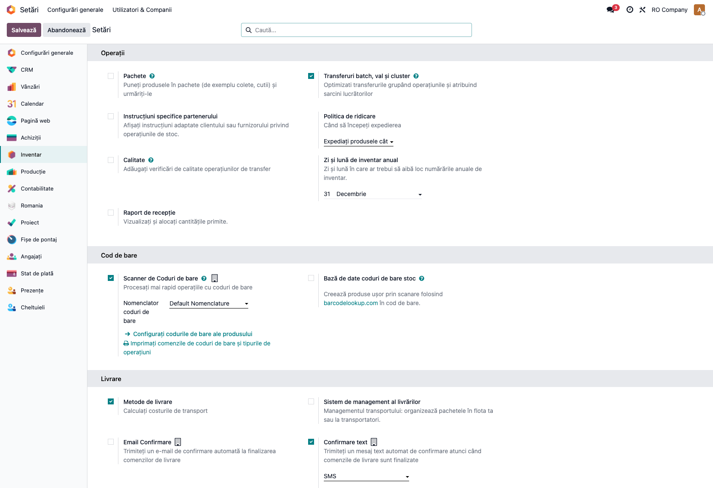

### Pasul 2 — Planificare din ofertă (simulare, SO ciornă)

Pe o comandă de vânzare în stare **Ciornă**, completați `commitment_date` și apăsați **Recalculate
Planning** (buton din antet). Planificatorul calculează backward/forward și afișează un **banner
semaforizat** (verde/galben/roșu) cu data efectivă realizabilă, fără să rezerve stoc sau să genereze
comenzi reale. Comenzile planificate se creează în stare **Ciornă** (simulare).

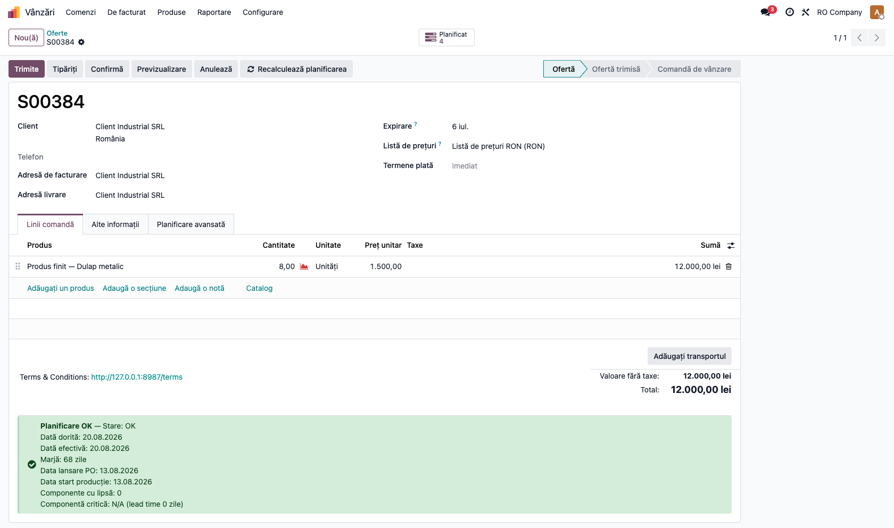

### Pasul 3 — Confirmarea comenzii și planificarea automată

La **Confirmare** comanda de vânzare, planificatorul rulează automat. Tabul **Planificare avansată** de
pe SO arată statusul (`OK` / `Avertisment` / `Blocat`), riscul de livrare, data efectivă calculată și
zilele rămase până la termen.

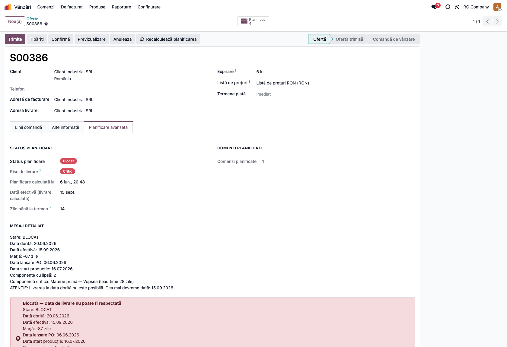

### Pasul 4 — Revizuirea comenzilor planificate

Din **Producție → Planificare avansată → Planificare → Planned Orders** vedeți comenzile planificate, cu
ierarhia BOM și statusul colorat per linie. Cele de tip producție au datele de start/final producție;
cele de tip achiziție au data de lansare și recepție per componentă.

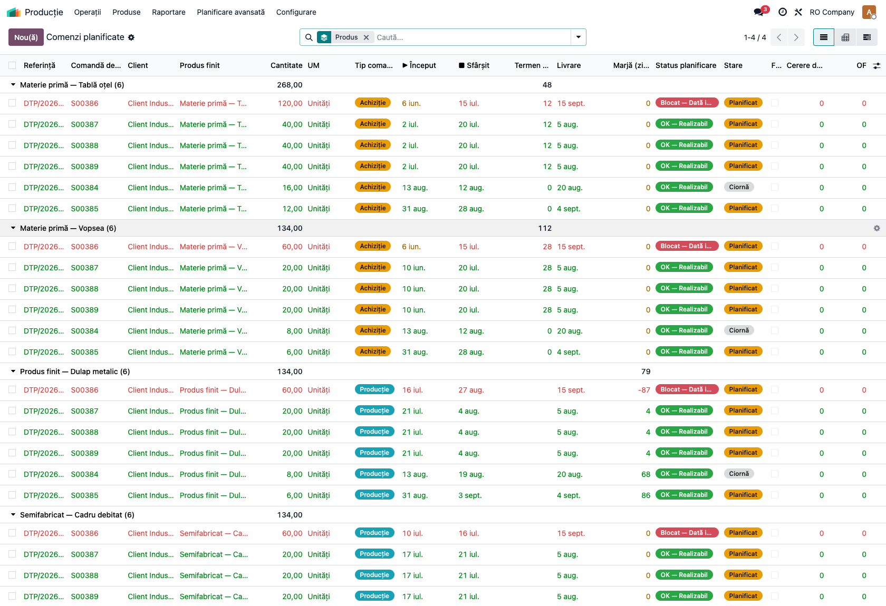

### Pasul 5 — Lansarea manuală a RFQ / OF

Pe formularul unei comenzi planificate, butonul din antet diferă după tipul comenzii: pe o comandă
de **producție** apare **Generează OF** (ordin de fabricație / MO), iar pe o comandă de **achiziție**
apare **Generează RFQ** (cerere de ofertă) — ambele cu verificare de duplicat. RFQ-urile pentru
același furnizor cu dată apropiată se **consolidează** automat într-un singur PO (fereastra
configurabilă din Setări). Comenzile reale **nu** se creează automat — se lansează aici, după
revizuire. Captura arată o comandă de producție blocată, cu mesajul detaliat de planificare.

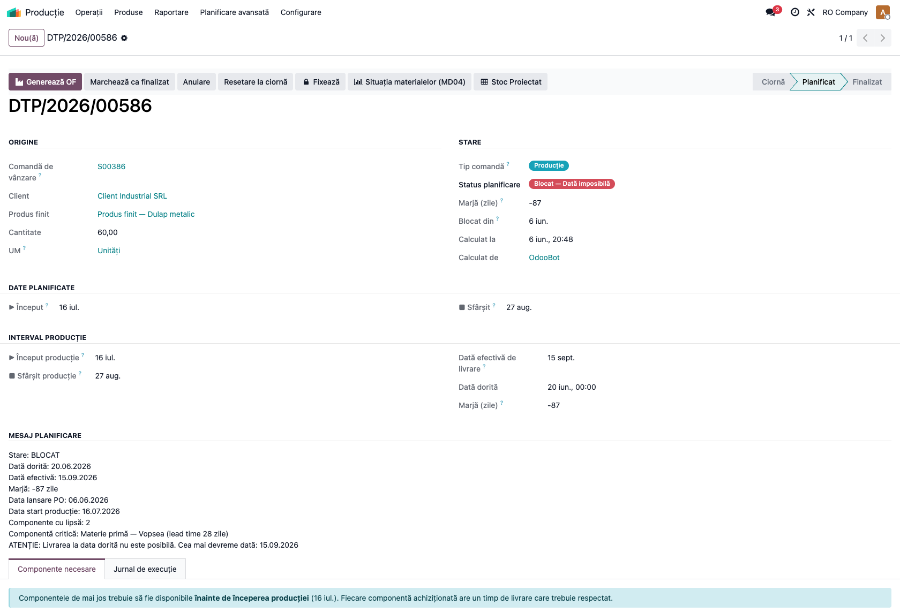

### Pasul 6 — Situație Material (proiecție cronologică per produs)

**Producție → Planificare avansată → Materiale → Material Situation** afișează stocul **proiectat
cronologic** la fiecare mișcare, cu trasabilitate completă SO → AP → PO/MO → mișcare de stoc (coloana
Origine / pegging). Se poate salva ca snapshot și exporta în PDF/Excel.

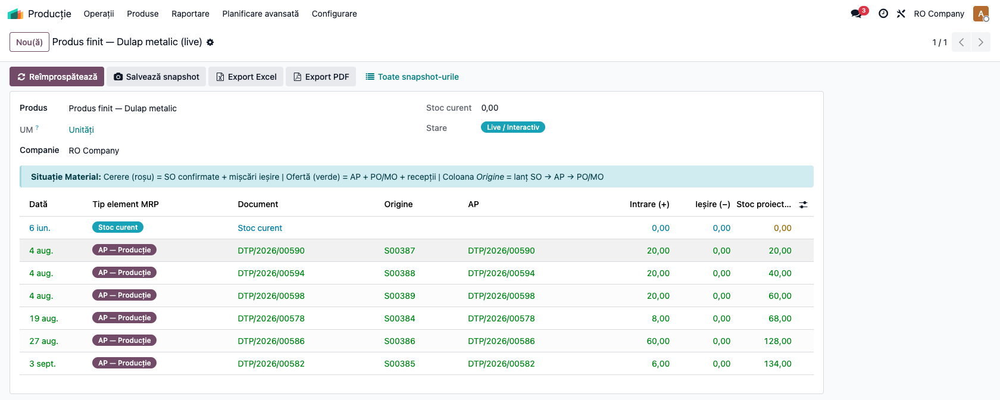

### Pasul 7 — Stoc Proiectat Agregat (tip SAP MRP)

**Materiale → Stoc Proiectat** oferă ecranul agregat cross-SO per produs: toate elementele MRP
(comenzi client, comenzi achiziție, comenzi planificate, ordine producție, intrări) sortate
cronologic, cu stoc proiectat cumulativ, **ATP (Available to Promise)** și detecție shortage cu banner
roșu; pegging FIFO complet și export Excel.

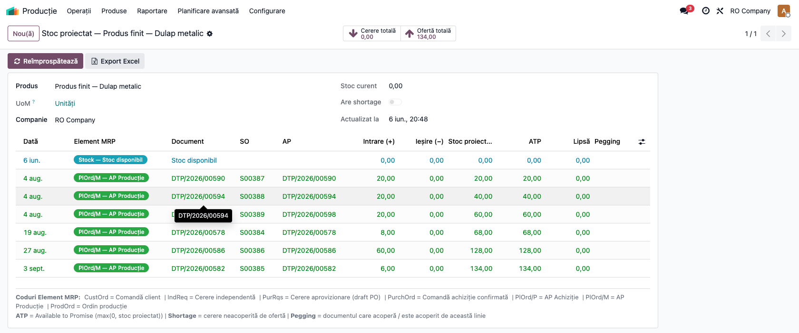

### Pasul 8 — Încărcarea posturilor de lucru (Workcenter Load)

**Capacitate → Workcenter Load** arată încărcarea per (post de lucru × săptămână) cu pivot, grafic și
liste colorate (roșu >100%, galben 80–100%, verde ≤80%). Se regenerează la fiecare planificare.

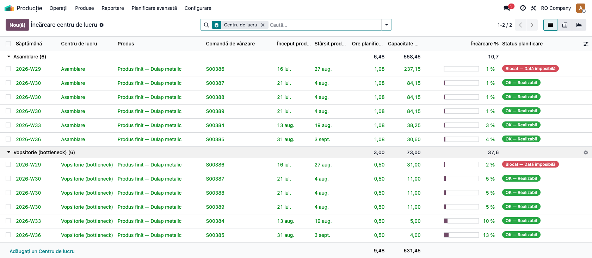

### Pasul 9 — CRP și nivelarea capacității

**Capacitate → CRP — Capacitate** agregă orele cerute vs. capacitatea nominală per (post × săptămână),
cu status `ok / warning / overloaded`. Din **Nivelare CRP** (Manager) rulați nivelarea greedy:
comenzile cu cel mai mult slack se mută cu +7 zile, cu cascadă recursivă pe comenzile copil neFixate;
opțiunea `dry_run` previzualizează fără a modifica.

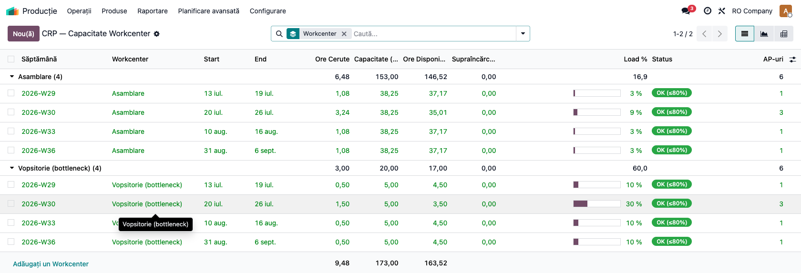

### Pasul 10 — Planificarea globală (batch)

**Planificare → Global Planning** (Manager) rulează planificatorul pe toate comenzile active, sortate
după `commitment_date` ascendent (cele urgente au prioritate la stoc). Netting-ul componentelor
folosește o alocare globală partajată (fără supraplanificarea aceluiași stoc), iar un lock PostgreSQL
previne rulările concurente. Butonul „Vezi blocate" deschide direct comenzile blocate după rulare.

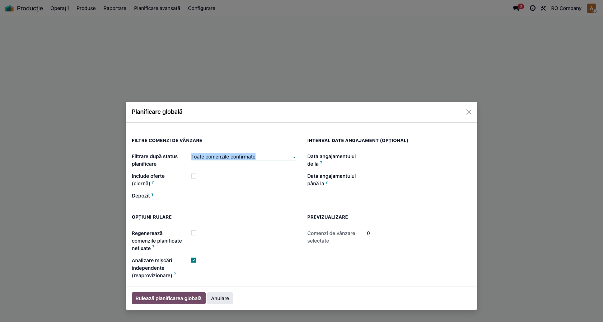

### Pasul 11 — Risc de livrare (monitorizare proactivă)

**Producție → Planificare avansată → Risc de livrare** listează comenzile de vânzare marcate **La
risc** sau **Critic**, sortate după data promisă, cu semaforizare și contoare „zile până la termen"
vs. „zile încă necesare". Butonul **Comenzi cu risc** deschide comenzile planificate cauzatoare, iar
**Escaladează** creează o activitate de tip „de făcut" pentru responsabil (comunicare proactivă cu
clientul).

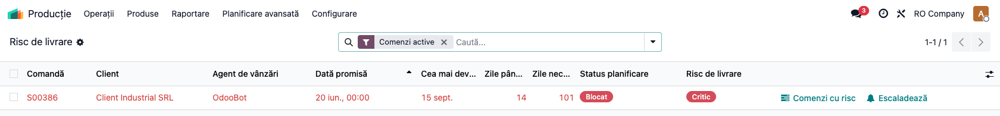

### Pasul 12 — Dashboard operațional & KPI

**Planificare avansată → Dashboard** sintetizează: contori SO (ok/warning/blocked/reaprovizionare),
OTIF 30/90 zile, trend blocări noi/zi, posturi bottleneck și top produse cu blocări active.

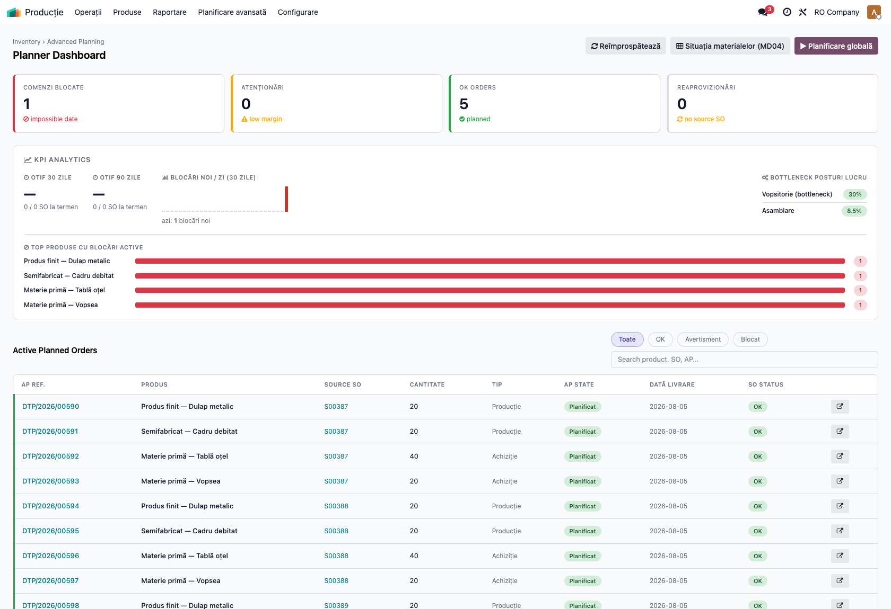

### Ce generează planificatorul (rezultate operaționale)

Modulul **nu generează note contabile** (Dr/Cr). Rezultatele unei rulări sunt:

- **Comenzi planificate** (`advanced.planned.order`) de tip producție (cu ierarhie BOM) și achiziție
  (per componentă cu shortage), în stare `draft → planned → done / cancelled`;
- **statusul de planificare** pe SO (`OK` / `Avertisment` / `Blocat`) + data efectivă și riscul de
  livrare;
- **RFQ-uri și MO-uri** doar la lansare manuală (cu consolidare RFQ);
- **sincronizarea livrărilor**: pe SO confirmate, mișcările de livrare primesc legătura AP și data
  efectivă (`scheduled_date` pe picking);
- **log de execuție** detaliat (`advanced.planner.log`).

Efectul **contabil** apare ulterior, standard: recepția PO (NIR) și finalizarea MO generează notele
contabile uzuale de stoc/producție — nu prin acest modul.

## 7. Legături cu alte module / declarații

| Modul / proces | Rol în flux | Tip legătură |
|---|---|---|
| `sale_management` | comenzile de vânzare și data dorită (`commitment_date`) — punctul de pornire | dependență (manifest) |
| `mrp` | liste de materiale, operații, posturi de lucru, ordine de producție | dependență (manifest) |
| `purchase` | RFQ / comenzi de achiziție generate din comenzile planificate | dependență (manifest) |
| `stock` | stoc disponibil, mișcări, picking-uri de livrare, reaprovizionare | dependență (manifest) |
| `resource` | calendarul de lucru folosit la backward scheduling și RCCP | dependență (manifest) |
| `mail` | chatter, activități și notificări de escaladare | dependență (manifest) |
| `l10n_ro_doc_screenshots` | generarea automată a capturilor pentru fișă/manual | opțional (doar testare) |

**Ce este automat:** netting cronologic, backward scheduling, RCCP/CRP, statusul semaforizat,
sincronizarea livrărilor, detecția zilnică a abaterilor și escaladarea (dacă sunt activate din Setări),
reaprovizionarea independentă.

**Ce rămâne manual:** lansarea RFQ-urilor și a ordinelor de producție din comenzile planificate,
revizuirea comenzilor de reaprovizionare (create în `draft`), fixarea (firming) comenzilor care nu
trebuie recalculate și decizia de nivelare a capacității.

## 8. Verificări pentru consultant

- [ ] Modulul se instalează fără erori pe baza demo.
- [ ] Meniul **Producție → Planificare avansată** și submeniurile sunt vizibile pentru rolul potrivit.
- [ ] Recalcularea pe un SO ciornă afișează bannerul de status și o dată efectivă plauzibilă.
- [ ] La confirmarea SO se generează comenzi planificate (producție + achiziție per componentă).
- [ ] Backward scheduling produce date coerente (lansare PO < recepție < start producție < final).
- [ ] O comandă cu termen imposibil este marcată **Blocat** și propune cea mai devreme dată realizabilă.
- [ ] RFQ-ul și MO-ul se generează manual din comanda planificată, fără duplicate.
- [ ] Situația Material și Stocul Proiectat afișează proiecția cronologică și ATP corect.
- [ ] Workcenter Load / CRP reflectă supraîncărcările; nivelarea (dry_run) previzualizează mutările.
- [ ] Tabloul Risc de livrare listează comenzile la risc; butonul Escaladează creează o activitate.
- [ ] Exporturile PDF/Excel se descarcă și conțin datele testate.

## 9. Mesaje de eroare frecvente

| Mesaj / simptom | Cauză probabilă | Remediere |
|-----------------|-----------------|-----------|
| „Order … cannot be confirmed: the requested delivery date is not achievable." | Parametrul „Comportament la dată imposibilă" este setat pe **block_so** și data promisă nu e realizabilă | Mutați `commitment_date` la data efectivă propusă sau setați comportamentul pe „doar avertizare" în Setări |
| O rulare globală este sărită / „o altă planificare globală rulează deja" | Lock PostgreSQL — o a doua rulare globală simultană (alt utilizator sau cron) | Așteptați finalizarea rulării curente și reluați |
| SO marcat **N/A** (not_applicable) la planificare | Niciun produs de pe comandă nu are listă de materiale (BOM) | Definiți BOM pentru produsul finit sau ignorați — planificatorul se aplică doar produselor cu BOM |
| Comanda rămâne **Blocat** deși există stoc | Intrările (PO) sosesc **după** `commitment_date` — corect cronologic, nu reduc disponibilul la termen | Devansați recepția PO sau ajustați data promisă |
| Lead time de producție pare prea mic/mare | Posturile de lucru nu au calendar/eficiență, sau produsul are `ap_production_lead_time` setat manual (ignoră RCCP) | Configurați calendarul și `time_efficiency` pe posturi; goliți lead time-ul manual de pe produs dacă vreți RCCP |
| Capturile nu se generează | Modulul `l10n_ro_doc_screenshots` nu este instalat | Instalați-l și rulați testul de capturi (vezi secțiunea 10) |

## 10. Capturi de ecran

Capturile (`readme/screenshots/`) se **generează automat** dintr-un test Playwright
(`tests/test_screenshots.py`, mixinul `ScreenshotCase` din `l10n_ro_doc_screenshots`, import
defensiv), în **limba română**, pe planul de conturi RO. Ordinea corespunde exact pașilor din
secțiunea 6:

1. `01_setari_planificator.png` — parametrii planificatorului în Setări → Inventar.
2. `02_so_recalcul_oferta.png` — comandă de vânzare în ofertă, cu banner de status după recalcul.
3. `03_so_banner_confirmat.png` — tabul Planificare avansată pe SO confirmat (status + dată efectivă + risc).
4. `04_planned_orders.png` — lista comenzilor planificate cu ierarhie BOM și status colorat.
5. `05_planned_order_form.png` — formular comandă planificată de producție cu butonul Generează OF.
6. `06_material_situation.png` — Situație Material: stoc proiectat cronologic cu pegging.
7. `07_stock_projection.png` — Stoc Proiectat Agregat cu elemente MRP, ATP și shortage.
8. `08_workcenter_load.png` — Workcenter Load: pivot și grafic încărcare per săptămână.
9. `09_crp.png` — CRP: ore cerute vs. capacitate pe săptămâni.
10. `10_global_planning.png` — wizardul de planificare globală.
11. `11_delivery_risk_board.png` — tabloul Risc de livrare semaforizat.
12. `12_dashboard.png` — dashboard cu contori și KPI de planificare.

Testul `tests/test_screenshots.py` seedează un mediu de producție determinist (posturi de lucru cu
calendar + eficiență, BOM pe 2 niveluri cu operații, furnizori cu lead time + MOQ, stoc parțial) și
rulează planificatorul pe comenzi de vânzare (una confortabilă → On Track, una cu termen strâns →
Critical), apoi agregă CRP, Situația Material și Stocul Proiectat, astfel încât toate ecranele să
aibă date reale.

Regenerare:

```bash
./odoo/odoo-bin -c odoo.conf -d <db> -i deltatech_advanced_planner,l10n_ro_doc_screenshots \
    --test-tags=fise_screenshots --stop-after-init --http-port=8987 --gevent-port=8988
```

## 11. Observații pentru manual

Păstrați explicația orientată pe **activitatea utilizatorului**: ce întrebare rezolvă modulul (data
promisă e realizabilă?), când se rulează (la ofertare, la confirmare, în batch nocturn), ce date
trebuie pregătite (BOM, calendar posturi, lead time furnizori, `commitment_date`) și cum se citește
verdictul (semafor OK/Avertisment/Blocat + dată efectivă). Subliniați separarea **planificare vs.
execuție**: modulul propune și verifică, dar RFQ-urile și ordinele de producție rămân la decizia
operatorului. Menționați explicit că modulul **nu generează note contabile** — efectul contabil apare
standard, la recepția achizițiilor și finalizarea producției.
