# Fișă Modul: Portal B2B pentru clienți firmă

**Modul:** `deltatech_b2b_portal`
**Versiune:** 19.0.1.0.0
**Suită:** bitshop
**Dependențe:** `website_sale`, `sale_management`
**Utilizator principal:** agentul de vânzări care preia clienții firmă
**Prioritate:** 🟡 Medie (baza familiei B2B: comanda rapidă, listele salvate și treptele de preț se construiesc peste el)

---

## 1. Scop business

O firmă care cumpără en-gros vrea trei lucruri de la un magazin online: să-și deschidă un cont fără
să sune pe cineva, să-și vadă prețurile și soldul, și să știe cine e agentul ei. Magazinul Odoo e
gândit pentru persoane fizice: înscrierea e un cont de utilizator, fără firmă în spate, fără
aprobare și fără nicio vedere asupra facturilor restante.

Modulul pune un strat de firmă peste magazinul standard:

- pagina publică **/b2b**, cu formularul de cerere de cont (firmă, CUI, persoana de contact);
- **cererea este chiar clientul**: formularul creează firma în starea *Solicitat*, cu persoana de
  contact sub ea, iar agentul primește o activitate. Dacă firma există deja după CUI, se adaugă doar
  contactul;
- **aprobarea dintr-un clic**: contul devine activ, iar persoana care a cerut accesul primește
  invitația standard în portal;
- **starea contului** pe firmă (solicitat, activ, suspendat, respins) și un **rol pe fiecare
  persoană** (poate comanda / doar vede prețuri și documente);
- **tabloul de bord al firmei în portal** (*Contul meu*): sold, sumă restantă, credit disponibil,
  oferte de răspuns, facturile de plătit cu întârzierea lor și agentul;
- **oprirea comenzii** — la finalizarea coșului și la semnarea unei oferte — pentru persoanele care
  doar văd și pentru conturile suspendate.

Modulul pornește din `agroamat_b2b`, scris pentru AGROAMAT COM SRL și preluat cu acordul lor.

## 2. Bază legală și context

Modulul nu generează documente fiscale și nu atinge contabilitatea. Contextul e operațional și de
protecție a datelor:

- **Datele persoanei de contact** (nume, e-mail, telefon) sunt date cu caracter personal
  (Regulamentul UE 2016/679, GDPR). Formularul le colectează pentru deschiderea contului; textul de
  informare și temeiul prelucrării țin de politica de confidențialitate a clientului, nu de modul.
- **Termenii pentru clienții firmă**: dacă e completată adresa lor în setări, formularul cere
  bifarea acceptării, iar data se păstrează pe fișa firmei (*Termeni B2B acceptați la*). Conținutul
  termenilor e responsabilitatea clientului.
- **Limita de credit și facturile restante** nu se verifică în acest modul. Ele rămân la
  `terrabit_partner_credit_limit` și `terrabit_partner_credit_limit_website`, cu toleranța și
  excepțiile lor (vezi secțiunea 7). Portalul doar **afișează** creditul disponibil.

## 3. Utilizatori și roluri

| Rol | Ce poate |
|---|---|
| **Portal B2B / Utilizator** | vede cererile și clienții B2B, aprobă sau respinge cererile, suspendă și reactivează conturi |
| **Portal B2B / Administrator** | în plus: activează un client existent (*Acțiuni → Activează contul B2B*), pune rolul pe persoane, setările modulului. Include dreptul standard de gestionare a contactelor, adică poate crea, edita și șterge orice contact: dați-l cu măsură |
| **Client de portal, rol „Poate comanda”** | vede tabloul de bord al firmei și comandă din magazin |
| **Client de portal, rol „Doar vizualizare”** | vede prețurile și documentele firmei, dar nu poate finaliza o comandă și nu poate semna sau plăti online o ofertă |

Aprobarea, respingerea, suspendarea și reactivarea modifică fișe de client, deși agentul de vânzări nu are, de
obicei, dreptul de a edita contacte. E intenționat: dreptul de a le face e grupul *Portal B2B /
Utilizator*. Mesajele din istoric rămân pe numele celui care a acționat. Activarea unui client
existent și rolul persoanelor trec prin fișa standard a contactului și prin fereastra standard de
acces în portal, de aceea cer *Portal B2B / Administrator*.

La testare folosiți patru utilizatori: un agent cu *Portal B2B / Utilizator* (fără drept de editare
a contactelor), un administrator B2B, un client de portal „Poate comanda” și unul „Doar
vizualizare”, în aceeași firmă.

## 4. Conturi și date implicate

Modulul **nu** generează note contabile. Citește doar date existente:

| Ce arată | De unde vine |
|---|---|
| **Sold** | *Total de încasat* standard al clientului: toate conturile de creanță (de regulă 4111), cu plăți și note de credit incluse, pentru firmă și filialele ei |
| **Sumă restantă** și **Facturi restante** | facturile de vânzare înregistrate, neîncasate sau încasate parțial, cu **ultima** scadență depășită, doar din compania curentă, în lei |
| **Credit disponibil** | limita de credit standard a clientului minus sold; afișat doar dacă clientul are limită |

Trei limite de știut, ca să nu fie citite drept erori:

- la un termen de plată **în rate**, factura devine restantă abia după ultima rată, și atunci cu tot
  restul de plată (la fel calculează și `terrabit_partner_credit_limit`);
- **Sold** și **Restant** nu au același perimetru dacă firma are filiale: soldul le include, restanța
  nu;
- **creditul disponibil e orientativ**: nu scade comenzile confirmate nefacturate și nu ține cont de
  toleranță sau de „Permite vânzare peste credit?”. Verificarea reală o face
  `terrabit_partner_credit_limit`, dacă e instalat.

Date minime pentru demo:

- o firmă client cu CUI, agent de vânzări, listă de prețuri și termen de plată;
- două persoane de contact sub ea, una „Poate comanda”, alta „Doar vizualizare”, ambele cu acces în portal;
- o factură de vânzare cu scadența depășită și una în termen, ca rezumatul din portal să aibă ce arăta;
- o cerere de cont nouă trimisă din /b2b.

## 5. Configurare inițială

1. Instalați modulul. Pe baze cu `l10n_ro_config`, instalați și `l10n_ro_config_fix`.
2. **Setări → Utilizatori**: dați agenților care preiau cererile dreptul *Portal B2B / Utilizator*,
   iar celui care activează clienți existenți și pune rolurile, *Portal B2B / Administrator*.
3. **Pagină web → Configurare → Setări**, blocul **Portal B2B**:
   - **Cereri de cont** — agentul care devine responsabil pe firmele noi și primește activitatea
     pentru cererile lor. La o firmă existentă, activitatea o primește agentul ei. Gol: agentul de
     vânzări al website-ului.
   - **Termeni B2B** — adresa paginii cu termenii pentru clienții firmă. Gol: formularul nu cere
     acceptarea.
4. Dacă magazinul și prețurile nu trebuie să fie vizibile vizitatorilor neautentificați, în aceleași
   setări alegeți la **Acces eCommerce** varianta **Utilizatori autentificați**. Pagina /b2b rămâne
   publică.
5. Plata online e tot standard: butonul *Plătește* pe facturi urmează setarea *Plată online factură*
   din Contabilitate, iar pe oferte, opțiunea *Plata online* a comenzii.
6. Pentru limita de credit aplicată pe website, instalați `terrabit_partner_credit_limit_website`.

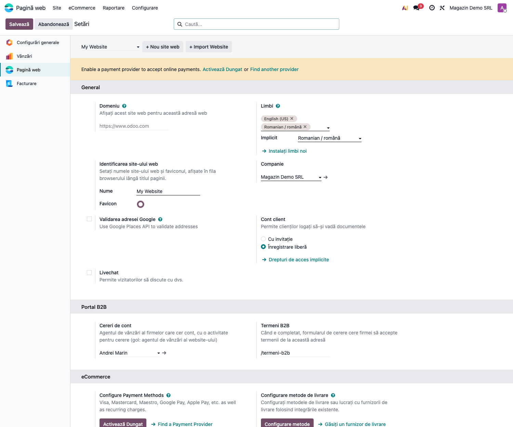

## 6. Flux de utilizare

Fluxul are două jumătăți: firma, pe website și în portal, și agentul, în back office.

### Pasul 1 — Firma cere un cont

Vizitatorul deschide **/b2b**. Pagina are o zonă de prezentare editabilă din editorul de website și
formularul de cerere: denumirea firmei, CUI, nr. registrul comerțului, adresă, localitate, județ
(județele țării companiei), persoana de contact, telefon, e-mail și un mesaj liber. Dacă sunt
configurați termenii B2B, apare și bifa de acceptare.

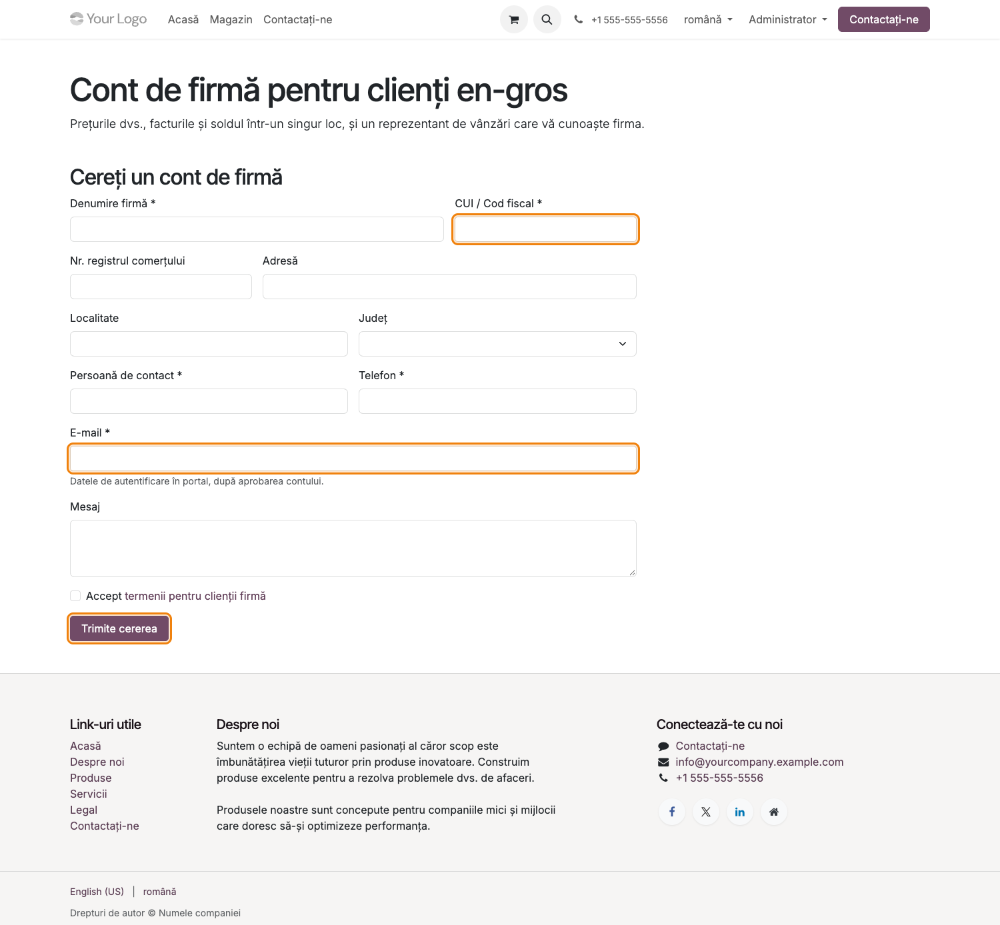

Câmpurile marcate cu * sunt obligatorii. Un e-mail invalid, un câmp lipsă, termenii neacceptați
sau — cu validarea CUI activă (`base_vat`, adus de localizarea română) — un CUI care nu trece cifra
de control întorc vizitatorul la formular cu mesajul corespunzător. Formularul are un câmp ascuns-capcană:
roboții de spam care îl completează primesc confirmarea, dar nu se creează nimic.

### Pasul 2 — Confirmarea

După trimitere, pagina afișează confirmarea: un reprezentant de vânzări va contacta firma.

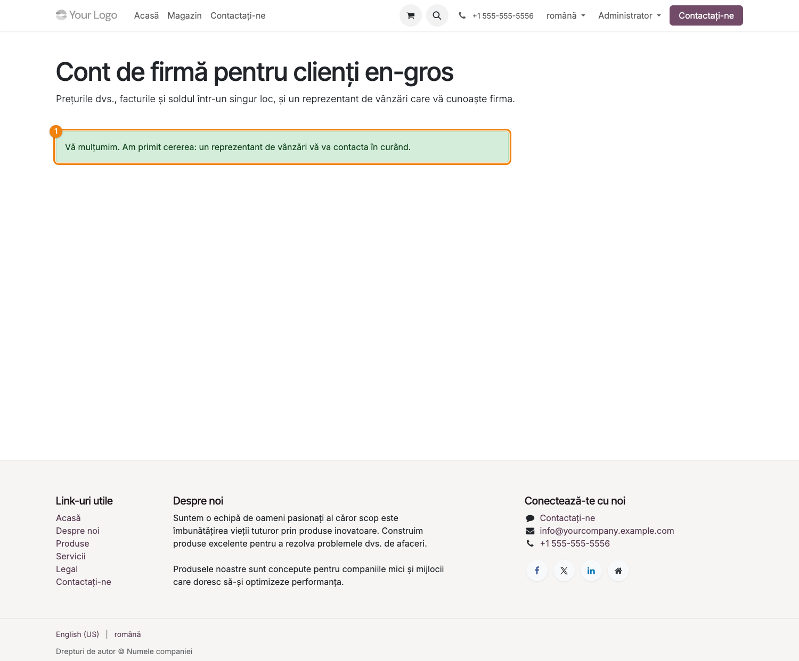

Ce s-a întâmplat în spate:

- **firmă nouă**: se creează clientul (firmă, CUI curățat de spații, țara companiei, agentul din
  setări) în starea B2B *Solicitat*, cu persoana de contact sub el, marcată „A cerut acces”;
- **firmă existentă** (același CUI, cu sau fără prefixul de țară): se adaugă doar persoana de
  contact. Datele din fișa firmei, agentul și înțelegerea nu se modifică;
- **aceeași persoană trimite de două ori**: nu se dublează nici firma, nici contactul;
- pe firmă se scrie în istoric cererea, pe numele persoanei care a trimis-o, cu mesajul ei, iar
  firma și persoana primesc limba în care a fost completat formularul (invitația în portal pleacă
  în ea); agentul primește o activitate de tipul „Cerere de cont B2B”.

Un cont deja activ nu coboară înapoi în *Solicitat*: un coleg nou al unei firme active doar apare ca
persoană care a cerut acces. O cerere respinsă și arhivată care revine se dezarhivează, cu tot cu
persoana de contact, în loc să se creeze o firmă nouă.

### Pasul 3 — Lista cererilor

**Vânzări → Comenzi → Cereri de cont B2B**. Lista arată firmele în starea *Solicitat* (filtru implicit)
și, la cerere, pe cele respinse: data primirii, CUI, localitate, telefon, agent și activitatea
deschisă.

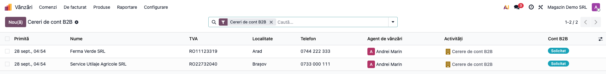

### Pasul 4 — Analiza cererii pe fișa firmei

Deschideți firma. Tabul **B2B** apare doar pe firmele cu stare B2B (solicitat, activ, suspendat,
respins); pe ceilalți clienți tabul nu apare. În grupul **Cont**: starea contului, data acceptării
termenilor, agentul, lista de prețuri, termenul de plată și înțelegerea cu clientul. În grupul **De
încasat**: soldul, numărul și suma facturilor restante și, dacă există limită, creditul disponibil.
Sus sunt butoanele **Aprobă cererea** și **Respinge cererea**. În istoricul din dreapta se citește
cererea, pe numele persoanei care a trimis-o, cu mesajul ei.

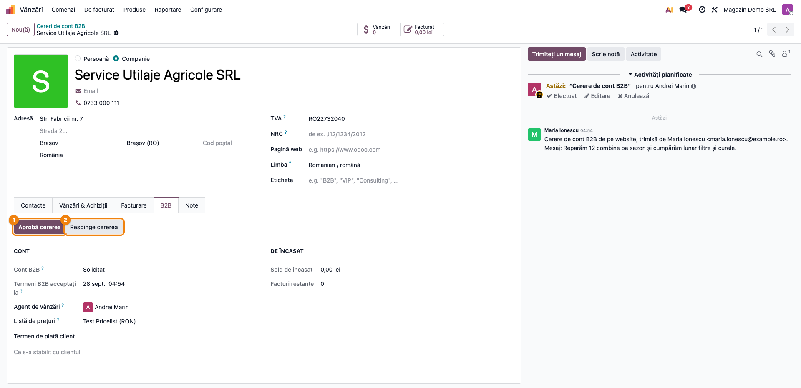

Înainte de aprobare, verificați pe fișă: CUI-ul e al unei firme reale, lista de prețuri și termenul
de plată sunt cele negociate, agentul e cel corect. Persoana care a cerut accesul se vede
deschizând-o din tabul *Contacte*: are eticheta „A cerut acces”.

### Pasul 5 — Aprobarea

**Aprobă cererea** → confirmare → contul devine *Activ*. Persoanele marcate „A cerut acces” primesc
invitația standard în portal (e-mailul cu legătura de setare a parolei). Celelalte contacte ale
firmei **nu** primesc acces. Activitatea „Cerere de cont B2B” se închide (celelalte activități ale
agentului pe firmă rămân), iar în istoric apare „Cererea de cont B2B a fost aprobată.”

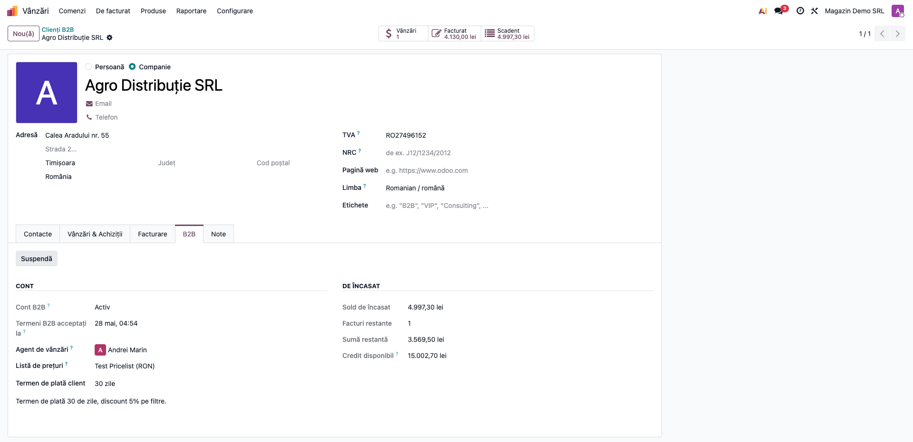

### Pasul 6 — Respingerea

**Respinge cererea** deschide o fereastră cu **Motivul** (obligatoriu) și bifa **Arhivează firma**.
Bifa e propusă doar când firma nu are comenzi sau facturi, adică pentru spam sau pentru o persoană
fizică; agentul o poate bifa și de mână. Motivul se scrie în istoric, pentru colegul care sună
clientul.

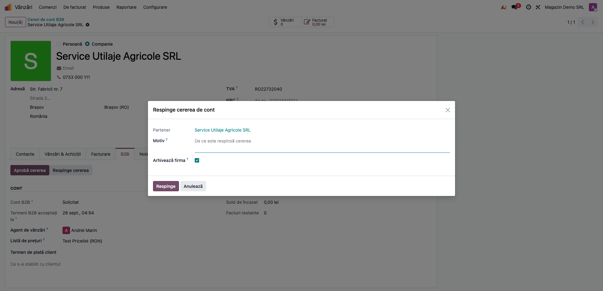

O firmă respinsă care trimite din nou formularul revine în *Solicitat*.

### Pasul 7 — Rolul fiecărei persoane

Pe firmă, tabul **Contacte** → deschideți persoana (sau direct fișa ei de contact, ca în captură).
Câmpul **Rol B2B** decide ce poate face: *Poate comanda* sau *Doar vizualizare (prețuri și
documente)*. Câmpul apare doar când firma are cont B2B și se modifică de *Portal B2B /
Administrator*.

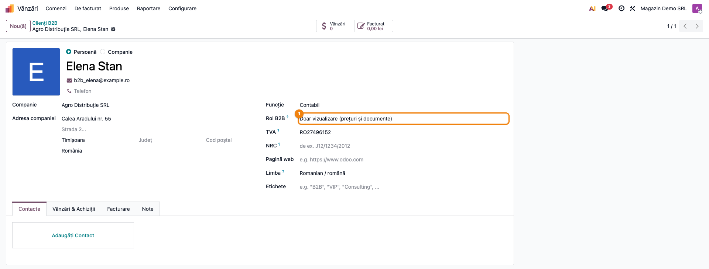

### Pasul 8 — Ce vede clientul în portal

Persoana intră în **Contul meu** (/my). Deasupra cardurilor obișnuite apare tabloul de bord al
firmei.

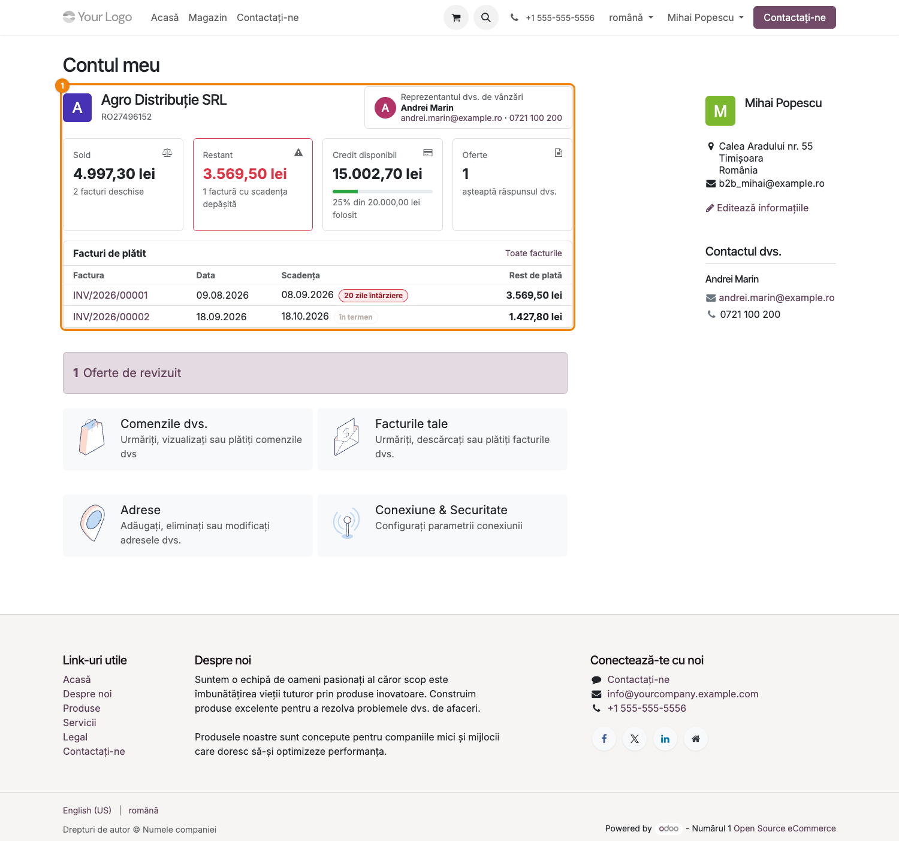

1. **Găsiți pe ecran** — sus, firma cu CUI-ul ei și, în dreapta, cardul agentului (nume, e-mail,
   telefon). Dedesubt, patru carduri: **Sold** (cu numărul de facturi deschise), **Restant** (roșu,
   cu numărul de facturi cu scadența depășită), **Credit disponibil** (cu bara de utilizare a
   limitei, verde / galbenă de la 70% / roșie de la 90%) și **Oferte** care așteaptă răspuns. Jos,
   tabelul **Facturi de plătit**: factura, data, scadența cu eticheta „N zile întârziere” sau „în
   termen” și restul de plată.
2. **Verificați** — soldul e egal cu *Total de încasat* din fișa clientului; suma restantă e suma
   facturilor restante din *Toate facturile*, în lei (tabelul arată doar primele cinci, în ordinea
   scadenței, cu restul de plată în moneda facturii); creditul disponibil e limita minus sold, iar
   procentul e soldul raportat la limită.
3. **Mai departe** — cardurile *Sold* și *Restant* și legătura *Toate facturile* deschid lista
   standard de facturi, de unde clientul le descarcă PDF; cardul *Oferte* deschide ofertele.

### Pasul 9 — Persoana care doar vede încearcă să comande

O persoană „Doar vizualizare” vede în *Contul meu*, permanent, mesajul că poate vedea prețurile și
documentele, dar nu poate plasa comenzi. Poate pune produse în coș, dar la **Finalizează comanda** e
trimisă înapoi aici. Tot așa, dacă e autentificată, **nu poate semna și nu poate plăti online o
ofertă** din portal (amândouă ar confirma comanda). La fel pentru orice persoană a unei firme
suspendate.

O ofertă deschisă din e-mail, fără autentificare, se semnează și se plătește ca până acum: legătura
cu cheie de acces nu spune cine o deschide.

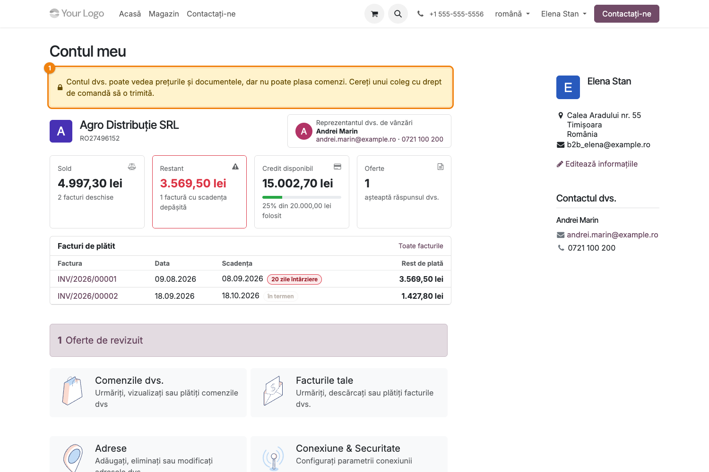

### Pasul 10 — Clienții B2B și restanțele

**Vânzări → Comenzi → Clienți B2B** listează conturile active și suspendate, cu agentul, soldul,
numărul și suma facturilor restante, creditul disponibil și starea contului. În căutarea de contacte
există filtrele **Clienți B2B**, **Cereri de cont B2B** și **B2B cu facturi restante**.

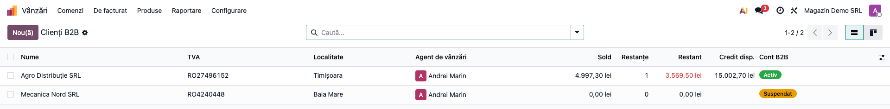

Pe fișa unui client activ, butonul **Suspendă** din tabul B2B oprește comenzile din portal fără să
ia accesul la documente; **Reactivează** le repornește, fără altă invitație (accesul n-a fost luat).
Pe o firmă respinsă, administratorul B2B are și butonul **Activează contul B2B**. Un client existent, care n-a cerut cont de pe website, se activează de un
administrator B2B din meniul **Acțiuni → Activează contul B2B** al fișei (sau al listei de
contacte): contul devine activ și se deschide fereastra standard de acces în portal pe persoanele
firmei, unde alegeți cui dați acces.

### Note de monografie și raportare

Modulul nu generează note contabile și nu alimentează nicio declarație. Cifrele din portal sunt
citiri ale contabilității existente (soldul clientului și facturile de vânzare). Dacă nu se potrivesc
cu fișa de cont a clientului, cauza e în contabilitate (plăți nereconciliate, facturi în altă
companie), nu în portal.

## 7. Legături cu alte module / declarații

| Modul | Rol |
|---|---|
| `website_sale` | magazinul, coșul și finalizarea comenzii; setarea standard *Acces eCommerce* închide magazinul pentru vizitatori |
| `portal` | invitația în portal și *Contul meu* |
| `sale_management` | ofertele din portal, numărate în rezumat |
| `terrabit_partner_credit_limit`, `terrabit_partner_credit_limit_website` | limita de credit și facturile restante, cu toleranță și excepții; pe website, bara de progres în coș și restrângerea metodelor de plată |
| `deltatech_b2b_quick_order`, `deltatech_b2b_order_list`, `deltatech_b2b_price_tiers` | modulele următoare ale familiei (planificate), construite peste acesta |
| `agroamat_b2b` | modulul de origine; la Agroamat devine un strat subțire peste acesta |

**Ce e automat:** crearea firmei și a contactului din formular, potrivirea după CUI, activitatea
agentului, invitația în portal la aprobare, închiderea activității, oprirea la finalizarea comenzii
și la semnarea ofertei.

**Ce rămâne manual:** verificarea firmei înainte de aprobare, lista de prețuri, termenul de plată și
limita de credit, rolul fiecărei persoane, suspendarea.

## 8. Verificări pentru consultant

- [ ] O cerere trimisă din /b2b creează firma în *Solicitat*, cu persoana de contact sub ea, iar agentul configurat primește activitatea.
- [ ] O a doua cerere cu același CUI scris altfel (cu spații, cu sau fără „RO”) nu creează a doua firmă.
- [ ] O cerere pe o firmă existentă nu îi schimbă denumirea, adresa sau agentul.
- [ ] Un agent fără drept de editare a contactelor poate aproba, respinge, suspenda și reactiva; istoricul arată numele lui.
- [ ] Agentul nu vede *Acțiuni → Activează contul B2B* și nici câmpul *Rol B2B*; administratorul B2B le vede.
- [ ] După aprobare, doar persoana care a cerut accesul are utilizator de portal.
- [ ] Tabul B2B nu apare pe un client fără cont B2B; *Acțiuni → Activează contul B2B* (ca administrator B2B) îl activează.
- [ ] Respingerea fără motiv nu se poate salva; bifa de arhivare nu e propusă pe o firmă cu facturi.
- [ ] În portal, *Sold* = *Total de încasat* din fișa clientului, iar *Restant* = suma facturilor restante din *Toate facturile*, în lei.
- [ ] O persoană „Doar vizualizare” e oprită la finalizarea comenzii, la semnarea și la plata online a unei oferte, cu mesaj, iar una „Poate comanda” nu.
- [ ] Clientul are termene de plată în rate? Explicați-i că restanța apare după ultima rată.
- [ ] Cu *Acces eCommerce* = *Utilizatori autentificați*, /shop cere autentificare, iar /b2b rămâne deschis.
- [ ] Dacă se cere limita de credit pe website: `terrabit_partner_credit_limit_website` e instalat, iar un client lăsat peste limită („Permite vânzare peste credit?”) poate comanda.

## 9. Mesaje de eroare frecvente

| Mesaj | Cauză | Remediere |
|---|---|---|
| „Completați toate câmpurile obligatorii.” | lipsește un câmp marcat cu * din formularul /b2b | vizitatorul completează câmpul |
| „CUI-ul nu pare valid. Verificați-l.” | cu `base_vat` instalat, CUI-ul nu trece cifra de control | vizitatorul corectează CUI-ul |
| „Adresa de e-mail nu este validă.” | e-mail scris greșit | vizitatorul corectează adresa |
| „Acceptați termenii pentru a trimite cererea.” | termenii B2B sunt configurați și bifa nu e pusă | vizitatorul bifează acceptarea |
| „<Firma> nu are o cerere de cont în așteptare.” | *Aprobă cererea* pe o firmă care nu e în *Solicitat* | folosiți *Acțiuni → Activează contul B2B* pentru un client fără cerere |
| „Contul dvs. poate vedea prețurile și documentele, dar nu poate plasa comenzi…” | persoana are rolul *Doar vizualizare* | schimbați rolul, sau comanda o trimite un coleg |
| „Contul firmei dvs. este suspendat…” | firma e *Suspendat* | după clarificare, agentul apasă **Reactivează** în tabul B2B |
| Eroare standard de portal despre e-mail deja folosit | un alt utilizator are deja același e-mail | corectați e-mailul persoanei sau folosiți utilizatorul existent |

## 10. Capturi de ecran

Capturile din `readme/screenshots/`, în ordinea fișei:

| Fișier | Ce arată |
|---|---|
| `01_setari.png` | blocul *Portal B2B* din setările paginii web |
| `02_b2b_formular.png` | pagina /b2b cu formularul de cerere |
| `03_b2b_trimis.png` | confirmarea după trimitere |
| `04_cereri_lista.png` | *Vânzări → Comenzi → Cereri de cont B2B* |
| `05_firma_solicitat.png` | tabul B2B al unei firme cu cerere în așteptare |
| `06_firma_activ.png` | firma după aprobare |
| `07_respingere.png` | fereastra de respingere |
| `08_contact_rol.png` | rolul B2B pe o persoană de contact |
| `09_portal_rezumat.png` | tabloul de bord al firmei în *Contul meu* |
| `10_portal_comanda_oprita.png` | comanda oprită pentru o persoană „Doar vizualizare” |
| `11_clienti_b2b.png` | *Vânzări → Comenzi → Clienți B2B*, cu sold, restanțe și credit |

Se generează automat din `tests/test_screenshots.py` (mixinul `ScreenshotCase` din
`l10n_ro_doc_screenshots`, import defensiv), în română, pe o firmă românească:

```bash
./odoo/odoo-bin -c odoo.conf -d <db> -i l10n_ro,deltatech_b2b_portal,l10n_ro_doc_screenshots \
    --test-tags=fise_screenshots --stop-after-init
```

## 11. Observații pentru manual

- Insistați pe ideea că **cererea este clientul**: nu există o listă separată de cereri de curățat.
  O cerere respinsă și arhivată dispare din contacte; una aprobată e deja clientul, cu tot ce trebuie.
- Potrivirea se face **doar după CUI**, niciodată după e-mail: doi colegi din firme diferite pot avea
  aceeași adresă. Clientul trebuie să știe că un CUI greșit în fișă înseamnă o firmă dublă.
- Rolul *Doar vizualizare* e pentru contabilul sau directorul firmei client, care vrea să vadă
  facturile fără să comande din greșeală. Oprirea ține cât persoana e autentificată; o ofertă
  semnată din e-mail, fără autentificare, nu poate fi atribuită unei persoane.
- Limita de credit nu e în acest modul. Dacă clientul o cere pe website, e o instalare în plus
  (`terrabit_partner_credit_limit_website`), nu o bifă.
