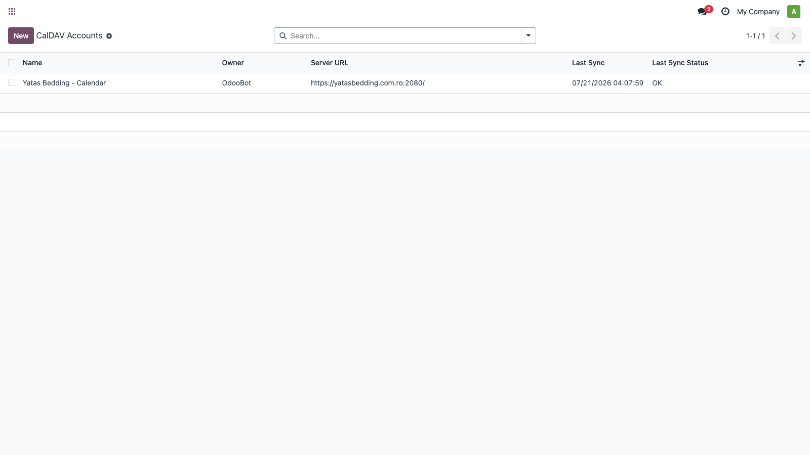
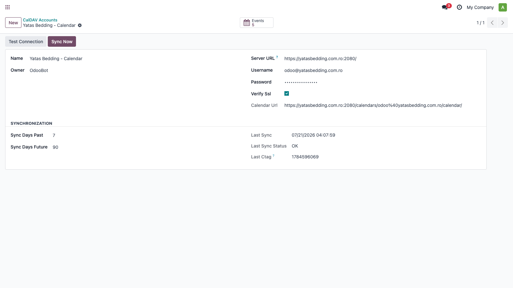
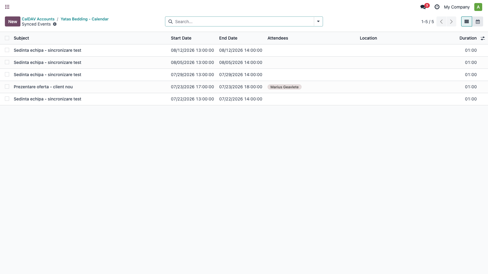
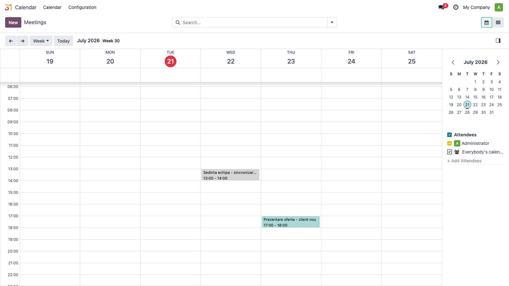

# Fișă Modul: Sincronizare Calendar CalDAV (bidirecțională)

**Modul:** `deltatech_calendar_caldav`
**Utilizator principal:** Utilizator Odoo cu calendar personal, Consultant IT client, Administrator sistem
**Prioritate:** 🟢 Opțională (activare per utilizator, la cerere; nu afectează restul fluxurilor de calendar)

---

## 1. Scop business

Modulul `deltatech_calendar_caldav` sincronizează calendarul Odoo (`calendar.event`) cu un
**server CalDAV extern** (cPanel/Horde/SOGo, Nextcloud, sau orice server care implementează
standardul CalDAV), în **ambele direcții**:

- **CalDAV → Odoo:** un cron (sau butonul „Sync Now") aduce evenimentele de pe server în Odoo.
- **Odoo → CalDAV:** crearea, modificarea sau ștergerea unui eveniment Odoo pentru un utilizator
  cu cont CalDAV configurat trimite imediat schimbarea pe server.

Cazul de business tipic: un client are deja un calendar în afara Odoo (căsuța de hosting cPanel,
un server Nextcloud propriu, telefonul sincronizat cu un calendar CalDAV) și vrea ca programările
din Odoo (întâlniri, task-uri cu dată) să apară automat acolo — și invers — fără muncă manuală de
copiere.

Modulul acoperă și cazuri mai avansate: **evenimente recurente** (trimise ca o singură serie CalDAV
cu regulă de recurență, nu ca evenimente separate), **reminder-e** (alarmele Odoo devin
notificări/emailuri pe celălalt calendar) și **participanți** (persoanele invitate la eveniment se
regăsesc pe ambele părți, cu potrivire automată după adresa de email).

## 2. Context tehnic

- **CalDAV** (RFC 4791) este un standard deschis pentru partajarea calendarelor prin HTTP, folosit
  de aproape orice furnizor de hosting/email (cPanel, Nextcloud, iCloud, Zimbra etc.) — spre
  deosebire de Google Calendar/Microsoft 365, pe care Odoo le sincronizează deja nativ prin module
  proprii, CalDAV **nu are** un conector nativ în Odoo 18/19.
- Comunicarea se face prin biblioteca Python `caldav` (peste protocolul standard iCalendar/RFC
  5545) — nu printr-un API proprietar al vreunui furnizor.
- Modulul este **generic**: orice server care vorbește CalDAV standard funcționează, fără cod
  specific per furnizor. A fost validat concret pe un server cPanel (Dovecot CalDAV).

Modulul nu este un raport sau o localizare fiscală — este un conector tehnic. Nu generează
documente și nu are implicații contabile.

## 3. Utilizatori și roluri

- **Utilizatorul cu calendar extern:** are propriul cont CalDAV configurat (o singură dată, de
  regulă de către consultant) și de atunci încolo lucrează normal în Odoo — sincronizarea e
  transparentă.
- **Consultantul / administratorul:** configurează contul CalDAV (server, user, parolă), verifică
  legătura și pornește sincronizarea. Parola contului este vizibilă/editabilă **doar** pentru
  grupul Setări (`base.group_system`) — utilizatorii obișnuiți nu o pot citi, dar sincronizarea lor
  funcționează oricum (rulează cu drepturi de sistem, nu ale utilizatorului curent).
- Meniul **CalDAV Accounts** e sub *Setări → Tehnic*, vizibil doar cu modul dezvoltator activ și
  grupul Setări.

## 4. Date și câmpuri implicate

- **`caldav.account`** (model nou) — un cont = un calendar CalDAV: `url`, `username`, `password`,
  `calendar_url` (descoperit automat la Test Connection), `user_id` (proprietarul, la care se leagă
  evenimentele sincronizate), `sync_days_past` / `sync_days_future` (fereastra de sincronizare,
  implicit -7/+90 zile), `last_sync` / `last_sync_status` / `last_ctag`.
- **`calendar.event`** (câmpuri adăugate) — `caldav_account_id`, `caldav_uid` (identificatorul
  evenimentului pe server), `caldav_recurrence_id` (pentru o ocurență dintr-o serie recurentă),
  `caldav_etag` (versiunea cunoscută a evenimentului pe server, pentru detectarea conflictelor).
- Se folosesc și modele **native** Odoo, fără câmpuri suplimentare: `calendar.alarm` (reminder-e),
  `res.partner` (participanți, potriviți/creați după email), `calendar.recurrence` (regula de
  recurență).

## 5. Configurare inițială

1. Instalați modulul `deltatech_calendar_caldav` (nu are dependențe Odoo în afară de `calendar`;
   pe server trebuie instalate bibliotecile Python `caldav` și `icalendar` —
   `uv pip install "caldav>=1.3.9,<=2.0.1" icalendar`; **atenție**, `caldav` > 2.0.1 trage o
   dependență incompatibilă cu Odoo, vezi secțiunea 9).
2. Activați modul dezvoltator, mergeți la **Setări → Tehnic → CalDAV Accounts**.
3. Creați un cont nou: **Owner** (utilizatorul Odoo ale cărui evenimente se sincronizează),
   **Server URL** (rădăcina serverului CalDAV, ex. `https://mail.exemplu.ro:2080/`), **Username**
   și **Password** — de regulă aceleași date ca la webmail/calendarul nativ al furnizorului.
4. Apăsați **Test Connection** — modulul descoperă automat calendarul contului și confirmă
   legătura (sau arată eroarea de conectare/autentificare).
5. Apăsați **Sync Now** pentru prima sincronizare manuală, sau activați cron-ul programat
   (**Setări → Tehnic → Acțiuni Programate → „CalDAV: Sync Accounts"**, dezactivat implicit,
   interval implicit 15 minute).

## 6. Flux de utilizare

### Pasul 1 — Conectarea și prima sincronizare

Formularul contului arată starea legăturii: **Test Connection** confirmă credențialele și
calendarul descoperit (**Calendar Url**), iar **Sync Now** rulează sincronizarea imediat.
Rezultatul (**Last Sync**, **Last Sync Status**, **Last Ctag**) rămâne vizibil pe cont pentru
diagnostic.

**Verificați:** după *Sync Now*, **Last Sync Status = OK** și butonul **Events** (colț
dreapta-sus) arată numărul de evenimente aduse de pe server.

### Pasul 2 — Evenimentele sincronizate

Din butonul **Events** de pe cont se văd toate evenimentele legate de acel cont CalDAV — inclusiv
o serie recurentă (adusă de pe server ca ocurențe individuale, cu aceeași denumire, o dată pe
săptămână) și un eveniment creat direct în Odoo, cu un participant (`Marius Geavlete`), deja
trimis pe server.

### Pasul 3 — Utilizarea normală, din Calendar

Din perspectiva utilizatorului final, sincronizarea e invizibilă: evenimentele apar în aplicația
**Calendar** ca orice altă întâlnire Odoo. Modificarea, mutarea sau ștergerea unui eveniment din
Odoo se trimite automat pe server; o schimbare făcută direct pe server (telefon, alt calendar)
ajunge în Odoo la următoarea sincronizare.

**Verificați:** dacă un eveniment adus de pe server nu are participanți (ATTENDEE/ORGANIZER
absent în datele CalDAV), el nu apare implicit în calendarul personal filtrat pe utilizator — se
vede bifând **„Everybody's calendars"** în panoul din dreapta (vezi și secțiunea 10).

### Pasul 4 — Recurență, reminder-e, participanți (rezumat)

- O serie recurentă creată în Odoo (cu regulă de recurență) se trimite pe server **ca o singură
  resursă CalDAV** (evenimentul „master" cu regula RRULE), nu ca evenimente separate; ocurențele
  aduse de pe server sunt expandate și importate individual în Odoo.
- Alarmele Odoo (`calendar.alarm`) se traduc în/din componente `VALARM` (notificare → `DISPLAY`,
  email → `EMAIL`).
- Participanții (`partner_ids`) se traduc în/din `ATTENDEE`/`ORGANIZER`, cu potrivire după adresa
  de email (contactul se creează automat dacă nu există).

## 7. Legături cu alte module / procese

| Modul / proces | Rol în flux | Tip legătură |
|---|---|---|
| `calendar` (Odoo core) | modelul `calendar.event`/`calendar.alarm`/`calendar.recurrence` extins | dependență (manifest) |
| Serverul CalDAV al clientului (cPanel, Nextcloud etc.) | sursa/destinația evenimentelor sincronizate | integrare externă |
| Aplicația **Calendar** (Odoo) | interfața pe care utilizatorul lucrează efectiv; sincronizarea e transparentă acolo | consumator |
| `res.partner` | participanții evenimentelor, potriviți/creați după email | date partajate |

Ce este automat: descoperirea calendarului, trimiterea/aducerea evenimentelor, expandarea
recurenței, maparea alarmelor și a participanților, detectarea conflictelor (ETag) și a
schimbărilor (CTag). Ce rămâne manual: configurarea inițială a contului (server/user/parolă) și
activarea cron-ului de sincronizare periodică.

## 8. Verificări pentru consultant

- [ ] Modulul se instalează fără erori (bibliotecile `caldav`/`icalendar` sunt prezente pe server).
- [ ] Meniul **CalDAV Accounts** apare sub *Setări → Tehnic* pentru un utilizator cu grupul Setări.
- [ ] **Test Connection** pe un cont cu date corecte reușește și completează **Calendar Url**.
- [ ] **Sync Now** aduce evenimentele existente pe server, cu titlu/dată/oră corecte.
- [ ] Un eveniment recurent (3-4 ocurențe) creat în Odoo apare pe server ca **o singură resursă**
  cu regulă RRULE (nu ca evenimente separate) — verificabil direct pe server sau prin re-sincronizare.
- [ ] Un eveniment creat/modificat/șters în Odoo pentru un cont configurat se reflectă pe server.
- [ ] Un participant cu email nou (fără contact existent) apare corect ca `res.partner` nou creat.
- [ ] O rulare a doua a sincronizării, fără schimbări pe server, se termină rapid (scurtcircuitată
  de verificarea CTag) — vizibil în timp de execuție, nu într-un câmp anume.
- [ ] Parola contului nu este vizibilă unui utilizator fără grupul Setări.

## 9. Mesaje de eroare și simptome frecvente

| Mesaj / simptom | Cauză probabilă | Remediere |
|-----------------|-----------------|-----------|
| „The Python 'caldav' library is not installed" | Biblioteca nu e instalată pe server | `uv pip install "caldav>=1.3.9,<=2.0.1" icalendar` |
| Instalarea bibliotecii **rupe pornirea Odoo** (`ImportError: PyOpenSSLContext`) | `caldav` > 2.0.1 trage `niquests`→`urllib3-future`, care suprascrie fișierele reale ale pachetului `urllib3` | Reinstalați `urllib3` la versiunea originală și fixați `caldav<=2.0.1` (fără această dependență) |
| **Test Connection** eșuează cu eroare de certificat SSL | URL-ul folosește o adresă IP, dar certificatul e valabil doar pe hostname | Folosiți hostname-ul (ex. `https://domeniu.ro:2080/`), nu adresa IP |
| **Last Sync Status = Error** | Credențiale greșite, server neaccesibil, sau eroare de rețea | Verificați **Last Sync Error** (mesajul complet) de pe cont |
| O ocurență editată **și** mutată în timp apare **duplicat** pe server, nu ca suprascriere | Odoo nu păstrează ora inițial programată a ocurenței odată mutată; limitare cunoscută (secțiunea 10) | Editare de conținut fără mutare de oră, sau ștergere manuală a duplicatului de pe server |
| Ștergerea unei **singure** ocurențe dintr-o serie nu se reflectă pe server | Ștergerea per-ocurență nu e încă suportată (limitare v1) | Se șterge doar seria întreagă; pentru o ocurență, editați conținutul în loc de a o șterge |
| Un eveniment adus de pe server nu apare în calendarul personal | Evenimentul nu are ATTENDEE/ORGANIZER pe server → fără participanți în Odoo → nu trece filtrul implicit „Attendees" | Bifați **„Everybody's calendars"** în panoul calendarului |
| Un push (creare/editare) nu ajunge pe server, fără eroare vizibilă | Conflict ETag: evenimentul a fost modificat direct pe server de la ultima sincronizare; modulul **nu suprascrie** varianta serverului | Rulați o sincronizare (Sync Now) ca să aduceți varianta de pe server în Odoo, apoi editați din nou |

## 10. Limitări cunoscute

- **Ștergerea unei singure ocurențe** dintr-o serie recurentă (păstrând restul seriei) nu se
  propagă pe server — doar ștergerea întregii serii este sincronizată.
- O ocurență editată **și mutată în timp** în aceeași operație poate crea un eveniment duplicat pe
  server în loc de o suprapunere corectă (`RECURRENCE-ID`), pentru că Odoo nu reține ora la care
  ocurența era programată inițial, o dată mutată.
- Evenimentele aduse de pe server **fără** participanți (ATTENDEE/ORGANIZER) nu apar implicit în
  calendarul personal filtrat pe utilizator — necesită bifarea „Everybody's calendars".
- Descrierea evenimentului se trimite ca **text simplu** (formatarea HTML din Odoo se pierde la
  trimiterea către server).
- Modulul folosește **un singur calendar per cont** (primul găsit pe server, sau cel descoperit
  explicit la Test Connection) — nu suportă mai multe calendare per cont în versiunea curentă.

## 11. Capturi de ecran

Capturile (`readme/screenshots/`) sunt realizate pe o bază demo (`caldav_demo`), cu un cont CalDAV
real de test (server cPanel al unui client, cont dedicat testării — nu producție), o serie
recurentă săptămânală de 4 ocurențe și un eveniment cu un participant.

1. `01_lista_conturi.png` — meniul **CalDAV Accounts** (Setări → Tehnic), cu contul configurat.
2. `02_cont_configurat.png` — formularul contului: conectat, sincronizat, cu **Last Ctag** vizibil.
3. `03_evenimente_sincronizate.png` — lista evenimentelor sincronizate (serie recurentă +
   eveniment cu participant).
4. `04_calendar_odoo.png` — aplicația **Calendar**, cu „Everybody's calendars" bifat, arătând
   aceleași evenimente în interfața normală a utilizatorului.

## 12. Observații pentru manual

În manualul clientului, prezentați modulul ca pe o **punte transparentă**: odată configurat contul
(un pas unic per utilizator), calendarul din Odoo și cel din afara Odoo rămân la fel, fără muncă
suplimentară — programările făcute în oricare parte apar și în cealaltă în câteva minute
(intervalul cron-ului). Atrageți atenția asupra celor două limitări practice ale versiunii curente
(secțiunea 10): ștergerea „doar a unei zile" dintr-o serie recurentă și mutarea în timp a unei
ocurențe editate — pentru aceste cazuri, recomandați editare de conținut fără mutare de oră, sau
verificare manuală pe server. Menționați și rolul reglării **Sync Days Past / Future** de pe cont,
dacă clientul are nevoie de o fereastră de sincronizare mai mare sau mai mică decât implicitul
(-7/+90 zile).
