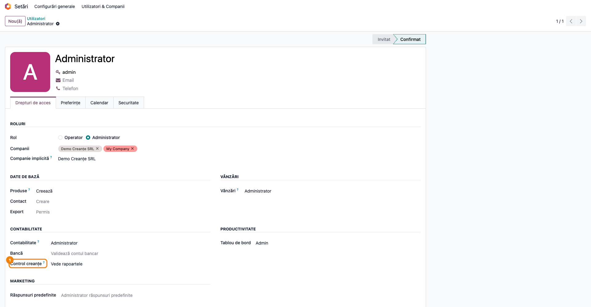
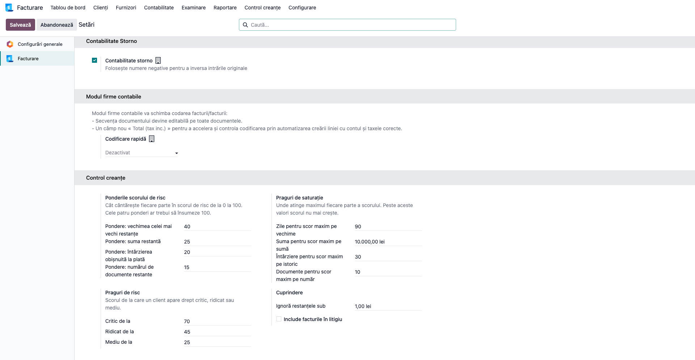
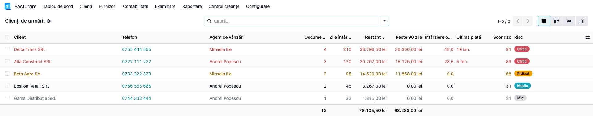
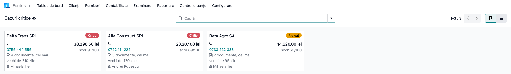
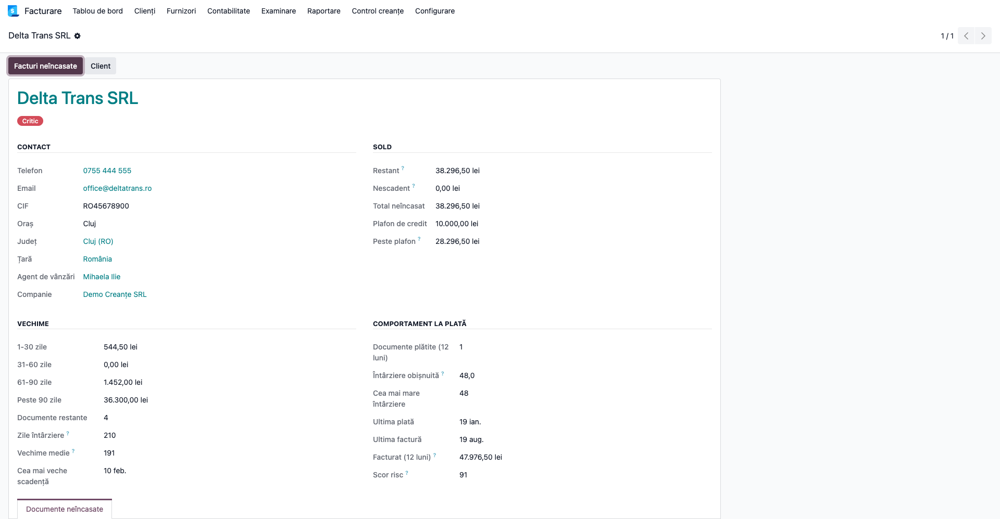
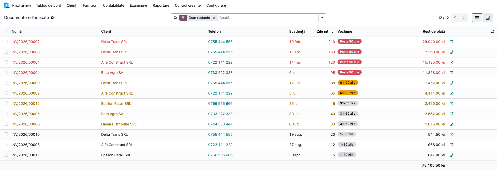
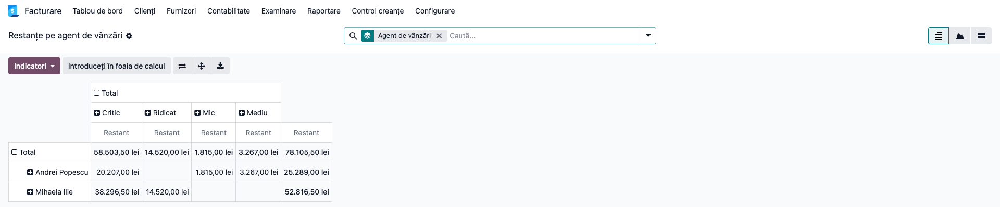
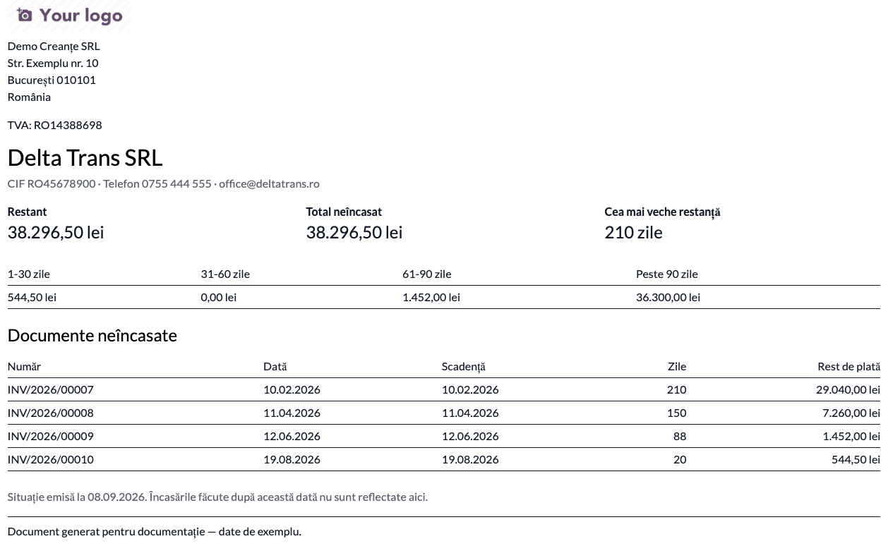

# Fișă Modul: Urmărirea creanțelor și clasamentul clienților restanțieri

**Modul:** `deltatech_credit_control`
**Utilizator principal:** Responsabil recuperare creanțe, contabil clienți, director de vânzări
**Prioritate:** 🟡 Medie (nu e obligație legală, dar are impact direct pe încasări)

---

## 1. Scop business

Odoo spune deja **cât** este restant — raportul standard „Balanța clienți pe vechimi" (Aged
Receivable) face asta bine. Ce nu spune este **pe cine sunăm primul**, iar aceea este întrebarea
pusă în fiecare dimineață de omul care face recuperarea.

Modulul răspunde la ea: construiește un clasament al clienților cu restanțe, dă fiecăruia un **scor
de risc de la 0 la 100** și pune pe același rând numărul de telefon, ca lista să poată fi lucrată de
sus în jos fără să se deschidă a doua fereastră. Peste asta, arată **cum s-a purtat clientul la
plată în ultimul an** — informație pe care Odoo nu o calculează nicăieri — și taie restanțele pe
agent de vânzări, județ și lună a scadenței.

Modulul **nu scrie nimic** în contabilitate. Este o interogare peste liniile contabile de creanță,
rulată la fiecare deschidere a ecranului.

## 2. Bază legală și context

Nu există o obligație legală care să impună acest raport; el este un instrument operațional de
management al creanțelor.

Contextul legal în care se folosește, fără ca modulul să îl implementeze:

- **Legea 72/2013** privind combaterea întârzierii executării obligațiilor de plată în contractele
  comerciale — termenele legale de plată și dreptul la penalități. Calculul efectiv al penalităților
  se face în alt modul (`l10n_ro_receivables_enhanced`), nu aici.
- **OMFP 1802/2014** — obligația de a evalua creanțele la valoarea probabilă de încasat la
  inventariere. Clasamentul de aici este un ajutor pentru a identifica creanțele incerte, dar
  **nu constituie și nu propune ajustări de depreciere**; acelea se înregistrează separat.

## 3. Utilizatori și roluri

Responsabilul cu recuperarea creanțelor lucrează zilnic lista. Contabilul clienți verifică
concordanța cu balanța analitică. Directorul de vânzări se uită la tăietura pe agent.

Accesul este dat de un grup dedicat, nu de dreptul general de facturare: cifrele de restanță și
comportamentul la plată sunt informații pe care firmele le țin de obicei în echipa de colectare.

Roluri recomandate pentru testare:
- Administrator funcțional: instalează modulul, dă grupul, reglează ponderile scorului;
- Utilizator operațional: parcurge lista și sună clienții;
- Contabil: confruntă totalul restant cu balanța clienți pe vechimi.

## 4. Conturi și date implicate

Modulul citește **liniile contabile neîncasate de pe conturile de tip „Creanțe"** — în planul de
conturi românesc, conturile din grupa **411x** (clienți) și orice alt cont configurat cu tipul
`asset_receivable`.

Sunt luate în calcul liniile care îndeplinesc simultan:
- nota contabilă este **postată**;
- linia **nu este reconciliată** și are sold rămas;
- linia aparține unei companii active în selectorul de companii.

Se citește și **soldul deja stins**, din reconcilierile parțiale ale ultimelor 12 luni, ca să se
poată calcula întârzierea obișnuită la plată.

Date minime pentru demo:
- companie românească cu localizarea contabilă instalată;
- câțiva clienți cu **telefon completat** pe fișa de contact (altfel coloana de telefon rămâne
  goală și lista își pierde rostul);
- facturi client postate, cu scadențe **în trecut**, împrăștiate pe mai multe tranșe de vechime;
- cel puțin o factură deja încasată cu întârziere, ca să apară comportamentul la plată;
- opțional: un termen de plată în rate, ca să se vadă că doar rata scadentă e restantă.

## 5. Configurare inițială

1. Instalați modulul `deltatech_credit_control` pe baza demo.
2. Mergeți în **Setări → Utilizatori și companii → Utilizatori**, deschideți utilizatorii care
   trebuie să vadă raportul și, în tabul **Drepturi de acces**, secțiunea **Contabilitate**, alegeți
   la **Control creanțe** valoarea **Vede rapoartele**.
   Atenție: omul are nevoie **și** de un drept de Contabilitate (măcar Facturare), altfel nu vede
   aplicația Contabilitate deloc și, implicit, nici meniul.
3. Mergeți în **Contabilitate → Configurare → Setări**, blocul **Control creanțe**, și reglați
   ponderile, pragurile de saturație și pragurile de risc. Valorile implicite sunt un punct de
   plecare rezonabil, nu un adevăr universal — vezi Pasul 2 din flux.
4. Verificați că telefoanele clienților sunt completate pe fișele de contact.
5. Verificați, dacă folosiți plafoane de credit, că plafonul implicit al companiei este setat în
   **Contabilitate → Configurare → Setări → Facturi client → Limită de credit**.

## 6. Flux de utilizare

### Pasul 1 — Dați accesul la raport

Accesați **Setări → Utilizatori și companii → Utilizatori** și deschideți utilizatorul. În tabul
**Drepturi de acces**, la secțiunea **Contabilitate**, apare rândul **Control creanțe**: alegeți
valoarea **Vede rapoartele**.

Dreptul dă acces **numai în citire** pe cele două ecrane ale modulului și face vizibil meniul.
Cine nu îl are nu vede nici meniul, nici cifrele.



### Pasul 2 — Reglați scorul de risc

Accesați **Contabilitate → Configurare → Setări**, blocul **Control creanțe**.

Scorul de la 0 la 100 se adună din patru părți, fiecare cu o pondere și un prag de saturație —
valoarea peste care partea respectivă nu mai crește:

| Parte | Pondere implicită | Prag implicit |
|---|---|---|
| Vechimea celei mai vechi restanțe | 40 | 90 de zile |
| Suma restantă | 25 | 10.000 (moneda companiei) |
| Întârzierea obișnuită la plată | 20 | 30 de zile |
| Numărul de documente restante | 15 | 10 documente |

Cele patru ponderi ar trebui să însumeze 100, ca scorul să se citească direct ca procent. Pragurile
se coboară la o firmă cu termene scurte de plată și se ridică la contracte mari.

Tot aici se stabilesc **pragurile de risc** (critic de la 70, ridicat de la 45, mediu de la 25),
**suma sub care o restanță se ignoră** (implicit 1, ca resturile din rotunjiri să nu polueze
clasamentul) și dacă **facturile în litigiu** — cele cu starea de plată „Blocat" — intră sau nu în
calcul (implicit nu intră).



### Pasul 3 — Lista de sunat

Accesați **Contabilitate → Control creanțe → Clienți de urmărit**.

Este lista de lucru: un rând per client, ordonată descrescător după suma restantă, colorată după
nivelul de risc (roșu pentru critic, portocaliu pentru ridicat, gri pentru mic).

**Găsiți pe ecran:** coloana **Client**, apoi **Telefon** (butonul de apelare este chiar pe rând),
**Documente restante**, **Zile întârziere** (vechimea celei mai vechi sume neîncasate), **Restant**,
**Peste 90 zile**, **Întârziere obișnuită**, **Ultima plată**, **Scor risc** și eticheta **Risc**.
Coloanele ascunse — tranșele 1-30, 31-60, 61-90, nescadentul, plafonul, cifra de afaceri pe 12 luni
— se aduc din butonul de opțiuni al listei, cel din colțul din dreapta al antetului.

**Verificați:** totalul coloanei **Restant**, afișat în subsolul listei, trebuie să corespundă cu
totalul restant din raportul standard „Balanța clienți pe vechimi" pentru aceeași dată; coloana
**Telefon** nu trebuie să fie goală pe clienții pe care urmează să îi sunați; scorul crește odată cu
vechimea și cu suma, nu invers.

**Treceți mai departe:** grupați după **Agent de vânzări** ca să împărțiți apelurile, sau după
**Județ** dacă recuperarea se face pe teren. Filtrele rapide **Critic**, **Peste 90 zile**,
**Peste plafonul de credit** și **Clienții mei** restrâng lista fără să scrieți nimic de mână.



### Pasul 4 — Cazurile critice, ca fișe

Accesați **Contabilitate → Control creanțe → Cazuri critice**.

Aceleași date, ca fișe (kanban), filtrate pe risc critic și ridicat. Fiecare fișă arată numele,
eticheta de risc, telefonul, câte documente sunt restante și de câte zile e cel mai vechi, suma
restantă și scorul. Este formatul potrivit pentru ședința de dimineață.



### Pasul 5 — Fișa unui client

Din oricare listă, faceți clic pe un rând.

Se deschide fișa completă a clientului, în patru grupuri: **Contact** (telefon, e-mail, CIF, oraș,
județ, agent), **Sold** (restant, nescadent, total neîncasat, plafon și depășire), **Vechime**
(tranșele, numărul de documente, zilele de întârziere, vechimea medie cântărită cu suma, cea mai
veche scadență) și **Comportament la plată** (documente plătite în 12 luni, întârzierea obișnuită,
cea mai mare întârziere, ultima plată, ultima factură, cifra de afaceri pe 12 luni și scorul).

În tabul **Documente neîncasate** sunt liniile clientului, una câte una.

Din antet, butonul **Facturi neîncasate** duce la ecranul obișnuit de facturi al clientului, iar
butonul **Client** la fișa de contact, de unde se corectează telefonul și plafonul de credit.



### Pasul 6 — Documentele neîncasate, unul câte unul

Accesați **Contabilitate → Control creanțe → Documente neîncasate**.

**Găsiți pe ecran:** un rând per **linie contabilă de creanță**, nu per factură. Distincția
contează: la un termen de plată în rate, o factură are mai multe scadențe, iar aici fiecare rată
apare separat, cu vechimea ei. Coloanele sunt numărul documentului, clientul, telefonul, scadența,
zilele de întârziere, tranșa de vechime ca etichetă colorată și restul de plată.

**Verificați:** suma coloanei **Rest de plată** pe un client trebuie să dea exact restantul lui din
clasament; documentele marcate **În litigiu** apar doar dacă ați bifat includerea lor în setări.
Ecranul se deschide cu filtrul **Doar restante** activ, deci dintr-o factură în rate se vede numai
rata scadentă — scoateți filtrul ca să apară și ratele care nu au ajuns la termen, fiecare pe rândul
ei.

**Treceți mai departe:** filtrul **Peste 90 zile** izolează ce se apropie de acțiune juridică,
filtrul **În litigiu** arată ce este deja contestat, iar gruparea după **Luna scadenței** arată cum
se distribuie restanțele în timp. Butonul cu săgeată de la capătul rândului deschide documentul
contabil real.



### Pasul 7 — Rapoartele de sinteză

Accesați **Contabilitate → Control creanțe → Raportare**. Sunt patru tăieturi:

- **Vechimea datoriilor** — lista cu tranșele, pentru situația de ansamblu;
- **Restanțe pe agent de vânzări** — pivot și grafic, pentru discuția cu echipa de vânzări;
- **Restanțe pe județ** — util când recuperarea se face pe teren;
- **Restanțe pe luna scadenței** — cum se distribuie în timp ce avem de încasat.

**Găsiți pe ecran:** în pivotul pe agent, rândurile sunt agenții, coloanele nivelurile de risc, iar
măsura este suma restantă.

**Verificați:** totalul general al pivotului trebuie să fie identic cu totalul restant din lista de
la Pasul 3; un agent fără nicio restanță nu apare deloc, ceea ce este corect, nu o eroare.

**Treceți mai departe:** din butonul de descărcare al pivotului obțineți fișierul **XLSX**, dacă
raportul trebuie trimis mai departe.



### Pasul 8 — Situația scrisă pentru client

Selectați în listă clienții doriți și folosiți **Tipărire → Situație clienți restanțieri**.

**Găsiți pe ecran:** un PDF cu o pagină per client, care conține datele de contact, restantul,
totalul neîncasat, vechimea celei mai vechi restanțe, tabelul tranșelor și lista documentelor
neîncasate cu număr, dată, scadență, zile de întârziere și rest de plată.

**Verificați:** totalul documentelor din tabel corespunde cu restantul din antet; datele de contact
sunt cele actuale; documentul poartă data emiterii, iar nota de subsol precizează că încasările
făcute după această dată nu sunt reflectate.

**Treceți mai departe:** trimiteți PDF-ul clientului. Documentul este o **situație informativă**,
nu o somație și nu un titlu de creanță.



### Note de monografie și raportare

**Modulul nu generează nicio notă contabilă.** Nu are jurnale, nu postează, nu modifică nimic în
contabilitate. Ambele modele sunt interogări în citire peste datele existente, iar drepturile de
acces sunt exclusiv de citire.

Ce înseamnă asta pentru consultant:

- cifrele afișate sunt cele din momentul deschiderii ecranului, nu dintr-o copie recalculată de un
  proces automat;
- baza de calcul este aceeași cu a raportului standard „Balanța clienți pe vechimi" — linii
  contabile pe conturi de creanțe, cu scadența de pe linie — deci cele două rapoarte trebuie să se
  potrivească, nu doar să semene;
- creanțele incerte identificate aici se ajustează contabil separat, prin înregistrările obișnuite
  de depreciere (**Dr 6814 = Cr 491**), care nu fac obiectul acestui modul;
- penalitățile de întârziere, dacă se facturează, se calculează în `l10n_ro_receivables_enhanced`.

## 7. Legături cu alte module / declarații

| Modul / proces | Rol în flux | Tip legătură |
|---|---|---|
| `account` | liniile contabile de creanță, sursa tuturor cifrelor | dependență (manifest) |
| `sales_team` | agentul de vânzări de pe factură și de pe fișa clientului | dependență (manifest) |
| `account_reports` (Enterprise) | „Balanța clienți pe vechimi", cu care se confruntă totalurile | independent, aceeași bază de calcul |
| `account_followup` (Enterprise) | trimiterea efectivă a somațiilor, pe niveluri de urmărire | complementar, fără legătură automată |
| `deltatech_followup` | somații pe e-mail, configurabile | complementar, fără legătură automată |
| `l10n_ro_receivables_enhanced` | penalități Legea 72/2013, compensări client-furnizor | complementar |
| `l10n_ro_partner_financials` | bonitatea clientului din bilanțurile publice MFinanțe | complementar |

Ce este automat: clasamentul, scorul, tranșele de vechime, comportamentul la plată și situația PDF.

Ce rămâne manual: apelul telefonic și consemnarea lui, trimiterea somației, decizia de a bloca
livrările sau de a acționa în instanță, și ajustările contabile pentru creanțe incerte.

## 8. Verificări pentru consultant

- [ ] Modulul se instalează fără erori pe baza demo.
- [ ] Un utilizator fără valoarea „Vede rapoartele" la „Control creanțe" **nu** vede meniul.
- [ ] Un utilizator cu dreptul, dar fără drept de Contabilitate, nu vede aplicația — comportament
      așteptat, de explicat clientului.
- [ ] Totalul coloanei **Restant** din „Clienți de urmărit" coincide cu totalul restant din
      „Balanța clienți pe vechimi" la aceeași dată.
- [ ] O factură cu termen de plată în rate apare cu un rând per rată în „Documente neîncasate", iar
      ratele nescadente **nu** intră în restant.
- [ ] Un client fără plafon propriu afișează totuși plafonul implicit al companiei în coloana
      **Plafon de credit** (nu zero).
- [ ] O factură încasată integral dispare din listă după reconciliere.
- [ ] Modificarea unei ponderi în setări schimbă scorul la următoarea deschidere a listei.
- [ ] Filtrul **Critic** returnează exact clienții cu scorul peste pragul configurat.
- [ ] Situația PDF se generează pentru mai mulți clienți deodată, o pagină per client.
- [ ] Într-o bază cu mai multe companii, un client cu restanțe în două companii apare cu un rând
      per companie, iar compania nebifată în selector nu apare deloc.

## 9. Mesaje de eroare frecvente

| Mesaj / simptom | Cauză probabilă | Remediere |
|-----------------|-----------------|-----------|
| Meniul „Control creanțe" nu apare | Utilizatorul nu are „Vede rapoartele" la „Control creanțe" sau nu are niciun drept de Contabilitate | Setați dreptul în Setări → Utilizatori și dați cel puțin dreptul de Facturare |
| „Controlul creanțelor nu poate rula pe o bază cu mai mult de 1000 de companii." | Cheia rândului codifică perechea client-companie și presupune sub 1000 de companii | Situație practic imposibilă într-o bază reală; semnalați-o dezvoltării |
| Lista este goală, deși există facturi neîncasate | Restanțele sunt sub pragul „Ignoră restanțele sub", scadențele nu au trecut încă, sau facturile sunt în starea „Blocat" | Verificați pragul din setări, scadențele documentelor și dacă includerea litigiilor e bifată |
| Coloana **Telefon** e goală | Telefonul nu e completat pe fișa de contact a firmei-mamă | Completați telefonul pe partenerul comercial, nu pe adresa de livrare |
| Coloana **Peste plafon** arată zero peste tot | Nu este setat niciun plafon, nici pe clienți, nici ca valoare implicită de companie | Setați plafonul implicit în setările de contabilitate sau plafoane individuale pe clienți |
| Totalul nu coincide cu balanța clienți | În selectorul de companii sunt bifate alte companii decât în raportul comparat | Aliniați selecția de companii între cele două ecrane |
| Cifrele par să fie de ieri | Ecranul a rămas deschis peste noapte | Reîncărcați ecranul; datele se recalculează la fiecare deschidere |

## 10. Capturi de ecran

Capturile (`readme/screenshots/`) sunt **generate automat** din `tests/test_screenshots.py`
(mixinul `ScreenshotCase` din `l10n_ro_doc_screenshots`, import defensiv), în **limba română**, pe
planul de conturi RO:

1. `01_grup_acces.png` — dreptul „Control creanțe → Vede rapoartele" în tabul „Drepturi de acces".
2. `02_setari_scor.png` — blocul „Control creanțe" din setările de contabilitate.
3. `03_clienti_de_urmarit.png` — lista de lucru, cu scor de risc și telefon pe rând.
4. `04_cazuri_critice.png` — cazurile critice și ridicate, în format fișe.
5. `05_fisa_client.png` — fișa unui client: sold, vechime, comportament la plată.
6. `06_documente_neincasate.png` — liniile de creanță, cu tranșa de vechime pe fiecare rând.
7. `07_restante_pe_agent.png` — pivotul restanțelor pe agent de vânzări.
8. `08_situatie_pdf.png` — situația în PDF, pentru un client.

Regenerare:

```bash
./odoo/odoo-bin -c odoo.conf -d <db> -i deltatech_credit_control,l10n_ro_doc_screenshots \
    --test-tags=/deltatech_credit_control:TestCreditControlScreenshots --stop-after-init
```

## 11. Observații pentru manual

Trei lucruri merită păstrate în manual, pentru că sunt cele care se înțeleg greșit cel mai des:

- **Scorul este o convenție a firmei, nu o măsură absolută.** Explicați din ce se compune și unde se
  reglează; altfel primul lucru pe care îl întreabă cineva care vede un 84 este „de ce 84?".
- **Modulul nu trimite nimic și nu blochează pe nimeni.** Este o listă de decizie; acțiunea —
  telefon, somație, blocare de livrări — rămâne a omului și, dacă e cazul, a modulelor de urmărire.
- **Baza de calcul este linia contabilă, nu factura.** Aceasta este explicația pentru care o factură
  în rate apare de mai multe ori și pentru care totalurile se potrivesc cu balanța pe vechimi.
