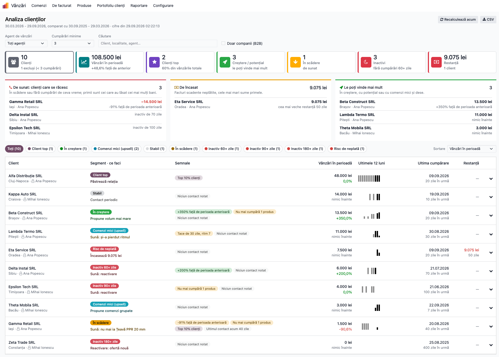
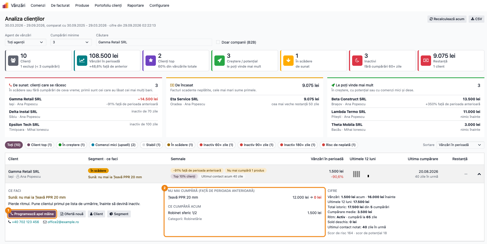
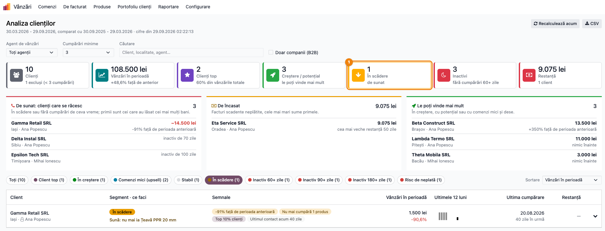
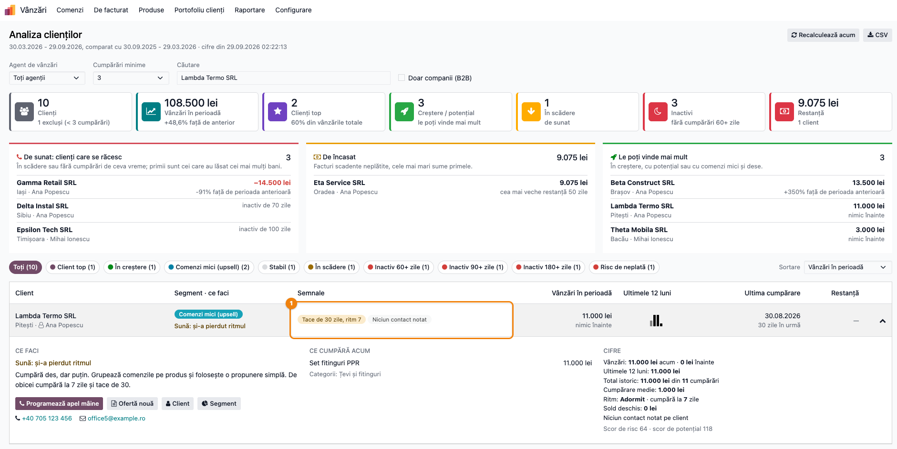
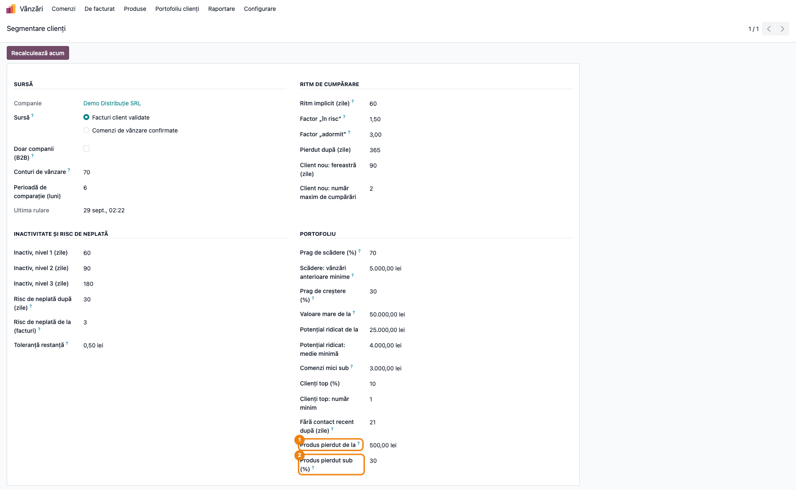
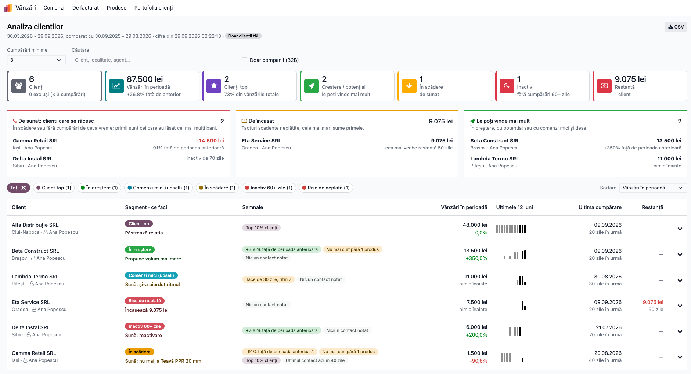

# Fișă Modul: Analiza clienților — ce faci azi cu fiecare client

**Modul:** `deltatech_customer_analysis`
**Utilizator principal:** Agent de vânzări (clienții proprii), director de vânzări (portofoliul întreg)
**Prioritate:** 🟡 Medie (modul nou, vandabil pe Apps; al doilea din familia analizei clienților, după `deltatech_customer_segment`)

---

## 1. Scop business

Segmentarea clienților (`deltatech_customer_segment`) calculează în fiecare noapte unde se află
fiecare client în portofoliu. Agentul are însă nevoie de un răspuns mai scurt: **pe cine sun azi,
de la cine încasez și cui îi pot vinde mai mult?** Tabloul *Analiza clienților* răspunde pe un
singur ecran:

- trei liste **„De făcut acum”**: clienții care se răcesc (primii sunt cei care au lăsat cei mai
  mulți bani), restanțele cele mai mari și clienții în creștere sau cu potențial;
- pe fiecare client, o **decizie în cuvinte**: *Încasează 9.075 lei*, *Sună: nu mai ia Țeavă PPR 20
  mm*, *Sună: și-a pierdut ritmul*, *Propune volum mai mare*;
- **semnale** în loc de scoruri: creștere sau scădere față de perioada anterioară, câte produse nu
  mai cumpără, *Tace de 30 zile, ritm 7*, client top, ultimul contact notat;
- **produsele pe care nu le mai cumpără**: luate în perioada anterioară și (aproape) deloc acum, cu
  sumele de atunci și de acum. Sunt subiectul telefonului;
- un **mini-grafic pe 12 luni** și, la deschiderea rândului, ce cumpără clientul acum;
- **acțiuni din rând**: programează apel mâine, ofertă nouă, facturi de încasat, fișa clientului,
  fișa segmentului.

Tabloul provine din modulul de analiză a clienților scris de Alexandru Grecu pentru MD Trade
Concept SRL, portat pe Odoo 19 și construit peste rândurile nocturne ale segmentării.

## 2. Bază legală și context

Nu există o bază legală specifică: modulul nu generează documente contabile și nici note. E o
unealtă de gestiune comercială peste facturile și comenzile existente.

Cum lucrează:

- **Citește rândurile nocturne ale segmentării.** Vânzările, ritmul, restanța, clasificarea și
  scorurile vin din tabelul *Segmente clienți*, calculat noaptea. Tabloul nu recalculează istoricul
  la fiecare deschidere sau filtru. În antet apare momentul calculului (*cifre din …*).
- **Perioada e cea din setările segmentării.** Implicit, ultimele 6 luni comparate cu cele 6
  dinainte. Datele exacte apar în antetul tabloului. După o schimbare de perioadă, de sursă sau de
  conturi de vânzare apăsați **Recalculează acum**: până la recalcul, antetul, mini-graficul și
  produsele pierdute folosesc deja setarea nouă, iar vânzările din rânduri și clasificarea rămân pe
  cea veche.
- **Doar trei calcule se fac pe loc**, limitate la clienții afișați și la perioadă: mini-graficul
  pe 12 luni, produsele pe care clientul nu le mai cumpără și, la deschiderea rândului, top produse
  și categorii. Ele numără aceleași linii ca segmentarea: liniile de produs de pe conturile de
  vânzare din setări (implicit 70x pe o firmă RO), fără TVA, în moneda companiei, fără avansuri.
- **Niciun câmp nou pe modelele standard.** Cele două praguri noi (produs pierdut) stau în setările
  segmentării.
- **Aceleași roluri ca segmentarea.** Tabloul nu are un rol propriu.

## 3. Utilizatori și roluri

Rolurile sunt cele ale segmentării, în **Setări → Utilizatori → (utilizator) → tab Drepturi de
acces → secțiunea Vânzări → Portofoliu clienți**:

- **Clienții proprii:** agentul vede și acționează doar pe clienții la care este trecut ca *Agent de
  vânzări*. Restricția e aplicată pe server: agentul nu poate cere clienții altui agent nici
  modificând cererea din browser. Nu vede filtrul *Agent de vânzări* și nici butonul *Recalculează
  acum*.
- **Toți clienții:** directorul vede toți clienții, filtrează după agent și recalculează
  segmentele la cerere.

Butoanele din rând mai depind de drepturile obișnuite ale utilizatorului: *Ofertă nouă* apare doar
cu drept pe vânzări, iar *Facturi de încasat* doar cu drept de facturare.

Roluri recomandate la testare:
- un director cu *Toți clienții*;
- un agent cu *Clienții proprii*, drept de vânzări și de facturare, cu câțiva clienți atribuiți;
- un utilizator intern fără rol: nu vede meniul *Portofoliu clienți*.

## 4. Conturi și date implicate

Modulul nu generează note contabile. Citește:

- **rândurile segmentării**: vânzări pe perioada curentă, anterioară, pe 12 luni și totale, ritmul,
  zilele fără cumpărări, soldul deschis și restanța, clasificarea și scorurile;
- **liniile facturilor client validate** (conturile de vânzare 70x, fără TVA), sau liniile
  comenzilor confirmate, dacă sursa segmentării e *Comenzi*: pentru mini-grafic, produse pierdute și
  top produse;
- **fișa clientului**: localitate, telefon, email, agent, etichete.

*Restanța* (cu TVA) vine din creanțele facturilor client pe contul de clienți (implicit **4111
Clienți**), ca în segmentare. O încasare rămasă pe 4111 fără să fie asociată facturii nu scade
restanța: asociați plățile înainte de a suna pentru încasare. Butonul *Facturi de încasat* deschide facturile și stornările client
validate, neplătite sau plătite parțial, ale clientului în compania curentă.

Date minime pentru demo: o firmă RO cu plan de conturi RO și 10–12 clienți firme, repartizați la doi
agenți, cu facturi validate pe ultimul an și jumătate în tipare diferite. Trebuie să existe:

- un client lunar mare;
- unul în creștere și unul în scădere, care a încetat să ia un produs;
- câțiva inactivi, pe cele trei niveluri;
- unul cu facturi restante;
- unul cu comenzi mici și dese;
- un cumpărător săptămânal care tace de o lună.

Cel puțin două produse, în categorii diferite. Cea mai mare parte din facturi trebuie să fie
încasată.

## 5. Configurare inițială

1. Instalați `deltatech_customer_analysis`. Depinde de `deltatech_customer_segment` (segmentarea) și
   de `deltatech_web_kpi_cards` (cardurile KPI).
2. Configurați segmentarea ca în fișa ei: rolurile, agentul pe fiecare client, sursa și pragurile
   din **Vânzări → Portofoliu clienți → Setări**.
3. În aceleași setări, grupul *Portofoliu*, verificați cele două praguri adăugate de acest modul
   (§6, Pasul 5).
4. Apăsați **Recalculează acum** în setări sau în tablou, ori așteptați calculul de noapte.

## 6. Flux de utilizare

### Pasul 1 — Tabloul: ce e de făcut azi

Deschideți **Vânzări → Portofoliu clienți → Analiza clienților**.

1. **Găsiți pe ecran:**
   - în **antet**: perioada curentă și cea de comparație, momentul calculului (*cifre din …*);
     butoanele *Recalculează acum* (doar directorul) și *CSV*;
   - **filtrele**:
     - *Agent de vânzări* (doar directorul) și *Etichetă* (apare când clienții au etichete);
     - *Cumpărări minime*: implicit 3, iar clienții cu mai puține cumpărări nu apar nicăieri pe
       tablou, nici în *De încasat* și nici în cardul *Restanță*. Un client nou apare doar dacă
       coborâți *Cumpărări minime* la cel mult numărul lui de cumpărări (1 îi aduce pe toți);
     - *Căutare* și *Doar companii (B2B)*;
     - filtrele (agent, etichetă, cumpărări minime, B2B) și sortarea sunt memorate în browser și
       se regăsesc la următoarea deschidere;
   - **cele 7 carduri**: *Clienți*, *Vânzări în perioadă* (cu creșterea față de perioada
     anterioară), *Clienți top*, *Creștere / potențial*, *În scădere*, *Inactivi*, *Restanță*;
   - **„De făcut acum”**: *De sunat*, *De încasat*, *Le poți vinde mai mult*, fiecare cu primii 5
     clienți;
   - **bara de segmente**, cu numărul de clienți din fiecare, și **sortarea**;
   - **tabelul**:
     - clientul, cu localitatea și agentul;
     - segmentul și decizia (*ce faci*);
     - semnalele;
     - vânzările din perioadă, cu creșterea;
     - mini-graficul pe 12 luni (ultimele 3 luni mai închise la culoare);
     - ultima cumpărare și restanța.
2. **Verificați:**
   - cardul *Clienți* afișează câți clienți au rămas și câți au fost excluși sub pragul *Cumpărări
     minime*;
   - *Vânzări în perioadă* e suma coloanei *Vânzări în perioadă* din tabel, fără TVA;
   - *Restanță* e suma restanțelor din tabel, cu TVA, și e aceeași valoare ca în lista *De încasat*;
   - în *De sunat* apar clienții *În scădere* și *Inactiv* pe primele două niveluri. Suma roșie e
     cât a cumpărat clientul în perioada anterioară și nu mai cumpără acum;
   - fiecare client are o decizie colorată: roșu (încasare, reactivare), portocaliu (de sunat),
     verde (vinde mai mult), albastru (*Propune comenzi grupate*), închis (*Păstrează relația*,
     client top), gri (*Contact periodic*);
   - decizia **Încasează …** apare când restanța depășește *Toleranță restanță* și cea mai veche
     restanță are cel puțin *Risc de neplată după (zile)* (implicit 30), sau când clientul e
     clasificat *Risc de neplată*. Are prioritate față de orice altă decizie, inclusiv la clienții
     inactivi;
   - lista *De încasat* e mai largă decât decizia: cuprinde orice client cu restanță peste
     toleranță, oricât de recentă. Un client întârziat de 5 zile apare în listă, dar decizia lui
     poate fi alta (de exemplu *Propune volum mai mare*);
   - în *Le poți vinde mai mult*, un client fără vânzări în perioada anterioară are nota *nimic
     înainte*, nu un procent de creștere.
3. **Treceți mai departe:** un clic pe un client din *De făcut acum* îl caută în tabel și îi
   deschide rândul (Pasul 2).



### Pasul 2 — Rândul deschis: de ce și ce faci

Un clic pe rândul unui client îl deschide. În exemplu, un client *În scădere*.

1. **Găsiți pe ecran**, în trei coloane:
   - **Ce faci:**
     - decizia și recomandarea în cuvinte;
     - butoanele *Programează apel mâine*, *Ofertă nouă*, *Facturi de încasat* (doar cu sold
       deschis peste *Toleranță restanță*), *Client* și *Segment*;
     - telefonul și emailul clientului;
   - **Nu mai cumpără (față de perioada anterioară):** produsele cumpărate în perioada anterioară și
     (aproape) deloc acum, cu suma de atunci → suma de acum; cel mult 5, cele cu diferența cea mai
     mare primele. Sub ele, **Ce cumpără acum**: primele
     3 produse și categoriile din perioada curentă;
   - **Cifre:**
     - vânzările acum și înainte, pe 12 luni și totale, cu numărul de cumpărări;
     - cumpărarea medie, ritmul și soldul deschis;
     - ultimul contact notat și cele două scoruri.
2. **Verificați:**
   - un produs apare la *Nu mai cumpără* doar dacă în perioada anterioară s-a cumpărat din el cel
     puțin *Produs pierdut de la* (implicit 500 lei), iar acum mai puțin de *Produs pierdut sub
     (%)* din acea sumă (implicit 30 %);
   - decizia clientului în scădere numește primul produs pierdut, cel cu diferența cea mai mare;
   - sumele sunt fără TVA, ca în segmentare.
3. **Treceți mai departe:**
   - **Programează apel mâine** creează pe fișa clientului o activitate *Apel*, cu termen mâine,
     pentru agentul clientului (sau pentru dumneavoastră, dacă clientul nu are un agent activ);
   - decizia și recomandarea intră în nota activității, împreună cu numele celui care a programat;
   - sub butoane apare *Apel programat pe … pentru …*;
   - **Ofertă nouă** deschide o comandă de vânzare nouă cu clientul completat.



### Pasul 3 — Filtrarea din carduri și segmente: lista de apeluri

Un clic pe un card (de exemplu *În scădere*) sau pe un segment din bara de segmente păstrează în
tabel doar clienții respectivi.

1. **Găsiți pe ecran:** cardul apăsat e conturat, iar tabelul are doar clienții lui. Cardul *În
   scădere* marchează și segmentul lui din bară; cardurile care adună mai multe segmente
   (*Clienți top*, *Creștere / potențial*, *Inactivi*, *Restanță*) nu marchează niciun segment.
2. **Verificați:**
   - numărul din card e egal cu numărul de rânduri din tabel;
   - cardul *Clienți top* numără toți clienții top, inclusiv pe cei care sunt și *În scădere*,
     inactivi sau cu restanță. Segmentul *Client top* din bară îi numără doar pe cei care nu sunt în
     scădere, inactivi sau cu risc de neplată, deci poate avea un număr mai mic;
   - cardul *Inactivi* adună cele trei niveluri de inactivitate;
   - cardul *Restanță* păstrează toți clienții cu restanță, inclusiv pe cei inactivi;
   - un al doilea clic pe același card anulează filtrul; cardul *Clienți* arată din nou pe toți.
3. **Treceți mai departe:**
   - alegeți o **Sortare**: *Zile peste ritmul propriu* aduce primii cumpărătorii obișnuiți care au
     tăcut; *Restanță*, *Scădere %* sau *Scor de risc* ordonează lista de apeluri;
   - **CSV** exportă rândurile filtrului curent: segmentul, decizia, semnalele, produsele pierdute,
     cifrele și recomandarea.



### Pasul 4 — Ritmul propriu al clientului

Semnalul de ritm vine din segmentare: la câte zile cumpără clientul de obicei și de câte zile tace.

1. **Găsiți pe ecran:** semnalul *Tace de 30 zile, ritm 7* și decizia *Sună: și-a pierdut ritmul*.
   În rândul deschis, *Ritm: Adormit · cumpără la 7 zile* și recomandarea *De obicei cumpără la 7
   zile și tace de 30*.
2. **Verificați:**
   - semnalul cere un ritm măsurat, adică cel puțin două cumpărări. Apare când ritmul clientului e
     *În risc* sau *Adormit*, dar nu și la clienții deja
     *Inactivi*: la ei, zilele fără cumpărări apar în coloana *Ultima cumpărare*;
   - un client *Adormit* primește decizia *Sună: și-a pierdut ritmul* chiar dacă e clasificat
     *Comenzi mici*, *În creștere*, *Potențial ridicat* sau *Client top*. Telefonul are prioritate
     față de o ofertă;
   - un client *Stabil* aflat *În risc* față de ritmul lui primește aceeași decizie.
3. **Treceți mai departe:** programați apelul din rând, ca la Pasul 2.



### Pasul 5 — Pragurile pentru produsele pierdute

Deschideți **Vânzări → Portofoliu clienți → Setări** (doar directorul). Modulul adaugă două câmpuri
la sfârșitul grupului *Portofoliu*:

- **Produs pierdut de la** (implicit 500 lei, în moneda companiei): suma minimă cumpărată dintr-un
  produs în perioada anterioară, ca produsul să poată fi „pierdut”;
- **Produs pierdut sub (%)** (implicit 30): sub ce procent din acea sumă trebuie să scadă perioada
  curentă. Valoarea trebuie să fie între 1 și 100.

Restul setărilor sunt cele ale segmentării și sunt descrise în fișa ei. Ce se aplică și când:

- **pe loc**, la următoarea încărcare a tabloului: pragurile pentru produse pierdute; *Toleranță
  restanță* (decizia *Încasează*, lista *De încasat*, cardul și coloana *Restanță*, butonul
  *Facturi de încasat*) și *Risc de neplată după (zile)*; *Fără contact recent după
  (zile)* pentru semnalul de contact; etichetele *Inactiv N+ zile* și *Top N% clienți*;
- **după *Recalculează acum***: tot ce vine din rândurile nocturne: vânzările, ritmul, restanța,
  clasificarea și scorurile;
- **perioada, sursa și conturile de vânzare** se folosesc pe loc în antet, mini-grafic, produsele
  pierdute și *Ce cumpără acum*, dar vânzările din rânduri le preiau abia la recalcul. După o schimbare a lor,
  apăsați imediat *Recalculează acum*, altfel ecranul amestecă cele două perioade.



### Pasul 6 — Ce vede un agent

Conectat ca agent cu rolul *Clienții proprii*, deschideți **Vânzări → Portofoliu clienți → Analiza
clienților**.

1. **Găsiți pe ecran:** eticheta *Doar clienții tăi* în antet; lipsesc filtrul *Agent de vânzări*
   și butonul *Recalculează acum*.
2. **Verificați:**
   - în tabel, în carduri și în listele *De făcut acum* apar doar clienții agentului;
   - totalurile din carduri sunt ale portofoliului lui, nu ale firmei. Excepție: un client e *Client
     top* după clasamentul întregii firme, iar procentul din card e calculat pe portofoliul
     agentului;
   - meniul *Setări* nu apare.
3. **Treceți mai departe:** agentul își programează apelurile din rândurile proprii. O acțiune pe
   clientul altui agent e refuzată cu mesajul *Puteți acționa doar pe clienții dumneavoastră.*



### Note de monografie și raportare

Modulul **nu generează note contabile** și nu modifică documente. Singurele înregistrări create
sunt **activitățile de tip Apel** pe fișa clientului. Cifrele sunt de gestiune:

- *Vânzări* (perioadă, 12 luni, totale, mini-grafic, produse) = liniile de produs de pe conturile de
  vânzare din setări (implicit 70x, din nota 4111 = 70x + 4427), minus stornările, fără TVA, în
  moneda companiei. Pe sursa *Comenzi*, liniile comenzilor confirmate, convertite la cursul
  comenzii. Avansurile nu intră.
- *Restanță* / *Sold deschis* = restul de plată al facturilor client (implicit 4111), cu TVA, luat
  din segmentare.
- Suma roșie din *De sunat* = vânzările din perioada anterioară minus cele din perioada curentă:
  cât a scăzut clientul, fără TVA.

## 7. Legături cu alte module / declarații

| Modul | Rol |
| --- | --- |
| `deltatech_customer_segment` | rândurile nocturne (vânzări, ritm, restanță, clasificare, scoruri), setările, rolurile și meniul *Portofoliu clienți* |
| `deltatech_web_kpi_cards` | cardurile KPI din partea de sus a tabloului, comune cu celelalte tablouri Terrabit |
| `sale` | *Ofertă nouă* (comandă de vânzare) și sursa *Comenzi* |
| `account` | liniile facturilor pentru mini-grafic și produse, *Facturi de încasat* |
| `mail` | activitatea *Apel* programată din rând |

**Ce e automat:**
- decizia, semnalele și recomandarea fiecărui client;
- listele *De făcut acum* și ordinea lor;
- detectarea produselor pierdute;
- restricția agentului la clienții proprii, pe server.

**Ce rămâne manual:**
- apelul propriu-zis și rezultatul lui (notat pe activitate sau pe client);
- oferta, încasarea;
- rolurile și agentul de pe fiecare client;
- pragurile din setări.

## 8. Verificări pentru consultant

- [ ] Meniul *Analiza clienților* apare primul în *Vânzări → Portofoliu clienți*, doar
      utilizatorilor cu unul dintre cele două roluri.
- [ ] Antetul arată perioada din setări (implicit 6 luni față de 6 luni) și momentul ultimului
      calcul.
- [ ] Pe o bază unde segmentarea n-a rulat încă, tabloul arată mesajul despre calculul de noapte;
      directorul vede și *Recalculează acum*.
- [ ] *Vânzări în perioadă* al unui client = *Vânzări (perioada curentă)* din fișa segmentului lui.
- [ ] Suma lunilor din mini-grafic (valorile din indicația care apare la trecerea mouse-ului) =
      *Vânzări (12 luni)* din fișa segmentului, la rotunjirea la leu. Lunile sunt numărate înapoi de
      la data calculului, ca în segmentare, iar eticheta unei bare e luna în care se termină
      intervalul ei. O lună cu stornări mai mari decât vânzările apare ca bară goală.
- [ ] O factură de penalități (7581) nu apare nici în mini-grafic, nici la *Ce cumpără acum*.
- [ ] Un client care a cumpărat 2.000 lei dintr-un produs în perioada anterioară și nimic acum îl
      are la *Nu mai cumpără*. Cu 800 lei acum nu îl mai are (peste 30 %), iar cu pragul ridicat la
      50 % îl are din nou.
- [ ] Un client cu restanță de cel puțin 30 de zile are decizia *Încasează …* și apare în *De
      încasat*.
- [ ] Un cumpărător săptămânal care tace de 30 de zile are decizia *Sună: și-a pierdut ritmul*.
- [ ] Cardul *Restanță* și totalul din *De încasat* au aceeași valoare.
- [ ] Clic pe cardul *Clienți top*: tabelul are atâtea rânduri cât arată cardul.
- [ ] *Cumpărări minime* 1 aduce în tabel clienții cu o singură cumpărare; cardul *Clienți*
      afișează câți clienți au fost excluși.
- [ ] *Programează apel mâine* creează o activitate *Apel* pe client, pentru agentul lui, cu termen
      mâine.
- [ ] Un agent vede doar clienții lui. Refuzul pe clientul altui agent se verifică astfel: agentul
      are tabloul deschis, directorul mută clientul la alt agent, agentul apasă *Programează apel
      mâine* pe rândul rămas pe ecran și primește *Puteți acționa doar pe clienții
      dumneavoastră.* Refuzul (și cel pentru o persoană de contact trecută pe agent, dar aflată sub
      firma altui agent) e acoperit și de testele automate ale modulului.
- [ ] Un director filtrează după agent și vede doar clienții acelui agent.
- [ ] *CSV* descarcă rândurile filtrului curent și se deschide corect în Excel, cu diacritice.

## 9. Mesaje de eroare frecvente

| Mesaj | Cauză | Remediere |
| --- | --- | --- |
| *Analiza clienților cere un rol de Portofoliu clienți (…)* | utilizatorul nu are rolul *Clienții proprii* sau *Toți clienții* | dați rolul din fișa utilizatorului |
| *Puteți acționa doar pe clienții dumneavoastră.* | agentul acționează pe clientul altui agent sau pe un contact aflat sub firma altui agent | acțiunea o face agentul clientului sau directorul |
| *Clientul aparține altei companii.* | clientul e restricționat la o altă companie decât cele active | schimbați compania activă |
| *Doar rolul „Toți clienții” poate recalcula segmentele.* | un agent a cerut recalcularea | recalcularea o face directorul, sau așteptați noaptea |
| *Procentul pentru produs pierdut trebuie să fie între 1 și 100 %.* | *Produs pierdut sub (%)* setat la 0 sau peste 100 | de exemplu 30 |
| tabloul e gol | segmentarea n-a rulat, toți clienții au mai puține cumpărări decât *Cumpărări minime*, sau agentul nu e trecut pe niciun client | *Recalculează acum*; coborâți *Cumpărări minime*; completați *Agent de vânzări* pe fișa clienților |
| restanța unui client nou nu apare în *De încasat* | clientul are mai puține cumpărări decât *Cumpărări minime* (implicit 3) | coborâți *Cumpărări minime* la 1 |
| antetul arată altă perioadă decât vânzările din rânduri | perioada a fost schimbată în setări fără recalcul | *Recalculează acum* |
| lipsesc *Ofertă nouă* sau *Facturi de încasat* | utilizatorul nu are drept de vânzări, respectiv de facturare, sau clientul n-are sold | dați dreptul respectiv; *Facturi de încasat* apare doar cu sold deschis |

## 10. Capturi de ecran

Capturile sunt generate automat de `tests/test_screenshots.py`, cu mixinul `ScreenshotCase` din
`l10n_ro_doc_screenshots` (import defensiv, fără dependență în manifest). Interfața e în română, pe
planul de conturi RO, pe o firmă demo în RON, cu 11 clienți cu facturi în tipare diferite, trei
produse, doi agenți și un contact notat pe doi clienți. Testul e și singurul care încarcă tabloul în browser: o eroare JavaScript la
construirea ecranului îl face să pice.

| Fișier | Ce arată |
| --- | --- |
| `screenshots/01_tablou.png` | tabloul complet: carduri, *De făcut acum*, segmente, tabelul |
| `screenshots/02_rand_extins.png` | rândul deschis al unui client în scădere, cu produsul pe care nu-l mai cumpără |
| `screenshots/03_filtru_in_scadere.png` | filtrul din cardul *În scădere* |
| `screenshots/04_ritm_propriu.png` | un cumpărător săptămânal care tace de 30 de zile |
| `screenshots/05_setari.png` | setările segmentării, cu cele două praguri pentru produse pierdute |
| `screenshots/06_vedere_agent.png` | tabloul văzut de un agent, doar cu clienții proprii |

Regenerare:

```bash
./odoo/odoo-bin -c <config> -d <db_test> -i deltatech_customer_analysis,l10n_ro,l10n_ro_doc_screenshots \
    --test-tags=/deltatech_customer_analysis:TestCustomerAnalysisFisaScreenshots \
    --stop-after-init --http-port=8987
```

## 11. Observații pentru manual

- Prezentați tabloul ca **începutul zilei agentului**: cele trei liste *De făcut acum*, apoi
  rândul deschis și *Programează apel mâine*. Scorurile nu sunt pentru agent; decizia și semnalele
  sunt.
- Explicați de ce cifrele sunt „de azi-noapte”: tabloul e rapid pentru că nu recalculează istoricul.
  O factură validată azi apare mâine, sau după *Recalculează acum*.
- *Nu mai cumpără* e cel mai concret argument pentru telefon. Recomandați clientului să ajusteze
  *Produs pierdut de la* la mărimea obișnuită a unei linii de factură.
- Perioada de comparație se schimbă din setările segmentării, nu din tablou. Schimbarea ei
  schimbă și clasificarea, după *Recalculează acum*.
