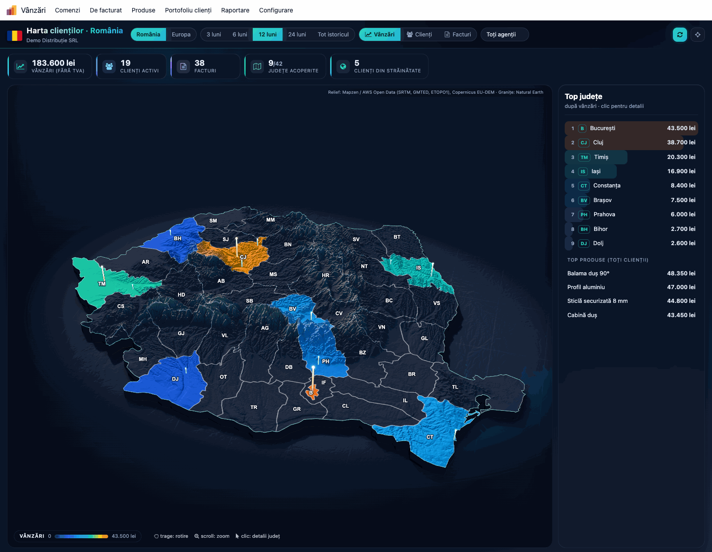
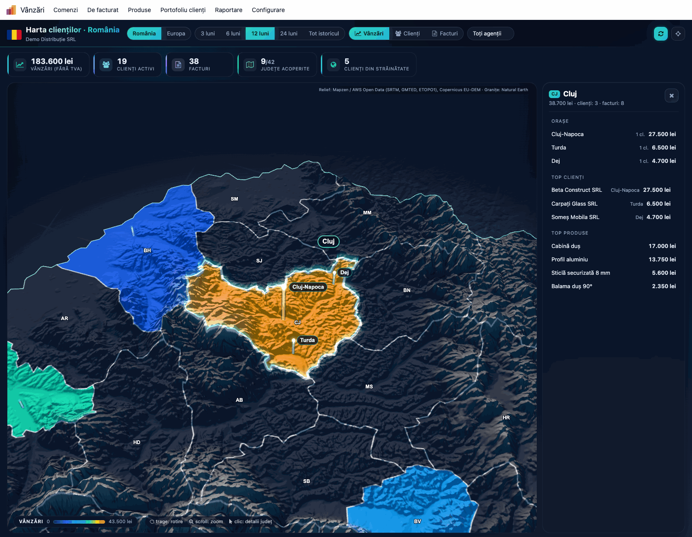
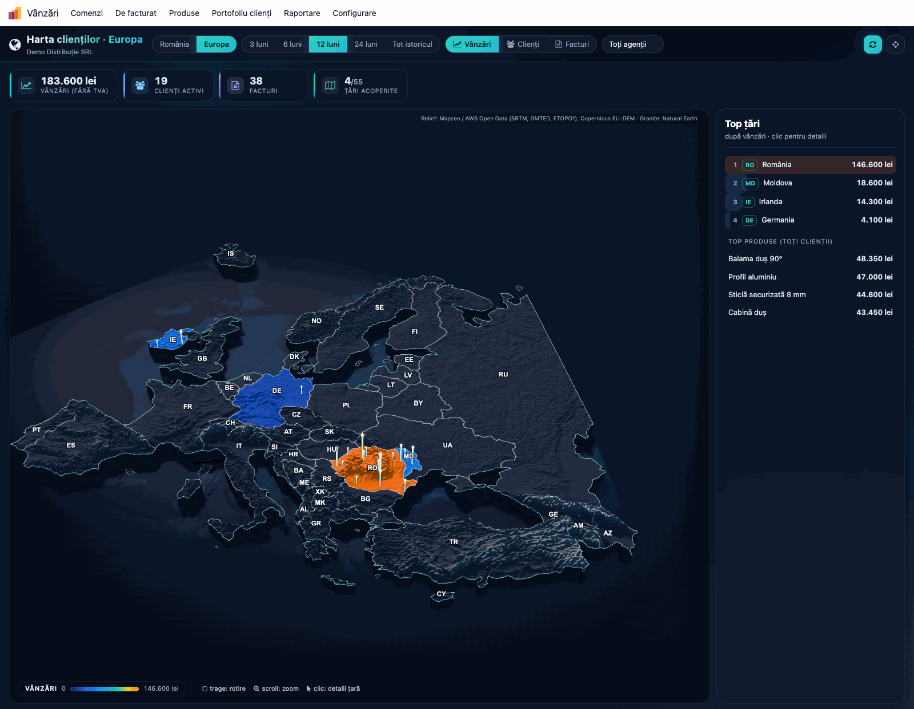
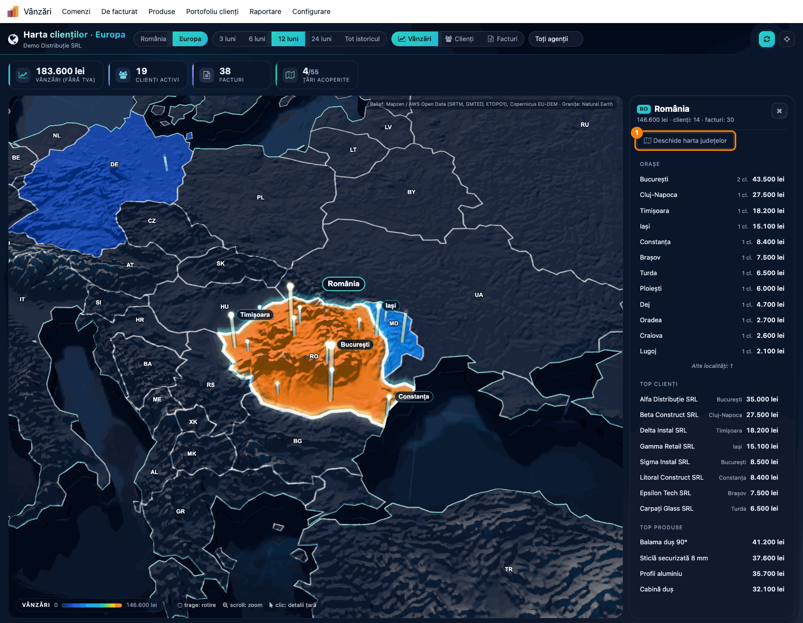
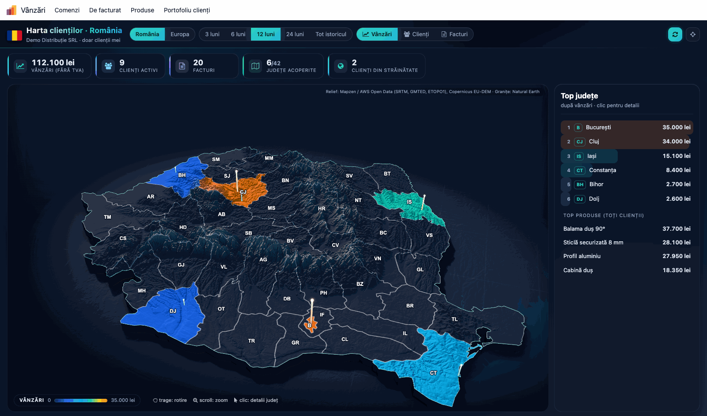

# Fișă Modul: Harta clienților — vânzări, clienți și facturi pe județe și pe țări, în 3D

**Modul:** `deltatech_customer_map`
**Utilizator principal:** Director de vânzări (toată firma, filtru pe agent), agent de vânzări (clienții proprii)
**Prioritate:** 🟢 Scăzută (modul de vizualizare, vandabil pe Apps; nu atinge documente sau contabilitatea)

---

## 1. Scop business

Directorul de vânzări vrea să vadă dintr-o privire **unde vinde firma**: ce județe aduc cele mai
multe vânzări, unde are clienți puțini și ce orașe contează într-un județ. Tabelele de vânzări pe
județ există, dar nu arată golurile de acoperire. Modulul desenează clienții pe o **hartă 3D pe
relieful real**:

- **harta României pe județe** (41 de județe și Bucureștiul): fiecare județ e colorat după metrica
  aleasă, iar orașele apar ca coloane proporționale cu valoarea;
- **harta Europei pe țări** (55 de țări și teritorii), pentru firmele care vând și în afara țării. De pe
  România se intră direct în harta județelor;
- trei metrici: **vânzări** (fără TVA, în moneda firmei), **clienți activi** și **facturi**, pe 3,
  6, 12 sau 24 de luni sau pe tot istoricul;
- un clic pe un județ sau pe o țară deschide **orașele, top clienții și top produsele** din zonă.

Agentul vede doar clienții proprii, iar directorul vede toată firma și poate filtra pe agent. Harta
provine din modulul scris de Alexandru Grecu pentru MD Trade Concept SRL și folosește rolurile și
setările modulului *Segmentarea clienților* (`deltatech_customer_segment`).

## 2. Bază legală și context

Nu există o bază legală specifică: modulul nu generează documente și nici note contabile. Face
analiză de gestiune peste facturile client existente.

Cum lucrează:

- **Calcul la deschidere, pe server.** Cifrele se calculează la fiecare deschidere a hărții și la
  fiecare schimbare de perioadă, agent sau hartă, direct din facturi. O factură validată azi apare
  imediat pe hartă.
- **Doar compania activă.** Harta arată facturile companiei selectate în bara de sus, în moneda ei.
  Cu mai multe companii bifate, cifrele celorlalte nu apar: comutați pe fiecare companie.
- **Aceleași linii de factură ca la segmentarea clienților.** Se iau doar liniile de produs de pe
  conturile de vânzare din setările *Portofoliu clienți → Setări* (implicit **70** pe o firmă din
  România), fără TVA, în moneda firmei. Harta ignoră însă celelalte două setări ale segmentării:
  lucrează mereu pe **facturi**, chiar dacă *Sursă* e *Comenzi de vânzare confirmate*, și include
  și persoanele fizice, chiar dacă *Doar companii (B2B)* e bifat. Liniile de avans nu sunt vânzări: vânzarea se numără pe factura
  finală. O stornare scade vânzările, dar nu se numără ca factură.
- **Clientul e firma** (partenerul comercial): facturile făcute pe persoanele de contact se adună
  la firma lor. Un client care are doar stornări în perioadă nu e numărat ca client activ.
- **Unde apare un client.**
  - Pe **harta României**: după județul de pe fișă; dacă lipsește, după orașul ales din lista de
    orașe (câmpul *Oraș* cu lista localităților, când e instalat `l10n_ro_city`); dacă nici acesta
    nu există, după numele orașului scris pe fișă („Mun. Cluj-Napoca”, „SECTOR1” sunt recunoscute).
    Clienții din altă țară apar ca *Clienți din străinătate*, iar cei din România al căror județ nu
    se poate găsi, ca *Clienți fără județ*.
  - Pe **harta Europei**: după țara de pe fișă. Un client fără țară e considerat din țara firmei.
    Clienții din afara Europei apar ca *Clienți în afara hărții*.
- **Harta 3D se încarcă doar la deschidere.** Motorul 3D (WebGL) nu încetinește restul Odoo. Pe un
  calculator fără WebGL 2, harta cade automat pe varianta 2.5D, desenată pe canvas, fără eroare.
- **Niciun câmp adăugat** pe fișa partenerului sau pe factură.

## 3. Utilizatori și roluri

Harta nu are rol propriu: folosește rolurile modulului *Segmentarea clienților*, din **Setări →
Utilizatori → (utilizator) → tab Drepturi de acces → secțiunea Vânzări → Portofoliu clienți**:

- **Clienții proprii:** agentul vede pe hartă doar clienții la care este trecut ca *Agent de
  vânzări* pe fișa clientului. Filtrul e aplicat de server, nu doar de ecran; lista de agenți nu
  apare.
- **Toți clienții:** directorul vede toată firma și alege un agent din lista *Toți agenții*. Lista
  conține agenții care au clienți cu facturi în perioada aleasă.

Roluri recomandate la testare:
- un director cu *Toți clienții*;
- un agent cu *Clienții proprii* și câțiva clienți atribuiți lui;
- un utilizator intern fără rol: nu vede meniul *Portofoliu clienți*.

## 4. Conturi și date implicate

Modulul nu generează note contabile. Citește:

- **facturile client validate** (`out_invoice`) și **stornările** (`out_refund`): data facturii,
  liniile de produs pe conturile de vânzare (implicit 70x pe o firmă RO), fără TVA, în moneda firmei;
- de pe **fișa clientului**: țara, județul, orașul și agentul de vânzări.

Date minime pentru demo: o firmă RO cu plan de conturi RO, 15–20 de clienți firme în câteva
județe (București, Cluj, Iași, Timiș, Constanța), fiecare cu 1–4 facturi validate pe ultimul an,
și câțiva clienți din Republica Moldova, Irlanda și Germania pentru harta Europei. Doi agenți, cu
clienții împărțiți între ei.

## 5. Configurare inițială

1. Instalați `deltatech_customer_map`. Instalează și `deltatech_customer_segment`, de care depinde.
2. Dați rolurile din **Setări → Utilizatori → (utilizator) → Drepturi de acces → Vânzări →
   Portofoliu clienți**: *Clienții proprii* agenților, *Toți clienții* directorului.
3. Pe fișa fiecărui client, completați **Agent de vânzări** (tab-ul *Vânzări & Achiziții*), **Țara**
   și **Județul**. Fără județ, clientul e plasat după oraș, dacă orașul e recunoscut.
4. Verificați în **Vânzări → Portofoliu clienți → Setări** câmpul *Conturi de vânzare* (implicit
   `70` pe o firmă din România): de el depinde ce se numără ca vânzare.
5. Opțional: instalați `l10n_ro_city`, cu lista localităților din România, ca orașul ales pe fișă să
   dea județul și pentru clienții fără județ completat.

## 6. Flux de utilizare

### Pasul 1 — Harta României

Deschideți **Vânzări → Portofoliu clienți → Harta clienților**. La prima deschidere, harta pornește
pe România, pentru ultimele 12 luni, cu metrica *Vânzări*; apare *Se încarcă harta…* câteva secunde,
cât se încarcă relieful. Harta, perioada, metrica și rotirea automată alese se rețin apoi în
browser.

1. **Găsiți pe ecran:**
   - în bara de sus: harta (*România* / *Europa*), perioada (*3 luni* … *Tot istoricul*), metrica
     (*Vânzări*, *Clienți*, *Facturi*) și, pentru director, lista *Toți agenții*;
   - indicatorii: *Vânzări (fără TVA)*, *Clienți activi*, *Facturi*, *Județe acoperite* (de exemplu
     9/42) și, dacă există, *Clienți fără județ* și *Clienți din străinătate*;
   - harta: județele colorate de la bleumarin (puțin) la portocaliu (mult), cele fără vânzări în
     gri; orașele ca coloane; legenda cu valoarea maximă, jos;
   - în dreapta, primele 10 județe după metrica aleasă (*Top județe*) și *Top produse (toți
     clienții)*: produsele cele mai vândute tuturor clienților din perioadă, inclusiv celor din
     străinătate și celor fără județ.
2. **Verificați:**
   - *Vânzări (fără TVA)* e egal cu totalul facturilor validate din perioadă pe conturile de vânzare,
     fără TVA și fără avansuri, minus stornările;
   - județul cu cea mai intensă culoare e primul în *Top județe*;
   - suma vânzărilor pe județe, plus clienții fără județ și cei din străinătate, dă totalul din
     indicatori. Când sunt mai mult de 10 județe cu vânzări, citiți restul județelor în caseta care
     apare la trecerea mouse-ului, sau alegeți o perioadă mai scurtă;
   - la schimbarea metricii pe *Clienți*, culorile, coloanele orașelor și clasamentul se refac.
3. **Treceți mai departe:** trageți cu mouse-ul pentru rotire și înclinare, folosiți rotița pentru
   zoom; dublu clic sau butonul cu ținta resetează vederea. Butonul cu săgeți oprește legănarea
   automată.



### Pasul 2 — Detaliile unui județ

Faceți clic pe un județ, pe hartă sau în *Top județe*. Camera se apropie de județ și îi arată
orașele principale, iar panoul din dreapta arată detaliile. Trecând cu mouse-ul peste un județ,
apare o casetă cu valoarea metricii, clienții, facturile și locul în clasament.

1. **Găsiți pe ecran**, în panoul din dreapta:
   - codul și numele județului, cu vânzările, numărul de clienți și de facturi;
   - *Orașe*: primele 12 localități după vânzări, cu numărul de clienți (*cl.*); câte au rămas
     apar ca *Alte localități: N*;
   - *Top clienți*: primii 8 clienți ai județului;
   - *Top produse*: primele 6 produse vândute în județ.
2. **Verificați:**
   - vânzările județului sunt egale cu suma vânzărilor pe orașele lui, dacă toți clienții au orașul
     completat. Un client fără oraș intră doar în totalul județului, iar orașele de după primele 12
     apar doar ca număr;
   - un client apare în județul de pe fișă, chiar dacă orașul scris e din alt județ;
   - un client din alt județ nu apare în *Top clienți*.
3. **Treceți mai departe:** un clic pe un client din *Top clienți* deschide fișa lui. Butonul *X*
   închide panoul și revine la *Top județe*.



### Pasul 3 — Harta Europei

În bara de sus, apăsați **Europa**. Harta Europei are 55 de țări și teritorii (inclusiv Kosovo,
Insulele Feroe, Jersey), desenate în proiecția Lambert, ca nordul continentului să nu fie lățit.

1. **Găsiți pe ecran:**
   - țările colorate după metrica aleasă; România, Moldova, Irlanda și celelalte țări cu clienți
     ies în evidență;
   - *Țări acoperite* (de exemplu 4/55) și, dacă există, *Clienți în afara hărții*;
   - în dreapta, *Top țări* și *Top produse (toți clienții)*.
2. **Verificați:**
   - totalul *Vânzări (fără TVA)* e același ca pe harta României, pentru aceeași perioadă și același
     agent: se schimbă doar gruparea, pe țări;
   - vânzările României pe harta Europei sunt egale cu suma județelor, plus clienții fără județ;
   - un client din Irlanda apare în Irlanda, chiar dacă orașul lui are același nume ca un oraș din
     România.
3. **Treceți mai departe:** alegeți o țară pentru detalii (Pasul 4). Harta aleasă se reține în
   browser: la următoarea deschidere porniți tot de pe Europa.



### Pasul 4 — De pe Europa în harta județelor

Faceți clic pe **România**, pe hartă sau în *Top țări*. Panoul arată orașele, top clienții și top
produsele României, ca la un județ, și butonul **Deschide harta județelor**.

1. **Găsiți pe ecran:** butonul *Deschide harta județelor* sub numele țării, apoi orașele țării în
   ordinea vânzărilor și top clienții.
2. **Verificați:** butonul apare doar la țara firmei, pentru care există harta pe județe. La celelalte
   țări, panoul arată doar orașele, clienții și produsele.
3. **Treceți mai departe:** butonul deschide harta României, cu aceeași perioadă și metrică (Pasul 1).



### Pasul 5 — Ce vede un agent

Conectat ca agent cu rolul *Clienții proprii*, deschideți **Vânzări → Portofoliu clienți → Harta
clienților**.

1. **Găsiți pe ecran:** sub titlu apare *doar clienții mei*, iar lista *Toți agenții* lipsește.
2. **Verificați:** indicatorii și județele numără doar clienții la care agentul e trecut pe fișă;
   *Clienți activi* e mai mic decât la director. *Top produse (toți clienții)* înseamnă aici toți
   clienții agentului, inclusiv cei din străinătate.



### Note de monografie și raportare

Modulul **nu generează note contabile** și nu modifică documente. Cifrele sunt de gestiune:

- *Vânzări* = liniile de produs de pe conturile de vânzare din setările *Portofoliu clienți*
  (implicit 70x pe o firmă RO, din nota 4111 = % / 70x / 4427), minus stornările, fără TVA, în moneda
  firmei. Liniile de avans, oricare ar fi contul lor, nu intră.
- *Facturi* = facturile client validate care au cel puțin o linie de vânzare; stornările nu se numără.
- *Clienți activi* = clienții (partenerul comercial: firmă sau persoană fizică) cu cel puțin o
  factură în perioadă.

## 7. Legături cu alte module / declarații

| Modul | Rol |
| --- | --- |
| `deltatech_customer_segment` | meniul *Portofoliu clienți*, rolurile *Clienții proprii* / *Toți clienții* și setarea *Conturi de vânzare* |
| `account` | facturile client și stornările |
| `sale_management` / `sale` | meniul *Vânzări* și marcajul liniilor de avans, excluse din vânzări |
| `base_address_extended` + `l10n_ro_city` (opționale) | orașul ales din listă dă județul clienților fără județ pe fișă |
| `deltatech_customer_analysis` (opțional) | tabloul „ce faci azi cu fiecare client”, în același meniu |

**Ce e automat:**
- calculul cifrelor la fiecare deschidere a hărții;
- plasarea clientului după județ, oraș sau țară;
- respectarea rolului agentului pe server;
- trecerea pe harta 2.5D când calculatorul nu are WebGL 2.

**Ce rămâne manual:**
- rolurile utilizatorilor;
- agentul, țara și județul de pe fiecare client;
- setarea *Conturi de vânzare*.

## 8. Verificări pentru consultant

- [ ] Meniul *Harta clienților* apare sub *Vânzări → Portofoliu clienți* pentru director și agent,
      nu și pentru un utilizator fără rol.
- [ ] *Vânzări (fără TVA)* pe 12 luni = suma liniilor de vânzare (70x) fără TVA din facturile
      validate, minus stornările. O factură de avans nu schimbă cifra; factura finală o schimbă.
- [ ] O stornare scade vânzările județului, dar *Facturi* rămâne neschimbat.
- [ ] O factură în valută apare convertită în moneda firmei.
- [ ] Un client fără județ, cu orașul „Mun. Cluj-Napoca”, apare în județul Cluj.
- [ ] Un client din Irlanda cu orașul „Cluj” apare la *Clienți din străinătate* pe harta României și
      în Irlanda pe harta Europei.
- [ ] Un client din România fără județ și cu un oraș necunoscut apare la *Clienți fără județ*.
- [ ] Totalul *Vânzări (fără TVA)* e același pe harta României și pe cea a Europei, pentru aceeași
      perioadă și același agent.
- [ ] Pe harta Europei, *Deschide harta județelor* apare la România și duce în harta județelor.
- [ ] Un agent cu *Clienții proprii* vede doar clienții lui și nu vede lista *Toți agenții*.
- [ ] Directorul care alege un agent din *Toți agenții* vede aceleași cifre ca agentul.
- [ ] Pe un calculator fără WebGL 2, harta apare în varianta 2.5D, cu aceleași cifre.
- [ ] Pe o firmă din afara României apare doar harta Europei.
- [ ] Cu *Sursă* = *Comenzi de vânzare confirmate* în setările segmentării, harta arată tot
      facturile: cifrele diferă de segmentare, e normal.
- [ ] Cu *Doar companii (B2B)* bifat în setările segmentării, persoanele fizice apar în continuare
      pe hartă.
- [ ] Cu două companii, harta arată doar facturile companiei active.

## 9. Mesaje de eroare frecvente

| Mesaj | Cauză | Remediere |
| --- | --- | --- |
| *Harta clienților necesită un rol Portofoliu clienți (…)* | un utilizator fără rol *Portofoliu clienți* deschide harta dintr-un link sau favorit (meniul nu îi apare) | dați *Clienții proprii* sau *Toți clienții* din fișa utilizatorului |
| *Datele hărții nu au putut fi încărcate.* | cererea de cifre către server a eșuat (conexiune, server repornit) | reîncărcați pagina |
| *Nicio factură validată în perioada selectată.* | nicio factură în perioadă (sau niciuna pe clienții agentului) | alegeți o perioadă mai lungă; verificați agentul de pe clienți |
| *Geometria hărții nu a putut fi încărcată. (…)* | fișierele hărții nu s-au putut descărca (activele nu sunt construite, conexiune întreruptă) | reîncărcați pagina; dacă persistă, reconstruiți activele (actualizați modulul) și goliți memoria cache a browserului |
| cifre mai mici decât în contabilitate | altă companie activă în bara de sus, sau facturi pe conturi din afara *Conturi de vânzare* | comutați pe compania corectă; verificați setarea |
| harta goală, deși există facturi | liniile facturilor sunt pe conturi care nu încep cu prefixele din *Conturi de vânzare* | verificați setarea din *Portofoliu clienți → Setări* |
| mulți *Clienți fără județ* | clienții nu au județ pe fișă, iar orașul nu e recunoscut | completați județul pe fișă; instalați `l10n_ro_city` și alegeți orașul din listă |
| harta apare plată, fără relief | calculatorul nu are WebGL 2 și s-a trecut pe varianta 2.5D | normal; cifrele sunt aceleași. Actualizați browserul sau driverul plăcii video |

## 10. Capturi de ecran

Capturile sunt generate automat de `tests/test_screenshots.py`, cu mixinul `ScreenshotCase` din
`l10n_ro_doc_screenshots` (import defensiv, fără dependență în manifest). Interfața e în română, pe
planul de conturi RO, reduse la 256 de culori, pe o firmă demo în RON, cu clienți în mai multe județe, câțiva clienți din
Republica Moldova, Irlanda și Germania și doi agenți.

| Fișier | Ce arată |
| --- | --- |
| `screenshots/01_harta_romania.png` | harta României cu vânzările pe județe, indicatorii și *Top județe* |
| `screenshots/02_judet_detalii.png` | detaliile județului Cluj: orașe, top clienți, top produse |
| `screenshots/03_harta_europa.png` | harta Europei cu vânzările pe țări și *Top țări* |
| `screenshots/04_europa_romania.png` | România selectată pe harta Europei, cu *Deschide harta județelor* |
| `screenshots/05_vedere_agent.png` | harta văzută de un agent, doar cu clienții proprii |

Regenerare:

```bash
./odoo/odoo-bin -c <config> -d <db_test> -i deltatech_customer_map,l10n_ro,l10n_ro_doc_screenshots \
    --test-tags=/deltatech_customer_map:TestCustomerMapFisaScreenshots \
    --stop-after-init --http-port=8987
```

## 11. Observații pentru manual

- Prezentați harta ca **răspuns la întrebarea „unde vindem?”**: județele gri sunt zone fără
  clienți, iar un județ mare cu o singură coloană înaltă depinde de un singur oraș.
- Explicați că cifrele sunt **fără TVA** și vin din facturi, nu din comenzi: o comandă confirmată,
  dar nefacturată, nu apare pe hartă.
- Recomandați completarea județului pe fișa clienților înainte de prezentare: indicatorul *Clienți
  fără județ* arată câți clienți lipsesc de pe hartă.
- Pentru firmele care exportă, începeți cu harta Europei și intrați apoi în județele României.
- Harta are o temă întunecată proprie, și în Odoo cu temă luminoasă: la tipărirea manualului,
  capturile ies închise la culoare.
