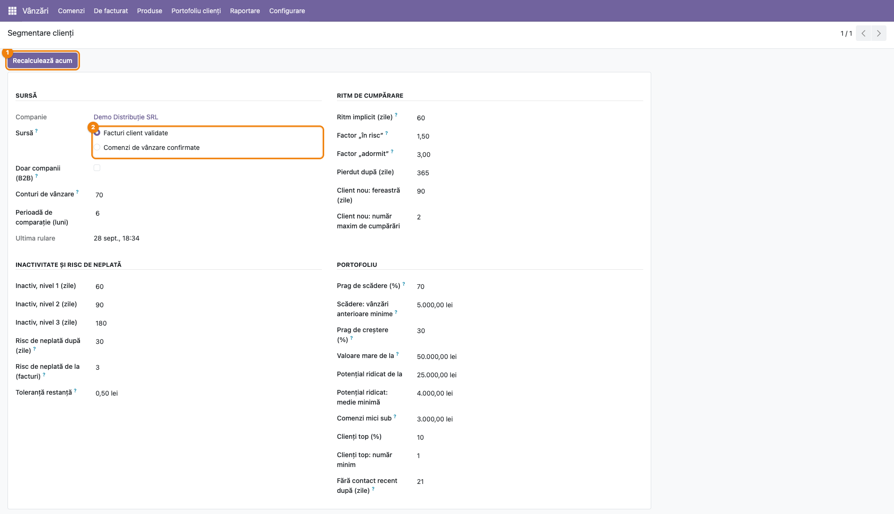
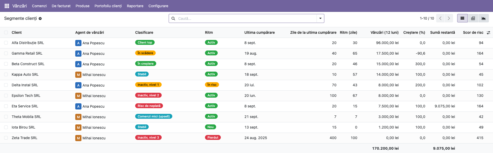
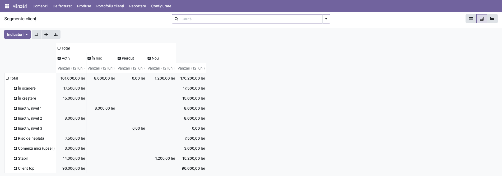
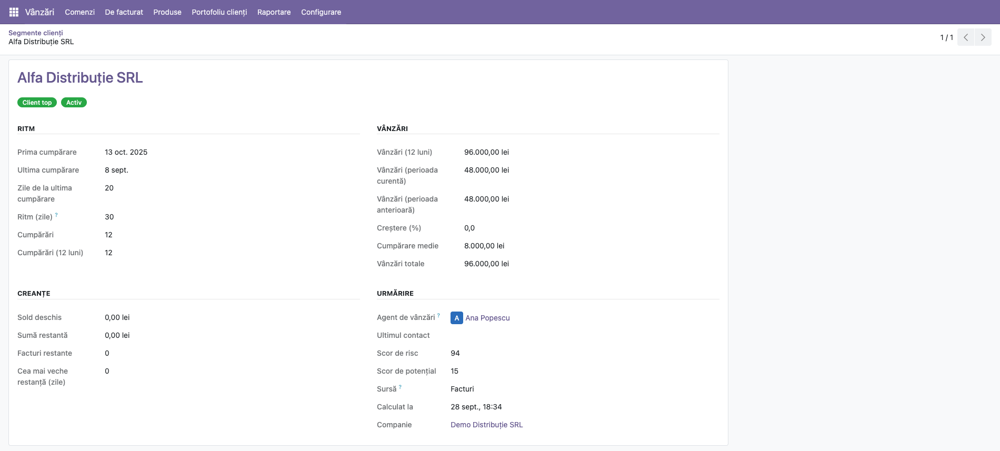
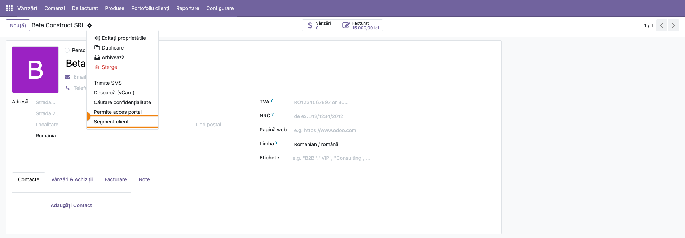
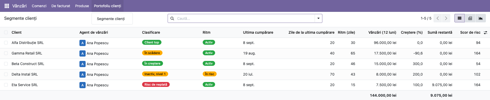

# Fișă Modul: Segmentarea clienților — ritm de cumpărare, vânzări, restanțe și clasificare în portofoliu

**Modul:** `deltatech_customer_segment`
**Utilizator principal:** Director de vânzări (portofoliul întreg, setări), agent de vânzări (clienții proprii)
**Prioritate:** 🟡 Medie (modul nou, vandabil pe Apps; baza pentru analiza clienților și pentru misiunile comerciale)

---

## 1. Scop business

O firmă de distribuție are sute sau mii de clienți, iar agenții își dau seama prea târziu că un
client bun a încetat să mai cumpere. Modulul răspunde în fiecare noapte, pentru fiecare client, la
întrebarea **„cum stă clientul acesta față de ce obișnuia să facă?”**:

- **ritmul de cumpărare**: la câte zile cumpără de obicei, măsurat pe istoricul lui, și de câte
  zile tace;
- **segmentul de ritm**: nou, activ, în risc, adormit sau pierdut, judecat față de ritmul propriu
  al clientului, nu față de o medie a firmei. Un client săptămânal care tace de trei săptămâni e
  în risc; unul trimestrial care tace de două luni e încă activ;
- **vânzările**: totalul, ultimele 12 luni, perioada curentă comparată cu cea anterioară, creșterea;
- **creanțele**: soldul deschis, restanța și vechimea celei mai vechi facturi restante;
- **clasificarea în portofoliu**: client top, în creștere, potențial ridicat, comenzi mici,
  stabil, în scădere, inactiv pe trei niveluri sau risc de neplată, plus un scor de risc și unul
  de potențial.

Directorul vede tot portofoliul, iar agentul vede doar clienții lui. Motorul provine din modulele
de analiză scrise de Alexandru Grecu pentru MD Trade Concept SRL și e baza tabloului de analiză a
clienților și a misiunilor comerciale, care vin ca module separate.

## 2. Bază legală și context

Nu există o bază legală specifică: modulul nu generează documente și nici note contabile. Face
analiză de gestiune peste facturile și comenzile existente.

Cum lucrează:

- **Calcul nocturn, în baza de date.** Acțiunea programată *Segment client: recalcul nocturn*
  recalculează toate rândurile unei companii într-o singură interogare. Nu se recalculează la
  fiecare deschidere a ecranului, așa că lista rămâne rapidă și la sute de mii de facturi.
- **Instalarea nu calculează nimic.** Primul calcul pornește prin acțiunea programată, la un minut
  după instalare. Pe o bază mare, un calcul în timpul instalării ar depăși limita de timp a
  serverului.
- **Un rând pe client și pe companie.** Clientul e firma (partenerul comercial): vânzările făcute
  pe persoanele de contact se adună la firma lor. Un client fără nicio vânzare în companie nu are
  rând; e un prospect.
- **Niciun câmp adăugat pe fișa partenerului.** Rezultatele stau într-un tabel propriu și se
  deschid din fișa partenerului prin *Acțiune → Segment client*.
- **Vânzările sunt fără TVA și în moneda companiei.** Pe facturi se iau doar liniile de produs pe
  conturile de vânzare, în moneda companiei, cu stornările scăzute. Pe o firmă din România,
  conturile de vânzare sunt implicit cele care încep cu **70**: o factură de penalități de
  întârziere (7581), de dobânzi (766) sau de vânzare a unui mijloc fix (7583) nu e o cumpărare și
  nu resetează tăcerea clientului. Prefixele se schimbă din setări; gol înseamnă orice cont de
  venit. Liniile de avans (oricare ar fi contul lor) și de garanție SGR nu sunt vânzări: vânzarea
  se numără pe factura finală, iar o factură formată doar din avans nu e numărată drept cumpărare.
  Pe comenzi, valoarea fără TVA convertită la cursul comenzii.
- **Soldul și restanța includ TVA.** Sunt restul de plată al facturilor și stornărilor client,
  **nu soldul fișei de cont**: soldurile inițiale preluate prin notă contabilă, încasările
  nereconciliate și avansurile încasate pe 419 nu intră. Restanța se calculează pe fiecare rată,
  după scadența ei. Avansurile acordate personalului (425) și debitorii diverși (461) nu intră,
  deși au același tip de cont de creanță. Nici clienții reclasificați pe **4118 Clienți incerți**
  nu mai apar cu restanță, dacă nota de reclasificare e reconciliată cu factura: în Odoo 4118 nu e
  cont de creanță.

## 3. Utilizatori și roluri

Rolurile sunt în **Setări → Utilizatori → (utilizator) → tab Drepturi de acces → secțiunea Vânzări →
Portofoliu clienți**:

- **Clienții proprii:** agentul vede doar clienții la care este agent de vânzări (câmpul *Agent de
  vânzări* de pe fișa clientului). Filtrul e aplicat de server, nu doar de ecran.
- **Toți clienții:** directorul vede toți clienții și modifică setările de segmentare. Rolul îl
  include pe cel de agent.

Rolurile nu se dau automat agenților de vânzări. Administratorul primește la instalare rolul
*Toți clienții*, ca ecranele să fie accesibile pe o bază nouă.

Roluri recomandate la testare:
- un director cu *Toți clienții*;
- un agent cu *Clienții proprii* și câțiva clienți atribuiți lui;
- un utilizator intern fără rol: nu vede meniul *Portofoliu clienți*.

## 4. Conturi și date implicate

Modulul nu generează note contabile. Citește:

- **facturile client validate** (`out_invoice`) și **stornările** (`out_refund`): data facturii,
  valoarea liniilor de vânzare fără TVA în moneda companiei, scadența fiecărei rate, restul de plată;
- **comenzile de vânzare confirmate**, dacă sursa aleasă e *Comenzi de vânzare confirmate*;
- **mesajele** înregistrate pe client sau pe persoanele lui de contact (note, emailuri), pentru data
  ultimului contact;
- **agentul de vânzări** și **etichetele** de pe fișa clientului.

Restanța corespunde creanțelor din facturi pe contul de creanță al clientului (implicit **4111
Clienți**). Nu include soldurile din **425 Avansuri acordate personalului** sau **461 Debitori
diverși**, nici soldurile inițiale din note contabile.

Date minime pentru demo: o firmă RO cu plan de conturi RO, cel puțin 8–10 clienți firme, cu facturi
validate pe ultimul an și jumătate în tipare diferite. De exemplu: un client lunar mare, unul în
creștere, unul în scădere, câțiva inactivi, unul cu facturi restante, unul cu comenzi mici și dese
și unul nou. Cea mai mare parte din facturi trebuie să fie încasate, altfel toți clienții ies cu
risc de neplată.

## 5. Configurare inițială

1. Instalați `deltatech_customer_segment`. Depinde de `sale_management` și `account`.
2. Dați rolurile din **Setări → Utilizatori → (utilizator) → Drepturi de acces → Vânzări → Portofoliu
   clienți**: *Clienții proprii* agenților, *Toți clienții* directorului.
3. Pe fișa fiecărui client, completați **Agent de vânzări** (tab-ul *Vânzări & Achiziții*).
   Agentul vede doar clienții pe care e trecut.
4. Deschideți **Vânzări → Portofoliu clienți → Setări** și alegeți sursa (facturi sau comenzi),
   filtrul B2B, perioada de comparație și pragurile (§6, Pasul 1).
5. Apăsați **Recalculează acum**, sau așteptați acțiunea programată de noapte.

## 6. Flux de utilizare

### Pasul 1 — Setările segmentării

Deschideți **Vânzări → Portofoliu clienți → Setări**. Setările sunt per companie; formularul se
deschide direct pe compania curentă.

- **Sursă:**
  - *Facturi client validate* (implicit) sau *Comenzi de vânzare confirmate*;
  - *Doar companii (B2B)* exclude persoanele fizice;
  - *Conturi de vânzare*: prefixele conturilor de venit numărate ca vânzări, implicit `70` pe o
    firmă din România. Gol: orice cont de venit;
  - *Perioadă de comparație (luni)*, implicit 6, compară ultimele N luni cu cele N dinainte.
- **Ritm de cumpărare:**
  - *Ritm implicit (zile)*: ritmul presupus pentru un client cu o singură cumpărare;
  - *Factor „în risc”* (1,5) și *Factor „adormit”* (3): câte ritmuri proprii poate tăcea clientul;
  - *Pierdut după (zile)* (365);
  - fereastra și numărul maxim de cumpărări pentru un *client nou*.
- **Inactivitate și risc de neplată:**
  - cele trei niveluri de inactivitate: 60 / 90 / 180 de zile;
  - pragurile de restanță: cea mai veche factură restantă peste 30 de zile sau cel puțin 3 facturi
    restante;
  - toleranța sub care un sold se ignoră.
- **Portofoliu:** pragurile pentru scădere, creștere, valoare mare, potențial, comenzi mici și
  clienți top. Sunt în moneda companiei; valorile implicite vin de la un distribuitor din România
  și trebuie ajustate la mărimea comenzilor proprii.

Apăsați **Recalculează acum**. Mesajul *Segmentele clienților au fost recalculate.* confirmă calculul,
iar *Ultima rulare* arată momentul lui.



### Pasul 2 — Lista segmentelor

Deschideți **Vânzări → Portofoliu clienți → Segmente clienți**.

1. **Găsiți pe ecran:**
   - fiecare rând e un client, cu agentul, *Clasificare* și *Ritm* ca etichete colorate;
   - *Ultima cumpărare*, *Zile de la ultima cumpărare* și *Ritm (zile)*;
   - *Vânzări (12 luni)*, *Creștere (%)*, *Sumă restantă* și *Scor de risc*.

   Scorurile servesc doar la sortare, ca ordine relativă. *Scorul de risc* crește cu soldul, cu
   vechimea restanței, cu zilele de tăcere, cu scăderea vânzărilor și când nu există un contact
   recent. Primește un plus fix pentru clienții de valoare mare, pentru că pierderea lor costă mai
   mult: de aceea un client top care plătește la timp poate avea un scor mai mare decât unul mic.
   *Scorul de potențial* crește cu creșterea vânzărilor și cu luna curentă peste cea trecută.

   Lista e ordonată după vânzările din ultimele 12 luni, descrescător. Alte coloane (vânzări pe
   perioada curentă și cea anterioară, cea mai veche restanță) se adaugă din meniul de coloane
   opționale.
2. **Verificați:**
   - un client cu *Zile de la ultima cumpărare* mult peste *Ritm (zile)* are ritmul *În risc*,
     *Adormit* sau *Pierdut*;
   - un client cu *Sumă restantă* are clasificarea *Risc de neplată* dacă cea mai veche restanță are
     cel puțin 30 de zile sau are cel puțin 3 facturi restante. Inactivitatea are prioritate: un
     client care nu mai cumpără de peste 60 de zile și nici nu plătește apare *Inactiv*, nu *Risc
     de neplată*. Pentru recuperare folosiți filtrul *Cu restanță*, care îi prinde pe toți;
   - *Vânzări (12 luni)* e fără TVA, iar *Sumă restantă* e cu TVA (suma de încasat);
   - un client cu o singură cumpărare are *Ritm (zile)* 0, pentru că ritmul nu se poate măsura. E
     *Nou* cât timp e în fereastra de client nou; după aceea e judecat după *Ritm implicit*;
   - *Creștere (%)* e 100 când perioada anterioară n-are vânzări. Un astfel de client nu e
     clasificat *În creștere*, care cere vânzări în ambele perioade;
   - totalurile coloanelor de sume apar la baza listei.
3. **Treceți mai departe:** folosiți filtrele din căutare pentru lista de apeluri a zilei: *În
   scădere*, *Inactivi*, *Risc de neplată*, *Cu restanță*, *Clienți top*, *În risc (față de ritmul
   propriu)*, *Adormit*, *A cumpărat o singură dată*, *Clienții mei*. Grupați după *Clasificare*,
   *Ritm* sau *Agent de vânzări*. Vederea **Grafic** arată vânzările pe clasificare.



### Pasul 3 — Vederea pivot: portofoliul pe clasificare și ritm

Din lista de segmente, comutați pe vederea **Pivot**.

1. **Găsiți pe ecran:** clasificarea pe rânduri, ritmul pe coloane și *Vânzări (12 luni)* ca
   măsură.
2. **Verificați:**
   - totalul general e egal cu totalul coloanei *Vânzări (12 luni)* din listă;
   - cea mai mare parte a vânzărilor stă în *Client top*, *Stabil* și *În creștere*;
   - sumele mari pe *În scădere* sau pe *Inactiv* sunt vânzările în pericol.
3. **Treceți mai departe:** un clic pe o celulă deschide clienții din ea. Pictograma de descărcare
   din pivot (*Descărcați xlsx*) exportă tabelul.



### Pasul 4 — Fișa segmentului unui client

Un clic pe un rând deschide fișa segmentului, doar pentru citire.

1. **Găsiți pe ecran**, în patru grupuri:
   - **Ritm:** prima și ultima cumpărare, zilele de la ultima cumpărare, ritmul, numărul de
     cumpărări total și pe 12 luni;
   - **Vânzări:** 12 luni, perioada curentă, perioada anterioară, creșterea, cumpărarea medie, totalul;
   - **Creanțe:** sold deschis, sumă restantă, facturi restante, cea mai veche restanță;
   - **Urmărire:** agentul, ultimul contact, scorurile, sursa datelor și momentul calculului.
2. **Verificați:**
   - *Creștere (%)* = (perioada curentă − perioada anterioară) / perioada anterioară × 100, sau 100
     când perioada anterioară e zero;
   - *Cumpărare medie* = *Vânzări totale* / *Cumpărări*;
   - *Calculat la* e data ultimei rulări.
3. **Treceți mai departe:** reveniți în listă din breadcrumb, sau deschideți clientul pentru apel
   sau ofertă.



### Pasul 5 — Din fișa clientului: Acțiune → Segment client

Pe fișa unui client (**Vânzări → Comenzi → Clienți**, sau **Contacte**, dacă e instalat),
deschideți meniul **Acțiune** (rotița din bara de sus) și alegeți **Segment client**. Se deschide
lista segmentelor filtrată pe client, cu un singur rând; un clic pe rând deschide fișa. De pe o
persoană de contact se deschide rândul firmei ei. Un prospect, fără vânzări, nu are rând, iar
lista apare goală. Acțiunea apare doar utilizatorilor cu unul dintre cele două roluri.



### Pasul 6 — Ce vede un agent

Conectat ca agent cu rolul *Clienții proprii*, deschideți **Vânzări → Portofoliu clienți →
Segmente clienți**.

1. **Găsiți pe ecran:** doar clienții la care agentul e trecut pe fișă.
2. **Verificați:** niciun client al altui agent nu apare, nici după ce scoateți toate filtrele.
   Meniul *Setări* nu apare.



### Note de monografie și raportare

Modulul **nu generează note contabile** și nu modifică documente. Cifrele sunt de gestiune:

- *Vânzări* = liniile de produs de pe conturile de vânzare din setări (implicit 70x pe o firmă RO,
  din nota 4111 = 70x + 4427), minus stornările, fără TVA, în moneda companiei. Sau comenzile
  confirmate, dacă sursa e *Comenzi*. Liniile de avans, oricare ar fi contul lor, și garanțiile
  SGR nu intră.
- *Sold deschis* / *Sumă restantă* = restul de plată al liniilor de creanță (implicit 4111) de pe
  facturile și stornările client, cu TVA; restanța e partea cu scadența depășită, rată cu rată.
  Nu e soldul fișei de cont: soldurile inițiale din note contabile și încasările nereconciliate nu
  intră.
- Soldurile din 425 și 461 nu intră, deși Odoo le tratează tot ca creanțe.

## 7. Legături cu alte module / declarații

| Modul | Rol |
| --- | --- |
| `sale_management` / `sale` | meniul *Vânzări*, comenzile de vânzare confirmate (sursa *Comenzi*) și agentul de vânzări de pe client |
| `account` | facturile client, stornările, scadențele și restul de plată |
| `mail` | mesajele de pe client, pentru data ultimului contact |
| analiza clienților și misiunile comerciale (module viitoare) | citesc rândurile acestui modul, nu recalculează istoricul |

**Ce e automat:**
- recalculul nocturn, pentru toate companiile;
- ștergerea rândului unui client care nu mai are vânzări (de exemplu, după anularea facturilor);
- respectarea rolului agentului pe server.

**Ce rămâne manual:**
- rolurile utilizatorilor;
- agentul de vânzări de pe fiecare client;
- pragurile din setări;
- acțiunea pe client (apel, ofertă), în afara modulului.

## 8. Verificări pentru consultant

- [ ] După instalare, acțiunea programată *Segment client: recalcul nocturn* e activă, iar primul
      calcul rulează la un minut după instalare, nu în timpul instalării.
- [ ] *Recalculează acum* din setări completează lista și actualizează *Ultima rulare*.
- [ ] Un client cu facturi doar pe persoanele de contact apare o singură dată, pe firmă.
- [ ] Un client ale cărui facturi au fost toate anulate dispare din listă la următorul calcul.
- [ ] *Vânzări totale* = suma liniilor de vânzare (70x) fără TVA, minus stornările, fără garanția SGR
      și fără avansuri. O factură în valută apare convertită în moneda companiei.
- [ ] O factură de penalități de întârziere (7581) către client nu îi schimbă *Ultima cumpărare*.
- [ ] Pe o firmă RO, *Conturi de vânzare* = `70` în setări. Dacă e gol (setările s-au creat înainte
      de planul de conturi RO), completați-l și apăsați *Recalculează acum*.
- [ ] *Sumă restantă* include doar ratele cu scadența depășită ale facturilor client, nu avansurile salariaților
      (425).
- [ ] La o factură cu plata în două rate, doar rata ajunsă la scadență apare ca restanță.
- [ ] O factură de avans nu apare ca cumpărare; vânzarea se numără la factura finală.
- [ ] Cu un sold inițial al clientului preluat prin notă contabilă, *Sold deschis* diferă de fișa
      partenerului: e normal, modulul citește doar facturile.
- [ ] Un client care cumpără lunar și tace de 50 de zile are ritmul *În risc*. Unul care cumpără
      trimestrial și tace de 60 de zile e *Activ*.
- [ ] Schimbarea pragului *Inactiv, nivel 1 (zile)* schimbă clasificarea după *Recalculează acum*.
- [ ] Cu *Doar companii (B2B)* bifat, persoanele fizice dispar din listă la următorul calcul.
- [ ] Un agent cu *Clienții proprii* vede doar clienții lui și nu vede meniul *Setări*.
- [ ] Într-o bază cu două companii, fiecare companie vede doar rândurile proprii.
- [ ] Din fișa clientului, *Acțiune → Segment client* deschide rândul lui.

## 9. Mesaje de eroare frecvente

| Mesaj | Cauză | Remediere |
| --- | --- | --- |
| *Perioada de comparație trebuie să fie de cel puțin o lună.* | perioada setată la 0 | puneți cel puțin 1 |
| *Factorul „în risc” trebuie să fie pozitiv și să nu depășească factorul „adormit”.* | factorii inversați sau zero | de exemplu 1,5 și 3 |
| *Nivelurile de inactivitate trebuie să fie pozitive și crescătoare.* | nivelurile 1 / 2 / 3 nu sunt în ordine | de exemplu 60 / 90 / 180 |
| *Setările de segmentare există deja pentru această companie.* | o a doua fișă de setări pentru aceeași companie | folosiți fișa existentă, deschisă din meniul *Setări* |
| *Încă nu există segmente de clienți* (listă goală) | calculul n-a rulat încă, sau compania nu are facturi validate | *Recalculează acum*; verificați sursa din setări |
| *Acțiune → Segment client* deschide o listă goală | clientul nu are nicio vânzare (prospect) sau calculul n-a rulat după prima lui factură | *Recalculează acum* |
| lista agentului e goală | agentul nu e trecut pe niciun client | completați *Agent de vânzări* pe fișa clienților |
| toți clienții apar cu *Risc de neplată* | facturile nu sunt încasate în Odoo (plățile nu sunt reconciliate) | reconciliați încasările; verificați pragurile de restanță |

## 10. Capturi de ecran

Capturile sunt generate automat de `tests/test_screenshots.py`, cu mixinul `ScreenshotCase` din
`l10n_ro_doc_screenshots` (import defensiv, fără dependență în manifest). Interfața e în română, pe
planul de conturi RO, pe o firmă demo în RON, cu 10 clienți cu facturi în tipare diferite și doi
agenți.

| Fișier | Ce arată |
| --- | --- |
| `screenshots/01_setari.png` | setările segmentării și butonul *Recalculează acum* |
| `screenshots/02_segmente_lista.png` | lista *Segmente clienți* |
| `screenshots/03_pivot.png` | pivotul clasificare × ritm |
| `screenshots/04_fisa_segment.png` | fișa segmentului unui client |
| `screenshots/05_actiune_partener.png` | fișa clientului cu *Acțiune → Segment client* |
| `screenshots/06_vedere_agent.png` | lista văzută de un agent, doar cu clienții proprii |

Regenerare:

```bash
./odoo/odoo-bin -c <config> -d <db_test> -i deltatech_customer_segment,l10n_ro,l10n_ro_doc_screenshots \
    --test-tags=/deltatech_customer_segment:TestCustomerSegmentFisaScreenshots \
    --stop-after-init --http-port=8987
```

## 11. Observații pentru manual

- Prezentați modulul ca **lista de apeluri a zilei**, nu ca raport: filtrele *În scădere*, *Inactivi*
  și *Risc de neplată* spun agentului pe cine sună azi. Pentru recuperarea banilor, *Cu restanță*
  sortat după *Sumă restantă*: îi prinde și pe clienții inactivi care n-au plătit.
- Explicați diferența dintre cele două câmpuri: **Ritm** spune cum stă clientul față de propriul
  obicei, iar **Clasificare** spune ce loc are în portofoliu. Un client poate fi *Activ* ca ritm și
  *În scădere* ca vânzări.
- Pragurile implicite sunt în lei, pentru un distribuitor. Recomandați clientului să le ajusteze
  înainte de prezentarea către agenți.
- Cifrele se actualizează o dată pe noapte: o factură validată azi apare mâine, sau după
  *Recalculează acum*.
