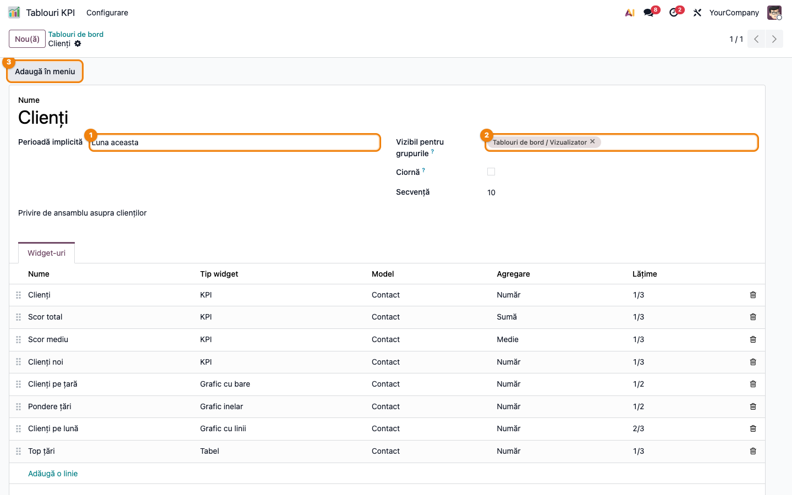
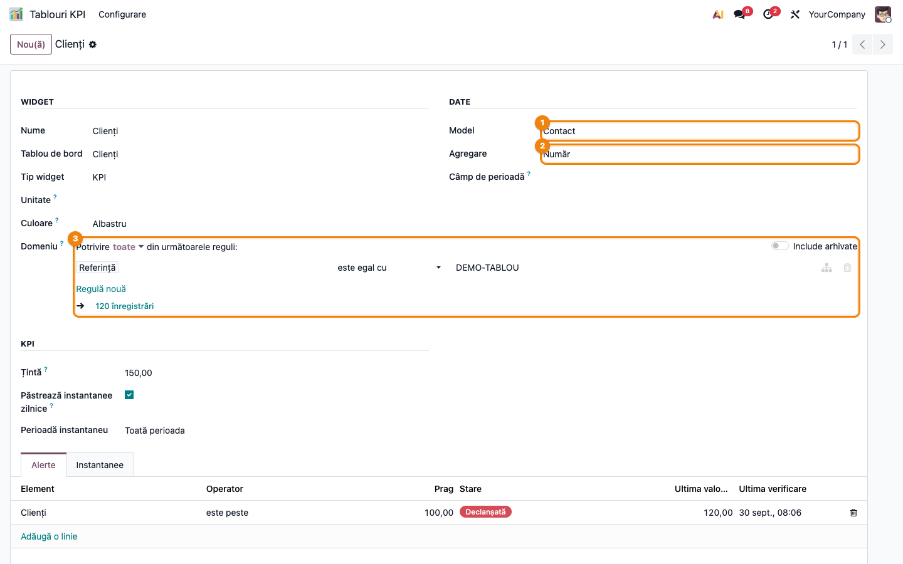
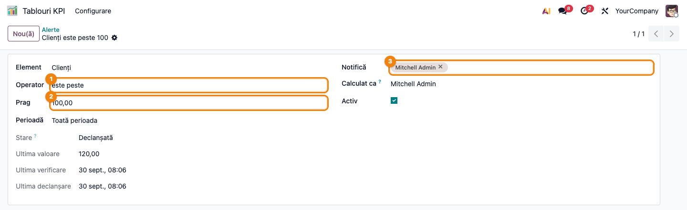
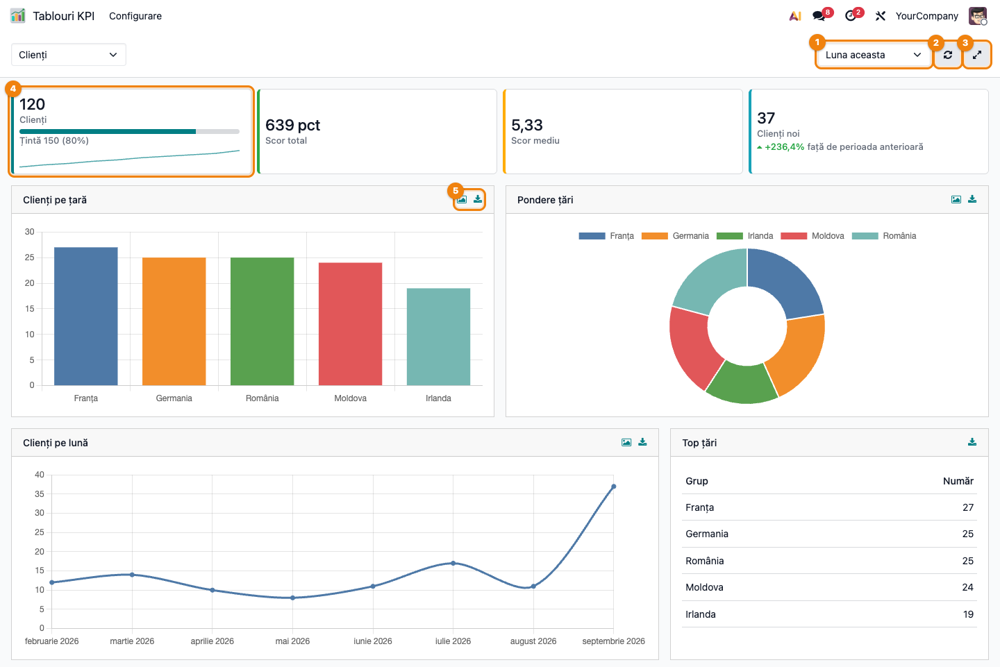
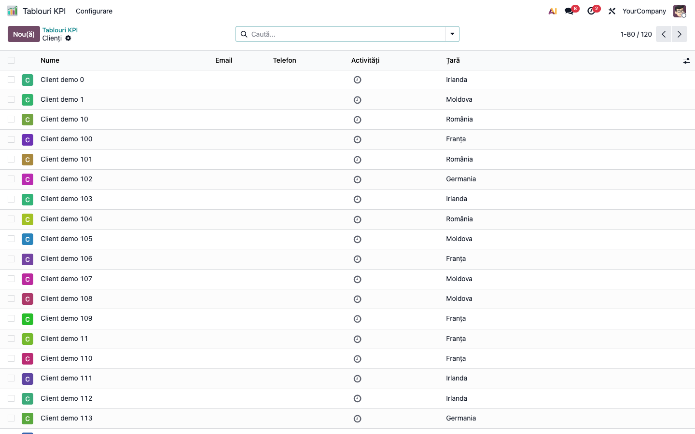
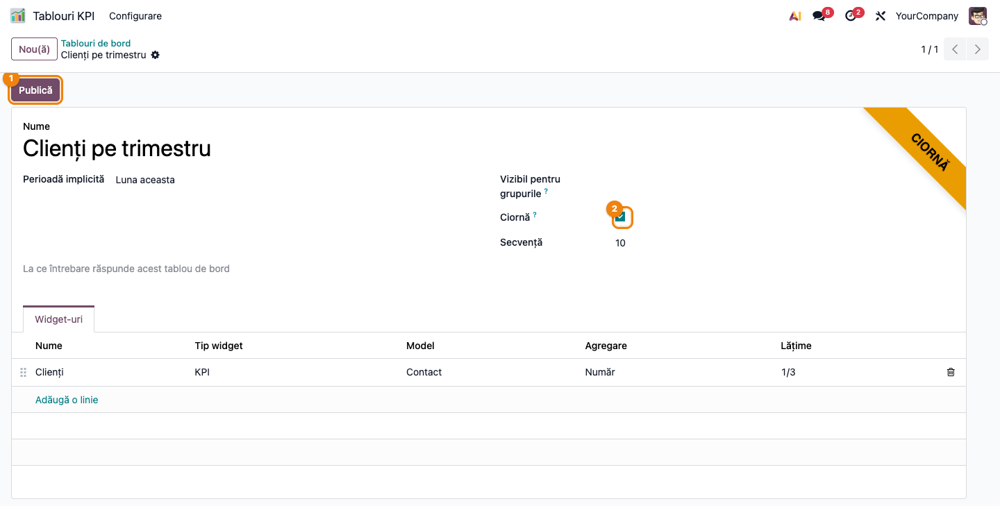

# Fișă Modul: Tablouri de bord cu KPI și grafice (Dashboard Builder)

**Modul:** `deltatech_dashboard_builder`
**Versiune:** 19.0.1.0.3
**Suită:** bitshop_ent (modulul merge și pe Community; extensia AI cere Enterprise)
**Dependențe:** `web`, `mail`, `deltatech_web_kpi_cards`
**Utilizator principal:** consultantul care construiește tabloul; managerul și echipa care îl citesc
**Prioritate:** 🟡 Medie (nu blochează nicio operațiune, dar e primul lucru pe care îl cere un manager)

---

## 1. Scop business

Un manager vrea să vadă, dimineața, câți clienți noi are, cât a vândut și dacă a atins ținta, fără
să ceară un export și fără să deschidă o foaie de calcul.

Modulul îi dă consultantului un formular cu care construiește un tablou de bord pe **orice model
din Odoo**: alege modelul, felul cifrei (număr, sumă, medie, minim, maxim), câmpul după care se
grupează și un filtru. Rezultatul e o bandă de indicatori (KPI) și o grilă de grafice și tabele,
cu o singură alegere de perioadă pentru tot tabloul. Un indicator poate avea o țintă, o linie de
tendință păstrată zi de zi și o alertă care anunță oamenii când cifra trece de un prag.

Nu înlocuiește rapoartele contabile și nici foile de calcul ale Odoo Enterprise: e pentru
cifrele urmărite zilnic de mulți oameni, configurate fără formule.

## 2. Bază legală și context

Nicio obligație legală nouă. Modulul nu produce documente și nu trimite nimic către ANAF: citește
date care există deja în Odoo și le arată.

Contextul care contează în practică este **cine are voie să vadă ce**. Cifrele se calculează cu
drepturile celui care se uită: un utilizator care nu poate citi comenzile nu vede, pe un tablou,
suma comenzilor — widget-ul lui apare gol, cu un mesaj, în locul cifrei. Regulile de acces pe
înregistrări și companiile active se aplică la fel ca în listele obișnuite.

## 3. Utilizatori și roluri

| Rol (grup) | Ce poate |
|---|---|
| **Tablouri de bord / Vizualizator** | deschide tablourile publicate pentru grupurile lui; alege perioada; deschide înregistrările din spatele unei cifre; descarcă un grafic sau un tabel |
| **Tablouri de bord / Constructor** | tot ce poate vizualizatorul, plus creează și modifică tablouri, widget-uri, ținte și alerte, vede ciornele și publică; are citire pe structura modelelor (ca să aleagă modelul și câmpurile) |

Un constructor include și rolul de vizualizator. Utilizatorii **admin** primesc rolul de constructor
la instalare.

Un tablou fără grupuri alese se vede tuturor vizualizatorilor; cu grupuri alese, doar membrilor lor.
O **ciornă** se vede doar constructorilor, oricâte grupuri ar avea.

Pentru testare, folosiți doi utilizatori: un constructor (care construiește) și un vizualizator
(care verifică ce se vede).

## 4. Conturi și date implicate

Modulul **nu generează note contabile** și nu folosește conturi.

Datele pe care le păstrează:

- **tablouri și widget-uri** — configurația (model, agregare, domeniu, țintă);
- **instantanee** — câte o valoare pe zi, pe companie, pentru fiecare indicator la care s-a bifat
  păstrarea; cresc cu o linie pe zi și pe indicator;
- **alerte** — pragul, cine e anunțat, starea (armată sau declanșată) și ultima valoare citită.

Pentru un demo aveți nevoie de un model cu câteva sute de înregistrări (de exemplu contacte sau
comenzi de vânzare), ca graficele să aibă ce arăta.

## 5. Configurare inițială

1. **Setări → Utilizatori & Companii → Utilizatori**, în formularul utilizatorului, rubrica **Tablouri de
   bord**: dați rolul **Constructor** celor care construiesc tablouri și rolul **Vizualizator** celor care le
   citesc.
2. Două acțiuni planificate rulează singure (**Setări → Tehnic → Acțiuni planificate**, cu modul
   developer): *Tablou de bord: instantanee zilnice KPI* (o dată pe zi) și *Tablou de bord:
   verifică alertele de prag* (o dată pe oră). Le mutați sau le opriți de acolo.
3. Instantaneele se calculează cu drepturile utilizatorului care a creat indicatorul, iar alertele cu ale
   utilizatorului din câmpul **Calculat ca**. Dacă unul dintre ei e dezactivat, se oprește tendința,
   respectiv alerta. Cifra de pe tablou rămâne calculată pe loc, cu drepturile celui care se uită.

## 6. Flux de utilizare

### Pasul 1 — Creați tabloul

**Tablouri KPI → Configurare → Tablouri de bord → Nou(ă)**

> Aplicația se numește **Tablouri KPI**, ca să nu o confundați cu aplicația standard *Tablouri de bord* a Odoo
> (dashboard-urile din foi de calcul, instalată împreună cu Vânzări), care are o cale de meniu cu același nume.



Completați:

- **Nume** — cum apare tabloul în meniu și în selectorul de sus (de exemplu *Clienți*);
- **Perioadă implicită** ① — perioada cu care se deschide (*Luna aceasta*, *Trimestrul acesta*,
  *Anul acesta*, *Ultimele 30 de zile*, *Ultimele 12 luni* ș.a.); utilizatorul o poate schimba pe
  ecran;
- **Vizibil pentru grupurile** ② — lăsați gol pentru toți vizualizatorii; cu grupuri alese, doar membrii lor
  îl văd;
- **Ciornă** — bifat, tabloul îl văd doar constructorii (vezi pasul 6). **Atenție:** un tablou construit de
  mână este publicat de la salvare, dacă nu bifați *Ciornă*; doar tablourile propuse de agentul AI se
  creează ca ciornă;
- butonul **Adaugă în meniu** ③ — îl folosiți după publicare, vezi pasul 6.

### Pasul 2 — Adăugați widget-uri

În formularul tabloului, fila **Widget-uri → Adaugă o linie**. Se deschide formularul widget-ului.



Alegeți, în ordine:

1. **Tip widget** — *KPI* (un singur număr), *Grafic cu bare*, *cu bare orizontale*, *cu linii*,
   *circular*, *inelar* sau *Tabel*.
2. **Model** ① — ce se numără (de exemplu *Contact*, *Comandă de vânzare*).
3. **Agregare** ② — *Număr*, *Sumă*, *Medie*, *Minim* sau *Maxim*. Pentru orice în afară de
   *Număr* apare **Măsură**: câmpul numeric care se adună sau se mediază.
4. **Domeniu** ③ — regulile care limitează înregistrările, ca într-un filtru obișnuit. Sub reguli
   Odoo arată câte înregistrări rămân (aici *120 înregistrări*): verificați numărul înainte de a
   merge mai departe.
5. **Câmp de perioadă** — data după care se aplică perioada aleasă pe tablou (de exemplu data
   creării). Fără el, widget-ul ignoră perioada.
6. Pentru grafice și tabele, **Grupează după** (un câmp de tip țară, stare, dată etc.), *Granularitate
   dată* (zi, săptămână, lună, trimestru, an), *Sortare* și *Limită* (câte grupuri se arată).
7. Pentru KPI: **Țintă** (apare bara de progres), **Compară cu perioada anterioară** (necesită
   câmp de perioadă) și **Păstrează instantanee zilnice** (desenează linia de tendință). Instantaneul se
   calculează pe **Perioadă instantaneu** (implicit *Toată perioada*), nu pe perioada aleasă pe tablou:
   pentru un KPI de tipul „luna aceasta", alegeți aceeași perioadă și aici, ca tendința să se potrivească cu
   cifra.

KPI-urile puse unul după altul formează o **bandă** deasupra graficelor. Lățimea contează doar
pentru grafice și tabele.

### Pasul 3 — Puneți o alertă pe un KPI

În formularul indicatorului, fila **Alerte → Adaugă o linie**. Toate alertele, cu starea lor, sunt și la
**Tablouri KPI → Configurare → Alerte** (de acolo e făcută captura).



- **Operator** ① și **Prag** ② — de exemplu *este peste* 100;
- **Notifică** ③ — cine primește mesajul (în Odoo, în Discuss și pe e-mail, după preferințele lor);
- **Perioadă** — perioada pe care se citește valoarea (implicit *Toată perioada*);
- **Calculat ca** — utilizatorul ale cărui drepturi și companie se folosesc la calcul.

Alerta anunță **o singură dată** când pragul e depășit și trece pe **Declanșată**. Se **rearmează**
singură când valoarea revine pe partea bună a pragului (sub prag, la *este peste* și *este cel puțin*;
peste prag, la *este sub* și *este cel mult*), și abia atunci poate anunța din nou. Verificarea rulează
din oră în oră: o revenire între două verificări nu rearmează alerta.

### Pasul 4 — Deschideți și citiți tabloul

**Tablouri KPI** (meniul de aplicații)



Sus: selectorul de tablou (când sunt mai multe), **perioada** ①, butonul de reîmprospătare ② și cel de ecran
complet ③. Sub ele: banda de indicatori, apoi graficele și tabelele.

**Găsiți pe ecran.** Fiecare indicator ④ arată numărul mare, numele și, unde există, bara de progres
spre țintă (*Țintă 150 (80%)*), linia de tendință și variația față de perioada anterioară, în verde când
crește și în roșu când scade. Graficele ⑤ au titlul și, în colț, două pictograme: imagine și descărcare
CSV; tabelele au doar CSV.

**Verificați.**

- numărul indicatorului corespunde cu ce știți: același număr apare la pasul 5, în lista
  înregistrărilor; variația lipsește pe *Toată perioada* și când perioada anterioară are valoarea 0;
- perioada din selector e cea dorită, iar widget-urile fără câmp de perioadă nu se schimbă când o
  schimbați (așa e configurat, nu o eroare);
- un widget care afișează „Nu aveți acces la datele acestui widget" înseamnă că utilizatorul nu are
  drept de citire pe modelul lui;
- un widget cu mesajul „Acest widget nu poate fi calculat" trebuie verificat de un constructor.

**Treceți mai departe.** Descărcați un grafic ca imagine sau un grafic/tabel ca **CSV** din pictogramele
de pe widget; ecranul complet e pentru afișarea pe un monitor de birou.

### Pasul 5 — De la cifră la înregistrări

Un click pe un indicator, pe o bară, pe o felie sau pe un rând de tabel deschide **lista
înregistrărilor din spatele cifrei**, cu aceeași perioadă și același filtru.



Aici verificați cifra: numărul din colțul din dreapta sus (*1-80 / 120*) trebuie să fie cel de pe
indicator. Filtrul widget-ului nu apare în bara de căutare: e aplicat de widget, de aceea lista are exact
înregistrările numărate.

### Pasul 6 — Publicați tabloul și adăugați-l în meniu

Un tablou propus de agentul AI (`deltatech_dashboard_builder_ai`) se creează ca **ciornă**: îl văd doar
constructorii. Unul construit de mână e publicat de la salvare, dacă nu i-ați bifat *Ciornă*.



- **Publică** ① — scoate tabloul din ciornă; de acum îl văd vizualizatorii din grupurile alese. Bifa
  **Ciornă** ② arată starea.
- **Adaugă în meniu** — apare abia după publicare (ca în captura 01, butonul ③) și pune tabloul ca intrare
  proprie sub **Tablouri KPI**. **Scoate din meniu** o desface. Numele, ordinea și grupurile tabloului
  urmează singure în meniu; un tablou pus înapoi pe ciornă iese din meniu.

#### Note de monografie și raportare

Modulul nu generează note contabile și nu alimentează nicio declarație.

## 7. Legături cu alte module / declarații

| Modul | Legătura |
|---|---|
| `deltatech_web_kpi_cards` | cardurile indicatorilor: numere mari compacte, variație, progres, tendință, modul întunecat — aceleași ca pe celelalte tablouri Terrabit |
| `mail` | mesajele alertelor și urmărirea tabloului |
| `deltatech_dashboard_builder_ai` | opțional: un agent din AI-ul Odoo propune tablouri ca ciorne; vede structura modelelor, nu înregistrările |

Niciun raport ANAF nu se alimentează din acest modul.

**Ce e automat.** Calculul cifrelor la fiecare deschidere; instantaneul zilnic; verificarea alertelor din
oră în oră; rearmarea alertei.
**Ce rămâne manual.** Construirea tabloului și a widget-urilor; alegerea grupurilor; publicarea unei ciorne.

### Față de dashboard-urile standard din Odoo 19

Odoo are deja `board` (un tablou personal, pe utilizator, în care fiecare adaugă vederi din meniul cu
rotiță de lângă breadcrumb, *Adaugă în tabloul meu*) și **dashboard-urile din foi de calcul** (`spreadsheet_dashboard`, afișate doar pentru citire în
Community; editarea cere Enterprise). Modulul acesta nu le înlocuiește:

| | Dashboard-urile din foi de calcul | Acest modul |
|---|---|---|
| Configurare | foaie de calcul (formule, pivoturi) | formular: model, agregare, grupare, domeniu |
| Editare | Enterprise | Community |
| Țintă pe o cifră | da, prin graficul gauge sau scorecard | da, bară de progres pe KPI |
| Tendință zilnică păstrată, alerte pe prag | nu | da |
| Flexibilitate (formule, mai multe surse pe o pagină, formatare liberă) | mare | mică: 7 tipuri de widget, un model pe widget |
| Aranjare | liberă | după ordine și lățime, fără tragere |
| Tablouri gata făcute | da, pentru vânzări, contabilitate, stoc ș.a. | nu |
| Joins între modele, SQL, baze externe | — | nu |

Aleg acest modul când vreți indicatori urmăriți zilnic, cu ținte și alerte, configurați de un consultant
pentru o echipă. Pentru o analiză punctuală cu logică proprie, foaia de calcul rămâne mai potrivită.

## 8. Verificări pentru consultant

- [ ] Constructorii au rolul **Constructor**, cititorii au **Vizualizator**.
- [ ] Un utilizator vizualizator vede tabloul publicat pentru grupul lui și **nu** vede o ciornă.
- [ ] Domeniul fiecărui widget arată numărul de înregistrări așteptat (formularul îl afișează sub reguli).
- [ ] Numărul de pe un indicator coincide cu numărul din lista deschisă printr-un click pe el.
- [ ] Widget-urile cu perioadă au **Câmp de perioadă** completat; comparația cu perioada anterioară apare.
- [ ] Un vizualizator fără drept pe un model vede pe widget mesajul de acces, nu o cifră.
- [ ] Indicatorii cu instantanee au, după o zi, o linie de tendință; acțiunea programată e activă.
- [ ] O alertă de test (operator *este peste*, prag sub valoarea curentă) trece pe **Declanșată** și trimite un
      singur mesaj; la a doua verificare nu mai trimite.
- [ ] Un tablou pus pe ciornă nu apare vizualizatorilor și iese din meniu; după **Publică** revine.
- [ ] Pe un monitor de birou: ecranul complet încape fără derulare pe orizontală.

## 9. Mesaje de eroare frecvente

| Mesaj | Ce înseamnă | Ce faceți |
|---|---|---|
| „Widget-ul „X” are nevoie de un câmp de măsură.” | agregare de tip sumă, medie, minim sau maxim, fără câmp numeric | alegeți **Măsură** sau schimbați agregarea în *Număr* |
| „Widget-ul „X” are nevoie de un câmp de grupare.” | grafic sau tabel fără **Grupează după** | alegeți câmpul de grupare |
| „Domeniul widget-ului „X” nu este valid: …” | regulile filtrului nu se pot aplica pe model | corectați regulile sau ștergeți-le |
| „Câmpul … nu aparține modelului …” | ați schimbat modelul și a rămas un câmp al celui vechi | alegeți din nou măsura, gruparea și câmpul de perioadă |
| „Limita de grupuri trebuie să fie între 0 și 500.” | valoare în afara intervalului | 0 înseamnă fără limită; altfel între 1 și 500 |
| „Alertele se pot seta doar pe widget-uri KPI.” | alertă pe un grafic sau tabel | mutați alerta pe un indicator |
| „Doar constructorii de tablouri de bord pot publica un tablou de bord în meniu.” | utilizator fără rolul de constructor | cereți rolul sau rugați un constructor |
| „Nu aveți acces la datele acestui widget.” (pe tablou) | utilizatorul nu are drept de citire pe modelul widget-ului | dați dreptul pe model sau scoateți widget-ul din tabloul acelui grup |
| „Acest widget nu poate fi calculat. Cereți unui constructor de tablouri de bord să îl verifice.” (pe tablou) | un câmp sau un model din configurație nu mai există | un constructor redeschide widget-ul și îl reconfigurează |

## 10. Capturi de ecran

Cele șase capturi din `readme/screenshots/` sunt cele din secțiunea 6, în aceeași ordine:

| Fișier | Pasul | Ce arată |
|---|---|---|
| `01_tablou_formular.png` | 1 | formularul tabloului: perioada implicită, grupurile, lista de widget-uri |
| `02_widget_formular.png` | 2 | formularul unui KPI: model, agregare, domeniu, țintă, instantanee, alerte |
| `03_alerta_formular.png` | 3 | alerta: operator, prag, cine e anunțat, starea |
| `04_tablou.png` | 4 | tabloul deschis: banda de indicatori, grafice, tabel |
| `05_lista_inregistrari.png` | 5 | lista înregistrărilor din spatele indicatorului |
| `06_ciorna_publicare.png` | 6 | ciorna, cu **Publică** și **Adaugă în meniu** |

Se generează cu testul `tests/test_screenshots.py`, în română, pe date de demonstrație create de test
(o bază de date de test, nu una reală):

```bash
./odoo/odoo-bin -c odoo.conf -d <db> -i deltatech_dashboard_builder,l10n_ro_doc_screenshots \
    --test-tags=/deltatech_dashboard_builder:TestDashboardScreenshots --stop-after-init
```

Testul se sare singur dacă lipsește `l10n_ro_doc_screenshots` sau `playwright`.

## 11. Observații pentru manual

- Un widget numără **înregistrări existente în Odoo**, cu drepturile celui care se uită: doi utilizatori pot
  vedea cifre diferite pe același tablou, pentru că au drepturi sau companii diferite. Nu e o greșeală.
- Perioada de pe tablou se aplică doar widget-urilor care au **Câmp de perioadă**.
- Linia de tendință apare abia după a doua zi de instantanee. Ținta apare imediat; variația apare când
  widget-ul are câmp de perioadă și perioada anterioară are înregistrări (nu apare pe *Toată perioada*).
- Alerta anunță o singură dată pe depășire. Dacă vreți să primiți din nou mesajul, trebuie ca valoarea să
  revină pe partea bună a pragului, apoi să-l depășească iar.
- Tablourile nu se trimit în afara Odoo: nu există partajare cu link public.
