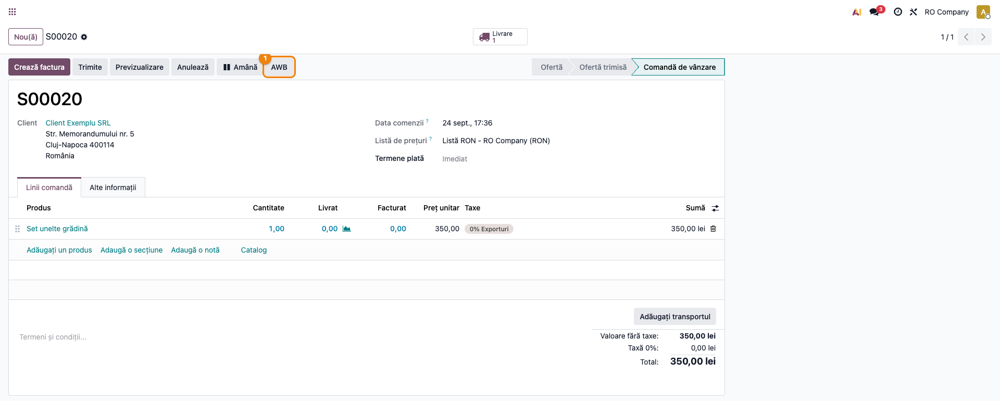
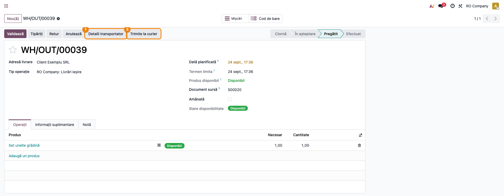
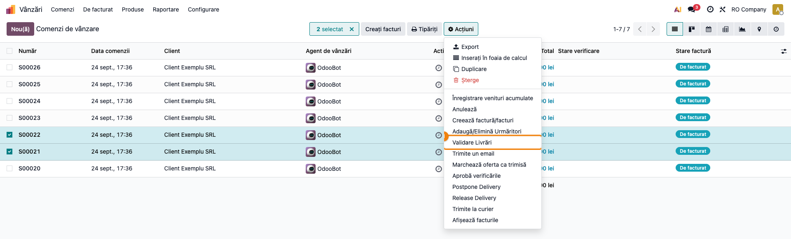
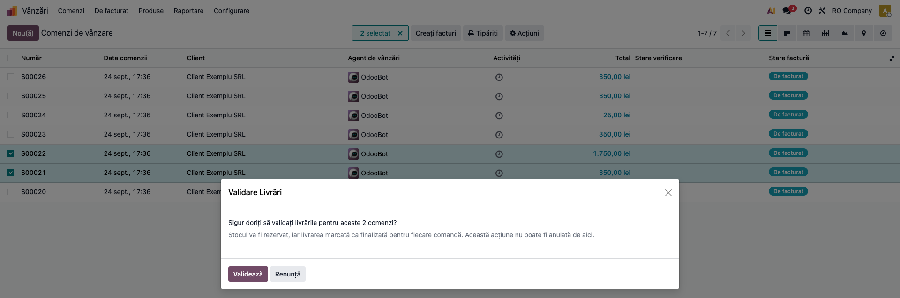
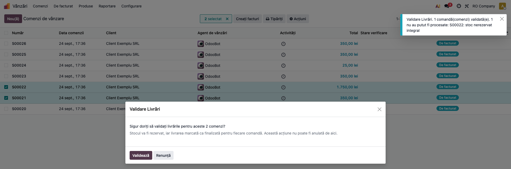
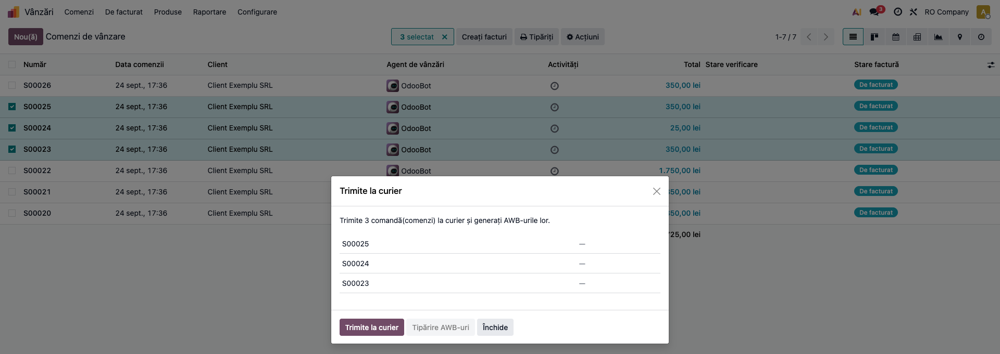
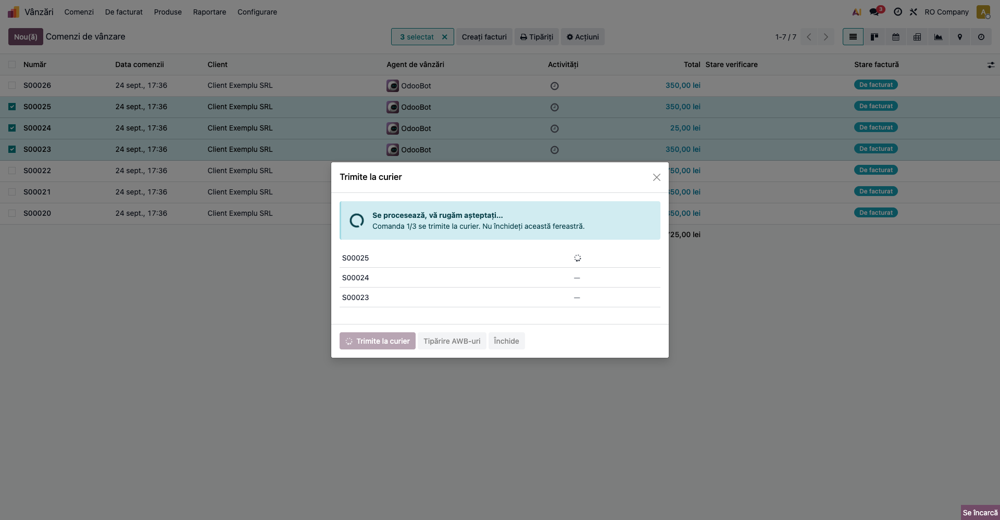
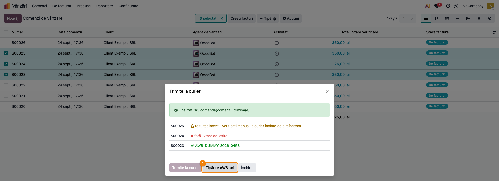
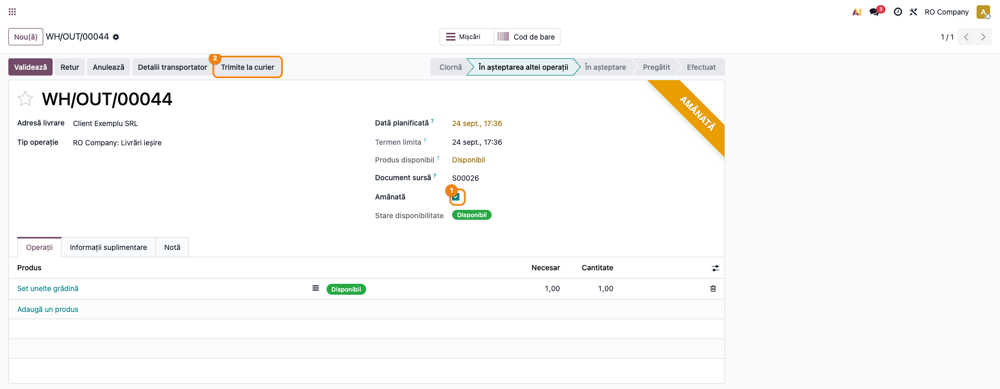
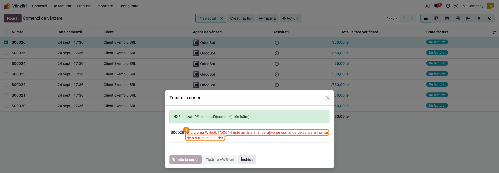

# Fișă Modul: Bază curierat — AWB, expediere și validare livrări

**Modul:** `deltatech_delivery`
**Utilizator principal:** Operator vânzări/expediții, Operator depozit, Manager vânzări
**Prioritate:** 🔴 Ridicată (modul de bază pentru toate integrările de curierat: Fan Courier, DPD, GLS, Sameday, TNT etc.)

---

## 1. Scop business

`deltatech_delivery` este modulul de bază pentru curierat al suitei Terrabit: nu se conectează singur la niciun curier, ci oferă infrastructura comună pe care se sprijină toate submodulele `deltatech_delivery_*` (Fan Courier, DPD, GLS, Sameday, TNT, Packeta ș.a.). Concret, oferă operatorului de vânzări/expediții:

- generarea și urmărirea AWB-urilor (`delivery.awb`) pe livrare;
- wizard-uri comune pentru detaliile de expediere (greutate, colete, opțiuni AWB, ramburs);
- tipărirea etichetelor în masă, cu document combinat per lot;
- validarea rapidă în masă a livrărilor direct din lista de comenzi de vânzare;
- trimiterea în masă a comenzilor către curier, cu urmărire vizuală a progresului și distincție clară între succes, eroare și rezultat incert;
- urmărirea stării livrării (istoric, cron de sincronizare status) și marcarea automată ca „livrat" a livrărilor fără curier configurat;
- respectarea amânării: o livrare **amânată** (de operator sau de verificarea comenzii) nu pleacă la curier prin niciun buton și nicio acțiune în masă, ci este raportată ca reținută, cu motivul.

Este folosit de orice companie care expediază colete prin curier și are nevoie ca un operator să proceseze zilnic zeci-sute de comenzi fără să deschidă fiecare livrare individual.

## 2. Bază legală și context

Nu are bază legală fiscală proprie — este un modul operațional de logistică/expediții. Contextul relevant:

- integrarea cu facturarea este opțională și controlată per curier (`auto_create_invoice`, `auto_invoice_domestic_only` pe `delivery.carrier`): la validarea livrării se poate crea și posta automat factura, cu excepția clienților din altă țară decât compania (lăsați pentru control manual).
- rambursul (ramburs = cash on delivery) se leagă de `payment.provider` cu codul `on_delivery`; suma de încasat provine din valoarea comenzii, nu este calculată de acest modul din date contabile.
- amânarea livrării (`postponed` pe transfer, din `deltatech_delivery_status`) este o decizie de business — a operatorului (butonul **Amână** pe comandă), a regulii de plată („livrare amânată până la confirmarea plății") sau a verificării comenzii (`deltatech_sale_order_review`, prin puntea `deltatech_delivery_review`: ramburs peste prag, adresă incompletă etc.). Acest modul respectă decizia: o livrare amânată nu poate primi AWB până nu este eliberată.
- acest modul **nu generează el însuși note contabile** — facturarea și înregistrările contabile rămân în responsabilitatea modulelor de vânzări/contabilitate; aici se configurează doar declanșarea automată a facturii la livrare.

## 3. Utilizatori și roluri

Operator vânzări/expediții (accesează comenzile și livrările zilnic), Operator depozit (validează livrările, tipărește etichete), Manager vânzări (configurează curierii și opțiunile).

Roluri recomandate pentru testare:
- Administrator funcțional: instalează modulul și configurează cel puțin un curier de test.
- Utilizator operațional: rulează fluxul zilnic (validare livrări, trimitere la curier, tipărire AWB).
- Manager: verifică rapoartele „Delivery AWB" și „Print AWBs" și configurarea curierilor.

## 4. Conturi și date implicate

Nu sunt implicate conturi contabile specifice acestui modul (nu creează el însuși note contabile). Datele operaționale minime pentru demo:

- companie cu adresă completă (stradă, oraș, județ, țară) — necesară pentru validarea greutății/adresei de expediere;
- un curier de test (`delivery.carrier`) cu `delivery_type` simplu (ex. „Fixed Price") pentru a nu depinde de credențiale reale de curier;
- un produs stocabil cu greutate setată (evită expedierea cu greutate implicită 0,1 kg);
- o comandă de vânzare confirmată, cu stoc disponibil în depozit, pentru a putea valida livrarea;
- o a doua comandă confirmată, cu livrarea **amânată** (butonul **Amână** pe comandă), pentru a arăta reținerea la trimiterea la curier.

## 5. Configurare inițială

1. Instalați modulul `deltatech_delivery` (și, pentru un curier real, submodulul specific — ex. `deltatech_delivery_fc`).
2. Configurați cel puțin un curier în **Inventar → Configurare → Livrare → Metode de livrare**, cu produsul de livrare asociat.
3. Setați greutatea pe produsele stocabile folosite în comenzile de test, ca să evitați greutatea implicită 0,1 kg raportată la curier.
4. Verificați în **Inventar → Configurare → Setări → Expediere** retenția implicită (7 zile) pentru PDF-urile combinate de etichete generate de tipărirea în masă.
5. Pregătiți o comandă de vânzare confirmată cu stoc disponibil, pentru a putea reproduce fluxul de validare și trimitere la curier.
6. Pentru pasul cu livrarea amânată, pe o comandă confirmată apăsați **Amână** (antetul comenzii, disponibil utilizatorilor cu drepturi de stoc). Dacă folosiți și verificarea comenzilor (`deltatech_sale_order_review` + `deltatech_delivery_review`), amânarea vine automat pentru motivele de pe poarta „Înainte de livrare".

## 6. Flux de utilizare

### Pasul 1 — Confirmarea comenzii și expedierea individuală (flux general)

Din **Vânzări → Comenzi → Comenzi**, deschideți o comandă confirmată. Butonul **AWB** din antet (vizibil doar în starea „Comandă de vânzare") apelează `get_awb()`: dacă livrarea de ieșire nu are încă AWB, o trimite la curier și generează eticheta.



Pe livrarea de ieșire (**Inventar → Transferuri → Livrări**), butoanele din antet urmează starea AWB-ului: **Carrier Details** (înainte de trimitere, deschide wizard-ul de detalii expediere — greutate, colete, opțiuni AWB, ramburs), **Send to Shipper** (trimite efectiv la curier, dacă `carrier_ready` e bifat), **Print AWB** (după ce există AWB) și **Cancel AWB** (dacă curierul suportă anularea).



### Pasul 2 — Validarea în masă a livrărilor ("Validate Deliveries")

Această funcționalitate este nouă și rezolvă cazul unui operator care are zeci de comenzi confirmate, cu stoc disponibil, și vrea să le încheie livrarea dintr-o singură acțiune, fără să deschidă fiecare transfer.

Din **Vânzări → Comenzi → Comenzi**, în vizualizarea listă, selectați mai multe comenzi confirmate și deschideți meniul **Acțiuni (⚙)** → **Validate Deliveries**.



Se deschide un wizard de confirmare care arată câte comenzi sunt selectate și avertizează că stocul va fi rezervat și livrarea marcată ca terminată pentru fiecare comandă, ireversibil din acest ecran.



La **Validate**, fiecare comandă este procesată **izolat** (un eșec la o comandă nu oprește restul): pentru fiecare comandă se caută livrarea de ieșire nefinalizată, se încearcă rezervarea stocului (`action_assign`) și, dacă stocul e complet rezervat, se validează livrarea (`button_validate`). O comandă fără livrare în așteptare, cu stoc insuficient, care necesită confirmare manuală (backorder) sau care nu ajunge în starea „Done" este raportată ca problemă, cu motivul exact, fără să blocheze celelalte comenzi din lot.

La final apare o notificare cu numărul de comenzi validate cu succes și, dacă există probleme, lista lor detaliată (comandă + motiv), notificare care rămâne pe ecran (`sticky`) exact când sunt probleme de analizat.



### Pasul 3 — Trimiterea în masă la curier ("Send to Carrier")

A doua funcționalitate nouă acoperă cazul opus: comenzile sunt deja livrate (sau nu necesită validare separată), dar operatorul trebuie să le trimită efectiv la curier și să genereze AWB-urile, pentru un lot întreg, cu vizibilitate pas-cu-pas asupra fiecărei comenzi.

Din **Vânzări → Comenzi → Comenzi**, selectați comenzile dorite și deschideți meniul **Acțiuni (⚙)** → **Send to Carrier**. Se deschide un dialog OWL cu o linie per comandă selectată, toate în starea inițială „—" (în așteptare).



La **Send to Carrier**, comenzile sunt trimise **secvențial, una câte una** (nu în paralel, ca să nu bombardeze API-ul curierului), fiecare printr-un apel RPC independent (`action_send_to_carrier_one`). Cât durează procesarea, în capul ferestrei apare un banner albastru cu o rotiță animată („Se procesează, vă rugăm așteptați… Comanda X/N se trimite la curier. Nu închideți această fereastră.”), butonul de trimitere arată o rotiță, iar **Închide** e dezactivat până la final — operatorul vede că acțiunea rulează și trebuie să aștepte. Fiecare linie își schimbă starea live, în timp real:
- rotița de încărcare cât timp cererea e în curs;
- ✅ verde cu numărul AWB, la succes (inclusiv atunci când livrarea avea deja AWB — caz tratat ca succes, fără resend);
- ❌ roșu cu mesajul de eroare, la un eșec clar (ex. lipsă livrare de ieșire, mai multe livrări de ieșire, configurare curier incompletă);
- ⚠️ galben „rezultat incert", când răspunsul curierului s-a pierdut și nu se știe sigur dacă expedierea a fost înregistrată — acest caz **nu se reîncearcă automat**, tocmai ca să nu se genereze un AWB dublu la curier.



Dacă o cerere eșuează la jumătatea lotului (ex. se închide browserul), comenzile deja marcate „success" rămân trimise — fiecare apel e propria tranzacție, redeschiderea dialogului pe aceeași selecție nu retrimite comenzile care au deja AWB.

La final, banner-ul devine verde („Finalizat: X/N comandă(comenzi) trimisă(e).”), fiecare linie arată rezultatul ei (succes, eroare sau rezultat incert), iar butonul **Print AWBs** devine activ (doar dacă există cel puțin un succes) și apelează `action_download_awb_labels()`: **nu generează** nimic nou, ci doar combină într-un singur PDF etichetele deja obținute la trimitere, pentru comenzile reușite din acest lot.



### Pasul 4 — Livrarea amânată nu pleacă din depozit

O livrare poate fi **amânată** din trei locuri: operatorul apasă **Amână** pe comandă (**Vânzări → Comenzi → Comenzi**, antetul comenzii; butonul devine **Eliberează**), furnizorul de plată are bifa „livrare amânată până la confirmarea plății", sau verificarea comenzii (`deltatech_sale_order_review`) reține comanda pe poarta „Înainte de livrare" — ramburs peste prag, adresă incompletă, plată nefinalizată. În toate cazurile, transferul de ieșire primește bifa **Amânată**, ribbon-ul galben **Amânată** în colțul formularului (**Inventar → Transferuri → Livrări**) și trece în starea „În așteptarea altei operații" — nu mai poate fi validat.

Din acest moment, livrarea **nu mai poate pleca la curier**, oricare ar fi butonul apăsat:

- **Trimite la curier** de pe livrare (butonul Send to Shipper din Pasul 1) refuză cu mesajul „Livrarea WH/OUT/… este amânată. Eliberați-o pe comanda de vânzare înainte de a o trimite la curier." — curierul nu este apelat, nu se generează AWB;
- **Validare Livrări** (Pasul 2) nu încearcă rezervarea/validarea, ci listează comanda în notificarea de rezultat cu același mesaj de reținere, în locul erorii seci „Transferul este amânat";
- **Trimite la curier** (Pasul 3) marchează rândul comenzii ca **reținut** — ❌ roșu cu mesajul de reținere — fără niciun apel la curier și fără reîncercare; celelalte comenzi din lot sunt procesate normal.

**Găsește pe ecran:** pe livrare, ribbon-ul **Amânată** și bifa **Amânată** de sub „Document sursă"; butonul **Trimite la curier** este vizibil în antet, dar apăsarea lui întoarce mesajul de mai sus.



**Verifică:** mesajul de reținere spune *de ce* stă livrarea. Cu puntea `deltatech_delivery_review` instalată, când comanda are motive de verificare deschise, textul devine „Livrarea WH/OUT/… este reținută pentru verificare: Ramburs 4.200,00 lei peste limita de 3.500,00 lei" — operatorul știe ce are de rezolvat (aprobă motivul pe comandă), nu doar că e blocat. Când amânarea e a operatorului, textul indică eliberarea de pe comandă.

**Treci mai departe:** se apasă **Eliberează** pe comandă (sau se aprobă motivele de verificare, care eliberează livrarea automat); abia apoi comanda se retrimite (acțiunea **Trimite la curier** din listă sau butonul de pe livrare) și primește AWB.



### Note de monografie și raportare

Modulul nu generează note contabile proprii. Ce trebuie reținut pentru raportare/operare:

- `sale.order.has_awb` este un câmp **stocat**, calculat din `picking_ids.carrier_tracking_ref`; filtrul „fără AWB" din lista de comenzi se bazează pe indexul parțial `(team_id, date_order) WHERE has_awb IS NOT TRUE` — nu pe un scan complet.
- Facturarea automată la livrare (`auto_create_invoice` pe curier) este opțională și exclude implicit clienții din altă țară decât compania, dacă `auto_invoice_domestic_only` e bifat — factura rămâne de creat manual pentru aceștia.
- Un AWB deja confirmat de curier nu este niciodată anulat implicit de un pas ulterior care eșuează (`_carrier_send_and_keep_the_awb`): eșecul e înregistrat în jurnal (chatter) și AWB-ul rămâne valabil, ca operatorul să nu retrimită din greșeală colet dublu.
- Reținerea unei livrări amânate este decisă de un singur hook, `stock.picking._delivery_hold_message()`: întoarce textul de reținere (sau nimic) și este consultat de `send_to_shipper`, de `action_send_to_carrier_one` (răspuns `held`, distinct de eroare și incert) și de `action_bulk_validate_deliveries`. Modulele care cunosc motivele (`deltatech_delivery_review`) completează textul; nu există trei verificări separate care să se desincronizeze.
- Rezultatul „incert" (`CarrierUncertainResult`) este distinct de eroare determinată în ambele funcționalități noi (validare în masă nu îl întâlnește direct, dar `action_send_to_carrier_one` îl propagă explicit) — un răspuns incert cere verificare manuală la curier, nu reîncercare automată.

## 7. Legături cu alte module / declarații

| Modul / proces | Rol în flux | Tip legătură |
|---|---|---|
| `delivery` (core) | model `delivery.carrier`, `send_to_shipper`, `cancel_shipment` | dependență (manifest) |
| `stock` / `stock_delivery` | livrări (`stock.picking`), rezervare și validare stoc | dependență (manifest) |
| `payment` | ramburs (`payment.provider` cod `on_delivery`) | dependență (manifest) |
| `purchase` / `purchase_stock` | livrări asociate comenzilor de achiziție | dependență (manifest) |
| `deltatech_delivery_status` | urmărire stare livrare, istoric, cron de sincronizare; câmpul `postponed` pe transfer, butoanele **Amână / Eliberează** pe comandă, ribbon-ul „Amânată" | dependență (manifest) |
| `deltatech_sale_order_review` + `deltatech_delivery_review` (bitshop) | verificarea comenzii amână livrarea pe poarta „Înainte de livrare"; puntea completează mesajul de reținere cu motivele (ex. „ramburs peste prag") prin hook-ul `_delivery_hold_message()` | extindere opțională |
| `deltatech_delivery_fc` / `_dpd` / `_gls` / `_sd` / etc. | conector specific curierului, definește opțiunile AWB suportate | submodul (implementează hook-urile `<delivery_type>_*`) |
| `sale` | comenzi de vânzare — sursa bulk-urilor „Validate Deliveries" și „Send to Carrier" | integrare directă (view + acțiuni pe `sale.order`) |

Ce este automat: generarea AWB, urmărirea stării livrării, tipărirea etichetelor în lot, marcarea „livrat" pentru livrările fără curier (după perioada de grație), reținerea livrărilor amânate la orice încercare de trimitere.
Ce rămâne manual: configurarea curierului (credențiale, servicii), deciziile pe rezultate incerte („uncertain"), rezolvarea comenzilor raportate ca probleme la validarea/trimiterea în masă, eliberarea livrărilor amânate (**Eliberează** pe comandă sau aprobarea motivelor de verificare).

## 8. Verificări pentru consultant

- [ ] Modulul se instalează fără erori pe baza demo, împreună cu cel puțin un submodul de curier de test.
- [ ] Butonul **AWB** apare pe comanda confirmată și butoanele de livrare (Carrier Details / Send to Shipper / Print AWB / Cancel AWB) apar corect condiționat de starea AWB-ului.
- [ ] **Validate Deliveries** apare în meniul Acțiuni al listei de comenzi și validează corect o selecție cu stoc disponibil.
- [ ] La o comandă fără stoc suficient în lot, **Validate Deliveries** raportează problema fără să blocheze celelalte comenzi din selecție.
- [ ] **Send to Carrier** apare în meniul Acțiuni al listei de comenzi, procesează comenzile secvențial și afișează corect cele trei stări (succes/eroare/incert).
- [ ] O comandă deja trimisă (cu AWB existent) este raportată drept succes (`already_sent`), fără să genereze un al doilea AWB.
- [ ] **Print AWBs** din dialogul „Send to Carrier" devine activ doar după procesare și doar dacă există cel puțin o comandă cu succes; PDF-ul descărcat conține etichetele comenzilor reușite.
- [ ] Mesajele de eroare din ambele acțiuni bulk sunt clare pentru un utilizator non-tehnic (motiv + nume comandă).
- [ ] Pe o comandă confirmată, **Amână** pune ribbon-ul **Amânată** pe livrarea de ieșire; **Trimite la curier** de pe acea livrare refuză cu „Livrarea … este amânată. Eliberați-o pe comanda de vânzare…" și nu apare niciun AWB.
- [ ] Aceeași comandă, selectată în **Trimite la curier**, apare ca rând reținut (❌ cu mesajul de reținere), fără apel la curier; comenzile neamânate din același lot sunt trimise normal.
- [ ] Aceeași comandă, selectată în **Validare Livrări**, este listată în notificare cu mesajul de reținere, iar livrarea rămâne nevalidată.
- [ ] După **Eliberează** pe comandă, retrimiterea prin **Trimite la curier** reușește și livrarea primește AWB.
- [ ] (Cu `deltatech_delivery_review`) la o comandă reținută de verificare, mesajul de reținere enumeră motivele („reținută pentru verificare: …"), nu doar faptul amânării.

## 9. Mesaje de eroare frecvente

| Mesaj / simptom | Cauză probabilă | Remediere |
|-----------------|-----------------|-----------|
| „no pending delivery" (Validate Deliveries) | Comanda nu are livrare de ieșire în așteptare (neconfirmată sau deja finalizată) | Confirmați comanda sau excludeți-o din selecție dacă e deja livrată |
| „stock not fully reserved" (Validate Deliveries) | Stoc insuficient pentru a rezerva integral livrarea | Aprovizionați/transferați stoc înainte de a reîncerca validarea |
| „needs manual confirmation" (Validate Deliveries) | `button_validate()` a întors un wizard (ex. confirmare backorder) în loc să valideze direct | Deschideți livrarea individual și confirmați manual pasul cerut |
| „no outgoing delivery" (Send to Carrier) | Comanda selectată nu are nicio livrare de ieșire | Verificați dacă order-ul are livrare (poate fi deja anulată sau necreată) |
| „more than one outgoing delivery" (Send to Carrier) | Comanda are mai multe livrări de ieșire (backorder-uri multiple) | Trimiteți livrarea individual, alegând explicit picking-ul dorit |
| „needs manual confirmation (carrier not configured)" (Send to Carrier) | Curierul nu are configurarea completă pentru expediere directă | Completați configurarea curierului (credențiale, servicii) apoi reîncercați |
| „uncertain result - check manually at the carrier before retrying" | Răspunsul curierului s-a pierdut; nu se știe dacă AWB-ul a fost creat | Verificați manual în portalul curierului înainte de a retrimite |
| „Livrarea … este amânată. Eliberați-o pe comanda de vânzare înainte de a o trimite la curier." (butonul de pe livrare, acțiunea Trimite la curier, Validare Livrări) | Livrarea are bifa **Amânată** — pusă de operator (**Amână**), de furnizorul de plată sau de verificarea comenzii | Deschideți comanda și apăsați **Eliberează** (sau aprobați motivele de verificare), apoi retrimiteți |
| „Livrarea … este reținută pentru verificare: …" (aceleași acțiuni, cu `deltatech_delivery_review`) | Comanda are motive de verificare deschise pe poarta „Înainte de livrare" (ramburs peste prag, adresă incompletă etc.) | Rezolvați/aprobați motivele în bannerul comenzii; eliberarea livrării urmează automat |
| „No labels to print" (Print AWBs / Download AWB Labels) | Nicio comandă din selecție nu are etichetă deja generată | Trimiteți mai întâi comenzile la curier (Send to Carrier) pentru a genera etichetele |

## 10. Capturi de ecran

Capturile (`readme/screenshots/`) sunt generate automat din `tests/test_screenshots.py` (mixinul `ScreenshotCase` din `l10n_ro_doc_screenshots`, import defensiv), în limba română, pe „RO Company", cu curierul de test `deltatech_delivery_dummy` (fără credențiale reale). În ordinea pașilor din secțiunea 6:

1. `01_comanda_buton_awb.png` — comanda de vânzare confirmată, cu butonul AWB în antet.
2. `02_transfer_butoane_awb.png` — livrarea de ieșire cu butoanele Carrier Details / Send to Shipper / Print AWB.
3. `03_actiuni_validate_deliveries.png` — lista de comenzi cu selecție multiplă și meniul Acțiuni deschis pe „Validare Livrări".
4. `04_wizard_confirmare_validare.png` — wizard-ul de confirmare al validării în masă.
5. `05_notificare_rezultat_validare.png` — notificarea finală cu numărul de comenzi validate și eventualele probleme.
6. `06_dialog_send_to_carrier_initial.png` — dialogul „Trimite la curier" nou deschis, comenzi în așteptare.
7. `07_dialog_send_to_carrier_progres.png` — dialogul în timpul procesării, cu banner-ul animat „Se procesează…” și comanda curentă în curs.
8. `08_dialog_send_to_carrier_finalizat_print.png` — dialogul finalizat, cu succes/eroare/incert pe linii diferite și butonul Tipărire AWB-uri activ.
9. `09_livrare_amanata_ribbon.png` — livrarea amânată: ribbon-ul „Amânată", bifa Amânată și butonul Trimite la curier (refuzat la apăsare).
10. `10_dialog_send_to_carrier_retinut.png` — dialogul „Trimite la curier" finalizat pe comanda amânată: rândul reținut cu mesajul de reținere, fără AWB.

Regenerare (test Playwright; cere `l10n_ro` instalat pentru compania RO și curierul de test):

```bash
./odoo/odoo-bin -c odoo.conf -d <db> -i l10n_ro,l10n_ro_doc_screenshots,deltatech_delivery_dummy \
    -u deltatech_delivery --test-tags=fise_screenshots --stop-after-init
```

## 11. Observații pentru manual

În manualul final, păstrați accentul pe cele două acțiuni bulk ca soluții pentru volum: „Validate Deliveries" pentru operatorul care închide loturi de livrări deja pregătite fizic, „Send to Carrier" pentru operatorul care trebuie să genereze AWB-uri pentru un lot fără să deschidă fiecare comandă. Explicați clar diferența dintre eroare (de reîncercat după corectare) și rezultat incert (de verificat manual la curier, niciodată reîncercat orbește) — este distincția centrală care previne AWB-urile duplicate. Adăugați un al treilea caz, distinct de ambele: **reținut** — livrarea amânată nu pleacă prin niciun buton și nicio acțiune în masă, iar mesajul spune de unde vine amânarea (operator sau verificarea comenzii) și ce are de făcut operatorul (Eliberează pe comandă sau aprobă motivele). Reținerea nu este o eroare de curier și nu se rezolvă reîncercând.
