# Fișă Modul: Decontarea rambursurilor încasate de curier (extras în jurnal de clearing)

**Modul:** `deltatech_delivery_cod`
**Utilizator principal:** Contabil trezorerie (importă decontările și reconciliază extrasele)
**Prioritate:** 🟡 Medie (esențial la magazinele online care livrează cu plata la livrare)

---

## 1. Scop business

La livrarea cu ramburs, curierul încasează banii de la client și îi virează firmei după câteva zile,
**grupat**: o singură sumă pentru zeci de colete. Pe extrasul băncii apare doar „FAN COURIER EXPRESS
SRL — 617,07 lei”, iar contabilul trebuie să afle ce facturi stinge suma. Modulul aduce decontarea
curierului în Odoo ca **extras bancar într-un jurnal de clearing** (jurnalul curierului): un rând
pentru fiecare AWB (colet), cu clientul găsit după livrarea proprie, plus rândul de virament cu minus
(și rândul de comision, dacă curierul virează net). Potrivirea rândurilor cu facturile o face
**reconcilierea standard Odoo**, iar rândul de virament se potrivește cu mișcarea reală din extrasul
băncii. Decontarea vine din **borderoul curierului** (fișier sau API) sau, pentru curierii care
virează **fără borderou**, din fereastra **Potrivește viramentul curierului**, care găsește coletele
plătite numai din suma virată.

## 2. Bază legală și context

- **OMFP 1802/2014, pct. 302 alin. (2)** — sumele virate sau depuse la bănci ori prin mandat poștal
  și neapărute încă în extrasele de cont se înregistrează distinct, în contul **5125 „Sume în curs de
  decontare”**. Rambursul aflat încă la curier nu e literal un astfel de caz (juridic e o creanță pe
  mandatar, 461); 5125 se folosește **prin analogie**, ca practică acceptată și pentru că Odoo cere pe
  jurnal un cont de tip Bancă și numerar. Dacă soldul analiticului 5125 la închiderea exercițiului e
  semnificativ, contabilul îl poate reclasifica pe 461, cu analitic pe curier.
- **OMFP 1802/2014, funcțiunea conturilor** — **4111 „Clienți”** se creditează la încasarea
  facturilor; **581 „Viramente interne”** preia transferurile de bani între conturile de trezorerie
  ale firmei; comisionul reținut de curier este un serviciu facturat de el, cu TVA, înregistrat pe
  un cont de cheltuieli cu servicii prestate de terți și pe **401 „Furnizori”**. Recomandat **622**
  (comision de mandat de încasare); 628 e acceptabil; **627 nu** (e pentru servicii bancare). Dacă
  taxa de ramburs e inclusă în tariful de transport pe aceeași factură, se folosește 624.
- Modulul **nu emite** documente fiscale și nu modifică TVA-ul: facturile se emit la livrare, prin
  fluxul standard (inclusiv e-Factura), iar decontarea doar stinge creanța pe client.
- **TVA la încasare** (Codul fiscal art. 282 alin. (3)): exigibilitatea intervine la încasare, iar
  rândul AWB poartă data livrării (plata către mandatarul firmei e plată). Importați deci decontările
  **înainte de depunerea D300** pentru perioada respectivă; un import ulterior mută TVA exigibilă
  într-o perioadă deja declarată. Data exactă a încasării prin curier e de confirmat în Normele la
  art. 282.
- Configurare Odoo (nu bază legală): pe planul RO, contul de suspensie al tuturor jurnalelor bancare
  este 512500 „Sume în curs de decontare”.
- Context operațional: curierul este mandatarul firmei la încasare. De aceea decontarea **nu se
  înregistrează în jurnalul băncii**, ci într-un jurnal separat (jurnalul de clearing), pe un analitic
  5125. Privit azi, soldul lui arată rambursurile **deja decontate** de curier (borderou importat sau
  virament potrivit) și încă nevirate. Pentru că rândurile AWB poartă data livrării, soldul la o dată
  trecută se schimbă la fiecare import ulterior. Coletele livrate, dar a căror decontare nu a fost încă importată, rămân
  creanțe deschise pe 4111.

## 3. Utilizatori și roluri

Modulul nu are roluri proprii. Folosește drepturile standard ale contabilității:

- **Facturare → Configurare → Contabilitate → Jurnale** — configurarea jurnalului de clearing: rol de administrator
  al contabilității;
- **Potrivește viramentul curierului** și reconcilierea extraselor: rol de contabil (acțiunea din
  meniul **Acțiune** al liniilor de extras este disponibilă grupului de facturare).

Roluri recomandate pentru testare:
- un **contabil** care parcurge potrivirea, creează extrasul și reconciliază;
- un **administrator** al contabilității care configurează jurnalul de clearing.

## 4. Conturi și date implicate

| Cont | Rol |
|---|---|
| 512501 „Rambursuri FAN Courier în curs de decontare” (analitic 5125, creat de contabil) | contul jurnalului de clearing: soldul debitor = rambursuri decontate de curier și încă nevirate |
| 512500 „Sume în curs de decontare” | contul de suspensie al jurnalului: un rând AWB stă aici până la reconcilierea cu factura |
| 4111 „Clienți” | se creditează când rândul AWB se reconciliază cu factura clientului |
| 5121xx al băncii (ex. **512105 Banca Transilvania**) | contul în care virează curierul |
| 581001 „Transfer Lichidități” (581 „Viramente interne”, contul de transfer al companiei) | leagă rândul de virament din jurnalul de clearing de linia reală din extrasul băncii |
| 622 (recomandat) sau 628, 4426, 401 | factura curierului pentru comisionul de ramburs, la decontarea netă |

**Ce cont folosește jurnalul de clearing.** Jurnalul de clearing este un jurnal de tip **Bancă**.
Dacă nu i se dă un cont, Odoo îi generează automat unul în grupa **5121** (prefixul bancar al
companiei), cu numele jurnalului. Pentru rambursuri acesta este **contul greșit**: banii sunt la
curier, nu în bancă. Soldul unui cont 5121 trebuie să corespundă extrasului băncii lui, iar sumele
în curs de decontare se țin distinct, în 5125 (pct. 302 alin. 2). De aceea, **înainte de primul
import**, creați un analitic 5125 dedicat (în exemplu **512501 Rambursuri FAN Courier în curs de
decontare**) și dați-l jurnalului ca **Cont bancar**. Câmpul acceptă doar conturi de tip **Bancă și
numerar**, așa că analiticul se creează cu acest tip. **Cont Suspensie** rămâne contul implicit al
companiei, **512500 Sume în curs de decontare**. Modulul nu verifică ce cont are jurnalul.

Date minime pentru demo:
- companie românească cu planul de conturi RO și taxa de 21% (`l10n_ro`);
- curierul **FAN Courier** (metodă de livrare);
- contul 512501 și jurnalul de clearing **Ramburs FAN Courier** (tip Bancă, **Cont bancar** 512501,
  **Curier** = FAN Courier), plus jurnalul băncii reale **Banca Transilvania** (512105);
- patru colete livrate cu ramburs, fiecare cu factura lui cu TVA 21%: Ioana Dumitrescu 854,59 lei,
  Andrei Popescu 100,19 lei, Elena Marin 516,88 lei, Mihai Stan 245,30 lei;
- linia din extrasul Băncii Transilvania: **FAN COURIER EXPRESS SRL — ramburs, 617,07 lei**, fără
  borderou (617,07 = 100,19 + 516,88);
- pentru decontarea netă: factura FAN Courier „FAN 7781” pentru comisionul de ramburs, 4,13 + TVA
  21% 0,87 = 5,00 lei.

## 5. Configurare inițială

1. Instalați modulul `deltatech_delivery_cod` (dependențe: `deltatech_delivery`, importul de extrase
   bancare din Odoo Enterprise). Pentru decontarea din fișier sau API instalați și modulul
   curierului (vezi secțiunea 7).
2. Creați contul jurnalului de clearing: **Facturare → Configurare → Contabilitate → Plan de
   conturi → Nou**, **Cod** 512501, **Nume** „Rambursuri FAN Courier în curs de decontare”, **Tip** =
   **Bancă și numerar**. Faceți câte un analitic pentru fiecare curier.
3. Creați jurnalul de clearing: **Facturare → Configurare → Contabilitate → Jurnale → Nou**, **Nume
   Jurnal** = „Ramburs FAN Courier”, **Tip** = **Bancă**, **Prefix Secvență** = „RFAN”. În tabul
   **Note contabile** alegeți **Cont bancar** = 512501 **înainte de a salva prima dată** (altfel Odoo
   creează un cont nou în 5121) și verificați **Cont Suspensie** (512500 Sume în curs de decontare).
   Faceți un jurnal de clearing pentru fiecare curier.

   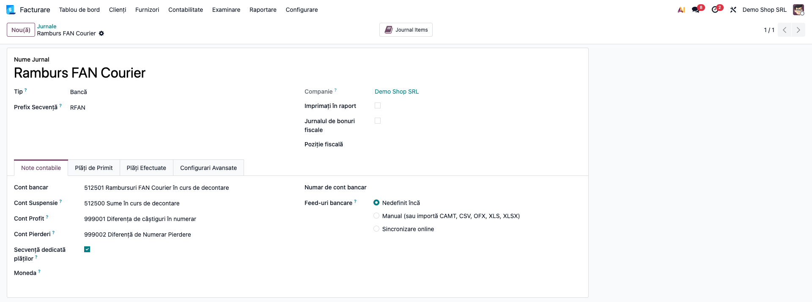

4. În tabul **Configurari Avansate**, secțiunea **Decontare ramburs curier**, completați:
   - **Curier** — curierul ale cărui decontări intră în acest jurnal (FAN Courier). Fără curier,
     butoanele de decontare nu apar, iar jurnalul nu este propus în fereastra de potrivire;
   - **Adaugă rând de transfer bancar** — bifat (implicit): extrasul primește rândul de virament cu
     minus, care îl aduce la sold zero și se potrivește cu linia din extrasul băncii.

   Sub câmpuri apar butoanele **Preia decontarea** și **Potrivește viramentul fără borderou**.
   **Preia decontarea** apare pentru orice curier, dar funcționează doar la curierii care publică
   decontarea prin API (secțiunea 7); la ceilalți afișează mesajul „… nu publică un punct de
   decontare”.

   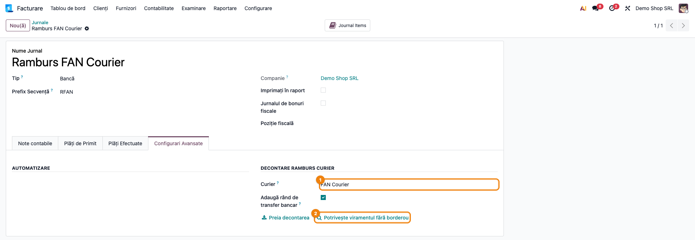

5. Verificați că livrările cu ramburs au AWB, sumă de ramburs și stare de livrare actualizată de
   integrarea curierului (vezi pasul 1 din secțiunea 6).

## 6. Flux de utilizare

Exemplul urmărește o virare reală fără borderou: FAN Courier virează **617,07 lei** în contul de la
Banca Transilvania. Printre coletele livrate, doar Andrei Popescu (100,19 lei) și Elena Marin
(516,88 lei) dau împreună exact această sumă.

### Pasul 1 — Coletele livrate cu ramburs

Deschideți **Inventar → Operații → AWB de livrare → Listă AWB de livrare**. Fiecare rând este un
colet: **Număr** (AWB), **Referință** (factura), **Transportator**, **Destinatar**, **Stare livrare**
și **Valoare ramburs**. Verificați:

- coletele de decontat au **Stare livrare** = **Livrat** (cele refuzate nu intră în decontare);
- **Valoare ramburs** este completată: un colet fără ramburs nu este căutat;
- în exemplu: 854,59 + 100,19 + 516,88 + 245,30 = 1.716,96 lei, toate livrate, nedecontate.

Coloana **Dată** este data AWB-ului (emiterea). Potrivirea caută după **data livrării** (data efectivă
a livrării), de regulă o zi mai târziu: în fereastra de la pasul 4 apare în coloana **Data livrării**.

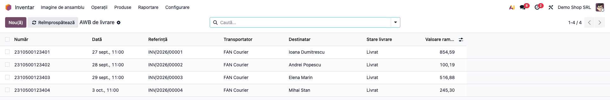

### Pasul 2 — Linia viramentului în extrasul băncii

Importați extrasul băncii ca de obicei. Deschideți **Facturare → Tablou de bord** → cardul jurnalului
**Banca Transilvania** → **Potrivire bancă** și comutați pe vederea **listă** (butonul din
dreapta-sus). Bifați linia viramentului (**FAN COURIER EXPRESS SRL - ramburs**, **Valoare** 617,07
lei) și alegeți **Acțiuni → Potrivește viramentul curierului**.

Fereastra se poate deschide și din jurnalul de clearing: **Facturare → Configurare → Contabilitate →
Jurnale** →
**Ramburs FAN Courier** → tabul **Configurari Avansate** → **Potrivește viramentul fără borderou**
(atunci completați manual **Sumă virată** și **Data viramentului**).

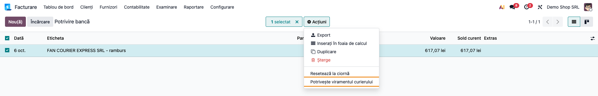

### Pasul 3 — Fereastra „Potrivește viramentul curierului”

Fereastra se deschide completată din linia de extras:

- **Jurnal de clearing** — propus singur când există un singur jurnal cu curier (aici Ramburs FAN
  Courier); **Curier** se afișează din jurnal;
- **Linie de extras** — linia din care ați pornit (BT/2026/00001). Ea doar precompletează suma și
  data: modulul nu o reconciliază, linia băncii rămâne deschisă până la pasul 7;
- **Sumă virată** = 617,07 lei și **Data viramentului** = data liniei;
- **Fereastră de căutare (zile)** — câte zile înaintea viramentului se caută livrările (implicit 20;
  la curierii care virează la două săptămâni, lăsați un ciclu întreg plus întârzierea).

Apăsați **Caută**.

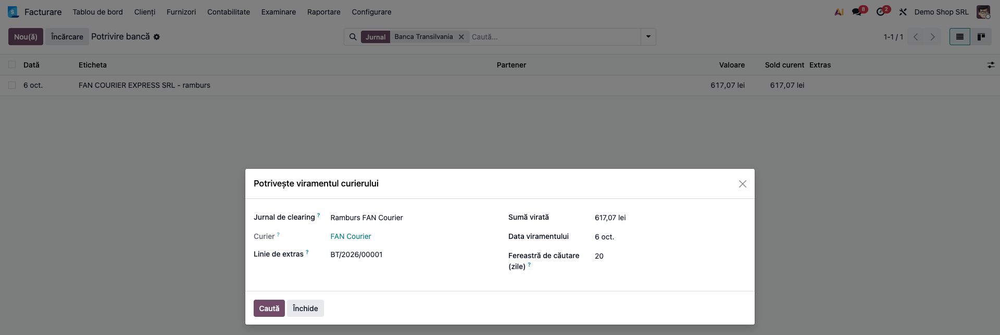

### Pasul 4 — Combinația găsită

Modulul caută livrările curierului **livrate**, cu ramburs, din fereastra de zile, a căror decontare
**nu a fost încă înregistrată** în jurnalul de clearing (din borderou, din API sau din această
fereastră). Încearcă, în ordine: întâi **lotul întreg** livrat până la o zi (cum virează curierii pe
cicluri; propus doar de la 8 colete în sus), apoi **o combinație exactă la ban**. Citiți ecranul:

- **mesajul albastru** — „Am găsit exact un grup: 2 livrări dau 617,07 lei la ban”;
- **lista** — toate livrările candidate, în ordinea datei livrării; cele din combinație au **Plătită**
  bifat și cifra combinației în coloana **Combinația** (aici Andrei Popescu 100,19 și Elena Marin
  516,88). Totalul de sub listă (1.716,96 lei) este al tuturor candidatelor, nu al celor bifate;
- **Bifate** = 2, **Total bifat** = 617,07 lei, **Diferență** = **0,00 lei**.

Dacă **două grupuri diferite** dau aceeași sumă, modulul **nu alege**: nu bifează nimic, coloana
**Combinația** arată „1”, „2” (sau „1, 2”), iar operatorul bifează grupul corect. Pentru un virament
pe ciclu, alegeți **Bifează livrările până la** (o zi) și apăsați **Bifează lotul**: se bifează
toate livrările până în acea zi. **Debifează tot** golește bifele, iar **Caută din nou** reia
căutarea. **Creează extrasul de decontare** apare doar când diferența este zero.

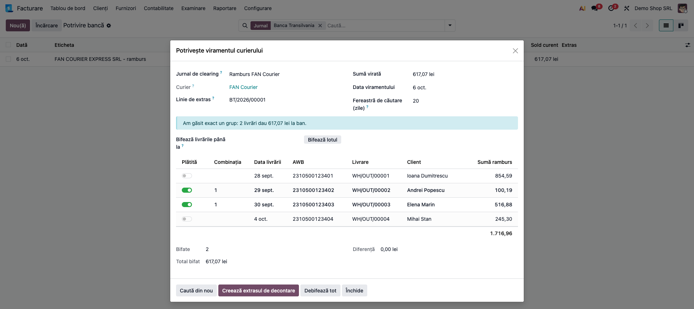

### Pasul 5 — Extrasul de decontare în jurnalul de clearing

Apăsați **Creează extrasul de decontare**. Modulul creează, în jurnalul **Ramburs FAN Courier**,
același extras pe care l-ar fi produs un borderou și îl deschide:

- **Referință** — „FAN Courier ramburs 2026-10-06 (potrivit după sumă)”;
- rândul de virament „FAN Courier Transfer ramburs 2026-10-06”, **−617,07** (pe ecran, primul);
- un rând pentru fiecare AWB: „AWB ramburs 2310500123403 - Elena Marin” 516,88 și „AWB ramburs
  2310500123402 - Andrei Popescu” 100,19, cu data livrării și clientul găsit după livrare;
- **Sold inițial** = **Sold final** = 0,00 lei: extrasul se închide la zero.

Fiecare rând AWB primește o cheie de import (curier + AWB): același colet nu mai poate fi decontat a
doua oară, nici din borderou, nici din API, nici din această fereastră (nu mai apare printre
candidate).

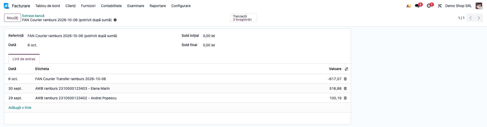

### Pasul 6 — Rândurile AWB și facturile (reconcilierea standard)

La crearea extrasului, Odoo încearcă singur reconcilierea fiecărui rând: când clientul rândului are
facturi deschise care dau exact suma rambursului, rândul se reconciliază automat cu ele. Deschideți
nota unui rând (din extras sau din **Facturare → Contabilitate → Tranzacții → Note contabile**) și verificați în
tabul **Elemente jurnal**:

- **Dr 512501 Rambursuri FAN Courier** = 100,19 lei, pe partenerul Andrei Popescu;
- **Cr 411100 Clienți** = 100,19 lei, cu eticheta facturii **INV/2026/00002**;
- butonul **Elemente reconciliate** deschide factura, care apare **Plătită**.

Un rând pe care Odoo nu îl poate potrivi singur (client cu mai multe facturi deschise sau fără
client găsit) rămâne **Dr 512501 = Cr 512500** și se reconciliază manual în ecranul standard de
reconciliere bancară al jurnalului de clearing.

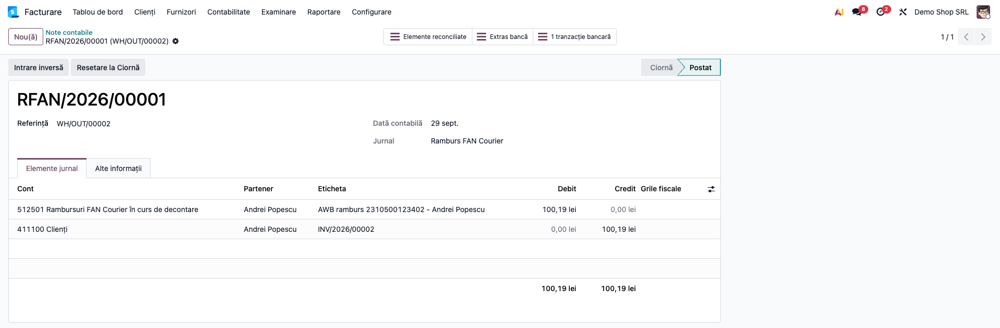

### Pasul 7 — Rândul de virament și linia din bancă (581)

Rândul de virament din jurnalul de clearing și linia reală din extrasul băncii sunt cele două fețe
ale aceluiași transfer de bani. Reconciliați-le în ecranul standard de reconciliere bancară, fiecare
în jurnalul ei, cu contrapartida **contul de transfer al companiei** (581001 Transfer Lichidități;
pe planul RO există și modelul de reconciliere „Internal transfer” pe 581). Verificați notele:

- rândul de virament din clearing: **Dr 581001 Transfer Lichidități = Cr 512501 Rambursuri FAN
  Courier în curs de decontare**, 617,07 lei;

  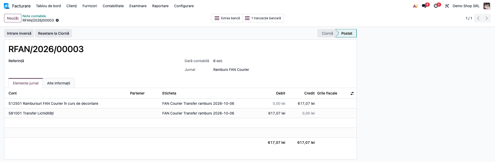

- linia din extrasul băncii: **Dr 512105 Banca Transilvania = Cr 581001 Transfer Lichidități**,
  617,07 lei.

  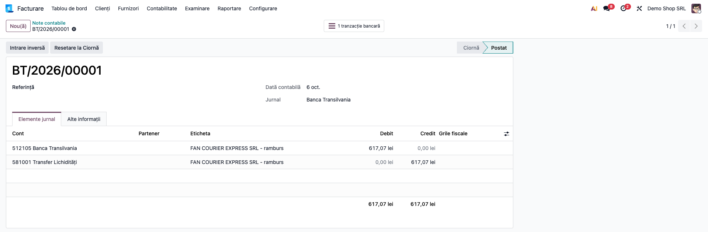

Pe 581001 cele două rânduri se compensează (contul permite reconcilierea, deci se pot și reconcilia
între ele). Rezultatul net: banii trec din 512501 (sume în curs de decontare, la curier) în 512105
(în bancă).

### Decontarea din borderou (fișier sau API)

Pentru curierii care trimit borderou, extrasul de decontare se creează la fel, fără pașii 2–4:

- **din fișier** — importul standard de extrase al jurnalului de clearing (**Facturare → Tablou de
  bord** → cardul jurnalului de clearing → **Potrivire bancă** → **Încărcare**), cu modulul de import al curierului (de exemplu GLS);
- **din API** — **Facturare → Configurare → Contabilitate → Jurnale** → jurnalul de clearing → tabul **Configurari
  Avansate** → **Preia decontarea**: alegeți perioada (**Data de la** / **Data până la**) și apăsați
  **Preia**. Se creează **un extras pentru fiecare zi de virament** din perioadă, ca fiecare să se
  potrivească cu o singură linie din bancă.

Regulile sunt aceleași pe toate căile: un rând fără AWB sau un AWB dublat în același borderou opresc
importul; totalul de control declarat de curier trebuie să fie egal cu suma rândurilor; rândurile
deja importate sunt sărite și numărate (mesajul spune câte); un fișier care acoperă mai multe zile
de virament este refuzat (se importă câte o zi).

### Decontarea netă: rândul de comision

Unii curieri rețin comisionul de ramburs din virament și trimit în borderou suma reținută. Exemplu:
coletul lui Mihai Stan (245,30 lei), comision 5,00 lei, virament 240,30 lei. Extrasul creat din
borderou are trei rânduri: AWB **245,30** (reconciliat automat cu factura, ca la pasul 6), **FAN
Courier Comision ramburs** **−5,00** și **FAN Courier Transfer ramburs** **−240,30** (care se
potrivește cu linia de 240,30 lei din bancă, ca la pasul 7). Sold inițial = sold final = 0,00.

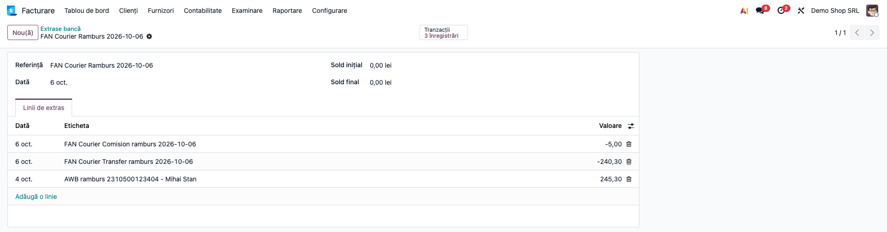

Comisionul se înregistrează în doi pași, ca orice serviciu facturat:

1. factura curierului (**Facturare → Furnizori → Facturi**): 4,13 + TVA 21% 0,87 = 5,00 lei, **Dr 622
   (sau 628) + Dr 4426 = Cr 401 FAN COURIER EXPRESS SRL**. 622 e recomandat (comision de mandat de
   încasare); 627 nu se folosește;
2. reținerea din ramburs: în reconcilierea standard a jurnalului de clearing, rândul de comision de
   −5,00 se potrivește cu factura curierului: **Dr 401 = Cr 512501**.

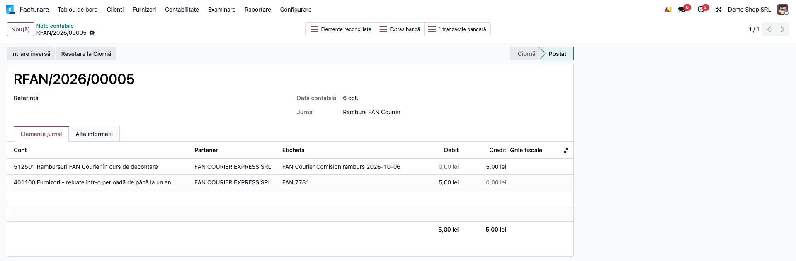

### Note de monografie și raportare

| Operațiune | Notă contabilă | Când |
|---|---|---|
| Rândul AWB, la creare | **Dr 512501 (jurnal de clearing) = Cr 512500 (suspensie)** | la crearea extrasului (pasul 5) |
| Rândul AWB reconciliat cu factura | suspensia se înlocuiește: **Dr 512501 = Cr 4111** | automat la creare, când suma se potrivește; altfel manual (pasul 6) |
| Rândul de virament, la creare | **Dr 512500 = Cr 512501** | la crearea extrasului |
| Rândul de virament reconciliat | **Dr 581001 = Cr 512501** | în reconcilierea standard (pasul 7) |
| Linia din extrasul băncii | **Dr 512105 (bancă) = Cr 581001** | în reconcilierea standard (pasul 7) |
| Factura curierului pentru comision (decontare netă) | **Dr 622 (sau 628) + Dr 4426 = Cr 401** | la înregistrarea facturii furnizorului |
| Rândul de comision reconciliat cu factura | **Dr 401 = Cr 512501** | în reconcilierea standard a jurnalului de clearing |

Control lunar: importați borderourile și potriviți viramentele curierilor până la ultima zi a
lunii, **înainte** de închiderea și raportarea ei. Rândurile AWB se înregistrează la **data
livrării**, deci un import făcut după închidere cade în perioada deja raportată (verificați data de
blocare a perioadei); la TVA la încasare, importul trebuie făcut înainte de depunerea D300. După reconcilierea tuturor extraselor: soldul debitor al lui 512501 =
rambursurile decontate de curier și încă nevirate (nu și cele încă nedecontate, care stau pe 4111);
contul 581001 are sold zero; 512500 (suspensia) trebuie să aibă sold zero, deci în sinteticul 5125
rămâne doar 512501; un sold pe 512500 din jurnalul de clearing înseamnă rânduri AWB
nereconciliate cu facturile.

## 7. Legături cu alte module / declarații

| Modul / proces | Rol în flux |
|---|---|
| `deltatech_delivery` | AWB-urile, suma rambursului și starea livrării |
| Modulele curierilor FAN Courier (`deltatech_delivery_fc`) și Urgent Cargus (`deltatech_delivery_uc`) | decontarea prin API (**Preia decontarea**) |
| Ceilalți curieri (de exemplu Sameday) | fără API de decontare: borderou din fișier sau potrivirea fără borderou |
| `deltatech_account_bank_statement_import_gls` | importul borderoului GLS din fișier |
| Importul de extrase bancare (Odoo Enterprise) | crearea extraselor, protecția anti-dublură, reconcilierea automată la creare |
| `account` / `account_accountant` | reconcilierea standard: AWB ↔ factură, virament ↔ 581 |
| `l10n_ro` | planul de conturi (5121, 5125, 581, 4111, 401, 4426, 622) și taxele de 21% |
| e-Factura / D300 / D394 | facturile și TVA-ul lor se emit la livrare, prin fluxul standard; la TVA la încasare, data rândului AWB stabilește exigibilitatea, deci decontările se importă înainte de D300 |

Ce este automat: căutarea coletelor plătite de un virament fără borderou (lot întreg sau combinație
exactă), crearea extrasului de decontare cu un rând pe AWB și rândul de virament, găsirea clientului
după livrare, refuzul dublurilor, verificarea totalului de control, reconcilierea rândurilor AWB cu
facturile când suma se potrivește.

Ce rămâne manual: configurarea jurnalului de clearing; importul extrasului băncii; alegerea grupului
când două combinații dau aceeași sumă; reconcilierea rândului de virament și a liniei din bancă
(581); reconcilierea rândurilor AWB pe care Odoo nu le potrivește singur; factura curierului pentru
comision și reconcilierea rândului de comision cu ea.

## 8. Verificări pentru consultant

- [ ] Jurnalul de clearing este de tip **Bancă**, are **Curier** setat și **Cont bancar** = un
      analitic 5125 (512501), nu un cont 5121 generat de Odoo.
- [ ] Linia de 617,07 lei din extrasul băncii are în **Acțiuni** intrarea **Potrivește viramentul
      curierului**.
- [ ] Căutarea găsește exact grupul 100,19 + 516,88, cu **Diferență** 0,00; coletele de 854,59 și
      245,30 lei rămân nebifate.
- [ ] Un colet refuzat sau livrat înaintea ferestrei nu apare printre candidate.
- [ ] Când două grupuri dau aceeași sumă, nimic nu e bifat și **Creează extrasul de decontare** nu
      apare.
- [ ] Extrasul creat este în jurnalul de clearing (nu în jurnalul băncii), cu un rând pe AWB,
      rândul de virament −617,07 și sold final 0,00.
- [ ] Nota rândului AWB este Dr 512501 = Cr 4111, pe client, reconciliată cu factura lui.
- [ ] După potrivire, aceleași colete nu mai apar într-o nouă căutare.
- [ ] La un borderou net, rândul de comision −5,00 se reconciliază cu factura curierului: Dr 401 =
      Cr 512501; factura are Dr 628/622 + Dr 4426 = Cr 401.
- [ ] Rândul de virament și linia din bancă se reconciliază pe 581: Dr 581 = Cr 512501 și Dr 512105
      = Cr 581; 581 rămâne cu sold zero.
- [ ] La **Preia decontarea** pe o perioadă cu mai multe zile de virament se creează câte un extras
      pe zi; la a doua preluare a aceleiași perioade rândurile deja importate sunt raportate ca
      sărite.

## 9. Mesaje de eroare frecvente

| Mesaj / simptom | Cauză | Remediere |
|---|---|---|
| „Nicio livrare cu ramburs a curierului … nu așteaptă decontarea între … și …” | Coletele nu sunt **Livrat**, au alt curier, sunt deja decontate sau sunt în afara ferestrei | Verificați starea livrărilor, curierul și **Fereastră de căutare (zile)** |
| „Niciun grup de livrări nu dă exact … ” | Lipsește un colet (fără sumă de ramburs sau în afara ferestrei) ori curierul a reținut un comision | Bifați manual coletele; pentru virament net cereți borderoul curierului |
| „Mai multe grupuri dau exact …; alegerea vă aparține.” | Două combinații diferite dau aceeași sumă | Bifați grupul corect după AWB-urile din situația curierului |
| „Peste 80 livrări așteaptă în fereastră …” / „Suma depășește plafonul de siguranță al căutării automate …” | Prea multe candidate sau sumă prea mare pentru căutarea automată | Folosiți **Bifează livrările până la** + **Bifează lotul** sau bifați manual |
| „Livrările bifate dau …, iar viramentul e …: potrivirea trebuie să fie exactă.” | Bifele nu dau suma virată | Corectați bifele până la **Diferență** 0,00 |
| „Setați întâi curierul pe jurnalul de clearing.” | Jurnalul nu are **Curier** | Completați **Curier** în tabul **Configurari Avansate** |
| „Toate cele … rânduri de decontare au fost deja importate în … Nu s-a creat nimic.” | Borderoul sau perioada au fost deja importate | Nimic de făcut; verificați extrasul existent |
| „Totalul decontării declarat de curier (…) nu corespunde sumei propriilor rânduri (…) …” | Borderoul este incomplet | Cereți curierului borderoul corect |
| „AWB … apare de mai multe ori în această decontare …” / „Rândul … poartă o sumă de decontare … dar fără AWB …” | Borderou cu rânduri duble sau fără AWB | Clarificați cu curierul, apoi reimportați |
| „… nu publică un punct de decontare. Importați în schimb fișierul borderou pe jurnal.” | Curierul nu are API de decontare | Importați fișierul borderoului sau folosiți potrivirea fără borderou |
| „Aceste rânduri acoperă … plăți separate (…), iar un extras se poate echilibra doar pe una singură …” | Fișierul borderoului cuprinde mai multe zile de virament | Împărțiți fișierul și importați câte o zi de virament |

## 10. Capturi de ecran

Capturile din `readme/screenshots/` sunt **generate automat** din `tests/test_screenshots.py`
(mixinul `ScreenshotCase` din `l10n_ro_doc_screenshots`, import defensiv), în **limba română**, pe
planul de conturi RO (`setup_country("ro")`), pe compania de test „Demo Shop SRL”:

1. `01_jurnal_clearing_conturi.png` — jurnalul „Ramburs FAN Courier”, tabul **Note contabile**:
   cont 512501 (analitic 5125), cont de suspensie 512500.
2. `02_jurnal_clearing_curier.png` — tabul **Configurari Avansate**: **Curier** și butoanele de
   decontare.
3. `03_awb_livrate_ramburs.png` — lista AWB: patru colete livrate, cu valoarea rambursului.
4. `04_linie_extras_actiune.png` — linia de 617,07 lei din extrasul băncii și **Acțiuni →
   Potrivește viramentul curierului**.
5. `05_potrivire_inainte.png` — fereastra de potrivire, înainte de căutare.
6. `06_potrivire_combinatie.png` — combinația 100,19 + 516,88 = 617,07, diferență 0,00.
7. `07_extras_decontare.png` — extrasul de decontare din jurnalul de clearing.
8. `08_nota_linie_awb.png` — nota rândului AWB: Dr 512501 = Cr 411100, reconciliată cu factura.
9. `09_nota_virament_clearing.png` — nota rândului de virament: Dr 581001 = Cr 512501.
10. `10_nota_extras_banca.png` — nota liniei din bancă: Dr 512105 = Cr 581001.
11. `11_extras_borderou_comision.png` — extrasul unui borderou decontat net: AWB, comision, virament.
12. `12_nota_comision.png` — nota rândului de comision: Dr 401100 = Cr 512501.

Regenerare:

```bash
./odoo/odoo-bin -c odoo.conf -d <db> \
    -i l10n_ro,deltatech_delivery_cod,l10n_ro_doc_screenshots \
    --test-tags=fise_screenshots/deltatech_delivery_cod --stop-after-init
```

## 11. Observații pentru manual

Păstrați ideea centrală: decontarea curierului este un **extras într-un jurnal de clearing** pe un
analitic 5125, nu în bancă; rândurile AWB sting facturile prin reconcilierea standard, iar rândul de virament se
întâlnește cu linia din bancă pe contul de transfer (581). Pentru curierii fără borderou, explicați
că potrivirea se face **la ban** și că, la două combinații posibile, decide operatorul. Exemplul
617,07 = 100,19 + 516,88 se verifică ușor pe ecran. Menționați că același colet nu poate fi decontat
de două ori, indiferent de calea prin care a venit decontarea.
