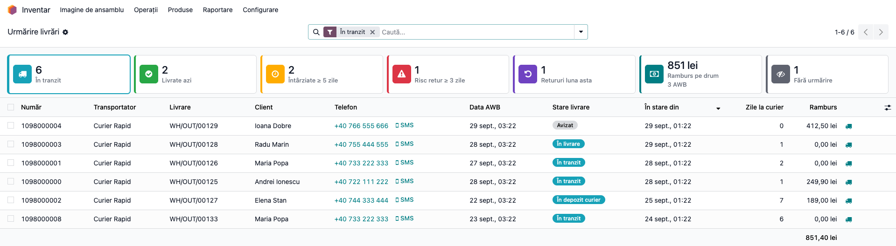
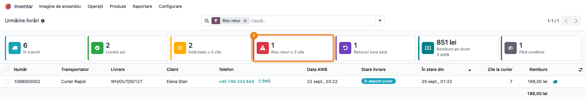
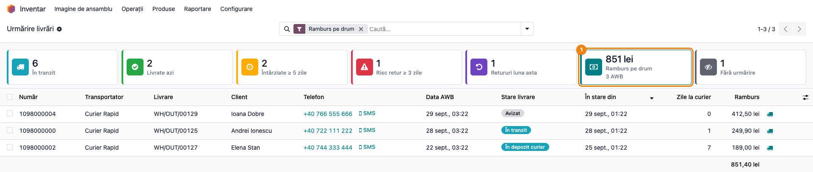
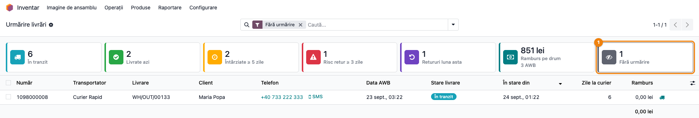

# Fișă Modul: Tablou de urmărire a livrărilor — carduri KPI peste lista de AWB-uri

**Modul:** `deltatech_delivery_dashboard`
**Utilizator principal:** Operator expediții / relații clienți, Responsabil depozit, Manager vânzări
**Prioritate:** 🟡 Medie (nu schimbă fluxul de livrare, dar arată zilnic coletele care cer intervenție: întârziate, cu risc de retur, fără urmărire)

---

## 1. Scop business

Cine urmărește expedierile are nevoie să vadă dintr-o privire ce colete cer atenție azi, fără să filtreze manual lista de AWB-uri. Modulul adaugă, deasupra listei de AWB-uri, o bandă de **7 carduri** cu câte un număr (sau o sumă), iar un click pe un card filtrează lista exact pe AWB-urile numărate de el:

- **În tranzit** — coletele pe care le are curierul;
- **Livrate azi** — livrate de la miezul nopții;
- **Întârziate** — predate curierului și nelivrate după termenul de livrare (SLA) al curierului, în zile lucrătoare de la predare; pentru un curier fără SLA, după N zile de la Data AWB;
- **La timp, 4 săptămâni** — ce procent din coletele livrate în ultimele 28 de zile au ajuns până la termenul SLA și câte au întârziat; apare doar dacă cel puțin un curier are SLA;
- **Risc retur ≥ R zile** — stau la oficiul/lockerul curierului sau în livrare de R zile sau mai mult;
- **Retururi luna asta** — refuzate de la începutul lunii;
- **Ramburs pe drum** — rambursul pe care curierii încă îl au de încasat, pe monedă;
- **Fără urmărire** — colete încă pe drum a căror stare nu se mai actualizează.

Modulul folosește doar ce colectează deja `deltatech_delivery` (starea livrării raportată de curier): nu întreabă curierul nimic în plus și nu adaugă câmpuri pe livrări sau comenzi.

## 2. Bază legală și context

Nu are bază legală fiscală proprie — este un instrument operațional de urmărire a expedierilor. De reținut:

- **„Ramburs pe drum" este un indicator operațional, nu un raport contabil.** Cardul adună sumele de ramburs cerute curierului pentru coletele încă pe drum — bani pe care curierul nu i-a încasat încă de la client. Dacă factura s-a emis la expediere, suma corespunde de regulă unei părți din soldul 4111 al clienților respectivi, dar nu se reconciliază automat cu contabilitatea și nu este suma de decontat de curier. Modulul **nu generează note contabile**, nu modifică facturi și nu înregistrează încasări; soldul clienților și decontările cu curierul rămân în contabilitate.
- **„Risc retur" este o euristică a noastră, nu un semnal primit de la curier.** Cardul numără coletele care stau de R zile la oficiul sau lockerul curierului ori în livrare; curierii returnează de regulă coletele neridicate după câteva zile, dar niciun curier nu trimite o stare „risc de retur". Cardul spune „sunați clientul acum", nu „coletul va fi returnat".
- Cifrele sunt atât de bune cât sunt stările raportate de curieri: cronul de stare din `deltatech_delivery` trebuie să fie activ.

## 3. Utilizatori și roluri

Operatorul de expediții sau de relații cu clienții (urmărește zilnic cardurile și sună clienții cu colete neridicate), responsabilul de depozit (coletele întârziate, fără urmărire), managerul de vânzări (rambursul pe drum, retururile lunii).

Tabloul și meniul sunt disponibile utilizatorilor cu grupul **Inventar / Utilizator** (`stock.group_stock_user`); cererea care calculează cardurile verifică și ea acest grup, nu doar meniul.

Roluri recomandate pentru testare:
- Administrator: setează pragurile în parametrii de sistem (secțiunea 5).
- Utilizator Inventar: parcurge fluxul din secțiunea 6.
- Utilizator fără drepturi de Inventar: confirmă că meniul **Urmărire livrări** nu apare.

## 4. Conturi și date implicate

Nu sunt implicate conturi contabile — modulul nu creează note contabile.

Date minime pentru demo:
- o metodă de livrare (curier) și câteva livrări de ieșire cu AWB, în stări diferite: **Avizat**, **În tranzit**, **În depozit curier**, **În livrare**, **Livrat**, **Refuzat** (în interfață starea Refuzat apare momentan netradusă, „Refused");
- pe cel puțin două livrări, o sumă de ramburs;
- o livrare **În depozit curier** cu AWB mai vechi de 5 zile și aflată în depozit de cel puțin 3 zile (apare la „Întârziate" și la „Risc retur");
- o livrare **În tranzit** la care interogarea de stare a eșuat repetat (implicit cel puțin 5 eșecuri pe 48 de ore, vezi Pasul 4; apare la „Fără urmărire").

Ce se afișează pe fiecare rând: numărul AWB, transportatorul, livrarea, clientul, telefonul, **Data AWB**, **Stare livrare**, **În stare din**, **Zile la curier** (de când a preluat curierul coletul, sau de la Data AWB, până azi sau până la livrare/retur; 0 cât timp coletul nu e încă la curier) și **Ramburs**.

**„În stare din" este data evenimentului de la curier**, nu ora la care Odoo a întrebat curierul: la schimbarea stării se ia data ultimului eveniment din istoricul de livrare primit de la curier (o dată din viitor, cu ceasul curierului înainte, se aduce la ora curentă). Un colet livrat seara la 23:40 și interogat după miezul nopții apare livrat în seara respectivă. Fără istoric, se ia momentul în care Odoo a înregistrat schimbarea. La instalare, AWB-urile existente primesc data ultimului eveniment din istoric sau, dacă nu există, data AWB-ului.

## 5. Configurare inițială

1. Instalați `deltatech_delivery_dashboard` (aduce `deltatech_delivery`). `deltatech_delivery` trebuie să fie cel puțin 19.0.6.8.1, în orice bază: de la această versiune fiecare AWB primește compania livrării sale, iar cardurile numără doar AWB-urile companiilor selectate — un AWB fără companie apare în listă, dar nu e numărat pe niciun card.
2. Verificați că cronul de stare a livrărilor din `deltatech_delivery` este activ: el aduce stările de la curieri, iar cardurile numără din aceste stări.
3. Opțional, setați pe fiecare curier termenul de livrare: **Inventar → Configurare → Livrare → Metode de expediere**, câmpul **SLA livrare (zile lucrătoare)**. Se numără zilele de luni până vineri de la predarea coletului către curier (primul eveniment al curierului care îl trece În tranzit, În depozit curier sau În livrare); sărbătorile legale nu se scad. Fiecare AWB primește **Termen SLA** (coloană ascunsă implicit; se afișează din selectorul de coloane al listei), iar a doua zi după termen coletul nelivrat intră la „Întârziate". Schimbarea termenului recalculează doar coletele încă pe drum. `0` (implicit) înseamnă fără SLA: curierul rămâne pe pragul de mai jos.
4. Opțional, schimbați pragurile din **Setări → Tehnic → Parametri → Parametri sistem** (meniul apare în modul dezvoltator):
   - `delivery_dashboard.overdue_days` — pentru curierii fără SLA, după câte zile de la **Data AWB** un colet predat curierului și nelivrat este „Întârziat". Implicit `5`.
   - `delivery_dashboard.return_risk_days` — câte zile poate sta un colet la oficiul/lockerul curierului sau în livrare până intră la „Risc retur". Implicit `3`.

   Parametrul lipsă sau gol înseamnă valoarea implicită; o valoare nenumerică este ignorată (se folosește tot implicitul). Pragul ales apare în titlul cardului („Întârziate ≥ 5 zile"); dacă cel puțin un curier are SLA, titlul devine simplu „Întârziate".
5. Acordați utilizatorilor care urmăresc livrările grupul **Inventar / Utilizator** și setați fusul orar pe utilizatori (sau pe companie): de el depind „Livrate azi" și „Retururi luna asta".

## 6. Flux de utilizare

### Pasul 1 — Deschiderea tabloului și citirea cardurilor

Din **Inventar → Operații → AWB de livrare → Urmărire livrări** se deschide lista AWB-urilor livrărilor de ieșire, cu banda de carduri deasupra. La deschidere lista e filtrată pe **În tranzit** (cardul e evidențiat): coletele încă la curier, nu tot istoricul livrat. Un clic pe cardul **În tranzit** scoate filtrul și arată toate AWB-urile; un clic pe alt card îl înlocuiește. Lista este ordonată după **În stare din**, cele mai recente sus.



**Găsește pe ecran.** Fiecare card are cifra sus și titlul dedesubt, cu iconița într-un pătrat colorat și bordura din stânga în culoarea cardului; cardul **Ramburs pe drum** arată suma (câte un rând pe monedă) și, sub titlu, numărul de AWB-uri. Un card cu zero își păstrează culoarea, dar iconița e estompată și cifra gri. Cardul al cărui filtru e activ are conturul întreg în culoarea lui. Ce numără fiecare:

| Card | Ce numără |
|---|---|
| **În tranzit** | AWB-uri în starea Avizat, În tranzit, În depozit curier sau În livrare |
| **Livrate azi** | stare Livrat, cu **În stare din** de la miezul nopții de azi (fusul orar al utilizatorului, altfel al companiei, altfel UTC) |
| **Întârziate** | stare În tranzit, În depozit curier sau În livrare, cu **Termen SLA** depășit (înainte de azi); fără termen SLA, cu **Data AWB** mai veche de N zile. Starea **Avizat** nu intră: coletul poate fi încă pe raftul nostru |
| **La timp, 4 săptămâni** | procentul livrărilor la timp dintre coletele livrate în ultimele 28 de zile care au **Termen SLA**; sub procent, „N întârziate din M". Click-ul deschide livrările întârziate din aceeași perioadă. Rezultatul (**Rezultat SLA**: La timp / Întârziat) se fixează la livrare, după ziua evenimentului curierului, și nu se mai schimbă dacă se modifică ulterior SLA-ul curierului. Cardul lipsește cât timp niciun curier nu are SLA |
| **Risc retur ≥ R zile** | stare În depozit curier sau În livrare, cu **În stare din** mai veche de R zile |
| **Retururi luna asta** | stare Refuzat, cu **În stare din** de la 1 ale lunii curente |
| **Ramburs pe drum** | AWB-urile din „În tranzit" care au ramburs; câte un total pe moneda în care se încasează rambursul (moneda expedierii, altfel a companiei), rotunjit la unități întregi pe card |
| **Fără urmărire** | AWB-urile din „În tranzit" la care curierul a refuzat repetat să raporteze starea (AWB scos din interogare), sau înregistrate în Odoo de peste 30 de zile — cronul de stare nu mai interoghează livrările mai vechi de 30 de zile |

**Verifică.**
- Cardurile **se suprapun intenționat** și nu se adună: un colet la locker de o săptămână este și „Întârziat", și la „Risc retur", și „În tranzit". În captură, coletul Elenei Stan (În depozit curier, AWB din 21 sept.) este numărat la toate trei.
- Se numără doar AWB-ul **curent** al fiecărei livrări de ieșire: o livrare retrimisă după o anulare păstrează vechiul AWB, care nu mai apare nici în listă, nici în carduri. Recepțiile nu apar.
- Fiecare companie își vede doar AWB-urile ei (companiile selectate în comutatorul de companii); rambursul pe drum are câte un total pe moneda în care se încasează: o firmă în lei și una în MDL nu se adună, și nici o comandă în EUR cu una în lei la aceeași firmă.
- Cifrele se recalculează la fiecare căutare în listă.

### Pasul 2 — Coletele cu risc de retur: pe cine sunăm azi

Click pe cardul **Risc retur ≥ 3 zile**. Lista se filtrează pe exact AWB-urile numărate de card, iar în bara de căutare apare filtrul **Risc retur**; cardul activ primește un chenar.



**Găsește pe ecran.** Pe fiecare rând: clientul, **Telefon** (click pentru apel sau SMS), **Stare livrare** (În depozit curier sau În livrare) și **În stare din** — de când stă coletul acolo.

**Verifică.** **În stare din** este mai veche decât pragul R; coletul chiar e la curier (nu livrat). Amintiți-vă că „Risc retur" este o euristică a noastră: curierul nu a anunțat un retur, doar coletul stă de prea mult timp.

**Treci mai departe.** Contactați clientul; pentru detalii deschideți livrarea cu butonul camion de la capătul rândului („Deschide livrarea"), iar pentru comandă selectați rândul și apăsați **Vizualizare comandă** (doar pentru livrările provenite dintr-o comandă de vânzare).

Un al doilea click pe același card scoate filtrul; un click pe alt card înlocuiește filtrul (filtrele cardurilor nu se cumulează). Filtrele puse de utilizator — transportator, text, **Data AWB** — rămân active.

> **Atenție:** cifrele de pe carduri **nu țin cont de celelalte filtre ale utilizatorului** (transportator, text căutat, dată). Cardul numără mereu toate AWB-urile companiei; lista de sub el, în schimb, aplică și filtrele dumneavoastră. Cu un filtru pe un singur curier, cardul poate arăta 5 și lista doar 2.

### Pasul 3 — Rambursul pe drum

Click pe cardul **Ramburs pe drum**: lista arată AWB-urile încă pe drum care au ramburs, iar coloana **Ramburs** are totalul în subsolul listei.



**Găsește pe ecran.** Suma de pe card (851 lei) și numărul de AWB-uri (3 AWB); în listă, coloana **Ramburs** pe fiecare rând și totalul în subsol (851,40 lei).

**Verifică.**
- Totalul din subsolul listei corespunde sumei de pe card; cardul rotunjește la unități întregi (851 față de 851,40).
- Toate rândurile sunt în stările Avizat, În tranzit, În depozit curier sau În livrare — un colet **Livrat** sau **Refuzat** nu mai este pe drum.
- Suma reprezintă bani **neîncasați încă de curier** de la clienți. Nu este un raport contabil (nu se reconciliază automat cu soldul 4111) și nici suma de decontat de curier. Nu se generează nicio notă contabilă.

**Treci mai departe.** Pentru a vedea rambursurile pe fiecare curier, folosiți gruparea **Transportator** din meniul căutării (cardul rămâne pe totalul companiei — vezi atenționarea de la Pasul 2).

### Pasul 4 — Colete fără urmărire: reluarea interogării

Click pe cardul **Fără urmărire**. Lista arată coletele încă pe drum a căror stare nu se mai actualizează. Selectați rândul (bifa din stânga): în bara de sus apare butonul **Reia interogarea stării**.



**Găsește pe ecran.** **În stare din** arată de când nu s-a mai schimbat nimic; **Data AWB** arată vechimea expedierii. Coloana opțională **Nu poate fi interogat** (din butonul de coloane din dreapta capului de tabel) spune dacă AWB-ul a fost scos din interogare după eșecuri repetate.

**Verifică.** Două cazuri diferite ajung aici:
- **scos din interogare** — curierul a răspuns cu eroare la interogările de stare de mai multe ori la rând (implicit 5 eșecuri, pe cel puțin 48 de ore, conform pragurilor din `deltatech_delivery`); de regulă numărul AWB e greșit sau curierul nu cunoaște încă coletul;
- **mai vechi de 30 de zile** — cronul de stare nu mai întreabă curierul pentru livrările mai vechi de 30 de zile, orice s-ar întâmpla cu coletul.

**Treci mai departe.** Verificați coletul în portalul curierului. Dacă numărul AWB a fost corectat sau curierul a recunoscut coletul, apăsați **Reia interogarea stării**: AWB-ul intră din nou în rotația cronului. Pentru un colet înregistrat în Odoo de peste 30 de zile butonul nu ajută: cronul nu îl mai interoghează, deci coletul se urmărește direct în portalul curierului.

### Note de monografie și raportare

Modulul **nu generează note contabile**. Ce trebuie reținut pentru raportare:

- **Ramburs pe drum** este un indicator operațional: suma rambursurilor cerute curierului pe coletele încă pe drum, pe moneda în care se încasează. Pentru comenzile deja facturate corespunde de regulă unei părți din soldul 4111, dar nu este soldul contului de clienți și nici suma de decontat de curier; nu se reconciliază automat cu contabilitatea.
- Rambursul coletelor **refuzate** cu factura încă deschisă se urmărește în lista **Refused COD - Invoice Open** din `deltatech_delivery` (**Inventar → Operații → AWB de livrare → Refused COD - Invoice Open**, și în meniul **Clienți** din Facturare) — acolo se decide stornarea sau încasarea pe altă cale.
- Cardurile sunt instantanee ale momentului, nu un istoric: „Livrate azi" și „Retururi luna asta" se golesc la miezul nopții, respectiv la 1 ale lunii.

## 7. Legături cu alte module / declarații

| Modul / proces | Rol în flux | Tip legătură |
|---|---|---|
| `deltatech_delivery` | AWB-urile (`delivery.awb`), rambursul pe AWB, cronul de stare, scoaterea din interogare și butonul **Reia interogarea stării**, butonul **Vizualizare comandă** | dependență (manifest) |
| `deltatech_delivery_status` (adus de `deltatech_delivery`) | starea livrării și istoricul de evenimente de la curier, din care se datează **În stare din** | dependență indirectă |
| Conectorii de curier (`deltatech_delivery_fc`, `_dpd`, `_gls`, `_sd` etc.) | raportează stările și evenimentele pe care le numără cardurile | sursă de date |
| `stock` | grupul **Inventar / Utilizator** și meniul **Operații** | dependență indirectă |

Ce este automat: numărarea pe carduri la fiecare căutare, datarea stării după evenimentul curierului, excluderea AWB-urilor vechi ale livrărilor retrimise, separarea pe companii și pe monede.
Ce rămâne manual: contactarea clienților cu colete la risc de retur, verificarea la curier a coletelor fără urmărire și reluarea interogării, orice decizie contabilă legată de ramburs.

## 8. Verificări pentru consultant

- [ ] Meniul **Inventar → Operații → AWB de livrare → Urmărire livrări** apare pentru un utilizator cu **Inventar / Utilizator** și lipsește pentru unul fără acest grup.
- [ ] Deasupra listei apar cele 7 carduri; titlurile „Întârziate" și „Risc retur" arată pragurile din parametrii de sistem (implicit 5 și 3 zile).
- [ ] Schimbarea parametrului `delivery_dashboard.overdue_days` (ex. la `7`) schimbă titlul cardului și numărul, după reîncărcarea listei.
- [ ] Click pe fiecare card: numărul de rânduri din listă (dreapta sus, „1-N / N") este egal cu numărul de pe card, dacă nu aveți alte filtre puse.
- [ ] Un al doilea click pe același card scoate filtrul; click pe alt card înlocuiește filtrul, nu îl adaugă.
- [ ] Cu un filtru pe transportator pus înainte, cardul își păstrează numărul (toate AWB-urile), iar lista arată doar AWB-urile curierului ales.
- [ ] Cu **SLA livrare (zile lucrătoare)** = 2 pe curier, un colet predat joi are **Termen SLA** luni; marți, dacă nu e livrat, apare la „Întârziate", iar luni încă nu.
- [ ] Schimbarea SLA-ului pe curier mută **Termen SLA** doar pe coletele încă pe drum; la cele livrate rămâne cel vechi.
- [ ] Un colet livrat în ziua termenului are **Rezultat SLA** „La timp", unul livrat a doua zi „Întârziat"; cardul „La timp, 4 săptămâni" arată procentul, iar click-ul deschide doar cele întârziate.
- [ ] Un colet **Avizat** apare la „În tranzit", dar nu la „Întârziate", oricât de veche ar fi **Data AWB**.
- [ ] Un colet **În depozit curier** de peste 5 zile (cu AWB mai vechi de 5 zile) apare atât la „Întârziate", cât și la „Risc retur".
- [ ] **În stare din** pe un colet livrat este data ultimului eveniment din istoricul livrării, nu ora interogării.
- [ ] Cu mouse-ul pe cardul **Întârziate** sau **Ramburs pe drum**, tooltip-ul arată câte un rând pe curier (număr de colete, respectiv suma pe curier și monedă), cel mai mare primul.
- [ ] Totalul coloanei **Ramburs** din listă, după click pe „Ramburs pe drum", corespunde sumei de pe card (rotunjită la unități).
- [ ] Un AWB scos din interogare apare la „Fără urmărire"; după **Reia interogarea stării**, iese de acolo la următoarea căutare (dacă AWB-ul nu e mai vechi de 30 de zile).
- [ ] Într-o bază multi-companie, fiecare companie vede doar AWB-urile ei, iar rambursul apare separat pe monede.
- [ ] O livrare retrimisă după anularea AWB-ului apare o singură dată, cu AWB-ul nou.

## 9. Mesaje de eroare frecvente

| Mesaj / simptom | Cauză probabilă | Remediere |
|-----------------|-----------------|-----------|
| „Tabloul de livrări este disponibil doar utilizatorilor de inventar." | Utilizatorul nu are grupul **Inventar / Utilizator** | Acordați grupul din **Setări → Utilizatori & Companii → Utilizatori**, aplicația Inventar |
| Lista e goală, cu mesajul „Nicio expediere de urmărit" | Nu există încă AWB-uri pe livrări de ieșire, sau cronul de stare nu le-a văzut încă | Verificați că livrările au AWB și că cronul de stare din `deltatech_delivery` rulează |
| Cardurile arată cifre vechi sau nu se schimbă | Cronul de stare este oprit sau curierul nu răspunde | Porniți cronul; verificați cardul „Fără urmărire" |
| Numărul de pe card diferă de numărul de rânduri din listă | Aveți pus și un alt filtru (transportator, text, dată) — cardurile nu țin cont de el | Scoateți celelalte filtre ca să comparați; diferența este intenționată |
| Pragul nou din parametri nu se aplică | Valoarea nu este un număr întreg de zile (se folosește implicitul) | Scrieți un număr întreg, ex. `7` |
| Cardurile arată mai puțin decât lista, fără alt filtru pus; sau, în multi-companie, o companie vede AWB-urile alteia | `deltatech_delivery` mai vechi de 19.0.6.8.1: AWB-urile nu au compania livrării | Actualizați `deltatech_delivery` |

## 10. Capturi de ecran

Capturile (`readme/screenshots/`) sunt generate automat din `tests/test_screenshots.py` (mixinul `ScreenshotCase` din `l10n_ro_doc_screenshots`, import defensiv), în limba română, pe o companie RO („Magazin Demo SRL") cu planul de conturi RO, cu curierul de test „Curier Rapid" și nouă livrări seedate, care acoperă toate situațiile numărate de carduri. În ordinea pașilor din secțiunea 6:

1. `01_tablou_livrari.png` — tabloul „Urmărire livrări" cu cele 7 carduri deasupra listei de AWB-uri.
2. `02_card_risc_retur.png` — cardul „Risc retur" activ și lista filtrată pe coletul care stă la curier.
3. `03_card_ramburs.png` — cardul „Ramburs pe drum" activ, cu totalul coloanei Ramburs în subsolul listei.
4. `04_card_fara_urmarire.png` — cardul „Fără urmărire" activ și butonul „Reia interogarea stării" pe AWB-ul selectat.

Regenerare (cere `l10n_ro` pentru compania RO; baza trebuie să aibă limba română încărcată):

```bash
./odoo/odoo-bin -c odoo.conf -d <db> -i deltatech_delivery_dashboard,l10n_ro,l10n_ro_doc_screenshots \
    --load-language=ro_RO --test-tags=fise_screenshots --stop-after-init
```

## 11. Observații pentru manual

Păstrați în manual trei idei. Întâi, **cardurile se suprapun și nu se adună** — fiecare răspunde la propria întrebare („ce e pe drum", „ce a întârziat", „pe cine sunăm"). Apoi, **cardurile numără mereu tot**, indiferent de filtrele puse în listă; filtrele utilizatorului se aplică doar listei. În al treilea rând, două carduri se citesc cu grijă: **„Risc retur" este o estimare a noastră** după timpul petrecut la curier, nu un anunț de retur venit de la curier, iar **„Ramburs pe drum" sunt bani încă neîncasați de curier** — un indicator operațional, nu un raport contabil; modulul nu face nicio înregistrare contabilă. Explicați și de ce **În stare din** este data evenimentului de la curier: este ceea ce face „Livrate azi" corect pentru coletele livrate seara și aflate de Odoo după miezul nopții.
