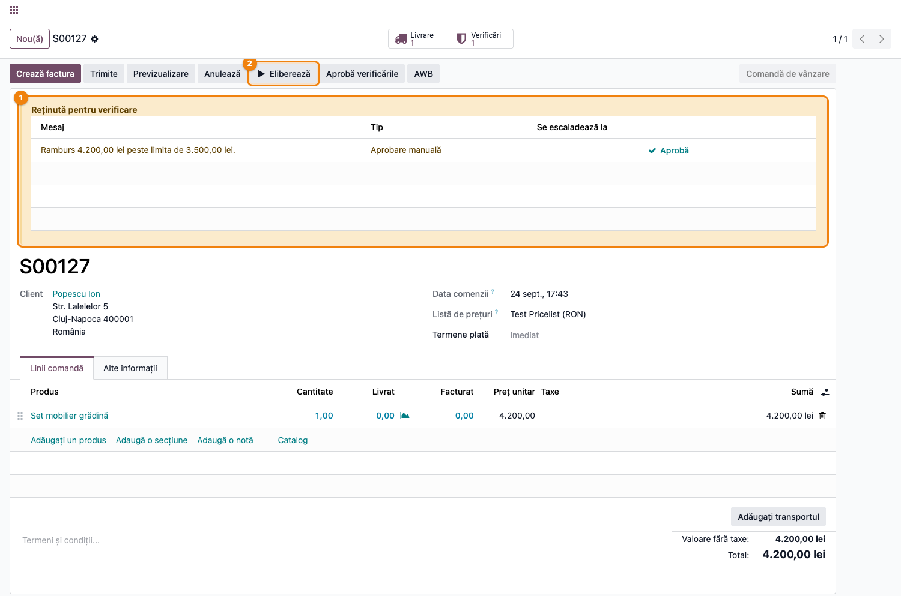
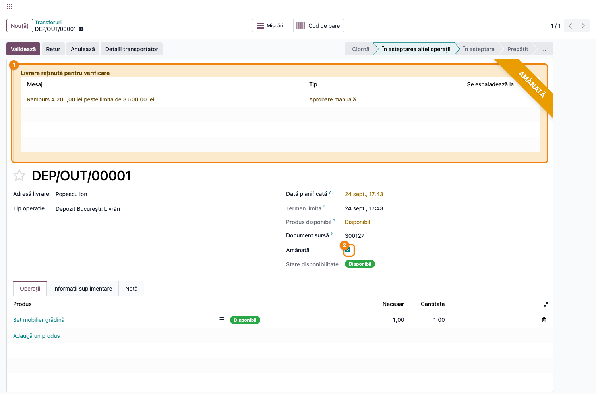
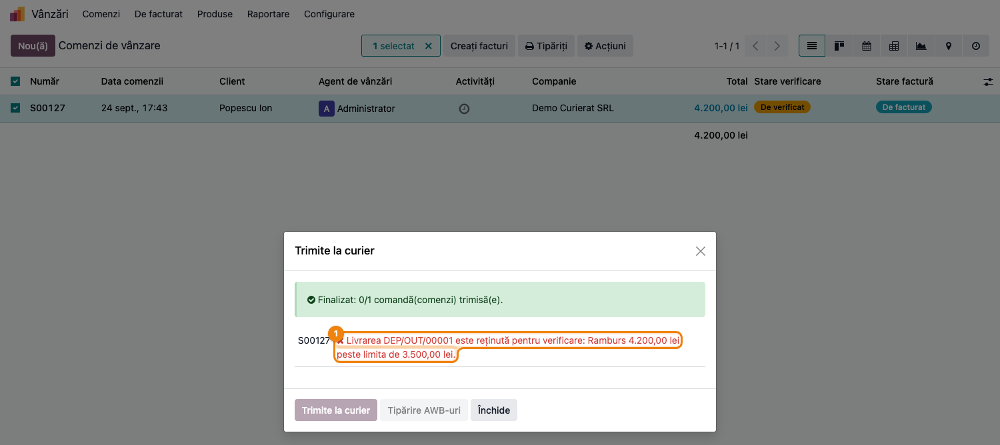
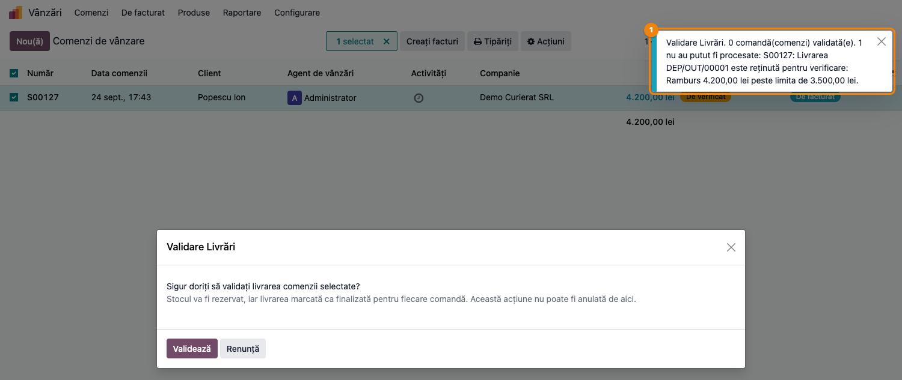

# Fișă Modul: Verificarea comenzilor în fluxul de curierat

**Modul:** `deltatech_delivery_review`
**Utilizator principal:** Operator expediție (curierat), Operator comenzi, Consultant de implementare
**Prioritate:** 🟡 Medie (rambursul judecat pe suma reală de pe AWB; motivele în dialogurile de expediere)

---

## 1. Scop business

Această fișă descrie utilizarea modulului `deltatech_delivery_review`, puntea dintre **verificarea
comenzilor** (`deltatech_sale_order_review`) și **fluxul de curierat** (`deltatech_delivery`).
Modulul face două lucruri:

1. **Rambursul se judecă pe suma de pe AWB.** Regula *Ramburs mare* întreabă fluxul de curierat cât
   va încasa efectiv curierul: totalul comenzii, dacă nu există o tranzacție de plată vie pe altă
   metodă; zero, dacă comanda e plătită online. Fără punte, regula vede doar tranzacțiile pe un
   furnizor explicit de tip „ramburs" — o comandă fără nicio tranzacție (cazul obișnuit al comenzii
   telefonice sau al importului din marketplace) ar fi trecut neverificată.
2. **Dialogurile de expediere spun motivul.** Când operatorul selectează comenzi și rulează
   **Acțiuni → Trimite la curier** sau **Acțiuni → Validare Livrări**, o livrare reținută nu mai
   apare ca un sec „amânată": rândul ei spune „Livrarea DEP/OUT/00001 este reținută pentru
   verificare: Ramburs 4.200,00 lei peste limita de 3.500,00 lei", ca operatorul să știe pe loc ce
   are de verificat.

Amânarea efectivă a livrării vine din `deltatech_delivery_status_review`; `deltatech_delivery` refuză
să expedieze o livrare amânată pe orice cale (butonul de pe transfer, dialogul în bloc). Acest modul
doar aliniază cifra judecată și explică refuzul.

## 2. Bază legală și context

Nu există o obligație legală specifică — este un control intern al riscului la expediere. Contextul:
operatorul de expediție lucrează pe loturi de zeci de comenzi; le selectează în listă și le trimite
la curier dintr-un singur dialog. Dacă una e reținută, un mesaj generic îl trimite să caute prin
comandă; un mesaj cu motivul îi spune direct ce e de făcut (sunat clientul, verificat adresa) sau pe
cine să întrebe.

A doua problemă e de **măsurare**: regula *Ramburs mare* trebuie să judece aceeași sumă pe care o
tipărește AWB-ul. În fluxul de curierat suma de încasat este totalul comenzii cât timp nu există o
tranzacție de plată pe altă metodă (card, transfer) care să o acopere. Fără această punte, o comandă
de 4.200 lei fără tranzacție nu ar fi fost considerată ramburs și ar fi plecat neverificată.

## 3. Utilizatori și roluri

- **Operator expediție** — rulează **Trimite la curier** / **Validare Livrări** pe loturi; citește
  motivele din dialog și le pasează operatorului de comenzi.
- **Operator comenzi** — aprobă motivul pe comandă (sau **Eliberează** livrarea), după care lotul se
  reia.
- **Responsabil vânzări** — aprobă rambursul mare (grupul **Aprobă comenzile reținute**).
- **Consultant de implementare** — verifică pragul regulii și că rambursul judecat corespunde
  AWB-ului.

Modulul nu introduce grupuri noi. Drepturile relevante vin din modulele legate: acțiunile în bloc din
lista de comenzi cer drepturi de vânzări și de inventar; aprobarea motivului cere dreptul de aprobare
al regulii (rambursul mare: **Aprobă comenzile reținute**).

Roluri recomandate la testare:

- Administrator funcțional (vânzări + inventar + grupul de aprobare): parcurge tot fluxul.
- Operator expediție fără grupul de aprobare: vede mesajul cu motivul în dialog, dar nu poate aproba.

## 4. Conturi și date implicate

Modulul **nu generează note contabile** și nu introduce conturi. Lucrează pe comanda de vânzare
(`sale.order`), pe transferul de ieșire (`stock.picking`) și pe tranzacțiile de plată.

Date minime pentru demo:

- un produs stocabil cu stoc (ex. 4.200 lei) și un client cu adresă completă;
- regula **Ramburs mare** activă, cu prag (ex. 3.500 lei);
- o comandă **fără** tranzacție de plată (telefonică sau importată) — tot totalul pleacă ramburs;
- opțional, o comandă plătită cu cardul (tranzacție confirmată pe alt furnizor), pentru a arăta că nu
  primește motivul — suma de încasat e zero.

## 5. Configurare inițială

1. Modulul se instalează **automat** când `deltatech_delivery` și `deltatech_sale_order_review` sunt
   amândouă instalate (`auto_install`). Nu are meniu și nu are setări proprii.
2. Instalați și `deltatech_delivery_status_review` (la fel, automat, cu `deltatech_delivery_status`):
   fără el motivul apare pe comandă, dar livrarea nu este amânată și dialogurile nu au ce refuza.
3. Accesați **Vânzări → Configurare → Reguli de verificare comenzi** și verificați regula **Ramburs
   mare**: activă, cu **Prag valoare** potrivit și cu grupul de aprobare dorit.
4. Verificați că furnizorii de plată online folosiți au tranzacții confirmate la finalizarea plății —
   suma de încasat pe AWB (și deci rambursul judecat) depinde de starea ultimei tranzacții a comenzii.

## 6. Flux de utilizare

### Pasul 1 — Comanda cu ramburs peste prag

O comandă de 4.200 lei, fără tranzacție de plată, se **confirmă**. Fluxul de curierat va pune tot
totalul ca sumă de încasat pe AWB, deci regula *Ramburs mare* judecă 4.200 lei față de pragul de
3.500 și deschide motivul „Ramburs 4.200,00 lei peste limita de 3.500,00 lei". Bannerul **Reținută
pentru verificare** îl arată pe comandă; cu `deltatech_delivery_status_review` instalat, livrarea este
amânată și în antet apare **Eliberează**.

Aceeași comandă plătită cu cardul (tranzacție confirmată) nu ar primi motivul: suma de încasat e
zero, deci nu este ramburs.



### Pasul 2 — Livrarea reținută, văzută de expediție

Accesați **Inventar → Operațiuni → Transferuri** și deschideți livrarea comenzii. Transferul poartă
panglica **AMÂNATĂ** și bannerul **Livrare reținută pentru verificare** cu același motiv. Orice
încercare de expediere de aici — **Detalii transportator** urmat de trimitere — este refuzată cu
mesajul care numește motivul: „Livrarea DEP/OUT/00001 este reținută pentru verificare: Ramburs
4.200,00 lei peste limita de 3.500,00 lei".



### Pasul 3 — Acțiuni → Trimite la curier

Accesați **Vânzări → Comenzi → Comenzi**, bifați comenzile lotului și alegeți **Acțiuni → Trimite la
curier**. Dialogul listează comenzile; **Trimite la curier** le procesează una câte una și generează
AWB-urile. Pentru comanda reținută, rândul devine roșu cu motivul complet; restul lotului nu este
afectat.

**Găsește pe ecran:** fiecare rând e o comandă; în dreapta, un AWB (verde) sau mesajul de eroare
(roșu). Antetul verde „Finalizat: 0/1 comandă(comenzi) trimisă(e)" rezumă lotul.
**Verifică:** mesajul roșu începe cu „este reținută pentru verificare" — deci nu e o eroare a
curierului, ci o comandă de verificat; motivul de după două puncte spune ce anume.
**Treci mai departe:** deschideți comanda, aprobați motivul (**Aprobă** pe rând sau **Eliberează**),
apoi reluați **Trimite la curier** pe aceeași selecție — comenzile deja trimise sunt sărite, nu
retrimise.



### Pasul 4 — Acțiuni → Validare Livrări

Pe aceeași selecție, **Acțiuni → Validare Livrări** cere o confirmare (rezervă stocul și marchează
livrările ca efectuate, ireversibil), apoi **Validează** procesează lotul și afișează o notificare cu
raportul: câte comenzi au fost validate și, pentru fiecare comandă neprocesată, motivul. Comanda
reținută apare cu același text ca în dialogul de curier — „Livrarea DEP/OUT/00001 este reținută
pentru verificare: Ramburs …" — în loc de „transferul este amânat".

**Găsește pe ecran:** notificarea din dreapta-sus, cu titlul **Validare Livrări**; prima frază e
totalul („0 comandă(comenzi) validată(e). 1 nu au putut fi procesate"), apoi câte un rând pe comandă.
**Verifică:** rândurile „reținută pentru verificare" sunt comenzi de aprobat, nu probleme de stoc;
raportul rămâne afișat (notificare persistentă) cât timp există probleme.
**Treci mai departe:** după aprobarea motivelor, reluați acțiunea pe comenzile rămase.



### Note de monografie și raportare

Modulul nu generează note contabile — schimbă doar cifra pe care o judecă regula de ramburs și
textul afișat de dialogurile de expediere. Urma de audit rămâne cea a modulului de verificare: lista
de motive de pe comandă (smart button **Verificări**) și nota din chatter la aprobare.

## 7. Legături cu alte module / declarații

| Modul / proces | Rol în flux | Tip legătură |
|---|---|---|
| `deltatech_delivery` | suma de încasat pe AWB, dialogul **Trimite la curier**, acțiunea **Validare Livrări**, refuzul de a expedia o livrare amânată | dependență (manifest) |
| `deltatech_sale_order_review` | regula **Ramburs mare**, motivele, wizardul de aprobare | dependență (manifest) |
| `deltatech_delivery_status_review` | amânarea efectivă a livrării cât timp motivul e deschis; butonul **Eliberează** | modul-frate (recomandat) |
| `deltatech_delivery_status` | câmpul **Amânată** pe transfer și refuzul la **Validează** | prin `deltatech_delivery` |
| `payment` | tranzacțiile de plată care decid dacă suma de pe AWB e totalul sau zero | integrare |

Ce este automat: calculul sumei de încasat, evaluarea regulii de ramburs pe acea sumă, mesajul cu
motivul în dialogul de curier și în raportul de validare, săritul comenzilor deja trimise la
reluarea dialogului.
Ce rămâne manual: aprobarea motivului pe comandă și reluarea acțiunii în bloc.

## 8. Verificări pentru consultant

- [ ] Modulul apare instalat automat după instalarea celor două dependențe.
- [ ] O comandă fără tranzacție de plată, cu totalul peste pragul regulii **Ramburs mare**, primește
      motivul „Ramburs … peste limita de …"; aceeași comandă cu o tranzacție confirmată pe card nu
      îl primește.
- [ ] Cu `deltatech_delivery_status_review` instalat, livrarea comenzii reținute are bifa **Amânată**.
- [ ] **Acțiuni → Trimite la curier** pe comanda reținută afișează rândul roșu cu „este reținută
      pentru verificare: …" și motivul; nu se generează AWB.
- [ ] **Acțiuni → Validare Livrări** → **Validează** afișează notificarea cu același motiv; livrarea
      rămâne nevalidată.
- [ ] După aprobarea motivului (**Aprobă** / **Eliberează**), reluarea acțiunii **Trimite la curier**
      trece comanda (cu un transportator configurat) și o sare pe cea deja trimisă.
- [ ] O livrare amânată **fără** motiv de verificare (bifă pusă direct, fără reguli) păstrează
      mesajul simplu „Livrarea … este amânată. Eliberați-o pe comanda de vânzare …".

## 9. Mesaje de eroare frecvente

| Mesaj / simptom | Cauză probabilă | Remediere |
|-----------------|-----------------|-----------|
| „Livrarea … este reținută pentru verificare: Ramburs … peste limita de …" în dialogul de curier sau în raport | Motivul de ramburs e deschis pe comandă; livrarea e amânată | Aprobați motivul pe comandă (**Aprobă** / **Eliberează**) și reluați acțiunea |
| „Livrarea … este amânată. Eliberați-o pe comanda de vânzare înainte de a o trimite la curier." | Livrarea e amânată fără motiv de verificare (bifă manuală pe transfer sau amânare fără `deltatech_delivery_status_review`) | **Eliberează** pe comandă; instalați puntea de amânare ca amânările să aibă motiv |
| Comanda cu ramburs mare nu primește motivul | Regula **Ramburs mare** e inactivă / pragul e 0, sau comanda are o tranzacție confirmată pe alt furnizor (suma de încasat e zero) | Verificați regula și tranzacțiile comenzii |
| Comanda plătită cu cardul primește totuși motivul de ramburs | Tranzacția nu e confirmată (în așteptare / anulată), deci suma de încasat rămâne totalul | Așteptați confirmarea plății sau verificați furnizorul de plată |
| Rândul din dialog e roșu, dar cu alt text (curier, greutate, transportator neconfigurat) | Nu este o reținere de verificare, ci o problemă a expedierii | Vezi fișa `deltatech_delivery` și a transportatorului |

## 10. Capturi de ecran

Capturile (`readme/screenshots/`) sunt generate automat din `tests/test_screenshots.py` (mixinul
`ScreenshotCase` din `l10n_ro_doc_screenshots`, import defensiv), în limba română, pe compania RO:

1. `01_comanda_ramburs.png` — comanda confirmată, reținută pentru „Ramburs 4.200,00 lei peste limita
   de 3.500,00 lei", cu butonul **Eliberează**.
2. `02_livrare_retinuta.png` — transferul amânat, cu panglica **AMÂNATĂ** și bannerul motivelor.
3. `03_trimite_la_curier.png` — dialogul **Trimite la curier** după procesare: rândul roșu cu motivul.
4. `04_validare_livrari.png` — confirmarea **Validare Livrări** și notificarea cu raportul care
   numește motivul.

Regenerare (test Playwright, `tests/test_screenshots.py`; cere `l10n_ro` și
`deltatech_delivery_status_review` instalate):

```bash
./odoo/odoo-bin -c odoo.conf -d <db> -i l10n_ro,deltatech_delivery_status_review \
    -u deltatech_delivery_review,l10n_ro_doc_screenshots --test-tags=fise_screenshots --stop-after-init
```

## 11. Observații pentru manual

Păstrați în manual regula simplă pentru operatorul de expediție: **un rând roșu care începe cu „este
reținută pentru verificare" nu e o eroare de curier, ci o comandă de aprobat** — restul textului spune
ce și cui. Explicați în capitolul despre ramburs că verificarea judecă exact suma de pe AWB: o
comandă plătită online nu e ramburs, o comandă fără tranzacție e ramburs pe tot totalul. Menționați
că dialogul **Trimite la curier** poate fi reluat pe aceeași selecție fără risc de AWB dublu —
comenzile deja trimise sunt sărite.
