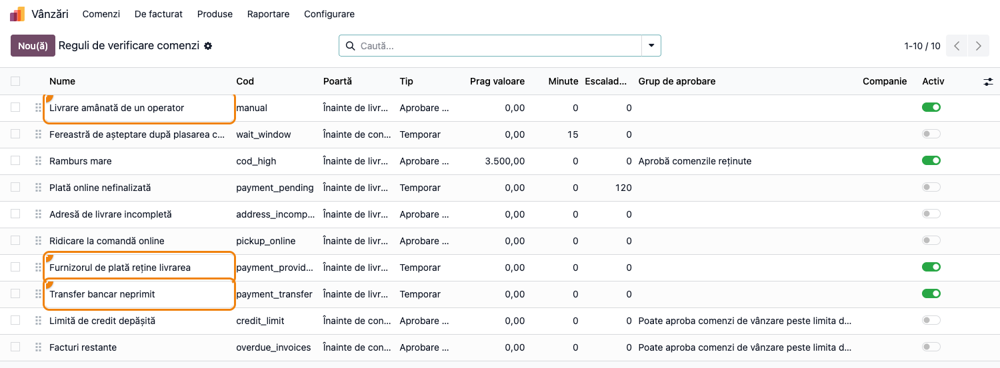
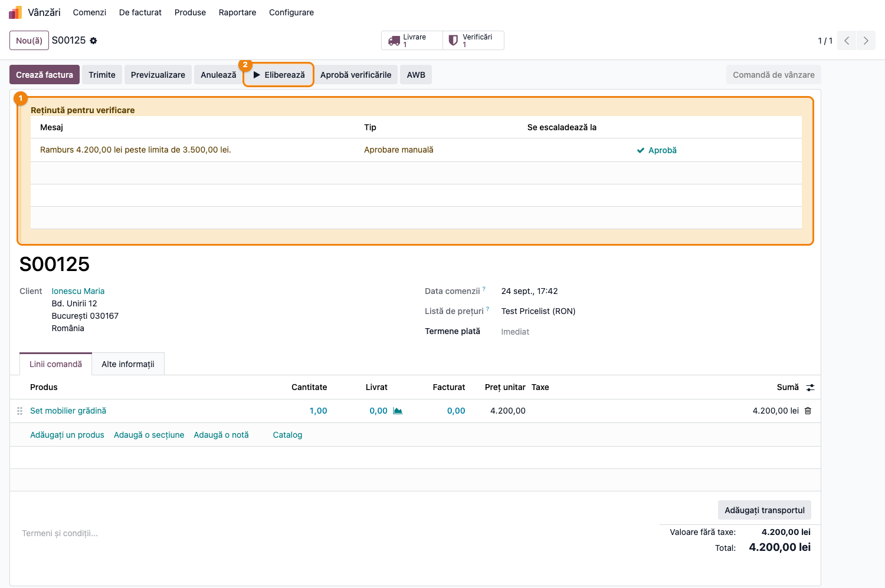
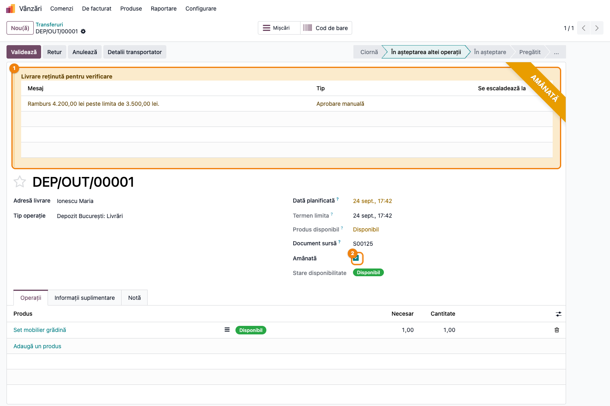
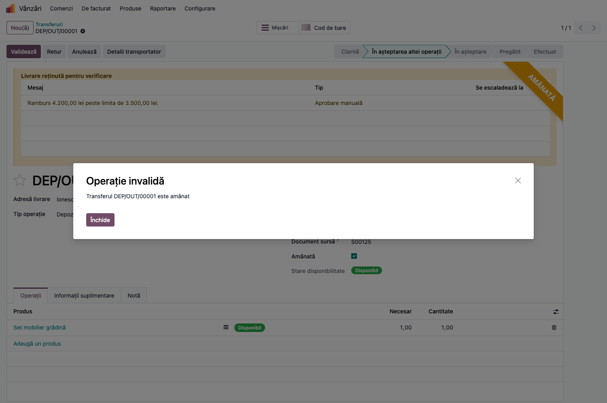
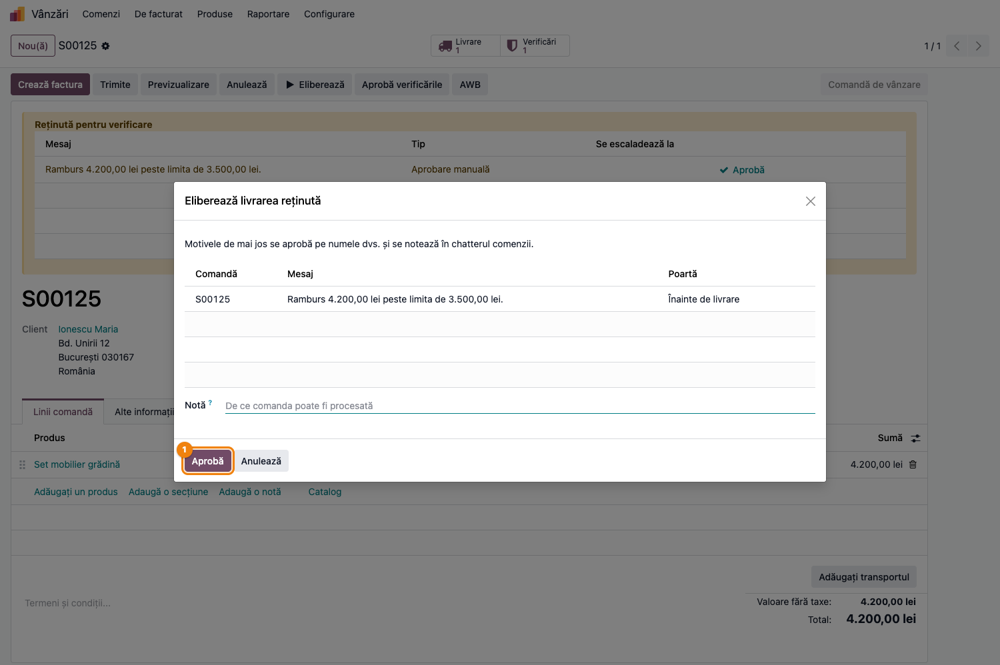
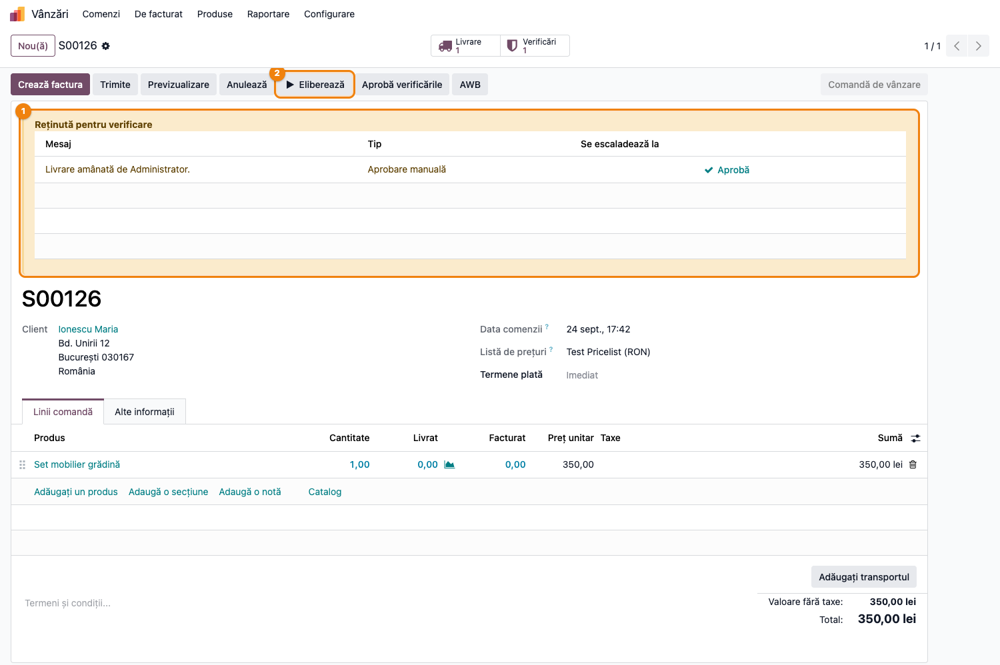
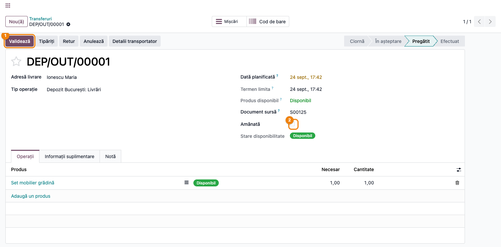

# Fișă Modul: Livrări reținute de verificarea comenzii

**Modul:** `deltatech_delivery_status_review`
**Utilizator principal:** Operator comenzi (e-commerce / marketplace), Operator depozit, Responsabil vânzări, Consultant de implementare
**Prioritate:** 🟡 Medie (control operațional: coletul nu pleacă până nu e verificată comanda; nu obligație legală)

---

## 1. Scop business

Această fișă descrie utilizarea modulului `deltatech_delivery_status_review`, puntea dintre
**verificarea comenzilor** (`deltatech_sale_order_review`) și **amânarea livrărilor**
(`deltatech_delivery_status`). Modulul de verificare marchează comanda și spune *de ce* e reținută;
modulul de amânare ține coletul în depozit. Fără punte, cele două nu se cunosc: o comandă cu ramburs
mare are bannerul galben, dar livrarea ei poate fi validată și trimisă la curier ca oricare alta.

Cu puntea instalată, un motiv deschis pe poarta **Înainte de livrare** (ramburs peste prag, adresă
incompletă, plată online nefinalizată, ridicare la comandă online) **amână** livrările de ieșire ale
comenzii: rămân în așteptare, cu panglica **Amânată**, și butonul **Validează** le refuză. Când ultimul
motiv este aprobat sau se rezolvă singur, livrările sunt eliberate. În sens invers, amânările pe care
depozitul le folosea deja — furnizorul de plată cu „Postponed Delivery", transferul bancar așteptat de
echipa de vânzări, butonul **Amână** — devin **motive** vizibile pe comandă, cu autor și cu o cale de
ieșire: butonul **Eliberează** deschide wizardul de aprobare în loc să ridice amânarea orbește.

## 2. Bază legală și context

Nu există o obligație legală specifică — este un control intern al riscului operațional. Contextul:
în magazinele online și pe marketplace, între confirmarea comenzii și predarea coletului la curier
trec câteva ore în care nimeni nu s-a uitat la comandă. Modulul de verificare pune întrebările
(„rambursul e prea mare?", „adresa e completă?"); acest modul se asigură că **răspunsul contează în
depozit**: cât timp un motiv e deschis, coletul nu poate fi validat și nici trimis la curier.

Ce se schimbă față de folosirea separată a celor două module:

- **Amânare cu motiv.** Livrările comenzilor reținute înainte de livrare sunt amânate automat și
  eliberate automat când nu mai rămâne niciun motiv deschis. O comandă pe care verificarea nu a
  atins-o niciodată își păstrează amânarea pusă prin alte mijloace.
- **Amânările vechi devin motive.** Trei reguli noi, pe poarta de livrare: *Furnizorul de plată
  reține livrarea* (temporar — se rezolvă când plata se confirmă), *Transfer bancar neprimit*
  (temporar — idem) și *Livrare amânată de un operator* (aprobare manuală — butonul **Amână**
  înregistrează numele operatorului).
- **Plata finalizată nu eliberează tot.** Confirmarea plății închide doar motivul ei; dacă rambursul
  sau adresa țin încă livrarea, aceasta rămâne amânată.
- **Eliberează trece prin aprobare.** Butonul de pe comandă deschide wizardul cu motivele care rețin
  livrarea; un utilizator fără dreptul de a le aproba primește lista motivelor și livrarea rămâne
  amânată.
- **Bannerul pe livrare.** Formularul transferului arată aceleași motive ca comanda, ca operatorul
  din depozit să știe de ce nu poate valida.
- **Migrare.** La instalare, livrările deja amânate ale comenzilor deschise primesc un motiv manual
  („Livrare amânată înainte de instalarea modulului de verificare"), ca să intre în coada de
  verificare și să fie eliberate la fel ca restul.

## 3. Utilizatori și roluri

- **Operator comenzi** — lucrează coada **De verificat** din lista de comenzi, aprobă motivele și
  eliberează livrările; folosește **Amână** când vrea să oprească o comandă din alt motiv.
- **Operator depozit** — vede panglica **Amânată** și bannerul cu motivele pe transfer; nu poate
  valida până nu e eliberată livrarea. Nu are nevoie de drepturi noi.
- **Responsabil vânzări** — aprobă motivele rezervate grupului **Aprobă comenzile reținute** (ramburs
  mare) și decide eliberarea.
- **Consultant de implementare** — verifică regulile, providerii de plată și echipele de vânzări.

Modulul nu introduce grupuri noi. Drepturile relevante vin din modulele legate:

- **Amână** / **Eliberează** pe comandă cer grupul **Inventar / Utilizator** (`stock.group_stock_user`).
- **Aprobă** pe un motiv cere dreptul de aprobare al regulii respective (implicit, rambursul mare
  cere **Aprobă comenzile reținute**; regulile fără grup pot fi aprobate de orice utilizator de
  vânzări).

Roluri recomandate la testare:

- Administrator funcțional (vânzări + inventar + grupul de aprobare): parcurge tot fluxul.
- Operator depozit (doar inventar): încearcă **Validează** pe o livrare amânată și primește refuzul.
- Agent de vânzări fără grupul de aprobare: apasă **Eliberează** pe o comandă cu ramburs mare și
  primește mesajul cu motivele.

## 4. Conturi și date implicate

Modulul **nu generează note contabile** și nu introduce conturi. Lucrează pe comanda de vânzare
(`sale.order`), pe transferuri (`stock.picking`, câmpul **Amânată**), pe tranzacțiile de plată și pe
regulile de verificare.

Date minime pentru demo:

- un produs stocabil cu stoc disponibil (ex. 4.200 lei, ca rambursul să depășească pragul de 3.500);
- un client cu adresă completă (localitate, cod poștal, telefon), ca singurul motiv să fie rambursul;
- regula **Ramburs mare** activă, cu pragul dorit;
- opțional: un furnizor de plată cu **Postponed Delivery** bifat și o echipă de vânzări cu **Amână
  livrarea pentru plata prin transfer**, pentru motivele temporare.

## 5. Configurare inițială

1. Modulul se instalează **automat** când `deltatech_sale_order_review` și `deltatech_delivery_status`
   sunt amândouă instalate (`auto_install`). Nu are meniu propriu.
2. Accesați **Vânzări → Configurare → Reguli de verificare comenzi** și verificați cele trei reguli
   adăugate, toate pe poarta **Înainte de livrare**: *Livrare amânată de un operator* (aprobare
   manuală), *Furnizorul de plată reține livrarea* și *Transfer bancar neprimit* (temporare). Sunt
   active implicit; comutatorul **Activ** le oprește fără să le șteargă.
3. Verificați pragul regulii **Ramburs mare** și grupul ei de aprobare — ea este motivul cel mai
   frecvent care amână livrarea.
4. Pentru plățile online care trebuie să ajungă înainte de expediere, bifați **Postponed Delivery**
   pe furnizorul de plată (**Facturare → Configurare → Furnizori de plată**). Pentru transfer
   bancar, bifați **Amână livrarea pentru plata prin transfer** pe echipa de vânzări
   (**Vânzări → Configurare → Echipe de vânzări**). Ambele bife existau și înainte; acum produc
   motive vizibile pe comandă.
5. Pe o bază cu livrări amânate înainte de instalare, verificați în lista de comenzi (filtrul
   **De verificat**) comenzile care au primit motivul *Livrare amânată înainte de instalarea
   modulului de verificare* — sunt amânările vechi, de eliberat prin același wizard.

## 6. Flux de utilizare

### Pasul 1 — Regulile de pe poarta de livrare

Accesați **Vânzări → Configurare → Reguli de verificare comenzi**. Pe lângă regulile modulului de
bază apar cele trei reguli ale punții. Coloana **Poartă** arată *Înainte de livrare* la toate;
**Tip** deosebește amânarea manuală (aprobare) de cele două amânări de plată (temporare, se închid
singure când tranzacția e confirmată). Regulile nu au prag și nu au grup de aprobare: motivul manual
poate fi aprobat de orice utilizator de vânzări, cele temporare nu se aprobă, ci așteaptă plata.



### Pasul 2 — Comanda confirmată, cu livrarea reținută

O comandă cu ramburs de 4.200 lei intră din magazin și se **confirmă** (stocul se rezervă). Bannerul
**Reținută pentru verificare** listează motivul — „Ramburs 4.200,00 lei peste limita de 3.500,00
lei" — iar în antet, lângă **Aprobă verificările**, apare **Eliberează**: butonul modulului de
amânare, care de acum trece prin aprobare. Smart button-ul **Livrare** duce la transferul amânat.

Operatorul are trei căi echivalente, toate cu urmă în istoric:

1. **Aprobă** pe rândul motivului — aprobă doar acel motiv; livrarea se eliberează dacă nu mai
   rămâne altul deschis;
2. **Aprobă verificările** — wizardul cu toate motivele deschise ale comenzii;
3. **Eliberează** — wizardul cu motivele care rețin **livrarea** (Pasul 5).



### Pasul 3 — Livrarea amânată, văzută din depozit

Accesați **Inventar → Operațiuni → Transferuri** (sau smart button-ul **Livrare** de pe comandă) și
deschideți livrarea comenzii. Transferul poartă panglica **AMÂNATĂ**, bifa **Amânată** este pusă și
starea rămâne *În așteptarea altei operații*, deși produsul este **Disponibil**. Bannerul **Livrare
reținută pentru verificare** repetă motivele de pe comandă, ca operatorul din depozit să știe de ce
nu poate valida și pe cine să întrebe. În lista de transferuri, filtrul **Amânată** dă toate
livrările oprite.

**Găsește pe ecran:** panglica din colțul dreapta-sus, bifa **Amânată** și bannerul galben cu
mesajul, tipul și ora de escaladare a fiecărui motiv.
**Verifică:** produsul este disponibil (rezervat), deci singurul lucru care ține livrarea este
verificarea comenzii, nu lipsa de stoc.
**Treci mai departe:** nu forțați bifa **Amânată** de mână — debifarea ei nu închide motivul, iar
următoarea reevaluare a comenzii o pune la loc. Eliberarea se face de pe comandă (Pasul 5).



### Pasul 4 — Validarea livrării amânate este refuzată

Dacă operatorul din depozit apasă totuși **Validează**, primește mesajul **„Transferul DEP/OUT/00001
este amânat"** și transferul rămâne neatins. Același refuz apare la trimiterea către curier prin
orice cale (butonul de pe livrare sau acțiunile în bloc din `deltatech_delivery`, care cu puntea
`deltatech_delivery_review` numesc și motivul).



### Pasul 5 — Eliberează deschide wizardul de aprobare

Pe comandă, **Eliberează** nu mai ridică amânarea direct: deschide wizardul **Eliberează livrarea
reținută**, cu motivele care țin livrarea, poarta la care opresc și un câmp **Notă**. **Aprobă**
aprobă motivele pe numele utilizatorului, notează în chatter și eliberează livrarea în același pas.
**Anulează** lasă totul neatins.

Un utilizator care **nu** are dreptul să aprobe toate motivele (ex. rambursul mare fără grupul
**Aprobă comenzile reținute**) primește în loc de wizard mesajul „Livrarea este reținută pentru
verificare și nu poate fi eliberată", cu lista motivelor.



### Pasul 6 — Amânarea manuală devine motiv

Pe o comandă fără nicio problemă, operatorul poate opri livrarea cu **Amână** (de exemplu, clientul a
cerut să mai adauge un produs). Înainte, amânarea era o bifă fără explicație; acum comanda primește
motivul **„Livrare amânată de Administrator."** — cu numele celui care a apăsat — și intră în coada
**De verificat**, alături de celelalte comenzi reținute. Eliberarea se face la fel: **Aprobă** pe
rând sau **Eliberează**.



### Pasul 7 — Livrarea eliberată

După aprobarea motivului, transferul își pierde panglica, bifa **Amânată** este debifată și starea
trece în **Pregătit**: **Validează** este acum disponibil și livrarea urmează fluxul obișnuit spre
curier. Motivele de plată (furnizor cu *Postponed Delivery*, transfer bancar) nu au nevoie de
aprobare: se rezolvă singure când tranzacția este confirmată — dar eliberează livrarea **doar** dacă
niciun alt motiv nu o mai ține.



### Note de monografie și raportare

Modulul nu generează note contabile — condiționează doar validarea și expedierea transferului de
ieșire. Facturarea și livrarea urmează fluxul standard odată ce motivele sunt aprobate sau rezolvate.
Urma de audit este lista de motive de pe comandă (smart button **Verificări**), nota din chatter la
aprobare și câmpul **Amânată** al transferului, care are urmărire (tracking) și arată în chatterul
livrării fiecare amânare și eliberare.

## 7. Legături cu alte module / declarații

| Modul / proces | Rol în flux | Tip legătură |
|---|---|---|
| `deltatech_sale_order_review` | motivele, porțile, wizardul de aprobare, coada **De verificat** | dependență (manifest) |
| `deltatech_delivery_status` | câmpul **Amânată** pe transfer, refuzul la **Validează**, butoanele **Amână** / **Eliberează**, bifele pe furnizorul de plată și pe echipă | dependență (manifest) |
| `payment` (prin `deltatech_delivery_status`) | tranzacțiile de plată — motivele temporare se închid la confirmarea plății | integrare |
| `stock` | transferul de ieșire, starea *În așteptare* cât e amânat, filtrul **Amânată** | integrare |
| `deltatech_delivery_review` | dialogul **Trimite la curier** și raportul **Validare Livrări** numesc motivul care reține livrarea | modul-frate (opțional) |

Ce este automat: amânarea livrărilor la deschiderea unui motiv pe poarta de livrare, eliberarea la
închiderea ultimului motiv, transformarea amânărilor de plată în motive și rezolvarea lor la
confirmarea plății, motivul manual la **Amână**, migrarea amânărilor existente la instalare.
Ce rămâne manual: aprobarea motivelor (pe rând, prin **Aprobă verificările** sau prin **Eliberează**),
decizia de a amâna o comandă fără problemă detectată automat.

## 8. Verificări pentru consultant

- [ ] Modulul apare instalat automat după instalarea celor două dependențe; în **Reguli de
      verificare comenzi** există cele trei reguli noi, pe poarta *Înainte de livrare*.
- [ ] O comandă cu ramburs peste prag se confirmă, livrarea ei are bifa **Amânată** și panglica, iar
      **Validează** o refuză cu „Transferul … este amânat".
- [ ] Bannerul **Livrare reținută pentru verificare** de pe transfer arată același motiv ca bannerul
      de pe comandă.
- [ ] **Eliberează** pe comandă deschide wizardul pentru un utilizator cu drept de aprobare și
      afișează mesajul cu motivele pentru unul fără.
- [ ] După **Aprobă** în wizard, transferul trece în *Pregătit*, bifa **Amânată** dispare și
      **Validează** merge.
- [ ] **Amână** pe o comandă fără motive creează motivul „Livrare amânată de …" cu numele
      utilizatorului; comanda apare în filtrul **De verificat**.
- [ ] Cu un furnizor de plată cu **Postponed Delivery** în modul test: comanda plătită dar
      neconfirmată are motivul „Livrare reținută până la confirmarea plății …"; confirmarea
      tranzacției îl rezolvă și eliberează livrarea **doar** dacă nu mai există alt motiv deschis.
- [ ] Debifarea manuală a câmpului **Amânată** pe transfer, cu motivul încă deschis, este anulată la
      următoarea reevaluare a comenzii.
- [ ] Pe o bază cu livrări amânate înainte de instalare, comenzile lor au motivul „Livrare amânată
      înainte de instalarea modulului de verificare" și pot fi eliberate prin wizard.

## 9. Mesaje de eroare frecvente

| Mesaj / simptom | Cauză probabilă | Remediere |
|-----------------|-----------------|-----------|
| „Transferul … este amânat" la **Validează** | Comanda are un motiv deschis pe poarta de livrare (sau o amânare manuală) | Deschideți comanda, aprobați motivul sau apăsați **Eliberează**; nu debifați **Amânată** de mână |
| „Livrarea este reținută pentru verificare și nu poate fi eliberată: …" la **Eliberează** | Utilizatorul nu are dreptul să aprobe cel puțin unul din motive (ex. rambursul mare cere **Aprobă comenzile reținute**) | Un utilizator din grupul de aprobare eliberează prin wizard, sau se așteaptă rezolvarea motivelor temporare |
| Plata cu cardul s-a confirmat, dar livrarea a rămas amânată | Un alt motiv (ramburs, adresă, amânare manuală) ține încă livrarea | Verificați bannerul comenzii și aprobați motivul rămas — comportamentul e intenționat |
| Butoanele **Amână** / **Eliberează** nu apar pe comandă | Utilizatorul nu are grupul **Inventar / Utilizator**, sau comanda nu are încă nicio livrare | Acordați grupul; butoanele apar doar pe comenzi cu livrări |
| Bifa **Amânată** revine singură după ce a fost debifată | Motivul de pe comandă e încă deschis; reevaluarea o pune la loc | Eliberarea se face de pe comandă, nu de pe transfer |
| Comenzi vechi au apărut în **De verificat** imediat după instalare | Migrarea a dat un motiv manual livrărilor deja amânate | Este așteptat; eliberați-le prin wizard pe măsură ce le verificați |

## 10. Capturi de ecran

Capturile (`readme/screenshots/`) sunt generate automat din `tests/test_screenshots.py` (mixinul
`ScreenshotCase` din `l10n_ro_doc_screenshots`, import defensiv), în limba română, pe compania RO:

1. `01_reguli_livrare.png` — lista regulilor de verificare, cu cele trei reguli de amânare a
   livrării evidențiate.
2. `02_comanda_retinuta.png` — comanda confirmată, reținută înainte de livrare: bannerul cu motivul
   și butonul **Eliberează**.
3. `03_livrare_retinuta.png` — transferul amânat: panglica **AMÂNATĂ**, bifa **Amânată** și bannerul
   **Livrare reținută pentru verificare**.
4. `04_validare_refuzata.png` — mesajul „Transferul … este amânat" la **Validează**.
5. `05_wizard_eliberare.png` — wizardul **Eliberează livrarea reținută**, deschis din butonul
   **Eliberează**.
6. `06_amanare_manuala.png` — comanda amânată cu **Amână**, cu motivul „Livrare amânată de
   Administrator."
7. `07_livrare_eliberata.png` — transferul eliberat după aprobare: *Pregătit*, **Amânată** debifată,
   **Validează** disponibil.

Regenerare (test Playwright, `tests/test_screenshots.py`; cere `l10n_ro` instalat pentru compania
RO):

```bash
./odoo/odoo-bin -c odoo.conf -d <db> -i l10n_ro -u deltatech_delivery_status_review,l10n_ro_doc_screenshots \
    --test-tags=fise_screenshots --stop-after-init
```

## 11. Observații pentru manual

Păstrați în manual ideea că **amânarea este consecința motivului, nu o bifă de sine stătătoare**:
operatorul eliberează livrarea aprobând motivul de pe comandă, nu debifând **Amânată** pe transfer.
Explicați că butonul **Amână** rămâne util, dar acum lasă urmă (numele operatorului) și intră în
aceeași coadă **De verificat**. Subliniați regula „plata finalizată eliberează doar motivul ei" —
operatorii obișnuiți cu vechiul comportament se pot aștepta ca o plată cu cardul să deblocheze tot.
Pentru depozit, manualul poate rezuma într-o frază: panglica **AMÂNATĂ** înseamnă „întreabă
vânzările, nu forța validarea"; bannerul spune și pe cine să întrebi.
