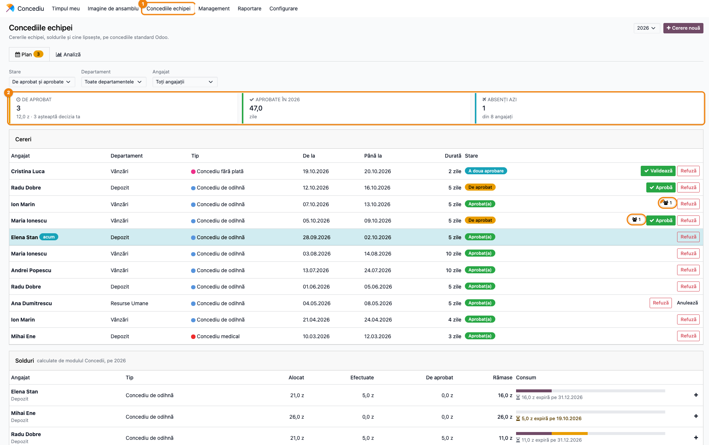
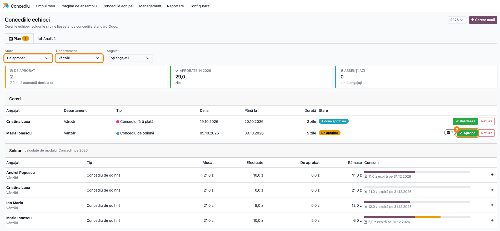
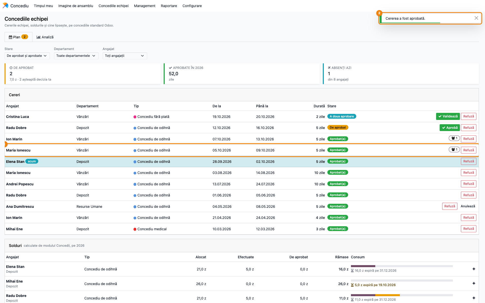
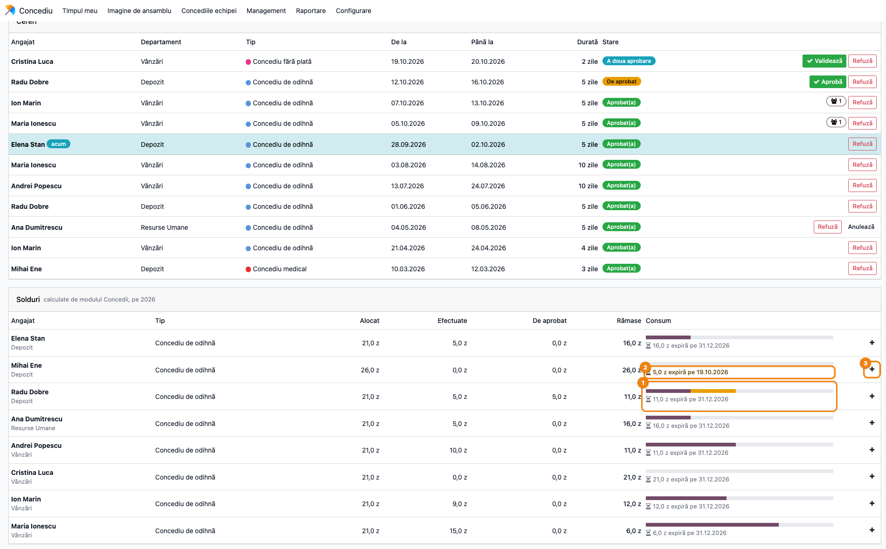
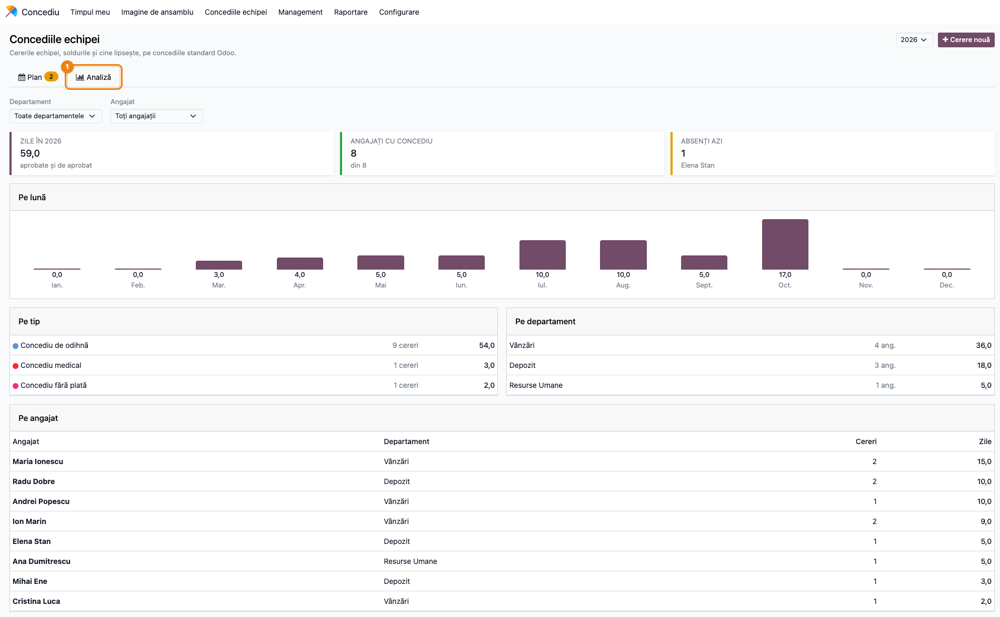
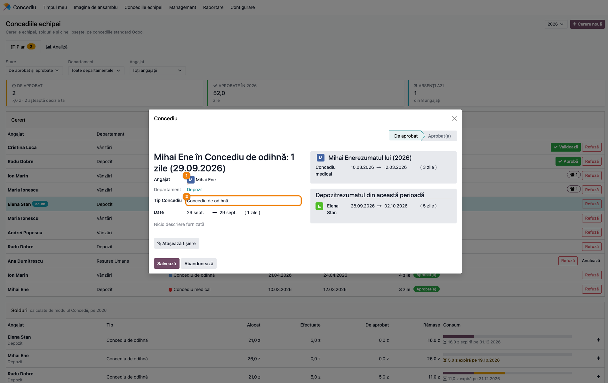

# Fișă Modul: Concediile echipei — aprobare dintr-un clic, solduri și suprapuneri pe departament

**Modul:** `deltatech_hr_leave_dashboard`
**Utilizator principal:** Responsabil resurse umane (rol Concediu „Responsabil: Gestionați toate cererile"), șef de departament, aprobatorul de concedii al angajaților
**Prioritate:** 🟢 Scăzută (nu schimbă fluxul standard de concedii, dar strânge într-un singur ecran cererile de aprobat, soldurile și cine lipsește)

---

## 1. Scop business

Cine aprobă concediile unei echipe are nevoie să vadă, înainte să apese „Aprobă", câte zile mai are omul, cine altcineva din departament lipsește în aceeași perioadă și ce alocări expiră curând. În aplicația standard **Concediu** aceste informații stau în ecrane diferite: cererile într-o listă, soldurile doar pe tabloul fiecărui angajat, iar suprapunerile cu colegii nu apar deloc (standardul oprește doar cererile suprapuse ale **aceluiași** angajat).

Modulul adaugă meniul **Concediu → Concediile echipei**, un tablou cu două taburi:

- **Plan** — cererile anului pentru oamenii de care răspundeți, cu butoane **Aprobă** / **Validează** / **Refuză** pe fiecare rând; lângă fiecare cerere, câți colegi din același departament lipsesc în aceeași perioadă; dedesubt, **soldurile întregii echipe** pe tip de concediu (alocat, efectuat, de aprobat, rămas), cu bară de consum și alocarea care expiră cel mai curând;
- **Analiză** — zilele de concediu pe lună, pe tip, pe departament și pe angajat, plus cine lipsește azi.

Tabloul nu stochează nimic și nu adaugă câmpuri pe modelele standard: la fiecare deschidere citește cererile, alocările și angajații din aplicația Concediu. Butoanele apelează aprobarea standard, deci dubla validare, drepturile de acces și notificările rămân cele din Odoo.

## 2. Bază legală și context

Modulul este un instrument operațional de planificare; nu aplică și nu verifică reguli legale. Context de reținut pentru consultant:

- Dreptul la concediul de odihnă, durata, efectuarea, reportarea zilelor neefectuate (în termen de 18 luni începând cu anul următor, art. 146 alin. 2) și programarea sunt reglementate de **Codul muncii (Legea nr. 53/2003), art. 144–148**, și de contractul colectiv / regulamentul intern. În Odoo acestea se reflectă prin **alocări** (câte zile, pe ce perioadă de valabilitate); tabloul doar le citește. O alocare de zile reportate, cu dată de sfârșit, apare pe tablou ca „N z expiră pe DATA".
- Concediul medical se înregistrează ca tip de concediu fără alocare; tabloul îl numără în analiză, dar nu calculează indemnizații și nu produce documente pentru casa de asigurări de sănătate.
- Modulul nu transmite nimic către ANAF, REVISAL sau alte sisteme și nu generează note contabile. Suspendarea contractului pe durata unui concediu fără plată se înregistrează separat în REVISAL, nu din modul.

## 3. Utilizatori și roluri

Pe tablou, fiecare utilizator vede doar angajații de care răspunde, în companiile selectate:

| Cine | Ce angajați vede | Poate decide? |
|---|---|---|
| Rolul Concediu **Responsabil: Gestionați toate cererile** (sau **Administrator**) — denumit mai jos „ofițer Concediu"; a nu se confunda cu grupul **Responsabil concedii** al aprobatorilor, care deschide meniul Management | toți angajații companiilor selectate | da, conform drepturilor standard |
| Aprobatorul de concedii al unui angajat (câmpul **Concediu** din grupul **Aprobatori**, tab **Setări** al fișei angajatului) | angajații pe care îi aprobă | da, conform drepturilor standard |
| Șeful de departament (câmpul **Manager** al departamentului) | angajații departamentului și ai subdepartamentelor, chiar fără rol în Concediu | vede cererile, dar primește butoane doar dacă drepturile standard îi permit decizia |
| Orice alt utilizator intern | doar propriile cereri și solduri (eticheta „Doar cererile proprii" sub titlu) | nu |

Meniul apare pentru orice utilizator intern care are acces la aplicația Concediu; tabloul însuși restrânge ce se vede. Un utilizator portal primește eroarea „Doar utilizatorii interni pot deschide tabloul de concedii."

Roluri recomandate pentru testare:
- **Ofițer Concediu**: parcurge fluxul din secțiunea 6 (vede tot, aprobă tot);
- **Șef de departament fără rol în Concediu**: confirmă că vede cererile echipei, fără butoane de decizie;
- **Angajat simplu**: confirmă că vede doar propriile cereri și că filtrele de departament și angajat lipsesc.

## 4. Conturi și date implicate

Nu sunt implicate conturi contabile — modulul nu creează note contabile.

Date minime pentru demo (cele din capturi, pe firma „Exemplu Distribuție SRL"):
- trei departamente cu manager: **Vânzări** (Andrei Popescu), **Depozit** (Elena Stan), **Resurse Umane** (Ana Dumitrescu, utilizatorul care face capturile, ofițer Concediu);
- trei tipuri de concediu: **Concediu de odihnă** (cu alocare, aprobat de aprobatorul angajatului), **Concediu medical** (fără alocare, aprobat de ofițerul Concediu), **Concediu fără plată** (fără alocare, cu **dublă aprobare**: aprobator, apoi ofițerul Concediu);
- câte o alocare de **21 de zile de concediu de odihnă** pe anul curent pentru fiecare angajat, plus la Mihai Ene o alocare de **5 zile reportate din anul trecut**, care expiră peste 20 de zile;
- cereri în toate stările: aprobate în lunile trecute, una în desfășurare azi (Elena Stan), două **De aprobat** (Maria Ionescu, Radu Dobre), una la **A doua aprobare** (Cristina Luca, concediu fără plată), una respinsă; cererea Mariei se suprapune cu concediul aprobat al lui Ion Marin, din același departament.

## 5. Configurare inițială

Modulul nu are setări proprii; tabloul urmează configurarea standard a aplicației Concediu:

1. Instalați `deltatech_hr_leave_dashboard` (aduce doar `hr_holidays`).
2. În **Setări → Utilizatori & Companii → Utilizatori**, dați pentru aplicația Concediu rolul **Responsabil: Gestionați toate cererile** celor care gestionează concediile întregii firme.
3. Pe fiecare angajat (**Angajați → fișa angajatului**) completați **Departamentul** și, în tab-ul **Setări**, grupul **Aprobatori**, câmpul **Concediu** (aprobatorul de concedii). Pe departament, completați **Managerul**: el vede departamentul pe tablou.
4. Pe fiecare tip de concediu (**Concediu → Configurare → Tipuri de Concediu**, meniu vizibil cu rolul **Administrator** în Concediu), setarea de aprobare decide cine aprobă și dacă e nevoie de a doua aprobare; tabloul o aplică întocmai.
5. Creați alocările (**Concediu → Management → Alocări**, meniu vizibil cel puțin cu grupul **Responsabil concedii**); pentru zilele reportate, puneți data de sfârșit a valabilității — de ea depinde mesajul „expiră pe" de pe tablou.

## 6. Flux de utilizare

### Pasul 1 — Deschiderea tabloului și citirea tabului Plan

Din **Concediu → Concediile echipei** se deschide tabloul, pe tabul **Plan**, pentru anul curent. Sus, în dreapta: selectorul de an și butonul **Cerere nouă**. Sub taburi: filtrele **Stare**, **Departament** și **Angajat**. Numărul de pe tabul **Plan** este numărul de cereri de aprobat.



**Găsește pe ecran.**
- Cele trei carduri: **De aprobat** (număr de cereri, totalul zilelor și câte „așteaptă decizia ta"), **Aprobate în <an>** (zilele aprobate care cad în anul ales), **Absenți azi** (câți angajați sunt în concediu aprobat azi, din câți sunt pe tablou).
- Lista **Cereri**, ordonată descrescător după data de început: angajat, departament, tip (cu culoarea tipului), **De la**, **Până la**, **Durată**, **Stare**. Cererea aprobată aflată în desfășurare azi are rândul colorat și eticheta **acum** (Elena Stan).
- Iconița cu persoane și un număr, lângă butoane: câți colegi din **același departament** lipsesc în aceeași perioadă (cereri de aprobat sau aprobate). Trecând cu mouse-ul peste ea apar numele lor. În captură: Maria Ionescu și Ion Marin, ambii din Vânzări, se suprapun în săptămâna care urmează.

**Verifică.**
- Filtrul **Stare** arată implicit **De aprobat și aprobate**: cererile respinse și anulate nu apar (se văd alegând **Toate** sau starea respectivă).
- Cardul **De aprobat** numără și cererile ajunse la a doua aprobare (Cristina Luca); „așteaptă decizia ta" numără cererile de aprobat, dintre cele afișate de filtrul **Stare**, pe care utilizatorul curent chiar le poate aproba (cu filtrul pe o stare fără cereri de aprobat, mențiunea dispare, deși cardul rămâne).
- Cardul **Aprobate în <an>** adună doar cererile aprobate; o cerere care trece dintr-un an în altul se împarte proporțional cu zilele calendaristice din fiecare an.
- Butoanele apar doar unde drepturile standard permit decizia: **Aprobă** la cererile de aprobat, **Validează** la cele ajunse la a doua aprobare, **Refuză** la cererile de aprobat și aprobate, **Anulează** doar pe cererile proprii.

### Pasul 2 — Restrângerea la ce așteaptă o decizie

Alegeți în filtrul **Stare** varianta **De aprobat**, iar la **Departament** departamentul care vă interesează (aici **Vânzări**). Cardurile, numărul de pe tab și soldurile se recalculează pentru angajații rămași.



**Găsește pe ecran.** Rămân doar cererile Mariei Ionescu (**De aprobat**) și a Cristinei Luca (**A doua aprobare**). Pe rândul Mariei, iconița de suprapunere arată **1**: un coleg din Vânzări lipsește în aceeași perioadă. Soldurile de dedesubt sunt doar ale angajaților din Vânzări; la Maria, bara are o parte galbenă — cele 5 zile cerute, încă neaprobate.

**Verifică.** Înainte de decizie: soldul **Rămase** al angajatului acoperă cererea, iar suprapunerea cu colegul (trecând cu mouse-ul peste iconiță vedeți cine e) este acceptabilă pentru departament. Filtrul **Departament** apare doar dacă vedeți angajați din cel puțin două departamente; filtrul **Angajat** apare pentru oricine vede mai mult decât pe sine.

**Treci mai departe.** Apăsați **Aprobă** pe rândul cererii (pasul 3). Pentru detalii, un clic pe numele angajatului deschide cererea standard într-o fereastră.

### Pasul 3 — Aprobarea dintr-un clic

Apăsați **Aprobă** pe rândul cererii. Aprobarea se face cu metoda standard a aplicației Concediu; apare mesajul **„Cererea a fost aprobată."**, iar tabloul se reîncarcă.



**Găsește pe ecran.** Rândul Mariei Ionescu are acum starea **Aprobat(a)** și a rămas doar butonul **Refuză**; cardul **De aprobat** a scăzut cu 1 (de la 3 la 2), iar **Aprobate în <an>** a crescut cu cele 5 zile ale cererii.

**Verifică.**
- La un tip cu **dublă aprobare**, primul **Aprobă** duce cererea în **A doua aprobare**; butonul **Validează** apare apoi doar celui care are dreptul la a doua aprobare (de regulă ofițerul Concediu). Tabloul nu sare peste niciun pas al aprobării standard.
- **Refuză** trece cererea direct în starea **Respins**, fără fereastră de motiv; mesajul este „Cererea a fost refuzată.".
- **Anulează** (doar pe cererile proprii) deschide fereastra standard de anulare, care cere motivul.
- Angajatul primește notificările standard ale aplicației Concediu, ca la aprobarea din lista de cereri.

### Pasul 4 — Soldurile echipei și alocările care expiră

Coborâți pe tabul **Plan** până la secțiunea **Solduri**: un rând pe fiecare angajat și tip de concediu cu alocare, cu cifrele calculate de aplicația Concediu pentru data zilei (pentru un an trecut, la 31 decembrie; pentru un an viitor, la 1 ianuarie).



**Găsește pe ecran.**
- Coloanele **Alocat**, **Efectuate** (atenție: toate zilele aprobate, inclusiv cele programate în viitor, nu doar cele deja consumate), **De aprobat**, **Rămase** (în zile „z", sau în ore „h" la tipurile cerute pe ore).
- Bara **Consum**: partea în culoarea principală a interfeței arată zilele aprobate (coloana **Efectuate**), partea galbenă zilele cerute și încă neaprobate, din totalul alocat (la Radu Dobre: 5 aprobate și 5 de aprobat din 21; la Ion Marin, cele 9 zile includ și concediul aprobat din săptămânile următoare).
- Sub bară: „N z expiră pe DATA" — zilele rămase din alocarea care expiră cel mai curând. Textul apare îngroșat când expirarea e aproape (sub 45 de zile lucrătoare): la Mihai Ene, **5,0 z expiră pe** data de sfârșit a alocării reportate.
- Butonul **+** de la capătul rândului.

**Verifică.**
- **Rămase** = Alocat − Efectuate − De aprobat; o valoare negativă apare cu roșu.
- Cifrele sunt aceleași pe care angajatul le vede pe propriul tablou din aplicația Concediu.
- Apar doar tipurile de concediu cu alocare și doar angajații care au o alocare pe acel tip; concediul medical și cel fără plată nu au sold.
- Mesajul „expiră pe" apare și pentru alocarea anuală obișnuită (data ei de sfârșit, ex. 31.12); doar cel îngroșat cere acțiune.

**Treci mai departe.** Pentru un angajat cu zile care expiră, programați concediul: butonul **+** de pe rândul lui deschide o cerere nouă (pasul 6).

### Pasul 5 — Tabul Analiză

Treceți pe tabul **Analiză**. Filtrul **Stare** dispare: analiza numără întotdeauna cererile aprobate și pe cele de aprobat, fără cele respinse sau anulate. Filtrele **Departament** și **Angajat** și selectorul de an rămân.



**Găsește pe ecran.**
- Cardurile **Zile în <an>** (aprobate și de aprobat), **Angajați cu concediu** (din câți sunt pe tablou) și **Absenți azi**, cu numele lor.
- Graficul **Pe lună**: zilele fiecărei luni.
- Tabelele **Pe tip** (număr de cereri și zile), **Pe departament** (număr de angajați și zile) și **Pe angajat** (cereri și zile), ordonate descrescător după zile.

**Verifică.**
- Totalul din cardul **Zile în <an>** este egal cu suma coloanei de zile din **Pe tip**, din **Pe departament** și din **Pe angajat**.
- Cererea Cristinei Luca respinsă în februarie nu apare (februarie are 0,0).
- O cerere se numără **integral în luna în care începe**, chiar dacă se termină în luna următoare: graficul arată o tendință, nu zilele exacte pe lună pentru salarizare.

### Pasul 6 — Cerere nouă pentru un angajat

Butonul **+** de pe un rând de sold (sau **Cerere nouă**, sus, pentru propriul angajat) deschide formularul standard de cerere de concediu într-o fereastră, cu angajatul completat.



**Găsește pe ecran.** **Angajat** este completat cu angajatul rândului (Mihai Ene); în dreapta, formularul standard arată cererile lui din an și cine din departament lipsește în perioada aleasă (panoul din dreapta e al aplicației standard; titlurile lui apar lipite în traducerea RO standard, ex. „Mihai Enerezumatul lui").

**Verifică.** Alegeți **Tip Concediu** și **Datele**, apoi **Salvează**. Cererea intră în fluxul standard de aprobare; la închiderea ferestrei tabloul se reîncarcă și cererea apare în **Cereri** și în coloana **De aprobat** a soldului. Butonul **+** completează angajatul doar dacă acesta este vizibil pe tabloul utilizatorului.

### Note de monografie și raportare

Modulul **nu generează note contabile** și nu produce fișiere sau declarații. De reținut pentru raportare:

- cifrele tabloului sunt instantanee calculate la deschidere din cererile și alocările aplicației Concediu, nu un istoric stocat;
- **Aprobate în <an>** și analiza împart proporțional pe ani cererile care trec peste 31 decembrie; graficul **Pe lună** pune toate zilele unei cereri în luna de început;
- pentru pontaj, salarizare sau raportări oficiale se folosesc rapoartele standard ale aplicației Concediu, nu tabloul.

## 7. Legături cu alte module / declarații

| Modul / proces | Rol în flux | Tip legătură |
|---|---|---|
| `hr_holidays` (Concediu) | cererile, alocările, tipurile de concediu, aprobarea standard (inclusiv dubla validare), fereastra de anulare, soldurile | dependență (manifest) |
| `hr` (Angajați) | angajații, departamentele și managerii lor, aprobatorul de concedii de pe fișa angajatului | dependență indirectă |
| Alte module | pot adăuga un tab propriu pe tablou, fără ca acest modul să depindă de ele | extensie opțională |

Ce este automat: alegerea angajaților vizibili după rol, calculul suprapunerilor pe departament, soldurile pentru toată echipa, reîncărcarea după fiecare decizie.
Ce rămâne manual: decizia de aprobare sau refuz, programarea concediilor pentru zilele care expiră, configurarea alocărilor și a aprobatorilor.

## 8. Verificări pentru consultant

- [ ] Meniul **Concediu → Concediile echipei** apare pentru un utilizator intern; un utilizator portal nu poate deschide tabloul.
- [ ] Ofițerul Concediu vede toți angajații companiilor selectate; comutând compania, apar doar angajații ei.
- [ ] Un șef de departament fără rol în Concediu vede angajații departamentului și ai subdepartamentelor, dar nu are butoane de decizie pe cererile lor.
- [ ] Un angajat simplu vede doar propriile cereri, eticheta „Doar cererile proprii", fără filtrele **Departament** și **Angajat**.
- [ ] Cardul **De aprobat** și numărul de pe tabul **Plan** sunt egale cu numărul de cereri **De aprobat** + **A doua aprobare** din filtrul **De aprobat**.
- [ ] Două cereri din același departament, în perioade care se suprapun, au amândouă iconița de suprapunere cu **1**; o cerere respinsă nu mai este numărată.
- [ ] **Aprobă** pe o cerere de tip cu aprobare simplă o trece în **Aprobat(a)**; pe un tip cu dublă aprobare o trece în **A doua aprobare**, iar **Validează** apare doar ofițerului Concediu.
- [ ] **Refuză** trece cererea în **Respins** și o scoate din filtrul implicit.
- [ ] Soldurile din tablou pentru un angajat coincid cu cele de pe tabloul lui personal din aplicația Concediu (**Concediu → Timpul meu → Tablou de bord**).
- [ ] O alocare cu data de sfârșit în următoarele câteva săptămâni apare cu „expiră pe" îngroșat.
- [ ] Pe tabul **Analiză**, suma zilelor pe tip = suma pe departament = suma pe angajat = cardul **Zile în <an>**.
- [ ] Butonul **+** pe un sold deschide formularul standard cu angajatul completat; după salvare, cererea apare pe tablou.

## 9. Mesaje de eroare frecvente

| Mesaj / simptom | Cauză probabilă | Remediere |
|-----------------|-----------------|-----------|
| „Doar utilizatorii interni pot deschide tabloul de concedii." | Utilizator portal sau public | Tabloul este doar pentru utilizatorii interni |
| „Nu puteți aproba această cerere de concediu." | Cererea a fost între timp decisă de altcineva sau utilizatorul nu are dreptul la această aprobare (ex. a doua aprobare) | Reîncărcați tabloul; a doua aprobare o face ofițerul Concediu |
| „Nu puteți refuza această cerere de concediu." / „Nu puteți anula această cerere de concediu." | Drepturile standard nu permit decizia pe acea cerere | Verificați rolul în Concediu și aprobatorul de pe fișa angajatului |
| „Această cerere de concediu nu mai există." | Cererea a fost ștearsă sau utilizatorul nu mai are acces la ea | Reîncărcați tabloul |
| Șeful de departament vede cererile echipei, dar fără butoane | Este manager de departament, dar nu aprobator de concedii și nici ofițer Concediu | Setați-l ca aprobator **Concediu** pe fișa angajaților sau dați-i rolul **Responsabil: Gestionați toate cererile** |
| Un angajat lipsește din **Solduri** | Nu are nicio alocare pe tipurile cu alocare, în anul ales | Creați alocarea în **Concediu → Management → Alocări** |
| Nu apare iconița de suprapunere, deși doi colegi lipsesc în aceeași perioadă | Angajații nu au departament, sau sunt în departamente diferite | Completați **Departamentul** pe fișa angajatului |
| Filtrul **Departament** lipsește | Utilizatorul vede angajați dintr-un singur departament | Comportament normal |

## 10. Capturi de ecran

Capturile (`readme/screenshots/`) sunt generate automat din `tests/test_screenshots.py` (mixinul `ScreenshotCase` din `l10n_ro_doc_screenshots`, import defensiv), cu interfața în limba română, pe o companie RO („Exemplu Distribuție SRL", țara România, RON), cu trei departamente, opt angajați, alocări de concediu de odihnă și cererile descrise în secțiunea 4. Modulul nu are contabilitate, deci planul de conturi nu intervine. În ordinea pașilor din secțiunea 6:

1. `01_plan_cereri.png` — tabul Plan: meniul „Concediile echipei", cardurile și lista de cereri cu suprapunerile marcate.
2. `02_filtru_de_aprobat.png` — filtrele „De aprobat" și „Vânzări", cu butonul „Aprobă" pe cererea Mariei Ionescu.
3. `03_cerere_aprobata.png` — mesajul „Cererea a fost aprobată." și cererea trecută în „Aprobat(a)".
4. `04_solduri.png` — soldurile echipei, bara de consum, alocarea reportată care expiră curând și butonul „+".
5. `05_analiza.png` — tabul Analiză: pe lună, pe tip, pe departament, pe angajat.
6. `06_cerere_noua.png` — formularul standard de cerere deschis din sold, cu angajatul completat.

Regenerare (bază fără date demo, ca pe tablou să apară doar angajații seedați):

```bash
./odoo/odoo-bin -c odoo.conf -d <db> --without-demo=all \
    -i deltatech_hr_leave_dashboard,l10n_ro_doc_screenshots \
    --test-tags=fise_screenshots --stop-after-init
```

## 11. Observații pentru manual

Păstrați în manual trei idei. Întâi, **tabloul nu are drepturi proprii**: cine vede ce depinde de rol (ofițer Concediu, aprobator, șef de departament, angajat), iar cine poate decide depinde strict de drepturile standard ale aplicației Concediu — un șef de departament poate vedea cererile echipei fără să le poată aproba. Apoi, **suprapunerea este un semnal, nu o interdicție**: iconița arată câți colegi din același departament lipsesc în aceeași perioadă, decizia rămâne a aprobatorului. În al treilea rând, **soldurile sunt cele ale aplicației Concediu**, citite pentru toată echipa odată; mesajul „expiră pe" îngroșat este cel care cere o acțiune — programarea zilelor reportate înainte de data de sfârșit a alocării. Explicați și că analiza pune fiecare cerere în luna în care începe: este o imagine de tendință, nu o bază pentru pontaj sau salarizare.
