# Fișă Modul: Marketplace — baza comună a conectorilor (backend, obiecte, stoc, preț, jurnal)

**Modul:** `deltatech_marketplace`
**Utilizator principal:** Consultant la implementare, administrator marketplace, responsabil
e-commerce
**Prioritate:** 🔴 Ridicată (fundația tuturor conectorilor: aici se decide ce intră în Odoo și ce
pleacă spre magazin)

---

## 1. Scop business

O firmă care vinde pe mai multe canale (eMAG, Shopify, WooCommerce, PrestaShop, Magento, Trendyol,
alt Odoo) are aceleași nevoi pe fiecare canal:
- cine e sursa datelor de produs;
- ce stoc și ce preț vede clientul;
- ce se întâmplă cu comenzile;
- cum afli repede că sincronizarea s-a oprit.

`deltatech_marketplace` este **baza comună** a tuturor conectorilor Terrabit. Singur nu vorbește cu
niciun magazin: conectorii (`deltatech_marketplace_emag`, `_shopify`, `_woocommerce` etc.) aduc
apelurile către platformă. Baza aduce tot ce e la fel pe toate canalele:
- **backend-ul** — un magazin conectat, cu datele de acces, compania, lista de prețuri și regulile
  de stoc;
- **obiectele** sincronizate (produse, clienți, categorii, stoc...), fiecare cu regula lui: ce poate
  crea sau modifica importul în Odoo și ce pleacă automat spre magazin;
- **asocierile** (legăturile) dintre înregistrările Odoo și cele din magazin, cu stocul și prețul
  din Odoo față de cele din magazin;
- **exportul de stoc și de preț**, cu acțiunile programate aferente;
- **coada de joburi** (fiecare apel rulează în fundal, cu reîncercare) și **jurnalul** operațiunilor;
- **starea de sănătate** a fiecărui backend, vizibilă direct pe cardul lui.

Configurarea descrisă aici se face o singură dată pe backend. Toți conectorii o refolosesc; fișa
fiecărui conector descrie doar ce e specific platformei lui.

## 2. Bază legală și context

Nu există o bază legală specifică. Modulul nu emite documente fiscale și nu generează note
contabile. Contextul operațional:
- vânzarea la distanță se facturează în Odoo, după fluxul standard. TVA-ul de pe liniile comenzilor
  importate vine din **taxele de vânzare ale produsului**, trecute prin **poziția fiscală** a
  comenzii, nu din maparea TVA a acestui modul. Taxele corecte pe produse (21 %, 11 %) și pozițiile
  fiscale (OSS, UE, export) sunt deci condiția unei facturi corecte;
- joburile rulează prin modulul OCA `queue_job`, deci serverul trebuie să ruleze runner-ul de
  joburi (în producție, un worker dedicat), altfel nimic nu se sincronizează.

## 3. Utilizatori și roluri

| Rol | Ce face | Drept Odoo |
|---|---|---|
| Consultant / administrator marketplace | creează și configurează backend-urile, obiectele, cron-urile; citește jurnalul și joburile | grupul **Administrator marketplace** (meniul *Marketplace* e vizibil doar acestui grup) **și** grupul **Job Queue Manager** din `queue_job` — fără el, crearea unui backend e refuzată (vezi limitările) |
| Administrator tehnic | câmpurile tehnice ale obiectelor (model, domeniu, câmpuri ignorate), parametrii de sistem | **Setări / Administrare** (`base.group_system`) |
| Responsabil e-commerce | urmărește diferențele de stoc și preț pe asocieri, forțează exportul unui produs | **Administrator marketplace** |
| Operator vânzări / depozit | lucrează normal în Odoo; exportul spre magazin pleacă în fundal | fără drepturi marketplace |

La instalare, grupul **Administrator marketplace** îl primesc doar utilizatorii *admin* și *root*.

Backend-urile au o regulă multi-companie: un utilizator vede doar backend-urile companiilor la care
are acces (și pe cele fără companie).

## 4. Conturi și date implicate

Modulul nu atinge conturi contabile. Datele pe care se bazează:

| Date | Unde | Rol |
|---|---|---|
| Backend | *Marketplace → Backend-uri* | un magazin conectat: furnizor (platformă), acces, companie, echipă de vânzări |
| Obiecte | tab-ul *Obiecte* al backend-ului | tipurile de date sincronizate și regulile lor |
| Asocieri | *Marketplace → Asocieri* (variantele: din cardul *Produse* al backend-ului) | legătura Odoo ↔ magazin (produse, variante, clienți, categorii, atribute, TVA, depozite) |
| Mapare TVA | *Marketplace → Asocieri → TVA* | tabelă de referință: cota din magazin → taxa Odoo, completată de conector la importul datelor de bază (nu decide TVA-ul comenzilor) |
| Listă de prețuri | tab-ul *Preț* | sursa prețului exportat (implicit, prețul de vânzare al produsului) |
| Locații de stoc | tab-ul *Alte informații*, grupul *Stoc* | stocul numărat pentru export |
| Acțiuni programate | *Marketplace → Configurare → Acțiuni programate* | exportul periodic de stoc și preț, importul de produse |
| Jurnal | *Marketplace → Jurnale* | operațiunile reușite și erorile, pe backend |

Date minime pentru demo (folosite și în capturi):
- Companie **Demo Magazin Online SRL**, plan de conturi RO, RON.
- Trei backend-uri fără conector (furnizor „Fără”), în trei stări de sănătate:
  - **Magazin online RO** — conexiune confirmată, sincronizat, fără erori → *În regulă*;
  - **Magazin B2B** — conexiune confirmată, cu erori în ultimele 24 de ore → *Erori*;
  - **Magazin test** — conexiune netestată → *Neconfirmat*.
- Pe **Magazin online RO**: obiectele *Produse*, *Șablon de produs*, *Clienți*, *Categorii* și
  *Stoc*, cu reguli diferite; lista de prețuri „Prețuri magazin online”; stocul din locația
  principală, cu **Cantitate disponibilă** (liber = în stoc − rezervat).
- Trei produse legate de magazin: **Căști wireless** (stoc 25 în Odoo, 30 în magazin — stoc
  nesincronizat), **Încărcător USB-C** (sincronizat), **Husă telefon** (preț diferit în magazin).
- Maparea TVA: cotele „21” și „11” din magazin → taxele de vânzare din planul RO „21% G” și
  „11% G” (G = bunuri).
- Cardurile de obiecte sunt create de testul de capturi. Pe o instalare reală, le generează
  conectorul la crearea backend-ului.

## 5. Configurare inițială

1. Instalați `deltatech_marketplace` și conectorul platformei (de exemplu
   `deltatech_marketplace_emag`). Dependențe: `sale`, `product`, `account`, `stock`, `queue_job`,
   `base_address_extended`.
2. **Runner-ul de joburi** — pe server, porniți Odoo cu `queue_job` încărcat la pornire
   (`server_wide_modules`) și cu un worker pentru joburi. Fără el, joburile rămân *În așteptare*.
   Pe instalările fără worker dedicat (de exemplu odoo.sh), modulul `queue_job_cron_jobrunner` rulează
   joburile dintr-o acțiune programată. Butonul **Rulează joburile** din backend nu face nimic în
   versiunea actuală (vezi limitările).
3. **Drepturi** — adăugați grupurile **Administrator marketplace** și **Job Queue Manager**
   utilizatorilor care configurează magazinele.
4. **Backend-ul** — *Marketplace → Backend-uri → Nou*: nume, **Furnizor** (platforma; eticheta RO
   „Furnizor” înseamnă aici *provider*, nu furnizor de marfă), **Companie**, **Echipa de vânzări**
   pentru comenzile importate. La creare, Odoo generează automat canalele de coadă ale backend-ului
   și cardurile de obiecte cerute de conector.
5. **Taxele** — verificați că fiecare produs vândut are taxa de vânzare corectă și că pozițiile
   fiscale sunt configurate: de acolo vine TVA-ul comenzilor importate. După **Importă datele de
   bază**, verificați și *Contabilitate → Configurare → Taxe*. Pentru o cotă fără taxă de vânzare
   Odoo cu aceeași valoare, importul **creează o taxă nouă**, fără conturile și etichetele D300 ale
   planului RO. O astfel de taxă se leagă de taxa RO existentă sau se completează (cont 4427,
   etichete D300) înainte de folosire.
6. **Acțiunile programate** — sunt livrate **dezactivate**, ca o instalare nouă să nu trimită nimic
   din greșeală. Activați-le din *Marketplace → Configurare → Acțiuni programate*, după ce ați
   verificat importul:

   | Acțiune | Ce face | Implicit |
   |---|---|---|
   | *Marketplace: exportă stocul* | trimite stocul produselor la care Odoo diferă de magazin; e declanșată și de fiecare mișcare de stoc | zilnic, inactivă |
   | *Marketplace: exportă stocul pentru toate produsele* | retrimite stocul tuturor produselor legate (realiniere) | lunar, inactivă |
   | *Marketplace: exportă prețul* | trimite prețul produselor la care Odoo diferă de magazin | zilnic, inactivă |
   | *Marketplace: import products* | importă produsele din magazin | zilnic, inactivă |
   | *Marketplace: elimină produsele arhivate* | curăță asocierile produselor arhivate | zilnic, inactivă |

7. **Parametri de sistem** (opțional): `marketplace.log.retention_days` — câte zile se păstrează
   jurnalul (implicit 90; 0 sau negativ = pentru totdeauna).

## 6. Flux de utilizare

### Pasul 1 — Lista backend-urilor și starea lor

Accesați **Marketplace → Backend-uri**. Fiecare card arată:
- numărul de comenzi și de produse legate;
- data ultimei sincronizări;
- **starea de sănătate**, calculată în ordinea asta (prima cauză găsită câștigă):
  1. *Neconfirmat* — conexiunea nu a fost testată;
  2. *Erori* — tokenul de acces a expirat, sau există erori în jurnal în ultimele 24 de ore, sau
     joburi eșuate în coada backend-ului;
  3. *Avertismente* — backend-ul nu a fost niciodată sincronizat;
  4. *În regulă* — altfel.

Pe cardurile cu erori apar linkul **Vezi jurnalele** și, la joburile eșuate, linkul spre joburile
eșuate, care deschid direct cauza. Treceți cu mouse-ul peste insignă pentru explicația stării.

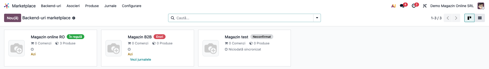

### Pasul 2 — Obiectele sincronizate

Deschideți backend-ul **Magazin online RO**. Tab-ul **Obiecte** are câte un card pe tip de date.
Pe fiecare card:
- numărul de înregistrări legate (clic pe el deschide lista);
- insignele de flux:
  - **Import** (+preț, +stoc) — datele pot veni din magazin;
  - **Export automat** — o modificare salvată în Odoo pleacă imediat spre magazin (**Activ la
    scriere** bifat);
  - **Export manual** — exportul se face doar la cerere;
- regula de import, în cuvinte: *Creează și actualizează în Odoo*, *Creează în Odoo, fără
  actualizări*, *Actualizează în Odoo, fără înregistrări noi* sau *Fără creare sau actualizare în
  Odoo*. Pe demo, *Produse* nu are voie să creeze produse noi, iar *Stoc* nu scrie nimic în Odoo;
- datele ultimului import și export și, dacă e cazul, numărul de erori de la ultima rulare.

Butoanele din antet:
- **Testează conexiunea** — confirmă backend-ul (starea trece în *Confirmat*);
- **Importă datele de bază** — datele de referință ale platformei (taxe, țări etc., după conector);
- **Rulează joburile** — gândit să ruleze o dată coada; în versiunea actuală nu are efect (vezi
  limitările).

Butonul inteligent **Joburi** arată joburile de pe canalele proprii ale backend-ului.
**Furnizor** e platforma (pe demo „Fără”, adică niciun conector). Câmpul **Taxă** nu e folosit de
niciun conector.

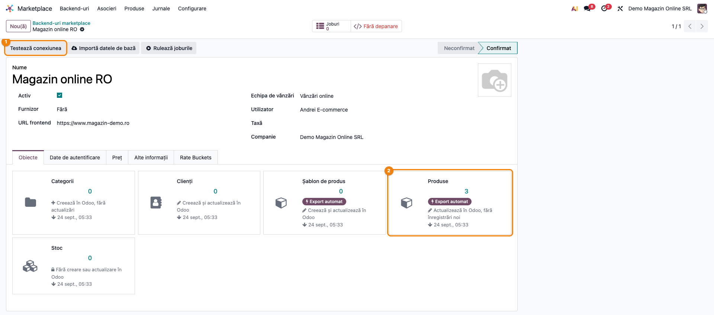

### Pasul 3 — Regula unui obiect

Din meniul ⋮ al cardului, **Editare** deschide regula obiectului:
- **Activ la scriere** — exportul automat la salvare, oprit implicit. Cu el oprit, nimic nu pleacă
  singur, dar exportul la cerere funcționează (butoanele cardului, asistentul de sincronizare).
  **Excepție la preț:** pe obiectul *Produse*, cu el oprit, nu pleacă prețul nici din butonul
  **Exportă prețul** al legăturii, nici din acțiunea programată *exportă prețul*, fără niciun mesaj.
  Prețul pleacă atunci doar din butonul de pe card sau din asistent;
- **Creează** / **Actualizare** — dacă importul poate crea înregistrări noi în Odoo și dacă poate
  modifica ce există. Cu **Actualizare** oprit, importul tot creează și reîmprospătează legăturile,
  dar nu scrie nimic pe înregistrarea Odoo. Cu **Creează** oprit pe *Produse*, o ofertă fără
  corespondent se leagă de **Produsul fictiv** al backend-ului. Fără produs fictiv, importul eșuează
  (vezi secțiunea 9);
- **Use Webhook** și **Legătură webhook** — adresa la care magazinul trimite notificările pentru
  acest obiect, construită din tokenul de securitate al backend-ului;
- câmpuri tehnice (doar administratorii tehnici le văd):
  - **Domeniu** — restrânge exportul la un subset;
  - **Câmpuri ignorate la import** — câmpuri pe care magazinul nu le poate scrie în Odoo (de
    exemplu categoria produsului, care în Odoo decide contabilitatea stocului);
  - **Câmpuri ignorate la export** și **Câmpuri relevante pentru export**.

Din același meniu: **Valori implicite**, **Vezi jurnalele** și acțiunile de import / export
disponibile pentru conectorul respectiv.

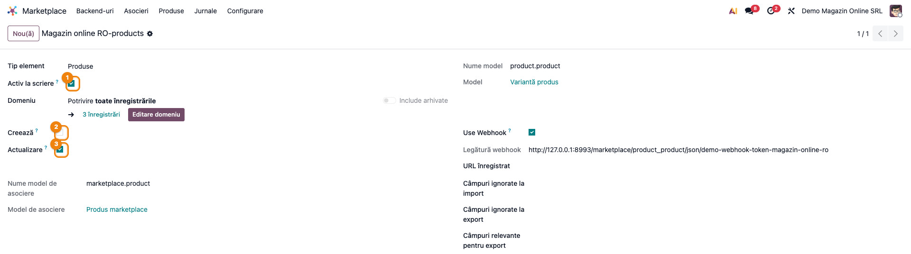

### Pasul 4 — Datele de acces și webhook-ul

Tab-ul **Date de autentificare**:
- **Locație** — adresa API a magazinului (conectorul o completează din furnizor);
- **Tip acces** — utilizator și parolă sau *client_id* și *client_secret*, după platformă;
- **Token de acces** și **Token site web** — completate de conector sau de platformă, după caz;
- **Token de securitate** și **Tip webhook** — pentru notificările trimise de magazin spre Odoo.

Parolele, cheile și tokenurile de acces sunt afișate mascat. **Tokenul de securitate** al
webhook-ului rămâne vizibil, ca să poată fi copiat în magazin.

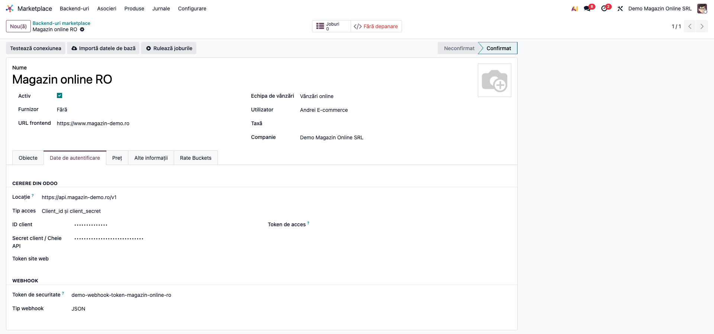

### Pasul 5 — Politica de preț

Tab-ul **Preț** decide, o dată pe magazin:
- **Listă de prețuri** — de unde vine prețul exportat. Goală: se trimite prețul de vânzare al
  produsului. Cu o listă, fiecare magazin poate avea alt preț, fără produse duplicate.
- **Preț per produs** — cu o listă de prețuri setată, prețul venit din magazin se scrie ca linie cu
  preț fix pe variantă, în listă. Dacă obiectul *Produse* are și **Actualizare** pornit, importul
  scrie prețul **și** pe produs, deci setarea nu protejează singură prețul de vânzare. Pentru asta,
  folosiți **Ignoră prețul** sau **Actualizare** oprit.
- **Ignoră prețul** — refuză orice preț venit din magazin (câștigă peste orice altă setare).
- **Actualizează doar prețul** — aduce din magazin doar prețul, pe un produs pe care Odoo altfel
  nu l-ar modifica (Odoo deține datele produsului, magazinul deține prețul).
- **Monedă** — moneda prețurilor din magazin.

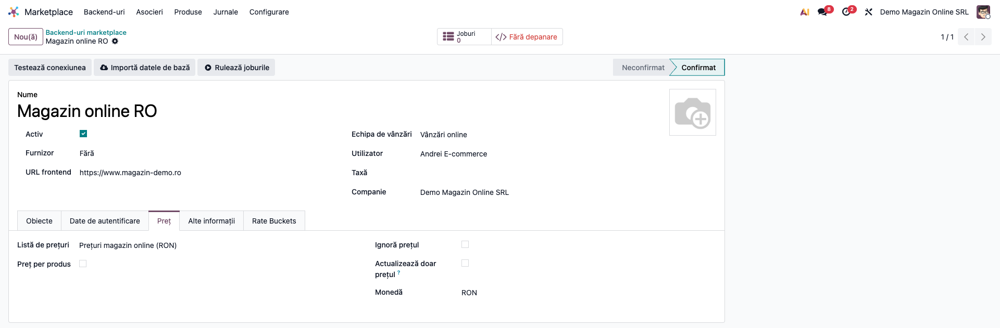

### Pasul 6 — Stoc, produse, parteneri și coadă

Tab-ul **Alte informații** grupează restul regulilor:
- **Limite** — **Elemente pe pagină** la import; **Doar cele lipsă** (implicit bifat): la reimport
  se sar înregistrările deja legate.
- **Produse**:
  - **Folosește categoriile** / **Folosește variantele** — dacă se preiau categoriile și variantele
    magazinului;
  - **Potrivire strictă a variantei** — produsul din magazin se leagă doar după cod de bare sau
    referință internă exacte. Fără ea, ultima soluție e potrivirea după nume, care poate lega o ofertă
    de o variantă greșită. Recomandat bifat înainte de primul import;
  - **Refuse barcode/SKU conflicts on import** (netradus) — importul eșuează explicit în loc să
    lege două oferte de același produs;
  - **Ignoră imaginea**;
  - **Partajează produsul** — produsele importate nu primesc companie (multi-companie).
- **Stoc**:
  - **Poate trimite stocul** — comutatorul principal. Fără el, niciun stoc nu pleacă spre magazin;
  - **Nivel de stoc** — pe variantă sau pe șablon, după cum ține magazinul stocul;
  - **Stoc disponibil** — ce cantitate se trimite: liberă (în stoc minus rezervat, implicit), în
    stoc, prognozată, nelimitat (999) sau „zero sau nelimitat”. În RO, prima și a doua opțiune au
    aceeași etichetă, „Cantitate disponibilă” (vezi limitările);
  - **Stock Locations** (netradus) — locațiile adunate. Goală = stocul tuturor depozitelor
    companiilor la care are acces utilizatorul care rulează exportul (la acțiunea programată,
    toate). În multi-companie, completați-o explicit;
  - **Include stocul furnizorului** — adaugă stocul furnizorilor;
  - **Scade ofertele active** — scade cantitățile din ofertele de vânzare neconfirmate, doar cu
    **Nivel de stoc** = variantă.

  Stocul negativ se trimite ca 0.
- **Parteneri**:
  - **Actualizează partenerul după codul fiscal** — clientul existent cu același CUI e actualizat;
  - **Păstrează adresa contactului** — la reimport nu se suprascrie adresa unui contact existent,
    se creează un contact nou pentru adresa diferită. Documentele emise își păstrează adresa;
  - **Email unic**.
- **Valori implicite**:
  - **Categorie implicită** — categoria primită de produsele **noi** create de import fără categorie.
    La reimport, categoria unui produs nu se rescrie doar dacă e chiar aceasta. Nu leagă categoriile
    magazinului de ea. Ca să oprească schimbarea categoriei produselor existente, debifați
    **Folosește categoriile** sau adăugați `categ_id` la **Câmpuri ignorate la import**;
  - **Produs fictiv** — produsul de care se leagă ofertele fără corespondent, când importul nu are
    voie să creeze produse;
  - **Produs pentru comision** (*Fee Product*) — în ciuda etichetei, nu e comisionul platformei. E
    produsul cu care conectorul WooCommerce adaugă pe **comanda clientului** taxele sau suprataxele
    din magazin (facturate clientului, deci venit). Comisionul platformei vine pe factura de furnizor
    a platformei: Dr 622 + Dr 4426 = Cr 401.
- **Coadă** — canalele de intrare și de ieșire ale backend-ului, create automat.
- **Limba** — limba în care se trimit și se citesc textele produselor.
- **Webhook cu job** — în versiunea actuală nu are efect: niciun cod nu citește câmpul.
- **Rate Limit** — numărul maxim de cereri pe secundă, minut, oră sau zi, pentru platformele care
  limitează API-ul. Tab-ul **Rate Buckets** apare doar cu limitarea activă, cea implicită.

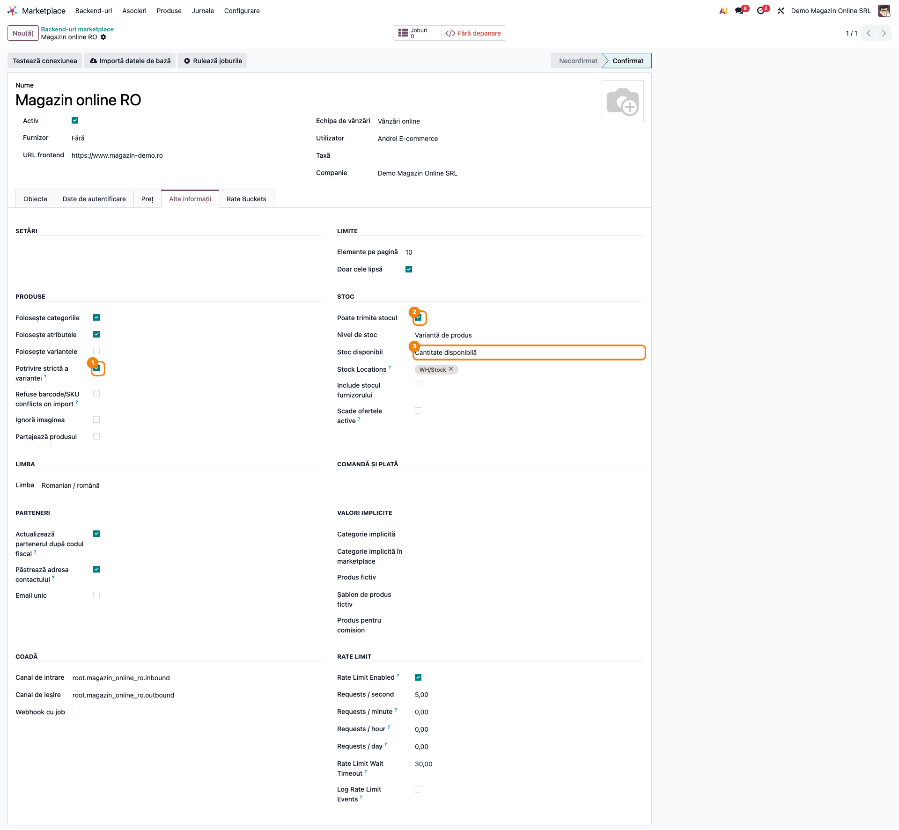

### Pasul 7 — Legăturile produselor și diferențele de stoc și preț

Deschideți backend-ul, tab-ul **Obiecte**, și apăsați pe numărul de pe cardul **Produse**: se
deschide lista legăturilor pe variantă. Meniul *Marketplace → Asocieri → Produse* deschide lista
legăturilor pe **șablon**. Lista pe variantă nu are meniu propriu (vezi limitările).

1. **Găsiți pe ecran** — fiecare rând e o legătură: **Produs Odoo**, **ID extern** și codul din
   magazin (eticheta RO e „Cod stoc”), iar în coloanele opționale (⇄) **Stoc Odoo** / **Stoc extern**
   și **Preț Odoo** / **Preț extern**.
2. **Verificați** — filtrele **Stoc nesincronizat** și **Preț nesincronizat** arată doar
   produsele la care Odoo diferă de ultima valoare trimisă. Pe demo: **Căști wireless** are stoc
   Odoo 25 față de 30 în magazin, iar **Husă telefon** are prețul Odoo 45,00 (din lista de prețuri
   a backend-ului) față de 49,00 în magazin.
3. **Treceți mai departe** — din antetul listei, după selecție: **Exportă stocul**, **Exportă
   prețul**, **Importă stocul**, **Reimportă**. Peste **Elemente pe pagină** (implicit 10) produse,
   exportul se împarte în joburi în fundal. Sub prag, rulează imediat, în cererea utilizatorului.

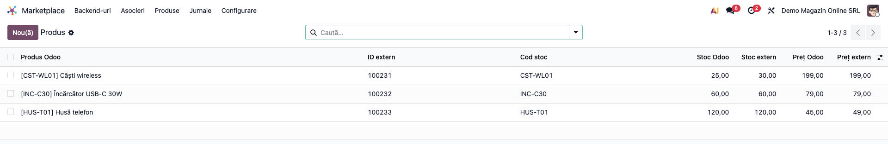

### Pasul 8 — Fișa unei legături

Deschideți o legătură. Fișa arată:
- produsul Odoo, ID-ul extern și codul extern;
- **Stoc Odoo** față de **Stoc extern** și **Preț Odoo** față de **Preț extern**;
- linkul spre produs în magazin (dacă conectorul îl oferă);
- butoanele **Reimportă**, **Exportă stocul**, **Importă stocul**, **Exportă prețul** și
  **Jurnale** (istoricul operațiunilor pe această legătură).

**Atenție la câmpurile editabile:**
- **Preț Odoo** nu e un câmp al legăturii. Modificarea lui rescrie **prețul de vânzare al
  produsului** sau, cu listă de prețuri și **Preț per produs**, linia din lista de prețuri a
  backend-ului. Dacă varianta nu are linie proprie, se rescrie linia de **șablon** găsită în listă,
  deci prețul tuturor variantelor. Apoi declanșează exportul de preț.
- Cu listă de prețuri fără **Preț per produs** (ca pe demo), modificarea scrie prețul de vânzare, dar
  valoarea afișată rămâne cea din listă. Pare că nu s-a aplicat, deși prețul de vânzare s-a schimbat.
- **Nume** e numele produsului Odoo: modificarea lui redenumește produsul.

Butonul **Produs** deschide produsul Odoo.

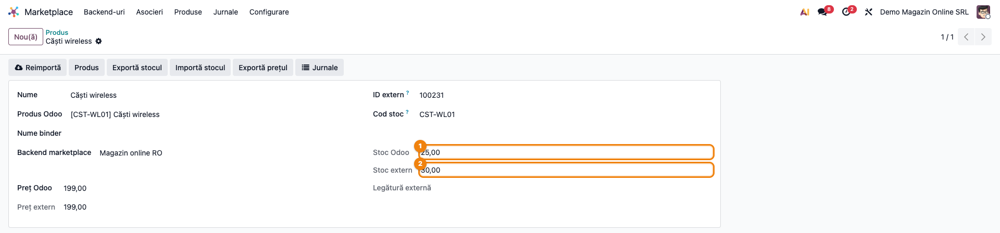

### Pasul 9 — Exportul la cerere al unui produs

Pe formularul produsului, **⚙ Acțiuni → Sincronizare marketplace** deschide asistentul:
- **Backend** — magazinul (implicit primul backend găsit; verificați-l);
- **Direcție** — *Export* sau *Import*;
- **Mod de actualizare** (doar la export) — *Tot*, *Stoc* sau *Preț*.

**Sincronizează** trimite imediat produsul, indiferent de **Activ la scriere** și de acțiunile
programate. E soluția pentru un produs urgent între două rulări, cu două condiții:
- **stocul** pleacă doar dacă backend-ul are **Poate trimite stocul** bifat;
- **prețul** (moduri *Preț* și *Tot*) pleacă doar din formularul **șablonului** de produs, nu din cel
  al variantei, și doar dacă diferă de ultimul preț trimis (*Preț nesincronizat*).

Implicit, modul e *Stoc*.

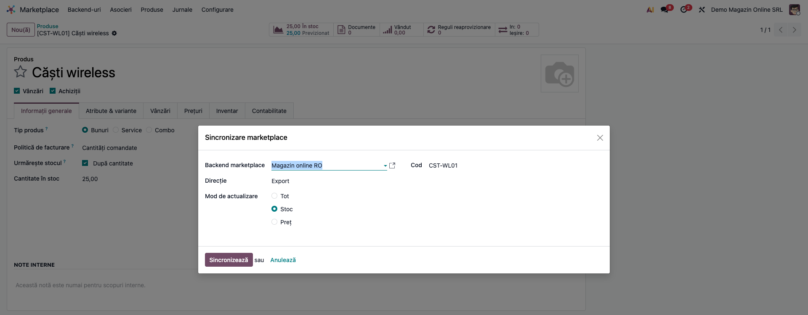

### Pasul 10 — Maparea TVA

Accesați **Marketplace → Asocieri → TVA**. Fiecare rând leagă o cotă din magazin (identificată prin
ID-ul ei extern, vizibil în formularul mapării) de o taxă de vânzare Odoo (**TVA Odoo**). Tabela e completată de conector la
importul datelor de bază și servește ca referință. TVA-ul comenzilor vine din taxele produselor și
din pozițiile fiscale (secțiunea 2).

1. **Găsiți pe ecran** — backend-ul și taxa Odoo legată de fiecare cotă.
2. **Verificați**:
   - fiecare cotă e legată de taxa de vânzare RO cu aceeași valoare **și exigibilitate normală**
     (nu TVA la încasare): *G* pentru bunuri, *S* pentru servicii (pe demo, „21% G” și „11% G”).
     La 21 %, planul RO are trei taxe de vânzare, iar importul o alege pe prima găsită după valoare;
   - nicio taxă nu a fost creată de import în afara planului de conturi (pasul 5 din configurare).

**Atenție:** coloana **Nume taxa** este numele **taxei Odoo** (maparea o moștenește). Editarea lui
aici redenumește taxa folosită pe facturi.

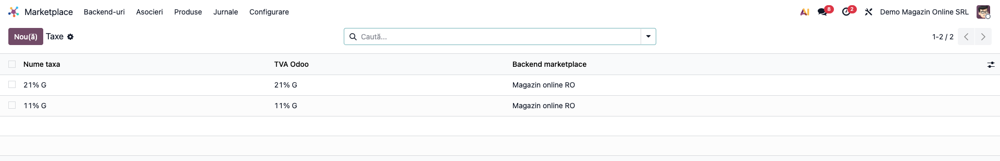

### Pasul 11 — Jurnalul operațiunilor

Accesați **Marketplace → Jurnale**. Fiecare rând e o operațiune (stoc, preț, import, export,
webhook, limitare), cu backend-ul, înregistrarea, starea și mesajul. Erorile sunt în roșu,
succesele în verde, iar erorile rezolvate la o reîncercare ulterioară apar estompate.

1. **Găsiți pe ecran** — filtrați pe **Eroare** și grupați pe **Backend** sau **Operațiune**.
2. **Verificați** — fiecare eroare are înregistrarea afectată și mesajul platformei. Jobul eșuat
   lasă urmă aici chiar dacă conectorul nu a scris-o explicit. **Excepție:** o eroare a
   conectorului la exportul de stoc pe variantă e doar scrisă în logul serverului, iar jobul se
   termină *Efectuat*. Verificați de aceea și filtrul **Stoc nesincronizat** (pasul 7).
3. **Treceți mai departe** — corectați cauza (de exemplu codul de bare lipsă) și rerulați exportul
   de pe legătură sau jobul din coadă.

Jurnalul se curăță automat după 90 de zile (parametrul `marketplace.log.retention_days`).

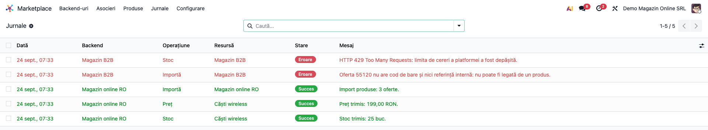

### Pasul 12 — Acțiunile programate

Accesați **Marketplace → Configurare → Acțiuni programate**. Lista arată doar acțiunile
marketplace (active și inactive). La o instalare nouă, toate sunt **inactive**. Activați-le și
setați intervalul după cât de repede se mișcă stocul, abia după ce importul a fost verificat.

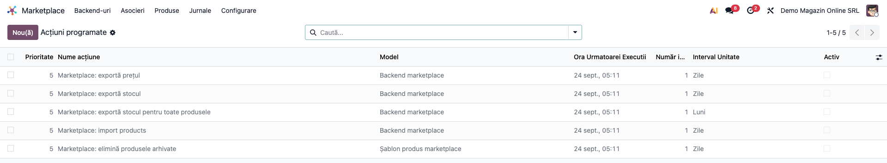

### Note de monografie și raportare

Modulul **nu generează note contabile**. Contabilitatea apare în fluxurile conectorilor:
- comenzile importate devin comenzi de vânzare Odoo, facturate standard, cu TVA-ul din taxele
  produselor și din poziția fiscală a comenzii (la facturare: Dr 4111 = Cr 70x + Cr 4427);
- comisionul platformei vine pe factura de furnizor a platformei: Dr 622 + Dr 4426 = Cr 401. Nu
  folosește **Produsul pentru comision**, care adaugă taxele magazinului pe comanda clientului.

## 7. Legături cu alte module / declarații

| Modul / proces | Rol în flux | Tip legătură |
|---|---|---|
| `queue_job` | coada de joburi: rulare în fundal, reîncercări, canale per backend | dependență (manifest) |
| `sale`, `product`, `stock`, `account`, `base_address_extended` | produse, stoc, taxe, adrese | dependență (manifest) |
| `deltatech_marketplace_sale` | importul comenzilor (TVA din taxele produselor și poziția fiscală) | extensie |
| `deltatech_marketplace_emag`, `_shopify`, `_woocommerce`, `_prestashop`, `_magento`, `_trendyol`, `_merchantpro`, `_odoo`, `_doraly` | conectorii de platformă: apelurile API, pașii specifici | extensii (fișă proprie fiecare) |
| `deltatech_marketplace_delivery`, `_payment`, `_brand`, `_website`, `_extended` | livrare, plăți, mărci, site, câmpuri suplimentare | extensii |

**Ce e automat:**
- canalele de coadă și cardurile de obiecte la crearea backend-ului;
- calculul stocului și prețului de exportat și al diferențelor;
- declanșarea exportului de stoc la fiecare mișcare de stoc (cu acțiunea programată activă);
- reîncercarea joburilor eșuate;
- jurnalul;
- starea de sănătate;
- curățarea jurnalului vechi.

**Ce rămâne manual:**
- configurarea backend-ului și a regulilor pe obiecte;
- taxele produselor și pozițiile fiscale; verificarea taxelor create de importul datelor de bază;
- activarea acțiunilor programate;
- rularea runner-ului de joburi pe server;
- urmărirea erorilor din jurnal și din joburi.

## 8. Verificări pentru consultant

- [ ] Meniul *Marketplace* e vizibil doar utilizatorilor cu **Administrator marketplace**.
- [ ] Un backend nou are, fără altă acțiune, canalele de coadă generate (tab-ul *Alte informații*,
      grupul *Coadă*).
- [ ] Starea de sănătate trece din *Neconfirmat* în *Avertismente* după **Testează conexiunea**
      și în *În regulă* după prima sincronizare fără erori.
- [ ] O eroare în jurnal în ultimele 24 de ore trece backend-ul în *Erori* și afișează linkul
      **Vezi jurnalele** pe card.
- [ ] Cu **Activ la scriere** oprit, salvarea unui produs nu trimite nimic spre magazin.
- [ ] Cu **Actualizare** oprit pe obiectul *Produse*, reimportul nu modifică produsul Odoo, dar
      legătura rămâne.
- [ ] **Poate trimite stocul** debifat oprește orice export de stoc pentru acel backend.
- [ ] **Stoc Odoo** pe legătură respectă **Stoc disponibil** și **Stock Locations**, iar stocul
      negativ apare ca 0.
- [ ] Filtrul **Stoc nesincronizat** arată pe demo doar **Căști wireless**, iar **Preț nesincronizat**
      doar **Husă telefon** (45,00 din lista de prețuri față de 49,00 în magazin).
- [ ] Fiecare produs legat are taxa de vânzare corectă (21 % / 11 %), iar pozițiile fiscale (OSS,
      UE, export) sunt configurate.
- [ ] După **Importă datele de bază**, nu există taxe noi create de import fără cont 4427 și fără
      etichete D300.
- [ ] Cu **Activ la scriere** oprit pe *Produse*, butonul **Exportă prețul** al legăturii nu trimite
      nimic; prețul pleacă din butonul cardului sau din asistent.
- [ ] Acțiunile programate sunt inactive la instalare și sunt activate abia după verificarea
      importului.
- [ ] Runner-ul de joburi rulează: un job nou trece din *În așteptare* în *Efectuat* (fără să
      depindeți de butonul **Rulează joburile**).

## 9. Mesaje de eroare frecvente

| Mesaj / simptom | Cauză probabilă | Remediere |
|---|---|---|
| „You are not allowed to access 'Job Channels' (queue.job.channel) records” la crearea unui backend | Utilizatorul nu are grupul **Job Queue Manager** | Adăugați grupul *Job Queue Manager* din *Setări → Utilizatori* |
| Joburile rămân *În așteptare* | Runner-ul `queue_job` nu rulează pe server | Porniți Odoo cu `queue_job` în `server_wide_modules` și workeri, sau instalați `queue_job_cron_jobrunner` (butonul **Rulează joburile** nu are efect) |
| „Can not create product for … Please set a default product.” la import | **Creează** oprit pe *Produse* și niciun **Produs fictiv** pe backend | Setați **Produs fictiv** (*Alte informații → Valori implicite*) sau permiteți crearea |
| Factură cu TVA greșit pe o comandă importată | Taxa de vânzare a produsului sau poziția fiscală greșită; sau o taxă creată de importul datelor de bază | Corectați taxa pe produs și poziția fiscală; legați taxa creată de import de taxa RO |
| Stocul nu ajunge niciodată în magazin | **Poate trimite stocul** debifat sau acțiunea *Marketplace: exportă stocul* inactivă | Bifați comutatorul pe backend și activați acțiunea programată |
| Prețul nu se exportă automat, nici din butonul legăturii | Acțiunea *Marketplace: exportă prețul* inactivă sau **Activ la scriere** oprit pe obiectul *Produse* | Activați-le; sau exportați din butonul cardului ori din **Sincronizare marketplace**, pe formularul șablonului |
| Tab-ul *Obiecte* e gol | Conectorul platformei nu e instalat, sau furnizorul e „Fără” | Instalați conectorul și alegeți furnizorul |
| Backend-ul arată *Erori* fără erori recente în jurnal | Joburi eșuate în coada backend-ului sau token expirat | Linkul **failed jobs** de pe card; reautentificați backend-ul |
| O ofertă din magazin legată de varianta greșită | Potrivire după nume (fără **Potrivire strictă a variantei**) | Bifați potrivirea strictă, completați codurile de bare / referințele identice cu magazinul și corectați legătura |
| Importul schimbă categoria produselor existente | Categoriile magazinului se leagă după nume de categorii Odoo | Debifați **Folosește categoriile** sau adăugați `categ_id` la **Câmpuri ignorate la import** (**Categorie implicită** nu oprește schimbarea) |
| Prețul de vânzare al produsului s-a schimbat „singur” | Cineva a editat **Preț Odoo** pe o legătură | Editați prețul pe produs sau în lista de prețuri, nu pe legătură |

## 10. Capturi de ecran

Capturile (`readme/screenshots/`) se generează automat din `tests/test_screenshots.py`, cu mixinul
`ScreenshotCase` din `l10n_ro_doc_screenshots` (import defensiv). Sunt în **limba română**, pe
compania **Demo Magazin Online SRL**, cu planul de conturi RO și datele demo din secțiunea 4.
Backend-urile nu au conector (furnizor „Fără”), ca ecranele să arate doar baza comună. Cardurile de
obiecte sunt create de test, pentru că fără conector backend-ul nu își cere niciun obiect.

| # | Fișier | Conținut |
|---|---|---|
| 1 | `01_backenduri_sanatate.png` | Backend-urile, cu stările *În regulă*, *Erori* și *Neconfirmat* |
| 2 | `02_backend_obiecte.png` | Backend-ul, tab-ul **Obiecte** |
| 3 | `03_regula_obiect.png` | Regula obiectului *Produse* |
| 4 | `04_date_autentificare.png` | Tab-ul **Date de autentificare** |
| 5 | `05_politica_pret.png` | Tab-ul **Preț** |
| 6 | `06_alte_informatii.png` | Tab-ul **Alte informații** |
| 7 | `07_legaturi_produse.png` | Legăturile variantelor, cu stocul și prețul din Odoo față de magazin |
| 8 | `08_fisa_legatura.png` | Fișa legăturii **Căști wireless** |
| 9 | `09_sincronizare_produs.png` | Asistentul **Sincronizare marketplace** |
| 10 | `10_mapare_tva.png` | Maparea TVA |
| 11 | `11_jurnal.png` | Jurnalul operațiunilor |
| 12 | `12_actiuni_programate.png` | Acțiunile programate marketplace |

Regenerare:

```bash
./odoo/odoo-bin -c odoo.conf -d <db> -i deltatech_marketplace,l10n_ro,l10n_ro_doc_screenshots \
    --test-tags=fise_screenshots --stop-after-init --http-port=8987 --gevent-port=8988
```

## 11. Observații pentru manual

Păstrați ordinea de punere în funcțiune:
1. runner-ul de joburi pe server;
2. backend-ul și **Testează conexiunea**;
3. datele de bază și maparea TVA;
4. regulile pe obiecte (**Actualizare** oprit la primul import de produse, **Potrivire strictă a
   variantei** bifată);
5. primul import și verificarea legăturilor;
6. abia apoi exportul: **Poate trimite stocul**, **Activ la scriere**, acțiunile programate.

Principiul de subliniat: *importă, verifică ce a intrat, abia apoi lasă Odoo să trimită*. Pentru
pașii specifici fiecărei platforme, trimiteți la fișa conectorului.

### Limitări cunoscute

- **Traduceri RO ambigue:**
  - **Furnizor** e traducerea lui *Provider* (platforma magazinului), nu un furnizor de marfă;
  - la **Stoc disponibil**, opțiunile *Free Quantity* și *Quantity Available* au aceeași etichetă,
    „Cantitate disponibilă”. Prima e stocul liber (fără rezervări), a doua stocul fizic;
  - câteva etichete au rămas în engleză: **Stock Locations** (locațiile de stoc), **Refuse
    barcode/SKU conflicts on import**, **Use Webhook**, tab-ul **Rate Buckets**, grupul **Rate
    Limit** cu toate câmpurile lui și acțiunea programată *Marketplace: import products*;
  - antetul mapării TVA e „Nume taxa”, fără diacritice;
  - codul extern al legăturii apare ca „Cod stoc”, iar pe legătură apare eticheta tehnică „Nume
    binder”;
  - *Fee Product* e tradus „Produs pentru comision”, deși nu e comisionul platformei (pasul 6).
- **Preț Odoo** pe legătură e editabil și rescrie prețul produsului sau lista de prețuri (pasul 8).
- **Exportul automat de stoc** depinde de acțiunea programată *Marketplace: exportă stocul*: mișcările
  de stoc o declanșează, dar dacă e inactivă nu se trimite nimic.
- **Asistentul de sincronizare** propune primul backend găsit, nu neapărat pe cel dorit, când
  există mai multe.
- **Lista legăturilor pe variantă nu are meniu.** Meniul „Products Variant” de sub *Asocieri* e
  suprascris de un al doilea meniu cu același identificator (`menu_marketplace_product`, folosit și
  pentru *Marketplace → Produse*), deci nu apare. Lista se deschide din cardul **Produse** al
  backend-ului. Documentația tehnică a modulului (`USAGE.md`) trimite încă la meniul inexistent.
- **Butonul Rulează joburile nu are efect:** codul verifică un atribut care nu există
  (`_job_runners`), deci nu pornește nimic. Folosiți un worker `queue_job` sau
  `queue_job_cron_jobrunner`.
- **Maparea TVA nu decide TVA-ul comenzilor**, iar câmpurile **Taxă** și **Webhook cu job** ale
  backend-ului nu sunt folosite de niciun cod.
  Importul datelor de bază poate crea taxe noi fără conturi și etichete RO (configurare, pasul 5).
- **Numele din maparea TVA și de pe legătura de produs** sunt numele înregistrărilor Odoo
  (taxă, respectiv produs): editarea lor le redenumește.
- **Exportul de preț cu Activ la scriere oprit** e blocat tăcut pe butonul legăturii și pe
  acțiunea programată (pasul 3).
- **Erorile de export de stoc pe variantă** ajung doar în logul serverului, nu în jurnal (pasul 11).
- **Crearea unui backend cere și grupul Job Queue Manager.** La creare se generează canalele de
  coadă ale backend-ului, iar un utilizator doar cu **Administrator marketplace** primește eroarea
  de acces „You are not allowed to access 'Job Channels' (queue.job.channel) records”. Dați
  consultantului și grupul *Job Queue Manager*.
- **Joburile eșuate** din starea de sănătate includ întotdeauna și canalele comune ale
  marketplace-ului. Un job eșuat pe un canal comun trece deci pe *Erori* toate backend-urile, nu doar
  pe cel vinovat. Butonul **Joburi** numără însă doar canalele proprii, deci cele două cifre pot
  diferi.
