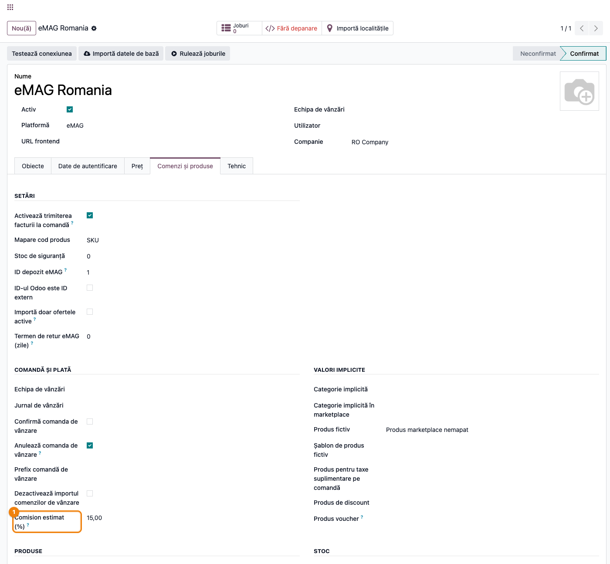
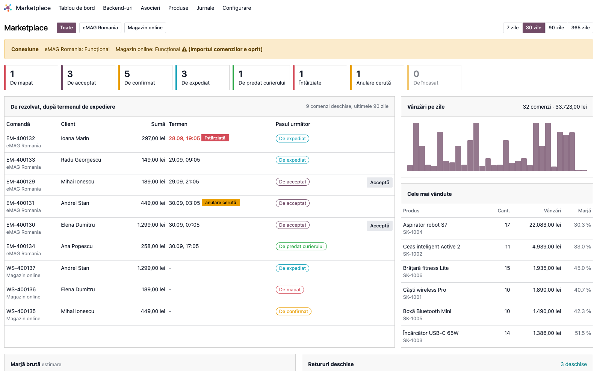
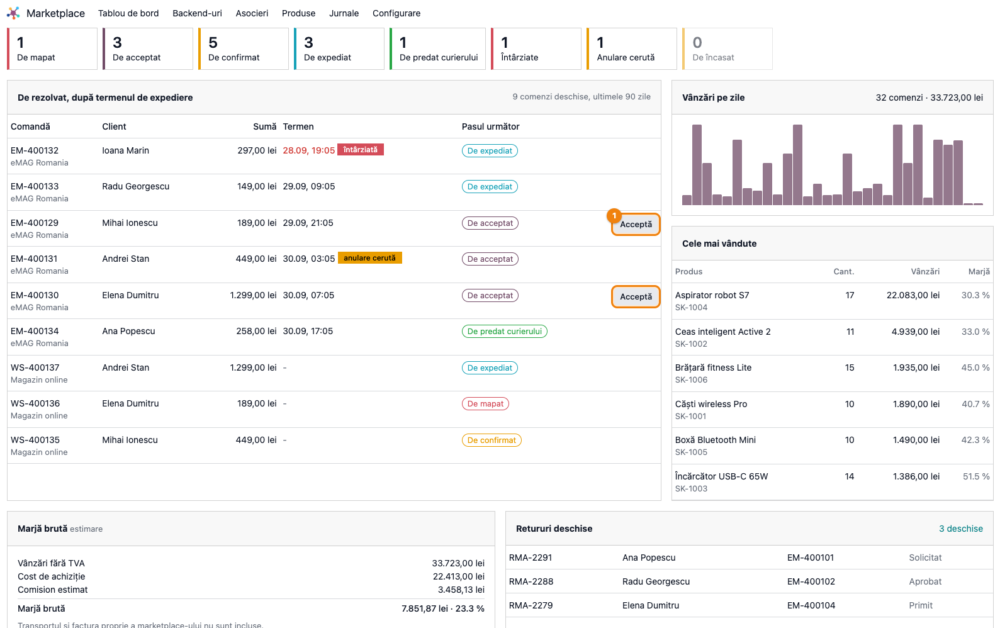
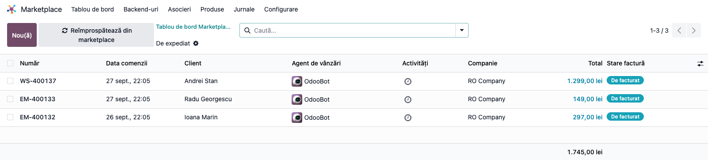
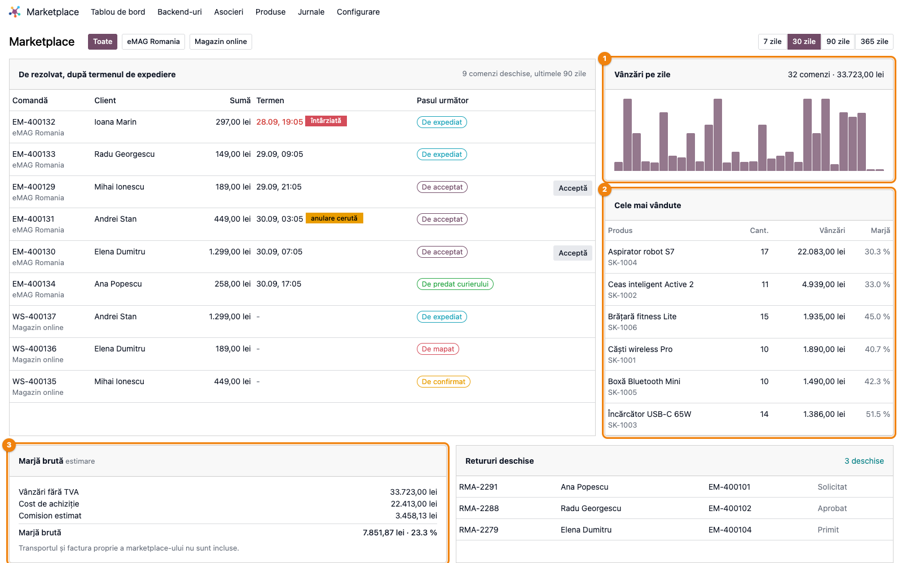
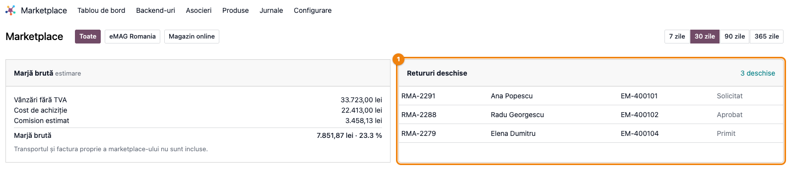

# Fișă Modul: Tablou de bord Marketplace — ce e de făcut, cum merg vânzările, ce marjă rămâne

**Modul:** `deltatech_marketplace_dashboard`
**Utilizator principal:** Operator e-commerce (lucrul de zi cu zi), manager de vânzări online (vânzări și marjă)
**Prioritate:** 🟡 Medie (nu schimbă fluxul comenzilor, dar e primul ecran deschis dimineața la clienții cu mai multe marketplace-uri)

---

## 1. Scop business

Un magazin care vinde pe eMAG, Trendyol, Shopify sau PrestaShop are comenzile împrăștiate pe mai
multe backend-uri. Fiecare backend are propria listă și propriul indicator de sănătate, dar nimeni
nu vede dintr-o privire *ce comandă expiră prima*. Tabloul de bord adună totul într-un singur ecran
și răspunde la trei întrebări, în ordinea în care contează dimineața:

1. **Ce am de făcut acum?** Starea legăturii cu fiecare marketplace, contoarele pe pași (de mapat,
   de acceptat, de confirmat, de expediat, de predat, întârziate, cu cerere de anulare, de încasat)
   și lista comenzilor deschise, ordonată după termenul de expediere dat de marketplace.
2. **Cum merg vânzările?** Vânzările pe zi și cele mai vândute produse, pe 7, 30, 90 sau 365 de zile.
3. **Câștig ceva?** Marja brută estimată: vânzări fără TVA − cost de achiziție − comisionul estimat
   al marketplace-ului.

Ideea vine din tabloul conectorului eMAG scris de Alexandru Grecu pentru MD Trade Concept SRL. Aici
e rescris ca ecran comun pentru toți conectorii din suită.

## 2. Arhitectură tehnică și context

Nu există o bază legală specifică: modulul nu generează documente și nici note contabile. E un
ecran de lucru peste comenzile importate din marketplace-uri.

- **Un singur apel la deschidere.** Tot ce depinde de volum (contoarele, vânzările pe zi, produsele,
  marja) se numără în baza de date. În memorie se citesc doar comenzile listei „De rezolvat”, cel
  mult 30 de rânduri. Pentru a le alege, fiecare pas citește cel mult 200 de comenzi. Totalul
  comenzilor deschise se numără însă în baza de date, fără limită. La peste 200 de comenzi deschise
  pe un singur pas, lista poate lăsa pe dinafară câteva comenzi cu termen apropiat: lucrați atunci
  din contorul pasului, care deschide toate comenzile.
- **Contorul și lista pe care o deschide au același filtru.** Numărul afișat și comenzile deschise
  la clic vin din aceeași regulă, deci nu pot diferi.
- **Fereastra comenzilor deschise.** Lista „De rezolvat” și contoarele ei iau în calcul doar
  comenzile plasate în ultimele **90 de zile** (parametrul de sistem
  `deltatech_marketplace_dashboard.worklist_days`). O comandă neexpediată de anul trecut e o problemă
  de date, nu treaba de azi.
- **Pașii specifici unui marketplace îi adaugă conectorul lui.** Modulul de bază al comenzilor de
  marketplace (`deltatech_marketplace_sale`) are patru puncte de extensie goale. Conectorul eMAG le
  completează cu pasul „De acceptat” (cu butonul *Acceptă* pe rând), cu „Întârziate” și cu „Cerere de anulare”.
  Nu există nicio dependență inversă și nicio instalare automată la clienți.
- **Valuta.** Vânzările, produsele și marja se convertesc în moneda companiei la cursul zilei. Suma
  de pe fiecare rând al listei rămâne în moneda comenzii.

## 3. Utilizatori și roluri

- **Operator e-commerce:** lucrează lista „De rezolvat” de sus în jos, acceptă comenzile eMAG direct
  din tablou și deschide contoarele cu probleme (întârziate, de mapat).
- **Manager de vânzări online:** urmărește vânzările pe zi, cele mai vândute produse și marja
  estimată pe perioadă și pe backend.
- **Consultant:** setează comisionul estimat pe fiecare backend și verifică dacă produsele vândute
  au cost.

Acces:
- Meniul **Marketplace → Tablou de bord** și ecranul sunt disponibile doar grupului **Administrator
  marketplace**. Un alt utilizator primește eroarea de acces din §9, chiar dacă apelează ecranul direct.
- **Costul de achiziție și marja** apar doar utilizatorilor care au voie să vadă costul produsului.
  Dacă firma a restrâns câmpul de cost la un grup, tabloul respectă restricția și ascunde marja și
  coloana de marjă din lista produselor.

Roluri recomandate la testare:
- un utilizator **Administrator marketplace** cu drept de a vedea costul (ecranul complet);
- un utilizator **Administrator marketplace** fără acest drept (fără marjă);
- un utilizator intern fără grupul Administrator marketplace (acces refuzat).

## 4. Date și mapări implicate

Modulul nu generează note contabile Dr/Cr (vezi §6, „Note de monografie și raportare”). Datele
folosite:

- **Comenzile de marketplace** și comenzile de vânzare legate de ele: starea, data, suma, transferul
  de livrare și referința AWB.
- **Facturile client** ale comenzilor, pentru contorul „De încasat” (facturi validate, neachitate
  sau achitate parțial).
- **Costul produsului** (prețul de cost de pe fișa produsului), pentru marjă.
- **Comisionul estimat (%)** pe fiecare backend, câmp nou adăugat de modul.
- **Produsul fictiv** al backend-ului: o linie de comandă pe acest produs înseamnă un
  produs vândut pe marketplace pe care Odoo nu l-a putut identifica, deci o comandă „De mapat”.
- **Cererile de retur** ale marketplace-urilor, în stările *Solicitat* / *Aprobat* / *Primit*.
- **Doar pe eMAG:** termenul maxim de expediere și cererea de anulare, citite odată cu comanda de la
  conectorul eMAG (din versiunea 19.0.2.13.0 a acestuia).

Date minime pentru demo:
- un backend eMAG și încă un backend (de exemplu Shopify);
- câteva comenzi în fiecare pas: una nouă pe eMAG, una de confirmat, una de expediat, una cu AWB
  nepredată, una întârziată, una cu cerere de anulare;
- o comandă cu o linie pe produsul fictiv;
- o factură validată și neachitată;
- produse cu cost completat;
- o cerere de retur deschisă.

## 5. Configurare inițială

1. Instalați `deltatech_marketplace_dashboard`. Depinde doar de `deltatech_marketplace_sale`. Pentru
   pașii eMAG, conectorul `deltatech_marketplace_emag` trebuie să fie la versiunea 19.0.2.13.0 sau
   mai nouă.
2. Dați grupul **Administrator marketplace** utilizatorilor care vor lucra din tablou. Pentru marjă, aceștia
   trebuie să aibă și dreptul de a vedea costul produsului.
3. Pe fiecare backend, **Marketplace → Backend-uri → (backend) → tab Comenzi și produse → grupul Comandă
   și plată**, completați **Estimated Commission (%)**, adică procentul reținut de marketplace din
   vânzările fără TVA (§6, Pasul 1). Lăsat pe 0, tabloul arată marja înainte de comision.
4. Opțional, în **Setări → Tehnic → Parametri de sistem**, schimbați
   `deltatech_marketplace_dashboard.worklist_days` (implicit 90) dacă firma are comenzi care durează
   legitim mai mult.
5. Verificați că produsele vândute au preț de cost. Fără el, marja iese umflată. Avertismentul apare doar
   dacă niciun produs vândut nu are cost; un produs fără cost se vede cu marja 100 % în *Cele mai vândute*
   (§6, Pasul 5).

## 6. Flux de utilizare

### Pasul 1 — Comisionul estimat pe backend

Deschideți **Marketplace → Backend-uri**, alegeți backend-ul și intrați pe tab-ul **Comenzi și
produse**. În grupul **Comandă și plată**, sub *Dezactivează importul comenzilor de vânzare*, completați
**Comision estimat (%)**, de exemplu 15 pentru eMAG.

Procentul se aplică pe vânzările fără TVA ale backend-ului și servește doar la estimarea marjei.
Comisionul real e pe factura pe care o emite marketplace-ul.



### Pasul 2 — Deschiderea tabloului și citirea benzii de conexiune

Deschideți **Marketplace → Tablou de bord**.

1. **Găsiți pe ecran:** sus, lista backend-urilor (*Toate* implicit) și perioada (7, 30, 90 sau 365
   de zile). Sub ele, **banda de conexiune**, cu starea fiecărui backend: *Funcțional*, *Avertizări*,
   *Erori* sau *Neconfirmat*. Backend-urile cu problemă apar primele.
2. **Verificați:**
   - niciun backend nu e pe *Erori*;
   - niciun backend nu are mențiunea *(importul comenzilor e oprit)*, scrisă îngroșat, cu semn de avertizare;
   - nu apare mesajul *Jobul de import al comenzilor e oprit*.

   Dacă apare oricare dintre ele, comenzile noi nu mai intră în Odoo. Lista „De rezolvat” de mai jos
   e atunci incompletă: rezolvați întâi legătura, din fișa backend-ului. Banda e verde doar când
   toate backend-urile sunt sănătoase și importă comenzi. Un backend cu importul dezactivat o face
   galbenă, ca în captură, chiar dacă legătura lui e *Funcțional*.
3. **Treceți mai departe** la contoare și la listă doar după ce ați citit fiecare mențiune din bandă.
   Un import dezactivat intenționat (de exemplu, un magazin închis temporar) e în regulă, dacă îl
   știți.



### Pasul 3 — Lista „De rezolvat”, după termenul de expediere

1. **Găsiți pe ecran** tabelul **De rezolvat, după termenul de expediere**, cu coloanele:
   - *Comandă*: numărul comenzii din Odoo, cu backend-ul dedesubt;
   - *Client*;
   - *Sumă*, în moneda comenzii;
   - *Termen*: termenul de expediere, cu etichetele *întârziată* (roșu) sau *anulare cerută*
     (galben). E completat doar pe eMAG; la ceilalți conectori apare „-”;
   - *Pasul următor*;
   - butonul pasului, acolo unde conectorul permite rularea din tablou.

   În dreapta titlului, mențiunea *N comenzi deschise, ultimele 90 zile* arată câte comenzi deschise sunt în
   total. Tabelul afișează cel mult 30 de rânduri.
2. **Verificați:**
   - comenzile sunt ordonate după termen: cea mai apropiată de expirare e prima;
   - comenzile fără termen (alte marketplace-uri decât eMAG) vin după, în ordinea datei;
   - o comandă cu *anulare cerută* **nu** are buton de pas.
3. **Treceți mai departe:**
   - un clic pe rând deschide comanda de vânzare;
   - pe eMAG, butonul **Acceptă** de pe rândurile *De acceptat* trimite la eMAG acceptarea comenzii
     (`/order/acknowledge`): comanda trece din *Nouă* în *În curs*. Mesajul *Gata: …* confirmă
     acceptarea, iar rândul trece la pasul următor.

   Dacă între timp comanda a fost acceptată din altă parte, butonul refuză a doua acceptare (§9).



Pașii, în ordinea în care îi primește o comandă deschisă:

| Pas | Când | Adăugat de |
| --- | --- | --- |
| De mapat | o linie e pe produsul fictiv al backend-ului | tablou |
| De acceptat | comandă nouă pe eMAG, încă neacceptată de vânzător | conectorul eMAG |
| De confirmat | ofertă sau ofertă trimisă | tablou |
| De expediat | confirmată, cu transfer de livrare fără AWB | tablou |
| De predat curierului | confirmată, cu AWB, transferul încă nevalidat | tablou |

### Pasul 4 — Un contor deschide exact comenzile numărate

1. **Găsiți pe ecran** rândul de contoare: câte unul pe fiecare pas din tabel, plus *Întârziate* și
   *Anulare cerută* (doar eMAG) și *De încasat*, adică comenzi cu factură validată și
   neîncasată.
2. **Verificați:** citiți contoarele ca liste separate, nu ca părți ale unui total. O comandă apare o
   singură dată în listă, la primul ei pas, dar e numărată în toate contoarele în care se încadrează.
   De exemplu, o comandă eMAG nouă e ofertă, deci e și *De acceptat*, și *De confirmat*. O comandă
   întârziată e și *Întârziate*, și *De expediat*. De aceea, în captură, contoarele însumează 13, iar lista are
   9 comenzi deschise.
3. **Treceți mai departe:** un clic pe un contor, de exemplu **De expediat**, deschide lista comenzilor
   de vânzare numărate, cu același filtru. Numărul de înregistrări din listă trebuie să fie egal cu
   cifra din contor.



### Pasul 5 — Vânzări, produse și marja brută

1. **Găsiți pe ecran**, în dreapta listei și sub ea:
   - **Vânzări pe zile**: barele pe zile pentru perioada aleasă, cu numărul de comenzi și suma la
     trecerea mouse-ului. Aici suma e totalul comenzilor, **cu TVA și transport**;
   - **Cele mai vândute**: primele 8 produse după vânzări, cu coloanele *Cant.*, *Vânzări* (fără TVA) și
     *Marjă*;
   - **Marjă brută**: *Vânzări fără TVA*, *Cost de achiziție*, *Comision estimat* (marcat
     *estimare*) și marja rezultată, în sumă și procent.
2. **Verificați:**
   - perioada selectată e cea dorită;
   - *Vânzări fără TVA* e fără TVA, fără transport și fără reduceri, de regulă mai mic decât totalul
     din *Vânzări pe zile*, care include TVA și transport, dar scade reducerile. În captură cele două cifre
     sunt egale doar pentru că datele demo nu au TVA;
   - reducerile și voucherele **nu** scad din *Vânzări fără TVA*: la magazinele cu promoții, marja
     afișată e mai mare decât cea reală;
   - *Comision estimat* = vânzările backend-ului × procentul din Pasul 1;
   - nu apare avertismentul *Produsele vândute nu au cost*. Atenție: el apare doar când
     **niciun** produs vândut nu are cost. Dacă doar o parte din produse nu au cost, marja iese umflată
     fără avertisment: verificați coloana *Marjă* din *Cele mai vândute*, unde un produs fără cost apare
     cu 100 %;
   - nota *Transportul și factura proprie a marketplace-ului nu sunt incluse* amintește că e o estimare,
     nu profitul final.
3. **Treceți mai departe:** schimbați perioada sau backend-ul din partea de sus. Tot ecranul se
   recalculează.



### Pasul 6 — Retururile deschise

1. **Găsiți pe ecran** panoul **Retururi deschise**: ultimele 10 cereri de retur în starea *Solicitat*, *Aprobat*
   sau *Primit*, cu numărul cererii, clientul, comanda și starea.
2. **Verificați:** legătura *N deschise* din dreapta titlului arată numărul total de retururi deschise
   ale backend-urilor alese.
3. **Treceți mai departe:** clicul pe *N deschise* deschide lista completă a cererilor de retur deschise.



### Note de monografie și raportare

Modulul **nu generează note contabile** și nu modifică documente, cu o singură excepție: butonul
**Acceptă** trimite acceptarea comenzii către eMAG, la fel ca acceptarea automată de la import (când
elementul de backend pentru comenzi are bifat *Activ la scriere*).

Cifrele sunt de gestiune, nu contabile:
- *Vânzări fără TVA* = suma liniilor comenzilor confirmate, fără TVA, fără transport și fără linii de
  reducere, convertită în moneda companiei;
- *Cost de achiziție* = cantitatea vândută × prețul de cost **actual** al produsului, nu costul din
  momentul vânzării;
- *Comision estimat* = vânzările backend-ului × procentul setat pe backend.

Notele contabile se generează în fluxul obișnuit, nu aici:
- vânzarea, la validarea facturii: 4111 = 707 + 4427;
- descărcarea din gestiune, la validarea livrării (inventar permanent): 607 = 371. Conturile sunt
  pentru mărfuri; un producător folosește 711 = 345, cu venitul în 701;
- factura de comision a marketplace-ului, la înregistrarea facturii furnizorului:
  - prestator stabilit în România (de exemplu eMAG): 622 + 4426 = 401;
  - prestator din UE sau din afara UE (de exemplu Shopify, iar Trendyol după caz): 622 = 401, plus
    autolichidarea TVA prin taxare inversă, 4426 = 4427 (Cod fiscal art. 307 alin. 2), cu rândurile
    corespunzătoare din D300 și, pentru UE, din D390. E cazul unei firme plătitoare de TVA; o firmă
    neplătitoare, înregistrată conform art. 317, plătește TVA-ul prin D301, fără drept de deducere.

## 7. Legături cu alte module / declarații

| Modul | Rol |
| --- | --- |
| `deltatech_marketplace_sale` | comenzile de marketplace, retururile și cele patru puncte de extensie ale tabloului |
| `deltatech_marketplace` | backend-urile, starea de sănătate a legăturii și grupul Administrator marketplace |
| `deltatech_marketplace_emag` | pașii eMAG: de acceptat (cu butonul *Acceptă*), întârziate, cerere de anulare, termenul de expediere |
| alți conectori (Trendyol, Shopify, PrestaShop...) | apar cu pașii comuni; pașii lor proprii se adaugă în modulul fiecăruia |

**Ce e automat:**
- contoarele, lista, vânzările și marja se recalculează la fiecare deschidere și la fiecare schimbare
  de backend sau perioadă;
- comenzile ies singure din listă când trec de ultimul pas.

**Ce rămâne manual:**
- comisionul estimat pe backend;
- costul produselor;
- lucrul propriu-zis pe comenzi: confirmare, AWB, predare, ca până acum.

## 8. Verificări pentru consultant

- [ ] Meniul **Marketplace → Tablou de bord** apare pentru un Administrator marketplace, iar pentru un utilizator
      fără grup ecranul refuză accesul.
- [ ] Banda de conexiune arată fiecare backend ales. Un backend în eroare apare primul, chiar dacă
      celelalte sunt sănătoase.
- [ ] Cu importul de comenzi dezactivat pe un backend, banda devine galbenă și arată lângă el, îngroșat, *(importul comenzilor
      e oprit)*.
- [ ] Cu jobul de import comenzi oprit, banda arată *Jobul de import al comenzilor e oprit*.
- [ ] Lista „De rezolvat” e ordonată după termenul de expediere. Comenzile fără termen vin după, în
      ordinea datei.
- [ ] O comandă eMAG cu cerere de anulare are eticheta *anulare cerută* și **nu** are buton de
      pas.
- [ ] Butonul **Acceptă** acceptă comanda, iar rândul trece la pasul următor. Deschideți tabloul
      în două taburi, acceptați comanda din primul, apoi apăsați butonul în al doilea: apare *Comanda … nu
      mai așteaptă acest pas.*
- [ ] Clicul pe fiecare contor deschide o listă cu exact atâtea comenzi câte arată contorul.
- [ ] Mențiunea *N comenzi deschise* din lista „De rezolvat” e numărul real de comenzi deschise, chiar
      când lista arată doar primele 30.
- [ ] O comandă plasată acum mai mult de 90 de zile (sau cât e setat în parametru) nu apare nici în
      listă, nici în contoare.
- [ ] *Comision estimat* = vânzările fără TVA ale backend-ului × procentul setat pe el.
- [ ] Un utilizator fără dreptul de a vedea costul nu vede marja și nici coloana de marjă din *Best
      sellers*.
- [ ] Vânzările unei comenzi în altă monedă apar convertite în moneda companiei (în *Vânzări pe zile*,
      *Cele mai vândute* și marjă), iar pe rândul din listă rămân în moneda comenzii.
- [ ] Un produs vândut fără cost apare cu marja 100 % în *Cele mai vândute*.
- [ ] Panoul *Retururi deschise* arată doar retururile în starea *Solicitat*, *Aprobat* sau *Primit*, cu starea scrisă în română.

## 9. Mesaje de eroare frecvente

| Mesaj | Cauză | Remediere |
| --- | --- | --- |
| *Doar un Manager Marketplace poate deschide tabloul de bord marketplace.* | utilizatorul nu are grupul Administrator marketplace | dați grupul din fișa utilizatorului |
| *Comanda … nu mai așteaptă acest pas.* | comanda a fost acceptată sau a trecut la alt pas între încărcarea ecranului și clic | reîncărcați tabloul; rândul arată pasul actual |
| *Clientul a cerut anularea comenzii ….* | clientul a cerut anularea pe eMAG după încărcarea ecranului | nu preluați comanda; tratați cererea de anulare din comanda eMAG |
| *Această acțiune nu poate fi rulată din tabloul de bord: …* | un apel direct cu o acțiune pe care conectorul nu a declarat-o pentru tablou | nu e un caz de operare; semnalați echipei tehnice |
| *Comanda nu mai este disponibilă.* | comanda de marketplace a fost ștearsă între timp | reîncărcați tabloul |
| *Produsele vândute nu au cost: marja nu este credibilă.* | produsele vândute în perioadă nu au preț de cost | completați costul pe fișa produselor |
| *Jobul de import al comenzilor e oprit.* | acțiunea programată de import comenzi e dezactivată | reactivați-o din **Setări → Tehnic → Acțiuni programate** |

## 10. Capturi de ecran

Capturile sunt generate automat de `tests/test_screenshots.py`, cu mixinul `ScreenshotCase` din
`l10n_ro_doc_screenshots` (import defensiv, fără dependență în manifest). Interfața e în română, pe
date demo create de test: o companie „RO Company” în RON, un backend eMAG și un magazin online cu
importul de comenzi dezactivat. Testul se sare singur dacă lipsesc
`l10n_ro_doc_screenshots` sau conectorul eMAG. Compania demo nu are plan de conturi, deci nici
facturi: contorul *De încasat* apare cu 0 în capturi.

| Fișier | Ce arată |
| --- | --- |
| `screenshots/01_backend_commission.png` | backend-ul eMAG, câmpul *Comision estimat (%)* |
| `screenshots/02_dashboard.png` | tabloul: selecția, banda de conexiune, contoarele, începutul listei |
| `screenshots/03_worklist.png` | lista *De rezolvat, după termenul de expediere*, cu etichete și butonul *Acceptă* |
| `screenshots/04_kpi_to_ship.png` | lista comenzilor deschisă din contorul *De expediat* |
| `screenshots/05_sales_margin.png` | vânzări pe zi, cele mai vândute produse, marja brută |
| `screenshots/06_returns.png` | panoul *Retururi deschise* |

Regenerare:

```bash
./odoo/odoo-bin -c <config> -d <db_test> -i deltatech_marketplace_dashboard,deltatech_marketplace_emag,l10n_ro_doc_screenshots \
    --test-tags=/deltatech_marketplace_dashboard:TestMarketplaceDashboardFisaScreenshots \
    --stop-after-init --http-port=8987
```

## 11. Observații pentru manual

- Prezentați tabloul ca **primul ecran al zilei** pentru operatorul de marketplace. Ordinea
  secțiunilor (conexiune → contoare → listă → vânzări → marjă) e ordinea în care se lucrează.
- Insistați pe banda de conexiune: dacă un backend nu importă, lista pare liniștită tocmai pentru că
  îi lipsesc comenzile.
- Marja e o **estimare de gestiune**: fără transport, fără factura reală de comision, cu costul actual
  al produsului. Nu o prezentați ca profit contabil.
- Pașii eMAG (*De acceptat*, *Întârziate*, *Anulare cerută*) apar doar când există un backend
  eMAG. Ceilalți conectori vor adăuga pașii lor în versiunile următoare.
