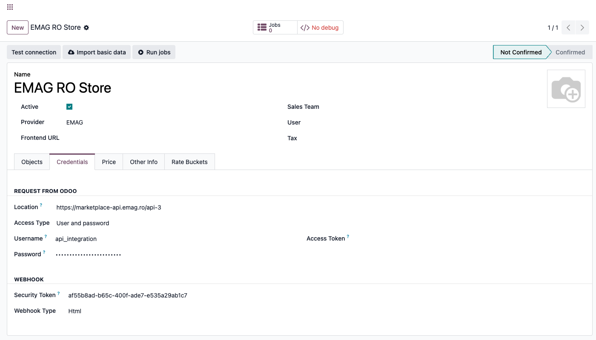
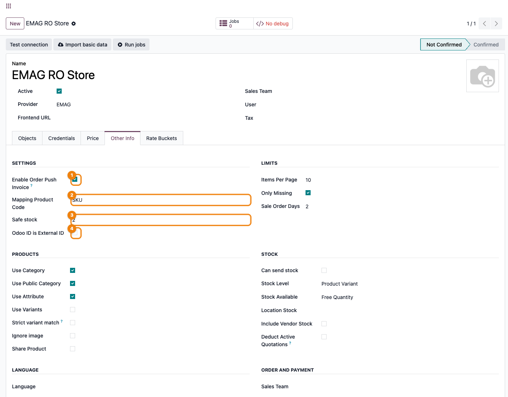
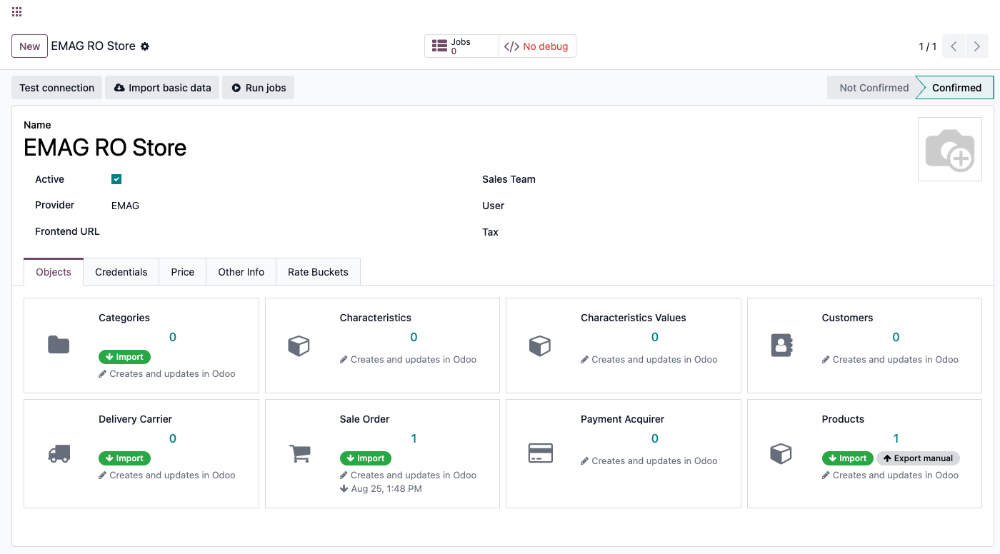
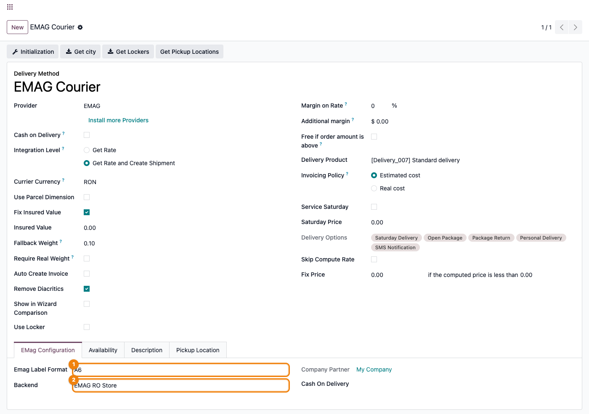
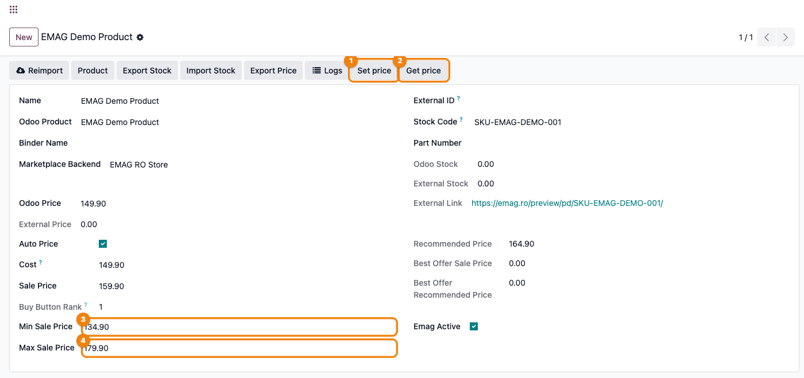
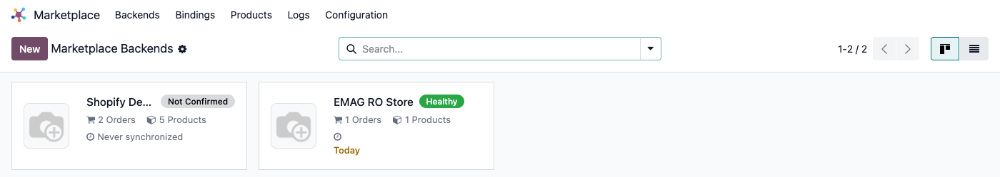

# Fișă Modul: Conector eMAG — produse, comenzi, stoc și AWB

**Modul:** `deltatech_marketplace_emag`
**Utilizator principal:** Consultant Odoo / administrator funcțional (configurare inițială), operator e-commerce (utilizare curentă)
**Prioritate:** 🔴 Ridicată (conector vandabil pe Odoo Apps Store, singurul din suită specific pieței din România)

---

## 1. Scop business

Un cont de seller eMAG lângă Odoo, fără conector, înseamnă catalog, comenzi și stoc ținute manual
în două locuri — și, spre deosebire de un magazin propriu, prețul afișat pe eMAG nu e neapărat cel
pe care îl vede primul cumpărătorul: o ofertă mai bine clasată pe același produs câștigă butonul
„Adaugă în coș" (buy box). Modulul închide acest gol pentru piața din România specific: produsele,
categoriile (cu caracteristicile lor obligatorii), comenzile și stocul circulă automat între Odoo și
eMAG, adresele de livrare cu geografia românească (județe, localități, sectoarele Bucureștiului) se
potrivesc automat cu identificatorii eMAG, iar etichetele AWB pentru curier se generează direct din
Odoo. Se leagă de același framework comun (`deltatech_marketplace`) folosit și de conectorii
Shopify, WooCommerce sau Magento, deci adăugarea eMAG lângă un canal deja folosit nu înseamnă
învățarea unui al doilea sistem.

## 2. Arhitectură tehnică și context

Modulul rulează pe **API-ul eMAG Marketplace** (`https://marketplace-api.emag.ro/api-3`, completat
automat la alegerea `Provider = EMAG`), fără bibliotecă Python externă — comunicarea folosește
`requests`, deja parte din Odoo. Autentificarea este **Basic Auth**: un cont de webservice
(**Username**/**Password**, obținut din contul de seller eMAG, secțiunea **My Account → Profile →
Technical Details**), trimis codificat Base64 în antetul `Authorization` la fiecare apel — nu API
key, nu OAuth. **IP whitelisting este obligatoriu pe partea eMAG**: contul de webservice acceptă
apeluri doar de la IP-urile explicit adăugate în același ecran eMAG — dacă IP-ul serverului Odoo nu
e whitelist-at acolo, niciun apel nu funcționează, indiferent cât de corecte sunt credențialele din
Odoo.

Rate-limiting-ul (protecție împotriva limitei eMAG de apeluri pe secundă) e complet generic, din
framework-ul comun (`deltatech_marketplace`, „token bucket"): eMAG doar setează valoarea implicită
de 3 apeluri/secundă la alegerea provider-ului — un singur prag global, fără diferențiere între
tipurile de apel (produse vs. comenzi), chiar dacă eMAG documentează limite diferite per categorie
de endpoint. La răspuns HTTP 429, bucket-ul se îngheață automat pe durata indicată de eMAG
(`Retry-After`), iar job-ul e reîncercat, nu marcat eșuat, **cât timp mai are reîncercări
disponibile** — un job ajuns totuși în starea „failed" înseamnă că reîncercările s-au epuizat, nu că
totul e în regulă „automat".

Spre deosebire de conectorii internaționali din suită, eMAG cere o pregătire suplimentară specifică
României înainte de a fi util: geografia (județe/localități/sectoare — cu un pas de import propriu,
nu automat), maparea manuală a metodelor de livrare (curier vs. easybox/locker) și importul
categoriilor cu caracteristicile lor — fără acestea, exportul de produse și emiterea AWB-urilor
eșuează cu erori explicite, nu tăcut.

## 3. Utilizatori și roluri

- **Consultant/administrator funcțional**: configurează backend-ul, obține whitelisting-ul de IP la
  eMAG, creează manual cele două metode de livrare (`courier`/`pickup`), importă geografia și rulează
  prima sincronizare în ordinea corectă (categorii înainte de produse).
- **Operator e-commerce**: urmărește starea de sănătate a backend-ului, rezolvă job-urile eșuate,
  emite AWB-uri din expedițiile confirmate, ține sub observație prețurile cu auto-pricing activ.

Roluri recomandate la testare:
- Administrator funcțional: instalează modulul, configurează backend-ul și metodele de livrare.
- Utilizator operațional: rulează prima sincronizare, procesează comenzi și expediții.
- Manager/consultant: validează rezultatul (comenzi importate, oferte exportate, indicatorul de
  sănătate, AWB-uri emise).

## 4. Date și mapări implicate

Nu există note contabile Dr/Cr generate direct de acest modul (asta ține de `sale`/`account`,
declanșate normal de comanda de vânzare creată din comanda eMAG importată). Datele-cheie de pregătit
înainte de prima sincronizare:

- **Cont de webservice eMAG** (username/parolă din **Technical Details**) cu IP-ul serverului Odoo
  deja whitelist-at — fără el, **Test connection** eșuează indiferent de configurarea din Odoo.
- **Mapping product code** (tab **Other Info**, grup **Settings**) — `PN` sau `SKU`, în funcție de
  câmpul care identifică produsele pe eMAG; folosit doar ca sursă a codului intern al produsului
  (`default_code`) la import.
- **Safe stock** (tab **Other Info**, grup **Settings**) — câmp de configurare prezent în interfață,
  dar **fără efect în versiunea actuală**: nimic în export nu îl citește încă (exportul trimite
  stocul Odoo brut). Nu promiteți clientului o rezervă de siguranță pe baza acestui câmp.
- **Odoo ID is External ID** — dacă e bifat, la import produsul se leagă **inițial** de ID-ul Odoo
  primit ca atare de la eMAG; potrivirea ulterioară după **EAN/barcode** (dacă există) suprascrie
  totuși această legătură — bifa nu oprește căutarea după celelalte criterii (§6, Pasul 6).
- **Localitățile eMAG** (județe, orașe, sectoarele Bucureștiului) — nu se importă automat; e nevoie
  de un pas propriu, de pe o metodă de livrare eMAG (§6, Pasul 7), înainte de a emite primul AWB.
- **Două metode de livrare cu Provider = EMAG** (**Inventar → Configurare → Metode de livrare**),
  create **manual** — importul de curieri NU le creează singur: una pentru livrare la domiciliu, una
  pentru easybox/locker.
- **Codul (external code) pe fiecare `marketplace.delivery.carrier`** — trebuie să corespundă exact
  cu `courier` (livrare la domiciliu) sau `pickup` (easybox) din câmpul `delivery_mode` al comenzii
  eMAG; fără această mapare, comanda se importă totuși (fallback pe transportatorul generic „Livrare
  gratuită"), dar AWB-ul nu mai poate fi emis prin eMAG. **Atenție:** un re-import ulterior al
  curierilor rescrie automat acest cod cu numele curierului primit de la eMAG — verificați maparea
  după orice re-import.
- **Min sale price / Max sale price** pe fiecare `marketplace.product` — obligatorii dacă se
  activează auto-pricing-ul pe buy box (§6, Pasul 12); necompletate (0), cron-ul **nu ignoră**
  produsul — poate să-i trimită prețul la 0 pe eMAG (vezi avertismentul din Pasul 12).

Date minime pentru demo: un cont eMAG de test cu IP whitelist-at, cel puțin o categorie eMAG cu
caracteristicile ei, un produs cu ofertă activă, un client și o comandă existentă în cont.

## 5. Configurare inițială

1. La eMAG, în **My Account → Profile → Technical Details**, notați **Username**/**Password**
   pentru webservice și adăugați IP-ul serverului Odoo la **Add a new IP** (whitelisting obligatoriu).
2. Instalați modulul `deltatech_marketplace_emag` (nu necesită nicio bibliotecă Python externă în
   afara celor deja incluse în Odoo).
3. Creați un backend nou: **Marketplace → Backends → Nou**, `Provider = EMAG` — URL-ul API
   (`https://marketplace-api.emag.ro/api-3`) și rata implicită de 3 apeluri/secundă se completează
   automat.
4. În tab-ul **Credentials**, verificați **Access Type = User and password**, apoi completați
   **Username**/**Password** cu contul de webservice eMAG.
5. Pe tab-ul **Other Info**, grupul **Settings**, completați câmpurile specifice eMAG: **Enable
   Order Push Invoice**, **Mapping Product Code**, **Odoo ID is External ID** (Safe stock rămâne
   fără efect în versiunea actuală, vezi §4).
6. Apăsați **Test connection** din antet — apelează efectiv `/vat`, nu doar validează completarea
   câmpurilor.
7. Apăsați **Import basic data** — importă cotele de TVA definite pe cont.
8. Creați manual cele două metode de livrare cu `Provider = EMAG` (**Inventar → Configurare →
   Metode de livrare**); după importul curierilor (§6, Pasul 8), mapați codul lor
   (`courier`/`pickup`) și rulați **Get city** pe fiecare, pentru geografia necesară la AWB.

## 6. Flux de utilizare

### Pasul 1 — Configurarea backend-ului (Credentials)

Deschideți **Marketplace → Backends → Nou**, alegeți `Provider = EMAG` (Location și rata de
apeluri/secundă se completează automat) și completați tab-ul **Credentials**: **Access Type = User
and password**, apoi **Username**/**Password** cu contul de webservice eMAG.



### Pasul 2 — Câmpurile specifice eMAG (tab Other Info)

Pe tab-ul **Other Info**, grupul **Settings**, salvarea cu `Provider = EMAG` afișează un grup
suplimentar de câmpuri: **Enable Order Push Invoice** (trimite un link către PDF-ul facturii spre
eMAG la validare, vezi §6 Pasul 13 — dezactivați-l în mediul de testare), **Mapping Product Code**
(`PN` sau `SKU`), **Safe stock** (câmp de configurare, în prezent fără efect asupra exportului — nu
promiteți clientului o rezervă de stoc pe baza lui) și **Odoo ID is External ID** (leagă produsul
inițial de ID-ul Odoo primit direct de la eMAG; o potrivire ulterioară după EAN/barcode îl poate
totuși suprascrie, vezi §6 Pasul 6).



### Pasul 3 — Testarea conexiunii

Apăsați **Test connection** din antetul formularului. Acest apel obține efectiv un răspuns de la
`/vat` cu credențialele introduse; la succes, starea (`State`) backend-ului trece pe **Confirmed** —
condiție necesară ca indicatorul de sănătate să poată deveni verde mai târziu. Dacă IP-ul serverului
Odoo nu e whitelist-at la eMAG, eroarea *„You are not allowed to use this API"* apare aici, nu mai
târziu la import — se rezolvă din panoul eMAG, nu din Odoo.

### Pasul 4 — Import basic data

Apăsați **Import basic data** din antet — importă cotele de TVA (`taxes`) definite pe contul eMAG,
necesare mai târziu la exportul de produse.

### Pasul 5 — Categorii ÎNAINTE de produse (obligatoriu în această ordine)

Pe tab-ul **Objects**, fiecare tip de date apare ca un card cu un contor și una sau mai multe
etichete informative („Import", „Export manual" etc.) — acestea arată **ce e posibil**, nu sunt ele
însele butoane. Acțiunea reală se declanșează din meniul „⋮" al cardului. Deschideți meniul cardului
**Categories** și alegeți **Import** (nu există „Import All" pentru eMAG — spre deosebire de alți
conectori din suită, singura acțiune disponibilă e importul obișnuit, care parcurge toate paginile
disponibile la fiecare rulare). **Atenție:** bifa **Only Missing** (tab Other Info → Limits) are efect
doar la importul de **comenzi** (Pasul 10) — la categorii și produse pe eMAG, fiecare **Import**
reia toate paginile indiferent de starea bifei, nu doar elementele lipsă.

Spre deosebire de o mapare simplă, importul de categorii eMAG aduce și **caracteristicile
obligatorii/opționale** ale fiecărei categorii, cu toate valorile lor posibile — necesare pentru ca
exportul de produse să știe ce atribute cere eMAG pe acea categorie. Exportul unui produs (meniul
cardului **Products → Export**) **refuză** să trimită oferta dacă produsul aparține unei categorii
Odoo fără corespondent eMAG deja importat — eroarea numește explicit categoria lipsă.



### Pasul 6 — Prima sincronizare de produse

Din meniul cardului **Products** (tab Objects), alegeți **Import**. Ofertele existente pe eMAG devin
înregistrări `marketplace.product`, potrivite cu produsele Odoo, verificate **în această ordine, cu
ultima potrivire câștigătoare**: mai întâi, dacă **Odoo ID is External ID** e bifat pe backend,
produsul se leagă de ID-ul Odoo primit direct de la eMAG; apoi, indiferent de bifă, se caută după
**part number key (PNK)**, care suprascrie legătura de mai sus dacă găsește un produs deja legat la
acel PNK; în final se caută după **EAN/barcode**, care suprascrie orice legătură anterioară dacă
găsește un produs Odoo cu acel cod de bare — deci EAN are prioritatea finală, nu PNK sau ID-ul
extern. O ofertă **inactivă** pe eMAG (`status != 1`) care nu are deja un produs Odoo legat este
**sărită complet** la import — nu creează un produs nou; una care are deja o legătură rămâne totuși
salvată, dar fără cod de bare/cod intern preluat de la eMAG.

### Pasul 7 — Import geografie (localități) — obligatoriu pentru AWB

Localitățile eMAG (inclusiv sectoarele Bucureștiului) **nu** se importă automat cu restul datelor.
Pe oricare metodă de livrare cu `Provider = EMAG` deja creată (§5, Pasul 8), apăsați butonul **Get
city** din antetul formularului — pornește importul paginat, care leagă fiecare localitate eMAG de
un `res.city` prin `emag_id`. Rulați-l o singură dată per backend, înainte de primul AWB; județele
(`res.country.state`) se creează automat, pe măsură ce sunt referite.



### Pasul 8 — Curieri și maparea metodelor de livrare (obligatoriu manual)

Din meniul cardului **Delivery Carrier** (tab Objects), alegeți **Import** — aduce conturile de
curier din contul eMAG (`/courier_accounts`), câte un `marketplace.delivery.carrier` pentru fiecare.
Pentru a le vedea și edita, apăsați pe contorul cardului (deschide lista înregistrărilor acestui
backend) — nu există un meniu separat „Delivery Carriers" în aplicația Marketplace.

Acest import **nu** creează metodele de livrare Odoo: creați manual, în **Inventar → Configurare →
Metode de livrare**, două metode cu `Provider = EMAG` (una pentru domiciliu, una pentru
easybox/locker), apoi mapați **Code**-ul fiecărui `marketplace.delivery.carrier` pe `courier` sau
`pickup` — valoarea exactă a câmpului `delivery_mode` trimis de eMAG pe comandă. Fără această
mapare corectă, comanda tot se importă (cade pe transportatorul generic „Livrare gratuită"), dar
AWB-ul nu mai poate fi emis prin eMAG pentru ea. **Un re-import ulterior al curierilor rescrie
automat acest cod** cu numele curierului primit de la eMAG — verificați maparea de fiecare dată
după un re-import.

Tab-ul **EMag Configuration** de pe fiecare metodă de livrare (`delivery.carrier`) setează **Emag
Label Format** (`A4`/`A5`/`A6` pentru PDF, `zpl` pentru imprimantă termică Zebra), transportatorul de
plată la livrare (**Cash On Delivery**) și backend-ul asociat.

### Pasul 9 — Prețul pe fiecare ofertă (marketplace.product)

Pe o înregistrare `marketplace.product` legată de eMAG apar butoanele **Set price** (trimite
`sale_price`/`min_sale_price`/`max_sale_price` către eMAG) și **Get price** (aduce înapoi prețul
curent de pe eMAG, rangul în buy box și prețurile recomandate de eMAG — singurul mod prin care
câmpurile de preț din Odoo se completează după import, exportul nu le scrie singur). **Get price**
nu doar citește: dacă backend-ul are activ **Price Per Product**, scrie și el prețul primit ca item
fix în lista de prețuri a backend-ului — aceeași listă din care exportul recalculează min/max mai
jos, deci se închide o buclă preț-eMAG → listă de prețuri Odoo → export. La fiecare **export de
produs** (Pasul 5/meniul cardului Products → Export), `min_sale_price`/`max_sale_price` trimise sunt
recalculate automat la ±10% din prețul curent din **lista de prețuri a backend-ului** (nu din prețul
de vânzare Odoo al produsului) — o ajustare manuală a acestor două câmpuri în Odoo se pierde la
următorul export, dacă nu e reflectată și în lista de prețuri.



### Pasul 10 — Import comenzi și acknowledge automat

Din meniul cardului **Sale Order** (tab Objects), alegeți **Import** — aduce comenzile aflate pe
eMAG în starea `NEW`, `IN_PROGRESS` sau `PREPARED`. Aceste trei stări sunt **singurele** aduse
automat sau la apăsarea acestui buton — nu există un câmp în interfață care să schimbe lista, e
fixată în cod; o comandă `CANCELED`, `FINALIZED` sau `RETURNED` e respinsă de acest filtru, inclusiv
dacă ajunge prin webhook.

Pe lângă butonul manual, eMAG trimite comenzi noi/schimbate spre Odoo printr-un **webhook**
(configurat pe backend, secțiunea Webhook, cu **Security Token**, plus bifa **Use Webhook** pe
item-ul `orders` — link-ul de trimis către eMAG e cel afișat pe același item, nu unul generic de pe
backend): la fiecare apel, comanda respectivă se importă sincron, cu **același filtru de stare** ca
mai sus; dacă importul sincron eșuează dintr-un motiv tehnic, cade pe un job în coadă, ca să nu se
piardă comanda — dar o comandă aflată deja în afara filtrului de stare nu ajunge oricum în Odoo pe
această cale.

Când o comandă `NEW` e importată **și** item-ul `orders` are bifat **Active On Write** (tab Objects),
comanda este confirmată automat înapoi la eMAG (`/order/acknowledge`), ca job de fundal. Cu bifa
nebifată (implicit), comanda tot ajunge în Odoo, dar rămâne neconfirmată pe eMAG până apăsați manual
`emag_acknowledge` pe înregistrarea comenzii — util în testare, ca eMAG să nu considere comanda
preluată.

O comandă care are `cancellation_request` fără nicio expediție deja finalizată se anulează automat
și pe comanda de vânzare Odoo, la orice import (inclusiv webhook). **O comandă deja importată, care
trece ulterior în `CANCELED` pe eMAG, nu se anulează automat**: filtrul de stare de mai sus respinge
și acest caz la reimportul periodic/webhook. Anularea pe baza statusului `CANCELED` se aplică doar la
un **Reimport** manual, apăsat direct pe înregistrarea comenzii din Odoo.

### Pasul 11 — Emiterea AWB-ului

La confirmarea unei expediții cu o metodă de livrare `EMAG`, apăsați **Send to Shipper** — conectorul
completează localitățile expeditorului/destinatarului din geografia importată la Pasul 7, valoarea
declarată a coletului și, pentru ramburs, suma de încasat (recalculată la momentul trimiterii, nu
preluată din linia de livrare de la import). Pentru comenzi cu easybox, ID-ul locker-ului salvat pe
comandă e trimis la rădăcina cererii, ca pachetul să ajungă la punctul corect, nu la adresa
cumpărătorului. Eticheta (PDF sau ZPL, după **Emag Label Format**) se atașează automat la expediție;
ulterior, butonul **Print AWB** o re-descarcă la cerere. Dacă localitatea expeditorului sau (pentru
comenzi din România) a destinatarului lipsește din nomenclatorul eMAG deja importat, emiterea AWB-ului
eșuează cu o eroare explicită, nu tăcut.

Starea coletului **nu** se împinge în timp real spre Odoo: codurile de stare AWB ale eMAG (`PU`,
`INT`, `INW`, `OFD`, `DLV`, `RTS`, `REF`, `CAN`, `AWB`) sunt interogate periodic prin cron-ul comun de
livrare și mapate pe starea Odoo (ex. `DLV` → livrat, `RTS`/`REF`/`CAN` → refuzat).

### Pasul 12 — Auto-pricing pe buy box (opțional)

Cron-ul **EMAG: Set Price** (dezactivat implicit, **Settings → Technical → Scheduled Actions**)
ajustează prețul ofertelor cu **Auto Price** bifat și cu un **Buy Button Rank** cunoscut (diferit de
0 — o ofertă fără rang cunoscut e sărită, până la un **Get price**): dacă oferta deține buy box-ul
(rang exact 1), prețul urcă spre `max_sale_price`; pentru orice alt rang cunoscut (2, 3, …), coboară
— mereu plafonat între `min_sale_price` și `max_sale_price` configurate pe produs. Ajustările sub 0,5
unități monetare sunt ignorate.

> **Avertisment obligatoriu de comunicat clientului:** dacă **Min sale price**/**Max sale price**
> rămân necompletate (0) pe un produs cu **Auto Price** bifat și cu un rang cunoscut (deține buy
> box-ul SAU nu îl deține, ambele cazuri sunt afectate), cron-ul **nu ignoră produsul** — calculează
> un preț țintă spre limita de 0, îl plafonează la 0 și **trimite prețul 0 la eMAG**, scriindu-l și
> pe câmpul din Odoo. Nu activați Auto Price pe niciun produs fără să completați întâi ambele limite.

### Pasul 13 — Push-ul facturii către eMAG

Când o factură legată de o comandă eMAG e validată în Odoo — cu **Enable Order Push Invoice** activ
pe backend ȘI **Active On Write** activ pe item-ul `orders` (cele două condiții sunt independente,
trebuie ambele) — conectorul trimite către eMAG **link-ul portalului Odoo** către PDF-ul facturii
(`/order/attachments`), nu conținutul PDF-ului propriu-zis; eMAG descarcă documentul de la acel link.
Aceasta cere ca **URL-ul de bază al instanței Odoo (`web.base.url`) să fie public și accesibil din
afară** — pe o instanță fără acces public din internet, push-ul „reușește" (apelul API nu dă eroare),
dar eMAG nu poate obține efectiv factura.

### Pasul 14 — Citirea stării de sănătate

Cardul kanban al backend-ului din **Marketplace → Backends** arată un indicator de sănătate
(„Not Confirmed"/„Healthy"/altă stare de eroare) — logica e complet generică din framework, eMAG nu
o suprascrie. Devine **„Healthy"** doar când backend-ul e confirmat (`Test connection` reușit), fără
erori în ultimele 24h, fără job-uri eșuate, și cel puțin un tip de date are deja o sincronizare
înregistrată. Un backend confirmat dar neimportat încă rămâne cu starea „Never synchronized", nu
„Healthy".



> Kanban-ul **Marketplace → Backends** e comun tuturor conectorilor instalați — pe o instanță cu mai
> multe conectoare de test/demo e normal să apară și cardurile lor alături de cel eMAG. Urmăriți
> cardul cu numele backend-ului configurat de voi.

### Note de monografie și raportare

Nu se aplică — acest modul nu generează note contabile proprii. Comanda de vânzare rezultată din
importul eMAG urmează contabilizarea standard Odoo (`sale`/`account`), neatinsă de acest conector.

## 7. Legături cu alte module / declarații

| Modul / proces | Rol în flux | Tip legătură |
|---|---|---|
| `deltatech_marketplace` | framework comun: backend, indicator de sănătate, job-uri, rate-limiting (token bucket) | dependență (manifest) |
| `deltatech_marketplace_sale` | comanda de vânzare Odoo generată din comanda eMAG | dependență (manifest) |
| `deltatech_marketplace_delivery` | mapare transportator, linie de livrare pe comandă | dependență (manifest) |
| `deltatech_marketplace_payment` | mapare metodă de plată eMAG → payment acquirer Odoo (fallback pe Wire Transfer) | dependență (manifest) |
| `deltatech_marketplace_website` | link-ul de produs eMAG folosește rutele website-ului Odoo la export (`/shop/...`) | dependență (manifest) |
| `deltatech_delivery` | contractul de capabilități al curierilor (`cities`, `ship`, `tracking`), butonul **Get city**, cron-ul comun de stare livrare | dependență (manifest) |
| `l10n_ro_edi` / `l10n_ro_edi_stock` | e-Factura (SPV) / eTransport — **neatinse** de acest conector; push-ul de factură eMAG e doar un link către PDF | flux independent |
| `sale` / `stock` / `account` | comanda de vânzare, mișcarea de stoc, factura rezultată — flux Odoo standard | flux standard Odoo |

Ce este automat: crearea automată a județelor (`res.country.state`) la prima referință; potrivirea
localităților/sectoarelor Bucureștiului după `emag_id` (odată importate, vezi §6 Pasul 7); acknowledge
automat al comenzilor noi (dacă **Active On Write** e activ); anularea automată a comenzii Odoo pe
baza `cancellation_request`; atașarea etichetei AWB la expediție după emitere; polling-ul periodic al
stării AWB; reîncercarea automată a job-urilor eșuate temporar (HTTP 429/5xx), cât timp mai au
reîncercări disponibile.

Ce rămâne manual: whitelisting-ul de IP la eMAG; crearea celor două metode de livrare cu
`Provider = EMAG`; maparea codului `courier`/`pickup` pe fiecare `marketplace.delivery.carrier`
(reverificată după fiecare re-import de curieri); importul de localități (**Get city**, o singură
dată per backend); ordinea primei sincronizări (categorii → produse → curieri → comenzi); anularea pe
baza statusului `CANCELED` pentru o comandă deja importată (doar prin **Reimport** manual); acknowledge
manual când **Active On Write** e dezactivat; activarea cron-urilor de export stoc/preț și a
cron-ului de auto-pricing.

## 8. Verificări pentru consultant

- [ ] Modulul se instalează fără erori (nu necesită bibliotecă Python externă).
- [ ] IP-ul serverului Odoo este whitelist-at în panoul eMAG (**Technical Details → Add a new IP**)
      — altfel niciun apel API nu funcționează, indiferent de credențiale.
- [ ] **Test connection** confirmă credențialele (`State = Confirmed`) — verifică apelul real la
      `/vat`, nu doar completarea câmpurilor — înainte de orice import.
- [ ] **Categories → Import** (din meniul „⋮" al cardului) a rulat ÎNAINTE de orice export de
      produse — altfel exportul refuză produsele din categorii fără corespondent eMAG. Nu există
      „Import All" pentru eMAG — nu căutați acest buton.
- [ ] **Get city** a rulat cel puțin o dată pe o metodă de livrare eMAG — altfel emiterea AWB-ului
      eșuează pentru localități lipsă din nomenclator.
- [ ] Cele două metode de livrare cu `Provider = EMAG` (domiciliu + easybox) există și au **Code**-ul
      mapat corect pe `courier`/`pickup` — verificat, nu presupus din denumire; verificat din nou
      după orice re-import de curieri (rescrie codul automat).
- [ ] Nu s-a promis clientului că AWB-urile se pot emite fără maparea de mai sus — fără ea, comanda
      tot se importă, dar cade pe transportatorul generic „Livrare gratuită".
- [ ] Filtrul de import comenzi (`NEW`/`IN_PROGRESS`/`PREPARED`) e cunoscut clientului ca fix în cod
      — nu există câmp UI care să-l schimbe, iar filtrul se aplică inclusiv comenzilor primite prin
      webhook.
- [ ] Clientul știe că o comandă deja importată, ajunsă ulterior în `CANCELED` pe eMAG, **nu** se
      anulează automat în Odoo — necesită un **Reimport** manual pe acea comandă.
- [ ] **Active On Write** pe item-ul `orders` este setat conform așteptării clientului — dacă e
      dezactivat, nici acknowledge-ul, nici push-ul facturii nu ajung automat la eMAG, deși comanda
      se importă normal.
- [ ] Nu s-a promis clientului o sincronizare generică de status înapoi spre eMAG — singurele push-uri
      de status de comandă reale sunt acknowledge-ul comenzilor noi și trimiterea link-ului facturii;
      există separat push de ofertă/preț/stoc/AWB, dar nu de status generic al comenzii.
- [ ] **Enable Order Push Invoice** e dezactivat în mediul de testare, ca să nu se trimită facturi
      ciornă către eMAG; e cunoscut faptul că se trimite un **link**, nu PDF-ul propriu-zis, și că
      necesită `web.base.url` public.
- [ ] Indicatorul de sănătate de pe cardul kanban e verde (confirmat, zero erori/job-uri eșuate, cel
      puțin o sincronizare înregistrată) după prima sincronizare reușită.
- [ ] Nu s-a promis clientului sincronizare de stoc în timp real — exportul e periodic, prin cron-ul
      comun al framework-ului, dezactivat implicit; câmpul **Safe stock** nu are efect în versiunea
      actuală — nu promiteți o rezervă de siguranță pe baza lui.
- [ ] Auto-pricing-ul pe buy box **nu se activează** pe niciun produs fără ca **Min sale price** și
      **Max sale price** să fie completate întâi — altfel riscă să trimită prețul 0 la eMAG.
- [ ] Clientul nu se așteaptă la un flux de retur/refund automat — statusul AWB „Return to Sender"
      se reflectă în Odoo doar ca stare de livrare, fără proces RMA sau notă de credit generată.

## 9. Mesaje de eroare frecvente

| Mesaj / simptom | Cauză probabilă | Remediere |
|---|---|---|
| `Test connection` eșuează cu „You are not allowed to use this API" | IP-ul serverului Odoo nu e whitelist-at la eMAG, sau contul de webservice nu are API activat | Adăugați IP-ul în **Technical Details → Add a new IP**, verificați activarea API-ului la eMAG |
| Exportul unui produs eșuează cu eroare de categorie lipsă | Categoria Odoo a produsului nu are corespondent eMAG deja importat | Rulați **Categories → Import** (meniul „⋮"), mapați categoria, reîncercați exportul |
| O comandă importată nu poate emite AWB (transportator „Livrare gratuită") | Codul `courier`/`pickup` nu e mapat pe niciun `marketplace.delivery.carrier`, sau a fost rescris de un re-import de curieri | Deschideți lista de curieri (contorul cardului **Delivery Carrier**) și remapați **Code**-ul |
| Emiterea AWB-ului eșuează cu eroare de localitate | **Get city** nu a rulat încă pentru geografia respectivă | Rulați **Get city** pe metoda de livrare eMAG |
| O comandă nu ajunge niciodată în Odoo | Comanda e în alt status decât `NEW`/`IN_PROGRESS`/`PREPARED` pe eMAG | Comportament normal — filtrul e fix, se aplică și pe webhook; verificați statusul real pe eMAG |
| O comandă `CANCELED` pe eMAG rămâne activă în Odoo | Anularea pe bază de status se aplică doar la Reimport manual, nu la import periodic/webhook | Deschideți comanda în Odoo și apăsați **Reimport** |
| Comanda ajunge în Odoo dar nu e confirmată pe eMAG (rămâne „new") | **Active On Write** e dezactivat pe item-ul `orders` | Activați bifa, sau confirmați manual cu `emag_acknowledge` |
| Factura nu ajunge la eMAG deși a fost validată | **Enable Order Push Invoice** dezactivat, **Active On Write** dezactivat pe `orders`, sau `web.base.url` nu e accesibil din exterior | Verificați toate trei — primele două sunt independente, iar link-ul trimis trebuie să fie public |
| Prețul unui produs scade neașteptat la 0 pe eMAG | **Auto Price** bifat fără **Min/Max sale price** completate, pe o ofertă cu Buy Button Rank cunoscut (o deține sau nu buy box-ul, ambele cazuri sunt afectate) | Completați limitele înainte de a activa Auto Price; corectați manual prețul curent |
| Job în coadă rămâne „failed" cu eroare HTTP 429 | Limita de 3 apeluri/secundă a fost depășită, iar reîncercările s-au epuizat | Requeue manual din **Jobs** — un job „failed" NU se mai reîncearcă singur |
| Job în coadă rămâne „failed" (alt motiv) | Câmp obligatoriu lipsă sau eroare eMAG netratată | Verificați traceback-ul job-ului din **Jobs**, corectați configurarea, requeue |

## 10. Capturi de ecran

> Interfața din capturile de mai jos e în **engleză** (capturile s-au făcut cu `locale="en-US"`, ca
> la ceilalți conectori din suită) — etichetele reale de pe ecran sunt cele englezești, deși modulul
> are și o traducere parțială în `i18n/ro.po`.

Capturile (`readme/screenshots/`) ilustrează fluxul din secțiunea 6, generate cu
`ScreenshotCase`/Playwright (`tests/test_screenshots.py`, import defensiv, clasă separată de orice
test de marketing existent):

1. `01_credentials.png` — backend eMAG, tab Credentials completat, înainte de Test connection
   (`Not Confirmed`).
2. `02_provider_details.png` — grupul de câmpuri specifice eMAG (tab Other Info): Enable Order Push
   Invoice, Mapping Product Code, Safe stock, Odoo ID is External ID.
3. `03_objects.png` — tab Objects: cardurile cu contoare și etichete informative per tip de date.
4. `04_delivery_carrier.png` — metoda de livrare EMAG: butonul **Get city** din antet (import
   geografie) și tab-ul EMag Configuration (Emag Label Format, Backend).
5. `05_product_pricing.png` — fișa produsului marketplace: Odoo Price/External Price, Sale Price,
   Auto Price, Buy Button Rank, Min/Max Sale Price, butoanele Set price/Get price.
6. `06_health_badge.png` — indicatorul de sănătate pe cardul kanban al backend-ului.

Regenerare:

```bash
cd /Users/dhongu/Odoo/odoo19
./odoo/odoo-bin -c odoo_mp_test.conf -d mkt_test19 -u deltatech_marketplace_emag \
    --test-enable --test-tags=/deltatech_marketplace_emag:TestEmagFisaScreenshots \
    --stop-after-init --http-port=8987 --gevent-port=8988
```

## 11. Observații pentru manual

În manualul final, păstrați accentul pe **pregătirile obligatorii înainte de utilizare reală**:
whitelisting-ul de IP la eMAG (fără el, nimic nu funcționează), crearea manuală a celor două metode de
livrare cu maparea corectă `courier`/`pickup` (verificată după fiecare re-import de curieri, care o
rescrie), importul de localități cu **Get city** înainte de primul AWB, și ordinea primei sincronizări
(categorii/caracteristici înainte de produse). Subliniați clar clientului că **nu există sincronizare
generică de status înapoi spre eMAG** — doar acknowledge la import și trimiterea unui link către
factură (nu PDF-ul propriu-zis) — și că filtrul de import comenzi (`NEW`/`IN_PROGRESS`/`PREPARED`) e
fix în cod, inclusiv pe calea webhook; o comandă anulată ulterior pe eMAG cere un **Reimport** manual
în Odoo. Insistați ca **Min/Max sale price** să fie completate ÎNAINTE de a activa Auto Price — altfel
riscul e trimiterea prețului 0 la eMAG. Menționați explicit că **Test connection** validează efectiv
un apel către eMAG (`/vat`), nu doar completarea câmpurilor. Evitați alte detalii de implementare
(nume de câmpuri interne, endpoint-uri REST) în corpul explicației către utilizatorul final.
