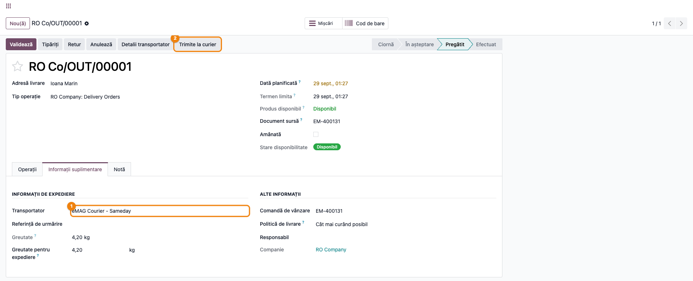
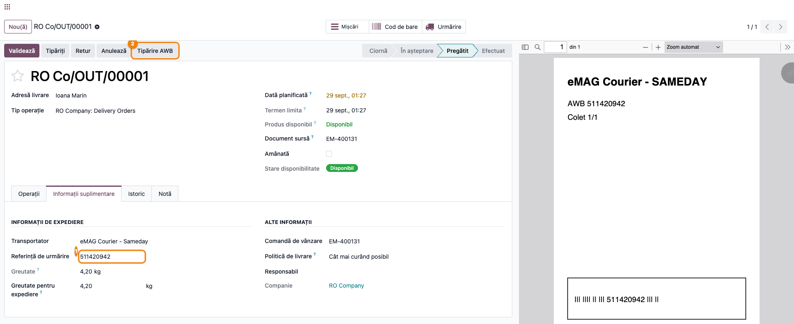
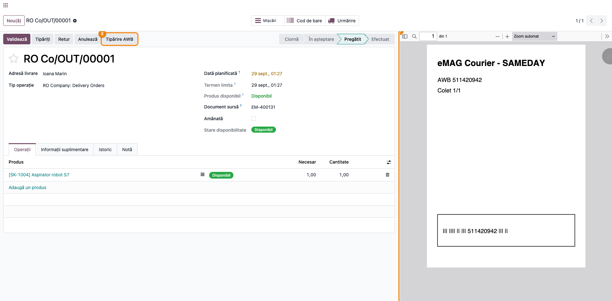
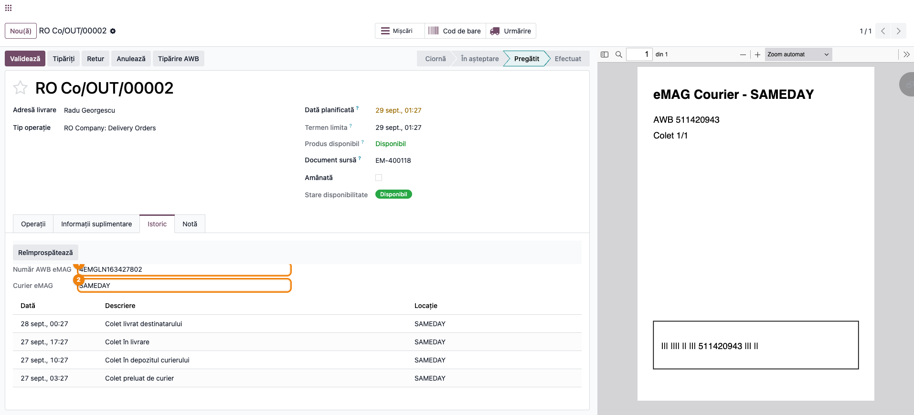
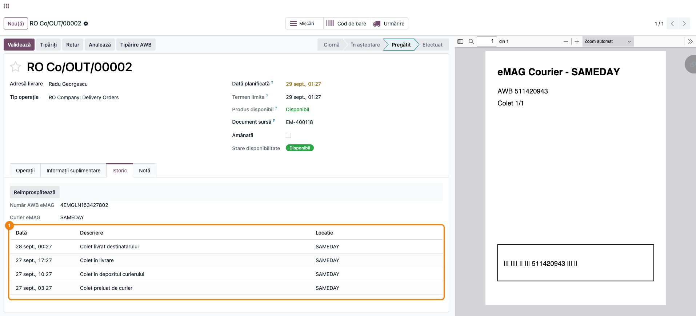

# Fișă Modul: Emiterea AWB-urilor prin Curierul eMAG (Marketplace)

**Modul:** `deltatech_marketplace_emag_delivery`
**Utilizator principal:** Operator logistică / Operator marketplace
**Prioritate:** 🟡 Medie (necesar doar pentru vânzătorii care folosesc curierul propriu al eMAG)

---

## 1. Scop business

Modulul permite emiterea AWB-urilor (poliță de transport) direct din livrarea Odoo, pentru
comenzile primite prin conectorul eMAG Marketplace, atunci când vânzătorul folosește **serviciul
de curierat al eMAG** (eMAG Courier). eMAG nu transportă el însuși coletele: le predă unui
curier partener (Sameday, FAN Courier etc.) în numele vânzătorului. Modulul înregistrează eMAG
ca metodă de livrare în Odoo, astfel încât operatorul de logistică poate cere AWB-ul, descărca
eticheta (A4/A5/A6 sau ZPL) și urmări coletul prin fluxul de status al eMAG, direct din
formularul livrării — fără să mai intre în interfața eMAG pentru asta.

## 2. Bază legală și context

Nu există o bază legală fiscală specifică — este un flux pur operațional/logistic, dependent de
API-ul eMAG Marketplace (secțiunea „AWB" a documentației API eMAG) și de contractul de curierat
pe care vânzătorul îl are cu eMAG. Contextul relevant este comercial: vânzătorii care listează pe
eMAG Marketplace și optează pentru curierul eMAG (spre deosebire de curierul propriu) trebuie să
emită AWB-ul prin acest canal, nu prin integrarea directă cu Sameday/FAN/Cargus etc.

## 3. Utilizatori și roluri

Operator logistică (expediere colete), Operator marketplace (import comenzi eMAG).

Roluri recomandate pentru testare:
- Administrator funcțional: instalează modulul, configurează metoda de livrare și importă
  conturile de curier din backend
- Utilizator operațional: expediază livrarea, tipărește eticheta, urmărește statusul AWB
- Manager: verifică faptul că suma de ramburs și eticheta corespund comenzii

## 4. Conturi și date implicate

Nu sunt implicate conturi contabile — modulul nu generează note contabile. Datele operaționale
implicate sunt: metoda de livrare (`delivery.carrier` cu tip `EMAG`), backend-ul de marketplace
eMAG, localitățile importate din nomenclatorul eMAG (`res.city.emag_id`) și conturile de curieri
(`marketplace.delivery.carrier`) importate din eMAG.

Date minime pentru demo:
- un backend `marketplace.backend` de tip eMAG deja configurat (vezi modulul
  `deltatech_marketplace_emag`) și o comandă marketplace importată, cu livrare generată
- o metodă de livrare Odoo cu furnizorul `EMAG`
- adresa companiei (expeditor) și adresa clientului (destinatar) cu localitate mapată la
  nomenclatorul eMAG de localități
- cel puțin un cont de curier eMAG importat pe metoda de livrare

## 5. Configurare inițială

1. Instalați modulul `deltatech_marketplace_emag_delivery` (se instalează automat oricând
   `deltatech_marketplace_emag` și `deltatech_delivery` sunt deja prezente, deoarece a fost
   extras din conectorul eMAG pentru a nu impune ecranele de livrare vânzătorilor cu curier
   propriu).
2. Mergeți la **Inventar → Configurare → Metode de livrare** și creați o metodă cu
   **Furnizor** = `EMAG`.
3. Pe tabul **EMag Configuration**, alegeți **Backend-ul** contului eMAG pe care se va emite
   AWB-ul și **formatul etichetei** (A4, A5, A6 sau ZPL — ZPL este pentru imprimante Zebra).
   Setați și **adresa companiei** folosită ca expeditor, plus metodele de plată considerate
   ramburs (`payment_on_delivery_ids`).
4. Din formularul backend-ului, rulați **Import localități** pentru a aduce nomenclatorul de
   localități eMAG — atât expeditorul, cât și destinatarul trebuie să se regăsească într-un
   oraș cunoscut de eMAG, altfel AWB-ul este refuzat.
5. Rulați **Import** pe backend pentru a aduce conturile de curier eMAG (obiectul „Curieri
   livrare"); acestea decid ce curier partener va folosi efectiv eMAG.

## 6. Flux de utilizare

### Pasul 1 — Pregătirea livrării unei comenzi eMAG

O comandă importată de la eMAG generează automat o livrare (`stock.picking`) legată de comanda
de vânzare. Deschideți livrarea din **Inventar → Transferuri → Livrări** și verificați, pe tabul
**Informații suplimentare**, că **Transportator** este o metodă de livrare de tip eMAG (①).

Apăsați apoi **Detalii transportator** și confirmați detaliile expedierii (colete, greutate,
ramburs). Abia după confirmare apare butonul **Trimite la curier** (②).

> Curierul real (Sameday, FAN etc.) nu este cunoscut la importul comenzii — eMAG transmite doar
> modul de livrare („curier"/„locker"). Operatorul alege metoda de livrare Odoo potrivită
> (asociată contului de curier eMAG dorit) chiar înainte de a genera AWB-ul.

### Pasul 2 — Trimitere la curier (emiterea AWB-ului)

Din livrare, apăsați **Trimite la curier**. Modulul calculează suma de ramburs din
starea curentă a comenzii (dacă plata a fost deja încasată online, nu rămâne nimic de încasat
ramburs), preia adresa de expediere/destinație mapată pe localitățile eMAG și, pentru comenzile
cu ridicare din easybox, transmite automatul (lockerul) primit pe comandă. Cere apoi AWB-ul prin
API-ul eMAG.

La succes, livrarea primește **Referință de urmărire** (①), adică id-ul intern eMAG
(`carrier_tracking_ref`), folosit pentru toate apelurile API. Dacă răspunsul conține și numărul de
AWB vizibil clientului, acesta este reținut imediat. Butonul **Trimite la curier** dispare și
apare **Tipărire AWB** (②).

### Pasul 3 — Tipărirea etichetei

Eticheta se aduce automat la trimitere și apare în previzualizarea din dreapta livrării (①).
**Tipărire AWB** (②) o cere din nou de la eMAG, de exemplu după o ștergere. Modulul cere eticheta
de la eMAG în formatul configurat (PDF pentru A4/A5/A6, conținut ZPL pentru
imprimantele Zebra) și o atașează livrării, cu un nume de fișier care conține AWB-ul
(`LabelEmag-<awb>.pdf` sau `.zpl`), astfel încât fluxul de tipărire ZPL din `deltatech_delivery`
o poate recunoaște automat.

### Pasul 4 — Urmărirea coletului (AWB și curier)

Pe tabul **Istoric** al livrării, deasupra listei de statusuri, apar **Număr AWB eMAG** (①,
numărul de AWB citit de client, diferit de id-ul intern folosit de API) și **Curier eMAG** (②,
curierul partener care transportă efectiv coletul — Sameday, FAN etc.). Câmpurile apar doar după
ce eMAG le-a trimis și se actualizează automat la interogarea periodică de status; butonul
**Reîmprospătează** face interogarea pe loc.

Starea de livrare (`delivery_state`) și istoricul de tranzit se actualizează din codurile de
status transmise de eMAG (ridicat, în tranzit, în depozit, în livrare, livrat, refuzat/returnat).
Fiecare status apare ca un rând în lista de pe tabul **Istoric** (①), cu curierul ca locație. Un
AWB anulat (`CAN`) nu schimbă starea livrării: de regulă, AWB-ul se emite din nou.

### Note de monografie și raportare

Modulul nu produce note contabile — este strict un flux logistic (emitere AWB, etichetă,
urmărire status). Nu există înregistrări Dr/Cr generate de acest modul.

> Anularea unui AWB nu se poate face din Odoo — eMAG nu oferă API pentru asta; anularea se face
> exclusiv din interfața de vânzător eMAG.

## 7. Legături cu alte module / declarații

| Modul / proces | Rol în flux | Tip legătură |
|---|---|---|
| `deltatech_marketplace_emag` | conectorul eMAG (backend, apeluri API, import comenzi) | dependență (manifest) |
| `deltatech_marketplace_delivery` | date de livrare marketplace (locker, sumă de ramburs, adrese) | dependență (manifest) |
| `deltatech_delivery` | infrastructura generică de livrare (etichete, istoric, tipărire ZPL) | dependență (manifest) |
| `stock` | livrările (`stock.picking`) pe care se emite AWB-ul | implicit (prin `deltatech_delivery`) |

Ce este automat: calculul sumei de ramburs la momentul expedierii, maparea localităților,
transmiterea lockerului pentru comenzile cu ridicare din easybox, denumirea etichetei după AWB
și actualizarea periodică a statusului/istoricului de livrare.
Ce rămâne manual: alegerea metodei de livrare (contului de curier) potrivite pe fiecare livrare,
importul inițial al localităților și al conturilor de curier, și anularea unui AWB (doar din
interfața eMAG).

## 8. Verificări pentru consultant

- [ ] Modulul se instalează fără erori (sau se auto-instalează corect alături de
      `deltatech_marketplace_emag` și `deltatech_delivery`).
- [ ] Metoda de livrare de tip `EMAG` este vizibilă și configurabilă în **Inventar →
      Configurare → Metode de livrare**.
- [ ] Localitățile eMAG au fost importate și adresa companiei + adresa clientului se rezolvă la
      un oraș cunoscut de eMAG.
- [ ] Conturile de curier eMAG sunt importate pe backend și mapate la o singură metodă de
      livrare Odoo fiecare (o mapare ambiguă blochează emiterea AWB-ului).
- [ ] **Trimite la curier** apare după **Detalii transportator**, generează AWB-ul și completează
      **Referință de urmărire**.
- [ ] Eticheta se tipărește în formatul configurat (PDF sau ZPL) și numele fișierului conține
      AWB-ul.
- [ ] Câmpurile **Număr AWB eMAG** și **Curier eMAG** se completează după interogarea de
      status.
- [ ] Istoricul de livrare reflectă statusul real transmis de eMAG.

## 9. Mesaje de eroare frecvente

| Mesaj / simptom | Cauză probabilă | Remediere |
|-----------------|-----------------|-----------|
| „Please select the city for the sender from the EMAG list of cities" | Localitatea companiei (expeditor) nu este mapată în nomenclatorul eMAG | Rulați „Import localități" pe backend și verificați orașul pe adresa companiei |
| „Please select the city for the recipient from the EMAG list of cities" | Localitatea clientului (destinatar, în România) nu este mapată în nomenclatorul eMAG | Corectați/completați orașul pe adresa de livrare a comenzii |
| „Multiple eMAG courier accounts are mapped to delivery method …" | Mai multe conturi de curier eMAG sunt asociate aceleiași metode de livrare Odoo | Alocați fiecare cont de curier eMAG unei metode de livrare Odoo distincte |
| Eticheta nu se convertește/tipărește corect pe imprimanta Zebra | Formatul etichetei nu este setat pe `ZPL` pe metoda de livrare | Setați `emag_label_format = ZPL` pe metoda de livrare folosită |
| AWB emis, dar fără număr vizibil pentru client (**Număr AWB eMAG** gol) | Răspunsul de emitere nu a conținut încă numărul de AWB (apare abia la interogarea de status) | Așteptați următoarea rulare a interogării de status sau reinterogați manual istoricul |
| Statusul livrării nu se mai actualizează | Backend-ul asociat comenzii lipsește sau apelul către eMAG eșuează silențios (se loghează ca avertisment) | Verificați backend-ul comenzii marketplace și jurnalul de erori (`_logger`) pentru apelul `/awb read` |

## 10. Capturi de ecran

Capturile sunt generate de `tests/test_screenshots.py` (Playwright, API-ul eMAG simulat), pe „RO
Company”, cu interfața în română:

| Fișier | Ce arată |
| --- | --- |
| `screenshots/01_livrare_metoda_emag.png` | livrarea eMAG: transportatorul eMAG și butonul *Trimite la curier* |
| `screenshots/02_trimite_transportator.png` | după *Trimite la curier*: referința de urmărire și butonul *Tipărire AWB* |
| `screenshots/03_eticheta_awb.png` | eticheta AWB în previzualizarea din dreapta livrării |
| `screenshots/04_awb_courier_picking.png` | tabul *Istoric*: *Număr AWB eMAG* și *Curier eMAG* |
| `screenshots/05_istoric_livrare.png` | tabul *Istoric*: statusurile citite de la eMAG |

Eticheta și statusurile din capturi sunt date de test, nu un AWB real.

## 11. Observații pentru manual

În manualul final, păstrați accentul pe faptul că acest modul se aplică **doar** vânzătorilor
care aleg curierul eMAG (nu curier propriu), și pe distincția dintre id-ul intern folosit de API
(`carrier_tracking_ref`) și numărul de AWB/curierul real afișate clientului. Menționați explicit
că anularea unui AWB se face doar din interfața de vânzător eMAG, niciodată din Odoo.
