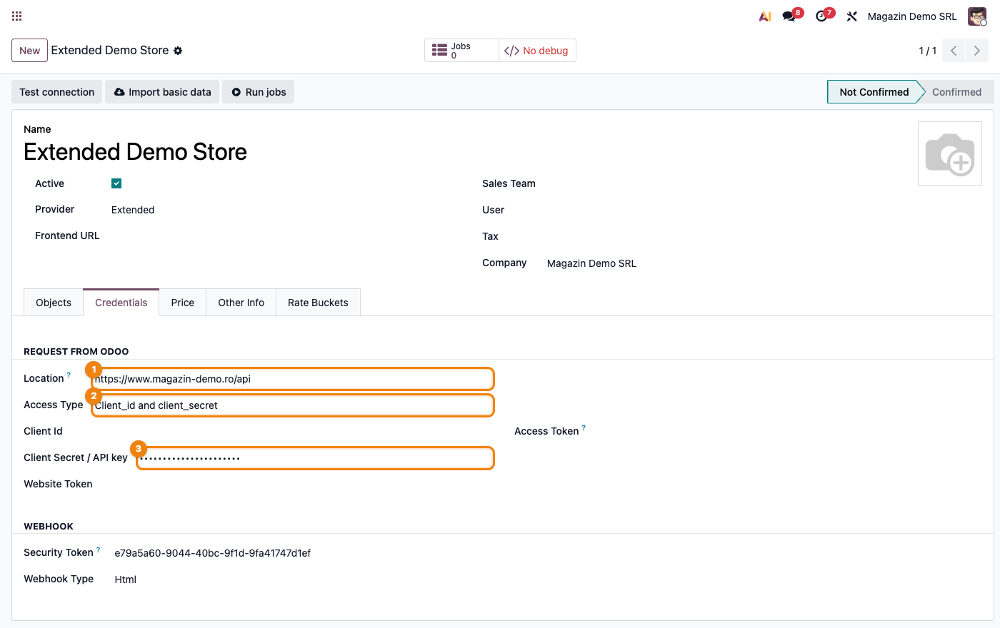
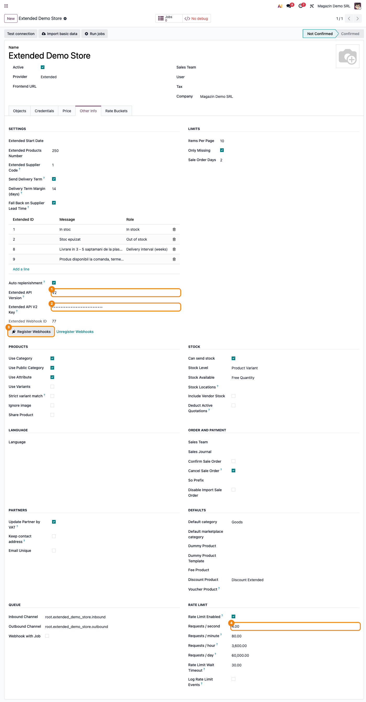
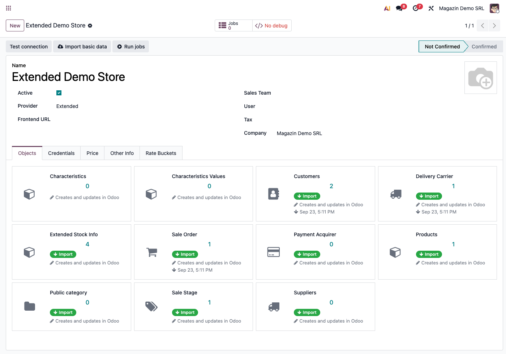
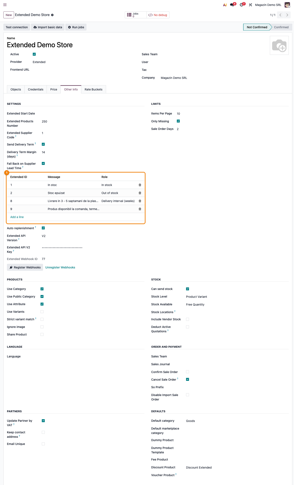
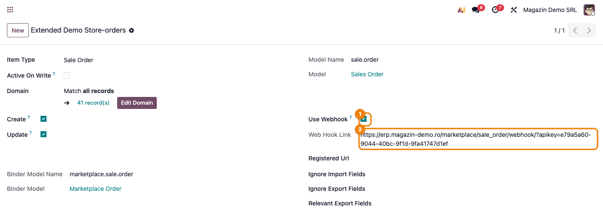
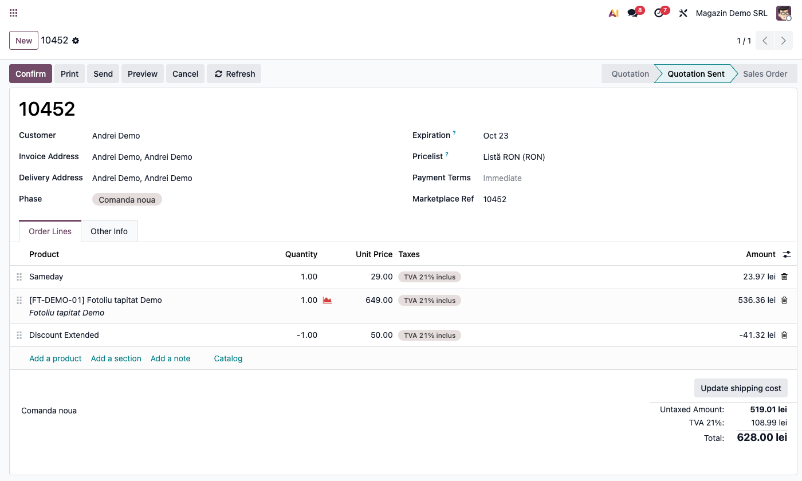
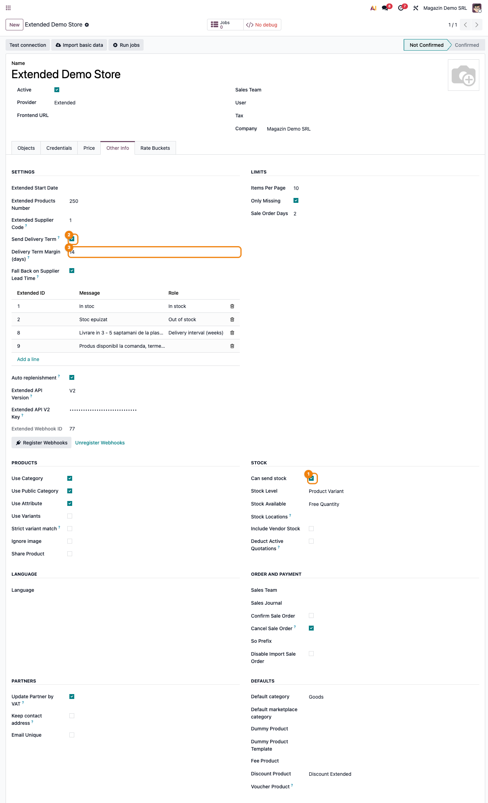
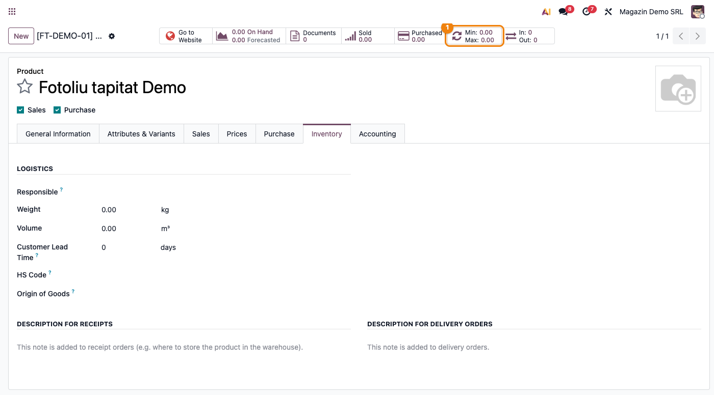
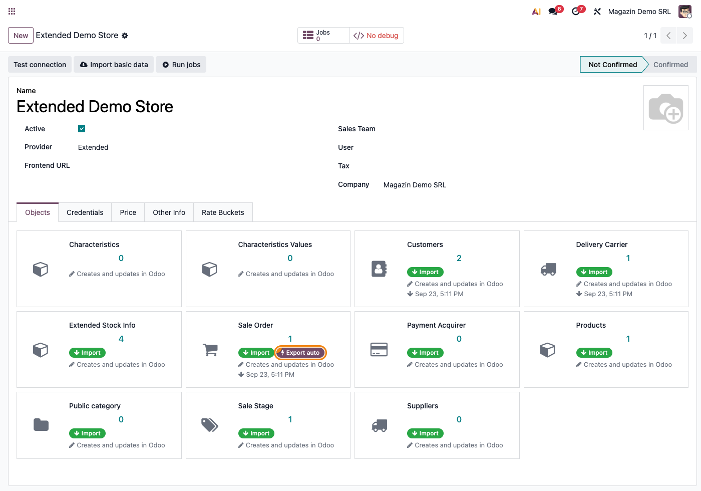

# Fișă Modul: Conector Extended.ro — API V1/V2, catalog, stoc informativ, comenzi și webhook-uri semnate

**Modul:** `deltatech_marketplace_extended`
**Utilizator principal:** Consultant Odoo / administrator funcțional (configurare inițială), operator e-commerce (utilizare curentă)
**Prioritate:** 🟡 Medie (conector de nișă, pentru clienți care vând prin platforma Extended.ro)

---

## 1. Scop business

Un magazin pe platforma **Extended.ro** folosit alături de Odoo, fără conector, înseamnă catalog,
furnizori, clienți și comenzi ținute manual în două locuri, plus mesaje de disponibilitate introduse
de mână pe fiecare produs. Modulul aduce automat în Odoo produsele, furnizorii, clienții, categoriile
publice, statusurile și comenzile din Extended, apoi **trimite înapoi** starea comenzii, numărul AWB
și legătura facturii PDF. Pe lângă un conector simplu de import/export, modulul calculează **în Odoo**
(nu în Extended) mesajul de disponibilitate pentru produsele fără stoc, poate pregăti automat
produsele importate pentru reaprovizionarea standard Odoo și, pe **Extended API V2**, primește
comenzile prin **webhook-uri semnate**, la câteva secunde după plasare, în loc să aștepte importul
programat. Folosește același framework (`deltatech_marketplace`) ca și conectorii Shopify,
WooCommerce sau PrestaShop, deci un magazin Extended adăugat lângă un canal existent nu înseamnă
învățarea unui al doilea sistem.

## 2. Arhitectură tehnică și context

Extended expune două API-uri pe domeniul fiecărui magazin, iar backend-ul Odoo alege versiunea din
câmpul **Extended API Version** (implicit **V1**):

- **V1 (legacy)** — `https://www.<magazin>.ro/api`, autentificare printr-un parametru `apikey`
  adăugat la fiecare cerere din câmpul comun **Client Secret / API key** (tab Credentials). Erorile
  vin ca `{"eroare": 1, "mesaj": "..."}`, iar conectorul le afișează operatorului ca atare. Extended
  îl menține pentru integrările existente, fără funcții noi, și nu a anunțat un termen de retragere.
- **V2** — `https://www.<magazin>.ro/api/v2`, derivat automat din **Location**. Cheia proprie V2
  (`ev2_<selector>_<secret>`, câmpul **Extended API V2 Key**) pleacă în antetul
  `Authorization: Bearer`, niciodată în adresă; fiecare cerere se prezintă cu un `User-Agent` propriu,
  pe care Extended îl cere obligatoriu. Erorile au coduri HTTP reale și un cod stabil (de exemplu
  `missing_scope`, `validation_error`), afișat în mesajul de eroare. Extended limitează fiecare cheie
  V2 la **4 cereri/secundă, 80/minut, 3.600/oră și 60.000/zi**; la trecerea pe V2, limitatorul de
  ritm al backend-ului se aliniază automat la aceste valori, iar un răspuns „prea multe cereri"
  reprogramează job-ul în loc să-l oprească.

**Ce trece prin V2 când versiunea e V2:** importul comenzilor, statusurile de comandă, metodele de
livrare și de plată, furnizorii, categoriile publice, plus trimiterea facturii, a AWB-ului și a
statusului comenzii. **Ce rămâne pe V1 și pe V2:** produsele, exportul de stoc și dicționarul de stoc
informativ — V2 nu expune liniile de furnizor ale unui produs și nu acceptă un mesaj de stoc cu text
liber, ambele folosite de conector. De aceea, **pe V2 cheia V1 rămâne necesară**, alături de cea V2.
Comenzile citite prin V2 trec prin aceeași rutină de import ca cele din V1, deci potrivirea
clienților, reducerile, linia de transport și plata se comportă identic.

Fiecare tip de date este un card în tab-ul **Objects** al backend-ului, cu propriile acțiuni
(Import, Export). La salvarea unui backend cu `Provider = Extended`, tab-ul se populează automat cu
tipurile acoperite: Products, Customers, Suppliers, Sale Order, Delivery Carrier, Payment Acquirer,
Public category, Characteristics, Characteristics Values, Sale Stage, Extended Stock Info. Toate
operațiunile rulează ca **job-uri în coadă**, vizibile din butonul **Jobs** al backend-ului.

## 3. Utilizatori și roluri

- **Administratorul magazinului în Extended Manager**: generează cheile de acces (V1 și V2) și le
  predă consultantului.
- **Consultant/administrator funcțional**: configurează backend-ul, alege versiunea API, înregistrează
  webhook-urile, rulează prima sincronizare, decide dacă activează reaprovizionarea automată și
  mesajul de termen de livrare.
- **Operator e-commerce**: urmărește comenzile importate, atribuie rolurile din dicționarul de stoc
  informativ, verifică job-urile eșuate din **Jobs**.

Drepturi de acces: meniul **Marketplace** cere grupul **Marketplace Manager**; câmpul **Extended API V2
Key** e vizibil și editabil doar pentru administratorii Odoo (grupul **Administration / Settings**),
deci cheia V2 o completează un administrator.

Roluri recomandate la testare:
- Administrator funcțional: instalează modulul, configurează backend-ul (inclusiv V2 și webhook-urile).
- Utilizator operațional: rulează importurile, urmărește comenzile și exportul de stoc.
- Manager/consultant: validează rezultatul (comenzi cu totalul corect, produse cu furnizori, mesaje de
  disponibilitate corecte).

## 4. Date și mapări implicate

Modulul nu generează note contabile proprii — comanda de vânzare importată urmează contabilizarea
standard Odoo (`sale`/`account`/`purchase_stock`). Datele de pregătit sau de înțeles înainte de prima
sincronizare:

- **Cheile de acces.**
  - **Cheia V1** (`apikey`) — din contul Extended, în **Client Secret / API key**.
  - **Cheia V2** — generată în Extended Manager, **Integrări → Extended API V2 → Acțiuni → Adaugă o
    cheie API**, cu doar permisiunile de care are nevoie conectorul: `orders:read`, `orders:update`,
    `shop:read`, `suppliers:read`, `categories:read` și, pentru webhook-uri, `webhooks:read`,
    `webhooks:create`, `webhooks:update`, `webhooks:delete`. Nu sunt necesare permisiuni pe produse,
    clienți, coșuri sau cupoane. O cheie dedicată integrării Odoo, cu MCP oprit, se poate suspenda
    din Manager fără să atingă alte integrări.
- **Secretul webhook-ului** — nu se completează manual și nu apare pe formular: Extended îl afișează
  **o singură dată**, la crearea abonamentului, iar butonul **Register Webhooks** îl păstrează intern. Cu secretul salvat, orice apel de webhook fără semnătură validă
  e respins.
- **Extended Supplier Code** (implicit `1`) — codul de furnizor sub care Odoo publică stocul propriu
  la export. Prin convenție, `1` înseamnă stocul propriu al magazinului; furnizorii externi, gestionați
  direct de Extended, au coduri proprii și nu sunt atinși. Schimbați câmpul doar dacă, la client,
  depozitul propriu e înregistrat sub alt cod.
- **Dicționarul de stoc informativ** — Extended lucrează cu un nomenclator fix de mesaje de
  disponibilitate. Perechile id → text se învață automat la importul de produse; rolul fiecărei
  intrări (In stock / Out of stock / Delivery interval (weeks) / Delivery period (month half)) se
  atribuie manual, o singură dată per backend.
- **Mesajul de termen de livrare** (opțiunea **Send Delivery Term**, dezactivată implicit) — pentru
  produsele fără stoc, în loc de „Lipsa stoc", se trimite: (a) o perioadă pe jumătăți de lună, dacă
  există o intrare de marfă programată de la furnizor, plus marja **Delivery Term Margin (days)**
  (implicit 14 zile); (b) un interval în săptămâni din termenul de livrare al produsului („Customer
  Lead Time"), cu opțiunea **Fall Back on Supplier Lead Time** de a folosi termenul liniei de furnizor
  principale. Fără niciun termen, mesajul rămâne „Lipsa stoc".
- **Reaprovizionare automată** (opțiunea **Auto replenishment**, dezactivată implicit) — la import,
  fiecare produs devine stocabil, primește ruta **Buy** și o regulă de comandă (min 0 / max 0,
  declanșator Auto) pe depozitul companiei, astfel încât o comandă confirmată ajunge automat la
  cererea de ofertă deschisă a furnizorului.
- **Furnizorii pe produs** se creează/actualizează automat la importul de produse (cod, preț de
  achiziție, monedă, furnizor principal).
- **Plata**: pe comanda importată se creează o tranzacție legată de metoda de plată Extended mapată.
  Ea devine **Done** doar dacă plata e confirmată de Extended **și** maparea metodei de plată are
  **Confirm Payment** bifat (implicit da); altfel rămâne în așteptare. O tranzacție Done declanșează
  mecanismul standard Odoo: se creează plata (nota ei depinde de jurnal, vezi „Note de monografie"),
  iar comanda se confirmă dacă plata atinge suma cerută pentru confirmare (implicit totalul) —
  indiferent de **Confirm Sale Order**. Confirmarea prin plată trimite **clientului un e-mail de
  confirmare din Odoo**, pe lângă cel din magazin, nu are loc dacă oferta cere semnătură online și
  rulează din acțiunea programată a modulului de plăți, deci nu e instantanee.
- **TVA** — Extended trimite prețuri **cu TVA inclus**, iar importul nu preia cota din Extended:
  taxa vine din produsul Odoo. Produsele, produsul transportatorului și **Discount Product** trebuie
  să poarte taxa de vânzare cu **cota magazinului** (21% sau, unde e cazul, 11%) configurată **inclusă
  în preț**. Cu o taxă exclusă din preț, comanda Odoo iese cu TVA peste totalul Extended; fără taxă,
  factura iese fără TVA. Transportul și taxa de ramburs intră în baza de impozitare a TVA, iar
  reducerea o micșorează (Codul fiscal, art. 286 alin. (3) lit. b), respectiv alin. (4) lit. a)).
- **Reducerea pe toată comanda** (cupon, promoție, puncte de fidelitate) devine o linie pe produsul
  din **Discount Product** al backend-ului. Pe V2 reducerea nu are linie proprie în comanda Extended,
  așa că conectorul o reface din diferența dintre totalul comenzii și liniile ei. E o singură linie,
  cu taxa produsului de reducere — pe o comandă cu cote TVA diferite (21% și 11%), repartizarea
  reducerii pe cote trebuie verificată manual.
- **Taxa de ramburs** (plata la livrare) se adaugă la **linia de transport**, pe ambele versiuni —
  de exemplu, transport 24 lei + ramburs 5 lei apar ca o singură linie de transport de 29 lei.

Date minime pentru demo: un magazin Extended de test cu cheie V1 și, pentru V2, o cheie V2 cu
permisiunile de mai sus; câțiva furnizori și produse, un client și o comandă existente pe platformă.

## 5. Configurare inițială

1. Instalați modulul `deltatech_marketplace_extended` (aduce și `deltatech_marketplace_sale`,
   `deltatech_marketplace_website`, `deltatech_marketplace_delivery`, `deltatech_marketplace_payment`,
   `deltatech_marketplace_sale_stage`, `purchase_stock`).
2. **Marketplace → Backends → Nou**, `Provider = Extended`.
3. Tab **Credentials**: **Access Type** = „Client_id and client_secret" (fără această alegere câmpul
   pentru cheie nu apare), **Location** = adresa API V1 a magazinului (`https://www.<magazin>.ro/api`)
   și **Client Secret / API key** = cheia V1. **Client Id** rămâne gol — Extended nu îl folosește.
4. Salvați — tab-ul **Objects** se populează automat cu tipurile de date ale conectorului.
5. Tab **Other Info**, grupul **Settings**, completați câmpurile Extended:
   - **Extended Products Number** — câte produse cere importul (implicit 10, aduse paginat);
   - **Extended Start Date** — de când se importă clienții (goală = ultimii 10 ani);
   - **Sale Order Days** (grupul **Limits**) — câte zile în urmă caută importul de comenzi, pe ambele
     versiuni;
   - **Extended Supplier Code** — codul propriu de furnizor pentru exportul de stoc (implicit `1`);
   - opțional **Send Delivery Term**, **Delivery Term Margin (days)**, **Fall Back on Supplier Lead
     Time**, **Auto replenishment**.
6. **Pentru V2**: în același grup, **Extended API Version = V2** și **Extended API V2 Key** = cheia V2.
   Grupul **Rate Limit** se aliniază automat la limitele V2 (4/secundă, 80/minut, 3.600/oră,
   60.000/zi); nu le măriți.
7. **Pentru webhook-uri (doar V2)**: verificați că parametrul de sistem `web.base.url` e adresa
   publică HTTPS a Odoo (Extended livrează doar către adrese publice), apoi apăsați **Register
   Webhooks**. Cardul **Sale Order** din Objects (meniul ⋮ → **Edit**) trebuie să aibă **Use Webhook**
   bifat (implicit da).
8. **Pentru exportul de stoc**: tab **Other Info**, grupul **Stock**, bifați **Can send stock** —
   fără ea, exportul de stoc e sărit (doar un avertisment în log).
9. Verificați câmpurile comune ale framework-ului: **Discount Product** (obligatoriu dacă apar reduceri
   pe comandă) și, dacă doriți, **Confirm Sale Order** pentru confirmarea automată a comenzilor. O
   comandă cu plata confirmată, care atinge suma cerută pentru confirmare, se confirmă oricum, prin
   plată.
10. Verificați taxele de vânzare ale produselor, ale produsului transportatorului și ale **Discount
    Product**: cota magazinului, **inclusă în preț** (vezi §4, „TVA").
11. Pe maparea fiecărei metode de plată, setați jurnalul de încasare dorit și, pe linia metodei de plată
    din jurnal, contul de încasări în curs (vezi „Note de monografie").

## 6. Flux de utilizare

### Pasul 1 — Credențialele V1 (tab Credentials)

**Marketplace → Backends → <backend-ul Extended>**, tab **Credentials**: **Access Type** este
„Client_id and client_secret" — altfel câmpul pentru cheie nu e afișat —, **Location** conține adresa
API V1 a magazinului, iar **Client Secret / API key** cheia V1 (afișată mascat). Adresa V2 nu se completează separat —
se obține automat din Location (`…/api` → `…/api/v2`).



### Pasul 2 — Setările Extended și versiunea API (tab Other Info)

Tab **Other Info**, grupul **Settings**: câmpurile specifice conectorului, inclusiv **Extended API
Version**. Cu **V2** selectat apar **Extended API V2 Key** (afișată mascat), **Extended Webhook ID** și
butoanele **Register Webhooks** / **Unregister Webhooks**. Grupul **Rate Limit** arată limitele V2
aplicate automat. Verificați pe ecran, înainte de a continua:
- versiunea selectată este cea dorită (V1 rămâne implicită; V2 se alege explicit);
- cheia V2 este completată (câmpul e obligatoriu pe V2);
- limitele din **Rate Limit** nu depășesc 4/secundă și 80/minut.

După **Register Webhooks**, câmpul **Extended Webhook ID** se completează cu id-ul abonamentului
creat în Extended, iar în chatter-ul backend-ului apare adresa înregistrată. **Unregister Webhooks**
(după confirmare) șterge abonamentul din Extended și uită id-ul și secretul salvate. **Test connection**
verifică doar cheia V2; pe V1 nu face niciun apel, deci cheia V1 se validează prin primul import.



### Pasul 3 — Prima sincronizare (tab Objects)

Tab-ul **Objects** are câte un card pe tip de date; acțiunile sunt în **meniul ⋮ al cardului**.
Ordinea recomandată la prima sincronizare:

1. **Suppliers** — necesari înainte de produse, pentru liniile de furnizor.
2. **Public category** — categoriile publice, cu ierarhia lor (înainte de produse, ca acestea să-și
   găsească categoriile).
3. **Sale Stage** — statusurile Extended, mapate pe fazele de vânzare Odoo.
4. **Payment Acquirer** și **Delivery Carrier** — metodele de plată și de livrare.
5. **Products** — paginat; aduce și furnizorii pe produs, dicționarul de stoc informativ și, cu **Use
   Attribute** activ, **Characteristics** / **Characteristics Values** (acestea nu au import separat).
6. **Customers** — pe ferestre de 15 zile de la **Extended Start Date**.
7. **Sale Order** — ultimul, ca liniile să găsească produsele și clienții deja importați.

Pe V2, pașii 1, 2, 3, 4 și 7 citesc prin V2; produsele și clienții rămân pe V1. Id-urile sunt aceleași
pe ambele API-uri, deci trecerea unui backend existent de pe V1 pe V2 nu dublează nimic.



### Pasul 4 — Dicționarul de stoc informativ (rol per intrare)

Tab **Other Info**, grupul **Settings**, lista cu coloanele **Extended ID**, **Message** și **Role**:
perechile id → text învățate la import. Alegeți pentru intrările relevante un **Role** — In stock, Out of stock, Delivery
interval (weeks), Delivery period (month half) — ca exportul de stoc să trimită id-ul Extended potrivit
împreună cu mesajul calculat în Odoo. Dacă lista e goală, rulați Import pe cardul **Extended Stock
Info** din Objects.



### Pasul 5 — Webhook-ul de comenzi (cardul Sale Order)

Din **Objects**, meniul ⋮ al cardului **Sale Order** → **Edit**: **Use Webhook** activează recepția, iar **Web Hook
Link** arată adresa de recepție a comenzilor. Pe V2, **Register Webhooks** abonează la evenimentele
„comandă nouă" și „schimbare de status" varianta HTTP a acestei adrese
(`…/marketplace/sale_order/webhook?apikey=…`) — chiar și când **Webhook Type** e `json`, variantă pe
care Extended nu o poate apela. Adresa exact înregistrată apare în chatter-ul backend-ului. Fiecare apel
e verificat după semnătura lui, iar comanda se importă printr-un job, deci răspunsul către Extended
pleacă imediat. Importul programat rămâne activ ca plasă de siguranță.



### Pasul 6 — Comanda importată

**Sales → Orders → Quotations** (sau **Orders**, după confirmare), comanda cu numărul din Extended: partenerul, adresele de livrare și facturare,
liniile de produs, **linia de transport** (cu taxa de ramburs inclusă, dacă e cazul), **linia de
reducere** pe produsul din **Discount Product** (dacă a existat o reducere pe comandă) și faza mapată
din statusul Extended. Verificați pe ecran:
- **totalul comenzii Odoo este egal cu totalul din Extended**, iar coloana **Taxes** arată cota
  magazinului pe fiecare linie — o diferență egală cu TVA-ul indică o taxă exclusă din preț, una egală
  cu taxa de ramburs sau cu reducerea, o mapare greșită a produsului de transport sau de reducere;
- transportatorul corespunde metodei de livrare din Extended.



### Pasul 7 — Exportul de stoc și mesajul de disponibilitate

Exportul de stoc pleacă doar dacă **Can send stock** este bifat (tab **Other Info**, grupul
**Stock**). Se declanșează prin acțiunile programate **Marketplace: export stock** și **Marketplace:
Export stock for all products**, sau manual, de pe un produs: **Action → Marketplace sync**, cu modul
**Stock**. Cardul **Products** din Objects nu are Export. Pentru fiecare produs se trimite cantitatea și un mesaj: „In stoc" dacă există
cantitate; altfel, cu **Send Delivery Term** activ, perioada sau intervalul calculat (vezi §4); altfel
„Lipsa stoc". Dacă dicționarul are o intrare cu rolul corespunzător, se trimite și id-ul ei. Exportul
merge pe V1 indiferent de versiunea aleasă.



### Pasul 8 — Reaprovizionare automată la import (opțional)

Cu **Auto replenishment** activ, fiecare produs importat devine stocabil, primește ruta **Buy** și o
regulă de comandă pe depozitul companiei, fără intervenție manuală. Pe fișa produsului, regula se vede
pe butonul **Min: 0.00 / Max: 0.00** din antet; click pe el deschide regula.



### Pasul 9 — Trimiterea înapoi către Extended: status, AWB și factură

Trei informații pleacă din Odoo spre Extended pe o comandă importată, cu reguli diferite:

- **Statusul comenzii** — doar cu **Active On Write** bifat pe cardul **Sale Order** (insigna
  „Export auto") **și** doar când faza comenzii Odoo se schimbă. Implicit e dezactivat.
- **Numărul AWB** — de fiecare dată când coletul e trimis la curier, **indiferent** de Active On
  Write. Eșuează explicit dacă transportatorul nu e mapat pe acest backend („Courier mapping is not
  done").
- **Factura** (număr, serie, dată, legătura PDF) — la fiecare postare de factură pe comandă,
  **indiferent** de Active On Write.

Pe V2, toate trei pleacă prin V2 și cer permisiunea `orders:update` pe cheie.



### Note de monografie și raportare

Modulul nu scrie note contabile proprii, dar fluxul pe care îl declanșează generează:

- **Încasarea, la plata confirmată.** Pentru o tranzacție Done, Odoo creează plata în jurnalul
  metodei de plată; dacă metoda nu are jurnal, conectorul creează automat un jurnal bancar
  **Marketplace Payment** (cod `MRPY`). Nota contabilă a plății depinde de configurarea acelui jurnal:
  - **cu un cont de încasări în curs** pe linia metodei de plată din jurnal (ex. 5125 „Sume în curs de
    decontare"): la plata confirmată, **Dr 5125 = Cr 4111 Clienți**, iar la reconcilierea extrasului,
    Dr 5121 = Cr 5125;
  - **fără acest cont** (situația implicită cu modulul Contabilitate): plata **nu generează notă**;
    nota apare abia la reconcilierea extrasului bancar, **Dr 5121 = Cr 4111**.

  Setați explicit jurnalul și contul de încasări în curs pe fiecare metodă de plată, în loc să lăsați
  jurnalul `MRPY` creat automat. Încasarea vine **înainte** de factură, deci e un avans: tratamentul lui
  (inclusiv exigibilitatea TVA la încasare) se validează cu contabilul clientului.
- **Factura**, emisă din comandă după fluxul standard. Pentru comanda din captura 06 (fotoliu 649,00,
  transport 29,00, reducere 50,00, toate cu TVA 21% inclus):

  | Cont | Debit | Credit |
  |---|---:|---:|
  | 4111 Clienți | 628,00 | |
  | 707 Venituri din vânzarea mărfurilor (reducerea) | 41,32 | |
  | 707 Venituri din vânzarea mărfurilor (fotoliul) | | 536,36 |
  | Contul de venit al produsului transportatorului (ex. 704) | | 23,97 |
  | 4427 TVA colectată | | 108,99 |
  | **Total** | **669,32** | **669,32** |

  Transportul și taxa de ramburs intră în baza TVA (Codul fiscal, art. 286 alin. (3) lit. b)), iar
  reducerea o micșorează (art. 286 alin. (4) lit. a)).
- **Reducerea de pe comandă** micșorează venitul pe aceeași factură: produsul **Discount Product** se
  configurează pe contul de venit al mărfurilor (707), cu aceeași taxă inclusă — nu pe 709, rezervat,
  prin funcțiunea contului din OMFP 1802/2014, reducerilor comerciale acordate ulterior facturării.
  Odoo postează linia de reducere ca **debit** separat pe 707, deci cifra de afaceri se citește din
  soldul net al contului (rulaj creditor minus rulaj debitor), nu doar din rulajul creditor.

## 7. Legături cu alte module / declarații

| Modul / proces | Rol în flux | Tip legătură |
|---|---|---|
| `deltatech_marketplace` | framework: backend, job-uri, tab Objects, limitator de ritm, rute webhook | dependență (manifest) |
| `deltatech_marketplace_sale` | comanda de vânzare, plata, reducerea, trimiterea status/AWB/factură | dependență (manifest) |
| `deltatech_marketplace_website` | categorii publice | dependență (manifest) |
| `deltatech_marketplace_delivery` | mapare transportator, linie de livrare, AWB | dependență (manifest) |
| `deltatech_marketplace_payment` | mapare metodă de plată Extended → provider Odoo | dependență (manifest) |
| `deltatech_marketplace_sale_stage` | mapare status Extended ↔ fază de vânzare Odoo | dependență (manifest) |
| `sale` / `purchase_stock` / `stock` / `account` | comandă, reaprovizionare, mișcări de stoc, factură | flux standard |

Ce este automat necondiționat: AWB-ul și factura ajung mereu la Extended; furnizorii pe produs și
dicționarul se actualizează la fiecare import de produse; pe V2 cu webhook-uri înregistrate, comenzile
noi și schimbările de status intră în Odoo la câteva secunde.
Ce este automat **doar cu Active On Write** pe cardul Sale Order: trimiterea statusului.
Ce rămâne manual: generarea cheilor în Extended Manager, alegerea versiunii, **Register Webhooks**,
prima sincronizare, rolurile din dicționar, taxele incluse în preț pe produse, jurnalele de încasare pe
metodele de plată, activarea **Can send stock**, **Send Delivery Term** și **Auto replenishment**.

## 8. Verificări pentru consultant

- [ ] Modulul se instalează fără erori (nu necesită bibliotecă Python externă).
- [ ] **Location** e adresa API V1 a magazinului și cheia V1 e validă (primul import de Suppliers
      reușește).
- [ ] Pe V2: cheia V2 are exact permisiunile din §4; **Test connection** reușește; grupul **Rate
      Limit** arată 4/secundă și 80/minut.
- [ ] Pe V2: cheia V1 a rămas completată — produsele și stocul o folosesc în continuare.
- [ ] Pe V2 cu webhook-uri: `web.base.url` e adresa publică HTTPS; după **Register Webhooks**,
      **Extended Webhook ID** e completat; o comandă de test plasată pe magazin apare în Odoo fără să
      aștepte importul programat.
- [ ] Prima sincronizare respectă ordinea din Pasul 3.
- [ ] **Extended Supplier Code** corespunde codului sub care Extended așteaptă stocul propriu.
- [ ] **Can send stock** e bifat dacă se dorește exportul de stoc.
- [ ] Dicționarul are cel puțin rolurile „In stock" și „Out of stock", dacă Extended trebuie să
      primească id-ul mesajului.
- [ ] Cu **Send Delivery Term**: marja e discutată cu clientul, iar produsele fără termen propriu au
      o intrare programată sau (cu fallback activ) un termen pe linia de furnizor principală.
- [ ] Cu **Auto replenishment**: depozitul companiei are locație de stoc configurată.
- [ ] **Discount Product** e setat; pe o comandă cu reducere și pe una cu plata la livrare, **totalul
      Odoo = totalul Extended**.
- [ ] Produsele, produsul transportatorului și **Discount Product** au taxa de vânzare cu cota
      magazinului, **inclusă în preț**; pe comanda importată, coloana Taxes arată cota pe fiecare linie.
- [ ] Fiecare metodă de plată mapată are jurnalul de încasare setat explicit (nu jurnalul `MRPY`
      creat automat), cu cont de încasări în curs dacă se dorește nota la plata confirmată; tratamentul
      încasării în avans e validat cu contabilul.
- [ ] Cardul **Public category** are acțiunea Import și categoriile apar în Odoo înainte de produse.
- [ ] Pentru trimiterea statusului: **Active On Write** e bifat pe cardul Sale Order.
- [ ] Transportatorii folosiți la expediere sunt mapați pe acest backend.
- [ ] Fluxul se reproduce cap-coadă cu date de test (furnizor → produs → comandă → export stoc).

## 9. Mesaje de eroare frecvente

| Mesaj / simptom | Cauză probabilă | Remediere |
|---|---|---|
| Mesajul întors de Extended, la orice apel V1 | V1 a răspuns cu eroare: cheie greșită/expirată, parametru lipsă | Verificați cheia V1; mesajul vine direct din Extended |
| „Extended API V2 401 invalid_token" / „token_expired" | Cheia V2 e greșită sau a expirat în Manager | Generați o cheie nouă și înlocuiți-o pe backend |
| „Extended API V2 403 missing_scope: …" | Cheii V2 îi lipsește permisiunea numită în mesaj | Adăugați permisiunea în Manager (vezi §4) |
| „Extended API V2 403 module_inactive" | Integrarea V2 e oprită pe magazin sau pachetul nu include webhook-urile | Activați Extended API V2 în Manager / verificați pachetul |
| „The Extended API V2 key is not set on backend …" | Versiunea e V2, dar cheia V2 lipsește | Completați **Extended API V2 Key** |
| „Enable the webhook on the orders item of backend … first." | **Use Webhook** e debifat pe cardul Sale Order | Bifați Use Webhook, apoi **Register Webhooks** |
| „Extended API V2 … without a JSON body" | Cererea a fost oprită de filtrul serverului magazinului, înainte de API | Verificați adresa (Location) și accesul la internet al serverului Odoo |
| Job reprogramat cu „too many requests" | S-a atins limita de cereri a cheii V2 | Nicio acțiune: job-ul se reia singur; nu măriți limitele din Rate Limit |
| „Courier mapping is not done" (job eșuat, în **Jobs**) | Transportatorul folosit la expediere nu e mapat pe backend | Importați/mapați Delivery Carrier, apoi reluați job-ul |
| „Discount product is not set for backend …" (job eșuat, în **Jobs**) | Comanda are reducere, iar **Discount Product** lipsește | Setați Discount Product, apoi reluați job-ul |
| Comanda Odoo are totalul mai mare decât în Extended cu exact TVA-ul | Taxa produsului e exclusă din preț | Configurați taxa inclusă în preț (§4, „TVA") |
| Statusul comenzii nu ajunge la Extended | **Active On Write** nu e bifat pe cardul Sale Order | Bifați Active On Write |
| Stocul nu ajunge la Extended | **Can send stock** nu e bifat | Bifați Can send stock (grupul Stock) |
| Produsele fără stoc rămân pe „Lipsa stoc", deși Send Delivery Term e activ | Produsul nu are termen de livrare, nicio intrare programată, iar fallback-ul e oprit | Setați termenul pe produs/furnizor sau activați fallback-ul |
| Job „failed" pe import de produse/comenzi | Date obligatorii neconfigurate pe backend | Citiți eroarea din **Jobs**, corectați configurarea, reluați job-ul |

## 10. Capturi de ecran

Capturile din `readme/screenshots/` sunt **generate automat** de
`tests/test_screenshots.py` (mixinul `ScreenshotCase` din `l10n_ro_doc_screenshots`, import defensiv),
pe un backend Extended de test cu date fictive. Interfața e în engleză, ca la ceilalți conectori
marketplace, deci etichetele din capturi sunt cele citate în fișă. Regenerare:

```bash
./odoo/odoo-bin -c odoo.conf -d <db> -i deltatech_marketplace_extended \
    --test-tags=fise_screenshots --stop-after-init
```

1. `01_credentials.png` — tab Credentials: tipul de acces, Location și cheia V1.
2. `02_extended_settings.png` — tab Other Info: setările Extended pe V2, cheia V2, webhook-ul înregistrat, limitele de ritm.
3. `03_objects.png` — tab Objects, cardurile tipurilor de date.
4. `04_stock_info_dictionary.png` — dicționarul de stoc informativ, cu rolurile atribuite.
5. `05_orders_webhook.png` — cardul Sale Order: Use Webhook și Web Hook Link.
6. `06_sale_order.png` — comanda importată: produs, transport și reducere.
7. `07_stock_export.png` — setările care decid exportul de stoc.
8. `08_auto_replenishment.png` — produsul importat, cu regula de comandă creată automat.
9. `09_active_on_write.png` — cardul Sale Order cu Active On Write activ.

## 11. Observații pentru manual

Subliniați ce e specific acestui conector: **alegerea versiunii API** (V2 aduce webhook-urile și
limitele de ritm, dar produsele și stocul rămân pe V1, deci ambele chei sunt necesare), calculul în
Odoo al mesajului de disponibilitate, dicționarul de mesaje configurat o singură dată per backend și
reaprovizionarea automată. Nu generalizați Active On Write la toate cele trei trimiteri către
Extended: el decide **doar** statusul comenzii; AWB-ul și factura pleacă întotdeauna. Tratați cheile
ca pe parole — nu le trimiteți pe e-mail sau în tichete; o cheie ajunsă unde nu trebuie se șterge din
Manager și se generează alta. Evitați detaliile de implementare (nume de câmpuri interne, parametri
API) în textul pentru utilizatorul final.
