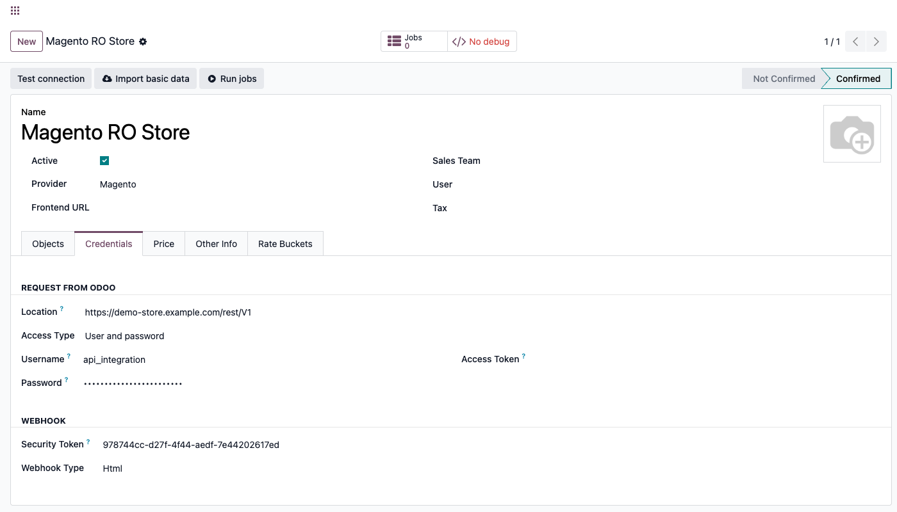
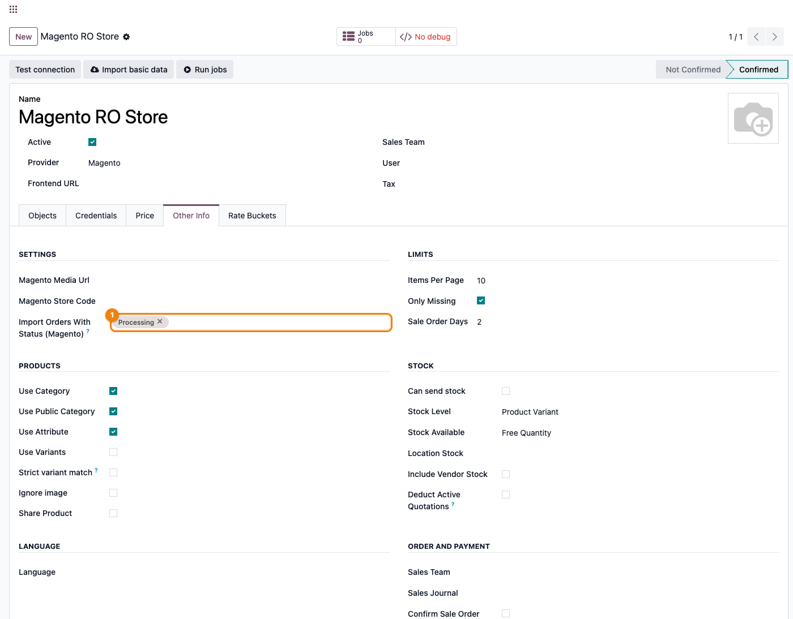
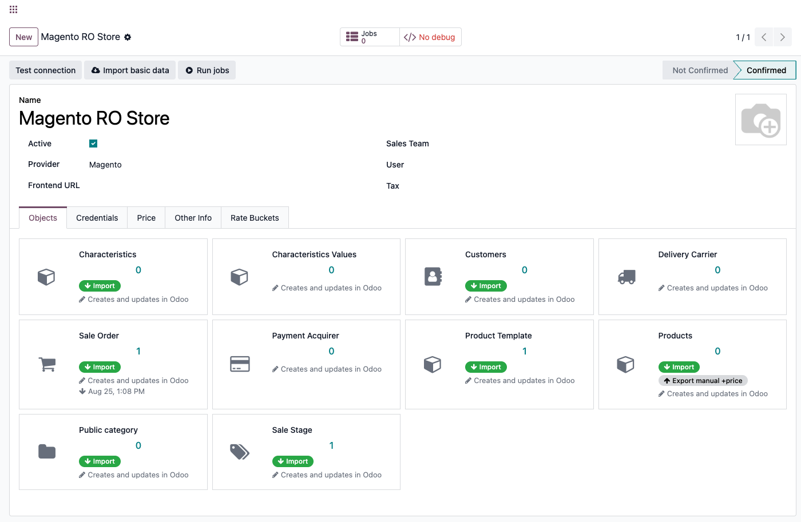
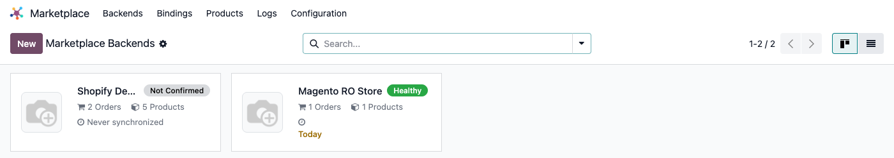

# Fișă Modul: Conector Magento — sincronizare produse, comenzi și stoc

**Modul:** `deltatech_marketplace_magento`
**Utilizator principal:** Consultant Odoo / administrator funcțional (configurare inițială), operator e-commerce (utilizare curentă)
**Prioritate:** 🔴 Ridicată (conector vandabil pe Odoo Apps Store, folosit de clienți cu magazine Magento reale)

---

## 1. Scop business

Un magazin Magento lângă Odoo, fără conector, înseamnă catalog, clienți și comenzi ținute manual
în două locuri: un produs configurabil cu variante trebuie recreat în Odoo, o comandă plasată pe
site trebuie reintrodusă, stocul se dezaliniază până cineva observă în cel mai nepotrivit moment.
Modulul închide acest gol: produsele (inclusiv cele configurabile, cu variante și atribute),
categoriile, clienții și comenzile se aduc automat din Magento în Odoo, iar stocul și prețul Odoo
se trimit înapoi spre magazin — dintr-un singur backend Odoo — și pentru că se leagă de același
framework comun (`deltatech_marketplace`) folosit și de conectorul Shopify, WooCommerce sau alții,
adăugarea unui magazin Magento lângă un canal deja folosit nu înseamnă învățarea unui al doilea
sistem.

## 2. Arhitectură tehnică și context

Modulul rulează pe **REST API-ul Magento** (`/rest/V1`, ex.
`https://mystore.example.com/rest/V1`), fără bibliotecă Python externă — comunicarea folosește
`requests`, deja parte din Odoo. Autentificarea este **token-based**: conectorul se autentifică cu
un cont admin Magento (**Username** / **Password**), prin `POST /integration/admin/token`, și
folosește token-ul returnat ca antet `Bearer` pentru fiecare apel următor — se obține automat, la
fiecare apel, din credențialele introduse. Tab-ul **Credentials** mai are, sub Username/Password,
un câmp **Access Token** — comun tuturor conectorilor din framework — care **nu se folosește** la
Magento: rămâne gol, completarea lui nu are niciun efect pentru acest conector.

Spre deosebire de WooCommerce (Consumer key/secret, `Access Type = client`), Magento folosește
`Access Type = User and password` (grupul de câmpuri Username/Password al framework-ului comun). Toate apelurile
HTTP au un timeout de 30 de secunde, iar erorile tranzitorii (HTTP 429/5xx, conexiune întreruptă,
timeout) fac ca job-ul de fundal să fie reîncercat automat, nu marcat definitiv eșuat.

Filtrul de import comandă din acest conector este diferit de cel al WooCommerce sau Shopify: nu
este o listă fixă de statusuri, ci un câmp populat **dinamic**, din statusurile deja aduse în Odoo
prin sincronizarea „Sale Stage" — inclusiv statusurile custom, specifice magazinului, nu doar cele
native Magento (`pending`, `processing`, `complete`, ...).

## 3. Utilizatori și roluri

- **Consultant/administrator funcțional**: configurează backend-ul, rulează sincronizarea de
  statusuri („Sale Stage") înaintea oricărui filtru de comandă, pornește prima sincronizare.
- **Operator e-commerce**: urmărește starea de sănătate a sincronizării, rezolvă job-urile eșuate,
  repetă manual importul de comenzi/produse/clienți noi (nu există un cron dedicat de import
  recurent în acest conector — doar export de stoc și preț folosesc cron-urile comune ale
  framework-ului).

Roluri recomandate la testare:
- Administrator funcțional: instalează modulul, configurează backend-ul, verifică meniurile.
- Utilizator operațional: rulează prima sincronizare și importurile ulterioare.
- Manager/consultant: validează rezultatul (comenzi importate, stoc/preț exportate, indicatorul de
  sănătate).

## 4. Date și mapări implicate

Nu există note contabile Dr/Cr generate direct de acest modul (asta ține de `sale`/`account`,
declanșate normal de comanda de vânzare creată din comanda Magento importată). Datele-cheie de
pregătit înainte de prima sincronizare:

- **Lista de prețuri** (`pricelist_id`, tab **Price**) — prețul importat din Magento (câmpul
  `list_price`, doar la produsele **configurable**, cf. §6 Pasul 4.3) ajunge aici; pentru produsele
  **simple**, prețul Magento **nu** e importat deloc (linia de cod care l-ar prelua e comentată
  intenționat) — un produs simplu importat separat își păstrează prețul din Odoo.
- **Categoria implicită / categorie marketplace implicită** (tab **Other Info → Defaults**) —
  folosite când produsul importat nu are o mapare mai specifică.
- **„Import Orders With Status (Magento)"** (tab **Other Info**) — Many2many pe fazele de vânzare
  deja sincronizate pentru acest backend; rămâne **gol și inutilizabil** până rulează cel puțin o
  dată sincronizarea „Sale Stage" (vezi §6, Pasul 3). Gol = importă orice status, comportamentul
  dinaintea acestui filtru.
- **Sale Order Days** (câmp comun al framework-ului, tab **Other Info → Limits**) — fereastra de
  import după dată; dacă filtrul de status e mai restrictiv decât această fereastră, o comandă care
  atinge statusul urmărit **după** ce fereastra a expirat nu mai e importată niciodată.
- **„Can send stock"** (tab **Other Info → Stock**, câmp comun al framework-ului) — trebuie bifat
  pentru ca produsele acestui backend să fie luate în calcul de cron-ul comun de export stoc.

Transportatorii, achizitorii de plată și fazele de vânzare **nu** cer o mapare manuală prealabilă:
se creează automat, în Odoo, în momentul în care o comandă importată referă pentru prima dată unul
inexistent încă. Acest conector **nu** are o noțiune proprie de depozit/warehouse mapat — stocul
exportat pleacă dintr-o singură locație de stoc (`location_stock_id` a backend-ului) și se scrie
întotdeauna pe sursa MSI Magento **`default`** (cod fix, neconfigurabil) — un magazin Magento cu
mai multe surse de stoc (Multi-Source Inventory) nu e suportat de acest conector.

Date minime pentru demo: un magazin Magento de test cu un cont admin (username/parolă) valid pentru
API, cel puțin un produs configurabil cu variante și atribute, un client și o comandă existentă în
magazin.

## 5. Configurare inițială

1. În Magento, identificați un cont admin cu drepturi API (**username/parolă**) sau creați unul
   dedicat integrării. Rețineți URL-ul bazei REST (`https://<magazin>/rest/V1`).
2. Instalați modulul `deltatech_marketplace_magento` (nu necesită nicio bibliotecă Python externă
   în afara celor deja incluse în Odoo).
3. Creați un backend nou: **Marketplace → Backends → Nou**, `Provider = Magento`.
4. În tab-ul **Credentials**, completați **Location** (URL-ul `/rest/V1`), **Access Type = User and password**,
   apoi **Username** / **Password** cu contul admin Magento.
5. Salvați. Salvarea cu `Provider = Magento` populează automat tab-ul **Objects** cu câte un rând
   pentru fiecare tip de date pe care îl acoperă conectorul: Products, Product Template,
   Customers, Sale Order, Public Category, Delivery Carrier, Sale Stage, Payment Acquirer,
   Characteristics și Characteristics Values.
6. Apăsați **Test connection** din antet — verifică efectiv obținerea unui token de la
   `/integration/admin/token` (nu doar completarea câmpurilor).
7. Apăsați **Import basic data** din antet — populează URL-ul de bază pentru media și codul
   magazinului, folosite mai târziu la construirea URL-urilor de imagine ale produselor.
8. Setați tab-ul **Price** (lista de prețuri) și, dacă doriți exportul de stoc/preț spre Magento,
   activați cron-urile comune „Marketplace: export stock" / preț din
   **Marketplace → Configuration → Crons** (dezactivate implicit) și bifați câmpurile de
   activare corespunzătoare pe item-urile din tab-ul **Objects**.

## 6. Flux de utilizare

### Pasul 1 — Configurarea backend-ului (Credentials)

Deschideți **Marketplace → Backends → Nou**, alegeți `Provider = Magento` și completați tab-ul
**Credentials**: adresa REST a magazinului (**Location**), **Access Type = User and password**, apoi
**Username** / **Password** cu contul admin Magento folosit pentru obținerea token-ului API.



### Pasul 2 — Testarea conexiunii

Apăsați **Test connection** din antetul formularului. Acest apel obține efectiv un token de la
Magento (`POST /integration/admin/token`) cu username/parola introduse; la succes, starea
(`State`) backend-ului trece pe **Confirmed**, condiție necesară ca indicatorul de sănătate să
poată deveni verde mai târziu. Un eșec ridică eroarea Magento/HTTP ca mesaj de validare, direct pe
ecran, înainte de a merge mai departe.

### Pasul 3 — Sale Stage ÎNAINTE de filtrul de comandă (obligatoriu în această ordine)

Statusurile de comandă Magento (inclusiv cele custom, specifice magazinului) sunt cunoscute de
Odoo **doar** după ce au fost sincronizate cel puțin o dată. Pe tab-ul **Objects**, găsiți cardul
**Sale Stage** și rulați acțiunea **Import** — apelează `/order/statuses` (un endpoint
nepaginat, spre deosebire de celelalte) și salvează fiecare status Magento ca o fază de vânzare
Odoo, cu eticheta reală din Magento, nu doar codul intern.

Abia după acest pas, câmpul **„Import Orders With Status (Magento)"** (tab **Other Info**) se
populează cu opțiuni reale de ales — înainte de acest pas e gol și nu poate filtra nimic. Alegeți
aici doar statusurile pe care chiar vreți să le importați (de exemplu doar „processing" și
„complete"); lăsat gol, importă orice status — comportamentul dinaintea acestui filtru.



> **Atenție la combinația filtru de status + fereastră de dată:** importul de comenzi mai
> restricționează și după dată, prin **Sale Order Days** (câmp comun al framework-ului). Dacă
> filtrul de status e mai restrictiv decât această fereastră, o comandă care atinge statusul
> urmărit **după** ce fereastra a expirat deja nu mai e importată niciodată — cele două setări se
> verifică împreună.

### Pasul 4 — Prima sincronizare (tab Objects)

Tab-ul **Objects** arată câte un card pentru fiecare tip de date — dar nu toate au buton de
**Import**: doar tipurile pe care conectorul le aduce direct din Magento printr-un apel propriu
(Characteristics, Public Category, Product Template, Products, Customers, Sale Order, Sale
Stage). **Characteristics Values**, **Delivery Carrier** și **Payment Acquirer** nu au niciun
buton pe card — valorile atributelor se creează automat, ca parte a importului
**Characteristics** (fiecare atribut Magento își aduce opțiunile odată cu el), iar transportatorul
și metoda de plată se populează automat, pe măsură ce o comandă importată le referă. Ordinea
recomandată pentru prima sincronizare (după Sale Stage, pasul anterior):

1. **Characteristics** — atributele de produs Magento, cu opțiunile lor (`/products/attributes`),
   înaintea produselor, ca acestea să se poată potrivi cu ele.
2. **Public Category** — categoriile publice Magento, ierarhic.
3. **Product Template** (produse **configurable**, cu variante și atribute) și **Products**
   (produse **simple**) — pornesc câte un job de fundal pe pagini. Produsele de tip **virtual**
   (produse nelivrabile — servicii, produse digitale) sunt sărite și **nu se importă deloc**;
   variantele produselor configurabile vin ca produse simple, prin importul de mai sus
   (`configurable_product_links`). Doar **Product Template** preia prețul Magento (`list_price`,
   direct din câmpul `price` al configurabilului); produsele **simple** importate separat NU
   preiau prețul (vezi §4). Imaginile se extrag doar dacă **Ignore Images** nu e bifat pe
   backend ȘI **Import basic data** (Pasul de configurare 7) a rulat deja.
4. **Customers** — clienții Magento, ca și contacte Odoo, cu toate adresele lor secundare.
5. **Sale Order** — ultimul, ca liniile de comandă să găsească deja produsele și clienții
   importați (chiar dacă nu-i găsesc, produsul lipsă e importat „din mers", pe loc). Fiecare
   comandă vine cu adresele de facturare/livrare, liniile, linia de transport (mapată la un
   transportator, creat automat dacă nu există încă), metoda de plată și eventuala linie de
   discount; statusul Magento al comenzii se mapează pe faza de vânzare adusă la Pasul 3.
   Spre deosebire de celelalte importuri (paginate după **Items Per Page**), comenzile se
   importă **câte una pe job** — la un istoric mare, coada va avea multe job-uri mici.

Toate aceste acțiuni rulează ca **job-uri în coadă** (queue jobs), nu sincron: după apăsarea unui
buton primiți o notificare „se va executa în fundal". Butonul **Jobs** din antetul backend-ului
arată coada, iar **Run jobs** forțează procesarea imediată (util într-o instanță Community fără
cron-ul job-runner deja pornit).



### Pasul 5 — Atribute de produs și „attribute set" la import

Fiecare produs **simple** importat își preia setul propriu de atribute Magento
(„attribute set") printr-un apel `GET /products/attribute-sets/<id>/attributes` — cache-uit în
memorie pentru durata unui singur lot de import (majoritatea produselor dintr-un catalog
folosesc același set, deci se evită câte un apel per produs, doar unul per set distinct întâlnit
în acel lot). Cache-ul nu e persistent, se reconstruiește la fiecare rulare. Valorile atributelor
definite de utilizator (nu cele de sistem, ca SKU) ajung ca valori externe pe produsul Odoo.
Aceasta e o sincronizare separată de **Characteristics**/**Characteristics Values** (Pasul 4.1,
via `/products/attributes`), care funcționează independent.

### Pasul 6 — Ce rulează automat după prima sincronizare

Stocul se exportă către Magento (bulk, `POST /inventory/source-items`) prin cron-ul comun
„Marketplace: export stock" (**Marketplace → Configuration → Crons**), **dezactivat implicit**.
Exportul nu e sincron (nu se întâmplă exact în momentul mișcării de stoc), dar orice mișcare de
stoc din Odoo **declanșează** rularea acestui cron, dacă e activ — deci actualizarea ajunge la
Magento în câteva secunde/minute, nu abia la ora fixă a cron-ului. **Condiție tăcută:** exportul
funcționează doar dacă **Stock Level** (tab Other Info → Stock) rămâne pe valoarea implicită
**Product Variant** — pe **Product Template**, acest conector nu are un export de stoc
implementat, iar eșecul e tăcut (doar în jurnal, fără eroare vizibilă operatorului).
Prețul se exportă (bulk, `POST /products/base-prices`, cu TVA inclus calculat din taxele produsului)
prin propriul buton **Export Price**/cron echivalent, dacă e configurat pe item. **Nu există import
de preț sau de stoc dinspre Magento** — direcția pentru amândouă e strict Odoo → Magento.

Comenzile, produsele sau clienții noi creați în Magento **după** prima sincronizare **nu** sunt
aduși automat de un cron dedicat în acest modul: se repetă manual acțiunea **Import** din tab-ul
Objects — cu excepția comenzilor, care pot ajunge și fără intervenție manuală, prin **webhook
Magento** (configurat pe backend, tab Credentials, secțiunea Webhook: Security Token, Webhook
Type); un webhook eșuat e reîncercat automat ca job de fundal, nu se pierde.

La confirmarea comenzii, la expediere (cu numărul de tracking) și la postarea facturii, conectorul
trimite automat înapoi spre Magento actualizarea corespunzătoare (`POST /erp/order-update`) — fără
niciun buton de apăsat, declanșat din ciclul de viață standard al comenzii/expedierii/facturii în
Odoo.

### Pasul 7 — Citirea stării de sănătate

Cardul kanban al backend-ului din **Marketplace → Backends** arată un indicator de sănătate
(„Not Confirmed"/„Healthy"/altă stare de eroare). Devine **„Healthy"** doar când toate condițiile
sunt adevărate simultan: backend-ul e confirmat (`Test connection` reușit), fără erori în ultimele
24h, fără job-uri eșuate, și cel puțin un tip de date are deja o sincronizare înregistrată. Un
backend confirmat dar neimportat încă rămâne cu starea „Never synchronized", nu „Healthy".



> Kanban-ul **Marketplace → Backends** e comun tuturor conectorilor instalați — pe o instanță cu
> mai multe conectoare de test/demo (ex. Shopify) e normal să apară și cardurile lor alături de cel
> Magento. Urmăriți cardul cu numele backend-ului configurat de voi.

### Note de monografie și raportare

Nu se aplică — acest modul nu generează note contabile proprii. Comanda de vânzare rezultată din
importul Magento urmează contabilizarea standard Odoo (`sale`/`account`), neatinsă de acest
conector.

## 7. Legături cu alte module / declarații

| Modul / proces | Rol în flux | Tip legătură |
|---|---|---|
| `deltatech_marketplace` | framework comun: backend, indicator de sănătate, job-uri, item-uri sincronizate | dependență (manifest) |
| `deltatech_marketplace_website` | integrare website (opțională) | dependență (manifest) |
| `deltatech_marketplace_sale` | comanda de vânzare Odoo generată din comanda Magento | dependență (manifest) |
| `deltatech_marketplace_delivery` | mapare transportator, linie de livrare pe comandă | dependență (manifest) |
| `deltatech_marketplace_payment` | mapare metodă de plată Magento → payment acquirer Odoo | dependență (manifest) |
| `deltatech_marketplace_sale_stage` | mapare status Magento ↔ fază de vânzare Odoo | dependență (manifest) |
| `sale` / `stock` / `account` | comanda de vânzare, mișcarea de stoc, factura rezultată — flux Odoo standard, neatins direct de acest modul | flux standard Odoo |

Ce este automat: crearea transportatorilor/achizitorilor de plată la prima referință dintr-o
comandă importată; push-back-ul comenzii (confirmare/expediere/facturare) spre Magento; retry-ul
webhook-urilor eșuate; exportul de stoc/preț, odată activate cron-urile/flag-urile corespunzătoare.
Ce rămâne manual: rularea „Sale Stage" înaintea filtrului de status (§6, Pasul 3); ordinea primei
sincronizări (§6, Pasul 4); repetarea periodică a importului de produse/clienți noi (fără cron
dedicat de import); activarea cron-urilor de export stoc/preț.

## 8. Verificări pentru consultant

- [ ] Modulul se instalează fără erori (nu necesită bibliotecă Python externă).
- [ ] Contul admin Magento folosit pentru API are drepturile necesare (autentificare +
      citire/scriere pe produse, comenzi, stoc, prețuri).
- [ ] **Test connection** confirmă credențialele (`State = Confirmed`) — verifică obținerea reală a
      unui token, nu doar completarea câmpurilor — înainte de orice import.
- [ ] **Import basic data** a rulat înainte de a te aștepta la imagini de produs importate.
- [ ] **Sale Stage → Import** a rulat ÎNAINTE de a configura „Import Orders With Status
      (Magento)" — altfel câmpul e gol și nu poate filtra nimic.
- [ ] Dacă „Import Orders With Status (Magento)" e mai restrictiv decât `Any`, fereastra
      `Sale Order Days` acoperă statusul urmărit înainte de a expira.
- [ ] Prima sincronizare respectă ordinea din Pasul 4 (atribute → categorii → produse → clienți →
      Sale Order, ultimul).
- [ ] Indicatorul de sănătate de pe cardul kanban e verde (confirmat, zero erori/job-uri eșuate,
      cel puțin o sincronizare înregistrată) după prima sincronizare reușită.
- [ ] Nu s-a promis clientului sincronizare sincronă a stocului — exportul pleacă la prima rulare
      a cron-ului comun (declanșat de orice mișcare de stoc, dacă e activ), nu instantaneu.
- [ ] **Stock Level** (tab Other Info → Stock) e pe **Product Variant** (implicit) — pe
      **Product Template**, exportul de stoc Magento nu rulează și nu semnalează nicio eroare.
- [ ] Nu s-a promis clientului import de preț sau de stoc dinspre Magento — acest conector exportă
      doar (Odoo → Magento) pentru amândouă.
- [ ] Clientul nu folosește Multi-Source Inventory (surse multiple) pe Magento — stocul se scrie
      mereu pe sursa `default`.
- [ ] Produsele **simple** importate separat NU preiau prețul Magento (linia de cod e dezactivată
      intenționat) — doar produsele **configurable** (Product Template) primesc `list_price` la
      import.
- [ ] Importurile ulterioare de produse/clienți noi sunt repetate manual — nu există un cron
      dedicat în acest modul; comenzile pot totuși ajunge automat prin webhook.
- [ ] Un webhook Magento configurat pe backend e testat cu o comandă de probă trimisă din Magento,
      cu rezultatul confirmat în **Jobs**/**Logs**, înainte de a fi folosit în producție.
- [ ] Clientul știe că acest conector nu gestionează mai multe depozite/gestiuni Magento — stocul
      exportat pleacă dintr-o singură locație Odoo per backend.

## 9. Mesaje de eroare frecvente

| Mesaj / simptom | Cauză probabilă | Remediere |
|---|---|---|
| `Test connection` eșuează cu eroare HTTP/Magento | URL greșit (fără `/rest/V1`), cont admin fără drepturi API, sau parolă greșită/expirată | Verificați URL-ul complet, drepturile contului admin, reîncercați |
| „Import Orders With Status (Magento)" e gol și nu poate fi completat | Sincronizarea „Sale Stage" nu a rulat încă pentru acest backend | Rulați **Import** pe cardul **Sale Stage** (tab Objects), apoi reveniți la câmp |
| O comandă cu un status ales în filtru nu ajunge niciodată în Odoo | Fereastra `Sale Order Days` a expirat înainte ca statusul filtrat să fie atins | Lărgiți fereastra sau lăsați filtrul de status gol |
| Stocul din Magento nu se actualizează niciodată | Cron-ul „Marketplace: export stock" e dezactivat (implicit) sau flag-ul de activare nu e bifat pe item | Activați cron-ul din **Marketplace → Configuration → Crons** și verificați configurarea item-ului **Products** |
| Un produs `simple` importat separat păstrează prețul vechi din Odoo | Comportament normal — importul de produse simple nu preia prețul Magento intenționat | Actualizați prețul manual în Odoo sau folosiți **Export Price** dacă direcția dorită e Odoo → Magento |
| Job în coadă rămâne „failed" cu `Attribute ... not found in Marketplace` | Produsul configurable referă un atribut/o valoare de atribut care nu a fost încă importată prin **Characteristics** | Rulați **Characteristics** (aduce automat și valorile atributelor sale), apoi requeue job-ul |
| Job în coadă rămâne „failed" (alt motiv) | Categorie de produs implicită sau alt câmp obligatoriu lipsă, referit de configurarea backend-ului | Verificați traceback-ul job-ului din **Jobs**, corectați configurarea, requeue |
| Un webhook Magento configurat ajunge cu eroare | Payload nevalid sau eroare temporară Magento/Odoo | Webhook-ul eșuat e reîncercat automat ca job de fundal — verificați rezultatul în **Jobs** |

## 10. Capturi de ecran

> Interfața din capturile de mai jos e în **engleză** (capturile s-au făcut cu `locale="en-US"`,
> ca la conectorii Shopify și WooCommerce) — etichetele reale de pe ecran sunt cele englezești,
> deși modulul are și o traducere parțială în `i18n/ro.po`.

Capturile (`readme/screenshots/`) ilustrează fluxul din secțiunea 6, generate cu
`ScreenshotCase`/Playwright (`tests/test_screenshots.py`, import defensiv, clasă separată de cea
folosită pentru capturile de marketing din `static/description/screenshots/`):

1. `01_credentials.png` — backend Magento, tab Credentials completat (Location, Access Type = User and password,
   Username/Password).
2. `02_order_status_filter.png` — tab Other Info: câmpul „Import Orders With Status (Magento)",
   populat după rularea Sale Stage.
3. `03_objects.png` — tab Objects: rândurile cu acțiunile de import per tip de date.
4. `04_health_badge.png` — indicatorul de sănătate pe cardul kanban al backend-ului.

Regenerare:

```bash
cd /Users/dhongu/Odoo/odoo19
./odoo/odoo-bin -c odoo_mp_test.conf -d mkt_test19 -u deltatech_marketplace_magento \
    --test-enable --test-tags=/deltatech_marketplace_magento:TestMagentoFisaScreenshots \
    --stop-after-init --http-port=8987 --gevent-port=8988
```

## 11. Observații pentru manual

În manualul final, păstrați accentul pe **ordinea obligatorie** a primei sincronizări — Sale Stage
ÎNAINTE de orice configurare a filtrului de status, apoi atribute/categorii înainte de produse,
Sale Order ultimul — și pe faptul că acest conector **nu are cron dedicat de import recurent**:
produsele/clienții noi se re-importă manual, doar comenzile pot ajunge automat prin webhook.
Subliniați explicit clientului cele două direcții stricte Odoo → Magento (stoc, preț) — fără
sincronizare inversă — și faptul că produsele **simple** nu preiau niciodată prețul Magento la
import (doar cele **configurable** o fac). Menționați că **Test connection** validează efectiv
obținerea unui token (apel real către magazin), nu doar completarea câmpurilor. Evitați alte
detalii de implementare (nume de câmpuri interne, endpoint-uri REST) în corpul explicației către
utilizatorul final.
