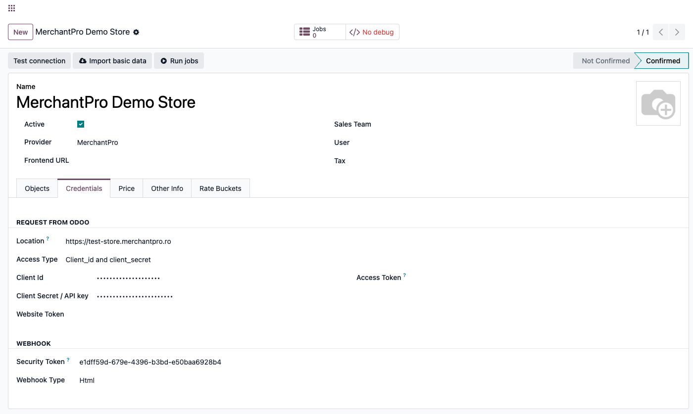
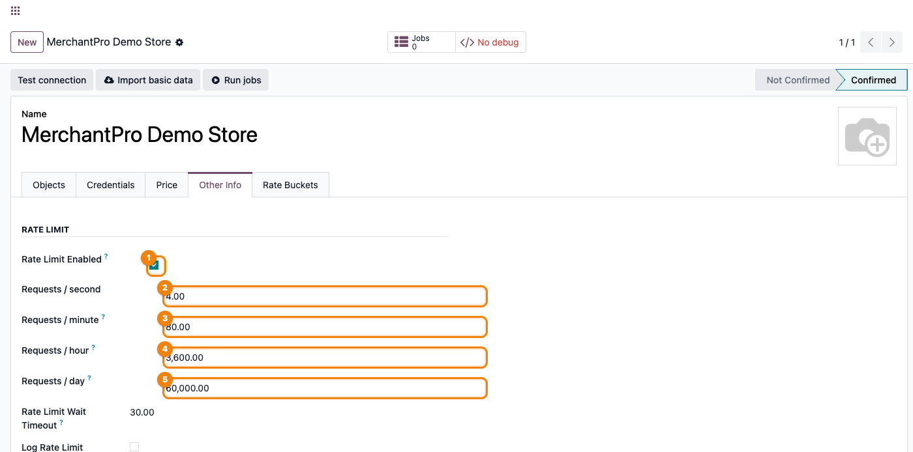
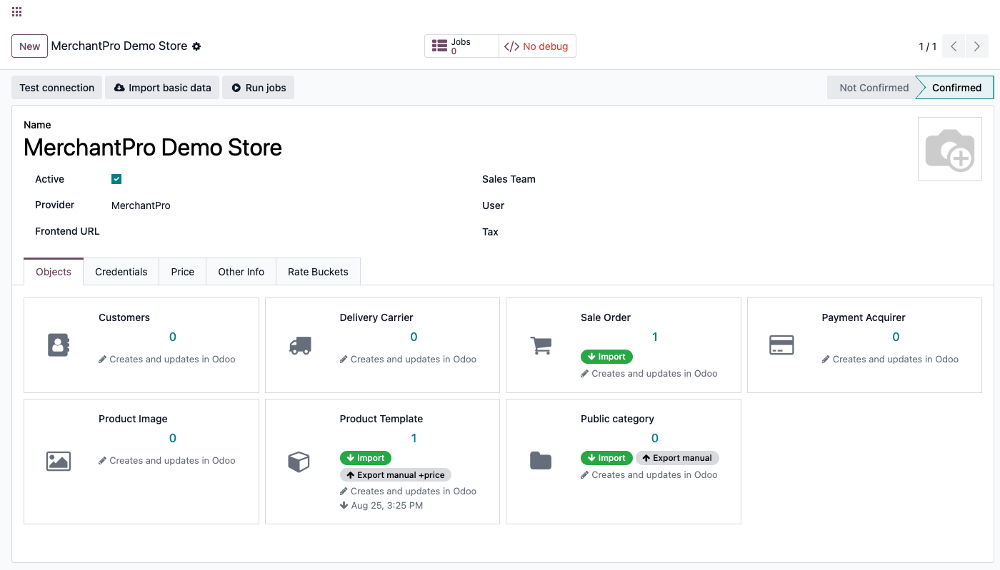
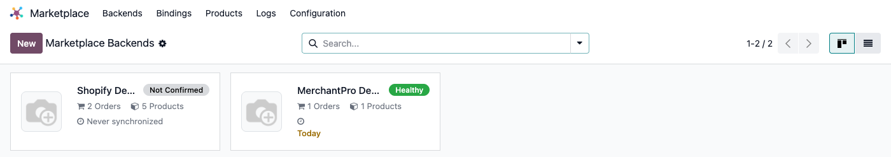

# Fișă Modul: Conector MerchantPro — produse, comenzi și stoc

**Modul:** `deltatech_marketplace_merchantpro`
**Utilizator principal:** Consultant Odoo / administrator funcțional (configurare inițială), operator e-commerce (utilizare curentă)
**Prioritate:** 🔴 Ridicată (conector vandabil pe Odoo Apps Store, folosit de clienți cu magazine MerchantPro reale)

---

## 1. Scop business

Un magazin MerchantPro lângă Odoo, fără conector, înseamnă catalog, stoc și comenzi ținute manual
în două locuri: o schimbare de preț sau de stoc făcută în Odoo nu ajunge singură pe vitrină, iar
fiecare comandă plasată pe magazin trebuie reintrodusă manual înainte de a putea fi onorată. Modulul
închide acest gol: produsele, categoriile, stocul și comenzile circulă automat între Odoo și
MerchantPro prin API-ul propriu V2 al platformei (`https://<magazin>.merchantpro.ro`), iar pentru că
se leagă de același framework comun (`deltatech_marketplace`) folosit și de conectorii Shopify,
Magento, Trendyol sau eMAG din suită, adăugarea MerchantPro lângă un canal deja folosit nu înseamnă
învățarea unui al doilea sistem.

## 2. Arhitectură tehnică și context

Modulul comunică cu **API-ul V2 al MerchantPro**, fără bibliotecă Python externă — folosește
`requests`, deja parte din Odoo. Autentificarea este **Basic Auth**: perechea **Client ID / Client
Secret** (emisă din panoul de administrare MerchantPro), introdusă în câmpurile generice ale
framework-ului cu `Access Type = Client_id and client_secret`, trimisă codificată Base64 în antetul
`Authorization` la fiecare apel.

Fiecare apel trece întâi prin token-bucket-ul comun al backend-ului
(`_rate_limit_acquire`), calibrat automat la limitele publicate de MerchantPro (4 cereri/secundă,
80/minut, 3600/oră, 60000/zi) — la alegerea `Provider = MerchantPro`, aceste patru valori sunt
completate automat pe grupul **Rate Limit** al tab-ului **Other Info**. Dacă MerchantPro răspunde
totuși cu **HTTP 429**, conectorul citește timpul de așteptare din `error.details.reset_time` al
răspunsului, când e prezent; altfel folosește un timp de rezervă de 60 de secunde (5 secunde dacă
timpul calculat e zero sau negativ) și ridică `RetryableJobError`, astfel încât `queue_job`
reîncearcă job-ul mai târziu, nu îl marchează definitiv eșuat. Un `HTTP 400/405/500` cu mesajul
exact `"Operation could not be completed"` este tratat la fel, ca eroare temporară, nu definitivă.

Spre deosebire de alți conectori din suită, exportul de preț/stoc (când e declanșat) se face
**sincron**, produs cu produs, prin `PATCH /api/v2/inventory/id/<id>` — nu printr-un batch asincron
cu verificare ulterioară. Declanșarea automată diferă însă între cele două: exportul de preț
(**Export Price**) rulează la cerere sau prin cronul de export preț; exportul de stoc la o mișcare
de stoc doar **declanșează** cronul „Marketplace: export stock" (livrat dezactivat) — vezi §6
Pasul 5 pentru detalii, inclusiv de ce, cu setarea implicită, nu se exportă nimic automat.

## 3. Utilizatori și roluri

- **Consultant/administrator funcțional**: configurează backend-ul (Location, Client ID/Secret),
  rulează primul import de categorii și produse, activează webhook-urile în panoul MerchantPro.
- **Operator e-commerce**: urmărește starea de sănătate a backend-ului, exportă manual preț/stoc
  când e nevoie, rezolvă job-urile eșuate, urmărește comenzile importate.

Roluri recomandate la testare:
- Administrator funcțional: instalează modulul, configurează backend-ul, verifică meniurile.
- Utilizator operațional: rulează prima sincronizare (categorii → produse → comenzi) și exportă
  preț/stoc pe un produs.
- Manager/consultant: validează rezultatul (comenzi importate, produse exportate, indicatorul de
  sănătate).

## 4. Date și mapări implicate

Nu există note contabile Dr/Cr generate direct de acest modul (asta ține de `sale`/`account`,
declanșate normal de comanda de vânzare creată din comanda MerchantPro importată). Datele-cheie de
pregătit înainte de prima sincronizare:

- **Location** (tab **Credentials**) — URL-ul magazinului MerchantPro folosit ca bază API (de
  exemplu `https://magazinultau.merchantpro.ro`).
- **Access Type = Client_id and client_secret**, apoi **Client Id** / **Client Secret / API key**
  (tab **Credentials**) — perechea de autentificare Basic Auth emisă din panoul MerchantPro.
- **Security Token** (grupul **Webhook**, tab **Credentials**) — folosit de MerchantPro pentru a
  apela înapoi webhook-urile de produs și de comandă; generat automat la crearea backend-ului, dar
  trebuie citit de-aici pentru a fi înregistrat în panoul MerchantPro.
- **Categoria produsului Odoo** (`public_categ_ids`) — deși exportul unui produs poate crea automat
  categoria lipsă pe MerchantPro (`POST /api/v2/categories`), legătura ei cu produsul ajunge pe
  MerchantPro; **importul** de produse (§6 Pasul 4) însă **nu** atașează categoria pe legătura Odoo
  a produsului, din cauza unui bug de cod (semnalat separat, nu se repară în acest PR) — de aceea
  ordinea recomandată la §5/§6 este să rulați ÎNTÂI **Import** pe cardul **Public category**.
- **Codul de bare (`barcode`)** — trimis ca `ean` dacă e completat, dar **nu este obligatoriu**:
  spre deosebire de Trendyol, un produs fără cod de bare poate fi creat pe MerchantPro.
- **Lista de prețuri a backend-ului** (`pricelist_id`, tab **Price**) — nu este sursa valorii
  trimise la export: decide doar **care produse** sunt considerate modificate (ce a intrat în
  domeniul „de exportat"), nu ce preț se trimite. Valoarea trimisă efectiv ca `price_net` este
  **`list_price` al produsului**, calculat fără TVA (`taxes_id.compute_all(...)["total_excluded"]`),
  indiferent de taxă (`price_include`).
- **„Sale Order Days"** (câmp comun al framework-ului, grupul **Limits**, tab **Other Info**) —
  implicit **2 zile**: fereastra de căutare `created_after` pentru importul paginat de comenzi. Nu
  este o plasă de siguranță completă — vezi §6 Pasul 8: importul paginat sare orice comandă al cărei
  `shipping_status` nu e `cancelled`/`delivered`/`shipped`/`returned`, deci nu recuperează o comandă
  nouă/în procesare ratată de webhook.
- **Comutatoarele din grupul „Products"** al tab-ului **Other Info** (**Use Category**, **Use
  Attribute**, **Use Configurable**, **Strict Variant Match**, **Ignore image**) — vizibile pe
  formular (fac parte din view-ul comun al framework-ului), dar **niciunul, inclusiv Ignore image,
  nu are efect la MerchantPro**: importul de produs setează `image_1920` direct din imaginea
  marcată `default` în răspunsul API, fără să treacă prin codul comun care respectă `Ignore image`
  la alți conectori.
- **Imaginea principală a produsului (`image_1920`) și atributele de variantă** — deși sunt citite
  ca parte a înregistrării produsului la export, blocul de cod care le-ar trimite efectiv către
  MerchantPro este dezactivat/lipsă în versiunea actuală (vezi §6 Pasul 6) — nu promiteți clientului
  că imaginea principală sau atributele de variantă ajung pe MerchantPro prin acest conector.
- **Active On Write** (comutator pe fiecare card din tab-ul **Objects**) — decide dacă modificările
  din Odoo pleacă automat la salvare, sau doar la export manual; badge-ul „Export manual"/„Export
  auto" de pe card reflectă starea lui (vizibil în captura de la §6 Pasul 4).

Date minime pentru demo: un magazin MerchantPro de test cu Client ID/Secret valide, cel puțin o
categorie și un produs cu barcode, o comandă existentă în cont.

## 5. Configurare inițială

1. În panoul de administrare MerchantPro, generați o pereche **Client ID** / **Client Secret**
   pentru integrare și notați URL-ul magazinului.
2. Instalați modulul `deltatech_marketplace_merchantpro` (nu necesită nicio bibliotecă Python
   externă în afara celor deja incluse în Odoo).
3. Creați un backend nou: **Marketplace → Backends → Nou**, `Provider = MerchantPro` — alegerea
   provider-ului completează automat limitele de rată din grupul **Rate Limit** (tab **Other
   Info**).
4. În tab-ul **Credentials**, completați **Location** (URL-ul magazinului), **Access Type =
   Client_id and client_secret**, apoi **Client Id** / **Client Secret / API key**.
5. Apăsați **Test connection** din antet — apelează efectiv `GET /api/v2/categories` (o pagină de
   un articol) cu credențialele introduse, nu doar validează completarea câmpurilor.
6. Deschideți itemul dorit din tab-ul **Objects** (de exemplu Products sau Sale Order) și copiați
   câmpul **Webhook link** direct din formular (vezi §6 Pasul 7) pentru a-l înregistra în panoul
   MerchantPro.
7. Din tab-ul **Objects**, rulați ÎNTÂI **Import** pe cardul **Public category** (arborele de
   categorii), apoi **Import** pe cardul **Product Template** — ordinea contează: importul de
   produse nu atașează singur categoria pe legătura Odoo (vezi §6 Pasul 4).
8. Pe tab-ul **Other Info**, bifați **Can send stock** dacă doriți exportul de stoc, și activați
   comutatorul **Active On Write** pe cardurile relevante din **Objects** dacă vreți export automat
   la salvare, nu doar manual.

## 6. Flux de utilizare

### Pasul 1 — Configurarea backend-ului (Credentials)

Deschideți **Marketplace → Backends → Nou**, alegeți `Provider = MerchantPro` și completați tab-ul
**Credentials**: **Location** (URL-ul magazinului), **Access Type = Client_id and client_secret**,
apoi **Client Id** / **Client Secret / API key**.



### Pasul 2 — Testarea conexiunii

Apăsați **Test connection** din antetul formularului. Acest apel obține efectiv un răspuns de la
lista de categorii MerchantPro (`GET /api/v2/categories`, o pagină de un articol) cu credențialele
introduse; la succes, starea (`State`) backend-ului trece pe **Confirmed** — condiție necesară ca
indicatorul de sănătate să poată deveni verde mai târziu. Un Client ID/Secret invalid ridică
eroarea MerchantPro/HTTP direct pe ecran, ca mesaj de validare.

### Pasul 3 — Limitele de rată (tab Other Info)

Alegerea `Provider = MerchantPro` a completat automat grupul **Rate Limit** de pe tab-ul **Other
Info**: 4 cereri/secundă, 80/minut, 3600/oră, 60000/zi — limitele publicate de MerchantPro. Aceste
valori pot fi ajustate manual dacă platforma vă alocă o cotă diferită.



### Pasul 4 — Import categorii, apoi produse (ordinea contează)

Din meniul cardului **Public category** (tab **Objects**), alegeți **Import** — arborele de
categorii (`GET /api/v2/categories`, paginat) intră cu ierarhia părinte/copil păstrată. **Rulați
acest pas ÎNAINTE de importul de produse**: importul de produse (mai jos) **nu** atașează singur
categoria pe legătura Odoo a produsului, indiferent de ordine — e un bug de cod cunoscut, semnalat
separat — dar categoriile trebuie oricum să existe deja în Odoo dacă vreți să le asociați manual
produselor importate.

Apoi, din meniul cardului **Product Template**, alegeți **Import**. **Import All** nu există pentru
acest conector (butonul e afișat de framework doar când există o metodă dedicată de import complet,
pe care acest modul nu o implementează) — un singur **Import** acoperă importul paginat complet.
Lista adusă din `GET /api/v2/products` (paginat) conține doar câmpurile cerute explicit —
id, nume, SKU (`default_code`), cod de bare (`ean`), preț fără TVA (`price_net`) și categoriile brute
din răspuns — **fără** descriere sau imagini la acest pas. Descrierea, imaginea implicită (dacă un
element din lista de imagini are `default: true`, devine `image_1920`) și imaginile suplimentare
ajung doar la un **import individual** al produsului (de exemplu prin **Reimport** pe legătură) sau
prin fluxul **Only Missing** (opțiune pe backend, tab **Other Info**, grupul **Limits**), care aduce
produsul complet, nu doar câmpurile minime ale listei. **Atenție:** orice import (listă sau
individual) **suprascrie** `list_price`-ul Odoo al produsului cu `price_net` de la MerchantPro, dacă
opțiunea **Ignore Price** nu e bifată pe backend — un preț modificat manual în Odoo poate reveni la
valoarea de pe MerchantPro la următorul import.



### Pasul 5 — Sincronizarea stocului (necesită cronul activ)

Pe tab-ul **Other Info**, grupul **Stock**, bifați **Can send stock** pentru a permite exportul de
stoc pentru acest backend. **Atenție — stocul NU pleacă automat la o mișcare de stoc, în ciuda
aparențelor din cod.** O mișcare de stoc confirmată/anulată/reasignată declanșează doar `_trigger()`
pe cronul comun **Marketplace: export stock** (`ir_cron_marketplace_export_stock`) — restul codului
care ar trimite direct stocul la fiecare mișcare este comentat/dezactivat în sursă. Iar acel cron
este **livrat dezactivat implicit**: declanșarea unui cron inactiv nu programează nimic (Odoo o
ignoră tăcut), deci cu setarea implicită **nu se exportă niciun stoc automat**. Ca stocul să ajungă
efectiv pe MerchantPro fără intervenție manuală, activați explicit cronul **Marketplace: export
stock** din **Setări → Tehnic → Acțiuni programate**. Fără el, singura cale este butonul **Export
Stock** de pe fiecare legătură din **Marketplace → Bindings → Products**, declanșat manual.

### Pasul 6 — Export/actualizare produs din Odoo

Butonul **Export** de pe legătura de produs (icon cloud-upload cu tooltip „Export to marketplace",
fără etichetă text — vizibil pe **Marketplace → Bindings → Products**) trimite înregistrarea către
MerchantPro: `POST /api/v2/products` pentru o legătură nouă, `PATCH /api/v2/products/<id>` pentru o
actualizare. Câmpurile trimise sunt: nume, descriere, SKU, cod de bare, preț (fără TVA), greutate,
stare activă/vizibilă la vânzare (`sale_ok`), categoria (creată automat pe MerchantPro dacă lipsește)
și orice **imagine suplimentară din galeria produsului** (`product_template_image_ids`) încă
netrimisă. **Imaginea principală a produsului (`image_1920`) nu este inclusă în această trimitere** —
blocul de cod care ar face-o există în fișierul sursă, dar este comentat/dezactivat în versiunea
actuală — și **niciun atribut de variantă nu este trimis**, deși `type` se marchează `multi_variant`
pentru un produs cu variante. Nu promiteți clientului transferul imaginii principale sau al
atributelor de variantă prin acest conector.

Prețul exportat separat (butonul **Export Price**, `mp_export_price`/`mp_call_price_export`) nu
provine din lista de prețuri a backend-ului (**Price**, `pricelist_id`) — acel câmp decide doar **ce
produse** intră în domeniul „modificate" de exportat, nu valoarea trimisă. Valoarea trimisă e
`list_price` al produsului, calculat fără TVA — dar **doar la actualizare și la Export Price**. La
**prima** creare a legăturii (`mp_create`), calculul taxei nu se aplică (particularitate de cod, de
verificat cu dezvoltatorul), așa că un produs cu taxă inclusă în preț poate pleca spre MerchantPro cu
prețul brut chiar la primul `POST`.

Dacă MerchantPro răspunde `404` (produsul a fost șters pe platformă) la o actualizare, legătura
locală este ștearsă automat, în loc să reîncerce la nesfârșit.

### Pasul 7 — Webhook-uri: cum ajung produsele și comenzile în timp real

Pe lângă importurile de mai sus, produsele și comenzile pot ajunge și **prin webhook**, în timp
real:

1. Deschideți itemul dorit (Products sau Sale Order) din tab-ul **Objects** — meniul ⋮ al cardului
   → **Edit** — și verificați că **Use webhook** e bifat (implicit da); doar atunci se calculează
   câmpul **Webhook link**, pe care îl copiați direct, fără să-l reconstruiți manual. Implicit
   (**Webhook Type = Html**, tab **Credentials**), formatul e
   `/marketplace/<tabel>/webhook/?apikey=<security_token>`; doar dacă schimbați **Webhook Type =
   Json** pe backend, formatul devine `/marketplace/<tabel>/json/<security_token>`.
2. Înregistrați URL-ul copiat în panoul de administrare MerchantPro, ca destinație pentru
   evenimentele de produs și de comandă. MerchantPro apelează acel URL ori de câte ori un produs e
   creat/actualizat sau o comandă e plasată.
3. Controllerul comun rezolvă backend-ul din token, identifică `marketplace.backend.item`
   corespunzător modelului și apelează `mp_webhook` pe legătura potrivită
   (`marketplace.product.template` sau `marketplace.sale.order`).
4. `mp_webhook` încearcă întâi să proceseze direct payload-ul; dacă ridică o eroare, se reprogramează
   singur ca job de fundal (`queue_job`), cu o cheie de identitate derivată din id-ul înregistrării,
   ca o eroare tranzitorie să nu piardă actualizarea.

### Pasul 8 — Import comenzi (buton „Import", plasă de siguranță PARȚIALĂ)

Cardul **Sale Order** (tab **Objects**) are propriul meniu **Import** (nu și **Import All**, din
același motiv ca la Product Template — nicio metodă dedicată de import complet):
`marketplace.sale.order.mp_import(backend, days=...)`, implicit pe fereastra **Sale Order Days**
(2 zile), interoghează `GET /api/v2/orders`. Comenzile noi sunt importate după id; comenzile deja
legate primesc doar o actualizare de stare plată/livrare (`mp_import_status`).

**Atenție — nu este o plasă de siguranță completă.** Importul paginat **sare** orice comandă al
cărei `shipping_status` MerchantPro nu este `cancelled`, `delivered`, `shipped` sau `returned` — o
comandă nouă sau încă „în procesare" ratată de webhook **nu** este recuperată nici prin acest buton,
nici printr-o rulare programată, cât timp rămâne în afara acestor patru stări. Singura cale reală de
recuperare pentru o astfel de comandă este verificarea directă în panoul MerchantPro și, dacă e
cazul, re-trimiterea manuală a webhook-ului din partea MerchantPro (sau așteptarea ca statusul să
avanseze într-una din cele patru stări urmărite).

Spre deosebire de **Sale Order**, cardurile **Customers**, **Delivery Carrier**, **Product Image** și
**Payment Acquirer** (tab **Objects**) **nu** au niciun meniu de import propriu — comportament
intenționat: acestea nu au o metodă `mp_import` proprie în acest conector, populându-se automat doar
ca efect secundar al importului de produse/comenzi (un client, un curier sau o metodă de plată apare
în Odoo prima dată când o comandă/un produs importat îl referă).

Pentru a rula importul de comenzi fără interfață (de exemplu dintr-un `ir.cron` propriu sau din
consola de dezvoltator), cu o fereastră diferită de cea implicită:

```python
backend = env["marketplace.backend"].browse(<id>)
env["marketplace.sale.order"].mp_import(backend, days=30)
```

### Pasul 9 — Ce aduce o comandă importată

Fiecare comandă importată aduce clientul și adresele de facturare/livrare (deduplicate cu conturile
deja existente), linia de transport (`shipping_amount` este cu TVA inclus; linia de livrare
primește prețul net dacă taxa transportatorului nu are TVA inclus, sau prețul brut dacă îl are — nu
apare dubla TVA raportată în versiunile mai vechi ale conectorului, corectată în `19.0.0.0.5`), și
liniile de produs (potrivite după id-ul de produs extern; produsele lipsă se importă automat „din
mers"). Transportatorul MerchantPro este căutat în Odoo **după nume exact**
(`shipping_method_name`) — dacă există un `delivery.carrier` cu același nume, comanda îl folosește
direct; altfel cade pe transportatorul generic **„Free Delivery"**.

Starea de plată/livrare adusă de MerchantPro conduce automat acțiunile din Odoo
(`mp_import_status`): `payment_status = paid`/`awaiting` înregistrează plata (și autorizează sau
confirmă tranzacția); `shipping_status = shipped`/`delivered` confirmă oferta (dacă mai e ciornă/
trimisă), validează livrarea și marchează recepția; `shipping_status = cancelled` sau
`payment_status = cancelled` anulează comanda, dacă nu e deja anulată. Confirmarea inițială a
comenzii (dacă rămâne ofertă sau se confirmă direct) urmează politica **Confirm Sale Order** a
backend-ului, câmp comun al framework-ului.

### Pasul 10 — Repararea prețurilor pe comenzi deja importate (dublă TVA)

Comenzile importate în perioada afectată de bug-ul de dublă TVA pe transport (versiuni
`19.0.0.0.x` anterioare lui `.0.5`) pot fi corectate cu:

```python
backend.action_fix_import_prices(days=90, dry_run=True)
```

Re-citește comenzile afectate din `GET /api/v2/orders` (paginat, cu același backoff de limitare de
rată) și rescrie `price_unit` pe liniile de produs și de transport acolo unde diferă de valorile
proprii ale API-ului. Idempotent — liniile deja corecte rămân neatinse — și sare o linie dacă SKU-ul
produsului nu mai corespunde comenzii (avertisment în jurnal). Comenzile blocate sau care nu mai
sunt în starea `sale` sunt sărite. Se rulează pe backend-ul dorit (`backend.action_fix_import_prices(...)`,
nu global) — apelul doar **programează** job-uri de fundal (`with_delay`), pagină cu pagină; rezultatul
real se citește din jurnal/**Jobs** DUPĂ ce rulează, nu imediat la apel. Nu există buton în interfață —
se rulează dintr-o acțiune de server, un `ir.cron` de o singură dată sau din consola de dezvoltator.
Setați `dry_run=False` pentru a scrie efectiv prețurile corectate.

### Pasul 11 — Citirea stării de sănătate

Cardul kanban al backend-ului din **Marketplace → Backends** arată un indicator de sănătate
(„Not Confirmed"/„Healthy"/altă stare de eroare) — logica e complet generică din framework,
MerchantPro nu o suprascrie. Devine **„Healthy"** doar când backend-ul e confirmat (`Test
connection` reușit), fără erori în ultimele 24h, fără job-uri eșuate, și cel puțin o sincronizare
înregistrată. Un backend confirmat dar neimportat încă rămâne cu starea „Never synchronized", nu
„Healthy".



> Kanban-ul **Marketplace → Backends** e comun tuturor conectorilor instalați — pe o instanță cu
> mai multe conectoare de test/demo e normal să apară și cardurile lor alături de cel MerchantPro.
> Urmăriți cardul cu numele backend-ului configurat de voi.

### Note de monografie și raportare

Acest modul nu generează note contabile proprii — comanda de vânzare rezultată din importul
MerchantPro urmează contabilizarea standard Odoo (`sale`/`account`). O excepție de reținut: importul
unei comenzi cu `payment_status = paid`/`awaiting` poate crea automat, prin fluxul standard al
framework-ului (`create_payment`), un jurnal bancar **„Marketplace Payment"** (cod `MRPY`) și o
plată/tranzacție asociată comenzii, dacă metoda de plată MerchantPro nu are deja un jurnal mapat
(și codul ei intern nu e `custom`, `transfer` sau `none` — cazuri care nu mai creează jurnalul
generic). Notele contabile rezultate sunt cele standard Odoo pentru o plată — dar **validați
maparea metodei de plată înainte de producție**, ca o plată MerchantPro reală să nu ajungă contabil
pe un jurnal generic creat automat.

## 7. Legături cu alte module / declarații

| Modul / proces | Rol în flux | Tip legătură |
|---|---|---|
| `deltatech_marketplace` | framework comun: backend, indicator de sănătate, job-uri, rate-limiting, webhook | dependență (manifest) |
| `deltatech_marketplace_sale` | comanda de vânzare Odoo generată din comanda MerchantPro, politica de confirmare, repararea prețurilor de import | dependență (manifest) |
| `deltatech_marketplace_payment` | metoda de plată creată automat la prima comandă importată (mapată implicit la „Wire Transfer" Odoo) | dependență (manifest) |
| `deltatech_marketplace_delivery` | infrastructura de mapare a curierilor — potrivire pe nume exact cu un `delivery.carrier` existent, altfel „Free Delivery" | dependență (manifest) |
| `deltatech_marketplace_website` | legătura de categorie publică (`marketplace.public.category`) | dependență (manifest) |
| `queue_job` | job-urile de import/export paginat și `RetryableJobError` pe limita de rată (429) | dependență tehnică |

Ce este automat: crearea categoriei lipsă pe MerchantPro la exportul unui produs (dar nu legarea ei
pe importul de produse — vezi §6 Pasul 4); deduplicarea clienților/adreselor la import; declanșarea
cronului de export de stoc la fiecare mișcare de stoc — DOAR dacă acel cron e activat manual (vezi
§6 Pasul 5, e dezactivat implicit, iar declanșarea unui cron inactiv nu face nimic); sincronizarea
stării de plată/livrare a comenzii pentru statusurile urmărite
(`cancelled`/`delivered`/`shipped`/`returned`); ștergerea legăturii locale a unui produs dacă
MerchantPro răspunde 404 la o actualizare; reîncercarea automată a job-urilor eșuate temporar
(HTTP 429 sau „Operation could not be completed"); politica de confirmare a comenzii (`Confirm Sale
Order`) aplicată automat la import.

Ce rămâne manual: legarea categoriei pe produsele deja importate (bug de cod, semnalat separat);
exportul imaginii principale a produsului și al atributelor de variantă — nu sunt trimise de acest
conector în versiunea actuală; atribuirea unui `delivery.carrier` cu numele exact al metodei de
transport MerchantPro, dacă se dorește evitarea căderii pe „Free Delivery"; rularea reparării de preț
pe comenzi vechi (`action_fix_import_prices`, fără buton în interfață); recuperarea unei comenzi
noi/„în procesare" ratate de webhook (importul paginat nu o acoperă — vezi §6 Pasul 8); copierea
URL-ului de webhook din itemul din **Objects** și înregistrarea lui în panoul MerchantPro; importul
cardurilor **Customers**, **Delivery Carrier**, **Product Image** și **Payment Acquirer** — nu au
buton propriu, se populează doar din comenzi/produse; validarea mapării jurnalului de plată
(„Marketplace Payment"/`MRPY`) înainte de producție.

## 8. Verificări pentru consultant

- [ ] Modulul se instalează fără erori (nu necesită bibliotecă Python externă).
- [ ] **Test connection** confirmă credențialele (`State = Confirmed`) — verifică apelul real la
      lista de categorii MerchantPro, nu doar completarea câmpurilor — înainte de orice import.
- [ ] Limitele din grupul **Rate Limit** (tab **Other Info**) au fost completate automat la
      `Provider = MerchantPro` (4/s, 80/min, 3600/oră, 60000/zi) — verificați că nu au fost
      suprascrise accidental cu valori mai mari decât cota reală alocată de MerchantPro.
- [ ] Clientul știe că exportul unui produs **nu** trimite imaginea principală (`image_1920`) și
      **niciun atribut de variantă** — doar imaginile suplimentare din galerie, în versiunea
      actuală a conectorului.
- [ ] Clientul știe că doar cardurile **Sale Order**, **Product Template** și **Public category**
      (tab **Objects**) au meniu de **Import** — **niciunul** dintre cele trei nu are **Import All**
      (nicio metodă de import complet dedicată) — **Customers**, **Delivery Carrier**, **Product
      Image** și **Payment Acquirer** se populează automat, fără buton propriu.
- [ ] S-a rulat ÎNTÂI **Import** pe cardul **Public category**, apoi pe **Product Template** —
      importul de produse **nu** atașează singur categoria pe legătura Odoo (bug de cod cunoscut).
- [ ] Nu s-a promis clientului că lista adusă de **Import** pe Product Template conține deja
      descrierea și imaginile — acel pas aduce doar id/nume/SKU/cod de bare/preț; descrierea și
      imaginile ajung doar la import individual sau prin **Only Missing**.
- [ ] Nu s-a promis clientului că un produs fără **cod de bare** e blocat la export — la
      MerchantPro, spre deosebire de alți conectori, nu este obligatoriu.
- [ ] Clientul știe că **Price → lista de prețuri** decide doar ce produse sunt „modificate" pentru
      export — valoarea prețului trimis rămâne `list_price` al produsului, nu una din pricelist.
- [ ] O comandă importată are un transportator Odoo cu **numele identic** cu metoda de livrare
      MerchantPro, dacă se dorește evitarea căderii pe transportatorul generic „Free Delivery".
- [ ] URL-ul de webhook e **copiat direct** din câmpul **Webhook link** al itemului (nu reconstruit
      manual) — implicit e formatul `.../webhook/?apikey=...` (Webhook Type = Html), nu
      `.../json/...` decât dacă s-a schimbat explicit pe **Json**.
- [ ] Clientul știe că **„Sale Order Days"** este implicit doar **2 zile** — și că importul paginat
      NU e o plasă de siguranță completă: sare orice comandă al cărei status nu e deja
      `cancelled`/`delivered`/`shipped`/`returned`, deci nu recuperează o comandă nouă/„în procesare"
      ratată de webhook.
- [ ] **Can send stock** (tab **Other Info**, grupul **Stock**) e bifat ȘI cronul **Marketplace:
      export stock** e activat manual din **Setări → Tehnic → Acțiuni programate** — cu setarea
      implicită (cron dezactivat), o mișcare de stoc nu exportă nimic automat, oricât de des se
      repetă vânzarea; singura cale rămasă e butonul **Export Stock** manual.
- [ ] Nu s-a promis clientului că importul de produs păstrează prețul editat manual în Odoo — dacă
      **Ignore Price** nu e bifat pe backend, orice import (listă sau individual) suprascrie
      `list_price` cu valoarea de la MerchantPro.
- [ ] Comutatoarele din grupul **Products** (Use Category, Use Attribute, Use Configurable, Strict
      Variant Match, Ignore image) sunt vizibile pe formular, dar **niciunul nu are efect** la
      MerchantPro — nu au fost promise clientului ca funcționale pe acest conector.
- [ ] Nu a fost promisă clientului rezolvarea automată a unui articol respins de MerchantPro la
      export — eroarea (`400`/`405`/`500` nedefinite ca temporare) oprește exportul cu mesajul exact
      primit de la API, nu îl retrimite singur.
- [ ] Dacă backend-ul a rulat pe o versiune anterioară `19.0.0.0.5`, verificați dacă e nevoie de
      `action_fix_import_prices` pentru comenzile deja importate cu dubla TVA pe transport — rularea
      doar programează job-uri de fundal, rezultatul se vede în jurnal după ce acestea execută.
- [ ] Metoda de plată MerchantPro folosită la teste are un jurnal mapat corect, ca importul unei
      comenzi plătite să nu creeze implicit jurnalul generic „Marketplace Payment" (`MRPY`).
- [ ] Indicatorul de sănătate de pe cardul kanban e verde (confirmat, zero erori/job-uri eșuate, cel
      puțin o sincronizare înregistrată) după prima sincronizare reușită.

## 9. Mesaje de eroare frecvente

| Mesaj / simptom | Cauză probabilă | Remediere |
|---|---|---|
| `Test connection` eșuează cu eroare HTTP/MerchantPro | Location greșit sau Client ID/Secret invalide | Verificați URL-ul magazinului și perechea Client ID/Secret în panoul MerchantPro, reîncercați |
| `Error:... for parameters:...` la export/import | MerchantPro a răspuns 400/405/500 cu un mesaj de eroare definitiv | Citiți mesajul exact în eroare (conține detaliile MerchantPro), corectați datele, reîncercați manual |
| Job în coadă rămâne „failed" cu `RetryableJobError` / limită de rată | 429 primit de la MerchantPro sau răspuns „Operation could not be completed" | De regulă se reîncearcă automat; dacă reîncercările s-au epuizat, requeue manual din **Job Queue → Queue → Jobs** (sau butonul **Jobs** din antetul backend-ului) |
| Stocul nu se actualizează niciodată pe MerchantPro, deși produsele se vând în Odoo | **Can send stock** e bifat, dar cronul **Marketplace: export stock** e dezactivat (implicit) — o mișcare de stoc doar declanșează cronul, nu trimite direct nimic | Activați cronul din **Setări → Tehnic → Acțiuni programate**, sau folosiți manual butonul **Export Stock** |
| Imaginea principală a produsului nu ajunge pe MerchantPro | Comportament curent al conectorului — codul care ar trimite `image_1920` este dezactivat | Nu este un defect de configurare; produsul trebuie completat manual pe MerchantPro sau se așteaptă o versiune viitoare |
| Un produs cu variante ajunge pe MerchantPro fără atributele lui | Exportul de atribute de variantă nu este implementat în acest conector | Completați atributele manual pe MerchantPro, sau contactați dezvoltatorul pentru extindere |
| Un preț editat manual în Odoo revine la valoarea veche după un import | **Ignore Price** nu e bifat pe backend — orice import de produs suprascrie `list_price` cu `price_net` de la MerchantPro | Bifați **Ignore Price** dacă Odoo nu trebuie să preia prețul de pe MerchantPro |
| O comandă nouă/„în procesare" nu apare deloc în Odoo, deși nu a fost anulată | Importul paginat sare orice comandă al cărei `shipping_status` nu e `cancelled`/`delivered`/`shipped`/`returned`; webhook-ul e singura cale pentru acel status | Verificați webhook-ul MerchantPro (livrare, jurnal); nu există recuperare prin buton pentru acest caz |
| Categoria lipsește pe un produs adus prin **Import** pe Product Template | Bug de cod cunoscut — `external_public_category_ids` e calculat după `save_from_marketplace`, deci ignorat la import | Asociați manual categoria pe produs după import, sau așteptați remedierea (semnalată separat) |
| Cardul **Customers**/**Delivery Carrier**/**Product Image**/**Payment Acquirer** nu are meniu de import | Comportament intenționat — aceste tipuri nu au un import propriu, se populează doar din comenzi/produse importate | Rulați un import de **Sale Order**/**Product Template**; clientul/curierul/metoda de plată apar automat |
| O comandă cade pe transportatorul „Free Delivery" în loc de curierul real | Numele metodei de livrare MerchantPro nu se potrivește exact cu numele unui `delivery.carrier` existent | Creați/redenumiți transportatorul Odoo cu numele exact folosit pe MerchantPro, apoi reimportați comanda |
| Prețul exportat nu reflectă lista de prețuri aleasă pe backend | Comportament intenționat — `pricelist_id` decide doar ce produse se consideră modificate, nu valoarea trimisă (`list_price` al produsului) | Ajustați `list_price` pe produs, nu lista de prețuri, dacă vreți alt preț pe MerchantPro |
| Prețurile liniilor unei comenzi vechi arată dublă TVA pe transport | Comanda a fost importată pe o versiune anterioară `19.0.0.0.5` | Rulați `backend.action_fix_import_prices(days=..., dry_run=True)`, verificați, apoi cu `dry_run=False` |
| Un produs/preț/stoc dispare din legătura Odoo după export | MerchantPro a răspuns 404 (produs șters) sau 400 la actualizare de preț/stoc | Comportament intenționat — legătura locală se șterge automat; recreați legătura printr-un import dacă produsul mai există pe MerchantPro |

## 10. Capturi de ecran

> Interfața din capturile de mai jos e în **engleză** (capturile s-au făcut cu `locale="en-US"`, ca
> la ceilalți conectori din suită) — etichetele reale de pe ecran sunt cele englezești, deși modulul
> poate avea și o traducere parțială în `i18n/ro.po`.

Capturile (`readme/screenshots/`) ilustrează fluxul din secțiunea 6, generate cu
`ScreenshotCase`/Playwright (`tests/test_screenshots.py`, import defensiv, clasă separată de orice
test de marketing existent):

1. `01_credentials.png` — backend MerchantPro, tab Credentials completat (Location, Access Type =
   Client_id and client_secret, Client Id/Client Secret).
2. `02_rate_limit.png` — tab Other Info: grupul Rate Limit completat automat cu limitele
   MerchantPro.
3. `03_objects.png` — tab Objects: cele 7 carduri de tipuri de date — Sale Order, Product Template și Public category cu meniu de import, Customers/Delivery Carrier/Product Image/Payment Acquirer fără.
4. `04_health_badge.png` — indicatorul de sănătate pe cardul kanban al backend-ului.

Regenerare:

```bash
cd /Users/dhongu/Odoo/odoo19
./odoo/odoo-bin -c odoo_mp_test.conf -d mkt_test19 -u deltatech_marketplace_merchantpro \
    --test-enable --test-tags=/deltatech_marketplace_merchantpro:TestMerchantProFisaScreenshots \
    --stop-after-init --http-port=8987 --gevent-port=8988
```

## 11. Observații pentru manual

În manualul final, insistați pe **ordinea obligatorie**: Public category ÎNTÂI, Product Template
DUPĂ — importul de produse nu leagă singur categoria (bug de cod cunoscut, nu de configurare) —
și pe faptul că lista adusă de **Import** aduce doar câmpurile minime (id/nume/SKU/cod de
bare/preț), descrierea și imaginile venind abia la un import individual sau prin **Only Missing**;
menționați și că orice import de produs **suprascrie** `list_price`-ul Odoo, dacă **Ignore Price**
nu e bifat. Subliniați clar limitările din versiunea actuală: **imaginea principală a produsului și
atributele de variantă nu se trimit** la export, deși produsul se creează/actualizează cu restul
câmpurilor lui. Precizați că **niciunul** din cele trei carduri cu import (Sale Order, Product
Template, Public category) nu are **Import All** — doar **Import** — și că **Customers**,
**Delivery Carrier**, **Product Image** și **Payment Acquirer** se populează automat, ca efect al
importului de comenzi/produse, fără buton dedicat. Cel mai ușor de înțeles greșit dintre
automatisme: importul paginat de comenzi **nu** e o plasă de siguranță completă — sare orice comandă
al cărei status nu e deja `cancelled`/`delivered`/`shipped`/`returned`, deci nu recuperează o comandă
nouă ratată de webhook. La fel de important: **prețul** exportat (Export Price) pleacă sincron,
produs cu produs, la cerere — dar **stocul** are nevoie de cronul **Marketplace: export stock**
activat manual pentru orice automatism; cu setarea implicită (cron dezactivat), o mișcare de stoc nu
exportă nimic singură, în ciuda a ce ar sugera coincidența cu alte conectoare din suită. Menționați
și potrivirea transportatorului **după nume exact** (nu automat pe „Free Delivery" ca la alți
conectori, cu condiția ca numele să corespundă), fereastra scurtă implicită de **2 zile** a „Sale
Order Days", și că lista de prețuri a backend-ului decide DOAR ce produse se exportă, nu valoarea
trimisă (`list_price` al produsului). Semnalați și posibilitatea ca
o comandă plătită să creeze automat jurnalul generic „Marketplace Payment" (`MRPY`), dacă metoda de
plată nu are deja unul mapat. Evitați alte detalii de implementare (nume de câmpuri interne,
endpoint-uri REST) în corpul explicației către utilizatorul final.
