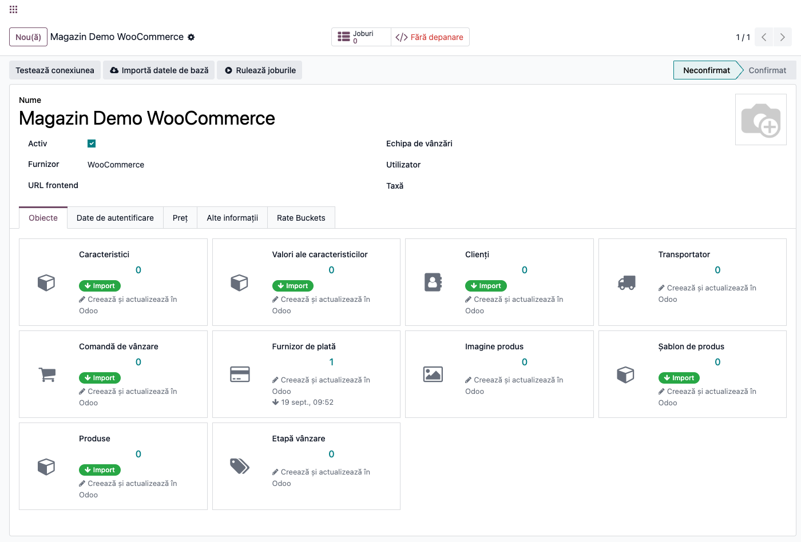
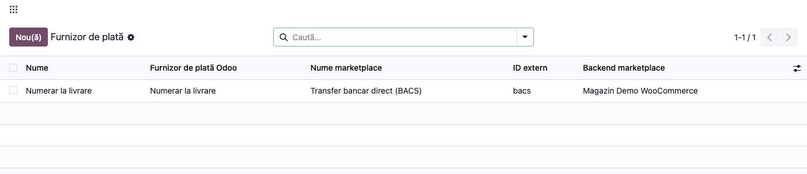
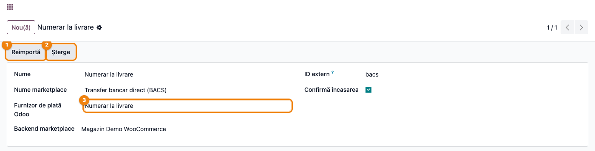
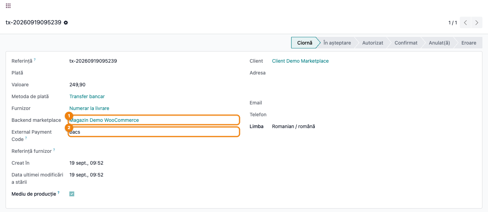

# Fișă Modul: Mapare metode de plată din marketplace (framework comun)

**Modul:** `deltatech_marketplace_payment`
**Utilizator principal:** Consultant Odoo / administrator funcțional (configurare inițială), contabil/operator plăți (reconciliere curentă)
**Prioritate:** 🟡 Medie (dependență ascunsă, folosită de toate conectoarele care importă comenzi cu plată — nu se vinde separat)

---

## 1. Scop business

Fiecare marketplace raportează plățile cu propriile denumiri: `stripe`, `shopify_payments`,
`paypal`, `Cash on Delivery (COD)` etc. Fără o punte comună, fiecare conector (Shopify,
WooCommerce, eMAG, PrestaShop, MerchantPro...) ar trebui să reinventeze propria logică de
potrivire a metodei de plată cu un `payment.provider` din Odoo. Acest modul oferă exact acea
punte: modelul de mapare `marketplace.payment.provider`, tipul de obiect „Furnizor de plată" (`payment_acquirer`) în
tab-ul **Objects** al backend-ului, și două câmpuri noi pe `payment.transaction`
(`marketplace_backend_id`, `external_payment_code`) care păstrează, pe fiecare tranzacție, atât
backend-ul de origine cât și codul exact de plată raportat de magazin — informație necesară la
reconciliere și la retururi, pentru că maparea Odoo e cu pierdere (mai multe coduri externe se pot
mapa pe același `payment.provider`). Modulul nu se vinde de sine stătător (categorie „Hidden",
preț simbolic 10 EUR) — e o dependență a conectoarelor de marketplace.

## 2. Arhitectură tehnică și context

Modelul `marketplace.payment.provider` este un **binding** (`_inherits = {"payment.provider":
"odoo_id"}`) peste framework-ul comun `deltatech_marketplace` (`marketplace.binding`): fiecare
rând leagă un `payment.provider` Odoo de un cod extern de marketplace (`external_id`) pe un
backend anume. Modulul înregistrează tipul de obiect `payment_acquirer` în selecția
`marketplace.backend.item.item_type` și suprascrie `get_binding_model()`/`_compute_icon()`
(`models/backend.py`) ca acest tip să folosească modelul `marketplace.payment.provider` (icon
`fa-credit-card`), nu convenția implicită `marketplace.payment.acquirer`.

**Maparea nu are import manual** — spre deosebire de Products sau Customers, cardul „Furnizor de
plată" din tab-ul Objects **nu are buton de import**: rândul de mapare se creează automat, la
prima comandă importată care raportează un cod de plată nou, prin metoda specifică fiecărui
conector `<provider>_import_by_id` (ex. `woo_import_by_id`, `shopify_import_by_id`,
`emag_import_by_id`, `prestashop_import_by_id`, `mp_import_by_id` — implementate în modulele
conector, nu în acesta). Fiecare conector alege singur `payment.provider`-ul Odoo implicit pentru
un cod nou (de regulă `payment.payment_provider_transfer` sau primul provider `code = "custom"`
al companiei) — consultantul corectează ulterior maparea manual, din formular, dacă implicit-ul
nu e cel dorit.

Câmpul `confirm_payment` de pe **fiecare mapare** (nu de pe backend) controlează dacă tranzacția
de plată creată la importul unei comenzi (`deltatech_marketplace_sale`) e trecută direct pe
starea **Done** (bifat, implicit) sau rămâne **Pending** (nebifat) — relevant pentru metodele de
plată la livrare/ramburs, unde confirmarea reală vine mai târziu.

> Modelul `marketplace.backend` mai capătă, prin acest modul, două câmpuri `confirm_payment` /
> `confirm_card_payment` (implicit bifate) — la data acestei fișe ele **nu apar în nicio vedere**
> și **niciun cod din suită nu le citește**; nu promiteți clientului un comportament pe baza lor.

## 3. Utilizatori și roluri

- **Consultant/administrator funcțional**: verifică, la fiecare backend nou, ce mapări de plată
  s-au creat automat și le corectează dacă implicit-ul (transfer bancar/manual) nu corespunde
  metodei reale folosite de client.
- **Contabil/operator plăți**: folosește `marketplace_backend_id` și `external_payment_code` pe
  tranzacții pentru reconciliere și raportare pe canal/metodă de plată.

Roluri recomandate la testare:
- Administrator funcțional: instalează modulul (ca dependență a unui conector), verifică
  meniurile și tab-ul Objects.
- Utilizator operațional: rulează o sincronizare de comenzi pe un backend de test și verifică
  mapările create automat.
- Manager/consultant: validează maparea finală (payment.provider corect) și starea tranzacțiilor.

## 4. Conturi și date implicate

Modulul nu generează note contabile proprii — plata rezultată urmează contabilizarea standard a
modulului `payment`/`account` (jurnalul și liniile de metodă de plată configurate pe
`payment.provider`). Singura logică contabilă atinsă de acest modul este în
`_create_payment()` (suprascriere pe `payment.transaction`): plata Odoo **nu** se creează dacă
providerul mapat are codul `custom` (fără contrapartidă bancară reală) sau dacă jurnalul
providerului nu are nicio linie de metodă de încasare configurată pentru el — în ambele cazuri
tranzacția rămâne fără `account.payment`, cu un mesaj în jurnalul de log (`_logger`), nu ca eroare
vizibilă pe ecran.

> La import (`deltatech_marketplace_sale`), dacă maparea nu are deja un jurnal (`journal_id`) și
> codul providerului nu e `custom`/`transfer`/`none`, se **creează automat** jurnalul bancar
> **„Marketplace Payment"** (cod **MRPY**, tip Bancă) pe compania backend-ului și se atribuie
> mapării — consultantul nu trebuie să-l pregătească manual în avans, dar trebuie să știe că va
> apărea singur în lista de jurnale.

Date minime pentru demo:
- un backend de marketplace (orice conector instalat, ex. WooCommerce) cu **cel puțin o comandă**
  care conține o metodă de plată;
- un `payment.provider` Odoo existent (implicit „Transfer bancar" sau un provider `custom`) spre
  care se poate mapa codul extern;
- jurnalul providerului cu o linie de metodă de încasare configurată, dacă se dorește să se vadă
  și `account.payment`-ul generat.

## 5. Configurare inițială

1. Instalați modulul `deltatech_marketplace_payment` (de regulă instalat automat, ca dependență a
   unui conector: WooCommerce, Shopify, eMAG, PrestaShop, MerchantPro etc.).
2. Deschideți backend-ul de marketplace și verificați, în tab-ul **Objects**, că a apărut rândul
   **Furnizor de plată** (fără buton de import — se populează automat).
3. Rulați o sincronizare de comenzi (**Sale Order**, din tab-ul Objects) pe backend-ul de test, cu
   cel puțin o comandă ce folosește o metodă de plată.
4. Deschideți lista de mapări create (clic pe rândul **Furnizor de plată**) și verificați/corectați
   `payment.provider`-ul Odoo asociat fiecărui cod extern.
5. Dacă e nevoie de tranzacții confirmate automat pe **Done**, verificați **Confirmă încasarea** pe
   mapare (implicit bifat).

## 6. Flux de utilizare

### Pasul 1 — Tipul de obiect „Furnizor de plată" pe backend

Deschideți **Marketplace → Backends**, formularul unui backend cu conector instalat (ex.
WooCommerce), tab-ul **Objects**. Rândul **Furnizor de plată** apare automat, alături de celelalte
tipuri de obiecte ale conectorului — spre deosebire de Products sau Sale Order, acest rând **nu
are buton de import**: se populează singur, pe măsură ce comenzile importate raportează coduri de
plată noi.



> Chipul roșu **„Fără depanare"** din antet (lângă **Joburi**) nu e modul dezvoltator Odoo — e
> butonul propriu al framework-ului `deltatech_marketplace` (`toggle_debug`) care activează
> logarea request-urilor HTTP brute către marketplace pentru acel backend; apare mereu, pe orice
> backend, indiferent de acest modul.

### Pasul 2 — Lista mapărilor create automat

Clic pe rândul **Furnizor de plată** (`Payment Acquirer`) deschide lista `marketplace.payment.provider`
filtrată pe acest backend: fiecare linie leagă un cod extern (**ID extern**, coloana cu numele/codul
raportat de magazin, ex. `bacs`, `cod`, `stripe`) de un `payment.provider` Odoo (**Furnizor de
plată Odoo**).



### Pasul 3 — Verificarea/corectarea unei mapări

Deschideți o linie din listă. Formularul arată **Nume**, **Nume marketplace**
(numele afișat de magazin pentru acea metodă), **Furnizor de plată Odoo** (`payment.provider`-ul
spre care se face maparea — corectați-l aici dacă implicit-ul ales de conector nu e cel potrivit),
**ID extern**, **Confirmă încasarea** (bifat implicit — vezi §2) și **Backend marketplace**
(backend-ul de origine).

> ⚠️ **Nume** nu e o etichetă proprie a mapării: prin `_inherits` pe `payment.provider`, acest câmp
> **este** `name`-ul furnizorului de plată Odoo însuși. Modificarea lui aici **redenumește global**
> providerul (vizibil și la checkout, pe alte mapări care îl folosesc), nu doar rândul din această
> listă — pentru eticheta specifică magazinului folosiți **Nume marketplace**, nu **Nume**.

**Găsește pe ecran** — verificați ce **Furnizor de plată Odoo** e legat de fiecare cod extern
important pentru client (ramburs, transfer, cardul online).
**Verifică** — un cod de plată la livrare/ramburs nu trebuie mapat pe un provider care confirmă
automat plata (**Confirmă încasarea** bifat) dacă banii nu au fost efectiv încasați la import.
**Treci mai departe** — corectați **Furnizor de plată Odoo** sau **Confirmă încasarea** direct în
formular și salvați; nu există export către marketplace pentru această corecție (maparea e strict
internă Odoo).



> Butonul **Șterge** din antet nu este implementat de niciun conector din suită: apăsarea lui
> ridică eroarea „Method delete must be implemented" (metoda de bază din `marketplace.binding`,
> nesuprascrisă în acest modul sau în conectoare). Ștergeți o mapare greșită direct din listă
> (selecție + Șterge din meniul de acțiuni), nu din acest buton.

### Pasul 4 — Backend și cod extern pe tranzacția de plată

Meniul **Facturare/Contabilitate → Configurare → Plăți online → Tranzacții** (formularul
`payment.transaction` standard, extins de acest modul; meniul e vizibil doar cu funcționalitățile
tehnice activate — grupul `base.group_no_one`) arată, lângă **Furnizor** (`provider_id`), cele
două câmpuri adăugate: **Backend marketplace** (backend-ul de origine al comenzii) și **External
Payment Code** (codul brut raportat de magazin — ex. `shopify_payments`, `stripe`,
`Cash on Delivery (COD)`; eticheta rămâne netradusă — vezi mai jos). În listă, ambele coloane sunt
ascunse implicit (`optional="hide"`) — afișați-le din selectorul de coloane.



> Eticheta `External Payment Code` apare netradusă (în engleză) chiar și pe o interfață RO — string-ul
> lipsește din `i18n/ro.po` la data acestei fișe. Restul câmpurilor adăugate de acest modul
> (`Marketplace Backend`/`Backend marketplace`) sunt traduse corect.

**Găsește pe ecran** — coloana `External Payment Code` arată exact ce a raportat magazinul, nu
echivalentul Odoo din `Provider`.
**Verifică** — pentru reconciliere, `External Payment Code` trebuie completat pe orice tranzacție
provenită dintr-o comandă de marketplace; o valoare goală înseamnă că extensia de câmp nu a fost
detectată la momentul creării (vezi §9).
**Treci mai departe** — grupați lista de tranzacții după `External Payment Code` sau
`Marketplace Backend` (filtrele de căutare adăugate de acest modul) pentru un raport rapid pe
canal/metodă de plată, înainte de a exporta sau a preda situația contabilului.

### Note de monografie și raportare

Nu se aplică — acest modul nu generează note contabile proprii. Plata rezultată (`account.payment`,
dacă providerul nu e `custom` și jurnalul are o linie de metodă de încasare configurată) urmează
contabilizarea standard a modulelor `payment`/`account`, neatinsă direct de acest conector.

## 7. Legături cu alte module / declarații

| Modul / proces | Rol în flux | Tip legătură |
|---|---|---|
| `deltatech_marketplace` | framework comun: backend, tab Objects, tipuri de obiecte, joburi | dependență (manifest) |
| `payment` | modelele `payment.provider`/`payment.transaction` extinse de acest modul | dependență (manifest) |
| `deltatech_marketplace_sale` | creează tranzacția de plată la importul comenzii, citește `confirm_payment` de pe mapare | integrare prin convenție (câmpurile sunt citite defensiv, cu `hasattr`/verificare pe `_fields`) |
| `deltatech_marketplace_shopify` / `_woocommerce` / `_emag` / `_prestashop` / `_merchantpro` / `_extended` | fiecare implementează propriul `<provider>_import_by_id` care creează maparea automat | integrare prin convenție (`binding_payment_acquirer.py` per conector) |
| `account` | jurnalul și `account.payment` rezultat, dacă providerul nu e `custom` | flux standard Odoo |

Ce este automat: crearea mapării la prima comandă cu un cod de plată nou; alegerea unui
`payment.provider` implicit de către fiecare conector.
Ce rămâne manual: corectarea mapării dacă implicit-ul nu e cel dorit, decizia **Confirmă încasarea**
per mapare, ștergerea unei mapări greșite (nu din butonul **Șterge** al formularului — vezi Pasul 3).

## 8. Verificări pentru consultant

- [ ] Modulul se instalează fără erori, de regulă ca dependență a unui conector.
- [ ] Tab-ul Objects al backend-ului arată rândul **Furnizor de plată** (fără buton de import).
- [ ] După o sincronizare de comenzi, apar mapări noi în `marketplace.payment.provider` pentru
      fiecare cod de plată întâlnit prima dată.
- [ ] `payment.provider`-ul Odoo ales implicit de conector e cel corect pentru client — dacă nu,
      a fost corectat manual în formularul mapării.
- [ ] **Confirmă încasarea** e bifat doar pentru metodele la care încasarea e certă la import (nu la
      ramburs/plată la livrare, dacă banii nu au fost efectiv încasați).
- [ ] Butonul **Șterge** din formular nu a fost promis clientului ca funcțional — nu e implementat
      de niciun conector.
- [ ] Coloanele `Marketplace Backend`/`External Payment Code` sunt afișate pe lista de tranzacții
      când se cere raportare pe canal/metodă de plată.
- [ ] Clientul știe că maparea e cu pierdere (mai multe coduri externe pot ajunge pe același
      `payment.provider`) — `External Payment Code` e păstrat exact pentru acest motiv.
- [ ] Câmpurile `confirm_payment`/`confirm_card_payment` de pe backend nu sunt folosite în nicio
      logică sau vedere — nu construiți fluxul clientului pe ele.
- [ ] Câmpul **Nume** din formularul mapării nu a fost editat crezând că e o etichetă locală — e
      `name`-ul global al furnizorului de plată Odoo (prin `_inherits`); pentru eticheta magazinului
      se folosește **Nume marketplace**.
- [ ] Dacă a apărut automat jurnalul bancar „Marketplace Payment" (MRPY), clientul a fost informat
      că e generat de `deltatech_marketplace_sale` la primul import cu provider fără jurnal.

## 9. Mesaje de eroare frecvente

| Mesaj / simptom | Cauză probabilă | Remediere |
|---|---|---|
| „Method delete must be implemented" | S-a apăsat butonul **Șterge** din antetul formularului mapării — nesuprascris de niciun conector | Ștergeți maparea din listă (selecție + Șterge din meniul de acțiuni), nu din butonul de pe formular |
| O comandă nouă nu are nicio mapare de plată creată | Conectorul instalat nu implementează `<provider>_import_by_id` pentru `marketplace.payment.provider`, sau comanda nu a fost încă (re)importată | Verificați `models/binding_payment_acquirer.py` al conectorului; rulați din nou importul comenzii (**Reimport**) |
| `External Payment Code` gol pe o tranzacție provenită din marketplace | `deltatech_marketplace_payment` a fost instalat după ce comanda a fost deja importată (câmpul e citit defensiv, doar dacă există în `payment.transaction._fields` la momentul creării) | **Reimportați comanda** (buton **Reimport**/**Reimportă**) — `deltatech_marketplace_sale` completează retroactiv `external_payment_code` pe tranzacția existentă dacă acesta e gol, fără să o recreeze |
| Tranzacția rămâne fără `account.payment` deși providerul e corect | Providerul mapat are codul `custom`, sau jurnalul lui nu are nicio linie de metodă de încasare configurată pentru el (avertisment doar în log, nu pe ecran) | Configurați o linie de metodă de încasare pe jurnalul providerului, sau alegeți un provider cu jurnal complet configurat |
| A apărut un jurnal bancar nou „Marketplace Payment" (cod MRPY), necerut de nimeni | Comportament automat: la import, dacă maparea nu are jurnal și providerul nu e `custom`/`transfer`/`none`, `deltatech_marketplace_sale` creează acest jurnal și îl atribuie mapării | Normal, nu e o eroare — redenumiți/reconfigurați jurnalul MRPY dacă clientul are deja unul dedicat pentru încasările marketplace |
| Tranzacția e confirmată automat (Done) deși plata (ramburs) nu a fost efectiv încasată | **Confirmă încasarea** e bifat pe mapare pentru o metodă la care încasarea e ulterioară | Debifați **Confirmă încasarea** pe maparea acelui cod extern — tranzacția va rămâne Pending |

## 10. Capturi de ecran

Capturile (`readme/screenshots/`) ilustrează fluxul din secțiunea 6, generate cu Playwright/
`ScreenshotCase` din `l10n_ro_doc_screenshots` (`tests/test_screenshots.py`), interfață în
**română**, pe un backend WooCommerce de test cu o mapare de plată și o tranzacție create în
`setUpClass` (nu se vinde separat pe Apps Store — categorie „Hidden" — de aceea limba fișei
urmează convenția internă RO, nu `en-US` ca la conectoarele internaționale):

1. `01_objects_payment_acquirer.png` — tab Objects al backend-ului, rândul Furnizor de plată.
2. `02_lista_mapari.png` — lista mapărilor `marketplace.payment.provider` pentru backend.
3. `03_formular_mapare.png` — formularul unei mapări, cu butoanele Reimportă/Șterge din antet.
4. `04_tranzactie_plata.png` — tranzacția de plată cu Backend marketplace + External Payment Code.

Regenerare:

```bash
./odoo/odoo-bin -c odoo_mp_test.conf -d mkt_test19 -u deltatech_marketplace_payment \
    --test-enable --test-tags=/deltatech_marketplace_payment:TestMarketplacePaymentFisaScreenshots \
    --stop-after-init
```

## 11. Observații pentru manual

În manualul final, subliniați că acest modul e o **infrastructură comună**, nu un ecran de
configurare de sine stătător: consultantul nu „lucrează" direct în el, ci verifică rezultatul —
mapările de plată create automat de conectorul instalat — și corectează implicit-ul ales de
conector când e cazul. Menționați explicit limitarea butonului **Șterge** (neimplementat) și
faptul că `External Payment Code`/`Marketplace Backend` nu se completează retroactiv pe tranzacții
mai vechi decât instalarea modulului. Evitați să promiteți un comportament pentru câmpurile
`confirm_payment`/`confirm_card_payment` de pe backend — nu sunt folosite nicăieri în cod la data
acestei fișe.
