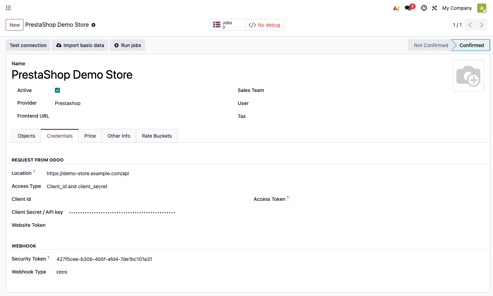
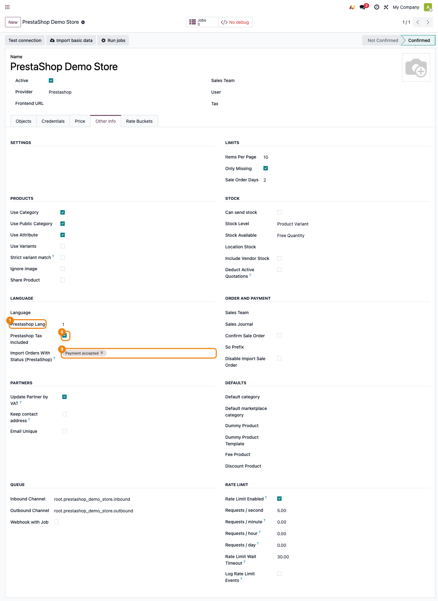
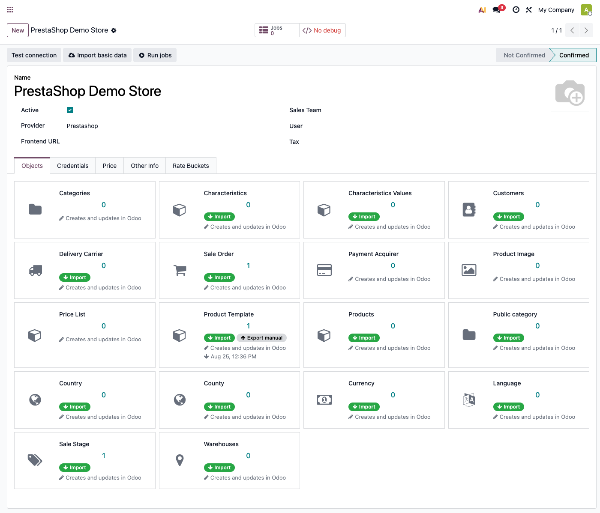
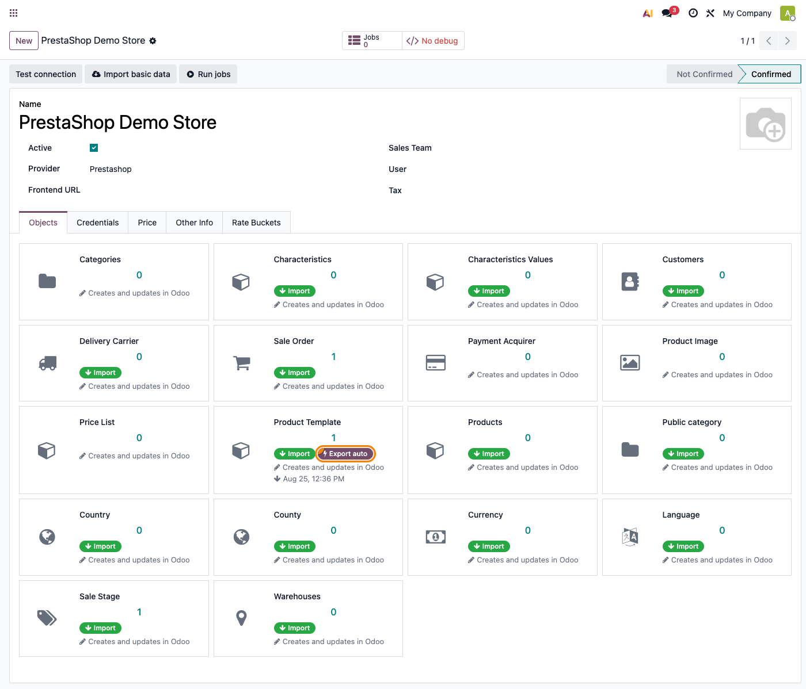
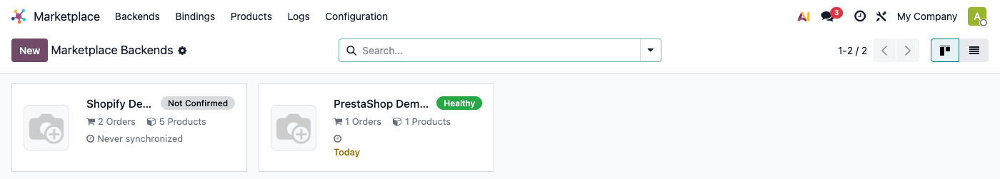

# Fișă Modul: Conector PrestaShop — catalog, comenzi, stoc și status înapoi în magazin

**Modul:** `deltatech_marketplace_prestashop`
**Utilizator principal:** Consultant Odoo / administrator funcțional (configurare inițială), operator e-commerce (utilizare curentă)
**Prioritate:** 🔴 Ridicată (conector vandabil pe Odoo Apps Store, folosit de clienți cu magazine PrestaShop reale)

---

## 1. Scop business

Un magazin PrestaShop lângă Odoo, fără conector, înseamnă catalog, clienți și comenzi ținute
manual în două locuri. Modulul aduce automat produsele, clienții și comenzile din PrestaShop în
Odoo și, spre deosebire de conectorul WooCommerce, **poate și trimite înapoi** spre magazin: poate
crea/actualiza produse pe PrestaShop (preț, denumire, EAN, categorii publice), poate anunța
PrestaShop când o comandă schimbă starea în Odoo, poate trimite numărul de tracking la expediere și
expune un API prin care PrestaShop poate cere URL-ul facturii PDF a unei comenzi. Se leagă de
același framework comun (`deltatech_marketplace`) folosit și de conectorul Shopify sau WooCommerce,
deci un magazin PrestaShop lângă un canal deja folosit nu înseamnă învățarea unui al doilea sistem.

## 2. Arhitectură tehnică și context

Modulul rulează pe **PrestaShop Webservice API** (`/api/...`), fără bibliotecă Python externă —
folosește `requests` (deja parte din Odoo) și `xml.etree.ElementTree` pentru corpul cererilor de
scriere. Autentificarea este **HTTP Basic Auth cu o singură cheie** (cheia WebService generată în
**PrestaShop → Parametri avansați → Webservice**), introdusă pe backend ca **Client Secret / API
key** (câmp comun al framework-ului; **Access Type** = „Client_id and client_secret" în listă);
**Client Id rămâne necompletat** — nu este folosit de acest conector.

PrestaShop citește în **JSON** dar cere scrierile (POST/PUT) în **XML** — adaptorul modulului
construiește acest XML intern, transparent pentru operator. Câmpurile traductibile PrestaShop
(nume, descriere, meta) vin la citire fie ca text simplu, fie ca o listă per-limbă
(`[{"id": "1", "value": "..."}]`) — modulul normalizează automat orice răspuns GET la textul din
limba efectivă (`prestashop_lang`, dacă e setat pe backend pentru un magazin mono-limbă; altfel se
deduce din maparea limbilor importate). Pe un magazin multi-limbă fără `prestashop_lang` setat,
fiecare import de produs/categorie/status de comandă rulează în buclă peste **toate** limbile deja
importate ca legături „Languages" — de aceea pasul de import al limbilor (§6, Pasul 4) trebuie
făcut înainte de restul catalogului.

Paginarea are o gardă anti-buclă infinită: dacă un magazin ignoră parametrul `limit`
(offset,count) și tot răspunde cu același set de date, importul se oprește când o pagină nu mai
aduce id-uri noi, în loc să bată API-ul la nesfârșit. Filtrul de import comandă după status
(`prestashop_order_import_phase_ids`, tab **Other Info → Language**) mapează pe parametrul
`filter[current_state]` cu sintaxa OR proprie webservice-ului PrestaShop (`[id1|id2]`); statusurile
oferite aici sunt cele deja aduse prin sincronizarea **Sale Stage**, nu o listă fixă — statusurile
de comandă din PrestaShop sunt configurabile per magazin.

## 3. Utilizatori și roluri

- **Consultant/administrator funcțional**: configurează backend-ul, rulează prima sincronizare,
  decide pe ce tip de date se activează exportul automat.
- **Operator e-commerce**: urmărește starea de sănătate a sincronizării, rezolvă job-urile eșuate,
  repetă manual importul de comenzi/produse/clienți noi (nu există un cron dedicat de import
  recurent al comenzilor — doar cron-ul comun „Marketplace: Get Orders", dezactivat implicit).

Roluri recomandate la testare:
- Administrator funcțional: instalează modulul, configurează backend-ul, verifică meniurile.
- Utilizator operațional: rulează prima sincronizare și importurile ulterioare.
- Manager/consultant: validează rezultatul (comenzi importate, produse exportate, indicatorul de
  sănătate).

## 4. Date și mapări implicate

Nu există note contabile Dr/Cr generate direct de acest modul — asta ține de `sale`/`account`,
declanșate normal de comanda de vânzare creată din comanda PrestaShop importată. Datele-cheie de
pregătit sau de înțeles înainte de prima sincronizare:

- **Prețul la import scrie direct în `list_price`**, nu în lista de prețuri: valoarea citită din
  PrestaShop (`price`, ajustat cu TVA dacă `Prestashop Tax Included` e bifat — vezi mai jos) se
  scrie pe câmpul `list_price` al produsului Odoo, cu excepția cazului în care `Ignore Price` e
  bifat pe backend (prețul nu se atinge deloc la import) sau `Update Price Only` (produsul deja
  existent primește doar prețul, fără restul câmpurilor). **Lista de prețuri** (`pricelist_id`, tab
  **Price**) NU e destinația importului — e folosită doar ca referință de comparație (câmpul intern
  `odoo_price`/`price_diff` de pe legătură) și, separat, ca **sursă de calcul la export** (vezi §6,
  Pasul 5). Editarea manuală a prețului direct pe legătura marketplace scrie în lista de prețuri
  numai dacă `Price Per Product` e bifat pe backend — altfel scrie tot în `list_price`. Excepție la
  **importul de variante** (nu șabloane): dacă `Price List` **și** `Price Per Product` sunt
  ambele setate pe backend, prețul importat chiar se scrie și ca item fix în lista de prețuri
  (`update_price_in_list_price`), pe lângă `list_price`.
- **Prestashop Tax Included** afectează și prețul **produselor importate** (nu doar comenzile,
  vezi §6 Pasul 3): dacă e bifat, prețul PrestaShop e tratat ca fără TVA și se majorează cu taxa de
  vânzare implicită a companiei (`account_sale_tax_id`) înainte de a fi scris pe `list_price` —
  verificați că această taxă e configurată corect pe companie înainte de prima sincronizare de
  produse (vezi §8).
- **Categoria implicită / categorie marketplace implicită** (tab **Other Info → Defaults**) —
  folosite când produsul importat nu are o mapare mai specifică.
- **Warehouses** (`/shops`, tip element „Warehouses") — magazinele PrestaShop (`id_shop`, relevant
  pe instalări multi-magazin) se mapează la depozite Odoo și sunt folosite doar ca sursă pentru
  `warehouse_id` pe comanda importată; dacă magazinul de pe comandă nu mai există în PrestaShop,
  importul continuă și lasă depozitul implicit al comenzii, nu blochează.
- **„Active On Write"** (câmp pe fiecare rând din tab-ul **Objects**, badge „Export auto"/„Export
  manual" pe cardul kanban al elementului) — dezactivat implicit pe orice tip de date; este
  comutatorul care decide dacă o scriere din Odoo (preț/nume pe produs, schimbare de fază pe
  comandă) se trimite automat spre PrestaShop sau doar la cerere (acțiunile Export / wizardul
  „Marketplace sync").

Date minime pentru demo: un magazin PrestaShop de test cu cheie Webservice cu drepturi de
citire+scriere pe resursele folosite, cel puțin un produs (eventual cu combinații/atribute), un
client și o comandă existentă în magazin.

## 5. Configurare inițială

1. În PrestaShop, generați o cheie Webservice cu acces la resursele necesare
   (**Parametri avansați → Webservice**): măcar `products`, `orders`, `customers`, `addresses`,
   `stock_availables`, `order_states`, `order_histories`, `carriers`, `images` (accesul de
   scriere pe `images` e necesar pentru exportul de imagini, altfel apare eroarea 403 descrisă
   la §9).
2. Instalați modulul `deltatech_marketplace_prestashop` (nu necesită nicio bibliotecă Python
   externă în afara celor deja incluse în Odoo).
3. Creați un backend nou: **Marketplace → Backends → Nou**, `Provider = Prestashop`.
4. În tab-ul **Credentials**, completați **Location** (URL-ul webservice-ului, cel care se termină
   în `/api`), **Access Type = client**, apoi **Client Secret** cu cheia Webservice din PrestaShop
   (**Client ID** rămâne necompletat — nu e folosit).
5. Salvați. Salvarea cu `Provider = Prestashop` populează automat tab-ul **Objects** cu câte un
   rând pentru fiecare tip de date acoperit: Categories, Country, County, Public category,
   Products, Product Template, Customers, Sale Order, Sale Stage, Delivery Carrier, Product Image,
   Payment Acquirer, Language, Characteristics, Characteristics Values, Currency, Price List,
   Warehouses.
6. Dacă magazinul e multi-limbă sau dacă nu sunteți sigur de id-ul limbii, rulați întâi **Import**
   pe cardul **Language** (tab Objects) — acest import setează singur `Prestashop Lang` (vezi §6,
   Pasul 3). Completați manual `Prestashop Lang`/`Prestashop Tax Included` (tab **Other Info**,
   grup **Language**) **după** acest import, altfel valoarea manuală e suprascrisă.
7. Apăsați **Test connection** din antet — vezi limitarea importantă din §6, Pasul 2.
8. Înainte de primul **Export** de pe cardul Product Template, setați **Domain** pe acel item
   (tab Objects, meniul ⋮ → Edit) la un domeniu Odoo real (ex. o categorie de produse de test) —
   lăsat gol, exportă tot catalogul Odoo pe magazinul PrestaShop, inclusiv pe un magazin live.
9. Dacă vreți ca prețul/numele produselor deja exportate să se actualizeze automat la fiecare
   scriere din Odoo, bifați **Active On Write** pe rândul „Product Template" din tab-ul Objects.

## 6. Flux de utilizare

### Pasul 1 — Configurarea backend-ului (Credentials)

Deschideți **Marketplace → Backends → Nou**, alegeți `Provider = Prestashop` și completați tab-ul
**Credentials**: adresa webservice-ului (**Location**), **Access Type = „Client_id and
client_secret"**, apoi **Client Secret / API key** cu cheia Webservice generată în PrestaShop.
**Client Id** nu e folosit de acest conector (doar **Client Secret / API key** intră în
autentificarea Basic Auth).



### Pasul 2 — Testarea conexiunii (limitare importantă)

Apăsați **Test connection** din antetul formularului. **Acest buton nu contactează efectiv
PrestaShop**: `prestashop_test_connection()` doar construiește antetul Basic Auth local
(`base64` pe cheia Webservice), fără niciun apel HTTP către magazin. Starea (`State`) trece pe
**Confirmed** necondiționat, indiferent dacă URL-ul sau cheia sunt corecte — spre deosebire de
conectorul WooCommerce, unde același buton face un apel real. O credențială greșită nu va fi
depistată aici, ci abia la primul import/export real (eroare HTTP/PrestaShop pe ecran, vezi §9).

### Pasul 3 — Limbă, TVA și filtrul de status pe comenzi (Other Info → Language)

Tab-ul **Other Info**, grupul **Language**, conține câmpurile specifice acestui conector:

- **Prestashop Lang**: id-ul limbii PrestaShop din care se citesc câmpurile traductibile. Lăsat
  gol pe un magazin multi-limbă, fiecare import de produs/categorie/status de comandă rulează
  automat peste toate limbile deja importate ca legături „Language". **Atenție la ordine:**
  rularea importului „Language" (tab Objects) rescrie automat acest câmp (îl setează pe id-ul
  unic găsit, dacă magazinul are o singură limbă, sau îl golește pe un magazin multi-limbă) — dacă
  îl completați manual, faceți asta **după** acel import, altfel valoarea se pierde.
- **Prestashop Tax Included**: bifat, comanda/liniile se citesc cu TVA inclus
  (`total_shipping_tax_incl`, `unit_price_tax_incl`); nebifat (implicit), fără TVA. **Aceeași bifă
  afectează și prețul produselor importate** (§4) — cu ea bifată, prețul PrestaShop e majorat cu
  taxa de vânzare implicită a companiei înainte de a fi scris pe `list_price`.
- **Import Orders With Status (PrestaShop)**: lăsat gol, importă orice status de comandă
  (comportamentul dinaintea acestui câmp); restrâns la unul sau mai multe statusuri, filtrează
  importul — dar statusurile oferite aici vin din sincronizarea **Sale Stage**, deci rulați-o
  întâi (§6, Pasul 4). Atenție: o restricție de status combinată cu o fereastră **Sale Order Days**
  prea scurtă poate lăsa comanda neimportată dacă statusul e atins după ce fereastra a expirat.

Tot pe acest ecran (grupul **Order and Payment**) se află **Disable Import Sale Order**: bifat,
exclude acest backend din cron-ul comun „Marketplace: Get Orders" — util pentru un backend
configurat, dar încă netestat, ca să nu importe comenzi accidental.



### Pasul 4 — Prima sincronizare (tab Objects)

Tab-ul **Objects** arată câte un card pentru fiecare tip de date, cu badge-uri care spun exact ce
poate face fiecare: „Import" (verde, cu „+price"/„+stock" dacă există), și „Export auto" (albastru,
cu fulger) sau „Export manual" (gri), în funcție de **Active On Write**. Acest conector **nu are
Import All** pe niciun card (spre deosebire de alți conectori din familie) — doar acțiunea Import
simplă; pentru a limita importul la ce lipsește, folosiți bifa **Only Missing** de pe backend (tab
Other Info → Limits), nu un buton separat pe card. Acțiunile reale (Import, Export, ...) sunt în
**meniul ⋮ al cardului**, nu un buton vizibil direct — vizibile doar dacă tipul respectiv le
suportă (vezi §8, „03_objects.png": nu toate cardurile au un badge verde de Import).

**Trei carduri nu au deloc acțiune de import** (fără badge verde „Import"), deși apar în listă —
nu le căutați în ordinea de mai jos:

- **Categories** — nu există `prestashop_import` pentru categoriile interne (spre deosebire de
  **Public category**, care se importă normal); categoriile „Categories" rămân nefolosite direct
  de acest conector.
- **Price List** (`product_pricelist`) — se creează **automat**, o singură dată per monedă, la
  prima comandă importată în acea monedă (nu e o resursă PrestaShop de tras explicit).
- **Product Image** — imaginile vin **automat** odată cu importul de Product Template (dacă
  `Ignore Images` nu e bifat), nu printr-un import separat.

Ordinea recomandată pentru prima sincronizare, pe cardurile care chiar au Import:

1. **Language** — necesar doar pe magazine multi-limbă/internaționale; rulați-l **înainte** de a
   completa manual `Prestashop Lang` (§6, Pasul 3 — importul îl suprascrie).
2. **Country**/**County** — necesare doar pe magazine internaționale.
3. **Public category**, **Characteristics**/**Characteristics Values** — atributele PrestaShop se
   împart în **Features** (specificații informative) și **Options** (generează variante,
   `create_variant = dynamic`), înaintea produselor.
4. **Currency**, **Warehouses**.
5. **Sale Stage** (`/order_states`) — obligatoriu **înainte** de a filtra importul de comenzi
   după status (Pasul 3).
6. **Product Template**/**Products** (variante/combinații) — **Product Image** se aduce automat
   odată cu acestea.
7. **Customers**.
8. **Delivery Carrier** — are acțiune proprie de Import (spre deosebire de WooCommerce, unde
   transportatorii se creează doar automat). **Payment Acquirer** nu are import — se creează
   automat la prima comandă care îl referă.
9. **Sale Order** — ultimul, ca liniile de comandă să găsească deja produsele și clienții
   importați; fiecare comandă vine cu adrese, linii, linie de transport, plată și statusul
   PrestaShop mapat pe o fază de vânzare Odoo.

Toate rulează ca **job-uri în coadă**; butonul **Jobs** din antetul backend-ului arată coada, iar
**Run jobs** forțează procesarea imediată. Butonul **Import basic data** din antet este un hook
generic al framework-ului — pentru PrestaShop **arată mereu un mesaj de succes** dar nu are niciun
efect real (nu există `prestashop_import_basic_data`); folosiți cardurile din Objects, nu acest
buton.



### Pasul 5 — Exportul de produse către PrestaShop (real, spre deosebire de WooCommerce)

**Înainte de primul Export**, setați **Domain** pe cardul Product Template (meniul ⋮ → Edit) la un
domeniu Odoo real (ex. o categorie de test) — lăsat gol (implicit), exportul ia **tot catalogul**
Odoo care se potrivește, inclusiv pe un magazin PrestaShop live.

Cardul **Product Template** are și acțiune **Export** (`can_export = True`): creează pe PrestaShop
(POST `/products`) produsele Odoo din domeniul configurat care încă nu au o legătură — cu preț
(calculat din `pricelist_id` dacă e setat, altfel din `list_price` — vezi §4), denumire/descriere/
meta traduse pe fiecare limbă mapată, EAN13, greutate și categorii publice (dacă mapate), plus
imaginile produsului.

Pentru produsele deja legate, actualizarea (PUT `/products/{id}`) se declanșează în două moduri —
în ambele cazuri, ca **job de fundal** (o scriere din Odoo pune un job în coadă, nu face apelul
sincron; e nevoie de jobrunner activ sau de **Run jobs** pentru procesare):

- **Automat**, dacă **Active On Write** e bifat pe cardul Product Template: orice scriere pe
  produsul Odoo (preț, nume, activ/inactiv, EAN, greutate, categorii) pune în coadă un job care
  trimite PUT către PrestaShop.
- **La cerere**, oricând, cu wizardul **Marketplace sync** (acțiunea contextuală „Marketplace
  sync" de pe produse/șabloane de produs — implicit `Direction = Export`, `Update Mode = Stock`;
  comutați manual pe **All** ca să includă și preț/nume) — ignoră Active On Write.

> **Capcană tăcută:** dacă rândul „Product Template" din Objects are completat un **Registered
> URL** (folosit pentru webhook-uri de ieșire generice ale framework-ului), scrierea automată pe
> Active On Write trece pe acel URL în loc de `prestashop_write` — iar acest conector nu are o
> conversie proprie pentru acel format, deci PUT-ul către PrestaShop **nu mai pleacă deloc**, fără
> nicio eroare vizibilă. Lăsați acest câmp necompletat pentru PrestaShop.



> **Ce NU funcționează pentru acest conector, deși pare disponibil în interfața comună:** modurile
> **Stock** și **Price** ale wizardului „Marketplace sync" (implicit chiar `Update Mode = Stock` —
> vezi mai sus), cardul „Can send stock"/cron-ul comun „Marketplace: export stock" și cron-ul
> „Marketplace: export price" sunt toate căi generice care caută o metodă
> `prestashop_stock_export`/`prestashop_export_price`/`prestashop_call_price_export` — niciuna
> dintre ele nu există în acest modul, deci aceste căi nu fac nimic pentru PrestaShop (se văd doar
> în jurnal ca „There is no method ..."). Prețul se actualizează *doar* prin căile de la Pasul 5
> (Active On Write pe Product Template sau modul „All" al wizardului „Marketplace sync"), niciodată
> prin „Stock"/„Price" izolat sau prin cron-urile de export. Există chiar un binder de stoc cu o
> metodă `prestashop_write` care ar trimite cantitatea la `/stock_availables`, dar nimic din
> framework nu o apelează vreodată — cod mort, nu o cale de export utilizabilă din interfață.

### Pasul 6 — Ce se importă automat vs. la cerere

Comenzile, produsele sau clienții noi din PrestaShop **nu** sunt aduși automat de un cron dedicat
de import recurent — doar cron-ul comun „Marketplace: Get Orders" (dezactivat implicit) rulează
importul de comenzi orar pentru backend-urile fără **Disable Import Sale Order** bifat (§6, Pasul
3); restul (produse, clienți) se repetă manual din Objects.

Fiecare rând din Objects mai are suport generic „Use webhook" (activat implicit, `default=True`),
cu direcția **inversă** față de ce ar sugera numele: câmpul `Web Hook Link` de pe acel rând e un
URL pe care trebuie să-l **înregistrați voi în PrestaShop** — e o rută pe care **PrestaShop o
apelează spre Odoo**, nu un apel pe care Odoo îl face spre magazin. Când PrestaShop apelează acest
URL pentru o comandă, importul acelei comenzi pornește imediat, fără să aștepte cron-ul orar.

### Pasul 7 — Push status comandă, tracking și factură (invers decât la import)

Trei lucruri circulă dinspre Odoo spre PrestaShop pe o comandă deja importată, cu reguli diferite:

- **Statusul comenzii**: când faza (`phase_id`) unei comenzi Odoo legate se schimbă **și** Active
  On Write e bifat pe cardul „Sale Order", conectorul pune în coadă un job care trimite un
  `order_history` nou către PrestaShop (POST `/order_histories`) cu statusul mapat — PrestaShop
  vede comanda avansată. Cu Active On Write dezactivat (implicit), o schimbare de fază **nu**
  ajunge la PrestaShop.
- **Numărul de tracking** (`prestashop_after_send_to_shipper`, POST/PUT `/order_carriers`) și
  **legătura facturii** (`prestashop_after_invoice_post`, `/order_invoices`) **NU depind de Active
  On Write** — se trimit **necondiționat** de fiecare dată când se trimite un colet la curier,
  respectiv se postează o factură pe acea comandă, indiferent de starea comutatorului. Nu
  presupuneți că dezactivarea Active On Write pe „Sale Order" oprește și aceste două fluxuri.

Suplimentar, modulul expune o rută HTTP proprie (`/marketplace/sale_order/get_invoice`,
autentificată cu `security_token` — tab Credentials, grup Webhook) prin care PrestaShop (sau orice
alt sistem cu tokenul) poate cere URL-ul PDF-ului facturii unei comenzi importate, dat id-ul extern
al comenzii.

### Pasul 8 — Citirea stării de sănătate

Cardul kanban al backend-ului din **Marketplace → Backends** arată un indicator de sănătate
(gri/portocaliu/roșu/verde), care devine verde doar când backend-ul e confirmat, fără erori/job-uri
eșuate în ultimele 24h, și cel puțin un tip de date are deja o sincronizare înregistrată. Rețineți
că „Confirmed" aici nu garantează că datele de conectare sunt corecte (vezi Pasul 2).



> Kanban-ul **Marketplace → Backends** e comun tuturor conectorilor instalați — pe o instanță cu
> mai multe conectoare de test/demo (ex. Shopify) e normal să apară și cardurile lor alături de cel
> PrestaShop. Urmăriți cardul cu numele backend-ului configurat de voi.

### Note de monografie și raportare

Nu se aplică — acest modul nu generează note contabile proprii. Comanda de vânzare rezultată din
importul PrestaShop urmează contabilizarea standard Odoo (`sale`/`account`), neatinsă de acest
conector.

## 7. Legături cu alte module / declarații

| Modul / proces | Rol în flux | Tip legătură |
|---|---|---|
| `deltatech_marketplace` | framework comun: backend, indicator de sănătate, job-uri, Active On Write, item-uri sincronizate | dependență (manifest) |
| `deltatech_marketplace_website` | integrare website (categorii publice) | dependență (manifest) |
| `deltatech_marketplace_sale_stage` | mapare status PrestaShop ↔ fază de vânzare Odoo, în ambele sensuri | dependență (manifest) |
| `deltatech_marketplace_delivery` | mapare transportator, linie de livrare, tracking trimis către PrestaShop | dependență (manifest) |
| `deltatech_marketplace_payment` | mapare metodă de plată PrestaShop → payment acquirer Odoo | dependență (manifest) |
| `sale` / `stock` / `account` | comanda de vânzare, mișcarea de stoc, factura rezultată — flux Odoo standard | flux standard Odoo |

Ce este automat necondiționat: tracking-ul trimis la curier și legătura facturii postate ajung
mereu la PrestaShop; crearea transportatorilor/achizitorilor de plată/fazelor de vânzare la prima
referință dintr-o comandă importată; crearea listei de prețuri per monedă la prima comandă.
Ce este automat **doar cu Active On Write bifat** pe item-ul respectiv: actualizarea produselor
deja exportate (preț/nume/EAN/greutate/categorii) și push-ul de **status** (fază) de comandă.
Ce rămâne manual: prima sincronizare (ordinea de la Pasul 4), setarea Domain-ului pe Product
Template înainte de primul Export, crearea de produse noi pe PrestaShop (acțiunea Export, nu se
întâmplă singură), repetarea periodică a importului de produse/clienți noi (fără cron dedicat,
doar comenzile au cron comun), înregistrarea webhook-urilor în PrestaShop. Exportul de **stoc** și
de **preț prin cron/wizard izolat** nu există în acest conector (vezi avertismentul de la Pasul 5).

## 8. Verificări pentru consultant

- [ ] Modulul se instalează fără erori (nu necesită bibliotecă Python externă).
- [ ] Cheia Webservice din PrestaShop are drepturi de citire+scriere pe resursele folosite,
      inclusiv `images` dacă se exportă produse cu poze.
- [ ] **Test connection** e tratat ca o simplă confirmare a stării, nu ca o validare reală a
      credențialelor — nu promiteți clientului că acest buton detectează o cheie/URL greșite.
- [ ] Prima sincronizare respectă ordinea din Pasul 4 — și nu se caută un buton de Import pe
      cardurile care nu au (**Categories**, **Price List**, **Product Image**).
- [ ] Dacă `Import Orders With Status` e completat, Sale Stage a fost importat înainte, iar
      `Sale Order Days` acoperă statusul urmărit.
- [ ] `Prestashop Lang` a fost completat manual **după** importul „Language" (Pasul 3), nu înainte
      — altfel importul îl suprascrie.
- [ ] Dacă `Prestashop Tax Included` e bifat: taxa de vânzare implicită a companiei
      (`account_sale_tax_id`) e configurată corect, pentru că afectează și prețul produselor
      importate, nu doar liniile de comandă.
- [ ] **Domain** e setat pe cardul Product Template (nu lăsat gol) înainte de primul Export, ca
      să nu exporte tot catalogul Odoo pe un magazin live.
- [ ] Dacă se dorește export automat de preț/nume pe produsele deja legate sau push automat de
      **status** de comandă: **Active On Write** e bifat pe cardul corespunzător din Objects
      (implicit dezactivat peste tot) — și **Registered Url** e gol pe acel item.
- [ ] Nu s-a presupus că tracking-ul și legătura facturii depind de Active On Write — pleacă
      întotdeauna, necondiționat, la trimiterea coletului / postarea facturii.
- [ ] Nu s-a promis clientului un export automat de **stoc** sau un export de **preț** prin
      cron/wizard izolat („Stock"/„Price") — acest conector nu le implementează; prețul circulă
      doar prin Active On Write pe Product Template sau prin modul „All" al wizardului
      „Marketplace sync".
- [ ] Indicatorul de sănătate de pe cardul kanban e verde după prima sincronizare reușită.
- [ ] Rută `/marketplace/sale_order/get_invoice` testată cu tokenul corect dacă PrestaShop (sau
      alt sistem) o va folosi pentru a obține URL-ul facturii.

## 9. Mesaje de eroare frecvente

| Mesaj / simptom | Cauză probabilă | Remediere |
|---|---|---|
| „Prestashop error 401/400/500 for URL ...` | Cheie Webservice greșită/revocată, URL fără `/api`, sau resursă neactivată în drepturile cheii | Verificați URL-ul (cu `/api`) și drepturile cheii Webservice; 500 e reîncercat automat de queue_job |
| „Access forbidden (403) for URL ... (Images resource needs POST/PUT access)" | Cheia Webservice nu are drepturi de scriere pe resursa `images` | Adăugați drepturile de POST/PUT pe `images` în PrestaShop |
| **Test connection** arată mereu succes, chiar cu credențiale greșite | `prestashop_test_connection` nu face niciun apel real către magazin — doar construiește antetul Basic Auth | Comportament de cod cunoscut, nu un fals pozitiv al operatorului; validați credențialele cu o acțiune reală (ex. Import) |
| Statusurile din `Import Orders With Status` nu apar în listă | Sale Stage (`/order_states`) nu a fost încă importat pentru acest backend | Rulați Import pe cardul Sale Stage întâi |
| O comandă nouă din PrestaShop nu ajunge deloc în Odoo | Filtrul de status e mai restrictiv decât fereastra `Sale Order Days`, sau cron-ul „Marketplace: Get Orders" e dezactivat și nimeni n-a rulat Import manual | Lărgiți fereastra sau reveniți la fără filtru; activați cron-ul sau rulați Import pe cardul Orders |
| Prețul/numele produsului nu se actualizează pe PrestaShop după o modificare în Odoo | **Active On Write** nu e bifat pe cardul Product Template, sau **Registered Url** e completat pe acel item (redirecționează scrierea către un webhook care nu există pentru PrestaShop) | Bifați Active On Write și lăsați Registered Url gol, sau folosiți wizardul „Marketplace sync", mod All |
| Stocul din PrestaShop nu se actualizează niciodată din Odoo | Acest conector nu implementează export de stoc (nicio metodă `prestashop_stock_export`) — cron-ul comun și „Can send stock" nu au efect aici | Nu există soluție la nivel de modul; stocul rămâne un flux de import (PrestaShop → Odoo), nu de export |
| Comanda anulată/rambursată în PrestaShop rămâne activă în Odoo | Conectorul nu urmărește modificări ulterioare ale unei comenzi deja importate în afara push-ului manual de fază | Anulați manual comanda în Odoo |
| Job în coadă rămâne „failed" pe import de produse/comenzi | Categorie implicită, limbă lipsă, sau alt câmp obligatoriu neconfigurat pe backend | Verificați traceback-ul din **Jobs**, corectați configurarea, requeue |
| „Courier mapping is not done" | Transportatorul Odoo folosit la expediere nu are o legătură `marketplace.delivery.carrier` pentru acest backend | Importați/mapați transportatorul (card Delivery Carrier) înainte de a trimite tracking-ul |
| „URL ... not found" (404) | `Location` nu se termină în `/api`, sau resursa apelată nu există/nu e activă pe acel magazin | Verificați URL-ul webservice-ului (trebuie să conțină `/api`) |
| **Import basic data** (butonul din antet) arată mereu „Basic data was imported successfully!" | Acest conector nu implementează un pas propriu de import „basic data" — mesajul de succes apare necondiționat, indiferent de provider | Comportament normal, nu eroare — folosiți acțiunile per tip de date din tab-ul Objects |

## 10. Capturi de ecran

> Interfața din capturile de mai jos e în **engleză** (capturile s-au făcut cu `locale="en-US"`,
> ca la conectorii WooCommerce și Shopify) — etichetele reale de pe ecran sunt cele englezești.

Capturile (`readme/screenshots/`) ilustrează fluxul din secțiunea 6, generate cu
`ScreenshotCase`/Playwright (`tests/test_screenshots.py`, import defensiv, clasă separată de o
eventuală suită de capturi de marketing din `static/description/screenshots/`):

1. `01_credentials.png` — backend PrestaShop, tab Credentials completat.
2. `02_language_tax.png` — tab Other Info, grup Language (Prestashop Lang, Prestashop Tax
   Included, Import Orders With Status).
3. `03_objects.png` — tab Objects: cardurile cu badge-uri Import/Export per tip de date.
4. `04_active_on_write.png` — comutatorul Active On Write pe cardul Product Template.
5. `05_health_badge.png` — indicatorul de sănătate pe cardul kanban al backend-ului.

Regenerare:

```bash
./odoo/odoo-bin -c odoo_mp_test.conf -d mkt_test19 -u deltatech_marketplace_prestashop \
    --test-enable --test-tags=/deltatech_marketplace_prestashop:TestPrestashopFisaScreenshots --stop-after-init
```

## 11. Observații pentru manual

În manualul final, subliniați clar **ce e specific acestui conector** față de WooCommerce/Shopify:
poate crea și actualiza produse pe PrestaShop (nu doar importă), poate trimite înapoi statusul
comenzii, tracking-ul și legătura facturii. Nu generalizați regula Active On Write la toate trei:
ea gatează **doar** actualizarea produselor deja exportate și push-ul de **status** de comandă
(dezactivat implicit) — tracking-ul și legătura facturii pleacă **întotdeauna**, necondiționat.
Nu confundați asta cu un export de stoc: acesta **nu există** în acest conector, indiferent de ce
sugerează cardul „Can send stock" comun tuturor conectorilor. Menționați explicit clientului că
**Test connection** nu validează efectiv credențialele (spre deosebire de WooCommerce) — doar o
primă acțiune reală (import/export) o face, și că un **Domain** gol pe cardul Product Template
exportă tot catalogul Odoo. Evitați alte detalii de implementare (nume de câmpuri interne,
endpoint-uri webservice) în corpul explicației către utilizatorul final.
