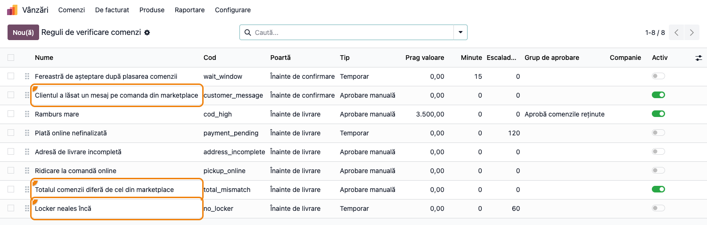
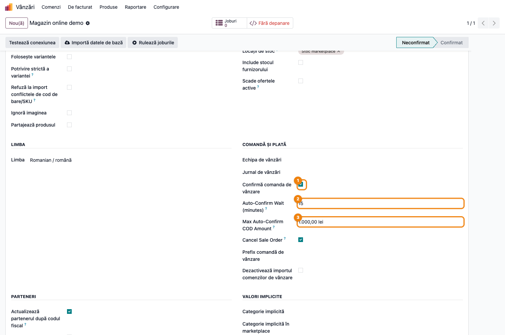
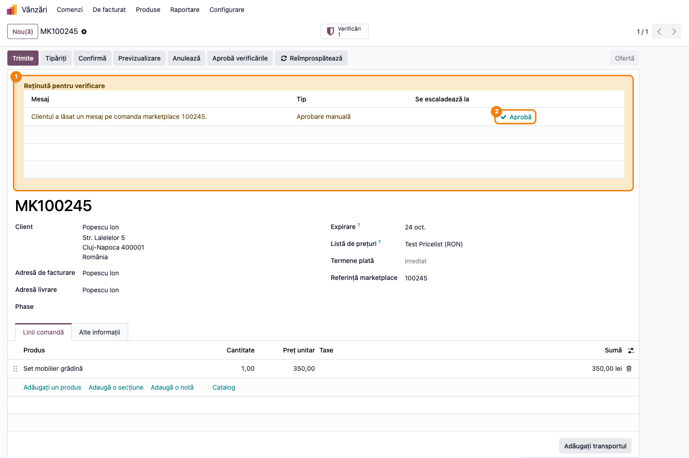
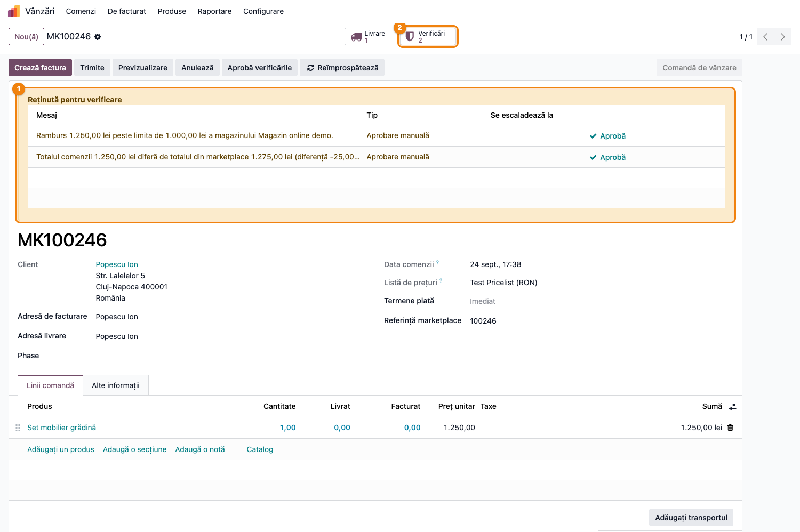
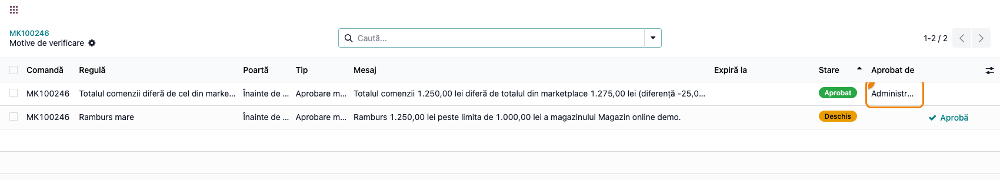

# Fișă Modul: Comenzi din marketplace reținute cu motiv vizibil

**Modul:** `deltatech_marketplace_review`
**Utilizator principal:** Operator comenzi marketplace, Responsabil vânzări, Consultant de implementare
**Prioritate:** 🟡 Medie (control operațional al comenzilor importate — ramburs, mesaj de la client, total diferit; nu obligație legală)

---

## 1. Scop business

Această fișă descrie utilizarea modulului `deltatech_marketplace_review` pentru scenariul
**Comenzi din marketplace reținute cu motiv vizibil**. Modulul este o **punte**, instalată automat
când există împreună conectorii de marketplace (`deltatech_marketplace_sale`) și verificarea
comenzilor (`deltatech_sale_order_review`, suita bitshop).

Fără punte, backend-ul de marketplace avea două gărzi de confirmare automată — *clientul a lăsat un
mesaj* și *rambursul depășește „Max Auto-Confirm COD Amount"* — care opreau confirmarea în tăcere:
comanda rămânea ofertă, fără să spună nimănui de ce. Cu puntea, cele două gărzi devin **motive de
verificare** înregistrate pe comandă, vizibile în bannerul „Reținută pentru verificare" și în coada
**De verificat** din lista de comenzi. Se adaugă două reguli proprii marketplace-ului — **totalul
comenzii diferă de cel din marketplace** și **locker neales încă** — iar confirmarea automată
**revine** la 5 minute cât timp comanda e oprită doar de motive temporare.

## 2. Bază legală și context

Nu există o obligație legală specifică; este un control intern al riscului operațional. Contextul:
comenzile importate din marketplace (eMAG, Shopify, PrestaShop, WooCommerce etc.) ajung în Odoo fără
ca un om să le vadă. O comandă cu ramburs mare, un client care a scris „sunați-mă înainte de
livrare" în nota comenzii sau un total care nu mai corespunde cu cel din magazin (o linie editată,
un transport pierdut la reîmprospătare) costă un colet dus-întors dacă pleacă neverificate.

Cele două **porți** ale verificării, aplicate comenzilor importate:

- **Înainte de confirmare** — comanda rămâne **ofertă**: mesajul lăsat de client pe comanda din
  marketplace. Cineva citește mesajul înainte ca comanda să fie confirmată.
- **Înainte de livrare** — comanda **se confirmă** (stocul se rezervă), dar livrarea e reținută:
  rambursul peste limita backend-ului, totalul diferit de cel din marketplace, lockerul neales.

Pragul de ramburs rămâne **cel al backend-ului** („Max Auto-Confirm COD Amount"), un singur loc de
configurat per magazin, ca înainte; pragul generic al regulii „Ramburs mare" se aplică doar
comenzilor care nu vin dintr-un marketplace sau backend-urilor fără limită proprie.

## 3. Utilizatori și roluri

- **Operator comenzi marketplace** — lucrează coada „De verificat", citește mesajele clienților,
  aprobă motivele pe care le poate aproba.
- **Responsabil vânzări** — aprobă rambursul mare (grupul **Aprobă comenzile reținute**), decide
  la totalul diferit.
- **Consultant de implementare** — configurează backend-ul (politica de confirmare, limita de
  ramburs) și regulile de verificare.

Modulul nu introduce grupuri noi; folosește drepturile din `deltatech_sale_order_review`:
regulile fără „Grup de aprobare" (mesaj client, total diferit) pot fi aprobate de orice utilizator cu
drepturi de vânzări; „Ramburs mare" cere grupul **Aprobă comenzile reținute**. Configurarea
backend-ului cere grupul **Marketplace / Administrator marketplace**.

Roluri recomandate la testare:

- Administrator funcțional: configurează backend-ul și regulile, importă comenzile de test.
- Agent de vânzări simplu: vede bannerul cu motivele; poate aproba mesajul clientului, nu și
  rambursul mare.
- Manager de vânzări: aprobă tot.

## 4. Conturi și date implicate

Modulul **nu generează note contabile** și nu introduce conturi. Lucrează pe comanda de vânzare
(`sale.order`) și pe asocierea ei cu marketplace-ul (`marketplace.sale.order`), de unde citește
faptele raportate de magazin: mesajul clientului, cuantumul rambursului, totalul extern.

Date minime pentru demo:

- un backend de marketplace cu **Confirm Sale Order** bifat și **Max Auto-Confirm COD Amount**
  completat (ex. 1.000 lei), cu un item de backend de tip **Sale Order**;
- un client cu adresă completă și un produs vandabil (ex. 1.250 lei);
- două comenzi importate: una cu mesaj de la client, una cu ramburs peste limită;
- opțional, pentru regula „Locker neales încă": modulele `deltatech_marketplace_delivery` și cel
  de lockere al curierului, cu o metodă de livrare care cere locker.

## 5. Configurare inițială

1. Instalați `deltatech_marketplace_sale` (vine cu conectorul concret) și
   `deltatech_sale_order_review`; puntea `deltatech_marketplace_review` se instalează **automat**.
2. Pe backend-ul de marketplace (**Marketplace → Backends**, tab **Alte informații**, grupul
   **Comandă și plată**) bifați **Confirmă comanda de vânzare**, stabiliți **Auto-Confirm Wait
   (minutes)** (fereastra în care clientul mai poate adăuga un mesaj; 15 implicit) și **Max
   Auto-Confirm COD Amount** (ex. 1.000 lei). Zero înseamnă fără limită proprie.
3. Accesați **Vânzări → Configurare → Reguli de verificare comenzi** și verificați regulile
   marketplace-ului: **Clientul a lăsat un mesaj pe comanda din marketplace** (poartă „Înainte de
   confirmare", aprobare manuală) și **Totalul comenzii diferă de cel din marketplace** (poartă
   „Înainte de livrare", aprobare manuală, prag 0 = orice diferență). Activați și **Ramburs mare**
   — pragul ei generic nu contează pentru comenzile din marketplace, dar regula trebuie să fie
   activă ca limita backend-ului să producă un motiv.
4. **Locker neales încă** este inactivă implicit; porniți-o doar cu modulele de livrare marketplace
   și lockere instalate. Are 60 de minute până la escaladare.
5. Verificați că persoanele care aprobă rambursul mare sunt în grupul **Aprobă comenzile reținute**
   (managerii de vânzări îl au implicit).
6. Nu e nevoie de acțiune planificată nouă: cea din `deltatech_sale_order_review` reevaluează
   motivele la 5 minute, iar jobul de confirmare al conectorului revine singur (vezi Pasul 3).

## 6. Flux de utilizare

### Pasul 1 — Regulile marketplace-ului în lista de verificare

Accesați **Vânzări → Configurare → Reguli de verificare comenzi**. Pe lângă regulile generale,
apar cele aduse de punte: **Clientul a lăsat un mesaj pe comanda din marketplace** (poartă „Înainte
de confirmare"), **Totalul comenzii diferă de cel din marketplace** și **Locker neales încă** (poartă
„Înainte de livrare"; a doua e temporară, cu escaladare la 60 min, și inactivă implicit). Comutatorul
**Activ** pornește și oprește fiecare regulă fără s-o șteargă.



### Pasul 2 — Politica de confirmare pe backend

Deschideți **Marketplace → Backends → backend-ul magazinului**, tab **Alte informații**, grupul
**Comandă și plată**. Aici stau setările care alimentează motivele: ① **Confirmă comanda de vânzare**
— confirmarea automată e pornită; ② **Auto-Confirm Wait (minutes)** — minutele de așteptare după
import, în care clientul mai poate adăuga un mesaj; ③ **Max Auto-Confirm COD Amount** — limita de
ramburs a magazinului, peste care comanda e reținută înainte de livrare. Cu modulul instalat, jobul
de confirmare se programează pentru **orice** comandă importată când ① e bifat; comanda reținută nu
mai rămâne ofertă fără urmă.



### Pasul 3 — Comanda importată reținută de mesajul clientului

Conectorul importă comanda **MK100245**; clientul a scris o notă pe comanda din magazin. La
trecerea ferestrei de așteptare, jobul de confirmare întreabă verificarea și se oprește: comanda
rămâne **Ofertă**, cu bannerul galben ① **Reținută pentru verificare** și motivul „Clientul a lăsat
un mesaj pe comanda marketplace 100245", tip **Aprobare manuală**. În lista de comenzi, comanda are
badge-ul **De verificat**.

Operatorul citește mesajul în marketplace (sau în chatter, dacă conectorul îl aduce), apoi apasă
② **Aprobă** pe rândul motivului. La următoarea reluare a jobului de confirmare (5 minute), sau la
**Confirmă** apăsat manual, comanda trece în **Comandă de vânzare**. Alternativ, **Aprobă
verificările** din antet aprobă toate motivele deschise, cu o notă.

Cât timp comanda e oprită doar de motive **temporare** (fereastra de așteptare, o plată cu cardul
încă în curs — starea **În așteptare, se reverifică automat**), conectorul revine singur din 5 în 5
minute și confirmă când motivele se închid. Un motiv de **aprobare manuală**, ca acesta, oprește
reluările: comanda așteaptă un om.



### Pasul 4 — Comanda confirmată, reținută de rambursul peste limită

Comanda **MK100246** vine cu ramburs de 1.250 lei, peste limita de 1.000 lei a backend-ului. Poarta
e „Înainte de livrare", deci confirmarea automată **trece**: comanda e **Comandă de vânzare**, cu
livrarea generată (smart button **Livrare**), dar bannerul ① listează motivul „Ramburs 1.250,00 lei
peste limita de 1.000,00 lei a magazinului Magazin online demo". Mesajul spune explicit că pragul e
al magazinului, nu cel generic al regulii.

Pe aceeași comandă, conectorul a raportat la reîmprospătare un total din marketplace de 1.275 lei,
față de 1.250 lei în Odoo: apare al doilea motiv, „Totalul comenzii … diferă de totalul din
marketplace … (diferență -25,00 lei)". Diferența era înainte doar o notă în chatter; acum reține
livrarea până cineva o lămurește (de regulă un transport care nu s-a preluat).

**Găsește pe ecran:** bannerul galben de sub antet, câte un rând per motiv, cu **Tip** și, la cele
temporare, **Se escaladează la**; smart button-ul ② **Verificări** arată numărul motivelor.
**Verifică:** valoarea rambursului din mesaj corespunde cu ce a raportat marketplace-ul; totalul
Odoo și cel extern se explică (transport, discount) înainte de aprobare.
**Treci mai departe:** **Aprobă** pe fiecare motiv (rambursul cere grupul de aprobare) sau **Aprobă
verificările**; livrarea intră apoi în fluxul normal. Când e instalată și puntea către amânarea
livrării, livrarea reținută nu poate fi validată sau trimisă la curier până la aprobare.



### Pasul 5 — Istoricul motivelor

Din smart button-ul **Verificări** se deschide lista **Motive de verificare** ale comenzii: regula,
poarta, tipul, mesajul, starea (**Deschis** / **Rezolvat** / **Aprobat**) și **Aprobat de**. Aici se
vede că totalul diferit a fost aprobat de administrator (cu nota „Diferența e transportul, confirmat
cu magazinul"), iar rambursul mare e încă deschis, cu butonul **Aprobă** pe rând. Aprobarea e **pe
valoare**: dacă marketplace-ul raportează ulterior un ramburs mai mare, motivul se redeschide singur.



### Note de monografie și raportare

Modulul nu generează note contabile — condiționează doar confirmarea automată și livrarea
comenzii importate. Facturarea urmează fluxul standard al conectorului odată ce motivele sunt
aprobate sau rezolvate. Urma de audit este lista de motive de pe comandă și notele din chatter
(„Comandă reținută pentru verificare: …", „Verificare aprobată de …"), plus nota conectorului la
diferența de total.

## 7. Legături cu alte module / declarații

| Modul / proces | Rol în flux | Tip legătură |
|---|---|---|
| `deltatech_marketplace_sale` | importul comenzii, jobul `try_to_confirm`, câmpurile „Confirm Sale Order" / „Max Auto-Confirm COD Amount" / „Auto-Confirm Wait", mesajul clientului și rambursul pe asociere, verificarea totalului | dependență (manifest) |
| `deltatech_sale_order_review` (bitshop) | regulile, motivele, porțile, bannerul, coada „De verificat", grupul de aprobare, acțiunea planificată la 5 minute | dependență (manifest) |
| conectorii concreți (`deltatech_marketplace_emag`, `_shopify`, `_prestashop`, …) | raportează mesajul clientului, rambursul și totalul extern; unii reîmprospătează mesajul după fereastra de așteptare | furnizori de date |
| `deltatech_marketplace_delivery` + modulul de lockere al curierului | câmpurile „locker pe asociere" și „metoda cere locker", fără de care regula „Locker neales încă" nu are ce verifica | opțional |
| puntea către `deltatech_delivery_status` | blocarea efectivă a livrării pentru motivele de pe poarta de livrare | opțional |

Ce este automat: transformarea gărzilor backend-ului în motive, la import și la reîmprospătare;
reevaluarea la fiecare verificare a totalului; programarea jobului de confirmare pentru orice
comandă importată și reluarea lui la 5 minute cât comanda e doar „În așteptare"; rezolvarea
motivelor temporare (lockerul ales, plata finalizată); notele din chatter.
Ce rămâne manual: citirea mesajului clientului și aprobarea lui, aprobarea rambursului peste limită
și a totalului diferit, stabilirea limitei de ramburs pe backend și a minutelor de așteptare.

## 8. Verificări pentru consultant

- [ ] Cu `deltatech_marketplace_sale` și `deltatech_sale_order_review` instalate, puntea apare
      instalată automat (aplicația **Sale Order Review - Marketplace**).
- [ ] **Vânzări → Configurare → Reguli de verificare comenzi** listează „Clientul a lăsat un mesaj
      pe comanda din marketplace" (Înainte de confirmare), „Totalul comenzii diferă de cel din
      marketplace" (Înainte de livrare) și „Locker neales încă" (inactivă implicit, temporară, 60 min).
- [ ] O comandă importată cu mesaj de la client rămâne **Ofertă**, cu bannerul „Reținută pentru
      verificare" și motivul mesajului; după **Aprobă**, jobul de confirmare (sau **Confirmă**) o
      trece în **Comandă de vânzare**.
- [ ] O comandă cu ramburs peste **Max Auto-Confirm COD Amount** se **confirmă** (livrarea există),
      dar are motivul „Ramburs … peste limita de … a magazinului …" deschis; sub limită nu apare
      niciun motiv, indiferent de pragul generic al regulii „Ramburs mare".
- [ ] Un total extern diferit de cel Odoo (raportat de conector) produce motivul „Totalul comenzii
      diferă …"; când totalurile coincid din nou, motivul trece în **Rezolvat**.
- [ ] O comandă oprită doar de motive temporare (**În așteptare, se reverifică automat**) primește
      un job de confirmare reprogramat la 5 minute (vizibil în **Queue Jobs**); una cu motiv de
      aprobare manuală nu primește reluări.
- [ ] Smart button-ul **Verificări** arată istoricul cu „Aprobat de" și nota; aprobarea rambursului
      e vizibilă doar utilizatorilor din grupul **Aprobă comenzile reținute**.
- [ ] Anularea comenzii (din marketplace sau din Odoo) închide motivele deschise.

## 9. Mesaje de eroare frecvente

| Mesaj / simptom | Cauză probabilă | Remediere |
|-----------------|-----------------|-----------|
| Comanda importată rămâne Ofertă fără banner și fără motiv | **Confirmă comanda de vânzare** e nebifat pe backend (comanda e lăsată intenționat ca ofertă trimisă) sau regulile sunt inactive | Bifați politica de confirmare pe backend; activați regulile în **Reguli de verificare comenzi** |
| Rambursul e peste limita backend-ului, dar nu apare motivul | Regula **Ramburs mare** e inactivă, sau conectorul nu raportează un cuantum de ramburs pentru acea comandă | Activați regula (pragul ei generic nu contează); verificați câmpul de ramburs pe asocierea comenzii |
| „Comanda este reținută pentru verificare și nu poate fi confirmată: …" la Confirmă manual | Un motiv deschis pe poarta de confirmare (mesajul clientului) pe care utilizatorul nu îl poate aproba | Un utilizator cu drept de aprobare confirmă prin wizard sau aprobă motivul din banner |
| Motivul „Totalul comenzii diferă …" rămâne deschis după corectarea liniilor | Reevaluarea vine la următoarea verificare a totalului de către conector sau din acțiunea planificată | Rulați **Reîmprospătează** pe comandă sau așteptați acțiunea planificată (5 min) |
| Regula „Locker neales încă" e activă, dar nu produce niciodată motive | Lipsesc `deltatech_marketplace_delivery` și/sau modulul de lockere al curierului; fără câmpurile lor regula nu are ce verifica | Instalați modulele sau lăsați regula inactivă |
| Comanda „În așteptare" nu se confirmă singură după ce motivul s-a închis | Jobul de reluare a eșuat sau coada `queue_job` nu rulează | Verificați **Queue Jobs** pe canalul backend-ului; reporniți jobul eșuat |

## 10. Capturi de ecran

Capturile (`readme/screenshots/`) sunt generate automat din `tests/test_screenshots.py` (mixinul
`ScreenshotCase` din `l10n_ro_doc_screenshots`, import defensiv), în limba română, pe compania RO:

1. `01_reguli_marketplace.png` — lista regulilor de verificare, cu cele trei reguli marketplace
   evidențiate (mesaj client, total diferit, locker neales).
2. `02_backend_confirmare.png` — backend-ul marketplace, tab „Alte informații": Confirmă comanda de
   vânzare, Auto-Confirm Wait (minutes), Max Auto-Confirm COD Amount.
3. `03_comanda_mesaj_client.png` — oferta importată reținută înainte de confirmare, cu bannerul
   „Reținută pentru verificare" și motivul mesajului clientului.
4. `04_comanda_ramburs_limita.png` — comanda confirmată, reținută înainte de livrare: ramburs peste
   limita backend-ului și total diferit de cel din marketplace.
5. `05_istoric_motive.png` — istoricul motivelor comenzii, cu totalul diferit aprobat și rambursul
   deschis.

Regenerare (test Playwright, `tests/test_screenshots.py`; cere `l10n_ro` instalat pentru compania
RO și `deltatech_sale_order_review` din suita bitshop în `addons_path`):

```bash
./odoo/odoo-bin -c odoo.conf -d <db> -i l10n_ro,l10n_ro_doc_screenshots -u deltatech_marketplace_review \
    --test-tags=fise_screenshots --stop-after-init
```

## 11. Observații pentru manual

Păstrați în manual ideea centrală: gărzile de confirmare ale backend-ului nu se schimbă, dar
**devin vizibile** — comanda oprită spune de ce, pe formular și în coada „De verificat". Insistați
pe diferența dintre cele două porți: mesajul clientului ține comanda **ofertă**, rambursul peste
limită și totalul diferit o **confirmă**, dar îi rețin livrarea. Precizați că limita de ramburs se
configurează **pe backend**, per magazin, iar pragul generic al regulii nu o înlocuiește. Menționați
reluarea automată la 5 minute doar pentru motivele temporare — operatorul nu trebuie să confirme
manual o comandă care aștepta doar fereastra de așteptare sau o plată cu cardul. Regula „Locker
neales încă" merită un paragraf separat, doar la clienții cu lockere.
