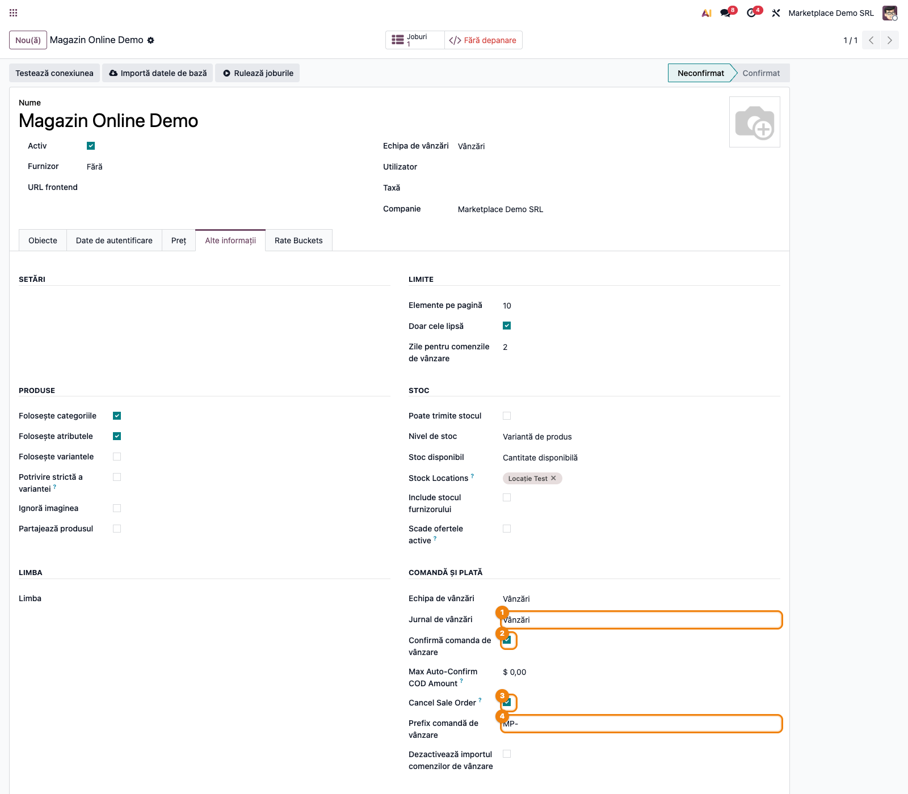
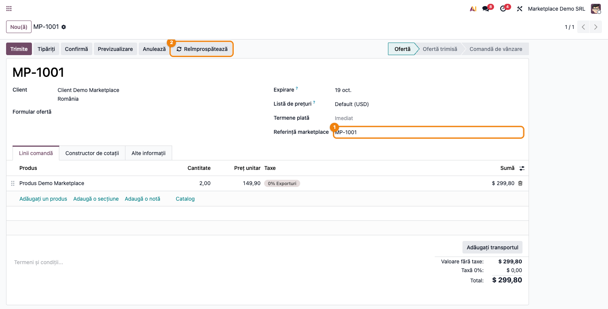
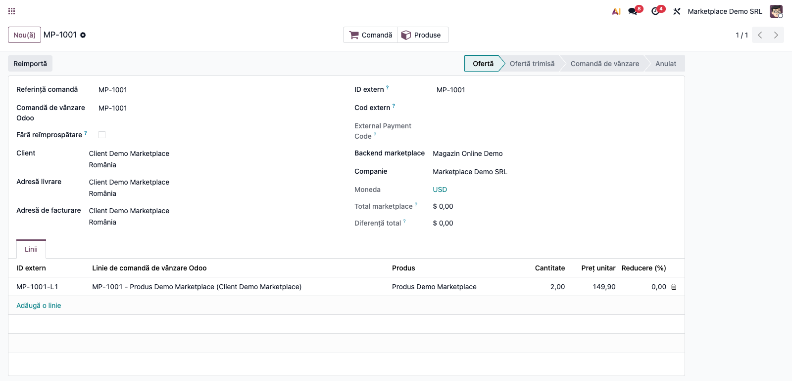
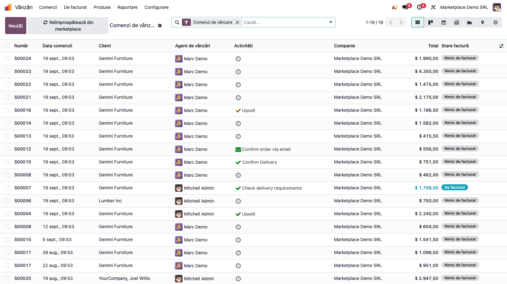
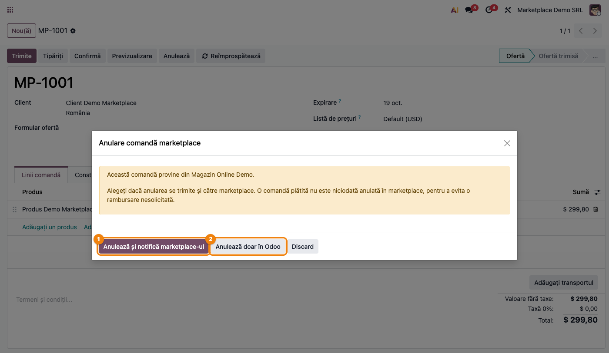
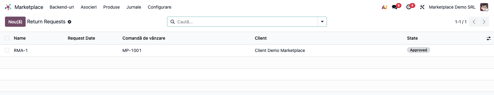
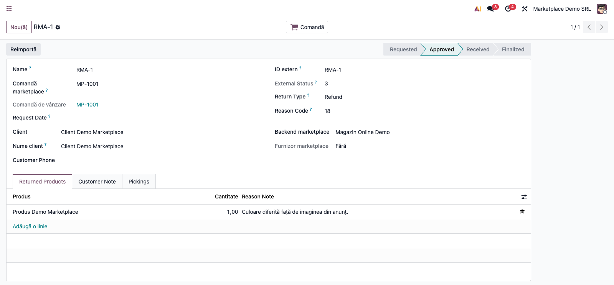
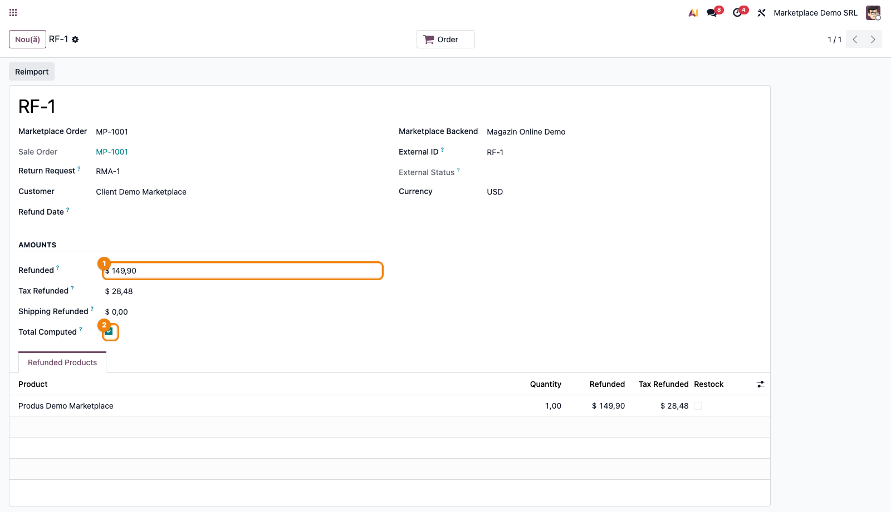

# Fișă Modul: Hub-ul comenzilor de vânzare din marketplace (comenzi, retururi, rambursări)

**Modul:** `deltatech_marketplace_sale`
**Utilizator principal:** Consultant Odoo / administrator funcțional (configurare backend), operator vânzări/e-commerce (utilizare curentă)
**Prioritate:** 🔴 Ridicată (dependință directă a tuturor conectorilor din suită — eMAG, Shopify, WooCommerce, Magento, PrestaShop, MerchantPro, Trendyol)

---

## 1. Scop business

Acest modul este **hub-ul comun** peste care se așază toți conectorii de marketplace din suita
Terrabit (eMAG, Shopify, WooCommerce, Magento, PrestaShop, MerchantPro, Trendyol): niciunul dintre
ei nu știe singur cum devine o comandă externă `sale.order`, cum se ține evidența retururilor sau a
rambursărilor — toate folosesc acest modul. El transformă comenzile venite din orice canal
(marketplace sau magazin online) în comenzi de vânzare Odoo, ține **registrul comun al cererilor de
retur (RMA)** — ce vrea clientul să trimită înapoi, de ce, pe ce comandă și în ce stadiu este cererea,
în același vocabular indiferent de canal — și **registrul rambursărilor** (`marketplace.refund`):
banii dați efectiv înapoi cumpărătorului, cu sumele pe linie și TVA-ul acolo unde marketplace-ul îl
raportează separat. Retururile și rambursările sunt **importate, nu conduse de acest modul**:
aprobarea sau refuzul unei cereri rămâne o acțiune făcută în marketplace, iar din acest registru nu se
creează automat nicio ridicare de retur (picking), notă de credit sau rambursare efectivă.

Modulul mai asigură circulația în ambele sensuri: o editare făcută în Odoo pe o comandă deja legată
de un canal (comanda însăși sau liniile ei — cantitate, adăugare/ștergere de linie, indiferent dacă
editarea vine din formular, dintr-un wizard, dintr-un server action sau din alt modul) este semnalată
conectorului respectiv, care decide dacă și cum trimite schimbarea mai departe — unele canale (ex.
Shopify) nu pot accepta un preț nou pe o linie existentă. Ce ajunge la conector este **faptul că
liniile s-au schimbat**, nu o listă de diferențe: conectorul recitește comanda, pentru că schimbarea
brută oferită de Odoo descrie editarea, nu rezultatul ei. Simetric, nimic scris la import nu este
retrimis: valorile venite dintr-un marketplace se scriu sub un indicator de context dedicat, ca o
reîmprospătare să nu devină din greșeală un export al datelor pe care marketplace-ul tocmai le-a dat.

## 2. Arhitectură tehnică și context

Modulul nu implementează un API extern propriu — depinde de `deltatech_marketplace` (framework-ul
comun de backend, job-uri și binding-uri) și de `sale_stock`/`stock_delivery`, și oferă contractul pe
care fiecare conector concret (eMAG, Shopify, WooCommerce ...) îl completează cu propriile metode
`<provider>_import`, `<provider>_after_confirm_order`, `<provider>_after_invoice_post`,
`<provider>_after_send_to_shipper` etc. — apelate prin `hasattr`, deci absența unei metode pe un
conector care nu are nevoie de acel hook este normală, nu o eroare.

Trei modele-cheie:

- `marketplace.sale.order` — binding peste `sale.order` (prin `_inherits`), cu comanda Odoo delegată;
  păstrează totalul raportat de marketplace, diferența față de totalul Odoo, codul intern al metodei
  de plată așa cum a fost raportat de marketplace și valoarea voucherelor aplicate.
- `marketplace.return.request` — **fără** `_inherits`: la anunțarea unui retur nu există încă niciun
  document Odoo de care să se lege, ridicarea de retur (dacă vreodată se creează) doar se
  **referențiază** (`picking_ids`), nu se generează automat.
- `marketplace.refund` — separat de cererea de retur, cu `return_request_id` **opțional**: unele
  canale pot rambursa banii fără ca marfa să se întoarcă efectiv, iar un retur poate fi decontat în
  mai multe tranșe (mai multe rambursări pe aceeași cerere).

## 3. Utilizatori și roluri

- **Consultant/administrator funcțional**: configurează pe backend echipa de vânzări, jurnalul,
  poziția fiscală, politica de confirmare/anulare automată și produsele de discount/voucher; verifică
  drepturile de acces pe modelele de binding.
- **Operator vânzări/e-commerce**: urmărește comenzile importate, rezolvă manual anularea sau
  reîmprospătarea unei comenzi, gestionează cererile de retur și rambursările din registrele comune.

Roluri recomandate la testare:
- Administrator funcțional: instalează modulul și configurează câmpurile specifice pe backend.
- Utilizator operațional: rulează fluxul zilnic — import comandă, confirmare, anulare, retur.
- Manager/consultant: validează rezultatul (comanda de vânzare, starea binding-ului, registrele de
  retur/rambursare).

## 4. Date și mapări implicate

Nu există note contabile Dr/Cr generate direct de acest modul — factura rezultată din comanda de
vânzare urmează contabilizarea standard Odoo (`sale`/`account`), neatinsă de acest hub. Ce trebuie
pregătit înainte de a testa fluxul:

- **Backend de marketplace** (`marketplace.backend`, din `deltatech_marketplace`) — pe care acest
  modul adaugă, **vizibile în formular**: **Sales Journal**, **Confirm Sale Order**, **Max
  Auto-Confirm COD Amount** (vizibil doar când **Confirm Sale Order** e bifat — peste acest plafon,
  o comandă cu ramburs (COD) NU se mai confirmă automat, chiar dacă politica de confirmare e activă;
  rămâne pentru revizuire manuală; gol/zero = fără plafon), **Cancel Sale Order** (activ implicit),
  **SO Prefix**, **Disable Import Sale Order**, **Fiscal Position**, **Tax Correction** (activ
  implicit), **Sale Order Days**, **Discount Product**, **Voucher Product**. Câmpul **Sales Team**
  există deja în antetul generic al framework-ului (nu e adăugat de acest modul).
  **Return Request Days** (implicit 7 zile — mai mare decât fereastra de import a comenzilor, pentru
  că un client poate cere retur mult după livrare) și **Disable Return Import** există **doar pe
  model**, fără câmp corespunzător în `views/backend_views.xml` — se pot seta doar tehnic (RPC,
  Studio sau `write()` direct), nu din formularul standard al backend-ului. Nu promiteți clientului
  că le poate schimba din interfață.
- **Item-uri de backend** (`marketplace.backend.item`) pentru tipurile `orders`, `sale_tag` și
  `returns` — fiecare conector le creează la configurare; fără item-ul `orders`, importul de comenzi
  nu are unde să scrie.
- **Produs de discount** (`discount_product_id`) — obligatoriu dacă un conector adaugă o linie de
  reducere pe comandă; fără el, adăugarea liniei de discount eșuează cu eroare explicită.
- **Produs de voucher** (`voucher_product_id`) — separat de produsul de discount, pentru că un
  voucher e o plată suportată de un terț, nu o reducere comercială, și de regulă vine cu TVA 0% și
  cont de decontare diferit.
- Date minime pentru demo: un backend de test, un client, un produs vandabil, o comandă de test
  importată prin `save_from_marketplace`.

## 5. Configurare inițială

1. Instalați modulul `deltatech_marketplace_sale` (de regulă instalat automat ca dependență a unui
   conector concret — eMAG, Shopify etc.).
2. Pe backend-ul de marketplace, completați **Sales Team**, **Sales Journal** și, dacă e cazul,
   **Fiscal Position**.
3. Decideți politica de confirmare: **Confirm Sale Order** bifat confirmă automat comanda importată;
   nebifat, comanda rămâne ca ofertă trimisă (`sent`), de confirmat manual. Dacă backend-ul
   raportează și un cuantum de ramburs (COD), completați opțional **Max Auto-Confirm COD Amount** —
   peste acest plafon, confirmarea automată se oprește și comanda rămâne de revizuit manual.
4. Decideți politica de anulare: **Cancel Sale Order** bifat (implicit) anulează automat comanda Odoo
   când marketplace-ul o raportează anulată.
5. Completați **Discount Product**/**Voucher Product** dacă backend-ul concret le folosește.
6. Creați cel puțin un item de backend cu **Item Type = Sale Order** — fără el, importul de comenzi
   nu are unde să scrie binding-ul.
7. Pregătiți un client și un produs vandabil pentru comanda de test.

## 6. Flux de utilizare

### Pasul 1 — Câmpurile specifice de comandă pe backend

Deschideți **Marketplace → Backends**, formularul unui backend deja creat. Câmpul **Sales Team**
există deja în antetul generic al framework-ului (`deltatech_marketplace`); acest modul adaugă, în
grupul **„Order and Payment"** din tab-ul **Other Info**: **Sales Journal**, **Confirm Sale Order**,
**Cancel Sale Order**, **SO Prefix**, **Disable Import Sale Order**, plus **Fiscal Position** și
**Tax Correction** lângă monedă (tab **Price**), și **Discount Product**/**Voucher Product** în
grupul de produse implicite.



### Pasul 2 — Comanda de vânzare importată

O comandă importată dintr-un marketplace apare ca o comandă Odoo obișnuită, în **Vânzări → Comenzi**,
cu câmpul **marketplace_ref** completat (lângă termenul de plată) și, în antet, butonul **Refresh**
(vizibil doar când comanda are o referință de marketplace) — reimportă comanda din canalul de
origine.



### Pasul 3 — Binding-ul comenzii (Marketplace → Asocieri → Sale Orders)

Meniul **Marketplace → Asocieri → Sale Orders** (submeniu al „Asocieri" / „Bindings", comun tuturor
tipurilor de binding-uri din framework) deschide lista binding-urilor `marketplace.sale.order`: sursa
externă (`external_id`, `external_code`, `external_payment_code`), diferența de total față de
marketplace (`amount_difference`) și, pe formular, tab-ul **Lines** cu liniile comenzii legate de
binding-ul lor extern. Butonul **Reimport** din antet reia importul acelei comenzi.



### Pasul 4 — Reîmprospătarea în masă (Refresh Marketplace)

Din lista de comenzi de vânzare, butonul **Refresh Marketplace** din antet reimportă comenzile
selectate (sau, fără nicio selecție, declanșează job-ul periodic de import pentru toate backend-urile
active) — util când operatorul suspectează că o comandă nu s-a sincronizat corect.



### Pasul 5 — Anularea unei comenzi cu binding de marketplace

La apăsarea **Cancel** pe o comandă legată de un marketplace, în loc de anularea directă apare
dialogul **Cancel Marketplace Order**: arată canalul de origine (`backend_names`) și lasă operatorul
să aleagă între **Cancel & Notify Marketplace** (anulează în Odoo și trimite statusul mai departe) și
**Cancel in Odoo Only** (anulează doar local, fără să notifice marketplace-ul — util pentru o comandă
deja plătită, ca să nu declanșeze o rambursare nesolicitată).



### Pasul 6 — Cererile de retur (RMA)

Meniul **Marketplace → Asocieri → Return Requests** deschide registrul comun de retururi: fiecare cerere are
starea în vocabularul comun (**Requested → Approved → Received → Finalized**, sau **Rejected**/
**Cancelled**), tipul cerut de cumpărător (**Refund**/**Exchange**/**Voucher**/**Other**), motivul
raportat de canal și, pe formular, tab-urile **Returned Products**, **Customer Note** și
**Pickings** — ridicările de retur asociate manual, dacă există.





### Pasul 7 — Rambursările

Meniul **Marketplace → Asocieri → Refunds** deschide registrul rambursărilor: suma totală, TVA-ul separat acolo
unde canalul îl raportează astfel, legătura opțională către cererea de retur și indicatorul **Total
Computed** — activ când suma nu a fost raportată de marketplace ca total, ci calculată din liniile
rambursării (`compute_amount_total`).



### Note de monografie și raportare

Nu se aplică — acest modul nu generează note contabile proprii. Comanda de vânzare importată, retururile
și rambursările urmează contabilizarea standard Odoo (`sale`/`account`/`stock`), declanșată normal la
confirmare/facturare, neatinsă de acest hub.

## 7. Legături cu alte module / declarații

| Modul / proces | Rol în flux | Tip legătură |
|---|---|---|
| `deltatech_marketplace` | framework comun: backend, binding-uri, job-uri, `marketplace.binding` | dependență (manifest) |
| `sale_stock` / `stock_delivery` | comanda de vânzare cu livrare, transportator, expediție | dependență (manifest) |
| `deltatech_marketplace_emag` / `_shopify` / `_woocommerce` / `_magento` / `_prestashop` / `_merchantpro` / `_trendyol` | conectorii concreți care implementează `<provider>_import` și hook-urile `after_*` peste acest hub | dependent de acest modul |
| `account` | factura generată la confirmarea/facturarea comenzii importate (`after_invoice_post`) | flux standard Odoo |
| `stock` | expedițiile generate din comanda de vânzare (`after_send_to_shipper`, `after_picking_set_status`) | flux standard Odoo |

Ce este automat: transformarea unei comenzi externe în `sale.order` (`save_from_marketplace`),
propagarea semnalului de „linii schimbate" către binding la orice editare de linie (formular, wizard,
server action, alt modul), suprimarea exportului valorilor tocmai importate, anularea automată a
comenzii Odoo când marketplace-ul o raportează anulată (dacă **Cancel Sale Order** e activ),
notificarea conectorului la confirmare, la facturare și la trimiterea către curier.

Ce rămâne manual: aprobarea/refuzul unei cereri de retur (rămâne o acțiune în marketplace, nu în acest
registru), crearea ridicării de retur/notei de credit/rambursării efective pornind de la o cerere
importată, alegerea explicită „notific marketplace-ul sau doar anulez în Odoo" la fiecare anulare.

## 8. Verificări pentru consultant

- [ ] Modulul se instalează fără erori pe baza demo, ca dependință a unui conector concret.
- [ ] Backend-ul are **Sales Team**/**Sales Journal** completate înainte de primul import de comenzi.
- [ ] Politica de confirmare (**Confirm Sale Order**) este cea așteptată de client — bifată confirmă
      automat, nebifată lasă comanda ca ofertă trimisă (`sent`).
- [ ] **Max Auto-Confirm COD Amount** este cunoscut clientului dacă vinde cu ramburs: peste acest
      plafon, o comandă COD nu se confirmă automat nici cu **Confirm Sale Order** activ.
- [ ] **Return Request Days**/**Disable Return Import** nu sunt promise ca setabile din formularul
      backend-ului — există doar pe model, fără câmp în view; orice ajustare a lor e tehnică.
- [ ] Politica de anulare (**Cancel Sale Order**) este cunoscută de client — bifată (implicit) anulează
      automat comanda Odoo la anulare raportată de marketplace.
- [ ] O comandă cu binding de marketplace deschide dialogul de alegere la **Cancel**, nu anulează
      direct — verificați ambele opțiuni (cu/fără notificare).
- [ ] O editare de linie făcută dintr-un wizard sau server action (nu doar din formularul comenzii)
      ajunge la binding — verificați că `_marketplace_notify_lines_changed` se declanșează și pe
      această cale.
- [ ] Registrul de retururi reflectă corect starea raportată de canal (vocabularul comun), inclusiv
      pentru un status pe care conectorul nu-l mapează explicit (rămâne vizibil în `external_state`).
- [ ] Clientul știe că din acest registru **nu** se creează automat ridicare de retur, notă de credit
      sau rambursare — sunt doar informative/de urmărire, decizia rămâne manuală sau se ia în
      marketplace.
- [ ] O rambursare fără cerere de retur asociată este acceptată (cazul „banii înapoi, marfa nu se
      întoarce"), nu blocată de o constrângere obligatorie.
- [ ] Indicatorul **Total Computed** de pe o rambursare e înțeles corect: activ înseamnă totalul a
      fost sumat din linii, nu raportat de marketplace ca atare.
- [ ] Discount Product/Voucher Product sunt completate pe backend dacă un conector concret le
      folosește — altfel adăugarea liniei de discount/voucher eșuează cu eroare explicită.

## 9. Mesaje de eroare frecvente

| Mesaj / simptom | Cauză probabilă | Remediere |
|---|---|---|
| „Discount product is not set for backend ..." | Backend-ul nu are **Discount Product** completat, iar un conector a încercat să adauge o linie de reducere | Completați **Discount Product** pe backend-ul respectiv |
| „... missing from Marketplace Order" la importul unei linii | Linia de comandă a fost trimisă înainte de comanda-părinte, sau comanda a fost ștearsă | Verificați ordinea importului; reimportați comanda din binding-ul ei |
| Anularea comenzii nu mai deschide dialogul de alegere | Contextul `marketplace_cancel_confirmed`/`from_marketplace` era deja setat (anulare programatică, în masă) — comportament intenționat | Normal pentru anulări automate/în masă; pentru un operator uman, verificați butonul folosit |
| O editare de linie (din wizard/alt modul) nu ajunge la marketplace | Contextul `from_marketplace` era activ pe scriere, sau câmpul modificat nu e în `MARKETPLACE_LINE_FIELDS` | Verificați dacă schimbarea chiar afectează unul din câmpurile urmărite (produs, cantitate, UM, preț, discount, taxe, denumire) |
| O rambursare nu poate fi creată fără `marketplace_order_id` | Câmpul e obligatoriu — o rambursare nu poate exista fără comanda pe care s-a făcut vânzarea | Legați rambursarea de comanda de marketplace corectă înainte de a o salva |
| Comanda importată rămâne „sent" deși se aștepta confirmare automată | **Confirm Sale Order** e dezactivat pe backend | Activați bifa, sau confirmați manual comanda |

## 10. Capturi de ecran

> Interfața de bază (meniuri, butoane native „Nou(ă)"/„Anulează") e în **română**. Câmpurile mai noi
> ale registrelor de retururi/rambursări (adăugate în 2026: `Request Date`, `External Status`,
> `Return Type`, `Reason Code`, `Customer Phone`, `Returned Products`, `Customer Note`, `Pickings`,
> `Refunded`, `Tax Refunded`, `Shipping Refunded`, `Total Computed` etc.) apar încă **în engleză** în
> capturi — `i18n/ro.po` al modulului nu are încă intrări pentru ele. Nu promiteți clientului o
> interfață RO completă pe aceste două ecrane până la completarea traducerii. Sumele apar în USD
> (moneda listei de prețuri implicite din baza de test), nu în RON — fluxul nu are conținut contabil
> sensibil la monedă, dar nu confundați cu o captură pe „RO Company" în RON ca la fișele contabile.

Capturile (`readme/screenshots/`) ilustrează fluxul din secțiunea 6, generate cu
`ScreenshotCase`/Playwright (`tests/test_screenshots.py`, import defensiv):

1. `01_backend_sale_fields.png` — backend de marketplace, tab Other Info: Sales Journal, Confirm
   Sale Order, Max Auto-Confirm COD Amount, Cancel Sale Order, SO Prefix.
2. `02_sale_order_marketplace_ref.png` — comanda de vânzare cu `marketplace_ref` completat și butonul
   Refresh în antet.
3. `03_marketplace_order_binding.png` — formularul binding-ului `marketplace.sale.order` (tab Lines,
   cu linia comenzii, buton Reimport).
4. `04_refresh_marketplace_button.png` — lista de comenzi de vânzare, butonul Refresh Marketplace din
   antet, lângă butonul nativ „Nou(ă)".
5. `05_cancel_wizard.png` — dialogul real de anulare (deschis din butonul „Anulează" al comenzii),
   cu cele două butoane evidențiate: „Anulează și notifică marketplace-ul" / „Anulează doar în Odoo".
6. `06_return_request_list.png` — lista cererilor de retur.
7. `07_return_request_form.png` — formularul unei cereri de retur.
8. `08_refund_form.png` — formularul unei rambursări, cu indicatorul Total Computed.

Regenerare:

```bash
./odoo/odoo-bin -c odoo.conf -d <db> -u deltatech_marketplace_sale,l10n_ro_doc_screenshots \
    --test-enable --test-tags=fise_screenshots --stop-after-init
```

## 11. Observații pentru manual

În manualul final, subliniați rolul de **hub comun**: acest modul nu se instalează de sine stătător
pentru un client, ci ca dependință a unui conector concret — comportamentul vizibil pentru operator
(cum arată o comandă importată, ce se întâmplă la anulare) e definit aici, dar sincronizarea propriu-
zisă (produse, stoc, AWB) e descrisă în fișa fiecărui conector. Insistați asupra celor două registre
**doar informative** (retururi, rambursări) — niciunul nu declanșează automat un document contabil sau
de stoc — și asupra alegerii explicite la anularea unei comenzi de marketplace (notific canalul sau
anulez doar în Odoo), gândită special pentru a nu declanșa o rambursare nedorită pe o comandă deja
plătită.
