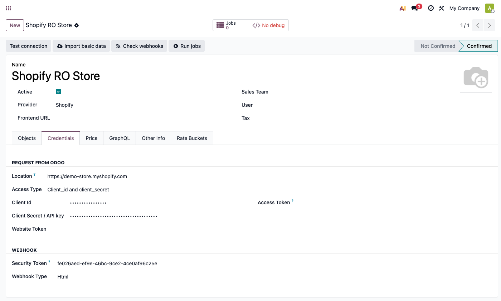
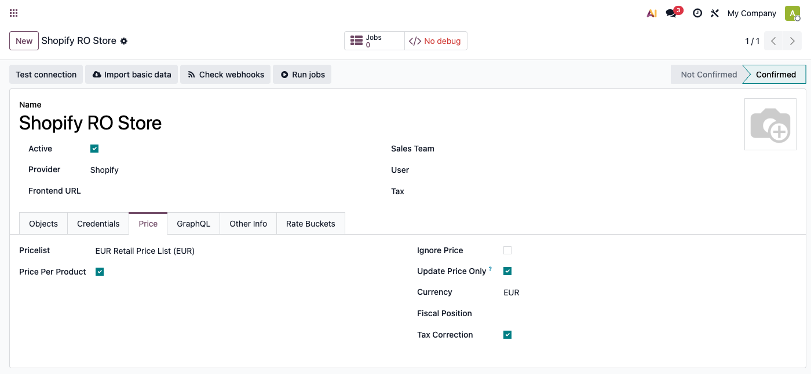
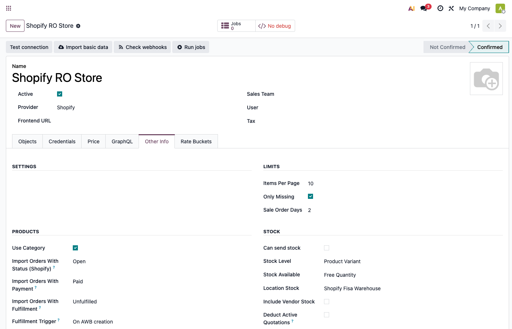
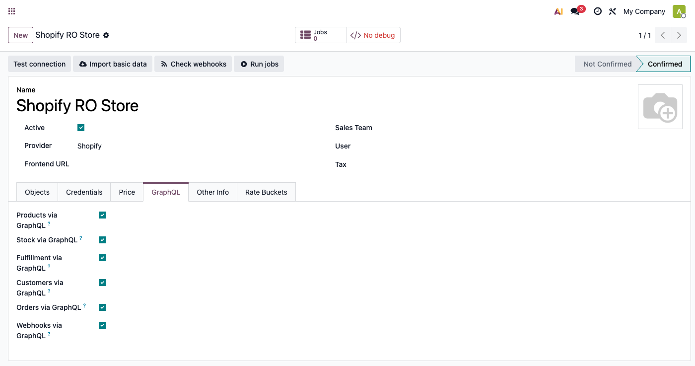
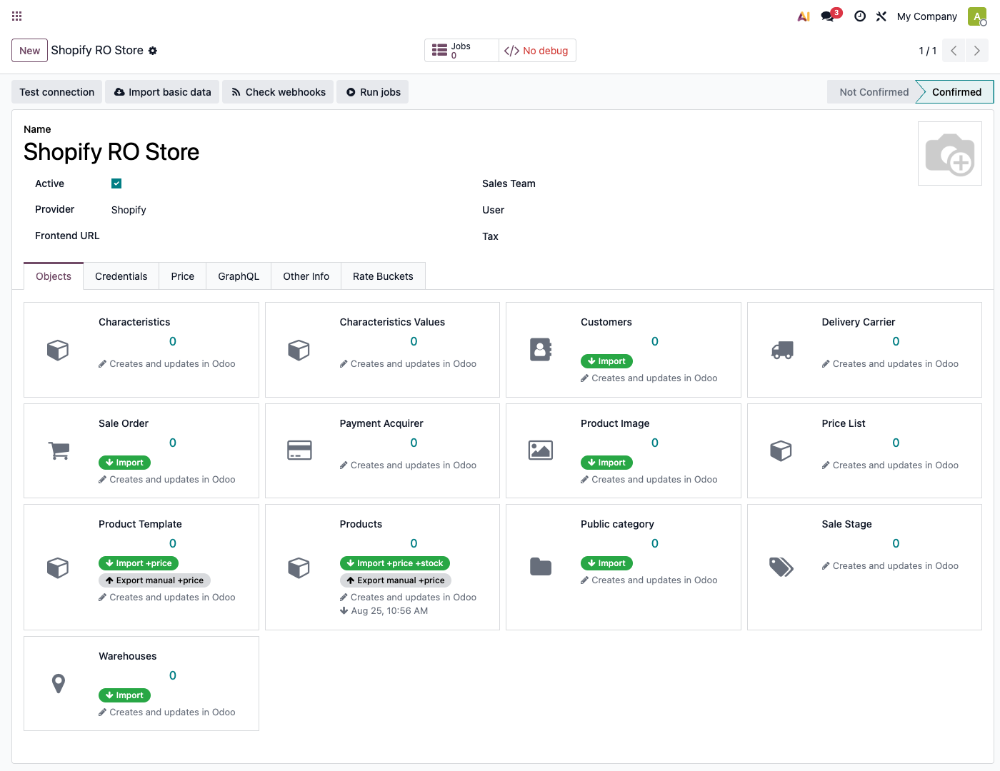
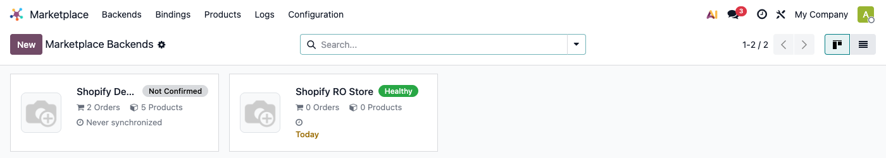
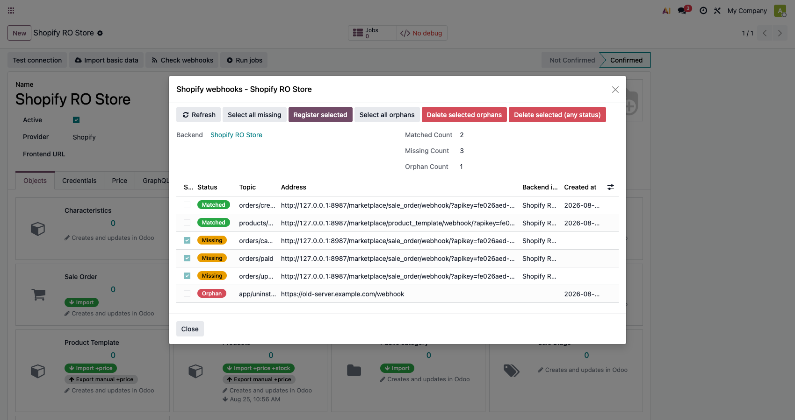

# Fișă Modul: Conector Shopify — sincronizare produse, comenzi și stoc

**Modul:** `deltatech_marketplace_shopify`
**Utilizator principal:** Consultant Odoo / administrator funcțional (configurare inițială), operator e-commerce (utilizare curentă)
**Prioritate:** 🔴 Ridicată (conector vandabil pe Odoo Apps Store, folosit de clienți cu magazine Shopify reale)

---

## 1. Scop business

Modulul conectează un magazin Shopify la Odoo prin framework-ul comun `deltatech_marketplace`:
produse, clienți, comenzi, stoc și numere de tracking (AWB) circulă automat între cele două
sisteme, dintr-un singur backend Odoo. Fără el, un magazin care rulează Shopify lângă Odoo ar
ține catalogul și comenzile manual în ambele locuri — cu riscul de preț nesincronizat, comandă
introdusă de două ori sau stoc care nu se mai potrivește.

## 2. Arhitectură tehnică și context

Modulul rulează integral pe **API-ul modern GraphQL Admin** al Shopify (nu pe REST-ul vechi,
pe care Shopify îl închide progresiv). Fiecare subsistem (produse, stoc, expediere, clienți,
comenzi, webhook-uri) are propriul comutator GraphQL/REST pe backend, implicit oprit — un magazin
trece pe GraphQL treptat, subsistem cu subsistem, și poate reveni la REST dintr-un singur
comutator dacă apare o problemă.

Autentificarea acceptă două moduri, alese din câmpul **Access Type**: **Private App clasică**
(token permanent, `Access Token` completat manual) și **Dev Dashboard App** (`Client_id and
client_secret`, OAuth `client_credentials`, token cu expirare la 24h, reînnoit automat). Câmpurile
Client Id/Client Secret și Access Token sunt ascunse până se alege `Access Type` — un backend nou
nu le arată din prima.

`Client Secret` are și un rol de securitate: fără el, semnătura HMAC a webhook-urilor primite nu
se mai verifică (doar un avertisment în log), deci recomandăm completarea lui chiar și pe
backend-urile cu token permanent.

Filtrele de import comandă (status/plată/livrare) sunt traduse separat pentru fiecare transport
(REST și GraphQL folosesc cuvinte diferite pentru aceeași stare) — o alegere netradusă ar fi
ignorată tăcut de Shopify, nu ar da eroare.

## 3. Utilizatori și roluri

- **Consultant/administrator funcțional**: configurează backend-ul, mapează depozitele și lista
  de prețuri, activează comutatoarele necesare, rulează prima sincronizare.
- **Operator e-commerce**: urmărește starea de sănătate a sincronizării, rezolvă job-urile eșuate,
  verifică periodic webhook-urile.

Roluri recomandate la testare:
- Administrator funcțional: instalează modulul, configurează backend-ul, verifică meniurile.
- Utilizator operațional: rulează prima sincronizare și cea curentă.
- Manager/consultant: validează rezultatul (comenzi importate, stoc exportat, health badge).

## 4. Date și mapări implicate

Nu există note contabile Dr/Cr generate direct de acest modul (asta ține de `sale`/`account`,
declanșate normal de comanda de vânzare creată). Datele-cheie de mapat înainte de prima
sincronizare:

- **Depozite** — fiecare Shopify Location trebuie să aibă un `stock.warehouse` Odoo deja creat
  *înainte* de import (potrivirea e după nume/cod; o Location nemapată creează un depozit gol,
  fals, în Odoo).
- **Lista de prețuri** (`pricelist_id`) — pentru exportul de preț către Shopify.
- **Taxa implicită** (`tax_id`) — aplicată produselor importate.
- **Categoria/atributele** — opționale (`Use Category`, `Options as Attributes`); dacă
  `Options as Attributes` rămâne oprit, **produsul tot se importă**, dar **variantele lui** Shopify
  sunt sărite (nu fuzionate tăcut într-o singură variantă) — avertismentul apare doar în log-ul
  serverului, nu vizibil pentru operator în interfață.

Date minime pentru demo: un magazin Shopify de test (sau Shopify Dev Store), cel puțin un produs
cu variante, un client și o comandă existentă în magazin.

## 5. Configurare inițială

1. Instalați modulul `deltatech_marketplace_shopify` (cere biblioteca Python `ShopifyAPI` — nu
   funcționează pe Odoo Online/SaaS, doar On-Premise sau Odoo.sh).
2. Creați depozitele Odoo care corespund Location-urilor din Shopify, *înainte* de a importa
   depozitele din Shopify.
3. Creați un backend nou: **Marketplace → Backends → Nou**, `Provider = Shopify`.
4. În tab-ul **Credentials**, alegeți întâi **Access Type**: `Client_id and client_secret` pentru
   o Dev Dashboard App (apar câmpurile Client Id/Client Secret) sau lăsați-l gol și completați
   direct `Access Token` pentru o Private App clasică.
5. Setați tab-ul **Price** (lista de prețuri, `Update Price Only`/`Ignore Price` după caz) și
   filtrele de comandă din tab-ul **Other Info** (status, plată, livrare).
6. Opțional, activați comutatoarele GraphQL dorite din tab-ul **GraphQL** (toate pornesc oprite).
7. Apăsați **Test connection** din antet — validează credențialele printr-un query GraphQL `shop`.
8. Apăsați **Import basic data** — înregistrează webhook-urile Shopify necesare.

## 6. Flux de utilizare

### Pasul 1 — Configurarea backend-ului (Credentials)

Deschideți **Marketplace → Backends → Nou**, alegeți `Provider = Shopify` și completați tab-ul
**Credentials**: adresa magazinului, apoi **Access Type** — alegerea asta decide ce câmpuri de
autentificare apar mai jos: `Client_id and client_secret` pentru Dev Dashboard App, sau gol +
`Access Token` completat manual pentru o Private App clasică.



### Pasul 2 — Prețul și filtrele de comandă

Tab-ul **Price** stabilește lista de prețuri de export și politica `Update Price Only`/
`Ignore Price` (utilă când Shopify decide prețul, dar Odoo rămâne proprietarul datelor de produs).
Tab-ul **Other Info** conține cele trei filtre de import comandă — status, stare de plată, stare
de livrare — configurabile per magazin.

> Atenție la combinația cu fereastra de import (`Sale Order Days`, tot în **Other Info**): o
> comandă care atinge starea cerută de filtru **după** ce a ieșit din această fereastră nu mai e
> importată niciodată. Un filtru mai restrictiv decât `Any` cere o fereastră suficient de largă.





### Pasul 3 — Comutatoarele GraphQL

Tab-ul **GraphQL** are câte un comutator pentru fiecare subsistem (produse, stoc, expediere,
clienți, comenzi, webhook-uri), toate oprite implicit. Un magazin trece pe GraphQL treptat, un
subsistem odată, și poate reveni la REST dintr-un singur comutator dacă ceva nu merge.



### Pasul 4 — Prima sincronizare (tab Objects)

Tab-ul **Objects** arată câte un card kanban pentru fiecare tip de date — 13 în total (inclusiv
Delivery Carrier, Payment Acquirer, Product Image, Price List, populate automat la import de
comenzi sau la **Import basic data**) — fiecare cu propriul meniu de acțiuni (Import, Import All,
Export etc.). Rulați cardurile relevante o singură dată, în ordinea asta, pentru prima
sincronizare: **Warehouses** → **Public category** (dacă e activată) →
**Characteristics/Characteristics Values** (dacă e activată) → **Products/Product Template** →
**Customers** → **Sale Stage** (configurare manuală, nu import) → **Sale Order**, ultimul, ca
liniile de comandă să găsească deja produsele și clienții importați.



### Pasul 5 — Ce rulează automat după prima sincronizare

Comenzile și produsele se actualizează prin webhook-urile Shopify (`orders/create`,
`orders/updated`, `orders/paid`, `orders/cancelled`, `products/update`), fără cron de așteptat.
Exportul de stoc și de preț rulează pe acțiunile programate ale framework-ului comun
(dezactivate implicit — vizibile în **Marketplace → Configuration → Crons**, se activează de
acolo), iar reînnoirea tokenului OAuth (**„Shopify: Refresh Access Tokens”**, la fiecare 23h,
pentru backend-urile Dev Dashboard App) e o acțiune programată obișnuită, vizibilă doar în
**Settings → Technical → Scheduled Actions** (necesită modul dezvoltator) — nu apare în meniul
Marketplace → Configuration → Crons, care filtrează doar acțiunile numite „Marketplace: …”.

### Pasul 6 — Citirea stării de sănătate

Cardul kanban al backend-ului din **Marketplace → Backends** arată un indicator de sănătate
(verde/portocaliu/roșu/gri), ora ultimei sincronizări, și — doar când există probleme — linkuri
către log-urile din ultimele 24h și către job-urile eșuate.

Indicatorul are patru stări: **gri** („Not Confirmed” — backend-ul încă nu e confirmat),
**portocaliu** („Warnings”), **roșu** („Errors”) și **verde** („Healthy”). Devine **verde** doar
când toate acestea sunt adevărate simultan: backend-ul e confirmat, tokenul nu a expirat, zero
erori în ultimele 24h, zero job-uri eșuate, și **cel puțin un tip de date are deja o sincronizare
înregistrată**. Un backend confirmat dar neimportat încă rămâne **portocaliu** („Warnings”, cu
detaliul „Never synchronized” în tooltip), nu verde și nu gri.



### Pasul 7 — Verificarea webhook-urilor

Butonul de antet **Check webhooks** deschide un wizard care compară webhook-urile efectiv
înregistrate în Shopify cu ce așteaptă Odoo: **Matched** (înregistrat corect), **Missing**
(Odoo așteaptă un webhook pe care Shopify nu-l are) și **Orphan** (opusul — Shopify are un
webhook pe care Odoo nu-l mai așteaptă). Butoanele din antet: **Refresh** reia comparația,
**Select all missing**/**Select all orphans** bifează grupul respectiv, **Register selected**
înregistrează în Shopify liniile `missing` bifate, iar **Delete selected orphans**/**Delete
selected (any status)** șterg din Shopify liniile bifate — inclusiv una `matched`, dacă e bifată
cu ultimul buton. Atenție: dacă ștergeți o linie `matched` fără să opriți întâi **Use Webhook** pe
tipul de date corespunzător, **Import basic data** o reînregistrează la următoarea rulare.



## 7. Legături cu alte module / declarații

| Modul / proces | Rol în flux | Tip legătură |
|---|---|---|
| `deltatech_marketplace` | framework comun: backend, health badge, job-uri, item-uri sincronizate | dependență (manifest) |
| `deltatech_marketplace_sale` | comanda de vânzare Odoo generată din comanda Shopify | dependență (manifest) |
| `deltatech_marketplace_payment` | mapare metodă de plată Shopify → payment acquirer Odoo | dependență (manifest) |
| `deltatech_marketplace_delivery` | mapare transportator, linie de livrare pe comandă | dependență (manifest) |
| `deltatech_marketplace_website` | integrare website (opțională) | dependență (manifest) |
| `deltatech_marketplace_sale_stage` | cardul **Sale Stage** — mapare tag Shopify ↔ fază de vânzare | dependență (manifest) |
| `sale` / `stock` / `account` | comanda de vânzare, mișcarea de stoc, factura rezultată — flux Odoo standard, neatins direct de acest modul | flux standard Odoo |

Ce este automat: sincronizarea comenzilor/produselor prin webhook, exportul de stoc/preț pe
cron-urile comune, reînnoirea tokenului OAuth.
Ce rămâne manual: maparea inițială a depozitelor și listei de prețuri, configurarea fazelor de
vânzare (tag-uri Shopify), verificarea periodică a webhook-urilor.

## 8. Verificări pentru consultant

- [ ] Modulul se instalează fără erori (necesită biblioteca Python `ShopifyAPI`).
- [ ] **Test connection** confirmă credențialele înainte de orice import.
- [ ] Depozitele Odoo există *înainte* de a importa Location-urile Shopify.
- [ ] Prima sincronizare respectă ordinea din Pasul 4 (depozite → categorii/atribute → produse →
      clienți → comenzi, ultimul).
- [ ] **Import basic data** a înregistrat webhook-urile — verificați cu **Check webhooks** că nu
      apar `Missing`.
- [ ] Dacă filtrele de comandă (status/plată/livrare) sunt mai restrictive decât `Any`,
      `Sale Order Days` acoperă o fereastră suficient de largă pentru starea așteptată.
- [ ] Indicatorul de sănătate de pe cardul kanban e verde (`Confirmed`, zero erori/job-uri
      eșuate, cel puțin o sincronizare înregistrată) după prima sincronizare reușită.
- [ ] Un produs cu mai multe variante Shopify, fără **Options as Attributes** activat, tot se
      importă — dar variantele lui sunt sărite (verificați log-ul serverului, nu interfața).
- [ ] `Client Secret` e completat chiar și pe un backend cu token permanent, ca semnătura HMAC a
      webhook-urilor primite să se verifice.
- [ ] Exportul de stoc/preț (dacă activat manual din **Marketplace → Configuration → Crons**)
      reflectă corect mapările de depozit/listă de prețuri.

## 9. Mesaje de eroare frecvente

| Mesaj / simptom | Cauză probabilă | Remediere |
|---|---|---|
| Comandă importată fără depozit corect (rutată pe depozitul implicit) | Location-ul Shopify al comenzii nu are un `marketplace.warehouse` mapat | Importați/verificați maparea de depozite înainte de a reimporta comanda |
| Produsul se importă, dar variantele lui nu (avertisment doar în log-ul serverului) | **Options as Attributes** e oprit, iar produsul are mai multe variante reale | Activați **Options as Attributes** pe backend și reimportați produsul |
| O comandă nouă nu ajunge deloc în Odoo | Webhook `orders/create` lipsă sau expirat (Shopify a revocat/nu a găsit endpoint-ul) | **Check webhooks**, înregistrați ce apare ca `Missing`; între timp, rulați **Import** manual pe cardul Sale Order |
| Prețul exportat către Shopify nu se schimbă | Job în eroare (rate limit `429`/GraphQL `THROTTLED`) sau varianta nu are diferență de preț față de ultima exportare | Verificați job-urile eșuate din cardul kanban al backend-ului; exportul pornește doar pentru variante cu preț schimbat |
| Token expirat brusc pe un backend Dev Dashboard App | Cron-ul „Shopify: Refresh Access Tokens” nu a rulat (dezactivat sau Scheduled Actions oprit) | Verificați că acțiunea programată e activă; fiecare apel API reîmprospătează oricum tokenul dacă expiră în < 30 min |
| Comandă anulată în Odoo, dar rămâne activă în Shopify | Anularea nu a ajuns la Shopify (job eșuat) | Verificați job-urile eșuate ale backend-ului; reîncercați anularea |

## 10. Capturi de ecran

> Interfața acestui modul e **exclusiv în engleză** (nu are fișier de traducere RO) — capturile de
> mai jos arată etichetele reale, englezești, ale ecranelor.

Capturile (`readme/screenshots/`) ilustrează fluxul din secțiunea 6, generate cu
`ScreenshotCase`/Playwright (`tests/test_screenshots.py`, import defensiv):

1. `01_credentials.png` — backend Shopify, tab Credentials completat.
2. `02_price.png` — tab Price: listă de prețuri, Update Price Only, Ignore Price.
3. `03_order_filters.png` — filtrele de import comandă (status, plată, livrare).
4. `04_graphql.png` — cele șase comutatoare GraphQL, unul per subsistem.
5. `05_objects.png` — tab Objects: cardurile kanban cu acțiunile de import.
6. `06_health_badge.png` — indicatorul de sănătate pe cardul kanban al backend-ului.
7. `07_webhook_checker.png` — wizardul de verificare a webhook-urilor (Matched/Missing/Orphan).

Regenerare:

```bash
./odoo/odoo-bin -c odoo.conf -d <db> -i deltatech_marketplace_shopify,l10n_ro_doc_screenshots \
    --test-tags=fise_screenshots --stop-after-init
```

## 11. Observații pentru manual

În manualul final, păstrați accentul pe **ordinea** primei sincronizări (depozite înainte de
comenzi) și pe distincția GraphQL/REST (comutatoare per subsistem, nu o schimbare globală) — sunt
cele două puncte unde un consultant nou greșește cel mai ușor. Evitați detaliile de implementare
(nume de câmpuri interne, endpoint-uri) în corpul explicației către utilizatorul final.
