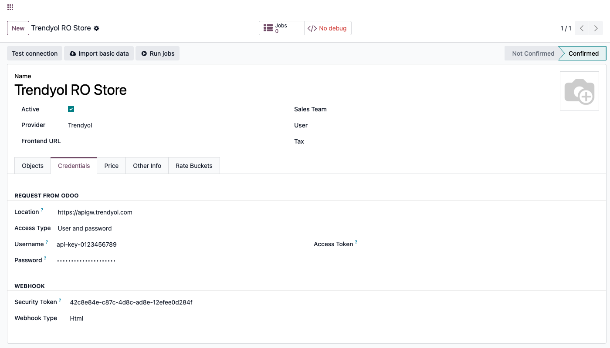
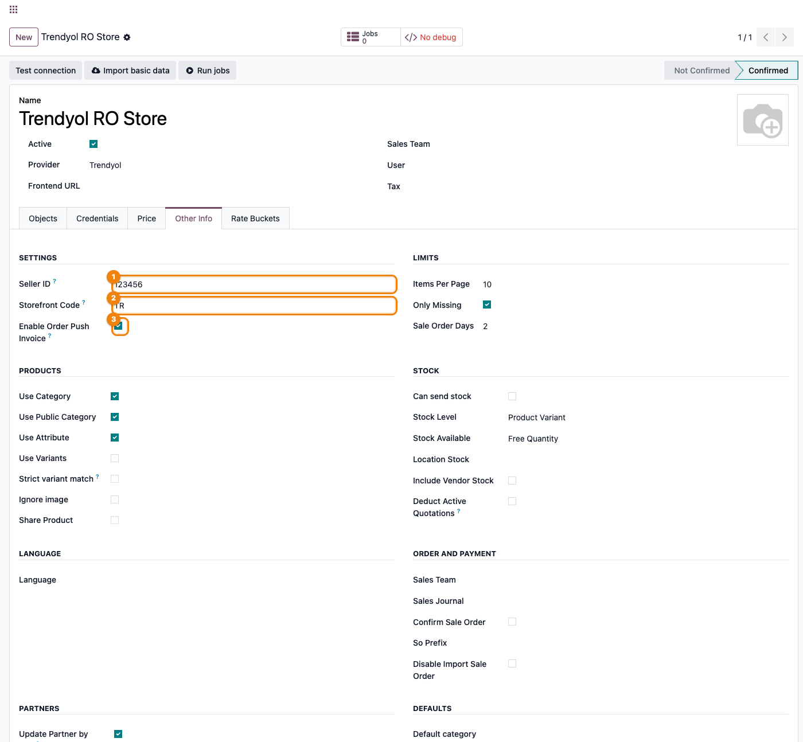
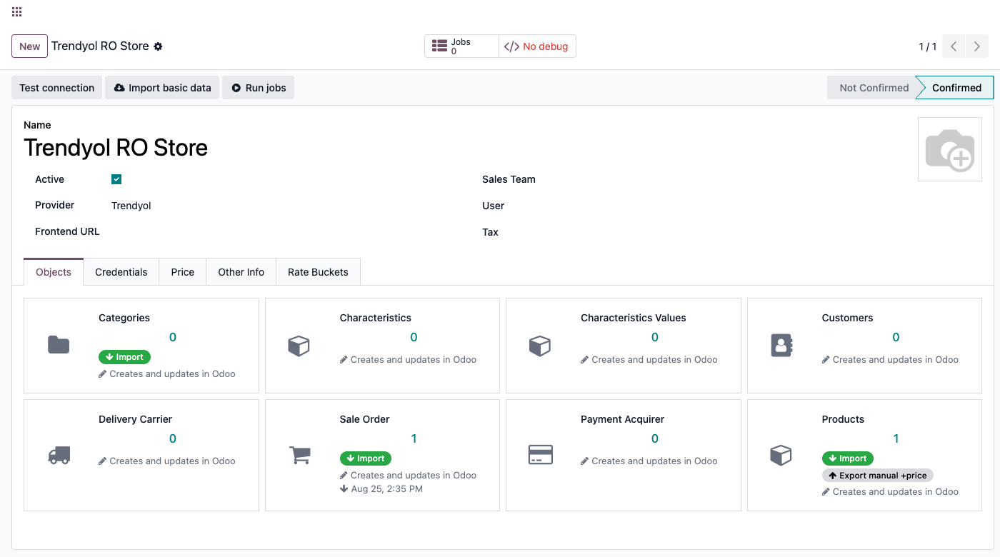
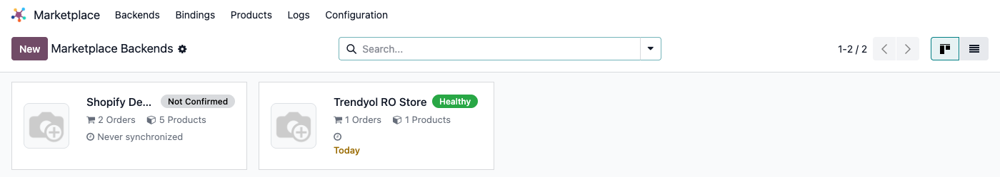

# Fișă Modul: Conector Trendyol — produse, comenzi, stoc și facturi

**Modul:** `deltatech_marketplace_trendyol`
**Utilizator principal:** Consultant Odoo / administrator funcțional (configurare inițială), operator e-commerce (utilizare curentă)
**Prioritate:** 🔴 Ridicată (conector vandabil pe Odoo Apps Store, folosit de clienți cu magazine Trendyol reale)

---

## 1. Scop business

Un cont de seller Trendyol lângă Odoo, fără conector, înseamnă catalog, stoc, preț și comenzi ținute
manual în două locuri: fiecare actualizare de stoc sau preț trebuie repetată pe panoul de seller,
fiecare comandă nouă trebuie reintrodusă. Pe un marketplace de dimensiunea Trendyol, o actualizare de
preț ratată sau un import întârziat costă vânzări, nu doar timp. Modulul închide acest gol: produsele,
comenzile, stocul, prețul și facturile circulă automat între Odoo și
Trendyol prin API-ul propriu V2 al Trendyol și endpoint-urile lui asincrone de tip batch — mecanismul
pe care Trendyol îl cere de la un seller cu volum real, nu apeluri produs cu produs — iar pentru că se
leagă de același framework comun (`deltatech_marketplace`) folosit și de conectorii Shopify, eMAG sau
alții din suită, adăugarea Trendyol lângă un canal deja folosit nu înseamnă învățarea unui al doilea
sistem.

## 2. Arhitectură tehnică și context

Modulul rulează pe **API-ul V2 al Trendyol** (`https://apigw.trendyol.com`, completat automat la
alegerea `Provider = Trendyol`), fără bibliotecă Python externă — comunicarea folosește `requests`,
deja parte din Odoo. Autentificarea este **Basic Auth**: **API Key**/**API Secret**, obținute din
panoul de seller Trendyol (Account Details → Integration Details), introduse în câmpurile generice
**Username**/**Password** ale framework-ului, trimise codificate Base64 în antetul `Authorization` la
fiecare apel. Trendyol respinge orice apel fără un antet `User-Agent` în formatul
`"<Seller ID> - SelfIntegration"` — conectorul îl construiește automat din **Seller ID**, nu trebuie
completat separat. Header-ul `storeFrontCode` (de exemplu `TR`, `RO`, `DE`) este trimis dacă
**Storefront Code** e completat pe backend.

Toate apelurile HTTP au un timeout de 30 de secunde. Erorile tranzitorii — HTTP 429 (prea multe
cereri) și HTTP 502/503/504 — fac ca job-ul de fundal să fie reîncercat automat, nu marcat definitiv
eșuat; un răspuns 200/201/204 cu corp gol (frecvent la actualizări de tracking/status) este tratat ca
un răspuns valid, nu ca o eroare de parsare.

Prețul și stocul **nu** se trimit sincron, produs cu produs: ambele merg prin endpoint-ul asincron
`price-and-inventory`, care întoarce un `batchRequestId`; conectorul programează automat, la aproximativ
60 de secunde, o verificare a rezultatului batch-ului — dacă Trendyol încă îl procesează, verificarea
se reîncearcă ea însăși ca job, până la finalizare. Crearea/actualizarea de produs (`Product V2`)
funcționează la fel, cu propriul `batchRequestId` verificat automat. Un articol respins de Trendyol în
oricare din aceste batch-uri este înregistrat cu motivul exact dat de Trendyol (`failureReasons`), nu
doar semnalat generic ca eșuat.

## 3. Utilizatori și roluri

- **Consultant/administrator funcțional**: configurează backend-ul (Seller ID, API Key/Secret,
  Storefront Code), importă categoriile și atributele Trendyol înainte de orice produs, pornește prima
  sincronizare.
- **Operator e-commerce**: urmărește starea de sănătate a backend-ului, rezolvă job-urile eșuate,
  exportă preț/stoc pe cerere sau lasă cron-urile programate să o facă, urmărește comenzile importate.

Roluri recomandate la testare:
- Administrator funcțional: instalează modulul, configurează backend-ul, verifică meniurile.
- Utilizator operațional: rulează prima sincronizare (categorii → produse → comenzi) și exportă
  preț/stoc.
- Manager/consultant: validează rezultatul (comenzi importate, produse exportate, indicatorul de
  sănătate).

## 4. Date și mapări implicate

Nu există note contabile Dr/Cr generate direct de acest modul (asta ține de `sale`/`account`,
declanșate normal de comanda de vânzare creată din comanda Trendyol importată). Datele-cheie de
pregătit înainte de prima sincronizare:

- **Seller ID** (`trendyol_seller_id`, tab **Other Info → Settings**) — identificatorul de furnizor
  din panoul de seller Trendyol; obligatoriu, folosit atât în calea fiecărui apel API cât și în
  antetul `User-Agent`. Fără el, orice apel eșuează cu o eroare explicită de configurare, nu tăcut.
- **API Key / API Secret** (câmpurile generice **Username**/**Password**, tab **Credentials**,
  `Access Type = User and password`) — perechea de autentificare Basic Auth.
- **Storefront Code** (tab **Other Info → Settings**, implicit `TR`) — vitrina pe care sunt listate
  produsele; trimis ca antet doar dacă e completat.
- **Categoria Odoo mapată la o categorie Trendyol** (`marketplace.product.category`, cu `odoo_id` pe
  categoria de produs Odoo) — obligatorie pentru fiecare produs exportat; fără ea, exportul unui
  produs (`trendyol_write`) eșuează cu eroare explicită de categorie lipsă.
- **Atributele/valorile de atribut Odoo mapate la echivalentul Trendyol**
  (`marketplace.product.attribute` / `marketplace.product.attribute.value`) — un atribut sau o valoare
  nemapată nu blochează exportul produsului, dar e omisă din cerere, cu un mesaj scris doar în jurnalul
  serverului (log tehnic), nu pe backend-ul din Odoo și nu vizibil direct operatorului pe ecran.
- **Codul de bare (`barcode`) pe fiecare produs** — Trendyol identifică o ofertă prin barcode, nu prin
  SKU; un produs fără barcode nu poate fi creat pe Trendyol (`trendyol_create` ridică eroare explicită).
- **Lista de prețuri a backend-ului** (`pricelist_id`, tab **Price**) — sursa prețului de vânzare
  (`salePrice`) trimis la export. Prețul de listă (preț barat, `listPrice`) urmează două căi diferite,
  în funcție de acțiune: la crearea/actualizarea produsului (Product V2), e prețul de listă Odoo al
  produsului, plafonat să nu fie mai mic decât prețul de vânzare; la exportul separat de preț (Export
  Price), e câmpul propriu **Trendyol List Price** (`trendyol_list_price`) dacă e completat, altfel
  prețul de vânzare marketplace (`sale_price`) — nu prețul de listă Odoo.
- **Taxa de vânzare (`taxes_id`) pe fiecare produs** — Trendyol nu expune un TVA propriu prin API;
  cota trimisă (`vatRate`) este citită direct din prima taxă a produsului Odoo.
- **Moneda backend-ului** (`currency_id`, tab **Price**) — trimisă la fiecare creare/actualizare de
  produs (`currencyType`). Necompletată, exportul nu eșuează — pleacă **tăcut** pe `TRY` (valoarea de
  rezervă din cod), indiferent de moneda reală a vitrinei configurate cu **Storefront Code**.
- **Marca produsului (`brandId`)** — Trendyol o cere pe multe categorii, dar acest conector **nu are
  niciun câmp de mapare a mărcii în interfață**; codul citește o valoare din context
  (`trendyol_brand_id`), pe care nimic din UI nu o setează vreodată — utilizabilă doar dintr-o
  automatizare externă (de exemplu un `with_context` propriu), nu din formularul standard.
- **Un utilizator Odoo pe câmpul „User" al backend-ului** — folosit de webhook-ul de comenzi, care
  rulează importul cu drepturile acestui utilizator (`with_user`); necompletat, webhook-ul rulează cu
  drepturi implicite, ceea ce poate produce erori de acces tăcute la o companie cu reguli restrictive.
- **„Sale Order Days"** (câmp comun al framework-ului, tab Other Info → Limits) — la Trendyol acest
  câmp **nu are niciun efect**: parametrul de filtrare după zile a fost eliminat din import (vezi
  HISTORY.md, 19.0.1.1.6); cron-ul de comenzi reinterogă mereu toate paginile disponibile pentru
  fiecare status urmărit, la fiecare rulare, indiferent de valoarea acestui câmp.

Date minime pentru demo: un cont Trendyol de test (staging sau producție) cu Seller ID, API Key/Secret
valide, un utilizator desemnat pe backend, cel puțin o categorie cu atributele ei importate, un produs
cu barcode și categorie mapată, o comandă existentă în cont.

## 5. Configurare inițială

1. La Trendyol, în panoul de seller (Account Details → Integration Details), notați **Seller ID** și
   generați o pereche **API Key**/**API Secret** pentru integrare.
2. Instalați modulul `deltatech_marketplace_trendyol` (nu necesită nicio bibliotecă Python externă în
   afara celor deja incluse în Odoo).
3. Creați un backend nou: **Marketplace → Backends → Nou**, `Provider = Trendyol` — locația API
   (`https://apigw.trendyol.com`) se completează automat.
4. În tab-ul **Credentials**, verificați **Access Type = User and password**, apoi completați
   **Username** cu API Key și **Password** cu API Secret.
5. Pe tab-ul **Other Info**, grupul **Settings**, completați **Seller ID**, **Storefront Code**
   (implicit `TR`) și, dacă doriți trimiterea automată a facturii, lăsați bifat **Enable Order Push
   Invoice** (dezactivați-l în mediul de testare). Pe același tab, secțiunea generică, desemnați un
   **User** — folosit de webhook-ul de comenzi pentru a rula importul cu drepturile lui.
6. Apăsați **Test connection** din antet — apelează efectiv lista de produse (`/products`, o pagină de
   un articol), nu doar validează completarea câmpurilor.
7. Din tab-ul **Objects**, rulați importul **Categories** înaintea oricărui export de produse. Acest
   import aduce doar arborele de categorii — atributele obligatorii ale unei categorii de nivel frunză
   se importă separat, abia la prima referire (de exemplu la importul unui produs care o folosește),
   nu automat odată cu arborele.
8. Setați tab-ul **Price** (lista de prețuri **și moneda backend-ului** — necompletată, exportul de
   produs pleacă tăcut pe `TRY`, indiferent de vitrina reală) și, dacă doriți exportul programat de
   stoc, activați cron-ul dezactivat implicit **Trendyol: Export Stock** din **Setări → Tehnic →
   Acțiuni programate**.

## 6. Flux de utilizare

### Pasul 1 — Configurarea backend-ului (Credentials)

Deschideți **Marketplace → Backends → Nou**, alegeți `Provider = Trendyol` (locația API se completează
automat) și completați tab-ul **Credentials**: **Access Type = User and password**, apoi
**Username**/**Password** cu perechea **API Key**/**API Secret** de la Trendyol.



### Pasul 2 — Câmpurile specifice Trendyol (tab Other Info)

Pe tab-ul **Other Info**, grupul **Settings**, salvarea cu `Provider = Trendyol` afișează câmpurile
proprii acestui conector: **Seller ID** (obligatoriu — identificatorul de furnizor din panoul
Trendyol, folosit în calea fiecărui apel și în antetul `User-Agent`), **Storefront Code** (implicit
`TR`) și **Enable Order Push Invoice** (trimite automat linkul facturii către Trendyol la validarea
facturii — dezactivați-l în mediul de testare).



### Pasul 3 — Testarea conexiunii

Apăsați **Test connection** din antetul formularului. Acest apel obține efectiv un răspuns de la
lista de produse Trendyol (`/products`, pagina 0, dimensiune 1) cu credențialele introduse; la succes,
starea (`State`) backend-ului trece pe **Confirmed** — condiție necesară ca indicatorul de sănătate să
poată deveni verde mai târziu. Un Seller ID greșit sau o pereche API Key/Secret invalidă ridică eroarea
Trendyol/HTTP direct pe ecran, înainte de a merge mai departe.

### Pasul 4 — Categorii ȘI atribute ÎNAINTE de produse (obligatoriu în această ordine)

Pe tab-ul **Objects**, rulați acțiunea **Import** de pe cardul **Categories**. Trendyol nu expune o
căutare paginată de categorii: acest import aduce **întregul arbore** de categorii într-un singur apel
(`/integration/product/product-categories`), recursiv, și îl salvează în loturi de 500 de
înregistrări. Atributele obligatorii/opționale ale unei categorii de nivel frunză și valorile lor
permise **nu** vin odată cu arborele — se importă separat, pe cerere, când categoria respectivă e
întâlnită prima dată (de exemplu la importul unui produs care o referă), sau printr-o acțiune de
server/dezvoltator (`trendyol_import_attributes()`) — nu există un buton dedicat pentru asta pe cardul
**Categories**/**Characteristics**.



Exportul unui produs (§6, Pasul 6) **refuză** să trimită oferta dacă produsul aparține unei categorii
Odoo fără corespondent Trendyol deja mapat — eroarea numește explicit categoria lipsă, nu tăcut.

### Pasul 5 — Import produse (potrivire după barcode)

Din meniul cardului **Products** (tab Objects), alegeți **Import**. Trendyol identifică fiecare
ofertă prin **barcode**, nu prin SKU intern — conectorul caută un produs Odoo cu același `barcode`
și, dacă îl găsește, leagă imediat înregistrarea marketplace de el. Odată cu fiecare produs vin: titlul,
codul de stoc (`stockCode`), prețul de vânzare și cel de listă, cantitatea, starea de aprobare
(`approved`) și de activare pentru vânzare (`onSale`), imaginile și valorile de atribut. Dacă **Use
Category** e activ pe backend, categoria Trendyol a produsului (`pimCategoryId`) este importată automat
odată cu el.

### Pasul 6 — Crearea sau actualizarea produselor din Odoo (Product V2 API)

Pentru un produs care nu există încă pe Trendyol, folosiți acțiunea **Export manual +price** de pe
cardul **Products** (tab Objects) — trimite titlul, `productMainId`, categoria mapată (obligatorie),
codul de stoc, cantitatea, greutatea dimensională, descrierea, prețul de vânzare/listă, cota de TVA
(citită din taxa produsului) și imaginea principală a produsului Odoo (servită prin URL-ul public al
instanței, `web.base.url`). Atributele produsului sunt trimise doar dacă atributul **și** valoarea sa
sunt deja mapate la echivalentul Trendyol — o pereche nemapată e omisă din cerere, cu un mesaj scris
doar în jurnalul serverului (log tehnic), nu pe backend-ul din Odoo. Un produs fără **barcode** nu poate
fi creat pe Trendyol. Marca produsului (`brandId`), cerută de Trendyol pe multe categorii, **nu are
niciun câmp de mapare în interfața acestui conector** — nu se trimite niciodată prin fluxul standard de
export; poate fi setată doar dintr-o automatizare externă proprie, nu din formularul standard.

Odată ce un produs este legat (bindat), modificările ulterioare pleacă drept actualizare (`PUT`), nu
creare — fie automat, prin exportul la scriere (dacă tipul de articol e setat pe „Active on write"),
fie manual, din butonul de export al produsului. Fiecare creare/actualizare pornește un batch V2
propriu, verificat automat la finalizare, la fel ca la preț/stoc (§2).

### Pasul 7 — Exportul de preț și stoc (batch asincron)

Prețul și stocul pleacă spre Trendyol prin endpoint-ul comun **`price-and-inventory`**, folosind
butoanele **Export stock**/**Export price** de pe produsul marketplace, sau automat:

- Cron-ul **Trendyol: Export Stock** (implicit oră fixă, **dezactivat** implicit) exportă stocul
  tuturor backend-urilor Trendyol.
- Produsele mai pot fi setate să exporte la scriere, la fel ca la creare/actualizare.

Fiecare trimitere întoarce un `batchRequestId`; conectorul programează automat, la ~60 de secunde, un
job care verifică starea batch-ului. Dacă Trendyol încă îl procesează, verificarea se reîncearcă
singură; odată finalizat, orice articol respins e înregistrat cu motivul exact dat de Trendyol
(`failureReasons`), iar restul primesc o înregistrare de succes.

### Pasul 8 — Import comenzi (pachete de expediție)

Din meniul cardului **Sale Order** (tab Objects) sau prin cron-ul programat **Trendyol: Import Orders**
(la 30 de minute, **dezactivat** implicit), conectorul interoghează pachetele de expediție Trendyol pe
rând, câte un status odată: **Created**, **Picking**, **Invoiced** — aceste trei stări sunt cele fixate
în cod, nu configurabile din interfață, și `Sale Order Days` nu le mai restrânge (vezi §4) — fiecare
rulare reia toate paginile disponibile pentru fiecare status. Pachetele aflate în **Cancelled** sau
**UnSupplied** nu sunt aduse de acest import periodic — filtrul de status al cron-ului/butonului le
exclude. Ele sunt procesate (doar pentru a anula comanda Odoo corespunzătoare, dacă nu are deja o
livrare finalizată) exclusiv atunci când pachetul ajunge prin **webhook** sau printr-un **Reimport**
manual explicit pe acea comandă — o comandă deja importată care trece ulterior în Cancelled/UnSupplied
pe Trendyol **nu** se anulează singură la următoarea rulare a cron-ului.

Fiecare pachet importat aduce liniile de comandă (potrivite după barcode, produsele lipsă se importă
automat „din mers", cu prețul deja **cu TVA inclus**, așa cum îl trimite Trendyol), clientul și adresele
de livrare/facturare, și este marcat plătit printr-o înregistrare de plată „Trendyol", pentru că
Trendyol încasează plata de la cumpărător și decontează separat către seller. Comanda importată
urmează apoi politica de confirmare a comenzii setată pe backend (**Confirm Sale Order**, câmp comun al
framework-ului): dacă e activă, comanda e confirmată automat; dacă nu, rămâne ca o ofertă trimisă, de
confirmat manual.

Legat de numele curierului Trendyol (`cargoProviderName`): conectorul creează o legătură
`marketplace.delivery.carrier`, dar **nu** o mapează la un transportator Odoo real — datele trimise nu
includ un nume pe care căutarea automată să-l poată folosi, așa că orice comandă importată cade pe
transportatorul generic **„Free delivery"**. Asocierea la transportatorul real (Cargus, Sameday etc.)
trebuie făcută manual pe comandă, dacă se dorește emitere de AWB.

Trendyol poate trimite și comenzi noi în timp real printr-un **webhook** (dispecerizat automat de
controllerul comun `deltatech_marketplace`, către `trendyol_webhook`); dacă importul sincron declanșat
de webhook eșuează dintr-un motiv tehnic, cade automat pe un job de fundal, ca să nu se piardă comanda.

**Nu există push înapoi spre Trendyol al modificărilor generice ale comenzii** — dacă tipul de articol
`orders` e setat pe „Active on write", exportul la scriere nu trimite nimic: metoda corespunzătoare nu
este implementată, doar scrie un avertisment în jurnalul serverului. Singurele actualizări reale
trimise către Trendyol pentru o comandă sunt cele descrise explicit mai jos (numărul de tracking) și în
§6 Pasul 10 (linkul facturii).

### Pasul 9 — Numărul de tracking către Trendyol (condiționat, nu întotdeauna automat)

Trimiterea automată a numărului de tracking (prin `trendyol_after_send_to_shipper()`, același hook
folosit și de conectorii Shopify/Magento/PrestaShop) **nu** se declanșează pentru orice expediere
validată — depinde de mecanismul standard Odoo de expediere prin curier:

- expedierea trebuie să aibă un **transportator de livrare real, cu integrare „rate and ship"**
  (de exemplu Cargus, Sameday) — nu transportatorul generic „Free delivery" pe care cade implicit o
  comandă Trendyol importată (vezi mai sus); acest transportator trebuie atribuit **manual** pe
  comandă, importul Trendyol nu îl setează niciodată;
- expedierea nu trebuie să aibă deja un număr de tracking completat — **dacă tracking-ul e completat
  manual înainte de validare, apelul automat spre curier (și, cu el, hook-ul Trendyol) NU se mai
  declanșează**; un tracking pre-completat înseamnă hook neexecutat, nu invers;
- tipul de operațiune trebuie să aibă bifa de etichetă activă și să nu fie o operațiune de intrare.

Cu alte cuvinte: pe o comandă Trendyol, tracking-ul pleacă automat doar dacă i s-a atribuit manual o
metodă de livrare reală care generează AWB (de exemplu prin modulul de curierat instalat); fără ea, nu
pleacă nimic automat, iar cea mai sigură cale rămâne fie integrarea cu un curier real, fie trimiterea
manuală a numărului de tracking printr-o mică automatizare peste conector.

Actualizarea stării pachetului (`trendyol_set_package_status()`, de exemplu spre **Picking**/
**Invoiced**) rămâne, în versiunea actuală, un apel care necesită o acțiune de server/dezvoltator — nu
e conectată automat la nicio tranziție din Odoo — o stare diferită de cea pe care Trendyol o deduce
singură din numărul de tracking trebuie declanșată dintr-o automatizare proprie peste conector.

### Pasul 10 — Trimiterea facturii către Trendyol

Când **Enable Order Push Invoice** (`enable_order_push_invoice`) e activ pe backend, validarea unei
facturi Odoo legate de o comandă Trendyol trimite automat către Trendyol linkul portalului Odoo către
PDF-ul facturii (`seller-invoice-links`) — nu conținutul PDF-ului propriu-zis. Aceasta cere ca
**URL-ul de bază al instanței Odoo** (`web.base.url`) să fie public și accesibil din exterior; pe o
instanță fără acces public, apelul API „reușește" (nu ridică eroare), dar Trendyol nu poate obține
efectiv factura de la acel link.

### Pasul 11 — Citirea stării de sănătate

Cardul kanban al backend-ului din **Marketplace → Backends** arată un indicator de sănătate
(„Not Confirmed"/„Healthy"/altă stare de eroare) — logica e complet generică din framework, Trendyol nu
o suprascrie. Devine **„Healthy"** doar când backend-ul e confirmat (`Test connection` reușit), fără
erori în ultimele 24h, fără job-uri eșuate, și cel puțin un tip de date are deja o sincronizare
înregistrată. Un backend confirmat dar neimportat încă rămâne cu starea „Never synchronized", nu
„Healthy".



> Kanban-ul **Marketplace → Backends** e comun tuturor conectorilor instalați — pe o instanță cu mai
> multe conectoare de test/demo e normal să apară și cardurile lor alături de cel Trendyol. Urmăriți
> cardul cu numele backend-ului configurat de voi.

### Note de monografie și raportare

Nu se aplică — acest modul nu generează note contabile proprii. Comanda de vânzare rezultată din
importul Trendyol urmează contabilizarea standard Odoo (`sale`/`account`), neatinsă de acest conector.

## 7. Legături cu alte module / declarații

| Modul / proces | Rol în flux | Tip legătură |
|---|---|---|
| `deltatech_marketplace` | framework comun: backend, indicator de sănătate, job-uri, rate-limiting, webhook | dependență (manifest) |
| `deltatech_marketplace_sale` | comanda de vânzare Odoo generată din comanda Trendyol, politica de confirmare | dependență (manifest) |
| `deltatech_marketplace_delivery` | infrastructura de mapare a curierilor (legătura `marketplace.delivery.carrier` creată la import, fără mapare automată la un transportator Odoo — vezi §6 Pasul 8) | dependență (manifest) |
| `deltatech_marketplace_payment` | metoda de plată „Trendyol", creată automat la prima comandă importată | dependență (manifest) |
| `sale` / `delivery` | comanda de vânzare și expedierea — trimiterea condiționată a numărului de tracking urmează mecanismul standard Odoo de curier (vezi §6 Pasul 9) | dependență (manifest) |
| `l10n_ro_edi` | e-Factura (SPV) — **neatinsă** de acest conector; push-ul de factură Trendyol e doar un link către PDF | flux independent |

Ce este automat: verificarea automată a rezultatului fiecărui batch (preț/stoc, creare/actualizare
produs); trimiterea numărului de tracking la expediere, dar **doar** dacă expedierea are deja o metodă
de livrare reală cu integrare „rate and ship" atribuită manual și încă fără tracking completat (§6
Pasul 9 — condiționat, nu garantat pentru orice expediere); trimiterea automată a linkului facturii
(dacă activă); reîncercarea automată a job-urilor eșuate temporar (HTTP 429/5xx); fallback pe job de
fundal dacă importul sincron declanșat de webhook eșuează; anularea comenzii Odoo pentru un pachet
Cancelled/UnSupplied primit prin webhook.

Ce rămâne manual: importul de categorii/atribute și maparea lor la echivalentul Odoo; maparea
atributelor/valorilor de atribut folosite pe produs; atribuirea unui transportator Odoo real pe o
comandă Trendyol importată (cade implicit pe „Free delivery"); activarea cron-urilor de import
comenzi/export stoc (dezactivate implicit); actualizarea stării pachetului
(`trendyol_set_package_status`) către alte stări decât cea dedusă automat din tracking; anularea unei
comenzi deja importate care trece ulterior în Cancelled/UnSupplied pe Trendyol, dacă nu vine prin
webhook (cere Reimport manual); repetarea importului de produse noi (fără cron dedicat de import
produse în acest modul — doar comenzi și stoc au cron propriu). Nu există, de asemenea, niciun
mecanism (automat sau manual, prin acest conector) de a trimite spre Trendyol modificări generice ale
comenzii — `trendyol_write` pe comandă e un stub neimplementat.

## 8. Verificări pentru consultant

- [ ] Modulul se instalează fără erori (nu necesită bibliotecă Python externă).
- [ ] **Seller ID** este completat pe tab-ul **Other Info → Settings** — fără el, orice apel API
      eșuează cu o eroare explicită.
- [ ] **Test connection** confirmă credențialele (`State = Confirmed`) — verifică apelul real la lista
      de produse Trendyol, nu doar completarea câmpurilor — înainte de orice import.
- [ ] **Categories → Import** a rulat ÎNAINTE de orice export de produse — altfel exportul refuză
      produsele din categorii fără corespondent Trendyol deja mapat.
- [ ] Fiecare produs exportat are **barcode** completat — un produs fără barcode nu poate fi creat pe
      Trendyol.
- [ ] Atributele și valorile de atribut folosite pe produsele exportate sunt mapate la echivalentul
      Trendyol — o pereche nemapată e omisă tăcut din cerere (doar în jurnalul serverului, nu pe
      backend-ul din Odoo și nu pe ecran).
- [ ] Clientul știe că prețul/stocul **nu** sunt trimise sincron — pleacă printr-un batch asincron
      (`price-and-inventory`), verificat automat la ~60 de secunde, nu instantaneu.
- [ ] Nu s-a promis clientului o rezolvare automată a articolelor respinse dintr-un batch — un articol
      respins e doar înregistrat cu motivul Trendyol, nu retrimis singur.
- [ ] O comandă importată are un transportator Odoo **real** atribuit manual, nu „Free delivery" (cel
      pe care cade implicit orice import) — altfel nu se trimite niciodată tracking automat.
- [ ] Nu s-a promis clientului trimitere automată a numărului de tracking pentru orice expediere — se
      întâmplă doar dacă transportatorul e unul real cu integrare „rate and ship" ȘI tracking-ul nu a
      fost deja completat manual înainte de validare (un tracking pre-completat blochează apelul
      automat, nu îl garantează).
- [ ] Clientul știe că actualizarea explicită a stării pachetului
      (`trendyol_set_package_status`, de exemplu Picking/Invoiced) **nu** e conectată automat la nicio
      tranziție din Odoo în versiunea actuală — necesită o acțiune de server/dezvoltator.
- [ ] Nu s-a promis clientului niciun push generic al modificărilor comenzii spre Trendyol — nici măcar
      cu „Active on write" bifat pe item-ul `orders`; `trendyol_write` pe comandă e un stub neimplementat.
- [ ] Clientul știe că „Sale Order Days" nu are niciun efect la Trendyol — cron-ul de comenzi reia
      întotdeauna toate paginile pentru statusurile urmărite, la fiecare rulare.
- [ ] O comandă `Cancelled`/`UnSupplied` deja importată **nu** se anulează automat la următoarea rulare
      a cron-ului de comenzi — doar prin webhook sau printr-un **Reimport** manual explicit.
- [ ] Moneda backend-ului (tab **Price → Currency**) corespunde vitrinei Trendyol (**Storefront
      Code**) — necompletată, exportul de produs pleacă tăcut pe `TRY`, indiferent de vitrina reală.
- [ ] Clientul știe că marca produsului (`brandId`) nu are niciun câmp de mapare în acest conector —
      nu se trimite niciodată prin exportul standard, doar printr-o automatizare externă proprie.
- [ ] **Enable Order Push Invoice** e dezactivat în mediul de testare, ca să nu se trimită facturi
      ciornă către Trendyol; e cunoscut faptul că se trimite un **link**, nu PDF-ul propriu-zis, și că
      necesită `web.base.url` public.
- [ ] Indicatorul de sănătate de pe cardul kanban e verde (confirmat, zero erori/job-uri eșuate, cel
      puțin o sincronizare înregistrată) după prima sincronizare reușită.
- [ ] Clientul nu se așteaptă la un flux de retur/refund automat — nu este implementat în versiunea
      actuală.
- [ ] Nu există un cron dedicat de import produse recurent în acest modul — doar import comenzi și
      export stoc au cron propriu (ambele dezactivate implicit); produsele noi se re-importă manual.

## 9. Mesaje de eroare frecvente

| Mesaj / simptom | Cauză probabilă | Remediere |
|---|---|---|
| `Test connection` eșuează cu eroare HTTP/Trendyol | Seller ID greșit, API Key/Secret invalide sau expirate | Verificați Seller ID și perechea API Key/Secret în panoul de seller Trendyol, reîncercați |
| Exportul unui produs eșuează cu eroare de categorie lipsă | Categoria Odoo a produsului nu are corespondent Trendyol deja importat/mapat | Rulați **Categories → Import**, mapați categoria, reîncercați exportul |
| Exportul unui produs eșuează cu „Product ... has no barcode" | Produsul nu are `barcode` completat | Completați barcode-ul, apoi reîncercați exportul |
| Un atribut al produsului lipsește din cererea trimisă la Trendyol | Atributul sau valoarea de atribut nu este mapată la echivalentul Trendyol | Verificați jurnalul serverului (nu apare eroare pe backend-ul din Odoo, nici pe ecran), mapați atributul/valoarea lipsă |
| Un item dintr-un batch de preț/stoc/produs rămâne respins | Trendyol a respins articolul (`FAILED`/`INVALID`) cu un motiv propriu | Verificați `failureReasons` din jurnalul backend-ului, corectați datele produsului, retrimiteți |
| Batch de produs respins cu motiv legat de marcă (brand lipsă) | Categoria cere `brandId`, dar conectorul nu are niciun câmp de mapare a mărcii — nu se trimite niciodată prin export standard | Setați marca doar printr-o automatizare externă proprie (context), sau contactați dezvoltatorul pentru extindere |
| Job în coadă rămâne „failed" cu eroare HTTP 429 sau 502/503/504 | Limita de rată depășită sau eroare temporară Trendyol | De regulă se reîncearcă automat; dacă reîncercările s-au epuizat, requeue manual din **Jobs** |
| Stocul/prețul din Trendyol nu se actualizează niciodată | Cron-ul „Trendyol: Export Stock" e dezactivat (implicit) sau produsul nu e setat să exporte la scriere | Activați cron-ul din **Setări → Tehnic → Acțiuni programate** și verificați configurarea produsului |
| O comandă cu un status nou pe Trendyol nu ajunge niciodată în Odoo | Comanda e în alt status decât `Created`/`Picking`/`Invoiced` pe Trendyol | Comportament normal — filtrul e fix în cod, se aplică și pe webhook |
| O comandă `Cancelled`/`UnSupplied` pe Trendyol rămâne activă în Odoo | Anularea automată se aplică doar la pachetele primite prin webhook, nu la importul periodic/manual pe status | Reimportați explicit acea comandă din Odoo |
| Numărul de tracking nu ajunge la Trendyol | Expedierea nu are un transportator real cu integrare „rate and ship" (a rămas pe „Free delivery"), sau tracking-ul a fost completat manual ÎNAINTE de validare — ceea ce blochează apelul automat | Atribuiți un transportator real pe comandă înainte de expediere; nu pre-completați tracking-ul manual dacă vreți trimiterea automată |
| Factura nu ajunge la Trendyol deși a fost validată | **Enable Order Push Invoice** dezactivat, sau `web.base.url` nu e accesibil din exterior | Verificați ambele — linkul trimis trebuie să fie public |

## 10. Capturi de ecran

> Interfața din capturile de mai jos e în **engleză** (capturile s-au făcut cu `locale="en-US"`, ca
> la ceilalți conectori din suită) — etichetele reale de pe ecran sunt cele englezești, deși modulul
> are și o traducere parțială în `i18n/ro.po`.

Capturile (`readme/screenshots/`) ilustrează fluxul din secțiunea 6, generate cu
`ScreenshotCase`/Playwright (`tests/test_screenshots.py`, import defensiv, clasă separată de orice
test de marketing existent):

1. `01_credentials.png` — backend Trendyol, tab Credentials completat (Location, Access Type = User
   and password, Username/Password).
2. `02_provider_details.png` — grupul de câmpuri specifice Trendyol (tab Other Info → Settings):
   Seller ID, Storefront Code, Enable Order Push Invoice.
3. `03_objects.png` — tab Objects: cardurile cu acțiunile de import per tip de date.
4. `04_health_badge.png` — indicatorul de sănătate pe cardul kanban al backend-ului.

Regenerare:

```bash
cd /Users/dhongu/Odoo/odoo19
./odoo/odoo-bin -c odoo_mp_test.conf -d mkt_test19 -u deltatech_marketplace_trendyol \
    --test-enable --test-tags=/deltatech_marketplace_trendyol:TestTrendyolFisaScreenshots \
    --stop-after-init --http-port=8987 --gevent-port=8988
```

## 11. Observații pentru manual

În manualul final, păstrați accentul pe **ordinea obligatorie** — categorii importate ÎNAINTE de orice
export de produs, atributele unei categorii venind abia la prima referire, nu odată cu arborele — și pe
faptul că **prețul și stocul pleacă printr-un batch asincron**, verificat automat, nu instantaneu.
Insistați în mod special pe cel mai ușor de înțeles greșit dintre automatisme: **numărul de tracking nu
pleacă automat pentru orice expediere** — are nevoie de un transportator Odoo real, cu integrare
„rate and ship", atribuit manual pe comandă (Trendyol importă mereu pe transportatorul generic
„Free delivery"), și de un tracking necompletat înainte de validare — un tracking scris manual dinainte
blochează trimiterea automată, nu o garantează. Subliniați și celelalte puncte unde conectorul rămâne
manual: actualizarea explicită a stării pachetului (`trendyol_set_package_status`) nu e conectată la
nicio tranziție automată din Odoo; nu există niciun push generic al modificărilor comenzii spre
Trendyol (stub neimplementat, chiar cu „Active on write" bifat); o comandă anulată ulterior pe Trendyol
nu se anulează singură în Odoo decât prin webhook sau Reimport manual; produsele noi apărute pe
Trendyol nu au un cron dedicat de reimport — doar comenzile și exportul de stoc au propriile cron-uri,
ambele dezactivate implicit; „Sale Order Days" nu are niciun efect la Trendyol. Menționați explicit că
**Test connection** validează efectiv un apel către Trendyol, nu doar completarea câmpurilor, și că
**Enable Order Push Invoice** trimite un link către PDF, nu conținutul lui. Evitați alte detalii de
implementare (nume de câmpuri interne, endpoint-uri REST) în corpul explicației către utilizatorul
final.
