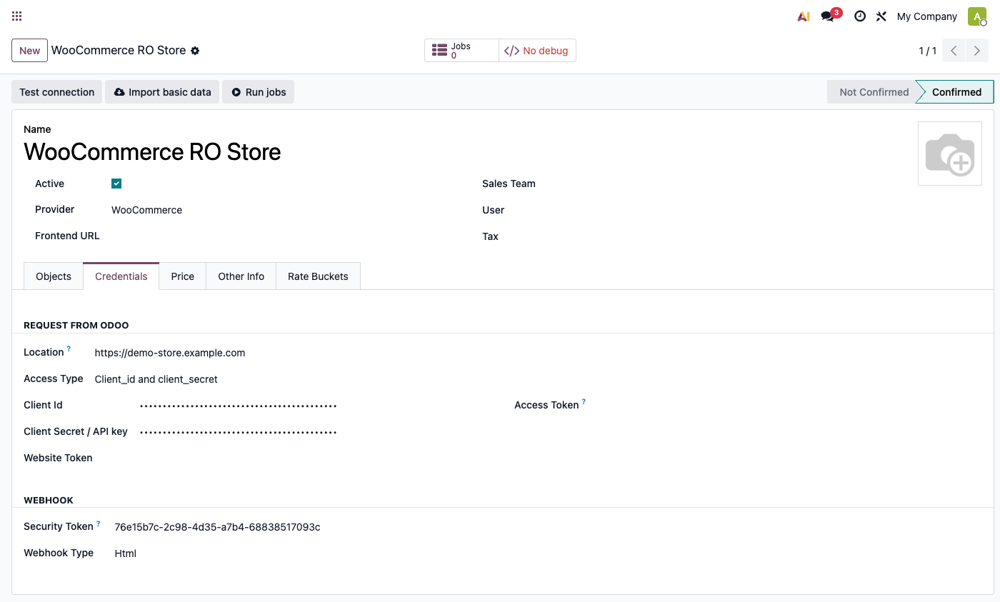
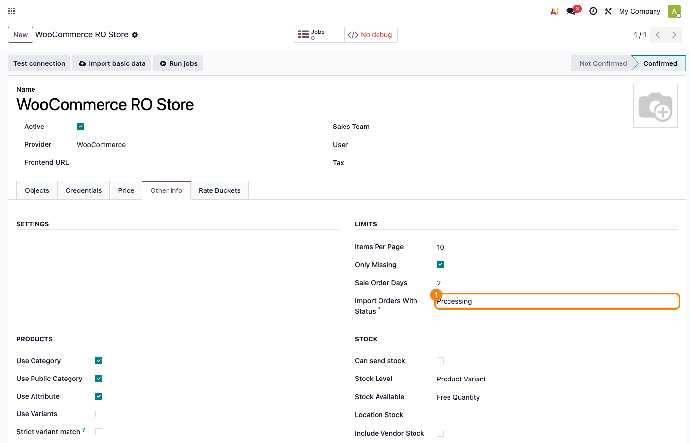
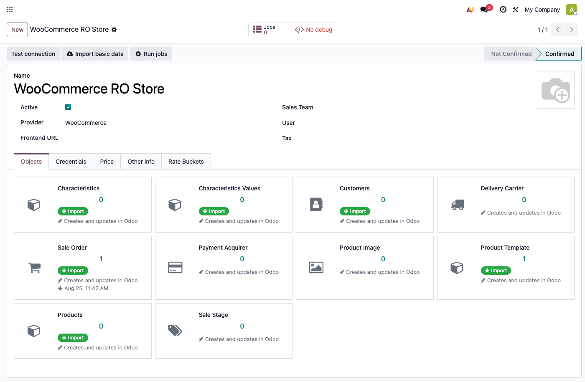
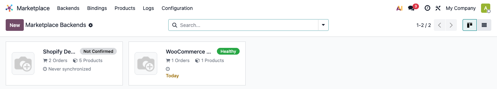

# Fișă Modul: Conector WooCommerce — sincronizare produse, comenzi și stoc

**Modul:** `deltatech_marketplace_woocommerce`
**Utilizator principal:** Consultant Odoo / administrator funcțional (configurare inițială), operator e-commerce (utilizare curentă)
**Prioritate:** 🔴 Ridicată (conector vandabil pe Odoo Apps Store, folosit de clienți cu magazine WooCommerce reale)

---

## 1. Scop business

Un magazin WooCommerce lângă Odoo, fără conector, înseamnă catalog, clienți și comenzi ținute
manual în două locuri: un produs adăugat în Odoo trebuie recreat în WordPress, o comandă plasată
pe site trebuie reintrodusă, stocul se dezaliniază până cineva observă în cel mai nepotrivit
moment. Modulul închide acest gol: produsele, clienții și comenzile se aduc automat din
WooCommerce în Odoo, iar stocul Odoo se trimite înapoi spre magazin — dintr-un singur backend
Odoo — și pentru că se leagă de același framework comun
(`deltatech_marketplace`) folosit și de conectorul Shopify, eMAG sau alții, adăugarea unui magazin
WooCommerce lângă un canal deja folosit nu înseamnă învățarea unui al doilea sistem.

## 2. Arhitectură tehnică și context

Modulul rulează pe **REST API-ul WooCommerce** (versiunea `wc/v3` a WooCommerce REST), fără
bibliotecă Python externă — comunicarea folosește `requests`, deja parte din Odoo. Autentificarea
este **HTTP Basic Auth** cu perechea **Consumer key / Consumer secret** generată din
WooCommerce (**WooCommerce → Settings → Advanced → REST API**), completată pe backend ca
`Client Id` / `Client Secret` (câmp comun al framework-ului, `access_type = client`).

Securitatea depinde de protocol: WooCommerce acceptă Consumer key/secret ca Basic Auth **doar
peste HTTPS**. Adaptorul modulului ține cont de asta: pe un magazin HTTP simplu, trece el însuși
pe trimiterea acelorași credențiale ca parametri simpli în URL (nu are altă opțiune ca să
funcționeze cu un magazin nesecurizat) — vizibili în logurile serverului și în istoricul
browserului. Recomandarea e clară: magazin pe HTTPS, întotdeauna când e posibil.

Spre deosebire de conectorul Shopify (REST + GraphQL, comutabile per subsistem), WooCommerce are
un singur transport — REST — deci nu există aici o alegere de protocol pe backend. Filtrul de
import comandă după status (`woo_order_status`, tab **Other Info**) mapează direct pe parametrul
`status` al apelului `GET /orders`; lista de statusuri e cea nativă WooCommerce (`pending`,
`processing`, `on-hold`, `completed`, `cancelled`, `refunded`, `failed`, `trash`), plus valoarea
`any` (implicită) care înseamnă „fără filtru" — comportamentul dinaintea acestui câmp.

## 3. Utilizatori și roluri

- **Consultant/administrator funcțional**: configurează backend-ul, activează cron-ul de export
  stoc, rulează prima sincronizare.
- **Operator e-commerce**: urmărește starea de sănătate a sincronizării, rezolvă job-urile eșuate,
  repetă manual importul de comenzi/produse noi (nu există un cron dedicat de import recurent în
  acest conector).

Roluri recomandate la testare:
- Administrator funcțional: instalează modulul, configurează backend-ul, verifică meniurile.
- Utilizator operațional: rulează prima sincronizare și importurile ulterioare.
- Manager/consultant: validează rezultatul (comenzi importate, stoc exportat, indicatorul de
  sănătate).

## 4. Date și mapări implicate

Nu există note contabile Dr/Cr generate direct de acest modul (asta ține de `sale`/`account`,
declanșate normal de comanda de vânzare creată din comanda WooCommerce importată). Datele-cheie de
pregătit înainte de prima sincronizare:

- **Lista de prețuri** (`pricelist_id`, tab **Price**) — nu e un export de preț către WooCommerce
  (acest conector nu exportă prețuri), ci **destinația** prețului pe care WooCommerce îl raportează
  la import; `Update Price Only`/`Ignore Price` guvernează cum se scrie peste prețul Odoo existent.
- **Categoria implicită / categorie marketplace implicită** (tab **Other Info → Defaults**) —
  folosite când produsul importat nu are o mapare mai specifică.
- **Filtrul de status comandă** (`woo_order_status`) — dacă e restrâns la altceva decât `Any`,
  fereastra de import (**Sale Order Days**, câmp comun al framework-ului, implicit 2 zile, tab
  **Other Info → Limits**) trebuie să fie suficient de largă cât acel status să fie atins înainte
  ca fereastra să expire; altfel comanda nu mai e importată niciodată.
- **„Can send stock"** (tab **Other Info → Stock**) — trebuie bifat pentru ca produsele acestui
  backend să fie luate în calcul de cron-ul comun de export stoc (vezi §6, Pasul 5); implicit
  nebifat.

Transportatorii, achizitorii de plată și fazele de vânzare **nu** cer o mapare manuală prealabilă:
se creează automat, în Odoo, în momentul în care o comandă importată referă pentru prima dată unul
inexistent încă. Acest conector nu are o noțiune proprie de depozit/warehouse mapat — stocul
importat/exportat nu e rutat pe un depozit specific WooCommerce.

Date minime pentru demo: un magazin WooCommerce de test cu credențiale REST API Read/Write, cel
puțin un produs (eventual cu variante/atribute), un client și o comandă existentă în magazin.

## 5. Configurare inițială

1. În WooCommerce, generați credențiale REST API cu permisiuni **Read/Write**
   (**WooCommerce → Settings → Advanced → REST API**). Rețineți URL-ul magazinului, **Consumer
   key** și **Consumer secret**. Folosiți un magazin HTTPS ori de câte ori e posibil.
2. Instalați modulul `deltatech_marketplace_woocommerce` (nu necesită nicio bibliotecă Python
   externă în afara celor deja incluse în Odoo).
3. Creați un backend nou: **Marketplace → Backends → Nou**, `Provider = WooCommerce`.
4. În tab-ul **Credentials**, completați **Location** (URL-ul magazinului), **Access Type =
   client**, apoi **Client ID** / **Client Secret** cu consumer key/secret din WooCommerce.
5. Salvați. Salvarea cu `Provider = WooCommerce` populează automat tab-ul **Objects** cu câte un
   rând pentru fiecare tip de date pe care îl acoperă conectorul: Products, Product Template,
   Customers, Sale Order, Delivery Carrier, Sale Stage, Payment Acquirer, Characteristics,
   Characteristics Values și Product Image.
6. Setați tab-ul **Price** (lista de prețuri, politica `Update Price Only`/`Ignore Price`) și, în
   **Other Info**, filtrul `Import Orders With Status` dacă e nevoie de o restricție.
7. Apăsați **Test connection** din antet.
8. Dacă vreți ca stocul Odoo să se exporte spre WooCommerce, bifați **Can send stock** (tab
   **Other Info → Stock**) și activați cron-ul comun „Marketplace: export stock" din
   **Marketplace → Configuration → Crons** (dezactivat implicit).

## 6. Flux de utilizare

### Pasul 1 — Configurarea backend-ului (Credentials)

Deschideți **Marketplace → Backends → Nou**, alegeți `Provider = WooCommerce` și completați
tab-ul **Credentials**: adresa magazinului (**Location**), **Access Type = client**, apoi
**Client ID** / **Client Secret** cu consumer key/secret generate în WooCommerce.



### Pasul 2 — Testarea conexiunii

Apăsați **Test connection** din antetul formularului. Acest apel autentifică cu Consumer
key/secret introduse; la succes, starea (`State`) backend-ului trece pe **Confirmed**, condiție
necesară ca indicatorul de sănătate să poată deveni verde mai târziu. Un eșec ridică eroarea
WooCommerce/HTTP ca mesaj de validare, direct pe ecran, înainte de a merge mai departe.

### Pasul 3 — Filtrul de import comandă (Other Info)

Tab-ul **Other Info → Limits** conține, lângă câmpul comun **Sale Order Days** (fereastra de
import, implicit 2 zile), câmpul specific acestui conector, `Import Orders With Status`: lăsat pe
**Any** (implicit), importă orice status de comandă WooCommerce — comportamentul dinaintea acestui
câmp. Restrângerea la un singur status (de exemplu `Processing`) e sigură doar dacă fereastra
**Sale Order Days** e suficient de largă cât comanda să atingă acel status înainte ca fereastra
să expire.



### Pasul 4 — Prima sincronizare (tab Objects)

Tab-ul **Objects** arată câte un card pentru fiecare tip de date — dar nu toate au buton de
**Import**: doar tipurile pe care conectorul le aduce direct din WooCommerce (Characteristics,
Characteristics Values, Product Template, Products, Customers, Sale Order). **Delivery Carrier**,
**Payment Acquirer**, **Sale Stage** și **Product Image** nu au niciun buton pe card — se
populează automat, pe măsură ce o comandă importată le referă (vezi §4). Ordinea recomandată
pentru prima sincronizare:

1. **Characteristics** / **Characteristics Values** — atributele de produs WooCommerce, înaintea
   produselor, ca acestea să se poată potrivi cu ele.
2. **Product Template** (și **Products** pentru variante) — pornește un job de fundal care
   parcurge catalogul WooCommerce și creează/actualizează produsele Odoo corespunzătoare,
   inclusiv imaginile (dacă **Ignore Images** nu e bifat pe backend).
3. **Customers** — clienții WooCommerce, ca și contacte Odoo.
4. **Sale Order** — ultimul, ca liniile de comandă să găsească deja produsele și clienții
   importați. Fiecare comandă vine cu adresele de facturare/livrare, liniile, linia de transport
   (mapată la un transportator, creat automat dacă nu există încă), metoda de plată și eventualele
   linii de taxă suplimentară; statusul WooCommerce al comenzii se mapează pe o fază de vânzare
   Odoo, cu maparea creată automat la prima întâlnire a unui status nou.

Toate aceste acțiuni rulează ca **job-uri în coadă** (queue jobs), nu sincron: după apăsarea unui
buton primiți o notificare „se va executa în fundal". Butonul **Jobs** din antetul backend-ului
arată coada, iar **Run jobs** forțează procesarea imediată (util într-o instanță Community fără
cron-ul job-runner deja pornit).



### Pasul 5 — Ce rulează automat după prima sincronizare

Stocul se exportă către WooCommerce prin cron-ul comun „Marketplace: export stock"
(**Marketplace → Configuration → Crons**), **dezactivat implicit** — nu există un export „în timp
real" declanșat direct de mișcarea de stoc în acest conector. Pentru ca produsele acestui backend
să fie incluse, mai trebuie bifat **Can send stock** (tab **Other Info → Stock**). **Nu există
export de preț** către WooCommerce: direcția e inversă — `pricelist_id` e doar destinația
prețului importat (vezi §4).

Comenzile, produsele sau clienții noi creați în WooCommerce **după** prima sincronizare **nu**
sunt aduși automat de un cron dedicat în acest modul: se repetă manual acțiunea **Import** din
tab-ul Objects (sau se automatizează cu o acțiune programată proprie care apasă același buton).
Fiecare rând din Objects mai are și suport generic „Use webhook", moștenit din framework-ul
comun, cu un URL de webhook de înregistrat în WooCommerce — acest conector nu adaugă o procesare
specifică WooCommerce a payload-ului de webhook, deci validați un apel de test înainte să vă
bazați pe el în producție.

O comandă deja importată nu se mai actualizează dacă e anulată sau rambursată ulterior în
WooCommerce: rămâne pe faza de vânzare pe care o avea la ultima sincronizare — nu există, în acest
conector, o cale de a aduce înapoi o anulare/rambursare făcută în magazin.

### Pasul 6 — Citirea stării de sănătate

Cardul kanban al backend-ului din **Marketplace → Backends** arată un indicator de sănătate
(gri/portocaliu/roșu/verde). Devine **verde** doar când toate condițiile sunt adevărate simultan:
backend-ul e confirmat (`Test connection` reușit), fără erori în ultimele 24h, fără job-uri
eșuate, și **cel puțin un tip de date are deja o sincronizare înregistrată**. Un backend confirmat
dar neimportat încă rămâne **portocaliu** („Never synchronized", scris direct pe card), nu verde
și nu gri.



> Kanban-ul **Marketplace → Backends** e comun tuturor conectorilor instalați — pe o instanță cu
> mai multe conectoare de test/demo (ex. Shopify) e normal să apară și cardurile lor alături de cel
> WooCommerce. Urmăriți cardul cu numele backend-ului configurat de voi.

### Note de monografie și raportare

Nu se aplică — acest modul nu generează note contabile proprii. Comanda de vânzare rezultată din
importul WooCommerce urmează contabilizarea standard Odoo (`sale`/`account`), neatinsă de acest
conector.

## 7. Legături cu alte module / declarații

| Modul / proces | Rol în flux | Tip legătură |
|---|---|---|
| `deltatech_marketplace` | framework comun: backend, indicator de sănătate, job-uri, item-uri sincronizate | dependență (manifest) |
| `deltatech_marketplace_sale` | comanda de vânzare Odoo generată din comanda WooCommerce | dependență (manifest) |
| `deltatech_marketplace_sale_stage` | mapare status WooCommerce ↔ fază de vânzare Odoo | dependență (manifest) |
| `deltatech_marketplace_delivery` | mapare transportator, linie de livrare pe comandă | dependență (manifest) |
| `deltatech_marketplace_payment` | mapare metodă de plată WooCommerce → payment acquirer Odoo | dependență (manifest) |
| `deltatech_marketplace_website` | integrare website (opțională) | dependență (manifest) |
| `sale` / `stock` / `account` | comanda de vânzare, mișcarea de stoc, factura rezultată — flux Odoo standard, neatins direct de acest modul | flux standard Odoo |

Ce este automat: crearea transportatorilor/achizitorilor de plată/fazelor de vânzare la prima
referință dintr-o comandă importată; exportul de stoc, odată activat cron-ul comun și bifat
**Can send stock** pe backend.
Ce rămâne manual: prima sincronizare (ordinea din Pasul 4), activarea cron-ului de export stoc,
repetarea periodică a importului de comenzi/produse/clienți noi (fără cron dedicat), verificarea
webhook-urilor înainte de a te baza pe ele în producție. Nu există export de preț în acest
conector.

## 8. Verificări pentru consultant

- [ ] Modulul se instalează fără erori (nu necesită bibliotecă Python externă).
- [ ] Credențialele REST API din WooCommerce au permisiuni **Read/Write**, nu doar Read.
- [ ] Magazinul rulează pe HTTPS — altfel Consumer key/secret ajung ca parametri simpli în URL.
- [ ] **Test connection** confirmă credențialele (`State = Confirmed`) înainte de orice import.
- [ ] Prima sincronizare respectă ordinea din Pasul 4 (atribute → produse → clienți → Sale Order,
      ultimul).
- [ ] Dacă `Import Orders With Status` e mai restrictiv decât `Any`, fereastra `Sale Order Days`
      acoperă statusul urmărit înainte de a expira.
- [ ] Indicatorul de sănătate de pe cardul kanban e verde (confirmat, zero erori/job-uri eșuate,
      cel puțin o sincronizare înregistrată) după prima sincronizare reușită.
- [ ] Dacă se dorește exportul de stoc: **Can send stock** e bifat pe backend ȘI cron-ul
      „Marketplace: export stock" e activat din **Marketplace → Configuration → Crons** (nu rulează
      implicit, și nu e „în timp real").
- [ ] Nu s-a promis clientului un export de preț către WooCommerce — acest conector nu are unul;
      `pricelist_id` primește prețul importat, nu îl trimite.
- [ ] Importurile ulterioare de comenzi/produse/clienți noi sunt repetate manual sau automatizate
      cu o acțiune programată proprie — nu există un cron dedicat în acest modul.
- [ ] Un webhook înregistrat în WooCommerce e validat cu un apel de test înainte de a fi folosit în
      producție (conectorul nu are procesare specifică de payload).
- [ ] Clientul știe că o anulare/rambursare făcută în WooCommerce, după import, nu ajunge în Odoo.

## 9. Mesaje de eroare frecvente

| Mesaj / simptom | Cauză probabilă | Remediere |
|---|---|---|
| `Test connection` eșuează cu eroare HTTP/WooCommerce | URL greșit, magazin fără REST API activat, sau consumer key/secret greșite/revocate | Verificați URL-ul (cu protocol), regenerați credențialele în WooCommerce, reîncercați |
| Consumer key/secret vizibile în logurile serverului sau în istoricul browserului | Magazinul rulează pe HTTP, nu HTTPS — adaptorul trece automat pe query params, singura opțiune WooCommerce acceptă pe HTTP | Activați HTTPS pe magazin; nu există altă soluție la nivel de modul |
| O comandă nouă din WooCommerce nu ajunge deloc în Odoo | Fereastra `Sale Order Days` a expirat înainte ca statusul filtrat să fie atins, sau butonul **Import** nu a mai fost apăsat de la ultima sincronizare | Lărgiți fereastra sau reveniți la `Any`; rulați manual **Import** pe cardul Sale Order |
| Stocul din WooCommerce nu se actualizează niciodată | Cron-ul „Marketplace: export stock" e dezactivat (implicit) sau **Can send stock** nu e bifat pe backend | Activați cron-ul din **Marketplace → Configuration → Crons** și bifați **Can send stock** |
| Butonul „Import basic data" din antet arată „succes", dar nu s-a întâmplat nimic vizibil | Acest conector nu implementează un pas provider-specific de „import basic data"; mesajul de succes apare oricum, necondiționat | Comportament normal, nu eroare — folosiți acțiunile per tip de date din tab-ul Objects |
| O comandă anulată/rambursată în WooCommerce rămâne activă în Odoo | Conectorul nu urmărește schimbări ulterioare de status pe o comandă deja importată | Anulați manual comanda în Odoo; nu există sincronizare automată pentru acest caz |
| Job în coadă rămâne „failed" | Categorie de produs implicită sau alt câmp obligatoriu lipsă, referit de configurarea backend-ului | Verificați traceback-ul job-ului din **Jobs**, corectați configurarea, requeue |

## 10. Capturi de ecran

> Interfața din capturile de mai jos e în **engleză** (capturile s-au făcut cu `locale="en-US"`,
> ca la conectorul Shopify) — etichetele reale de pe ecran sunt cele englezești, deși modulul are
> și o traducere parțială în `i18n/ro.po`.

Capturile (`readme/screenshots/`) ilustrează fluxul din secțiunea 6, generate cu
`ScreenshotCase`/Playwright (`tests/test_screenshots.py`, import defensiv, clasă separată de cea
folosită pentru capturile de marketing din `static/description/screenshots/`):

1. `01_credentials.png` — backend WooCommerce, tab Credentials completat.
2. `02_order_status.png` — tab Other Info: câmpul Import Orders With Status, lângă Sale Order Days.
3. `03_objects.png` — tab Objects: rândurile cu acțiunile de import per tip de date.
4. `04_health_badge.png` — indicatorul de sănătate pe cardul kanban al backend-ului.

Regenerare:

```bash
./odoo/odoo-bin -c odoo_mp_test.conf -d mkt_test19 -u deltatech_marketplace_woocommerce \
    --test-enable --test-tags=fise_screenshots --stop-after-init
```

## 11. Observații pentru manual

În manualul final, păstrați accentul pe **ordinea** primei sincronizări (atribute/caracteristici
înainte de produse, Sale Order ultimul) și pe **lipsa unui cron dedicat de import recurent** —
sincronizarea de intrare depinde de webhook-uri (nevalidate automat de conector) sau de repetarea
manuală a importului. Nu confundați asta cu exportul de stoc: acesta rulează pe un cron separat,
dezactivat implicit, nu „în timp real" — și acest conector nu exportă prețuri către WooCommerce.
Menționați explicit clientului limitarea anulare/rambursare (nu ajunge din WooCommerce în Odoo) și
faptul că **Test connection** validează efectiv credențialele (apel real către magazin), nu doar
completarea câmpurilor. Evitați alte detalii de implementare (nume de câmpuri interne, endpoint-uri
REST) în corpul explicației către utilizatorul final.
