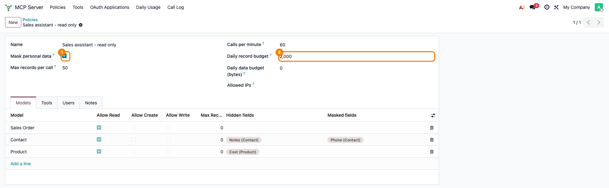
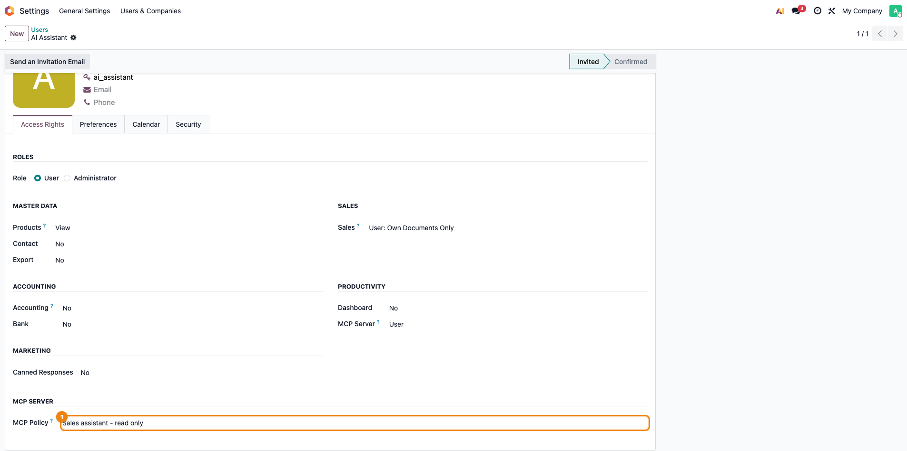
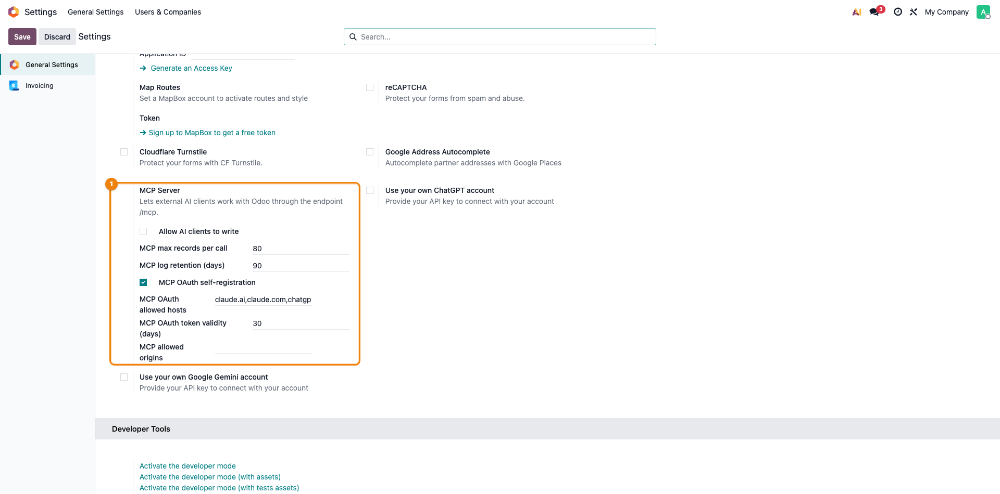
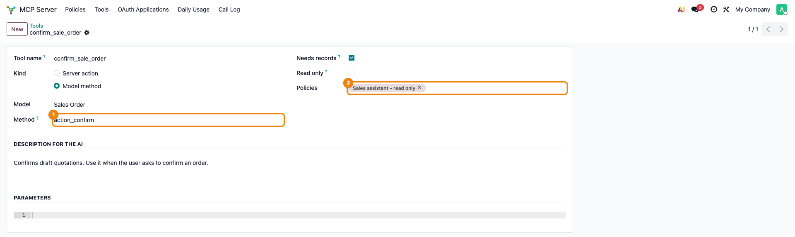
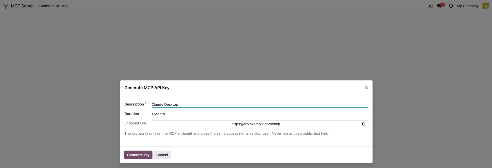
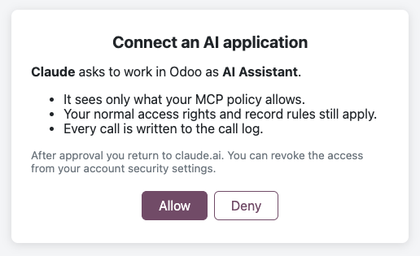
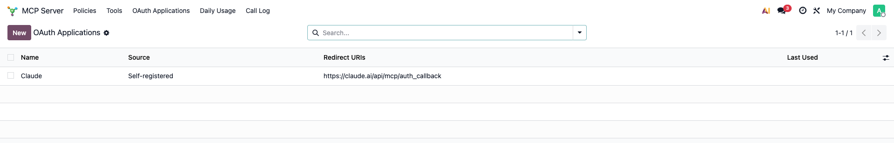
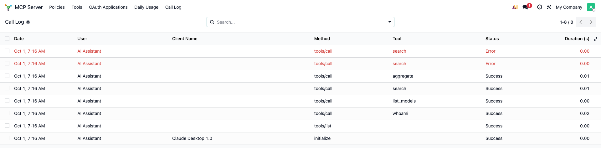
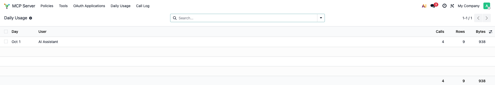

# Fișă Modul: Acces AI în Odoo prin MCP (MCP Server)

**Modul:** `deltatech_mcp_server`
**Versiune:** 19.0.1.4.0
**Suită:** bitshop_ent (merge pe Community și pe Enterprise; nu depinde de modulul Odoo AI)
**Dependențe:** `base_setup`
**Utilizator principal:** consultantul care configurează accesul AI pentru un client; administratorul clientului
**Prioritate:** 🟡 Medie (nu blochează nicio operațiune, dar clienții cer tot mai des acces AI în Odoo)

---

## 1. Scop business

Un manager vrea să întrebe, din Claude, ChatGPT sau Cursor, „câte comenzi am luat luna asta?” și să
primească răspunsul din Odoo. Varianta cea mai simplă, o cheie API de administrator, dă acces la tot:
nu are limite, nu lasă evidență și nu ține cont de datele personale.

Modulul face din Odoo un server MCP (Model Context Protocol, standard deschis pentru aplicațiile AI).
Clientul AI se conectează la adresa `/mcp` a instanței și poate citi, iar dacă se permite explicit și
modifica, datele — dar numai în limitele unei **politici** stabilite de consultant, peste drepturile
normale ale utilizatorului cu care se conectează.

Pe lângă citire și scriere de câmpuri, consultantul poate da AI-ului **acțiuni**: butoanele pe care le-ar
apăsa un om (de exemplu *Confirm* pe o ofertă) sau acțiuni de server. AI-ul primește doar butoanele
alese, nu dreptul de a modifica orice câmp. Așa, cererea „confirmă ofertele lui X de săptămâna asta”
se poate face fără să deschidem `write` pe comenzi.

Nu înlocuiește integrările custom și nu rulează un model AI în Odoo: Odoo doar răspunde clientului AI.

## 2. Bază legală și context

Nicio obligație legală nouă; modulul nu produce documente și nu trimite nimic către ANAF.

Contextul care contează este protecția datelor (GDPR): un asistent AI extern poate primi date
personale. De aceea modulul maschează implicit CUI/VAT, IBAN, CNP, salarii și data nașterii, iar
consultantul decide, pe fiecare model, ce câmpuri se ascund complet. Mascarea automată se face după **numele tehnic al câmpului**: numele persoanei, e-mailul, telefonul și
adresa **nu** sunt mascate implicit, iar un câmp custom cu alt nume scapă de regulă. Ce este dată
personală se adaugă manual la *Hidden fields* sau *Masked fields*.

Clientul rămâne responsabil pentru alegerea furnizorului AI, pentru informarea persoanelor vizate și
pentru verificarea acordului de prelucrare cu furnizorul AI și a transferului datelor în afara UE.

## 3. Utilizatori și roluri

| Rol | Ce poate |
|---|---|
| **Administrator (grupul Settings)** | creează politici și unelte (acțiuni), aprobă aplicațiile OAuth, vede jurnalul și consumul, schimbă setările serverului |
| **MCP Server / User** | se poate conecta la `/mcp` și își poate genera o cheie API cu scope MCP; vede doar meniul „Generate API Key” (un administrator fără acest rol nu vede meniul) |

Recomandare: un **utilizator dedicat** pentru clientul AI (nu utilizatorul unui om), cu drepturile
minime necesare pe modelele expuse. Politica se atribuie lui, pe formularul utilizatorului.

## 4. Conturi și date implicate

Modulul **nu generează note contabile**. Datele pe care le păstrează:

- **politici** și modelele lor (ce se vede, ce se mascheză, ce limite);
- **unelte (acțiuni)**: metoda sau acțiunea de server, descrierea pentru AI, parametrii și politicile în care sunt active;
- **jurnalul apelurilor**: cine, ce metodă și unealtă, argumentele (trunchiate), durata, rezultatul; se
  șterge automat după 90 de zile (configurabil);
- **consumul zilnic** pe utilizator: apeluri, înregistrări, octeți;
- **aplicațiile OAuth** și, pe scurt, codurile de autorizare (2 minute, doar hash);
- cheile API ale utilizatorilor (mecanismul standard Odoo, cu scope `mcp`).

Date minime pentru demo: câțiva parteneri, câteva comenzi de vânzare și un utilizator AI cu drepturi de
vânzări.

## 5. Configurare inițială

1. Creați utilizatorul AI (*Settings → Users*), cu drepturile minime necesare (ex. Sales / User) și **cu
   o parolă**: cu contul lui se generează cheia API (Pasul 5) sau se aprobă conexiunea OAuth (Pasul 6).
2. Pe același formular, tabul *Access Rights*, secțiunea **MCP Server**, alegeți rolul **User**.
3. În *MCP Server → Policies* creați politica (Pasul 1 de mai jos) și atribuiți-o utilizatorului.
4. În *Settings → General Settings → Integrations → MCP Server* verificați limitele. Lăsați
   **Allow AI clients to write** debifat până la teste.
5. Opțional, în *MCP Server → Tools* adăugați acțiunile pe care AI-ul le poate rula (Pasul 4 de mai jos) și
   activați-le în politică.
6. Pentru clienți web (Claude.ai, ChatGPT): `web.base.url` trebuie să fie adresa publică HTTPS a
   instanței, iar *MCP OAuth self-registration* se bifează (Pasul 6).

## 6. Flux de utilizare

### Pasul 1 — Politica de acces

**MCP Server → Policies → New.** Numiți politica și completați limitele: înregistrări pe apel, buget
zilnic de înregistrări și de date, apeluri pe minut, IP-uri permise. Lăsați **Mask personal data**
bifat. Pe tabul *Models* adăugați modelele pe care AI-ul le poate folosi și bifați doar operațiile
necesare. Pentru fiecare model puteți ascunde câmpuri (**Hidden fields**), le puteți afișa mascat
(**Masked fields**) sau puteți lăsa vizibile doar câteva (**Only these fields**; coloana se afișează din iconița de coloane a listei).



### Pasul 2 — Politica se atribuie utilizatorului AI

**Settings → Users → utilizatorul AI → Access Rights → MCP Server.** Câmpul **MCP Policy** leagă
utilizatorul de politică. Un utilizator fără politică se poate conecta, dar nu poate folosi nicio
unealtă.



### Pasul 3 — Setările serverului

**Settings → General Settings → Integrations → MCP Server.** Aici sunt valorile globale: **Allow AI clients to write** (implicit debifat: serverul e doar-citire și
uneltele de scriere nici nu apar clientului), numărul maxim de înregistrări pe apel, cât se păstrează
jurnalul, auto-înregistrarea OAuth, gazdele permise pentru OAuth, valabilitatea tokenilor și originile
de browser acceptate (clienții AI fără antet `Origin` sunt acceptați oricum).



### Pasul 4 — Acțiunile pe care AI-ul le poate rula (unelte)

**MCP Server → Tools → New.** O unealtă este un buton sau o acțiune de server pe care AI-ul o poate rula pe
înregistrări, la fel cum ar apăsa-o un om:

- **Name**: numele văzut de AI, cu litere mici, cifre și `_` (ex. `confirm_sale_order`); nu poate fi numele unei
  unelte de bază (`search`, `write` etc.).
- **Kind**: **Model method** (metoda unui buton, ex. `action_confirm` pe *Sales Order*) sau **Server action**
  (o acțiune de server existentă; modelul se ia din ea).
- **Method**: se acceptă doar metodele care încep cu `action_` sau `button_` (butoanele din formulare) ori cele
  declarate de model în `_mcp_methods`. Metodele interne, `write`, `unlink` și cele marcate private sunt refuzate.
  Numele metodei se vede în modul developer, trecând cu mouse-ul peste buton.
- **Description for the AI**: ce face unealta și când se folosește, în engleză. De ea depinde dacă AI-ul o alege
  corect.
- **Needs records**: AI-ul trebuie să dea id-urile înregistrărilor (aproape întotdeauna bifat).
- **Read only**: bifați doar dacă unealta nu modifică nimic. Uneltele care modifică date nu apar cât timp
  serverul e doar-citire (*Allow AI clients to write* debifat).
- **Parameters**: opțional, o schemă JSON pentru valori suplimentare (ex. o notă). Ajung la acțiunea de server
  în `env.context["mcp_arguments"]`; codul poate întoarce date punând un dicționar în variabila `action`.
- **Policies**: politicile în care unealta e activă. Modelul uneltei trebuie să fie și el în politică (cu
  *Allow Read*), dar **nu** e nevoie de *Allow Write*: AI-ul poate confirma o comandă fără să poată
  modifica liber câmpurile ei.



Unealta rulează cu drepturile utilizatorului AI (drepturi pe model, reguli de înregistrare, grupurile acțiunii
de server) și respectă limita de înregistrări pe apel. Dacă butonul deschide o fereastră de dialog (wizard),
apelul este refuzat și ce s-a modificat se anulează; operația se termină în Odoo de un om. Uneltele active
apar și pe tabul *Tools* al politicii.

### Pasul 5 — Cheia API pentru clientul AI

**MCP Server → Generate API Key**, autentificat **ca utilizatorul AI**. Cheia se generează întotdeauna
pentru utilizatorul conectat: dacă o generați din contul dumneavoastră de administrator, AI-ul va lucra
cu drepturile dumneavoastră. Dați un nume cheii, alegeți durata și apăsați **Generate key**; Odoo cere
parola utilizatorului. Cheia se arată o singură dată. Cheia este valabilă doar pe `/mcp`, nu și pe XML-RPC.



**Cheia în clientul AI.** Clientul primește adresa `https://<odoo-ul-clientului>/mcp` și cheia în antetul
`Authorization: Bearer <cheie>`:

- **Claude Code:**
  `claude mcp add --transport http odoo https://<odoo>/mcp --header "Authorization: Bearer <cheie>"`
- **Cursor**, în `mcp.json`:
  `{"mcpServers": {"odoo": {"url": "https://<odoo>/mcp", "headers": {"Authorization": "Bearer <cheie>"}}}}`

Denumirile din clienții AI se schimbă des; dacă o etichetă diferă, verificați documentația clientului.

### Pasul 6 — Clienți web: aprobarea conexiunii (OAuth)

Claude.ai și ChatGPT nu primesc o cheie lipită de mână. Clientul deschide o pagină Odoo; **utilizatorul AI**
se autentifică și apasă **Allow**. Odoo emite atunci o cheie API cu scope `mcp`, numită „OAuth:
<aplicație>”, vizibilă în securitatea contului și revocabilă oricând. Utilizatorul trebuie să fie în
rolul **MCP Server / User** și să aibă o politică.

Pregătirea, de făcut o singură dată, de un administrator:

1. `web.base.url` (*Settings → Technical → Parameters → System Parameters*, în mod developer) trebuie să fie adresa publică HTTPS a
   instanței: documentele OAuth se construiesc din ea, iar clientul merge la acea adresă.
2. În *Settings → General Settings → Integrations → MCP Server*, bifați **MCP OAuth self-registration**.
   Clienții se înregistrează singuri, dar numai dacă gazda lor e în lista *MCP OAuth allowed hosts*
   (implicit `claude.ai`, `claude.com`, `chatgpt.com`, `platform.openai.com`).

Conectarea, de făcut de utilizator în clientul AI:

1. Adăugați un conector personalizat (server MCP) cu adresa `https://<odoo>/mcp`. Lăsați goale ID-ul de client
   și secretul: clientul se înregistrează singur.
   - **Claude.ai:** *Settings → Connectors → Add custom connector*. Pe planurile Team sau Enterprise, adăugarea
     unui conector poate cere un owner.
   - **ChatGPT:** serverele MCP personalizate funcționează în *Developer mode*. Se activează din *Settings →
     Security and login*; într-un workspace Business, Enterprise sau Edu, un administrator trebuie să permită
     întâi conectorii MCP personalizați. Creați o aplicație sau un conector din serverul MCP, cu numele și adresa de
     mai sus și autentificare **OAuth**, apoi alegeți-l într-o conversație din meniul **+**. ChatGPT cere
     confirmare înainte de o unealtă care modifică date; uneltele de citire (`readOnlyHint`) rulează fără ea.
   - **Aplicația Codex a OpenAI (desktop):** *Plugins → MCPs → Add*, server MCP personalizat, cu un nume și adresa
     de mai sus. Lăsați goale *Bearer token env var* și antetele, salvați și autentificați-vă ca utilizatorul AI pe
     pagina Odoo pe care o deschide aplicația. Pentru o cheie API în loc de OAuth, păstrați cheia într-o variabilă de
     mediu și scrieți numele variabilei în *Bearer token env var*.
2. Clientul deschide pagina Odoo de mai jos. Autentificați-vă **ca utilizatorul AI**, nu ca administrator,
   verificați numele aplicației și adresa la care se revine, apoi apăsați **Allow**. **Deny** anulează conexiunea.
3. În client, conectorul e gata de folosit. Accesul apare în preferințele utilizatorului, tabul **Account
   Security**, ca o cheie «OAuth: <aplicație>»; ștergerea ei revocă accesul. Cheia expiră după numărul de zile
   din Settings (30 implicit), iar clientul cere din nou aprobarea.



Aplicațiile care se pot conecta sunt cele din **MCP Server → OAuth Applications**. Cele care se
înregistrează singure apar acolo cu sursa „Self-registered”; auto-înregistrarea este oprită implicit
și acceptă doar gazdele din listă.



### Pasul 7 — Ce a făcut AI-ul: jurnal și consum

**MCP Server → Call Log** arată fiecare apel: data, utilizatorul, metoda, unealta, rezultatul și durata
(în secunde). Numele clientului apare pe rândul `initialize`. Erorile apar cu roșu (de exemplu o căutare
pe un câmp mascat sau pe un model care nu e în politică); deschideți rândul ca să vedeți mesajul erorii.
Un refuz după adresa IP nu ajunge în jurnal, pentru că autentificarea pică înainte.



**MCP Server → Daily Usage** arată, pe zi și pe utilizator, câte apeluri **reușite** de unelte, înregistrări
și octeți s-au consumat; comparați cu bugetul din politică. Cifra diferă de Call Log, care numără toate
apelurile, inclusiv erorile și cele de protocol.



### Primele întrebări în clientul AI

Ecranul de aici e al clientului AI, nu al Odoo, deci nu are captură. Ca test, întrebați: „Cine sunt eu în Odoo și
ce modele poți folosi?” (`whoami`, `list_models`), „Arată-mi zece contacte cu numele și țara” (`search`) și
„Câte comenzi de vânzare avem pe stări?” (`aggregate`). Cu unealta din Pasul 4: „Confirmă ofertele lui
Northwind din săptămâna asta” (AI-ul caută ofertele, apoi apelează `confirm_sale_order` cu id-urile lor). Câmpurile mascate vin ca `***`, iar un filtru sau un total
pe ele este refuzat.

### Uneltele pe care le vede clientul AI

`whoami`, `list_models`, `describe_model`, `search`, `read`, `aggregate` (citire) și, doar când
scrierea este activată, `create` și `write`. Nu există o unealtă de ștergere, dar `write` poate totuși
arhiva o înregistrare (`active`) sau schimba stări. Câmpurile de tip linii (one2many, many2many) nu se pot
scrie prin MCP.

În plus, AI-ul vede uneltele din *MCP Server → Tools* active în politica lui (Pasul 4), cu descrierea și
parametrii lor. Când e posibil, preferați o unealtă (un buton anume) în locul lui `write` pe tot modelul.

## 7. Legături cu alte module / declarații

| Element | Rol |
|---|---|
| Drepturile și regulile de acces Odoo | se aplică mereu peste politică |
| Acțiunile de server (*Settings → Technical → Server Actions*) | pot fi expuse ca unelte |
| Modulul Odoo AI (Enterprise) | nu e necesar; în Odoo 20 Enterprise există un server MCP propriu, pe aceeași adresă `/mcp` |

**Ce e automat:** mascarea datelor personale, limitele, jurnalul, curățarea jurnalului, expirarea cheilor.
**Ce rămâne manual:** alegerea modelelor, câmpurilor și uneltelor, atribuirea politicii, configurarea clientului AI.

## 8. Verificări pentru consultant

- [ ] Utilizatorul AI are rolul **MCP Server / User** și o politică activă.
- [ ] Politica conține doar modelele necesare; câmpurile sensibile sunt ascunse sau mascate.
- [ ] **Allow AI clients to write** este debifat în Settings pe durata testelor.
- [ ] Cheia a fost generată din contul **utilizatorului AI**, nu din cel de administrator.
- [ ] Din clientul AI, `whoami` arată utilizatorul AI, nu un administrator.
- [ ] O căutare pe un model din politică întoarce înregistrări; pe un model din afara politicii întoarce eroare.
- [ ] CUI/VAT apare ca `***`, iar o căutare filtrată pe VAT este refuzată.
- [ ] Uneltele active în politică au modelul în politică și o descriere clară; doar cele care nu modifică nimic sunt
  bifate *Read only*.
- [ ] Din clientul AI, o unealtă de tip buton (ex. `confirm_sale_order`) schimbă starea înregistrării; o unealtă
  care nu e în politică nu apare în lista clientului.
- [ ] Un buton care deschide un wizard este refuzat și înregistrarea rămâne neschimbată.
- [ ] Apelurile apar în **Call Log**; consumul apare în **Daily Usage**.
- [ ] La Codex (OpenAI): conectorul se adaugă din *Plugins → MCPs*; după conectare, cheia «OAuth: Codex» apare în Account Security.
- [ ] La ChatGPT: *Developer mode* este activat (și permis de administratorul workspace-ului, dacă e cazul), iar conectorul
  folosește autentificare **OAuth**.
- [ ] La OAuth: `web.base.url` este adresa publică HTTPS și *MCP OAuth self-registration* este bifat.
- [ ] La OAuth: după revocare (cheia «OAuth: …» ștearsă din Account Security), clientul primește 401 și cere din nou aprobarea.
- [ ] La OAuth: pagina de consimțământ arată numele aplicației și adresa la care se revine; după **Allow** cheia „OAuth: …” apare în securitatea contului.

## 9. Mesaje de eroare frecvente

| Mesaj | Cauză | Remediere |
|---|---|---|
| No MCP policy is assigned to your user | Utilizatorul nu are politică | Atribuiți politica pe formularul utilizatorului |
| The model … is not available for read/create/write | Modelul nu e în politică sau operația nu e bifată | Adăugați modelul în politică |
| The field … is not available / cannot be used in filters | Câmpul e ascuns sau mascat | Scoateți-l din lista de câmpuri ascunse/mascate, dacă e legitim |
| The daily data budget of this connection is used up | S-a atins bugetul zilnic | Măriți bugetul politicii sau așteptați ziua următoare |
| Rate limit exceeded, retry in a minute | Prea multe apeluri pe minut | Măriți limita din politică |
| The server is in read-only mode | Scrierea e oprită global | Bifați *Allow AI clients to write* în Settings, doar dacă e nevoie |
| The user is not allowed to use the MCP server (HTTP 403) | Utilizatorul nu are rolul MCP Server / User | Atribuiți rolul **User** |
| The field … cannot be written through MCP | Câmpul e mascat, ascuns sau de tip linii | Scrieți alt câmp; câmpurile de tip linii nu se pot scrie |
| Only methods starting with action_ or button_ … can be used as tools | Metoda nu e un buton sau nu e declarată în `_mcp_methods` | Alegeți metoda butonului (`action_…`/`button_…`) sau o acțiune de server |
| The method … cannot be called on … | Metoda nu există pe model sau e privată | Verificați numele metodei în modul developer |
| The name … is used by a built-in tool | Numele uneltei e rezervat | Alegeți alt nume |
| The action opens a dialog (…) that needs a person | Butonul deschide un wizard | Operația se face în Odoo; modificarea a fost anulată |
| Unknown tool: … (eroare de protocol) | Unealta nu e în politică, e arhivată sau modelul ei lipsește din politică | Activați unealta în politică și adăugați modelul |
| Missing arguments / Unknown arguments | Parametrii trimiși nu corespund schemei uneltei | Corectați *Parameters* sau descrierea pentru AI |
| Unknown model. | Numele modelului nu există | Verificați numele tehnic cu `list_models` |
| This address is not allowed by the MCP policy | IP în afara listei politicii | Adăugați adresa în *Allowed IPs* |
| 401 pe `/mcp` | Cheie greșită, ștearsă sau expirată | Generați o cheie nouă (sau reconectați clientul OAuth) |
| Dynamic client registration is disabled on this server (403) | Auto-înregistrarea OAuth e oprită | Bifați *MCP OAuth self-registration* în Settings |
| The host … is not in the list of allowed OAuth hosts | Clientul se înregistrează de la o gazdă nelistată | Adăugați gazda în *MCP OAuth allowed hosts* |
| Your user is not enabled for MCP (pagina OAuth) | Lipsește rolul sau politica | Atribuiți rolul **User** și o politică |
| The redirect address is not registered for this application | Adresa de revenire nu e a aplicației | Verificați aplicația în *OAuth Applications* |

## 10. Capturi de ecran

Capturile sunt **generate automat** din `tests/test_screenshots.py` (mixinul `ScreenshotCase` din
`l10n_ro_doc_screenshots`), în engleză, cu date de demo.

| Fișier | Ce arată |
|---|---|
| `01_policy_form.png` | politica: limite, modele, câmpuri ascunse și mascate |
| `02_user_policy.png` | politica atribuită pe formularul utilizatorului |
| `03_settings.png` | setările MCP Server |
| `04_key_wizard.png` | generarea cheii API |
| `05_oauth_consent.png` | pagina de consimțământ OAuth |
| `06_oauth_applications.png` | aplicațiile OAuth |
| `07_call_log.png` | jurnalul apelurilor |
| `08_daily_usage.png` | consumul zilnic |
| `09_tool_form.png` | o unealtă: butonul *Confirm* de pe ofertă, activ în politică |

Regenerare:

```bash
./odoo/odoo-bin -c odoo.conf -d <db> -i deltatech_mcp_server,l10n_ro_doc_screenshots,sale \
    --test-tags=/deltatech_mcp_server:TestMcpScreenshots --stop-after-init
```

## 11. Observații pentru manual

- Insistați pe ideea că AI-ul vede **numai ce permite politica** și numai ce ar vedea și utilizatorul respectiv.
- Serverul este **doar-citire** implicit; scrierea (`create`, `write`) se activează separat din Settings și nu are încă previzualizare sau anulare.
- Uneltele (acțiunile) sunt varianta controlată de a lăsa AI-ul să lucreze: îi dați un buton anume, nu dreptul de a
  scrie pe tot modelul. Nici ele nu au încă previzualizare sau anulare, deci activați-le pe un utilizator AI dedicat
  și începeți cu puține.
- Cheile OAuth expiră (30 de zile implicit); clientul cere din nou aprobarea.
- Conectarea a fost verificată cu Claude.ai (conversație) și cu aplicația Codex a OpenAI, ambele prin OAuth. ChatGPT în
  browser (Developer mode) nu a fost încă verificat: pașii se bazează pe documentația OpenAI și pot diferi ca denumiri.
- OAuth a fost verificat cu teste automate; conectarea cu Claude.ai și ChatGPT reale cere o instanță cu HTTPS public.
