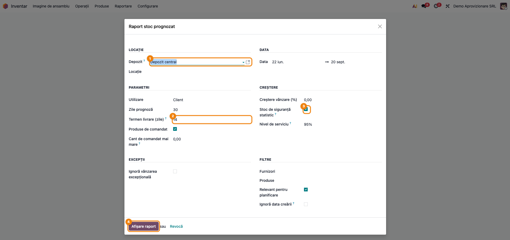
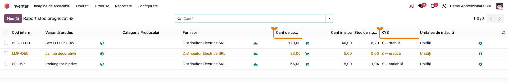
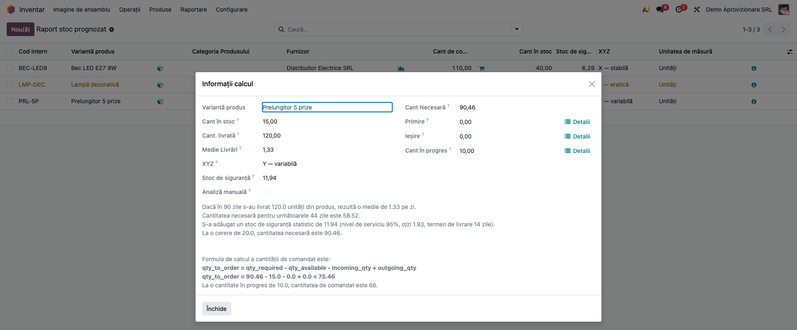
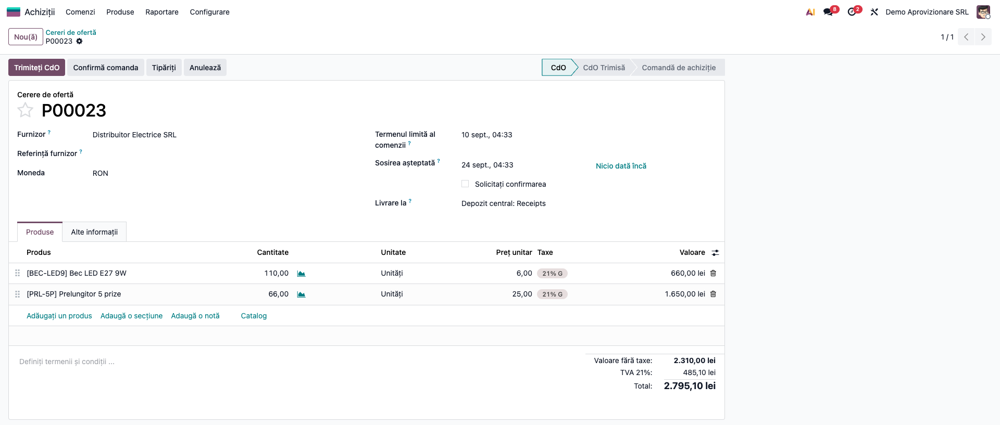
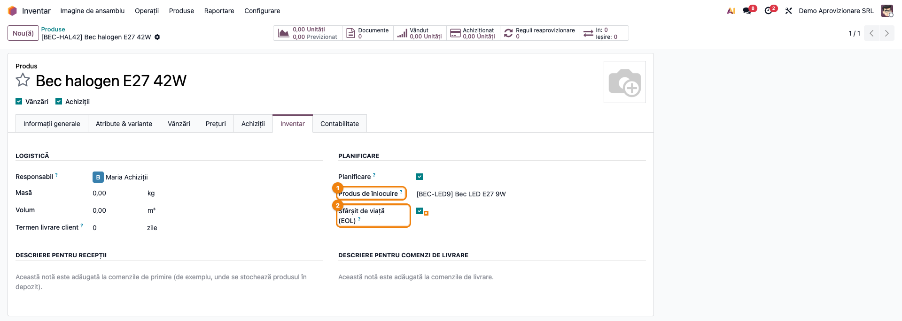
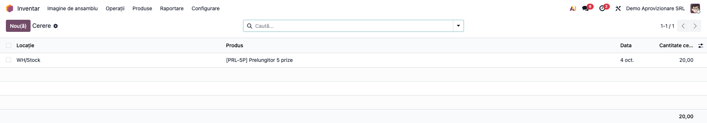
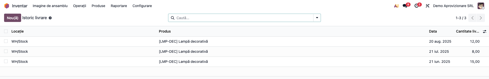
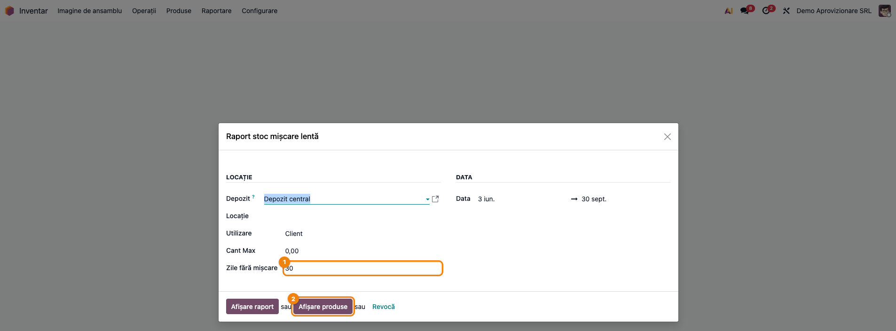
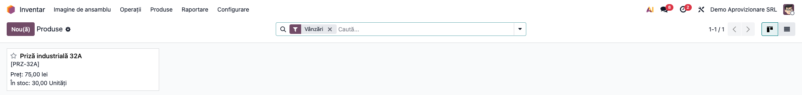

# Fișă Modul: NAP — necesar de aprovizionare (ce și cât să comandăm)

**Modul:** `deltatech_nap`
**Utilizator principal:** Responsabil achiziții / aprovizionare, manager de stoc
**Prioritate:** 🟡 Medie (nu generează note contabile, dar decide cât capital intră în stoc)

---

## 1. Scop business

Cumpărătorul are de răspuns în fiecare săptămână la aceeași întrebare: **ce trebuie comandat și cât?**
O regulă fixă de reaprovizionare (min/max) nu face diferența între un produs care se vinde constant și
unul care se vinde imprevizibil. Rezultatul e fie stoc blocat pe raft, fie lipsă de marfă.

NAP (Necesar de Aprovizionare) transformă istoricul de vânzări într-o listă de comandă pe care
cumpărătorul o poate apăra. Pentru fiecare produs, raportul:
- calculează consumul mediu zilnic din perioada analizată;
- îl proiectează pe orizontul de prognoză plus termenul de livrare;
- scade stocul, intrările așteptate și cantitățile deja comandate;
- adaugă un stoc de siguranță, fie procentual, fie statistic, pe baza variabilității cererii
  fiecărui produs;
- rotunjește cantitatea la minimul furnizorului și la multiplul de ambalare.

Din listă, un clic generează cererile de ofertă, grupate pe furnizor. Fiecare linie are explicația
pas cu pas a calculului, ca cumpărătorul să aibă încredere în cifră în loc să o suprascrie.

Modulul mai adaugă:
- clasificarea XYZ a cererii (stabilă, variabilă, eratică);
- produse de înlocuire, care preiau istoricul unui produs scos din fabricație;
- marcajul de sfârșit de viață (EOL), cu arhivare automată la stoc zero;
- un raport de stocuri cu mișcare lentă — cealaltă față a raftului.

## 2. Bază legală și context

Nu există o bază legală specifică. Aprovizionarea e o decizie de gestiune internă, iar NAP nu
emite documente fiscale. Rezultatul lui este o **cerere de ofertă în ciornă**, care intră apoi în
fluxul standard de achiziții (confirmare, recepție, factură furnizor).

Contextul operațional:
- metoda de calcul se inspiră din modelul SAP de planificare pe consum;
- stocul de siguranță statistic folosește formula clasică `SS = Z × σ_zilnic × √termen_livrare`,
  unde Z vine din nivelul de serviciu ales (90 % → 1,28; 95 % → 1,65; 97,5 % → 1,96; 99 % → 2,33).

## 3. Utilizatori și roluri

| Rol | Ce face | Drept Odoo |
|---|---|---|
| Responsabil achiziții | rulează raportul, analizează liniile, lansează reaprovizionarea | **Inventar / Administrator** (meniul *Raportare* din Inventar e vizibil doar administratorilor de stoc) + **Achiziții / Utilizator** |
| Manager de stoc | marchează produsele EOL, produsele de înlocuire, relevanța pentru planificare; rulează raportul de mișcare lentă | **Inventar / Administrator** |
| Agent de vânzări | introduce cererea estimată (comenzi anunțate, proiecte) | **Vânzări / Utilizator** |

Modelele raportului și ale cererii sunt deschise tuturor utilizatorilor interni. Accesul practic
e dat de meniuri: *Inventar → Raportare* și *Inventar → Configurare* apar doar pentru administratorii
de stoc.

Roluri recomandate la testare: un utilizator cu **Inventar / Administrator** și **Achiziții /
Utilizator** pentru fluxul complet; un utilizator doar cu **Inventar / Utilizator**, ca să verificați
că nu vede meniul *Raportare*.

## 4. Conturi și date implicate

Modulul **nu generează note contabile** și nu atinge conturi. Datele implicate sunt:

| Date | Unde | Rol în calcul |
|---|---|---|
| Mișcări de stoc efectuate spre clienți (sau spre producție) | Inventar | consumul istoric; retururile de la clienți se scad (la *Producție*, și intrările din producție în stoc) |
| Istoric livrare | *Inventar → Configurare → Gestiunea depozitului → Istoric livrare* | consum preluat dintr-un sistem vechi |
| Cerere | *Vânzări → Comenzi → Cerere* | cerere viitoare anunțată, adunată la necesar |
| Furnizor pe produs | tab-ul *Achiziții* al produsului | furnizorul liniei, prețul, **cantitatea minimă** și **termenul de livrare** |
| Ambalaje (unități de măsură suplimentare) | tab-ul *Vânzări* / *Inventar* al produsului | multiplul la care se rotunjește cantitatea |
| Cereri de ofertă în ciornă / trimise / de aprobat | Achiziții | cantitatea „în progres", scăzută din necesar |
| Rută *Cumpără* pe produs sau pe depozit | Inventar | reaprovizionarea creează cererea de ofertă prin ea |

Date minime pentru demo (folosite și în capturi):
- Companie **Demo Aprovizionare SRL**, plan de conturi RO, RON, depozitul **Depozit central (WH)**
  cu *Cumpără* activ.
- Furnizor **Distribuitor Electrice SRL**, termen de livrare 14 zile pe toate produsele.
- 13 săptămâni calendaristice întregi de vânzări (luni–duminică, până duminica trecută), analizate
  pe 90 de zile:
  - **Bec LED E27 9W**: ~20 buc/săptămână, stoc 40, minim de comandă 50, ambalaj „Bax 10 buc";
  - **Bec halogen E27 42W**: scos din fabricație (EOL), cu produs de înlocuire Bec LED; vânzările
    lui (20 buc) se adună la Bec LED;
  - **Prelungitor 5 prize**: cerere variabilă, stoc 15, o cerere de ofertă deschisă de 10 buc și o
    cerere anunțată de 20 buc peste 10 zile;
  - **Lampă decorativă**: cerere eratică (30, 2 și 25 buc în trei săptămâni din 13), stoc 5;
  - **Priză industrială 32A**: stoc 30, fără nicio vânzare în perioadă.

## 5. Configurare inițială

1. Instalați `deltatech_nap` (dependențe: `purchase`, `purchase_stock`, `stock`, `sale`, `product`).
2. **Furnizori pe produse** — în tab-ul *Achiziții* al fiecărui produs completați furnizorul, prețul,
   **cantitatea minimă** și **termenul de livrare** (zile). Fără furnizor, linia nu are furnizor, iar
   reaprovizionarea nu poate crea cererea de ofertă.
3. **Rută de cumpărare** — pe depozit bifați *Cumpără* (sau puneți ruta *Cumpără* pe produse).
4. **Ambalaje** (opțional) — pe produs, adăugați ambalajul (de exemplu „Bax 10 buc") ca unitate de
   măsură suplimentară. Cantitatea propusă se rotunjește în sus la cel mai mic ambalaj.
5. **Planificare pe produs** — în tab-ul *Inventar*, grupul **Planificare**:
   - **Planificare** — debifați produsele care nu trebuie propuse la comandă;
   - **Produs de înlocuire** — produsul care preia istoricul;
   - **Sfârșit de viață (EOL)** — produsul iese din raport și se arhivează automat când stocul ajunge
     la zero (acțiunea planificată *Arhivare produs la EOL și stoc zero*, zilnic).
6. **Valori implicite** (opțional), în *Setări → Tehnic → Parametri sistem*:

   | Parametru | Efect | Implicit |
   |---|---|---|
   | `deltatech_nap.use_statistical_safety_stock` | bifa **Stoc de siguranță statistic** precompletată | `False` |
   | `deltatech_nap.service_level` | nivelul de serviciu precompletat (`90` / `95` / `97` / `99`) | `95` |
   | `deltatech_nap.xyz_cv_x`, `deltatech_nap.xyz_cv_y` | pragurile coeficientului de variație pentru clasele X/Y/Z | `0.5`, `1.0` |
   | `deltatech_nap.include_min_reordering_rules` | respectă și minimul din regulile de reaprovizionare ale locației | `False` |

## 6. Flux de utilizare

### Pasul 1 — Opțiunile raportului

Accesați **Inventar → Raportare → Raport stoc prognozat**. Se deschide asistentul de opțiuni:

- **Locație** — **Depozit** (obligatoriu în practică) și, opțional, o **Locație** anume din el.
- **Data** — perioada istorică din care se calculează consumul mediu. **Atenție:** implicit,
  perioada e din prima zi a lunii curente minus 90 de zile **până la sfârșitul lunii curente**, deci
  include și zilele care nu au trecut încă. Consumul mediu iese astfel subestimat. Alegeți o perioadă
  din **săptămâni calendaristice întregi**, de luni până duminica trecută. Variabilitatea cererii se
  calculează pe săptămâni luni–duminică. O săptămână tăiată la capăt contează ca săptămână întreagă,
  dar doar cu cererea din zilele incluse, deci crește artificial variabilitatea. Pe demo perioada are
  13 săptămâni, iar raportul împarte consumul la 90 de zile (diferența dintre cele două date).
- **Parametri**:
  - **Utilizare** — *Client* (vânzări) sau *Producție* (consum pentru fabricație);
  - **Zile prognoză** — pentru câte zile comandați (demo: 30);
  - **Termen livrare (zile)** — adăugat la orizont (demo: 14, deci necesarul se calculează pe 44 de
    zile);
  - **Produse de comandat** + **Cant de comandat mai mare** — păstrează doar liniile cu cantitate de
    comandat peste prag.
- **Creștere**:
  - **Creștere vânzare (%)** — majorează cererea estimată;
  - **Stoc de siguranță statistic** + **Nivel de serviciu** (demo: bifat, 95 %); când nu e bifat, se
    folosește **Creștere stoc de siguranță** (procent fix).
- **Excepții** — **Ignoră vânzarea excepțională**: mișcările de cel puțin **Ignoră vânzarea după
  cantitate** nu intră în consum (o comandă mare, unică).
- **Filtre** — **Furnizori** și **Produse** restrâng analiza. **Relevant pentru planificare** scoate
  produsele debifate la *Planificare*. **Ignoră data creării** folosește toată perioada și pentru
  produsele create în interiorul ei.

Apăsați **Afișare raport**.



### Pasul 2 — Citirea listei de necesar

Lista are câte un rând pe produs, cu furnizorul, **Cant de comandat**, **Cant în stoc**, **Stoc de
siguranță** și clasa **XYZ**. Cu **Stoc de siguranță statistic** bifat, rândurile de clasa Z (cerere
eratică) sunt colorate în galben, pentru analiză manuală; cu metoda procentuală nu sunt colorate.
Clasa se stabilește din coeficientul de variație al cererii săptămânale, CV = σ săptămânal / medie
săptămânală: X sub 0,5, Y până la 1,0, Z peste 1,0 (pragurile se pot schimba din parametri). Alte coloane (medie livrări, necesar, primiri, ieșiri, cantitate în progres) se
activează din selectorul de coloane (⇄).

1. **Găsiți pe ecran** — pe fiecare rând, coloana **Cant de comandat** e propunerea, iar **XYZ**
   spune cât de mult vă puteți baza pe ea.
2. **Verificați** — pe demo:
   - **Bec LED E27 9W**: 110 buc, clasa X — stabilă. Cantitatea e ≥ minimul de 50 și multiplu de
     bax (10). Consumul include cele 20 buc vândute ca bec halogen, produsul înlocuit.
   - **Prelungitor 5 prize**: 66 buc, clasa Y — variabilă. Cererea de ofertă deschisă (10 buc) e
     deja scăzută.
   - **Lampă decorativă**: 23 buc, clasa Z — eratică, rând galben, stoc de siguranță 0. Aici
     propunerea e doar aritmetică, iar decizia e a cumpărătorului.
   - **Bec halogen** nu apare (EOL), iar **Priză industrială** nu apare (fără consum, nimic de
     comandat).
3. **Treceți mai departe** — deschideți explicația liniilor cu cifre surprinzătoare (pasul 3), apoi
   reaprovizionați (pasul 4).

Butonul **Nou(ă)** al listei adaugă o linie goală, fără calcul; nu îl folosiți. Coloana **Cant de
comandat** e editabilă: cumpărătorul poate corecta propunerea înainte de
reaprovizionare. Pe fiecare rând sunt și scurtături:
- ▦ — prognoza standard Odoo a produsului;
- 🛒 — reaprovizionarea doar pentru acel rând;
- ⓘ — explicația calculului.



### Pasul 3 — Explicația calculului

Apăsați ⓘ pe rândul **Prelungitor 5 prize**. Dialogul **Informații calcul** arată valorile folosite
și pașii, în ordinea din calcul:

1. consumul: 120 buc în 90 de zile, adică 1,33 pe zi;
2. necesarul pe 44 de zile (30 prognoză + 14 termen): 58,52;
3. stocul de siguranță statistic: 11,94 (95 %, σ/zi 1,93, termen 14 zile);
4. cererea anunțată de 20 buc: necesar 90,46;
5. formula `qty_to_order = qty_required − qty_available − incoming_qty + outgoing_qty`, adică
   necesar − stoc − primiri + ieșiri: `90,46 − 15 − 0 + 0 = 75,46`;
6. ultimul rând: „La o cantitate în progres de 10.0, cantitatea de comandat este 66.” Calculul din
   spate, neafișat: 75,46 − 10 = 65,46, rotunjit în sus la **66**.

Butoanele **Detalii** de lângă *Primire*, *Ieșire* și *Cant în progres* deschid mișcările de stoc,
respectiv liniile de achiziție din spatele cifrei. Fără o **Locație** aleasă în raport, listele de
*Primire* și *Ieșire* cuprind toate depozitele, deși cifra din raport e doar pe depozitul ales.



### Pasul 4 — Reaprovizionarea: cererea de ofertă

Selectați rândurile de comandat și apăsați **Reaprovizionare** (în antetul listei, după selecție),
sau 🛒 pe un singur rând. **Deselectați întâi rândurile de clasa Z** pe care nu le-ați analizat:
reaprovizionarea comandă tot ce e selectat.

Odoo rulează aprovizionarea standard (ruta *Cumpără*). Liniile aceluiași furnizor ajung pe **o
singură cerere de ofertă** în ciornă, cu originea „NAP". Pe demo, fără lampă: o cerere de ofertă
către Distribuitor Electrice SRL, cu 110 × Bec LED și 66 × Prelungitor.

Consolidarea e cea standard din Odoo și depinde de câmpul **Grupare RFQ** al furnizorului (implicit
*La comandă*), de cumpărătorul furnizorului și de monedă. Liniile pot ajunge și pe o cerere de ofertă
ciornă deja existentă, dacă aceasta se potrivește acelorași criterii.

NAP cere marfa pentru **azi**, deci pe cererea generată **Sosirea așteptată** e azi, iar
**Termenul limită al comenzii** e în trecut (azi minus termenul furnizorului). Corectați data
sosirii înainte de trimitere. După reaprovizionare, liniile
se recalculează, iar cantitatea comandată apare ca „în progres".

Deschideți cererea din **Achiziții → Comenzi → Cereri de ofertă**, verificați-o și trimiteți-o
furnizorului.



### Pasul 5 — Produse de înlocuire și sfârșit de viață

Pe produsul scos din fabricație (**Inventar → Produse → Produse**, tab-ul *Inventar*, grupul
**Planificare**):
- completați **Produs de înlocuire** — istoricul lui de vânzări se adună la produsul nou, ca
  necesarul acestuia să nu pornească de la zero;
- bifați **Sfârșit de viață (EOL)** — produsul iese din raport, iar acțiunea planificată zilnică îl
  arhivează când stocul ajunge la zero (cu mesaj în istoricul produsului).

La produsele cu variante, *Planificare* și *Produs de înlocuire* se completează pe fișa fiecărei
variante (înaintea prețului); pe șablon sunt ascunse. **EOL** rămâne pe șablon, deci se aplică
tuturor variantelor. Înlocuirea merge pe un singur nivel: un produs A înlocuit de B, înlocuit la
rândul lui de C, nu își trece istoricul până la C.



### Pasul 6 — Cerere anunțată

Accesați **Vânzări → Comenzi → Cerere** și adăugați cererile știute dinainte (o comandă anunțată,
un proiect). Pentru fiecare cerere completați produsul, locația, data și cantitatea, plus
opțional clientul și agentul de vânzări. **Locația** trebuie să fie locația de stoc a depozitului
analizat (de exemplu WH/Stock), nu locația clientului; altfel cererea e ignorată fără niciun mesaj.
Raportul adună la necesar cererile cu data între azi și azi + *Zile prognoză* (fără termenul de
livrare):
- dacă cererea e **mai mare** decât ieșirile deja programate, se adaugă doar diferența;
- dacă e **mai mică sau egală**, se adaugă **toată**, deși ieșirile programate sunt deja adunate
  în formulă. Cererea e numărată atunci de două ori (vezi limitările).

Pe demo, 20 buc Prelungitor peste 10 zile — vezi pasul 4 din explicația calculului.

> **Atenție:** cererile se păstrează doar temporar (vezi limitările). Introduceți-le chiar înainte de
> rularea raportului.



### Pasul 7 — Istoric de livrări din sistemul vechi

La trecerea de pe alt sistem, istoricul de vânzări nu există în Odoo. **Inventar → Configurare →
Gestiunea depozitului → Istoric livrare** primește livrările vechi (produs, locație, dată,
cantitate), de obicei prin import. Raportul le adună la mișcările reale din perioada analizată. Ca și
la cerere, **Locația** trebuie să fie o locație internă a depozitului analizat.

Pe demo, istoricul lămpii e mai vechi decât perioada analizată, deci nu intră în calcul.

> **Atenție:** și istoricul se păstrează doar temporar (vezi limitările).



### Pasul 8 — Stocuri cu mișcare lentă

Accesați **Inventar → Raportare → Raport stoc mișcare lentă**:
- alegeți **Depozitul** — fără depozit raportul include și cantitățile din locațiile de clienți și
  furnizori (vezi limitările);
- perioada;
- **Cant Max** — produsele cu consum de cel mult această cantitate sunt considerate fără mișcare;
- **Zile fără mișcare** — produsele create sau recepționate în ultimele N zile nu sunt raportate,
  ca marfa proaspăt intrată să nu apară drept stoc mort.

Apăsați **Afișare produse**.



### Pasul 9 — Lista produselor fără mișcare

Lista conține produsele cu stoc pozitiv și fără consum în perioadă. Pe demo apare doar **Priză
industrială 32A** (30 buc, nicio vânzare în perioada analizată).

Lista se deschide cu filtrul **Vânzări** pus implicit, deci produsele care nu se vând (materii prime,
mai ales la *Utilizare = Producție*) sunt ascunse. Scoateți filtrul ca să vedeți toată lista. Produsele de aici sunt candidate la
promoții, retur la furnizor sau depreciere. Verificați însă fals-pozitivele din limitări (produse
EOL, nerelevante pentru planificare sau înlocuite). Decizia contabilă se ia separat, nu în acest
modul.

Folosiți **Afișare produse**, nu **Afișare raport**: al doilea deschide lista **tuturor** stocurilor,
nu doar a celor fără mișcare (vezi limitările).



### Note de monografie și raportare

NAP **nu generează note contabile**. Singurul document creat este cererea de ofertă în ciornă (pasul
4). Contabilitatea apare abia în fluxul standard: recepția (cu notă contabilă doar dacă categoria
produsului are evaluare automată) și factura furnizorului.

Raportul de mișcare lentă poate fundamenta o **ajustare pentru deprecierea stocurilor**. Nota se
înregistrează însă separat, de contabil, nu din acest modul. Conform OMFP 1802/2014:
- constituirea ajustării: **Dr 6814 = Cr 39x**;
- reluarea ei: **Dr 39x = Cr 7814**.

## 7. Legături cu alte module / declarații

| Modul / proces | Rol în flux | Tip legătură |
|---|---|---|
| `stock` | mișcările efectuate (consum), stocul, locațiile | dependență (manifest) |
| `purchase`, `purchase_stock` | furnizorii pe produs, cererile de ofertă, cantitatea în progres, ruta *Cumpără* | dependență (manifest) |
| `sale` | meniul *Cerere*, agent și echipă de vânzări pe cerere | dependență (manifest) |
| `deltatech_nap_website` | adaugă în raport categoria publică eCommerce a produselor | complementar |
| Reguli de reaprovizionare (min/max) | respectate opțional, prin `deltatech_nap.include_min_reordering_rules` | proces |

**Ce e automat:**
- calculul consumului, al necesarului și al stocului de siguranță;
- clasificarea XYZ;
- scăderea stocului, a intrărilor și a cantităților în progres;
- rotunjirea la minimul furnizorului și la ambalaj;
- consolidarea pe furnizor la reaprovizionare;
- arhivarea produselor EOL la stoc zero.

**Ce rămâne manual:**
- alegerea perioadei și a orizontului;
- decizia pe liniile de clasa Z;
- corecturile cumpărătorului;
- trimiterea cererii de ofertă către furnizor;
- întreținerea furnizorilor, a termenelor și a minimelor pe produse.

## 8. Verificări pentru consultant

- [ ] Meniul **Raport stoc prognozat** apare în *Inventar → Raportare* pentru un administrator de
      stoc, și nu apare pentru un simplu utilizator de stoc.
- [ ] Perioada e din săptămâni întregi (luni până duminica trecută), nu cea implicită (până la
      sfârșitul lunii).
- [ ] Pe demo, liniile sunt Bec LED 110 (X), Prelungitor 66 (Y), Lampă 23 (Z, rând galben). Becul
      halogen și priza nu apar.
- [ ] Explicația de la Prelungitor dă exact pașii din pasul 3, cu rezultatul 66.
- [ ] Cantitatea de la Bec LED respectă minimul furnizorului (50) și baxul (10).
- [ ] Vânzările becului halogen (produsul înlocuit) sunt incluse în consumul becului LED
      (280 buc livrate = 260 LED + 20 halogen).
- [ ] Cu **Stoc de siguranță statistic** debifat și **Creștere stoc de siguranță** = 10 %, necesarul
      crește cu 10 %, iar coloana *Stoc de siguranță* rămâne 0.
- [ ] O cerere de ofertă deschisă pentru un produs scade din cantitatea lui de comandat.
- [ ] **Reaprovizionare** pe mai multe rânduri ale aceluiași furnizor creează **o singură** cerere de
      ofertă (cu *Grupare RFQ* = *La comandă* pe furnizor).
- [ ] Un produs fără furnizor pe fișă nu poate fi reaprovizionat: apare mesajul „Nu există niciun
      furnizor pentru a genera comanda de achiziție…".
- [ ] **Raport stoc mișcare lentă** cu depozit ales și **Afișare produse** listează doar Priză
      industrială 32A.
- [ ] O cerere anunțată mai mică decât ieșirile programate ale produsului crește cantitatea de
      comandat cu **toată** cererea (dubla numărare din limitări). Corectați manual.
- [ ] Un produs EOL cu stoc zero e arhivat la următoarea rulare a acțiunii planificate.

## 9. Mesaje de eroare frecvente

| Mesaj / simptom | Cauză probabilă | Remediere |
|---|---|---|
| „Nici un rezultat" (*No results*) | Niciun produs cu cantitate de comandat peste prag, sau niciun consum în perioadă | Verificați perioada și depozitul; debifați **Produse de comandat** pentru a vedea toate liniile |
| „Nu s-au găsit produse de la furnizorii specificați" | Furnizorii din filtru nu apar pe nicio fișă de produs | Completați furnizorul în tab-ul *Achiziții* al produselor |
| „Nu există niciun furnizor pentru a genera comanda de achiziție pentru produsului …" (*There is no matching vendor price…*) la **Reaprovizionare** | Produsul nu are un furnizor valid pe fișă: lipsește furnizorul, minimul nu e atins (de exemplu după o corectură manuală sub minim) sau datele de valabilitate au expirat | Completați furnizorul în tab-ul *Achiziții* al produsului; nu coborâți manual cantitatea sub minimul furnizorului |
| Consumul mediu pare prea mic | Perioada implicită se termină la sfârșitul lunii curente și include zile viitoare | Alegeți o perioadă din săptămâni întregi, terminată duminica trecută |
| Produs nou cu consum mediu umflat | Pentru produsele create în perioadă, raportul împarte doar la zilele de la creare | Comportament voit; bifați **Ignoră data creării** pentru a împărți la toată perioada |
| Cererile / istoricul introduse ieri au dispărut | Sunt păstrate doar temporar (vezi limitările) | Reintroduceți-le sau reimportați-le înainte de rulare |
| Raportul de mișcare lentă arată toate produsele | S-a apăsat **Afișare raport** | Folosiți **Afișare produse** |

## 10. Capturi de ecran

Capturile (`readme/screenshots/`) se generează automat din `tests/test_screenshots.py`, cu mixinul
`ScreenshotCase` din `l10n_ro_doc_screenshots` (import defensiv). Sunt în **limba română**, pe
compania **Demo Aprovizionare SRL**, cu planul de conturi RO și datele demo din secțiunea 4. Datele
sunt relative la ziua generării: perioada analizată e mereu formată din cele 13 săptămâni întregi
terminate duminica trecută, deci cantitățile rămân aceleași, doar datele calendaristice diferă.
Asistentul de mișcare lentă (captura 08) rămâne pe perioada lui implicită.

| # | Fișier | Conținut |
|---|---|---|
| 1 | `01_optiuni_raport.png` | Asistentul **Raport stoc prognozat**, cu depozit, termen de livrare și stoc de siguranță statistic |
| 2 | `02_raport_necesar.png` | Lista de necesar: Bec LED 110 (X), Prelungitor 66 (Y), Lampă 23 (Z, galben) |
| 3 | `03_explicatie_calcul.png` | Dialogul **Informații calcul** pentru Prelungitor 5 prize |
| 4 | `04_cerere_oferta.png` | Cererea de ofertă generată, consolidată pe furnizor |
| 5 | `05_produs_planificare.png` | Becul halogen: **Produs de înlocuire** și **Sfârșit de viață (EOL)** |
| 6 | `06_cerere_manuala.png` | Lista **Cerere** (cerere anunțată) |
| 7 | `07_istoric_livrari.png` | Lista **Istoric livrare** |
| 8 | `08_optiuni_miscare_lenta.png` | Asistentul **Raport stoc mișcare lentă** |
| 9 | `09_stoc_miscare_lenta.png` | Produsele cu stoc și fără mișcare |

Regenerare:

```bash
./odoo/odoo-bin -c odoo.conf -d <db> -i deltatech_nap,l10n_ro,l10n_ro_doc_screenshots \
    --test-tags=fise_screenshots --stop-after-init --http-port=8987 --gevent-port=8988
```

## 11. Observații pentru manual

Păstrați ordinea de lucru:
1. furnizori, termene și minime pe produse;
2. perioadă corectă, din săptămâni întregi terminate duminica trecută;
3. raport;
4. citirea clasei XYZ;
5. explicația pe liniile surprinzătoare;
6. decizia manuală pe clasa Z;
7. reaprovizionare;
8. verificarea și trimiterea cererii de ofertă.

Subliniați că stocul de siguranță statistic are sens doar pe cererea previzibilă (X, Y), iar pe
clasa Z cifra e intenționat lăsată cumpărătorului.

### Limitări cunoscute

- **Cererile (*Cerere*), istoricul de livrări (*Istoric livrare*) și liniile raportului sunt păstrate
  doar temporar.** Sunt modele tranzitorii: după o oră de la ultima modificare devin eligibile pentru
  ștergere, iar acțiunea zilnică de curățenie (*Base: Auto-vacuum*) le șterge. Pot dispărea deci
  oricând între o oră și aproximativ o zi, inclusiv corecturile manuale ale cumpărătorului pe
  liniile raportului. Introduceți-le sau importați-le imediat înainte de rularea raportului și
  reaprovizionați în aceeași sesiune. Nu le folosiți ca evidență permanentă.
- **Perioada implicită include zile viitoare** (până la sfârșitul lunii curente), deci subestimează
  consumul mediu. Variabilitatea (σ) se calculează pe săptămâni calendaristice, luni–duminică, iar
  săptămânile viitoare contează cu cerere zero, iar cele tăiate la capetele perioadei doar cu
  cererea din zilele incluse. Ambele cresc stocul de siguranță. Alegeți o perioadă din săptămâni întregi, terminată duminica trecută.
- **Cererea anunțată mai mică sau egală cu ieșirile programate e numărată de două ori:** se adaugă
  integral la necesar, deși formula adună deja ieșirile. Corectați manual cantitatea pe linie.
- **Termenul de livrare:** orizontul necesarului folosește doar câmpul **Termen livrare (zile)**
  din raport. Stocul de siguranță statistic folosește acest câmp sau, dacă e 0, termenul furnizorului
  de pe produs. Cu câmpul pe 0, necesarul nu acoperă termenul furnizorului.
- **Reaprovizionarea comandă tot ce e selectat**, inclusiv rândurile de clasa Z marcate pentru
  analiză manuală.
- **Raportul de mișcare lentă:**
  - **Afișare raport** deschide lista tuturor stocurilor, nefiltrată pe rezultatul calculului.
    Folosiți **Afișare produse**.
  - Fără depozit ales, filtrul pe stocuri nu se restrânge la locațiile interne, deci pot apărea
    produse doar din cauza cantităților din locațiile de clienți sau furnizori (de exemplu un produs
    înlocuit, vândut integral).
  - **Fals-pozitive:** produsele EOL, cele debifate la *Planificare* și produsele înlocuite apar în
    listă chiar dacă s-au vândut. Calculul intern le scoate din consum, deci le vede fără mișcare.
  - **Afișare produse** deschide lista cu filtrul *Vânzări* pus implicit, care ascunde produsele
    care nu se vând.
- **Explicația calculului** se scrie în limba utilizatorului care rulează raportul. Valorile din ea
  folosesc punctul zecimal (58.52), nu virgula, iar formula folosește numele tehnice ale câmpurilor
  (`qty_required`, `qty_available`, `incoming_qty`, `outgoing_qty`), explicate la pasul 3.
- **Cererea de ofertă generată** are sosirea așteptată azi, deci termenul limită al comenzii e în
  trecut (pasul 4).
