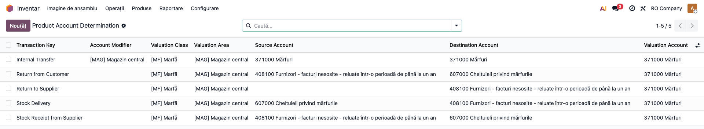
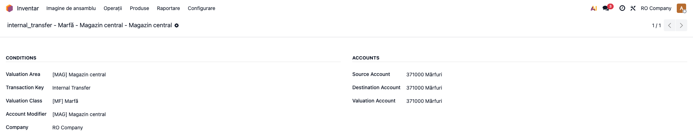
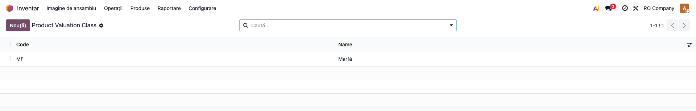
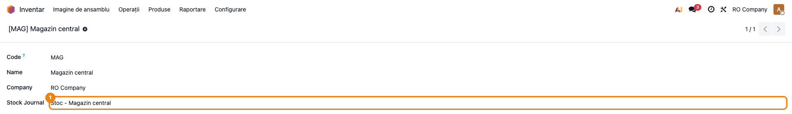
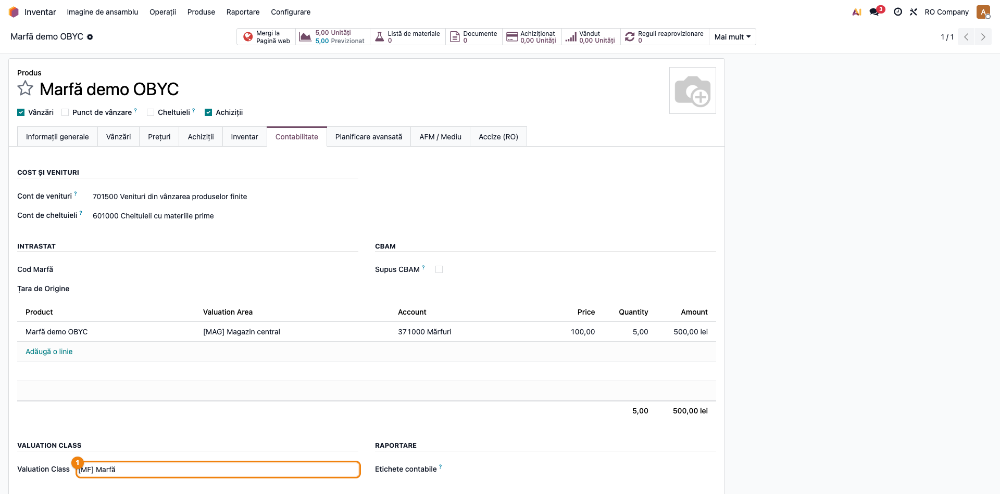
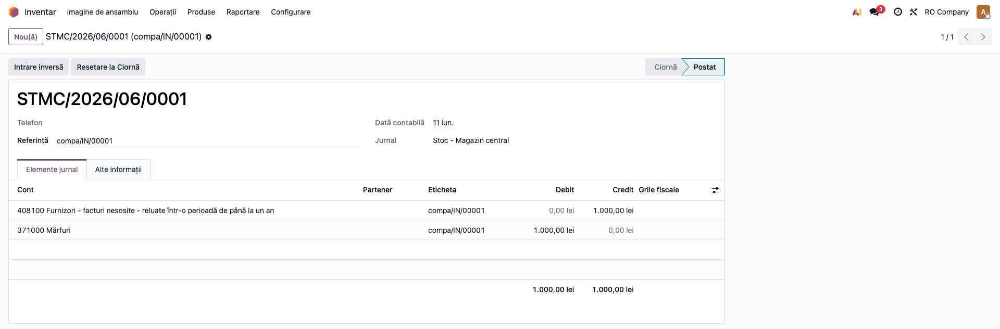
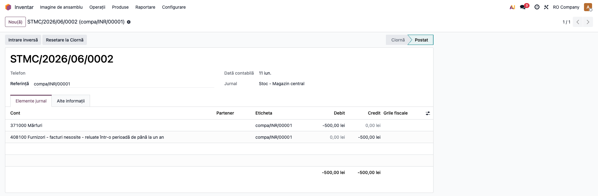

# Fișă Modul: OBYC / Account Determination

**Modul:** `deltatech_obyc`  
**Rol principal:** determinarea automată a conturilor de stoc pe baza unei matrice de reguli  
**Utilizatori principali:** contabil, consultant implementare, administrator Odoo

---

## 1. Scop

Modulul aduce în Odoo un mecanism de tip **OBYC**: conturile nu mai sunt luate
doar din categoria de produs, ci dintr-o regulă determinată de combinația:

- cheie de tranzacție;
- clasă de evaluare;
- arie de evaluare;
- account modifier;
- companie.

Practic, modulul permite o mapare contabilă mai fină pentru recepții, livrări,
retururi, transferuri interne, inventar, producție și landed cost.

## 2. Date de bază

### 2.1 Evaluation Class

Meniu: `Inventar → Configurare → Account Determination Config → Evaluation Class`

Modelul `product.valuation.class` are:

- `Code`
- `Name`

Se afișează în formatul **`[CODE] Name`**.

### 2.2 Account Modifiers

Meniu: `Inventar → Configurare → Account Determination Config → Account Modifiers`

Modelul `account.modifier` are:

- `Code`
- `Name`

Și el se afișează în formatul **`[CODE] Name`**.

### 2.3 Product Account Determination

Meniu: `Inventar → Configurare → Account Determination Config → Product Account Determination`

Regula conține:

| Câmp | Rol |
|---|---|
| `Transaction Key` | tipul operațiunii |
| `Account Modifier` | diferențiere suplimentară |
| `Valuation Class` | clasa produsului |
| `Valuation Area` | aria de evaluare |
| `Company` | compania |
| `Source Account` | contul de sursă |
| `Destination Account` | contul de destinație |
| `Valuation Account` | contul de evaluare |

## 3. Unde se configurează pe documente și produse

- pe produs (`product.template`) se completează **Valuation Class**;
- pe tipul de operațiune stoc (`stock.picking.type`) se poate completa
  **Account Modifier**;
- pe jurnal (`account.journal`) există de asemenea **Account Modifier**;
- aria de evaluare vine din `deltatech_valuation_area`;
- pe aria de evaluare (`valuation.area`) se poate completa câmpul
  **Stock Journal** — dacă este setat, notele contabile OBYC ale mișcărilor
  din acea arie se postează pe acest jurnal, nu pe jurnalul de stoc al
  companiei (vezi secțiunea 7);
- pe companie, bifa **Storno accounting** (Setări → Contabilitate) activează
  înregistrarea în roșu a retururilor (vezi secțiunea 7).

## 4. Chei de tranzacție folosite acum

Din codul actual, cele mai importante chei sunt:

- `stock_receipt`
- `return_to_supplier`
- `stock_delivery`
- `return_from_customer`
- `dropship`
- `dropship_return`
- `internal_transfer`
- `internal_transfer_out`
- `internal_transfer_in`
- `inventory_adjustment_plus`
- `inventory_adjustment_minus`
- `production_issue`
- `production_receipt`
- `price_difference`
- `landed_cost`
- `stock_income`

## 5. Cum decide regula

### 5.1 Pe mișcările de stoc

`stock.move` calculează `transaction_key` din combinația `usage` sursă/destinație.

Exemple din cod:

| Sursă | Destinație | Transaction Key |
|---|---|---|
| supplier | internal | `stock_receipt` |
| internal | customer | `stock_delivery` |
| customer | internal | `return_from_customer` |
| internal | supplier | `return_to_supplier` |
| internal | internal | `internal_transfer` |
| internal | transit | `internal_transfer_out` |
| transit | internal | `internal_transfer_in` |

Dacă nu poate determina cheia, modulul ridică eroare:

> `Transaction key could not be determined for the move from ... to ...`

### 5.2 Pe facturi

`account.move.line` suprascrie calculul contului pentru liniile de produs:

- document de vânzare → `stock_income`
- document de cumpărare → `stock_receipt`

Linia primește și `valuation_area_id`.

### 5.3 Dacă regula lipsește

În loc de eroare simplă, modulul ridică **RedirectWarning** spre configurarea
regulilor, cu precompletarea contextului. Mesajul începe cu:

> `No account determination rule found for transaction key '...'`

## 6. Flux recomandat de implementare

### Pasul 1 — creați ariile de evaluare

Fără `valuation.area`, regulile nu pot fi selectate corect. Dacă doriți ca
notele de stoc ale unei arii să meargă pe un jurnal dedicat, completați pe
arie câmpul **Stock Journal**.

### Pasul 2 — definiți clasele de evaluare

Faceți o clasificare contabilă a produselor: marfă, materie primă, produs finit,
ambalaj etc.

### Pasul 3 — atașați clasa pe produse

Completați **Valuation Class** pe șablonul produsului.

### Pasul 4 — definiți modificatorii contabili

Folosiți `Account Modifier` dacă aveți fluxuri care trebuie separate prin tip de
operațiune, jurnal sau scenariu.

### Pasul 5 — creați matricea de reguli

Pentru fiecare combinație importantă configurați:

- cheie tranzacție;
- clasă;
- arie;
- modifier;
- conturile sursă / destinație / evaluare.

### Pasul 6 — testați pe documente reale

Verificați recepție, livrare, retur și o factură de vânzare/cumpărare cu produs
care are `valuation_class_id`. Dacă folosiți storno (Setări → Contabilitate →
**Storno accounting**), testați și un retur și confirmați că nota apare în
roșu (sume negative pe conturile tranzacției originale).

## 7. Comportament actual la note contabile de stoc

Pe `stock.move`, dacă produsul nu are `valuation_class_id`, modulul lasă fluxul
standard Odoo.

Dacă produsul are `valuation_class_id`, regula OBYC controlează nota:

- dacă toate cele trei conturi sunt goale, nu se mai creează NC;
- dacă există reguli, modulul decide contul de debit și credit din regula găsită;
- liniile generate păstrează și `product_id`, deci pot fi urmărite și în
  evaluarea pe arie;
- liniile poartă acum și **cantitate semnată** plus **unitatea de măsură**:
  cantitatea este pozitivă pe linia de debit și negativă pe linia de credit.
  Această convenție este necesară stratului de evaluare
  (`deltatech_stock_valuation`), care reconstruiește mișcările cantitativ-valorice
  direct din liniile notei contabile.

Pentru `landed_cost`, cheia folosită este explicit `landed_cost`.

### 7.1 Jurnalul notei: jurnalul ariei de evaluare

Dacă aria de evaluare a mișcării are completat câmpul **Stock Journal**, nota
contabilă generată pentru mișcările cu clasă de evaluare OBYC se postează pe
**jurnalul ariei**, nu pe jurnalul de stoc al companiei. Mișcările din arii
fără jurnal propriu (sau fără clasă de evaluare) rămân pe comportamentul
standard Odoo. Astfel, fiecare gestiune/arie își poate separa notele de stoc
pe jurnal propriu.

### 7.2 Storno la retururi (înregistrare în roșu)

Cu **Storno accounting** activ pe companie (Setări → Contabilitate),
retururile — mișcările care au la origine o mișcare returnată — nu mai
generează o notă „neagră" inversată, ci se înregistrează **în roșu (storno)**:
aceleași conturi ca tranzacția originală, cu **sume negative** pe debit și
credit. Cantitatea semnată de pe linii respectă aceeași convenție: se
inversează odată cu partea, astfel încât returul scade cantitativ exact ce a
adus tranzacția originală.

### 7.3 Note de monografie și raportare

Exemplu pe o recepție de marfă (cont de evaluare 371, cont sursă din regula
OBYC, valoare V):

| Operațiune | Debit | Credit |
|---|---|---|
| Recepție de la furnizor | 371 (V) | cont sursă (V) |
| Retur la furnizor **fără** storno | cont sursă (V) | 371 (V) |
| Retur la furnizor **cu** storno | 371 (−V) | cont sursă (−V) |

La returul cu storno, nota apare „în roșu": aceleași conturi ca recepția
(Dr 371 / Cr cont sursă), dar cu sumele negative — rulajele conturilor nu se
umflă artificial cu retururile.

## 8. Verificări utile pentru consultant

- [ ] produsul are `Valuation Class`
- [ ] compania are `Valuation Area`
- [ ] există regulă pentru fiecare tranzacție testată
- [ ] tipul de picking are `Account Modifier`, dacă scenariul îl cere
- [ ] la facturi, contul produsului este recalculat pe baza regulii
- [ ] la mutări de stoc, cheia de tranzacție corespunde fluxului real
- [ ] liniile notei generate au cantitate semnată (pozitivă pe debit, negativă
      pe credit) și unitate de măsură completată
- [ ] dacă aria de evaluare are **Stock Journal** setat, nota OBYC este
      postată pe jurnalul ariei, nu pe jurnalul de stoc al companiei
- [ ] cu **Storno accounting** activ pe companie, nota de retur are sume
      negative pe **aceleași conturi** ca recepția (Dr/Cr în roșu), nu o notă
      „neagră" inversată

## 9. Limitări cunoscute

- multe explicații din `DESCRIPTION.md` sunt mai largi decât codul efectiv; fișa
  de față descrie doar comportamentul implementat acum;
- logica e foarte dependentă de existența unei matrice complete de reguli;
- dacă produsul nu are `valuation_class_id`, se revine la comportamentul standard;
- unele suprascrieri istorice din `stock.move` sunt comentate, deci nu toate
  scenariile descrise teoretic sunt active în codul curent;
- modulul se bazează pe `deltatech_valuation_area` pentru selecția ariei.

## 10. Capturi de ecran

Capturile sunt generate automat în limba RO, pe planul de conturi RO, prin testul
`tests/test_screenshots.py` (tag `fise_screenshots`). Se regenerează cu:

```bash
./odoo/odoo-bin -c odoo.conf -d test19 -u deltatech_obyc \
    --test-tags=fise_screenshots --stop-after-init --http-port=8170
```

### 10.1 Matricea OBYC de determinare a conturilor

Lista regulilor `product.account.determination` — pentru fiecare combinație de cheie de
tranzacție, clasă de evaluare, arie și (opțional) account modifier, se stabilesc conturile
sursă / destinație / evaluare.



### 10.2 Formularul unei reguli OBYC

Condițiile regulii (arie, cheie, clasă, modifier, companie) și cele trei conturi.



### 10.3 Clasele de evaluare

Lista claselor de evaluare (`product.valuation.class`), afișate în formatul `[COD] Nume`.



### 10.4 Aria de evaluare cu jurnal de stoc dedicat

Aria de evaluare are completat câmpul **Stock Journal**: notele OBYC ale mișcărilor din
arie se postează pe acest jurnal, nu pe jurnalul de stoc al companiei (secțiunea 7.1).



### 10.5 Produs cu Valuation Class

Pe șablonul produsului (tab Contabilitate) se completează **Valuation Class** — fără ea,
fluxul revine la comportamentul standard Odoo.



### 10.6 Nota contabilă generată prin OBYC (recepție)

Nota unei recepții de furnizor: Dr 371 Mărfuri / Cr cont sursă (408), pe jurnalul ariei
de evaluare. Conturile vin din matricea OBYC, nu din categoria produsului.



### 10.7 Storno la retur (înregistrare în roșu)

Returul la furnizor cu **Storno accounting** activ: aceleași conturi ca recepția
(Dr 371 / Cr 408), dar cu **sume negative** — nota apare „în roșu", nu ca o notă neagră
inversată (secțiunea 7.2).


