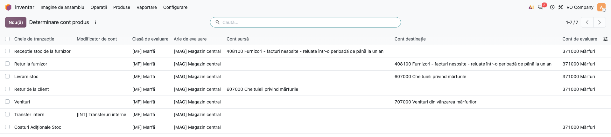
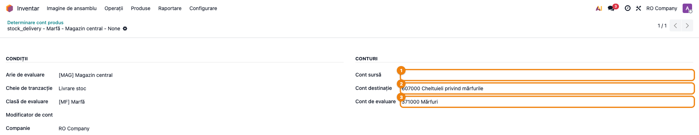
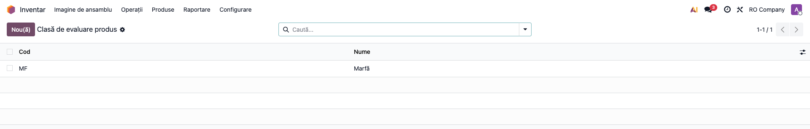
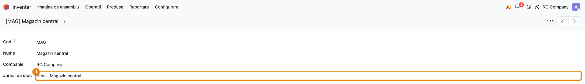
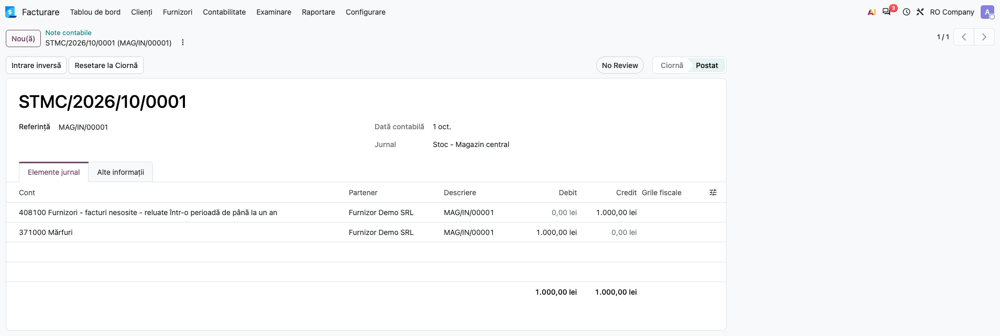
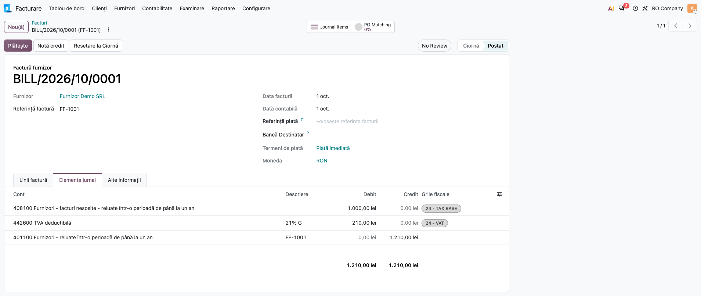
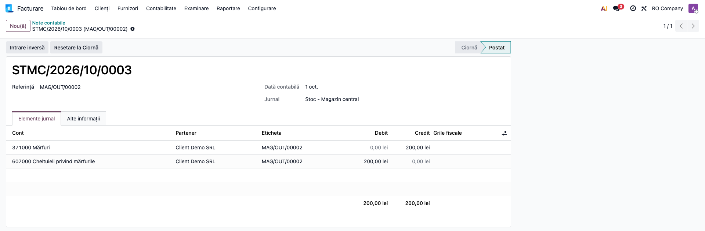
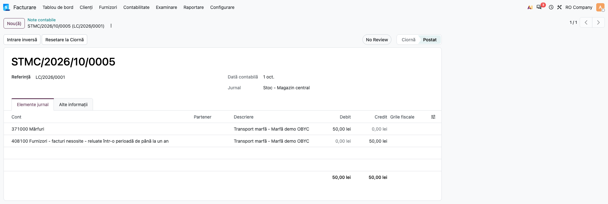

# Fișă Modul: Determinarea conturilor de stoc (OBYC)

**Modul:** `deltatech_obyc`
**Utilizator principal:** Contabil (gestiune, venituri/cheltuieli), consultant de implementare, administrator Odoo
**Prioritate:** 🔴 Ridicată (schimbă conturile tuturor notelor de stoc ale produselor cu clasă de evaluare și momentul în care se înregistrează costul mărfii vândute)

---

## 1. Scop business

Modulul aduce în Odoo un mecanism de tip **OBYC** (determinarea automată a conturilor, după
modelul SAP): conturile notelor de stoc nu mai vin din categoria produsului, ci dintr-o
**matrice de reguli** stabilită de contabil. O regulă se alege după combinația:

- **cheie de tranzacție** (recepție, livrare, retur, transfer, inventar, producție, cost de achiziție, venit);
- **clasă de evaluare** a produsului (marfă, materie primă, produs finit, ambalaj etc.);
- **arie de evaluare** (companie, depozit sau locație, din modulul `deltatech_valuation_area`);
- **modificator de cont** (opțional, de pe tipul de operațiune sau de pe jurnal);
- **companie**.

Astfel, aceeași operațiune (de exemplu o livrare) poate merge pe conturi diferite pentru mărfuri
și pentru produse finite, sau pentru gestiuni diferite, fără categorii de produs duplicate.

**Decizie de model, diferită de Odoo 20 standard:** pentru produsele cu clasă de evaluare,
**costul mărfii vândute se înregistrează la livrare**, pe nota mișcării de stoc (cheia
**Livrare stoc**, de exemplu Dr 607 / Cr 371 la mărfuri, Dr 711 / Cr 345 la produse finite).
**Factura de vânzare conține doar venitul și TVA** (Dr 4111 / Cr 707 + 4427), fără linii de cost.
Odoo 20 standard, în evaluarea în timp real, înregistrează costul la postarea facturii; cu OBYC
acest lucru nu se mai întâmplă, ca să nu se dubleze costul. Produsele fără clasă de evaluare
rămân pe comportamentul standard Odoo (excepție: inversarea storno a retururilor, OBYC-007).

**Valoarea ieșirilor rămâne cea de la validare.** Odoo 20 reia valorizarea și rescrie valoarea
ieșirilor deja validate când o intrare se mută în trecut, când se editează cantitatea unei mișcări
validate sau când o factură de furnizor reevaluează o recepție. Notele OBYC sunt postate la
validare și nu se rescriu, de aceea, pentru produsele cu clasă de evaluare, valoarea **ieșirilor**
deja validate rămâne cea din momentul validării (ca în versiunile anterioare), cât timp setarea
companiei **Păstrează valoarea mișcării la recalcularea retroactivă** este bifată (implicit).
**Intrarea** reevaluată (factură de furnizor cu alt preț, cantitate editată pe o recepție validată)
își schimbă însă valoarea **fără notă OBYC** pentru diferență — vezi secțiunea 9.

## 2. Bază legală și context

- **OMFP 1802/2014, pct. 95, 283, 290 și 440–441** — bunurile se scot din gestiune la transferul
  controlului către client, care, de regulă, coincide cu livrarea, nu cu facturarea. Pe această
  bază costul mărfii vândute se înregistrează la livrare. **Pct. 283 alin. (2)** enumeră
  excepțiile (consignație, stocuri la dispoziția clientului etc.), tratate la OBYC-003.
- **OMFP 1802/2014, pct. 53 alin. (2)–(3) și pct. 310 alin. (3)** — veniturile și cheltuielile
  aceleiași tranzacții se recunosc simultan; creanțele pentru care până la finele lunii nu s-a
  întocmit factura se înregistrează pe **418 „Clienți - facturi de întocmit"**, pe baza
  documentelor de livrare (OBYC-002).
- **OMFP 1802/2014, pct. 69** — stornarea se face fie cu semnul minus („în roșu"), fie prin
  înregistrarea inversă („în negru"), după politica contabilă. Cu **Contabilitate storno**,
  retururile se înregistrează cu sume negative pe conturile tranzacției inițiale, ca rulajele
  conturilor să nu crească artificial. La companiile cu țara fiscală România, Odoo activează
  **Contabilitate storno** implicit; variantele „fără storno" din fișă apar doar dacă bifa este
  scoasă.
- **Codul fiscal, art. 281 și art. 282** — faptul generator al TVA este livrarea bunurilor
  (art. 281 alin. (1); excepțiile de la alin. (2)–(4) — consignație, bunuri trimise spre probă,
  stocuri la dispoziția clientului — sunt tratate la OBYC-003), iar TVA devine exigibilă la data
  livrării (art. 282 alin. (1)). Art. 319 alin. (16) stabilește doar termenul de emitere a
  facturii (cel târziu pe 15 a lunii următoare) și **nu mută exigibilitatea**. Factura emisă
  înainte de livrare face TVA exigibilă la emitere (art. 282 alin. (2) lit. a)); la TVA la
  încasare exigibilitatea se amână la încasare (art. 282 alin. (3)).
- **Codul fiscal, art. 304 și art. 25** — ajustarea TVA deduse pentru lipsurile de inventar și
  tratamentul lor la impozitul pe profit (secțiunea 6, „Note de monografie").
- Cazurile pe care modelul „cost la livrare" **nu** le acoperă încă (livrat nefacturat la sfârșit
  de lună, consignație, factură înainte de livrare) sunt descrise la secțiunea 9 și în
  `readme/bugs.md`, cu procedura manuală.

## 3. Utilizatori și roluri

- **Contabil** — definește clasele de evaluare, modificatorii de cont și matricea de reguli;
  verifică notele generate și face notele manuale (închiderea lunii, inventar, diferențe de preț —
  secțiunile 6 și 9).
- **Gestionar / operator depozit** — validează recepții, livrări, retururi; nu configurează nimic,
  dar notele se generează la validarea documentelor lui.
- **Operator facturare** — emite facturile de vânzare; vede că factura nu mai conține liniile de cost.

**Atenție la drepturi:** modulul nu restrânge configurarea la contabil — clasele de evaluare,
modificatorii de cont și matricea de reguli pot fi create și modificate de orice utilizator intern,
iar meniul **Configurare determinare cont** nu are restricție de grup. Dacă matricea trebuie
protejată, restricționați manual meniul sau drepturile de acces (de exemplu la grupul
Contabilitate: Contabil).

Roluri recomandate pentru testare:
- Administrator funcțional (Inventar: Administrator, Contabilitate: Contabil) — configurarea din
  secțiunea 5; câmpul **Clasă de evaluare** de pe produs e vizibil doar utilizatorilor cu drepturi
  contabile;
- Utilizator operațional (Inventar: Utilizator) — recepția, livrarea, returul;
- Contabil — verificarea notelor și a facturilor.

## 4. Conturi și date implicate

Conturi folosite în exemplele din fișă (planul de conturi RO):

| Cont | Rol în fluxul OBYC |
|---|---|
| 371 Mărfuri | cont de evaluare (stocul) pentru clasa „Marfă" |
| 301 Materii prime | cont de evaluare pentru clasa „Materie primă" |
| 345 Produse finite | cont de evaluare pentru clasa „Produs finit" |
| 408 Furnizori - facturi nesosite | contrapartida recepției și a returului la furnizor; contul liniei de produs de pe factura de furnizor; în exemplul de cost de achiziție, contul facturii de transport |
| 607 Cheltuieli privind mărfurile | costul mărfii vândute, înregistrat la livrare |
| 601 Cheltuieli cu materiile prime | consumul în producție |
| 711 Venituri aferente costurilor stocurilor de produse | costul produselor finite livrate (în debit); obținerea produselor finite (în credit) |
| 707 Venituri din vânzarea mărfurilor | venitul de pe factura de vânzare a mărfurilor |
| 701 Venituri din vânzarea produselor finite | venitul de pe factura de vânzare a produselor finite (704 / 708 pentru servicii, respectiv activități diverse) |
| 4111 Clienți, 4427 TVA colectată | factura de vânzare |
| 401 Furnizori, 4426 TVA deductibilă | factura de furnizor (TVA din taxe, în afara OBYC) |
| 418 Clienți - facturi de întocmit, 4428 TVA neexigibilă | livrat nefacturat la sfârșitul lunii (OBYC-002) — notă manuală |
| 419 Clienți - creditori | factură înainte de livrare (OBYC-004) |
| 4282 / 461 / 7581, 635 / 4426 | imputarea lipsurilor de inventar și ajustarea TVA deduse — note manuale |

**Cum se citesc conturile unei reguli** (comportamentul din cod, important la configurare):

*Nota mișcării de stoc* (recepție, livrare, retur, transfer, inventar, producție, livrare directă):

| Cont sursă al regulii | Nota generată |
|---|---|
| completat | Dr **Cont de evaluare** / Cr **Cont sursă** (Contul destinație nu se folosește) |
| gol | Dr **Cont destinație** / Cr **Cont de evaluare** |
| toate cele trei conturi goale | nu se generează notă |

*Linia de produs de pe factură* (de la versiunea 20.0.1.0.5 a modulului):

| Document | Regula folosită | Contul liniei de produs |
|---|---|---|
| factură client, notă de credit client | **Venituri** | **Cont destinație** (707; 701 la produse finite) |
| factură de furnizor, notă de credit furnizor | **Recepție stoc de la furnizor** | **Cont sursă** (408) |

Contul se alege după tipul documentului. Dacă acel cont al regulii este gol, linia ia **Contul de
evaluare** al regulii. Pe facturi modificatorul de cont nu se folosește, deci se caută regula fără
modificator. Factura de furnizor rezultă Dr 408 + Dr 4426 = Cr 401 și stinge 408 de la recepție.
Înainte de 20.0.1.0.5 linia rămânea pe Contul de evaluare (OBYC-001, secțiunea 9).

Nota de credit ia **același cont** ca factura. Cu **Contabilitate storno** (implicit la firmele RO)
se înregistrează în roșu, pe aceeași parte ca factura: Dr 4111 −V / Cr 707 −V + Cr 4427 −V la
client; Dr 408 −V + Dr 4426 −V / Cr 401 −V la furnizor. Fără storno, Odoo inversează partea
(de exemplu Dr 707 + Dr 4427 / Cr 4111).

**Aria de evaluare pe factură** se ia din livrarea sau recepția liniei de comandă (vânzare sau
achiziție); la o factură fără comandă se folosește aria companiei. Creați regulile **Venituri** și
**Recepție stoc de la furnizor** pentru fiecare arie din care se livrează sau se recepționează,
plus pentru aria companiei; altfel factura se oprește cu mesajul „Nu s-a găsit nicio regulă…".

*Costul de achiziție (landed cost)*: Dr **Cont de evaluare** al regulii **Costuri Adiționale
Stoc** / Cr contul completat pe linia de cost (**Contul liniei de cost**); Contul sursă și Contul
destinație nu se folosesc. Contul liniei de cost trebuie să fie contul pe care s-a înregistrat
factura de transport, ca acel cont să se stingă (detalii la Pasul 10).

Date minime pentru demo:
- companie românească („RO Company"), în RON, cu planul de conturi RO și evaluare în timp real;
- o arie de evaluare (aici „[MAG] Magazin central"), cu jurnal de stoc propriu;
- o clasă de evaluare („[MF] Marfă") și, opțional, un modificator de cont;
- un produs stocabil cu clasa de evaluare completată, categorie cu evaluare în timp real și cost
  mediu (costurile de achiziție cer cost mediu sau FIFO și se contabilizează doar în timp real);
  nota OBYC a mișcărilor de stoc se generează doar pentru produsele stocabile din categorii cu
  evaluare în timp real (OBYC-006, secțiunea 9);
- un furnizor și un client.

## 5. Configurare inițială

1. **Activați aria de evaluare pe companie:** *Inventar → Configurare → Setări*, blocul
   **Evaluare** → bifați **Folosește zonă de evaluare** și alegeți **Aria de evaluare** a companiei.
   Fără arie de evaluare activă, regulile se caută cu aria goală.
2. **Creați ariile de evaluare:** *Inventar → Configurare → Gestiunea depozitului → Zonă de evaluare*.
   Dacă notele de stoc ale unei arii trebuie să meargă pe un jurnal dedicat, completați
   **Jurnal de stoc**. Aria se poate pune și pe depozit sau pe locație (prioritate: locația
   internă, apoi depozitul, apoi compania).
3. **Definiți clasele de evaluare:** *Inventar → Configurare → Configurare determinare cont →
   Clasă de evaluare* (cod + nume, afișate ca `[COD] Nume`).
4. **Definiți modificatorii de cont (opțional):** *Inventar → Configurare → Configurare determinare
   cont → Modificatori de cont*. Se pun pe **tipul de operațiune** (câmpul **Modificator de cont**,
   lângă depozit) pentru mișcările de stoc și pe **jurnal** (câmpul **Modificator de cont**, lângă
   companie) pentru costurile de achiziție validate pe acel jurnal. Pe facturi modificatorul nu se
   folosește. Exemplu: modificatorul „[INT] Transferuri interne" pe tipul de operațiune de transfer
   intern, cu o regulă proprie.
5. **Completați clasa pe produse:** pe produs, tabul **Contabilitate**, grupul **Clasă de evaluare**.
6. **Creați matricea de reguli:** *Inventar → Configurare → Configurare determinare cont →
   Determinare cont produs*. Pentru fiecare combinație folosită (cheie, clasă, arie, modificator)
   completați conturile după convenția din secțiunea 4. Exemplu pentru **mărfuri**:

   | Cheie de tranzacție | Cont sursă | Cont destinație | Cont de evaluare | Nota rezultată |
   |---|---|---|---|---|
   | Recepție stoc de la furnizor | 408 | — | 371 | Dr 371 / Cr 408; factura de furnizor: linia pe 408 (Cont sursă) |
   | Retur la furnizor | — | 408 | 371 | Dr 408 / Cr 371 (cu storno: Dr 371 −V / Cr 408 −V) |
   | Livrare stoc | — | 607 | 371 | Dr 607 / Cr 371 |
   | Retur de la client | 607 | — | 371 | Dr 371 / Cr 607 (cu storno: Dr 607 −V / Cr 371 −V) |
   | Venituri | — | 707 | — | factura de vânzare și nota de credit: linia pe 707 (Cont destinație) |
   | Costuri Adiționale Stoc | — | — | 371 | Dr 371 / Cr contul liniei de cost |
   | Livrare directă (dropship) | 408 | — | 607 | Dr 607 / Cr 408 |
   | Retur dropshipping (client → furnizor) | 607 | — | 408 | Dr 408 / Cr 607 (cu storno: Dr 607 −V / Cr 408 −V) |
   | Transfer intern (aceeași arie) | — | — | — | fără notă (valoarea stocului nu se schimbă) |
   | Ajustare inventar plus (plusuri, inventar → gestiune) | 607 | — | 371 | Dr 371 / Cr 607 |
   | Ajustare inventar minus (lipsuri, gestiune → inventar) | — | 607 | 371 | Dr 607 / Cr 371 |

   Regulile **Livrare directă**, **Retur dropshipping** și **Recepție stoc de la furnizor**
   trebuie să folosească **același cont 408**: factura furnizorului pentru o livrare directă își ia
   contul din regula **Recepție stoc de la furnizor** (Cont sursă) și trebuie să stingă 408 din nota
   livrării directe.

   Exemplu pentru **produse finite** (clasa „Produs finit", cont de evaluare 345):

   | Cheie de tranzacție | Cont sursă | Cont destinație | Cont de evaluare | Nota rezultată |
   |---|---|---|---|---|
   | Recepție producție (producție → gestiune) | 711 | — | 345 | Dr 345 / Cr 711 (obținerea produselor finite) |
   | Livrare stoc | — | 711 | 345 | Dr 711 / Cr 345 |
   | Retur de la client | 711 | — | 345 | Dr 345 / Cr 711 (cu storno: Dr 711 −V / Cr 345 −V) |
   | Venituri | — | 701 | — | factura: linia pe 701 (704 / 708 pentru alte venituri) |
   | Ajustare inventar plus (plusuri) | 711 | — | 345 | Dr 345 / Cr 711 |
   | Ajustare inventar minus (lipsuri) | — | 711 | 345 | Dr 711 / Cr 345 |

   Exemplu pentru **materii prime** (clasa „Materie primă", cont de evaluare 301):

   | Cheie de tranzacție | Cont sursă | Cont destinație | Cont de evaluare | Nota rezultată |
   |---|---|---|---|---|
   | Recepție stoc de la furnizor | 408 | — | 301 | Dr 301 / Cr 408 |
   | Consum producție (gestiune → producție) | — | 601 | 301 | Dr 601 / Cr 301 |
   | Ajustare inventar plus (plusuri) | 601 | — | 301 | Dr 301 / Cr 601 |
   | Ajustare inventar minus (lipsuri) | — | 601 | 301 | Dr 601 / Cr 301 |

   Plusul la inventar (locația de inventar → gestiune) folosește cheia **Ajustare inventar plus**,
   lipsa (gestiune → locația de inventar) cheia **Ajustare inventar minus**; până la versiunea
   20.0.1.0.5 cheile erau inversate (OBYC-005, secțiunea 9). Plusurile de inventar se înregistrează
   pe seama contului de cheltuială (607 la mărfuri, 601 la materii prime) sau a contului 711 la
   produse finite, după funcțiunea contului de stoc din OMFP 1802/2014 (la 371: „constatate plus la
   inventar … (607, 758)", unde 758 privește bunurile primite cu titlu gratuit). Plusurile se
   evaluează la valoarea justă (pct. 75 alin. (1) lit. d)); verificați costul produsului înainte de
   ajustare. Imputarea și TVA-ul lipsurilor se fac manual (secțiunea 6, „Note de monografie").

   **Transfer între arii de evaluare.** Transferul direct între locații interne din arii diferite
   este blocat (secțiunea 9). Cheile **Ieșire transfer intern** (gestiune → tranzit) și **Intrare
   transfer intern** (tranzit → gestiune) există în listă, dar ruta prin locația de tranzit **nu
   este o soluție validată**: în Odoo 20 mișcarea gestiune → tranzit nu primește valoare, deci nota
   OBYC ar ieși cu valoare și cantitate 0 (OBYC-009, secțiunea 9). Nu configurați această rută la
   client până la rezolvarea OBYC-009; transferurile între arii se stabilesc cu contabilul.
7. **Storno:** *Facturare (sau Contabilitate) → Configurare → Setări*, blocul **Contabilitate
   storno** → verificați că **Contabilitate storno** este bifat (la firmele RO este bifat implicit).
8. **Valoarea mișcărilor validate:** *Inventar → Configurare → Setări*, blocul **Evaluare** →
   lăsați bifat **Păstrează valoarea mișcării la recalcularea retroactivă** (implicit bifat, din
   `deltatech_valuation_area`). Bifat: ieșirile validate ale produselor cu clasă de evaluare
   păstrează valoarea de la validare, aceeași cu cea din nota OBYC (intrările reevaluate se
   modifică totuși, fără notă — secțiunea 9). Debifat: recalcularea standard Odoo 20 rescrie
   valoarea ieșirilor ulterioare, dar notele contabile deja postate **nu** se corectează, deci
   valoarea stocului și contabilitatea se pot despărți.

Regula se caută **exact** pe combinația cheie + clasă + arie + modificator + companie: o regulă cu
modificator gol nu acoperă un tip de operațiune care are modificator. Dacă toate cele trei conturi
ale unei reguli sunt goale, mișcarea nu generează notă contabilă.

## 6. Flux de utilizare

### Pasul 1 — Matricea de reguli OBYC

*Inventar → Configurare → Configurare determinare cont → Determinare cont produs.*

Lista arată, pe fiecare rând, o regulă: cheia de tranzacție, modificatorul, clasa, aria și cele
trei conturi. Verificați că pentru fiecare operațiune pe care o veți face există un rând cu clasa
și aria produsului, iar conturile respectă convenția din secțiunea 4 (de exemplu la **Livrare
stoc** Contul sursă e gol, Contul destinație 607, Contul de evaluare 371).



### Pasul 2 — Formularul unei reguli

Deschideți din listă regula **Livrare stoc**. Grupul **Condiții** conține aria de evaluare, cheia
de tranzacție, clasa de evaluare, modificatorul de cont (aici gol) și compania; grupul **Conturi**
conține cele trei conturi (marcate ①②③):

1. **Găsiți pe ecran:** ① Cont sursă — gol; ② Cont destinație — 607000; ③ Cont de evaluare — 371000.
2. **Verificați:** fiindcă Contul sursă e gol, livrarea va genera Dr 607 / Cr 371 (convenția din
   secțiunea 4). Regula nu are modificator, deci se aplică doar tipurilor de operațiune fără
   modificator de cont.



### Pasul 3 — Clasele de evaluare

*Inventar → Configurare → Configurare determinare cont → Clasă de evaluare.*
Lista claselor de evaluare, cu codul și numele în coloane separate (aici MF, Marfă). În câmpurile
de selecție (produs, regulă) clasa apare ca `[COD] Nume`, de exemplu „[MF] Marfă".



### Pasul 4 — Aria de evaluare cu jurnal de stoc propriu

*Inventar → Configurare → Gestiunea depozitului → Zonă de evaluare* → deschideți aria.
Câmpul **Jurnal de stoc** (marcat) este completat cu „Stoc - Magazin central": notele OBYC ale
mișcărilor din această arie se postează pe acest jurnal, nu pe jurnalul de stoc al companiei.



### Pasul 5 — Produsul cu clasă de evaluare

*Inventar → Produse → Produse* → deschideți produsul → tabul **Contabilitate**.
Câmpul **Clasă de evaluare** (marcat) este „[MF] Marfă". Fără clasă, produsul urmează fluxul
standard Odoo (conturile din categorie). Conturile de venituri/cheltuieli de pe produs nu sunt
folosite pentru produsele cu clasă de evaluare: contează doar matricea.


### Pasul 6 — Recepția de la furnizor și nota ei

*Inventar → Operații → Transferuri → Recepții* → **Validează** recepția de 10 buc. În baza demo
recepția e făcută fără comandă de achiziție, deci se valorizează la costul produsului (100 lei/buc.);
dintr-o comandă de achiziție valoarea vine din prețul comenzii.
Nota se găsește în *Facturare → Contabilitate → Tranzacții → Note contabile* (aplicația se
numește *Contabilitate* când e instalată contabilitatea completă), după referința recepției; tabul
**Elemente jurnal**:

1. **Găsiți pe ecran:** jurnalul „Stoc - Magazin central" (jurnalul ariei), referința recepției,
   liniile 371000 Mărfuri (debit) și 408100 Furnizori - facturi nesosite (credit).
2. **Verificați:** Dr 371 = Cr 408 = 1.000,00 lei; conturile sunt cele din regula **Recepție stoc
   de la furnizor**, nu cele din categoria produsului; jurnalul este al ariei.



### Pasul 6b — Factura de furnizor: linia de produs pe 408

*Facturare → Furnizori → Facturi* → **Nou(ă)** → furnizor „Furnizor Demo SRL", produsul recepționat,
10 buc. × 100 lei, TVA 21% → **Confirmă** → tabul **Elemente jurnal**.

1. **Găsiți pe ecran:** liniile 408100 Furnizori - facturi nesosite (debit 1.000,00 lei), 442600
   TVA deductibilă (debit 210,00 lei) și 401100 Furnizori (credit 1.210,00 lei).
2. **Verificați:** linia de produs este pe 408, Contul sursă al regulii **Recepție stoc de la
   furnizor**, **nu** pe 371: stocul nu se mai debitează a doua oară (OBYC-001). După factură, 408
   pentru această recepție are sold zero, dacă prețul și cursul facturii sunt cele de la recepție;
   altfel vezi „Diferențe de preț și de curs" din „Note de monografie".



### Pasul 7 — Returul la furnizor cu storno (înregistrare în roșu)

Cu **Contabilitate storno** activ pe companie: din recepția validată, butonul **Retur**. În Odoo 20
nu mai apare fereastra de selecție: se deschide direct transferul de retur, în ciornă (în baza demo
cu referința MAG/OUT/00001). Completați cantitatea de 5 buc. (butonul **Retur toate** pune toată
cantitatea recepției) → **Validează**, apoi deschideți nota returului din *Note contabile*.

1. **Găsiți pe ecran:** aceleași conturi ca la recepție (371 pe debit, 408 pe credit), cu sume
   negative.
2. **Verificați:** Dr 371 = −500,00 lei, Cr 408 = −500,00 lei — nota apare „în roșu", nu ca o
   notă „neagră" inversată (Dr 408 / Cr 371). Fără storno, returul ar fi Dr 408 / Cr 371 cu sume
   pozitive.


### Pasul 8 — Livrarea la client: costul mărfii vândute

*Inventar → Operații → Transferuri → Livrări* → **Validează** livrarea (2 buc.), apoi deschideți
nota din *Note contabile*, după referința livrării.

1. **Găsiți pe ecran:** jurnalul ariei, referința livrării, liniile 607000 Cheltuieli privind
   mărfurile (debit) și 371000 Mărfuri (credit).
2. **Verificați:** Dr 607 = Cr 371 = 200,00 lei (2 buc. × costul mediu de 100 lei). **Costul
   mărfii vândute se înregistrează acum, la livrare**, din regula **Livrare stoc** — nu va mai
   apărea pe factură.



### Pasul 9 — Factura de vânzare: doar venit și TVA

*Facturare → Clienți → Facturi* → **Nou(ă)** → client „Client Demo SRL", produsul livrat,
2 buc. × 150 lei, TVA 21% → **Confirmă** → tabul **Elemente jurnal**.

1. **Găsiți pe ecran:** liniile 707000 Venituri din vânzarea mărfurilor (credit 300,00 lei),
   442700 TVA colectată (credit 63,00 lei) și 411100 Clienți (debit 363,00 lei).
2. **Verificați:** **nu există** linii 607/371 pe factură — costul a fost deja înregistrat la
   livrare (Pasul 8), deci nu se dublează. Venitul este pe 707, Contul destinație al regulii
   **Venituri**. Emiteți factura în luna livrării; altfel aplicați procedura OBYC-002 (secțiunea 9).


### Pasul 10 — Costul de achiziție (landed cost) pe o recepție

*Inventar → Operații → Ajustări → Costuri adiționale* → document nou pe o recepție de 10 buc.,
**Jurnal**: „Stoc - Magazin central", linie „Transport marfă" de 50 lei cu contul 408100,
împărțire după cantitate → **Calculează** → **Validează**, apoi deschideți nota documentului.
Nota se postează pe jurnalul ales în document, nu pe jurnalul ariei (în baza demo cele două
coincid: „Stoc - Magazin central").

1. **Găsiți pe ecran:** liniile 371000 Mărfuri (debit) și contul liniei de cost (aici 408100,
   credit).
2. **Verificați:** Dr 371 = Cr 408 = 50,00 lei; contul de stoc vine din regula **Costuri Adiționale
   Stoc** (Contul de evaluare), contul de credit e cel completat pe linia de cost; valoarea
   recepției crește cu 50 lei. Toată marfa recepției este încă în stoc; dacă o parte ar fi fost
   deja livrată, Odoo capitalizează doar partea rămasă (vezi limitarea din secțiunea 9).



**Contul liniei de cost** trebuie să fie contul pe care se înregistrează factura transportatorului,
ca acesta să se stingă. În exemplu linia are 408, deci factura de transport se înregistrează
Dr 408 + Dr 4426 = Cr 401, iar nota costului de achiziție stinge 408 (Dr 371 / Cr 408).

Dacă documentul **Costuri adiționale** se creează din factura de furnizor (butonul de creare a
costurilor adiționale de pe factură), Odoo pune pe linia de cost **contul de cheltuială al
produsului de transport**. Configurați acest cont la **408** (pe produsul „Transport marfă" sau pe
categoria lui), nu la un cont de cheltuieli (624): altfel factura debitează 624, iar costul de
achiziție creditează 624 în cursul anului, ceea ce contrazice funcțiunea contului; transportul
aferent achiziției face parte din costul de achiziție al mărfii (OMFP 1802/2014, pct. 8
subpct. 6).

### Note de monografie și raportare

Note generate în baza demo (marfă, cost mediu 100 lei/buc.):

| Operațiune | Cheie de tranzacție | Debit | Credit | Sumă |
|---|---|---|---|---|
| Recepție de la furnizor (10 buc.) | Recepție stoc de la furnizor | 371 | 408 | 1.000,00 |
| Factura de furnizor (10 × 100 lei + TVA 21%) | Recepție stoc de la furnizor (Cont sursă) | 408 / 4426 | 401 | 1.210,00 = 1.000,00 + 210,00 |
| Retur la furnizor (5 buc.), **fără** storno | Retur la furnizor | 408 | 371 | 500,00 |
| Retur la furnizor (5 buc.), **cu** storno | Retur la furnizor | 371 | 408 | −500,00 |
| Livrare la client (2 buc.) | Livrare stoc | 607 | 371 | 200,00 |
| Factura de vânzare (2 × 150 lei + TVA 21%) | Venituri (Cont destinație) | 4111 | 707 / 4427 | 363,00 = 300,00 + 63,00 |
| Retur de la client, **cu** storno (implicit la firmele RO) | Retur de la client | 607 | 371 | −V |
| Retur de la client, **fără** storno | Retur de la client | 371 | 607 | V |
| Cost de achiziție (transport) | Costuri Adiționale Stoc | 371 | contul liniei de cost (aici 408) | 50,00 |
| Livrare directă furnizor → client | Livrare directă | 607 | 408 | valoarea mișcării |
| Retur livrare directă (client → furnizor), **cu** storno | Retur dropshipping | 607 | 408 | −V |
| Retur livrare directă (client → furnizor), **fără** storno | Retur dropshipping | 408 | 607 | V |
| Livrare produse finite | Livrare stoc (clasa produs finit) | 711 | 345 | V |
| Obținere produse finite din producție | Recepție producție | 345 | 711 | V |
| Consum de materii prime | Consum producție | 601 | 301 | V |

**Inventar: plusuri și lipsuri.** OBYC face doar nota de stoc (tabelele din secțiunea 5):
plusuri la marfă Dr 371 / Cr 607, la materii prime Dr 301 / Cr 601, la produse finite Dr 345 /
Cr 711; lipsuri Dr 607 / Cr 371, Dr 601 / Cr 301, respectiv Dr 711 / Cr 345. Restul se face
**manual**, cu notă contabilă:
- **imputarea** lipsei: Dr 4282 (salariați) sau Dr 461 (terți) = Cr 7581, **fără TVA**: sumele
  imputate nu sunt contravaloarea unei livrări în sfera TVA (HG 1/2016, Titlul VII, pct. 78
  alin. (6) lit. a));
- **ajustarea TVA deduse** aferente lipsurilor (neimputabile sau imputate): Dr 635 = Cr 4426
  (Codul fiscal, art. 304 alin. (1) lit. c)); nu se ajustează la bunurile distruse, pierdute sau
  furate, dovedite conform art. 304 alin. (2) lit. a);
- **impozitul pe profit**: lipsurile neimputabile și TVA-ul aferent lor sunt nedeductibile (Codul
  fiscal, art. 25 alin. (4) lit. c)), cu excepțiile prevăzute acolo.

**Diferențe de preț și de curs între recepție și factura de furnizor.** Recepția se înregistrează
la prețul comenzii, factura de furnizor la prețul și cursul ei. OBYC nu generează note de
diferență (cheile **Diferență de preț** nu sunt folosite), deci diferența rămâne în sold pe 408.
Regularizarea se face **manual**:
- diferența de preț: Dr/Cr 371 față de 408 pentru partea încă în stoc și Dr/Cr 607 (711 la
  produse finite) față de 408 pentru partea deja vândută (exemplul numeric la secțiunea 9);
- diferența de curs pe 408 (achiziții în valută): Dr 665 / Cr 408 (pierdere) sau Dr 408 / Cr 765
  (câștig).

Observații:
- **Livrarea directă (dropship)** generează notă cu valoare: mișcarea furnizor → client se
  valorizează (înainte nota ieșea cu 0). Livrarea directă nu modifică stocul propriu și nici
  costul mediu al produsului. Nota directă Dr 607 / Cr 408, fără trecere prin 371, este o
  simplificare acceptabilă: marfa nu intră în gestiunea proprie.
- **Liniile notelor de stoc** poartă produsul, **cantitatea semnată** (pozitivă pe debit,
  negativă pe credit; la storno semnul se inversează odată cu suma) și unitatea de măsură —
  necesare evaluării cantitativ-valorice din `deltatech_stock_valuation`. La inversarea unei note
  de stoc (butonul **Intrare inversă**), cantitatea se inversează odată cu partea, deci evaluarea
  ajunge la zero, nu dublează cantitatea (`deltatech_valuation_area` 20.0.1.0.5).
- **Storno** se aplică doar mișcărilor de retur (cele care au o mișcare de origine returnată):
  nota „neagră" a regulii de retur devine tranzacția inițială cu sume negative. De aceea regula
  de retur trebuie să fie oglinda regulii operațiunii inițiale.
- **Retur de la client la produse finite:** pe lângă nota de stoc (Dr 711 −V / Cr 345 −V cu
  storno), se emite nota de credit către client, care reduce baza de impozitare (Codul fiscal,
  art. 287 lit. b)); linia ei ia contul 701 din regula **Venituri**.
- **Valoarea mișcării în Odoo 20:** în Odoo 20 câmpul de valoare al mișcării de stoc este
  **negativ pe ieșiri** (livrare, retur la furnizor) și pozitiv pe intrări. Nota OBYC folosește
  valoarea absolută, deci sumele Dr/Cr sunt pozitive, ca în tabelul de mai sus. Semnul negativ
  apare doar în rapoartele de stoc, nu în note.
- **Recalcularea retroactivă:** cu setarea **Păstrează valoarea mișcării la recalcularea
  retroactivă** bifată, o recepție mutată în trecut, o cantitate editată pe o mișcare validată sau
  o factură de furnizor cu alt preț nu modifică valoarea livrărilor deja validate ale produselor
  cu clasă de evaluare; valoarea lor rămâne egală cu nota OBYC. **Recepția** însă se reevaluează:
  de exemplu, o factură de furnizor la 120 lei/buc. pentru recepția de 10 buc. × 100 lei ridică
  valoarea recepției la 1.200 lei, în timp ce nota OBYC a recepției rămâne Dr 371 / Cr 408 =
  1.000 lei. Diferența de 200 lei nu se înregistrează automat (secțiunea 9).
- **TVA aferentă facturilor nesosite** nu este tratată de OBYC. Dacă firma înregistrează manual
  Dr 4428 / Cr 408 la recepție, la sosirea facturii trebuie înregistrat tot manual Dr 408 /
  Cr 4428, pentru că Odoo pune TVA-ul facturii direct pe 4426.

## 7. Legături cu alte module / declarații

| Modul | Rol |
|---|---|
| `deltatech_valuation_area` | ariile de evaluare (companie/depozit/locație), jurnalul de stoc pe arie și setarea **Păstrează valoarea mișcării la recalcularea retroactivă** — dependență obligatorie |
| `stock_account` | evaluarea în timp real; OBYC înlocuiește conturile notelor de stoc pentru produsele cu clasă |
| `stock_landed_costs` | costurile de achiziție; OBYC dă contul de stoc prin cheia **Costuri Adiționale Stoc** |
| `purchase_stock` | recepțiile din comenzi de achiziție |
| `deltatech_stock_valuation` | (opțional) evaluarea cantitativ-valorică pe arie, construită din liniile notelor OBYC |
| `account` (storno) | înregistrarea în roșu a retururilor |
| Jurnalul de TVA / D300 (`l10n_ro`) | D300 se calculează din grilele fiscale (tag-urile de taxă) ale elementelor de jurnal, nu din soldul 4427; OBYC nu schimbă taxele, iar o notă manuală pe 4427 ajunge în D300 doar dacă are tag-urile puse (OBYC-002) |

**Ce e automat:**
- alegerea regulii și a conturilor la fiecare mișcare de stoc a unui produs cu clasă de evaluare;
- contul liniei de produs pe facturi și note de credit (Venituri → Cont destinație, Recepție →
  Cont sursă);
- jurnalul notelor de stoc (jurnalul ariei, dacă e completat); costul de achiziție se postează pe
  jurnalul ales în documentul Costuri adiționale;
- costul mărfii vândute la livrare și lipsa liniilor de cost pe factura de vânzare;
- inversarea în roșu a retururilor, cu storno activ;
- valorizarea mișcărilor de livrare directă;
- păstrarea valorii de la validare pentru ieșirile produselor cu clasă de evaluare, la
  recalcularea retroactivă din Odoo 20 (cu setarea bifată).

**Ce rămâne manual:**
- întreținerea matricei de reguli (o regulă lipsă blochează validarea documentului);
- veniturile pentru livrările nefacturate la sfârșit de lună (418), consignația și facturile
  emise înainte de livrare (secțiunea 9);
- alegerea contului de pe linia de cost la costurile de achiziție și tratarea părții deja livrate;
- nota pentru diferența de valoare a unei recepții reevaluate (factură de furnizor cu alt preț,
  cantitate editată) și regularizarea diferențelor de preț și de curs rămase pe 408;
- imputarea lipsurilor, ajustarea TVA și impozitul pe profit la inventar;
- reconcilierea lunară a soldului contului de stoc pe arie (secțiunea 8);
- corecția facturilor postate înainte de versiunea 20.0.1.0.5 (secțiunea 9, OBYC-001);
- restricționarea drepturilor de modificare a matricei (secțiunea 3).

## 8. Verificări pentru consultant

- [ ] produsul are **Clasă de evaluare** (tabul Contabilitate) și categorie cu evaluare în timp real
- [ ] compania are **Folosește zonă de evaluare** bifat și o arie de evaluare; aria are **Jurnal de stoc**, dacă se dorește jurnal separat
- [ ] există regulă pentru fiecare combinație cheie + clasă + arie + modificator folosită (inclusiv tipurile de operațiune cu modificator)
- [ ] conturile regulilor respectă convenția: Cont sursă completat → Dr evaluare / Cr sursă; Cont sursă gol → Dr destinație / Cr evaluare
- [ ] regula **Venituri** are 707 (701 la produse finite) în **Cont destinație**; regula **Recepție stoc de la furnizor** are 408 în **Cont sursă**
- [ ] regulile **Livrare directă**, **Retur dropshipping** și **Recepție stoc de la furnizor** folosesc același cont 408
- [ ] regulile **Venituri** și **Recepție stoc de la furnizor** există pentru fiecare arie din care se livrează sau se recepționează și pentru aria companiei (facturile fără comandă)
- [ ] nota recepției: Dr 371 / Cr 408, pe jurnalul ariei
- [ ] factura de furnizor: linia de produs pe 408 (Dr 408 + 4426 / Cr 401), nu pe 371 (captura 11)
- [ ] nota livrării: Dr 607 / Cr 371 (sau Dr 711 / Cr 345 la produse finite)
- [ ] nota de stoc poartă **data validării** documentului: validați recepțiile și livrările în luna în care au avut loc
- [ ] factura de vânzare: Dr 4111 / Cr 707 + 4427, **fără** linii 607/371; nota de credit pentru retur pe același 707 (reducerile de preț acordate după facturare se înregistrează pe 709, manual)
- [ ] factura cu două sau mai multe produse OBYC (clase diferite) se confirmă, fiecare linie pe contul clasei ei
- [ ] nota de credit (client sau furnizor) este pe același cont ca factura, în roșu cu storno activ
- [ ] cu **Contabilitate storno** activ, nota returului are sume negative pe **aceleași conturi** ca operațiunea inițială
- [ ] costul de achiziție: Dr 371 / Cr contul liniei de cost; contul liniei de cost este contul facturii de transport (408), care se stinge; produsul de transport nu are ca cont de cheltuială 624
- [ ] livrarea directă furnizor → client are notă cu valoare (nu 0) și nu modifică stocul propriu
- [ ] liniile notelor de stoc au produs, cantitate semnată (pozitivă pe debit, negativă pe credit) și unitate de măsură
- [ ] la ajustările de inventar, plusul folosește regula **Ajustare inventar plus** și lipsa regula **Ajustare inventar minus**; la bazele actualizate de la o versiune anterioară 20.0.1.0.5, regulile au fost verificate (OBYC-005)
- [ ] costul de achiziție este pe jurnalul ales în document; recepția avea toată marfa în stoc sau partea livrată a fost tratată manual
- [ ] setarea **Păstrează valoarea mișcării la recalcularea retroactivă** este bifată (Inventar → Configurare → Setări, blocul Evaluare)
- [ ] după mutarea în trecut a unei recepții, valoarea livrărilor validate ulterior nu s-a schimbat și este egală cu suma din nota lor OBYC
- [ ] după o factură de furnizor cu alt preț decât recepția, diferența a fost înregistrată manual (în stoc → 371, livrat → 607/711); soldul 371 = valoarea stocului din Odoo minus partea din diferență aferentă cantității deja livrate (aceasta rămâne în valoarea din Odoo, fiindcă ieșirile validate nu se reevaluează)
- [ ] returul unei livrări directe (client → furnizor), cu storno activ, are Dr 607 −V / Cr 408 −V
- [ ] drepturile de modificare a matricei de reguli sunt restrânse, dacă politica firmei o cere
- [ ] lipsurile de inventar: imputarea (Dr 4282 / 461 = Cr 7581, fără TVA) și ajustarea TVA (Dr 635 = Cr 4426) sunt înregistrate manual
- [ ] **lunar:** soldul 408 = recepțiile nefacturate; analitic pe furnizor / recepție, fără solduri rămase din diferențe de preț sau de curs
- [ ] **lunar:** livrările nefacturate la sfârșitul lunii au fie factura cu data contabilă în luna livrării, fie nota pe 418 cu tag-uri D300 și inversare pe 1 a lunii următoare (OBYC-002), nu pe amândouă; TVA colectată din D300 se reconciliază cu rulajul creditor al lui 4427
- [ ] nu se folosesc transferuri între arii prin locația de tranzit (OBYC-009)
- [ ] **lunar:** soldul contului de stoc (371, 301, 345) **pe arie** este reconciliat cu valoarea stocului ariei (procedura de mai jos)

**Reconcilierea lunară a contului de stoc pe arie** (la închiderea fiecărei luni, înainte de
blocarea perioadei):

1. **Soldul contabil pe arie:** *Facturare → Contabilitate → Control → Elemente jurnal* → filtrați
   contul de stoc (de exemplu 371) și data până la ultima zi a lunii, doar înregistrările postate →
   grupați după **Arie de evaluare** (grupare personalizată; câmpul este stocat pe elementele de
   jurnal de `deltatech_valuation_area`). Notați soldul (debit − credit) fiecărei arii; o grupă
   „Nedefinit" arată linii de stoc fără arie (note manuale fără produs sau fără arie) — corectați-le.
2. **Valoarea stocului pe arie:** cu `deltatech_stock_valuation` instalat, raportul **Product
   Valuation** (*Inventar → Produse*) dă cantitatea și valoarea pe produs și arie; atenție, este
   construit din aceleași elemente de jurnal, deci confirmă **cantitățile** (comparați-le cu stocul
   fizic din locațiile ariei), nu soldul. Independent de note, *Inventar → Raportare → Stock by
   Location* (eticheta apare netradusă; meniul cere locații multiple activate), cu coloana
   opțională **Valoare**, filtrat pe locațiile ariei: în Odoo 20 valoarea
   fiecărei cantități este cantitatea × valoarea unitară medie a produsului **la nivel de companie**
   (nu pe arie) și se vede doar la data curentă, deci rulați controlul în prima zi a lunii următoare,
   înainte de alte mișcări, și explicați diferențele de cost între arii.
3. **Diferențe:** o diferență între soldul ariei și valoarea stocului ei are de regulă una dintre
   cauzele: recepție reevaluată fără notă (diferența de preț, secțiunea 9), cost de achiziție pe
   marfă parțial livrată, note de stoc validate în altă lună decât mișcarea, facturi postate înainte
   de 20.0.1.0.5 (OBYC-001), transferuri între arii (OBYC-009) sau note manuale pe 371 fără produs
   și arie. Documentați diferența și corectați-o prin notă contabilă cu produs, cantitate și arie.
4. Arhivați balanța pe arie și raportul folosit, ca anexă la închiderea lunii.

## 9. Mesaje de eroare frecvente

| Mesaj | Cauză | Remediere |
|---|---|---|
| „Nu s-a găsit nicio regulă de determinare a contului pentru cheia de tranzacție '…', modificatorul de cont '…', clasa de evaluare '…', zona de evaluare '…' și compania '…'." | nu există regulă pentru combinația exactă (adesea: tipul de operațiune are modificator, iar regula nu; la facturi: lipsește regula **Venituri** sau **Recepție stoc de la furnizor** pentru aria liniei) | butonul **Mergi la configurare** deschide lista de reguli; la **Nou(ă)** condițiile vin precompletate — adăugați conturile și salvați |
| „Cheia de tranzacție nu a putut fi determinată pentru mișcarea de la … la …." (tipurile tehnice ale locațiilor, de exemplu `transit` și `customer`) | mișcare între tipuri de locații pe care modulul nu le cunoaște (de exemplu tranzit → client) | refaceți fluxul prin locații interne sau cereți extinderea cheilor |
| „Aria de evaluare nu este definită" | compania folosește arii de evaluare, dar nici compania, nici depozitul, nici locația nu au arie | completați aria pe companie, depozit sau locație |
| „Locațiile sursă și destinație trebuie să aibă aceeași arie de evaluare pentru mișcările interne." | transfer intern între locații din arii diferite | păstrați sursa și destinația în aceeași arie; ruta prin tranzit **nu** este o soluție validată (OBYC-009) — transferurile între arii se stabilesc cu contabilul |
| „Cheia de tranzacție nu este definită. Setați-o în context." | un flux standard cere conturile unui produs cu clasă de evaluare fără să treacă prin OBYC (de exemplu asistentul de factură de avans, OBYC-008, sau cel de venituri angajate, OBYC-002) | semnalați fluxul echipei de dezvoltare; temporar, procesați produsul fără clasă |

**Limitări cunoscute** (detaliate în `readme/bugs.md`; nu sunt funcționalități):

- **OBYC-001 — reparat în 20.0.1.0.5.** Înainte de această versiune, linia de produs de pe
  factură lua Contul de evaluare al regulii: venitul facturii de vânzare putea ajunge pe 371, iar
  factura de furnizor debita din nou 371 (în loc de 408), lăsând 408 nestins. **Facturile postate
  înainte de 20.0.1.0.5 rămân cu contul greșit**: după actualizare, comparați soldul 371 cu
  valoarea stocului pe arie (secțiunea 8) și soldul 408 cu recepțiile nefacturate, apoi corectați
  diferențele prin notă contabilă (de exemplu Dr 408 / Cr 371 pentru facturile de furnizor, Dr 371 /
  Cr 707 pentru facturile de vânzare; pentru notele de credit vechi: Dr 371 / Cr 408 la furnizor, iar
  la client, în roșu, Dr 371 −V / Cr 707 −V). Dacă regula **Venituri** fusese configurată cu 707 în
  toate cele trei conturi (ocolirea veche), se poate lăsa așa; configurarea recomandată are 707 doar
  în Cont destinație.
- **OBYC-002 — fără venituri de facturat (418 Clienți - facturi de întocmit) pentru livrat
  nefacturat.** Livrarea din luna M înregistrează costul în M, venitul apare doar la factura din
  M+1. TVA este exigibilă la livrare (Codul fiscal, art. 282 alin. (1)); art. 319 alin. (16)
  obligă doar la emiterea facturii până pe 15 a lunii următoare, nu mută exigibilitatea. Alegeți
  **una** dintre variante, nu pe amândouă (altfel venitul și TVA-ul se dublează):
  - **(a) preferat — factura cu data contabilă în luna M.** Emiteți factura în luna livrării sau
    până pe 15 a lunii M+1 cu **data contabilă** în luna M (dacă perioada nu este blocată). Venitul
    și TVA-ul intră în luna M prin factură, **fără** nota pe 418 și fără inversare;
  - **(b) factura cu data contabilă în luna M+1.** La sfârșitul lunii M, notă contabilă manuală pe
    baza avizelor de livrare (*Facturare → Contabilitate → Tranzacții → Note contabile* → **Nou(ă)**,
    jurnalul de operațiuni diverse, data = ultima zi a lunii M):
    - **Dr 418 = Cr 707** (701 la produse finite) **+ Cr 4428** (TVA neexigibilă), apoi, tot în
      luna M (luna livrării), **Dr 4428 = Cr 4427** — pot fi linii ale aceleiași note;
    - **TVA la încasare** (art. 282 alin. (3)): TVA rămâne pe 4428, **fără** Dr 4428 = Cr 4427;
    - **tag-urile D300:** D300 din Odoo se calculează din grilele fiscale (tag-urile de taxă) ale
      elementelor de jurnal, nu din soldul 4427, deci nota are nevoie de tag-uri. În tabul
      **Elemente jurnal** al notei, coloana **Grile fiscale** (afișată implicit; altfel din
      butonul de coloane opționale) se completează: pe linia 707 tag-ul de bază al cotei
      (`09 - TAX BASE` la 21%, `10 - TAX BASE` la 11%), pe linia 4427 tag-ul de TVA
      (`09 - VAT`, respectiv `10 - VAT`); liniile 418 și 4428 rămân fără tag. La TVA la
      încasare tag-urile se stabilesc cu contabilul;
    - după postare, butonul **Intrare inversă** cu data **1 a lunii M+1**: nota inversă cu dată
      viitoare se postează automat la acea dată (cu o dată deja trecută, imediat). Inversarea copiază liniile cu tag-urile lor și
      sume de semn opus, deci D300 din M+1 primește −V din inversare și +V din factură: livrarea
      intră o singură dată, în D300 din M;
    - factura din M+1 se postează normal (Dr 4111 / Cr 707 + 4427): fără inversare, venitul și TVA-ul
      s-ar dubla;
    - controlul: TVA colectată din D300 al lunii M se reconciliază cu rulajul creditor al lui 4427
      din M; după inversare, 418 și 4428 au sold zero;
  - asistentul standard **Înregistrare venituri acumulate** din Vânzări nu poate fi folosit pentru
    produsele cu clasă de evaluare: cere conturile produsului fără cheie de tranzacție și se oprește
    cu eroarea „Cheia de tranzacție nu este definită"; în plus, nu înregistrează TVA și nici
    tag-uri.
- **OBYC-003 — consignație, bunuri trimise spre probă sau păstrate la dispoziția clientului.**
  Orice ieșire spre o locație de client folosește **Livrare stoc** și înregistrează costul imediat
  (Dr 607 / Cr 371), deși controlul nu s-a transferat (corect: Dr 357 / Cr 371 la expediere în
  consignație). Aceste fluxuri se tratează manual.
- **OBYC-004 — factura emisă înainte de livrare.** O factură integrală (nu de avans) postată
  înainte de livrare înregistrează venitul pe 707, deși ar trebui tratată ca avans (Dr 4111 /
  Cr 419 + 4427; TVA exigibilă la emiterea facturii, art. 282 alin. (2) lit. a)). Recomandarea
  standard este factura de avans până la livrare; dacă factura finală deduce avansul, Odoo stinge
  singur 419 și TVA-ul avansului, **fără** notă manuală. Atenție însă la OBYC-008: asistentul de
  factură de avans se oprește, după cod, pe comenzile cu produse cu clasă de evaluare — testați pe
  o comandă înainte de a recomanda fluxul. Nota Dr 419 = Cr 707 (701), fără TVA nou, se face doar
  când o factură integrală postată înainte de livrare a fost reclasificată manual pe 419; OMFP
  pct. 311^1 vorbește de sume încasate, pentru facturile neîncasate aceasta este practica uzuală,
  de confirmat cu contabilul.
- **OBYC-005 — reparat în 20.0.1.0.5.** Înainte de această versiune, lipsa la inventar folosea
  cheia **Ajustare inventar plus**, iar plusul cheia **Ajustare inventar minus**. **La actualizare**,
  regulile configurate după comportamentul vechi (o regulă „plus" care debitează cheltuiala, o
  regulă „minus" care debitează stocul) trebuie să-și schimbe cheia între ele, altfel plusurile se
  înregistrează ca lipsuri și invers; actualizarea modulului le semnalează în jurnalul serverului
  („OBYC-005: account determination rule …"), fără să le modifice.
- **OBYC-006 — reparat în 20.0.1.0.5.** Nota OBYC se generează doar pentru produsele stocabile
  din categorii cu evaluare în timp real, cu cantitate nenulă și fără proprietar terț (marfa în
  custodie nu se evaluează), ca în Odoo standard. Pentru celelalte mișcări nu se mai cere regulă,
  iar o mișcare pe care nici Odoo standard nu o evaluează (de exemplu furnizor → locația de
  inventar) se validează fără notă. Lipsa regulii la o mișcare evaluată în timp real oprește în
  continuare validarea, cu trimitere la configurare. Marfa cu proprietar terț (custodie,
  consignație primită) nu se înregistrează în 371: se ține în afara bilanțului, în contul 8033,
  prin notă manuală (OMFP 1802/2014, pct. 284 alin. (2) lit. a)). Pentru produsele cu evaluare
  periodică (inventar intermitent, pct. 291), intrările se înregistrează pe cheltuieli la factura
  furnizorului, iar stocul se regularizează la inventarul de la sfârșitul perioadei.
- **OBYC-007 — reparat în 20.0.1.0.5:** mesajul „Cheia de tranzacție nu a putut fi determinată…"
  arată tipurile de locații, titlul regulii arată eticheta cheii, fără „None" pentru modificator
  gol, iar mesajul „regulă lipsă" arată cheia în limba utilizatorului; exemplele din descrierea
  tehnică a modulului respectă convenția din secțiunea 4. Nu este defect: inversarea storno a
  retururilor se aplică și produselor fără clasă de evaluare (retururile se înregistrează în roșu
  la toate produsele firmelor cu storno).
- **OBYC-008 — facturile de avans din comandă (dedus din cod, netestat).** Asistentul de factură de
  avans din comanda de vânzare (avans procentual sau sumă fixă) cere conturile produsului de pe
  comandă fără cheie de tranzacție, deci pe comenzile cu produse cu clasă de evaluare se oprește
  cu „Cheia de tranzacție nu este definită". Testați pe baza clientului înainte de a folosi fluxul
  OBYC-004.
- **OBYC-009 — transfer prin tranzit cu valoare 0 (dedus din cod, netestat).** În Odoo 20 locația
  de tranzit a companiei este evaluată, deci mișcarea gestiune → tranzit nu este nici intrare, nici
  ieșire: nu primește valoare, iar nota OBYC a cheii **Ieșire transfer intern** ar ieși cu valoare
  și cantitate 0, deși pare postată. Ruta prin tranzit **nu** este o soluție validată pentru
  transferurile între arii; nu o configurați la client.
- **Setarea de păstrare a valorii debifată.** Dacă **Păstrează valoarea mișcării la recalcularea
  retroactivă** este debifată, recalcularea standard Odoo 20 rescrie valoarea livrărilor deja
  validate, dar notele OBYC postate rămân neschimbate: valoarea stocului și soldul 371 se pot
  despărți. Debifați setarea doar cu acordul contabilului și înregistrați manual diferențele.
- **Cost de achiziție pe marfă parțial livrată.** Odoo capitalizează pe 371 doar partea de cost
  aferentă cantității rămase în stoc; pentru partea deja livrată nu se face notă, deci suma rămâne
  în contul liniei de cost (în exemplu 408, care rămâne nestins). Înregistrați manual partea
  livrată pe 607/711 sau folosiți ca cont al liniei de cost un cont în care partea livrată poate
  rămâne, stabilit cu contabilul. Este comportamentul nucleului `stock_landed_costs`.
- **Diferența de preț / recepție reevaluată fără notă.** O factură de furnizor cu alt preț decât
  recepția, sau o cantitate editată pe o recepție validată, schimbă valoarea recepției în Odoo,
  dar OBYC nu postează nicio notă pentru diferență: valoarea stocului din Odoo nu mai corespunde
  soldului 371, iar dacă linia facturii este pe 408 (după reparația OBYC-001), 408 rămâne nestins cu
  diferența. Înregistrați manual diferența: pentru partea aflată încă în stoc Dr 371 / Cr 408
  (sau invers, la preț mai mic; la o corectură de cantitate, contul stabilit de contabil, după
  cauza corecției), pentru partea deja livrată pe 607 (711 la produse finite), după politica
  contabilă a firmei. Partea livrată rămâne în valoarea stocului din Odoo (ieșirile validate nu se
  reevaluează), deci devine o diferență permanentă de reconciliere între valoarea stocului din
  Odoo și soldul 371; documentați-o la închiderea lunii. Exemplu: recepție 10 × 100, livrare 5,
  factură la 120 → valoarea din Odoo 1.200 − 500 = 700; după nota manuală (Dr 371 100 pentru
  stoc, Dr 607 100 pentru livrat / Cr 408 200), soldul 371 = 600; diferența de 100 este partea
  livrată. Diferența de curs pe 408 se înregistrează manual (secțiunea 6, „Note de monografie").
  Cheile **Evaluare stoc**, **Diferență de preț** și **Diferență de preț la recepție stoc** apar
  în listă, dar nu sunt folosite de fluxurile actuale.
- Gestiunile la preț cu amănuntul (378 / 4428) nu sunt suportate (secțiunea 1).

## 10. Capturi de ecran

Capturile sunt generate automat de testul `tests/test_screenshots.py` (mixinul `ScreenshotCase`
din `l10n_ro_doc_screenshots`, import defensiv), pe „RO Company", în RON, în limba română, pe
planul de conturi RO. Testul verifică întâi notele contabile (conturi și sume) și contul liniei de
produs de pe factura de vânzare și de pe cea de furnizor, apoi capturează ecranele. Se regenerează
cu:

```bash
.venv/bin/python odoo/odoo-bin -c odoo.conf -d test20 -i deltatech_obyc,l10n_ro,l10n_ro_doc_screenshots \
    --test-tags=fise_screenshots --stop-after-init --http-port=8070
```

| Fișier | Conținut |
|---|---|
| `01_account_determination_matrix.png` | matricea de reguli OBYC (Determinare cont produs); Venituri doar cu Cont destinație 707 |
| `02_account_determination_form.png` | formularul regulii Livrare stoc: Condiții și Conturi (①②③) |
| `03_valuation_class_list.png` | lista claselor de evaluare |
| `04_valuation_area_journal.png` | aria de evaluare cu Jurnal de stoc propriu |
| `05_product_valuation_class.png` | produsul cu Clasă de evaluare (tab Contabilitate) |
| `06_stock_move_obyc_entry.png` | nota recepției: Dr 371 / Cr 408, pe jurnalul ariei |
| `11_vendor_bill_408.png` | factura de furnizor: Dr 408 + 4426 / Cr 401, linia de produs pe 408 (OBYC-001, Pasul 6b) |
| `07_storno_return.png` | returul la furnizor cu storno: Dr 371 −500 / Cr 408 −500 |
| `08_delivery_cogs_entry.png` | nota livrării: Dr 607 / Cr 371 (costul la livrare) |
| `09_sale_invoice_no_cogs.png` | factura de vânzare: Dr 4111 / Cr 707 + 4427, fără linii de cost |
| `10_landed_cost_entry.png` | nota costului de achiziție: Dr 371 / Cr contul liniei de cost |

## 11. Observații pentru manual

- Păstrați explicit **decizia „costul la livrare"** și diferența față de Odoo standard: cititorii
  care cunosc Odoo vor căuta liniile de cost pe factură.
- Tabelul cu **convenția de citire a conturilor** (secțiunea 4) este esențial: numele câmpurilor
  („sursă", „destinație") nu spun singure ce cont se debitează, iar pe facturi contul se alege
  după tipul documentului.
- Limitările **OBYC-001…OBYC-009** trebuie prezentate ca atare, cu procedura manuală, până la
  rezolvarea lor; reverificați `readme/bugs.md` înainte de fiecare ediție a manualului (OBYC-001
  este reparat, dar procedura de corecție a facturilor vechi rămâne utilă la migrări).
- Procedura de închidere a lunii pentru livrat nefacturat (OBYC-002, varianta (b)) cere tag-urile
  D300 pe nota manuală; arătați în manual coloana **Grile fiscale** din tabul **Elemente jurnal**.
- Etichetele din interfață sunt în română („Zonă de evaluare" în meniu, „Arie de evaluare" pe
  câmpuri); de la 20.0.1.0.5 titlul formularului unei reguli afișează eticheta cheii, fără
  modificatorul gol (de exemplu `Livrare stoc - Marfă - Magazin central`); capturile generate
  înainte de această versiune arată încă titlul vechi.
- În Odoo 20, butonul **Retur** creează direct transferul de retur (fără fereastra de selecție
  a cantităților din versiunile anterioare); descrieți fluxul de retur ca atare.
- Unele etichete din nucleul Odoo apar netraduse sau ciudat traduse în capturi (grilele fiscale
  „09 - TAX BASE", „09 - VAT", „24 - TAX BASE", „24 - VAT", „Intrare inversă", „No Review", „Journal Items", „0 Outgoing",
  „0 Incoming", „CPV Code"); nu țin de acest modul.
