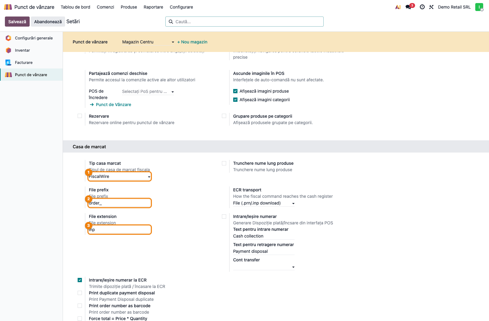
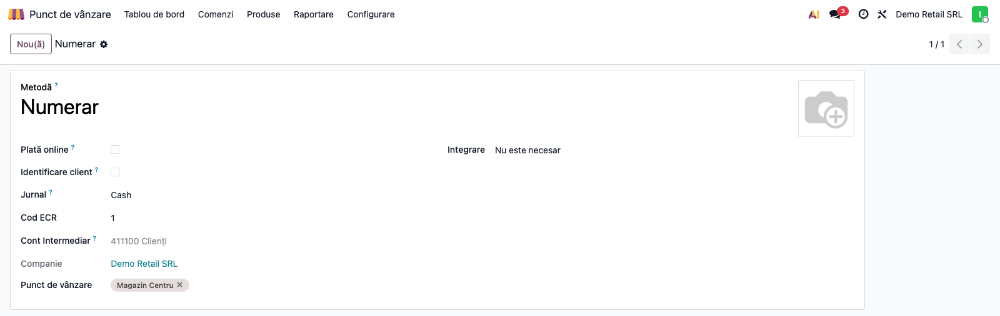
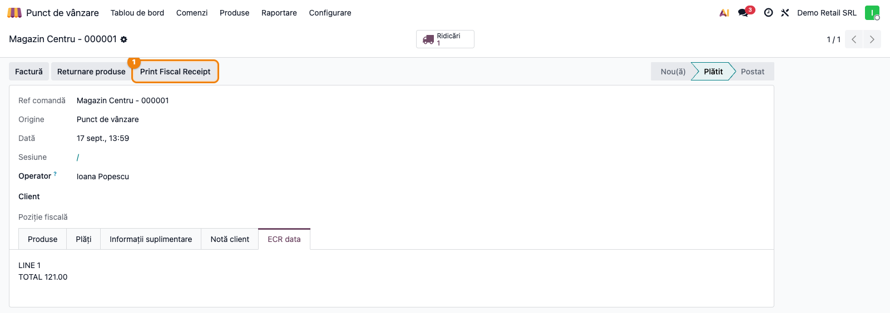
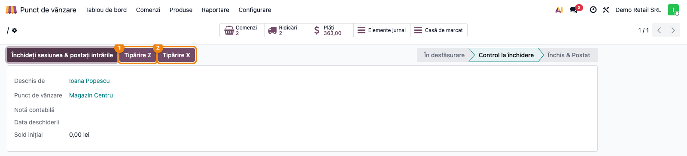
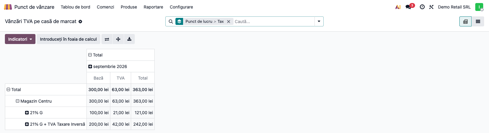

# Fișă Modul: Retail fiscal / AMEF — Print to ECR from POS

**Poziție plan:** C19  
**Modul:** `deltatech_pos`  
**FR:** FR-47  
**Capitol manual:** Cap 12.13  
**Utilizator principal:** Responsabil magazin/POS, Casier, Consultant implementare  
**Prioritate:** Ridicată

---

## 1. Scop business

Modulul conectează Odoo POS la casa de marcat fiscală prin fișiere ECR generate la validarea
bonului sau a operațiunilor de numerar. Consultantul trebuie să îl prezinte ca un strat de
integrare operațională pentru retail fiscal: Odoo pregătește fișierul în formatul așteptat de
driverul AMEF, iar aplicația/driverul local al casei de marcat îl preia și îl tipărește.

Modulul nu face comunicare hardware directă și nu citește răspunsul fiscal înapoi în Odoo.

## 2. Bază legală și context

În România, vânzarea cu amănuntul cu numerar/card către populație se fiscalizează prin aparat de
marcat electronic fiscal (AMEF) — obligație stabilită prin OUG 28/1999. Un bon fiscal care conține
și CIF-ul clientului, sub plafonul legal, este considerat factură simplificată (Cod fiscal art. 319
alin. (12) lit. a)) — vezi Pasul 5 din Configurare inițială. În această implementare, `deltatech_pos`
acoperă partea de emitere a comenzii de tipărire fiscală din POS și operațiunile conexe:

- bon fiscal la validarea comenzii;
- cash in / cash out;
- raport X și raport Z;
- reimprimare manuală din backoffice a fișierului ECR deja generat.

Pentru raportarea D394 a bonurilor POS se folosește complementar
`l10n_ro_anaf_d394_pos`, nu acest modul.

## 3. Utilizatori și roluri

- Casier POS: emite bonul fiscal și operează cash in / cash out.
- Responsabil magazin: configurează POS-ul, metodele de plată și verifică sesiunile.
- Contabil / backoffice: poate reimprima fișierul fiscal al unei comenzi și verifică rapoartele X/Z.
- Consultant implementare: configurează tipul de ECR, extensia fișierului, prefixul și testează
  fiecare scenariu de fiscalizare.

## 4. Date implicate

- configurația POS (`pos.config`);
- metodele de plată POS și codul lor ECR (`pos.payment.method.cod_ecr`);
- comenzile POS (`pos.order`) și conținutul fișierului fiscal (`file`);
- sesiunile POS (`pos.session`);
- partenerul selectat pe comandă;
- fișierele descărcate pentru driverul AMEF: bon fiscal, cash opening, cash move, raport X/Z.

## 5. Configurare inițială

### Pasul 1 — Instalare și dependențe

1. Instalați `deltatech_pos_base`.
2. Instalați `deltatech_pos`.
3. Verificați că pe stația locală există driverul/utilitarul AMEF care preia fișierele generate de
   Odoo.

### Pasul 2 — Configurare ECR în POS

Mergeți la **Point of Sale → Configuration → Settings** și selectați POS-ul dorit.

Configurați:

- **Type of electronic cash register**: `FiscalWire`, `Optima`, `Daisy`, `Succes`,
  `FiscalNet` sau `Incotex`;
- **Trim long product name** și lungimea maximă, dacă modelul casei are limită strictă;
- **File prefix** și **File extension** pentru fișierul preluat de driver;
- **Cash In/Out** pentru operațiuni de numerar din POS;
- **Cash In/Out to ECR** pentru tipărirea dispozițiilor pe casa de marcat;
- **Print duplicate payment disposal** pentru al doilea exemplar la dispoziție;
- **Print order number as barcode** dacă driverul/modelul folosit suportă acest format.

### Pasul 3 — Configurare metode de plată

În **Point of Sale → Configuration → Payment Methods** completați **Cod ECR** pe fiecare metodă
de plată conform așteptărilor driverului local (de exemplu numerar, card etc.).

### Pasul 4 — Configurare jurnal pentru bonuri simplificate

În setările POS completați câmpul **Receipts** (jurnalul de facturi bonuri, `invoice_receipts_journal_id`)
dacă doriți generarea de documente contabile de tip `out_receipt` în jurnal separat pentru
bonuri/facturi simplificate.

### Pasul 5 — CIF-ul clientului pe bon (factură simplificată)

Dacă activați **Print customer VAT on receipt** în setările POS, bonul fiscal al unei vânzări
nefacturate poate tipări și CIF-ul clientului, atunci când acesta e completat pe partener — bonul
devine astfel **factură simplificată** (Cod fiscal art. 319 alin. (12) lit. a)). CIF-ul se tipărește
doar sub plafonul legal, configurat în **VAT print limit** (implicit 490 lei); peste acest plafon,
vânzarea trebuie facturată normal, nu pe bon cu CIF.

## 6. Flux de utilizare

### Pasul 1 — Configurarea ECR pe punctul de lucru

Mergeți la **Point of Sale → Configuration → Settings**, selectați POS-ul dorit și completați
secțiunea ECR: tipul aparatului, prefixul/extensia fișierului și opțiunile de cash in/out (detaliate
la secțiunea 5, Configurare inițială).



### Pasul 2 — Codul ECR pe metodele de plată

În **Point of Sale → Configuration → Payment Methods**, fiecare metodă de plată are câmpul
**Cod ECR** — valoarea pe care driverul o trimite aparatului pentru acea metodă (de regulă 1 pentru
numerar, 2 pentru card etc., conform documentației driverului).



### Pasul 3 — Emiterea și reimprimarea bonului fiscal

La validarea comenzii în POS, modulul pregătește fișierul ECR (bon fiscal), îl descarcă local cu
prefixul și extensia configurate, iar driverul AMEF îl preia și îl tipărește. Pe bon se trimit
numele clientului (dacă e selectat), referința comenzii, notele, liniile de produs cu TVA,
discounturile și totalurile pe tipuri de plată.

Rezultatul se vede și din backoffice: în **Point of Sale → Orders**, comanda plătită are tabul
**ECR data** cu textul fișierului generat (referința comenzii apare separat, în tabul „Informații
suplimentare"). Cât timp comanda e `paid` și bonul **nu a fost încă tipărit**, butonul
**Print Fiscal Receipt** permite generarea locală a fișierului pentru driver, fără să refaceți
vânzarea — util, de exemplu, dacă tipărirea automată de la validare a eșuat. După prima apăsare,
butonul **dispare definitiv** de pe acea comandă (starea de „bon tipărit" nu se poate reseta din
UI); dacă tipărirea eșuează totuși la această a doua încercare, verificați driverul/utilitarul
local, nu reveniți pe aceeași comandă din Odoo.



### Pasul 4 — Rapoarte X și Z, cash in / cash out

Din sesiunea POS din backoffice (**Point of Sale → Orders → Sessions**) se pot genera rapoartele
**Print X** și **Print Z** — sistemul descarcă fișierul specific modelului ECR, cu numele
`cash_box_<sesiune>_close.<ext>`. La deschiderea sesiunii, dacă e activ `Cash In/Out to ECR` și suma
de deschidere e pozitivă, se descarcă automat și `cash_open.<ext>`; pentru operațiuni ulterioare de
numerar (**Cash collection**/**Payment disposal**, din POS), sistemul cere partener pe comandă și
descarcă `cash_move.<ext>` pentru tipărire pe AMEF, dacă opțiunea e activă.

> **Atenție**: „Print X" și „Print Z" generează fișierul **cu același nume** pe aceeași sesiune —
> a doua apăsare șterge atașamentul creat de prima. Descărcarea imediată (la momentul apăsării) nu
> e afectată, dar nu puteți reobține mai târziu, din atașamentele sesiunii, ambele fișiere deodată;
> doar ultimul generat rămâne disponibil pentru redescărcare.



### Pasul 5 — Raportul „Vânzări TVA pe casă de marcat"

Din **Point of Sale → Reporting → VAT Sales by Fiscal Device** se deschide un raport centralizat al
vânzărilor prin casa de marcat, pe orice interval de dată, grupat pe **punct de lucru** (casă de
marcat) și **taxă** (`tax_name`), cu bază, TVA și total. Vederea implicită e pivot. Filtrul „ECR
Receipt Text" (`receipt_print`) e disponibil, dar **nu e activ implicit** — pe bazele migrate sau în
perioadele în care integrarea ECR nu a rulat, câmpul poate fi fals deși bonul a fost tipărit fizic;
aplicat implicit ascundea luni întregi de vânzări reale.

Gruparea principală e pe **numele taxei**, nu pe cota numerică (`vat_rate`, păstrată doar pentru
compatibilitate) — mai multe taxe diferite (SGR, taxare inversă, scutiri) au toate cota 0% și s-ar
cumula fără distincție sub o singură cifră. Liniile cu **două taxe procentuale simultan pe aceeași
linie** (configurare de verificat — o linie ar trebui să aibă o singură taxă) sunt semnalate explicit
prin câmpul `multi_tax` și apar pe raport cu numele ambelor taxe concatenate (ex. „TVA colectat 21%
Bunuri + TVA Taxare Inversa"); pe acestea, valoarea din coloana TVA poate reflecta suma tuturor
taxelor liniei, nu doar a celei citite din `vat_rate`.

Sursa e strict `pos.order.line` — nu recalculează nimic, doar agregă live liniile comenzilor plătite
sau postate (`state in ('paid', 'done')`); o linie fără nicio taxă procentuală (scutită) apare cu
`tax_name = "Fără taxă TVA"`.

Pentru detaliere pe comandă individuală, treceți din pivot în vederea listă (fiecare rând arată
comanda sursă).



> **Notă de reconciliere cu jurnalul ANAF/AMEF.** Raportul citește direct din Odoo
> (`pos.order.line`), nu din jurnalul electronic al aparatului fiscal — acest modul nu importă și nu
> citește arhiva/XML-ul casei de marcat. Pentru un client la care valorile trebuie verificate exact
> față de ce a transmis aparatul la ANAF, raportul e un punct de plecare pentru reconciliere, nu o
> citire directă a arhivei oficiale. De asemenea, raportul acoperă doar vânzările din fluxul POS
> (`pos.order`) — dacă un client emite și bonuri fiscale prin fluxul separat de facturare la bon
> fiscal (`deltatech_sale_store`, neinstalat împreună cu acest modul la majoritatea clienților),
> acele vânzări nu apar aici.

## 7. Reguli funcționale

| Situație | Comportament |
|---|---|
| Comandă POS normală | se generează fișierul de bon fiscal la validare |
| Metodă de plată non-cash | totalul folosește `cod_ecr` al metodei de plată |
| Metodă de plată cash | totalul cash se trimite separat în fișierul ECR |
| Comandă cu note | nota generală și notele din structura bonului merg în fișierul ECR |
| Denumire produs prea lungă | se taie sau se continuă pe linii suplimentare, după setarea de trim |
| Caractere cu diacritice | sunt transformate în ASCII pentru compatibilitate cu driverul |
| Comandă negativă / restituire | validarea cere client selectat înainte de finalizare |
| Cash in / cash out fără client | utilizatorul este obligat să selecteze clientul înainte de operațiune |
| Sesiune închisă cu pickinguri rămase | există acțiunea **Check Picking** pentru încercare de validare a livrărilor |

## 8. Scenarii de test pentru consultant

| ID | Scenariu | Rezultat așteptat |
|---|---|---|
| AMEF-01 | Bon fiscal cu numerar | se descarcă fișierul ECR și bonul este preluat de driver |
| AMEF-02 | Bon fiscal cu card | totalul folosește `cod_ecr` al metodei card |
| AMEF-03 | Produs cu nume lung și diacritice | ieșirea este ASCII și respectă limita modelului ECR |
| AMEF-04 | Cash collection | se creează linie de numerar și fișier `cash_move.<ext>` |
| AMEF-05 | Payment disposal cu duplicat activ | se tipărește documentul și duplicatul |
| AMEF-06 | Deschidere sesiune cu sumă inițială pozitivă | se descarcă `cash_open.<ext>` |
| AMEF-07 | Raport X / raport Z | se descarcă fișierele dedicate din popup/sesiune |
| AMEF-08 | Restituire cu total negativ și fără client | validarea este blocată până la selectarea clientului |
| AMEF-09 | Reimprimare din backoffice | butonul **Print Fiscal Receipt** oferă fișierul comenzii |

## 9. Legături cu alte module

| Modul | Rol |
|---|---|
| `deltatech_pos_base` | configurare bază ECR: tip casă, prefix/extensie fișier, cod ECR pe metodele de plată |
| `point_of_sale` | fluxul de vânzare și sesiuni POS |
| `l10n_ro_anaf_d394_pos` | duce bonurile POS în declarația D394 |
| `deltatech_sale_store` / `deltatech_sale_store_report` | fluxul separat de facturare la bon fiscal (nu POS) — raportul de la Pasul 5 nu îl acoperă |

## 10. Verificări pentru consultant

- [ ] Fiecare metodă de plată are `Cod ECR` corect pentru driverul casei.
- [ ] Tipul de ECR configurat în POS corespunde modelului real din magazin.
- [ ] Fișierele descărcate au prefixul și extensia cerute de utilitarul local.
- [ ] Bonul fiscal se tipărește după validarea comenzii, fără pași manuali suplimentari în Odoo.
- [ ] Cash in / cash out funcționează atât contabil în sesiune, cât și pe AMEF dacă opțiunea e activă.
- [ ] Rapoartele X și Z pot fi generate de utilizatorii operaționali.
- [ ] Pentru retururi și dispoziții de plată există partener selectat.
- [ ] D394 POS este documentată separat când clientul cere și raportarea fiscală a bonurilor.
- [ ] Raportul **VAT Sales by Fiscal Device** grupează corect pe punct de lucru și taxă; totalul
      unei zile coincide cu suma liniilor plătite/postate din acea zi pentru punctul de lucru respectiv.
- [ ] Taxe diferite cu aceeași cotă (0%) — ex. SGR și taxare inversă — apar ca rânduri separate pe
      raport, nu cumulate.
- [ ] Liniile cu `multi_tax` (două taxe procentuale pe aceeași linie) sunt puține sau inexistente; dacă
      apar în volum, e o configurare de produs/poziție fiscală de verificat, nu un comportament normal.
- [ ] Cu filtrul „ECR Receipt Text" activ, doar comenzile cu textul ECR primit din front-end intră în
      sumă — implicit filtrul e dezactivat, ca să nu ascundă vânzări reale din perioadele fără integrare.
- [ ] Dacă la client există și fluxul `deltatech_sale_store` (bon fiscal pe factură, nu prin POS),
      semnalați explicit că acele vânzări nu apar în acest raport.

## 11. Limitări și gap-uri cunoscute

| Limitare | Impact |
|---|---|
| Modulul generează fișier pentru driver, nu comunică direct cu AMEF | depinde de stația locală și de utilitarul casei de marcat |
| Odoo nu importă răspunsul fiscal de la AMEF | seria/numărul bonului fiscal nu se întorc automat în comanda POS |
| Nu există import de jurnal electronic / XML de la casa de marcat | reconcilierea fiscală detaliată rămâne în afara acestui modul |
| Reconcilierea raportului Z și fiscalizarea e-commerce nu sunt acoperite aici | necesită extensii suplimentare |
| „Print X" și „Print Z" generează fișierul cu același nume pe sesiune | a doua apăsare șterge atașamentul creat de prima — vezi Pasul 4 |
| Raportul „Vânzări TVA pe casă de marcat" citește doar `pos.order`, nu jurnalul/arhiva ANAF a aparatului | nu e o citire directă a arhivei oficiale — folosiți-l ca punct de plecare pentru reconciliere |
| Raportul nu acoperă vânzările din fluxul separat `deltatech_sale_store` (facturare la bon fiscal, fără POS) | dacă acel modul e instalat la client, vânzările lui rămân neagregat aici |
| Gruparea pe taxă (`tax_name`) arată configurarea din Odoo, nu ce a tipărit fizic aparatul | maparea `cod_ecr` (poziția programată pe casă) poate diferi de taxa din Odoo — vezi tichetele #9389/#9451 Damira pentru un caz real |

## 12. Capturi de ecran

Capturile (`readme/screenshots/`) sunt generate din `tests/test_screenshots.py` (mixinul
`ScreenshotCase` din `l10n_ro_doc_screenshots`, import defensiv), în limba română, pe planul de
conturi RO:

1. `01_config_ecr.png` — setări POS, secțiunea ECR (tip aparat, prefix/extensie fișier).
2. `02_payment_cod_ecr.png` — metodă de plată, câmpul Cod ECR.
3. `03_comanda_ecr_data.png` — comanda POS, tabul „ECR data" și butonul Print Fiscal Receipt.
4. `04_session_print_xz.png` — sesiune POS, rapoartele Print X / Print Z.
5. `05_vat_report.png` — raportul Vânzări TVA pe casă de marcat, pivot pe punct de lucru și taxă.

Regenerare:

```bash
./odoo/odoo-bin -c odoo.conf -d <db> -i deltatech_pos,l10n_ro_doc_screenshots \
    --test-tags=fise_screenshots --stop-after-init
```
