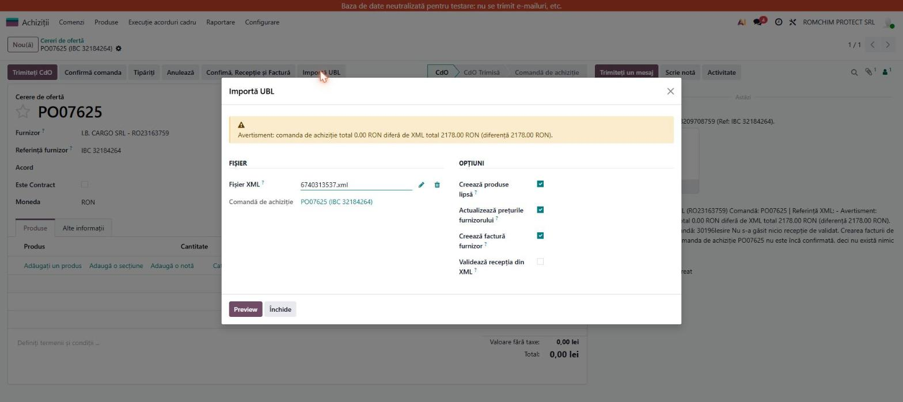
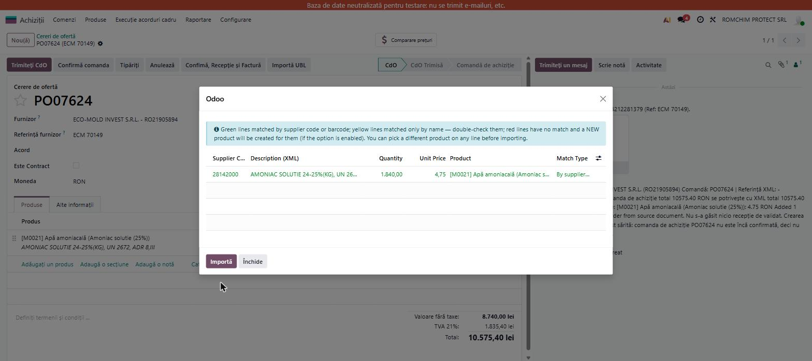
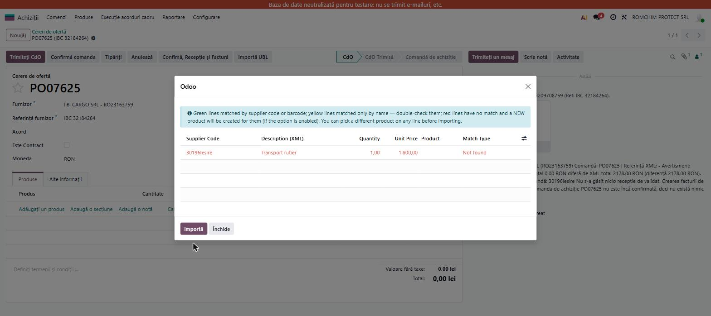
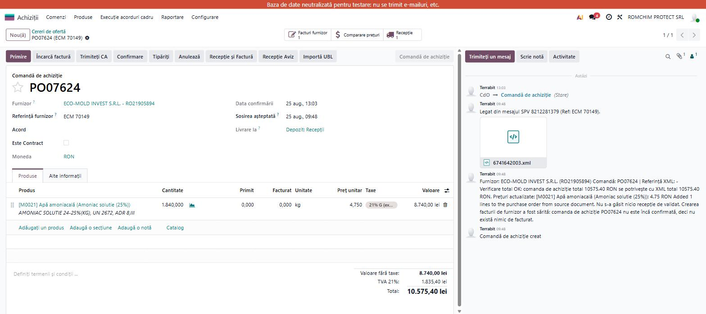

# Fișă Modul: Import factură furnizor din XML UBL pe comanda de achiziție

**Modul:** `deltatech_purchase_ubl`
**Utilizator principal:** Operator achiziții, contabil furnizori
**Versiune documentată:** 19.0.1.3.0
**Prioritate:** 🔴 Ridicată (parte din fluxul standard de facturare furnizori prin SPV/e-Factura pentru produse stocabile)

---

## 1. Scop business

Modulul importă o factură de furnizor primită ca XML UBL (formatul standard e-Factura/SPV) și
folosește conținutul ei pentru a actualiza automat comanda de achiziție: adaugă sau completează
liniile, actualizează prețurile de furnizor, validează recepția de stoc și poate crea direct
factura de furnizor (ciornă), asociată comenzii.

Cel mai frecvent punct de intrare este automat: când modulul `l10n_ro_message_spv_purchase`
creează o comandă de achiziție dintr-un mesaj SPV și atașează XML-ul facturii pe acea comandă,
`deltatech_purchase_ubl` rulează automat importul (headless), fără intervenția operatorului.
Modulul poate fi folosit și manual, din bara de sus a oricărei comenzi de achiziție, prin butonul
**Importă UBL**.

Din versiunea **19.0.1.3.0** (ticket #9315), fluxul manual are un pas suplimentar de
**previzualizare**: înainte de a scrie ceva pe comandă, operatorul vede o listă cu fiecare linie
din factură, produsul pe care sistemul l-a identificat automat și cât de sigură este acea
identificare (culoare verde/galben/roșu — vezi secțiunea 6). Fluxul automat (din mesajul SPV)
**nu** trece prin acest ecran — rulează headless, dar de la aceeași versiune nu mai creează
produse noi în tăcere atunci când nu găsește o potrivire sigură (vezi secțiunea 9).

## 2. Bază legală și context

Modulul nu are temei legal propriu — este un instrument tehnic de import. Contextul legal vine din
obligația de facturare electronică prin **RO e-Factura/SPV**: furnizorul trimite factura la ANAF
în format UBL XML, iar acest XML este sursa de adevăr pe care modulul o folosește pentru a
actualiza comanda de achiziție și pentru a genera factura de furnizor în Odoo.

> Modulul **nu** decide regimul de TVA sau înregistrarea contabilă — el doar populează liniile
> comenzii/facturii cu datele din XML (cantitate, preț, procent TVA, discount). Cotele de TVA
> aplicate pe factura de furnizor sunt cele configurate pe produse/taxe în Odoo, ajustate — dacă e
> cazul — la procentul declarat în XML (secțiunea 4).

## 3. Utilizatori și roluri

Operator achiziții (rulează importul manual, revizuiește previzualizarea), contabil furnizori
(verifică factura ciornă creată din import), responsabil date de bază produse (configurează codul
de furnizor pe produse, pentru ca potrivirea automată să funcționeze).

Roluri recomandate pentru testare:
- Administrator funcțional: instalează modulul, verifică dependențele (`purchase_stock`, `account`)
- Utilizator operațional (Achiziții / Utilizator): rulează Importă UBL, revizuiește previzualizarea
- Contabil/manager: verifică și confirmă factura de furnizor creată din import

## 4. Conturi și date implicate

Modulul nu impune conturi proprii. Liniile importate devin linii normale de comandă de achiziție,
deci la facturare se folosesc conturile standard din categoria de produs (`371`/`302` etc.) și
`4426` pentru TVA deductibilă, ca la orice factură de achiziție.

Elemente specifice pe care modulul le scrie/actualizează, relevante pentru verificare:
- **Preț furnizor** (`product.supplierinfo.price`) — actualizat din XML dacă opțiunea
  **Actualizează prețurile de furnizor** este bifată (implicit activă);
- **Discount pe linie** — extras din elementul XML `AllowanceCharge` (`ChargeIndicator=false`) și
  aplicat ca procent pe linia comenzii; prețul brut (`PriceAmount`) rămâne pe `price_unit`, iar
  discountul e separat, în câmpul `discount`;
- **Cota de TVA pe factura de furnizor** — dacă XML-ul declară un procent diferit de cel implicit
  pe produs, modulul caută o taxă de achiziție cu procentul respectiv și o aplică pe linia
  facturii;
- **Verificare total** — totalul comenzii este comparat cu totalul din XML
  (`PayableAmount`/`TaxInclusiveAmount`, cu fallback pe valoarea fără TVA); o diferență generează
  un avertisment vizibil în fereastra de import, nu blochează procesul.

Date minime pentru demo (scenariul folosit și în capturi):
- companie românească cu localizarea contabilă instalată;
- un **furnizor** cu cod de furnizor completat pe cel puțin un produs (`product.supplierinfo.product_code`), pentru a obține o potrivire verde;
- un produs stocabil fără cod de furnizor configurat, pentru a demonstra cazul roșu (nepotrivit);
- un fișier XML UBL valid (factură e-Factura reală sau de test), atașat pe comanda de achiziție.

## 5. Configurare inițială

1. Instalați modulul `deltatech_purchase_ubl` (dependențe: `purchase_stock`, `account`).
2. Nu există ecran de configurare dedicat; parametrul de sistem
   `deltatech_purchase_ubl.auto_import` (implicit `True`) controlează dacă importul headless
   rulează automat la atașarea unui XML UBL pe o comandă de achiziție (util pentru a-l dezactiva
   temporar, ex. la depanare).
3. Pentru ca potrivirea automată să funcționeze cu încredere (linie verde), completați **codul de
   furnizor** (fila Achiziții a produsului, sau `product.supplierinfo.product_code`) sau
   **codul de bare** pe produsele cumpărate frecvent de la fiecare furnizor.
4. Drepturi: rularea manuală a importului cere drept de scriere pe comenzi de achiziție
   (Achiziții / Utilizator); crearea de produse noi din import cere și drept de creare pe produse.

## 6. Flux de utilizare

### Pasul 1 — Import manual din comanda de achiziție

Deschideți comanda de achiziție cu XML-ul UBL deja atașat (sau atașați-l acum) și apăsați butonul
**Importă UBL** din bara de sus.

### Pasul 2 — Previzualizare (Preview) — nou în 19.0.1.3.0

Apăsați **Preview**. Se deschide un tabel cu o linie per articol din XML: Cod furnizor, Descriere,
Cantitate, Preț unitar, Produs identificat, Match Type. Liniile sunt colorate după cât de sigură
este potrivirea:

- **Verde** — produs găsit după cod de furnizor sau cod de bare (sigur, se poate importa direct);
- **Galben** — produs găsit doar după numele din XML (de verificat manual dacă e cel corect);
- **Roșu** — niciun produs găsit; dacă rămâne bifată **Creează produse lipsă**, se va crea un
  produs nou la import.

Pe orice linie se poate alege manual alt produs din listă înainte de a confirma — alegerea
manuală înlocuiește potrivirea automată (`match_type` devine „Chosen manually”).

### Pasul 3 — Confirmarea importului

Apăsați **Importă**. Liniile confirmate în previzualizare sunt scrise pe comanda de achiziție:
liniile existente sunt actualizate (cantitate, preț, discount), iar liniile ale căror produse nu
erau deja pe comandă sunt adăugate ca linii noi — nu mai sunt ignorate silențios, ca în versiunile
mai vechi.

### Pasul 4 — Actualizări conexe la import

În funcție de opțiunile bifate în wizard (active implicit: **Actualizează prețurile de furnizor**,
dezactivate implicit: **Validează recepția**, **Creează factură furnizor**):
- prețurile de furnizor sunt actualizate din XML;
- recepția de stoc asociată comenzii poate fi validată automat cu cantitățile din XML;
- se poate crea direct factura de furnizor (ciornă), legată de comandă.

Jurnalul afișat la final (`log`/`log_html`) listează exact ce s-a întâmplat: prețuri actualizate,
produse create, linii adăugate/actualizate, linii nepotrivite, rezultatul verificării totalului și
rezultatul creării facturii.

### Pasul 5 — Factura de furnizor creată automat

Dacă la comandă apare smart-butonul **Facturi furnizor**, factura ciornă a fost creată — se
deschide, se verifică liniile și taxele preluate din XML, apoi se confirmă.

> **Atenție — creare automată doar dacă comanda era deja confirmată.** Factura de furnizor se
> creează automat (fie la import manual cu opțiunea bifată, fie la import headless dintr-un mesaj
> SPV) doar dacă, în momentul importului, comanda de achiziție avea deja starea „Comandă” sau
> „Efectuată”. Pe o comandă încă neconfirmată (cazul tipic: comandă nouă, creată direct din
> mesajul SPV), sistemul sare peste crearea facturii și scrie explicit motivul în jurnal —
> confirmarea ulterioară a comenzii **nu** declanșează retroactiv crearea facturii; e nevoie fie de
> butonul **Încarcă factura**, fie de relansarea **Importă UBL** (Preview → Importă) cu opțiunea
> **Creează factură furnizor** bifată.

## 7. Legături cu alte module / declarații

| Modul / proces | Rol în flux | Tip legătură |
|---|---|---|
| `purchase_stock` | comenzi de achiziție + recepții de stoc pe care modulul le actualizează | dependență (manifest) |
| `account` | facturi de furnizor create din import | dependență (manifest) |
| `l10n_ro_message_spv_purchase` | atașează automat XML-ul facturii SPV pe comanda de achiziție creată/identificată din mesaj — declanșează importul headless | modul separat, principal punct de intrare automat |
| `purchase.invoice.import.mixin` | logica de potrivire produse / actualizare prețuri / creare factură, partajată și cu alte wizard-uri de import (PDF Marso, Delta, Sigemo, Procar) | infrastructură internă (abstract model, definit în acest modul) |

Ce este automat: potrivirea produsului (cod de bare → cod de furnizor → nume), actualizarea
prețurilor de furnizor, adăugarea liniilor lipsă pe comandă, aplicarea discountului din XML,
verificarea totalului, crearea facturii de furnizor (când comanda e confirmată).

Ce rămâne manual: configurarea codului de furnizor pe produse (pentru potrivire sigură), revizuirea
liniilor galbene/roșii din previzualizare, confirmarea comenzii înainte de import dacă se dorește
factură automată, verificarea și confirmarea facturii ciornă create.

**Limitări cunoscute — de comunicat clientului:**

1. **Fluxul headless (automat, din SPV) nu trece prin previzualizare.** Din 19.0.1.3.0 nu mai
   creează produse noi în tăcere pe acest flux, dar liniile nepotrivite rămân neasociate pe comandă,
   cu avertisment în chatter — necesită completare manuală prin **Importă UBL → Preview** (vezi
   fișa de manual, punctul 8 din articolul „Gestionare facturi furnizori prin Mesaje SPV”).
2. **Crearea facturii nu e retroactivă.** Vezi avertismentul din Pasul 5 — confirmarea ulterioară a
   comenzii nu generează automat factura ratată la momentul importului.
3. **Când comanda are deja linii, liniile noi din XML care nu corespund unui produs deja de pe
   comandă sunt adăugate ca linii noi** (comportament din 19.0.1.2.1) — nu mai sunt ignorate, dar
   operatorul trebuie să verifice că adăugarea e corectă (ex. o linie de tip „Ecovaloare” apărută
   doar pe factură).
4. **Verificarea totalului este strict informativă** — o diferență între totalul comenzii și cel
   din XML doar afișează un avertisment, nu blochează importul sau confirmarea facturii.

## 8. Verificări pentru consultant

- [ ] Modulul se instalează fără erori (dependențe `purchase_stock`, `account` prezente).
- [ ] Butonul **Importă UBL** este vizibil pe bara de sus a comenzii de achiziție.
- [ ] La apăsarea **Preview**, liniile din XML apar colorate corect (verde/galben/roșu) după tipul
      de potrivire.
- [ ] Pe o linie roșie/galbenă, alegerea manuală a altui produs schimbă `match_type` în „Chosen
      manually” și acel produs e cel scris pe comandă la **Importă**.
- [ ] La **Importă**, liniile deja existente pe comandă sunt actualizate (cantitate/preț/discount),
      iar liniile noi sunt adăugate, nu ignorate.
- [ ] Prețurile de furnizor (`product.supplierinfo`) sunt actualizate din XML când opțiunea e
      bifată.
- [ ] Discountul din `AllowanceCharge` (XML) apare corect pe procentul liniei comenzii.
- [ ] Verificarea totalului afișează avertisment când există diferență între comandă și XML.
- [ ] Pe fluxul automat (din mesaj SPV, comandă neconfirmată), importul headless **nu** creează
      produse noi pentru liniile nepotrivite — apare avertisment în chatter.
- [ ] Factura de furnizor se creează automat **doar** dacă la momentul importului comanda era deja
      confirmată; pe o comandă neconfirmată, jurnalul explică de ce a fost sărită crearea.
- [ ] Confirmarea ulterioară a comenzii nu declanșează retroactiv crearea facturii ratate — necesar
      **Încarcă factura** sau relansarea **Importă UBL**.
- [ ] Cota de TVA de pe factura de furnizor reflectă procentul declarat în XML, dacă diferă de cel
      implicit pe produs.

## 9. Mesaje de eroare frecvente

| Simptom | Cauză probabilă | Remediere |
|---|---|---|
| „Please select an XML file.” | Wizard-ul a fost deschis fără fișier atașat | Atașați fișierul XML UBL înainte de Preview/Importă |
| „Invalid XML: ...” | Fișierul atașat nu e XML valid sau e corupt | Verificați sursa fișierului; redescărcați din mesajul SPV/ANAF |
| „No vendor found for supplier VAT ... / name ...” | XML-ul nu identifică un furnizor existent în Odoo și importul nu a fost lansat din contextul unei comenzi | Lansați importul din comanda de achiziție (butonul Importă UBL) sau creați furnizorul înainte |
| Linie roșie în previzualizare, dar produsul există în Odoo | Produsul nu are codul de furnizor sau codul de bare din XML configurat pe fișa lui | Completați `product.supplierinfo.product_code` sau codul de bare, apoi refaceți Preview |
| Produs nou creat automat, deși nu era de dorit | Opțiunea **Creează produse lipsă** era bifată la import (implicit activă în wizard-ul manual) | Debifați opțiunea înainte de Importă, sau alegeți manual produsul corect pe linia din Preview |
| Linia dintr-un mesaj SPV rămâne neasociată, fără produs creat | Comportament așteptat din 19.0.1.3.0 pe fluxul automat (context `purchase_ubl_no_new_products`) — nu e o eroare | Completați linia manual din comandă, prin Importă UBL → Preview |
| Factura de furnizor nu apare deși importul a rulat | Comanda nu era confirmată în momentul importului (vezi Pasul 5) | Confirmați comanda, apoi **Încarcă factura** sau relansați Importă UBL cu „Creează factură furnizor” bifat |
| „Vendor bill already exists for this invoice reference” | Există deja o factură nu-anulată cu aceeași referință pentru acest furnizor | Verificați factura existentă înainte de a relansa importul |
| Avertisment de diferență la verificarea totalului | Totalul comenzii nu coincide cu `PayableAmount`/`TaxInclusiveAmount` din XML | Verificați liniile, discounturile și taxele; diferența nu blochează, dar trebuie investigată |

## 10. Capturi de ecran

Capturile (`readme/screenshots/`) au fost realizate **manual**, pe baza de test Romchim staging
(Odoo 19), în limba română — nu există încă un test automat de capturi (`test_screenshots.py`) pentru
acest modul, spre deosebire de alte module Deltatech:

| # | Fișier | Conținut |
|---|--------|----------|
| 1 | `screenshots/02_fereastra_importa_ubl.jpg` | Fereastra „Importă UBL”, cu fișierul XML deja atașat și butonul Preview |
| 2 | `screenshots/03_preview_linie_verde.jpg` | Previzualizare — linie VERDE, produs găsit după codul de furnizor (Match Type: By supplier code) |
| 3 | `screenshots/04_preview_linie_rosie.jpg` | Previzualizare — linie ROȘIE, niciun produs găsit (Match Type: Not found) |
| 4 | `screenshots/01_avertisment_linii_neasociate.jpg` | Comandă creată automat din mesaj SPV, cu avertisment în chatter pentru liniile neasociate |
| 5 | `screenshots/05_comanda_confirmata_factura.jpg` | Comandă confirmată, cu smart-butonul „Facturi furnizor” apărut după relansarea Importă UBL |

Notă: nu există încă o captură pentru cazul galben (potrivire doar după nume) — se poate adăuga
ulterior dacă se identifică un exemplu pe staging.

## 11. Observații pentru manual

Documentația orientată pe utilizator pentru fluxul automat (din mesaj SPV) este deja actualizată în
manualul intern, articolul „Gestionare facturi furnizori prin Mesaje SPV”, punctul 8
(https://www.terrabit.ro/odoo/knowledge/686). Această fișă de consultant completează manualul cu
perspectiva de configurare/depanare a modulului `deltatech_purchase_ubl` însuși — nu duplică pașii
din manual, ci le adaugă contextul tehnic (conturi, limitări, mesaje de eroare) util la
implementare și suport.
