# Fișă Modul: Retururi și garanții (RMA)

**Modul:** `deltatech_rma`
**Versiune:** 19.0.1.3.0
**Suită:** bitshop
**Dependențe:** `sale_stock`, `portal`, `stock_delivery` (aduce și `delivery`)

---

## 1. Scop business

Clientul cere returul unui produs direct din comanda lui, iar cererea trece printr-un flux cu
decizie: noi aprobăm sau refuzăm, primim coletul, verificăm marfa și spunem ce se întâmplă cu ea.

Odoo nu are RMA. Ce are este wizardul de retur pe o livrare, pornit de un coleg din depozit, și
panoul After-Sales din Helpdesk Enterprise. Niciunul nu-i dă clientului o cale să **ceară** returul
și niciunul nu cunoaște o politică de retur.

Ce aduce modulul, în ordinea în care se vede:

- cererea deschisă de client din portal, per linie de comandă, cu poze;
- **fișa de retur PDF cu cod de bare**, trimisă pe mail, pe care clientul o pune în colet;
- **recepția coletului prin scanare**: un singur câmp, codul de pe fișă sau AWB-ul;
- verdict per produs și repunerea în stoc doar a ce e bun, prin transferul standard de retur;
- politica de retur ca date: taxă, poze obligatorii, cine plătește transportul, per motiv.

## 2. Bază legală și context

Returul comercial **nu** e același lucru cu retragerea în 14 zile.

| | Retragere (Directiva 2011/83/UE) | Retur comercial / garanție |
|---|---|---|
| cine decide | consumatorul, unilateral | comerciantul, după verificare |
| motiv | interzis a fi cerut (art. 9) | obligatoriu |
| stare de aprobare | nu există | există |
| taxă reținută | nu | la returul comercial, dacă politica o prevede; la **garanția legală** (OUG 140/2021) remediile sunt în principiu gratuite pentru consumator — verificați juridic înainte de a pune taxă pe motivele de garanție |

Retragerea e acoperită de `deltatech_sale_withdrawal`, care **nu are** stare de aprobare, tocmai
pentru că nu are voie. Modulul acesta stă lângă el, nu peste el. Ce împart cele două e partea în
care legea tace: marfa se întoarce prin `stock.return.picking`, niciodată prin mișcări scrise de
mână.

Garanția legală de conformitate (OUG 140/2021, 2 ani) e valoarea implicită a ferestrei de
eligibilitate pentru cererile de tip garanție. Fereastra se schimbă din Setări, nu din cod.

## 3. Utilizatori și roluri

| Grup | Ce poate |
|---|---|
| **Retururi / Utilizator** | vede registrul, deschide cereri, aprobă, preia colete, pune verdicte, creează transferul de retur |
| **Retururi / Responsabil** | în plus: configurează motive, etichete și motive de închidere, șterge cereri |
| **Portal** | vede doar cererile proprii și ale firmei lui, trimite cereri și mesaje pe ele |

**La instalare, orice utilizator intern devine Utilizator de retururi**, inclusiv cei adăugați de
acum încolo — ca în `agroamat_retururi`. Dacă firma vrea să dea accesul doar unor oameni anume,
debifează *Toți utilizatorii interni lucrează cu retururi* în setări (vezi secțiunea 5); de atunci
grupul se atribuie de mână. O dezactivare rămâne dezactivată și după actualizarea modulului.

Regula de acces pe client e `child_of` pe partenerul comercial: un angajat al firmei client vede
cererile firmei, nu doar pe ale lui. Multi-companie: regulă globală pe `company_id`.

## 4. Conturi și date implicate

Modulul **nu** generează note contabile singur. Singurul document contabil pe care îl produce e o
**notă de credit în ciornă** (`account.move`, tip `out_refund`), pe valoarea rambursabilă:

```
valoare returnată − taxă de manipulare = valoare rambursabilă
```

Sumele cererii — *Total*, *Taxă de manipulare*, *De returnat clientului* — sunt **cu TVA**, la
prețul vândut (după discount): e suma pe care o primește clientul și pe care o citește în portal și
pe fișa de retur. Taxa de manipulare se ia din valoarea cu TVA.

Creditarea se face linie cu linie, cu **prețul, discountul și taxele liniei de factură** care a
facturat produsul, cu taxa de manipulare compusă în discount. Totalul notei, cu TVA, este la ban
suma de returnat clientului. Cu o singură factură, nota o **stornează**: îi poartă legătura
(`reversed_entry_id`), jurnalul, clientul, moneda și cursul, iar în referință apar cererea și
factura. La înregistrare, Odoo compensează automat nota cu factura, dacă aceasta e neîncasată; dacă e
încasată, nota rămâne credit de rambursat. Cu produse facturate pe mai multe facturi, o notă în
istoricul cererii îi cere contabilului să lege nota de factura potrivită.

La politica de facturare **„la livrare”**, cu returul fizic validat, liniile notei se leagă de
liniile comenzii: cantitatea livrată și cea facturată scad împreună, iar comanda nu mai propune o a
doua notă. La **„la comandă”** nota nu se leagă, tocmai ca, după ea, comanda să nu redevină „de
facturat” și marfa returnată să nu fie refacturată. Un produs **nefacturat** nu primește notă de
credit — nu are ce storna; se ajustează comanda. Nota rămâne în **ciornă**: o pregătim, nu o
înregistrăm în locul contabilului.

De știut pentru contabil: cu factură, nota ia prețul **de pe factură** — un preț modificat de mână pe
linia cererii nu se regăsește pe notă. La facturile în valută, nota preia cursul facturii; dacă pe
ciornă se completează de mână *Data facturii*, Odoo recalculează cursul la data aceea, iar cursul
operațiunii de bază (art. 282 alin. (9) Cod fiscal) trebuie pus înapoi.

La înregistrare, Odoo generează nota standard de stornare a vânzării (pct. 330 OMFP 1802/2014):

| Cont | Descriere | Dr | Cr |
|---|---|---|---|
| 707 (mărfuri) / 7015 (produse finite) | Venituri din vânzări — stornare | X | |
| 4427 (4428 la TVA la încasare) | TVA colectată — stornare | TVA | |
| 4111 | Clienți | | X + TVA |

TVA-ul se creditează cu **cota facturii inițiale** (art. 291 alin. (4) Cod fiscal): un retur în
garanție din 2026 al unei vânzări făcute înainte de 1.08.2025 se creditează cu 19%, nu cu 21%. Dacă
vânzarea returnată e din exercițiul financiar anterior și returul e cunoscut la data bilanțului,
contabilul face corecția la închidere prin 418 (pct. 330 alin. (1)).

**Taxa de manipulare** nu apare ca venit separat: micșorează valoarea creditată, iar TVA-ul pe
partea reținută rămâne colectat la cota facturii inițiale (reducere parțială a bazei, art. 287
lit. b) Cod fiscal) — varianta prudentă fiscal. Dacă termenii comerciali ai clientului definesc
reținerea ca **serviciu** (704, cu TVA) sau ca **penalitate** (7581, fără TVA, art. 286 alin. (4)
lit. b)), contabilul stornează linia integral și adaugă manual pe nota de credit taxa pe contul
potrivit. Încadrarea se stabilește cu contabilul clientului înainte de punerea în funcțiune.

**Reintrarea în stoc.** La validarea transferului de retur, cu evaluare automată pe categorie, Odoo
înregistrează reintrarea la costul de ieșire: **Dr 371 Mărfuri = Cr 607 Cheltuieli privind
mărfurile** (produse finite: Dr 345 = Cr 711), conform pct. 330 OMFP 1802/2014; la gestiunea ținută
la preț de vânzare se refac și 378 și 4428. Mișcările sunt legate de livrarea pe care o anulează
(`origin_returned_move_id`): fără legătura asta valorizarea nu poate reconcilia returul, iar costul
repus în stoc ar fi cel curent, nu cel cu care a ieșit.

Marfa cu verdict **„defect”** nu se repune în stocul vandabil, dar odată creditată clientului a
intrat fizic înapoi în patrimoniu: se primește într-o locație de defecte / rebuturi și iese apoi
prin retur la furnizor sau prin casare cu proces-verbal. Altfel costul rămâne pe 607 fără nicio
intrare în gestiune. Modulul nu face singur această intrare.

## 5. Configurare inițială

1. **Retururi → Configurare → Motive de retur** — politica. Fiecare motiv are categoria, intervalul
   taxei (minim / propus / maxim), dacă cere poze, cine plătește transportul și explicația pentru
   client. Un motiv bifat **Doar pentru colegi** se folosește numai din back office și nu apare
   niciodată în portal (livrat: „Alt motiv (de clarificat)”). Motivele livrate sunt un punct de
   plecare, cu `noupdate="1"`: ce schimbați rămâne.
2. **Vânzări → Configurare → Setări → Retururi și garanții** — cine are acces (toți utilizatorii
   interni sau doar cei aleși), fereastra de eligibilitate (luni pentru garanție, zile pentru retur),
   termenele promise clientului (în câte zile lucrătoare răspundem și în câte verificăm coletul; zero
   nu promite niciun termen), motiv obligatoriu sau opțional, taxa implicită.
3. **Produse** — bifa „Nu se poate returna” pe produsele de tip taxă și pe categoriile lor, ca să nu
   apară în formularul clientului. Linia de transport adăugată de metoda de livrare nu are nevoie de
   bifă: e exclusă automat.
4. **Setări → Tehnic → Șabloane e-mail** — cele trei mailuri (aprobat, refuzat, rezolvat) se pot
   adapta: telefonul firmei, formulări proprii, semnătura. Modificările rămân la actualizarea
   modulului.
5. **Retururi → Configurare → Etichete** și **Motive de închidere** — opțional, pentru raportare.
6. Verificați că firma are adresă completă și e-mail: fișa de retur tipărește adresa unde vine
   coletul, din `company_id.partner_id`.

## 6. Flux de utilizare

Fluxul are două jumătăți, cu utilizatori diferiți: clientul, în portalul lui, și echipa, în back
office. Fiecare pas de mai jos are ecranul lui în `readme/screenshots/`.

### Partea clientului

#### 6.1 De unde pleacă

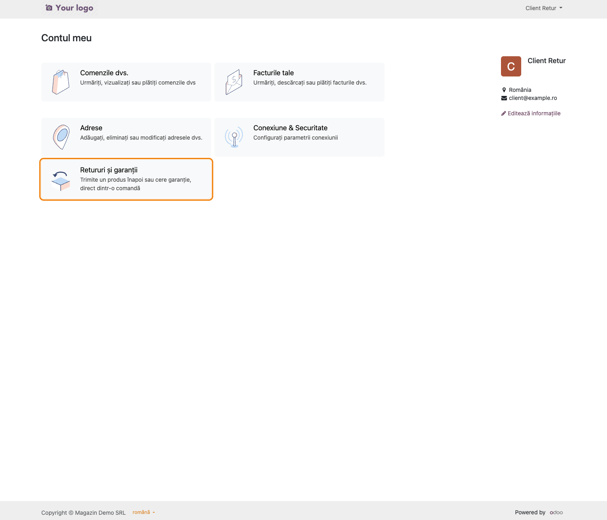

*Contul meu* → cardul **Retururi și garanții**, lângă comenzi și facturi. Mai există două intrări:
meniul din dreapta sus (*Retururile mele*, *Cere retur*) și butonul de pe pagina fiecărei comenzi
confirmate.

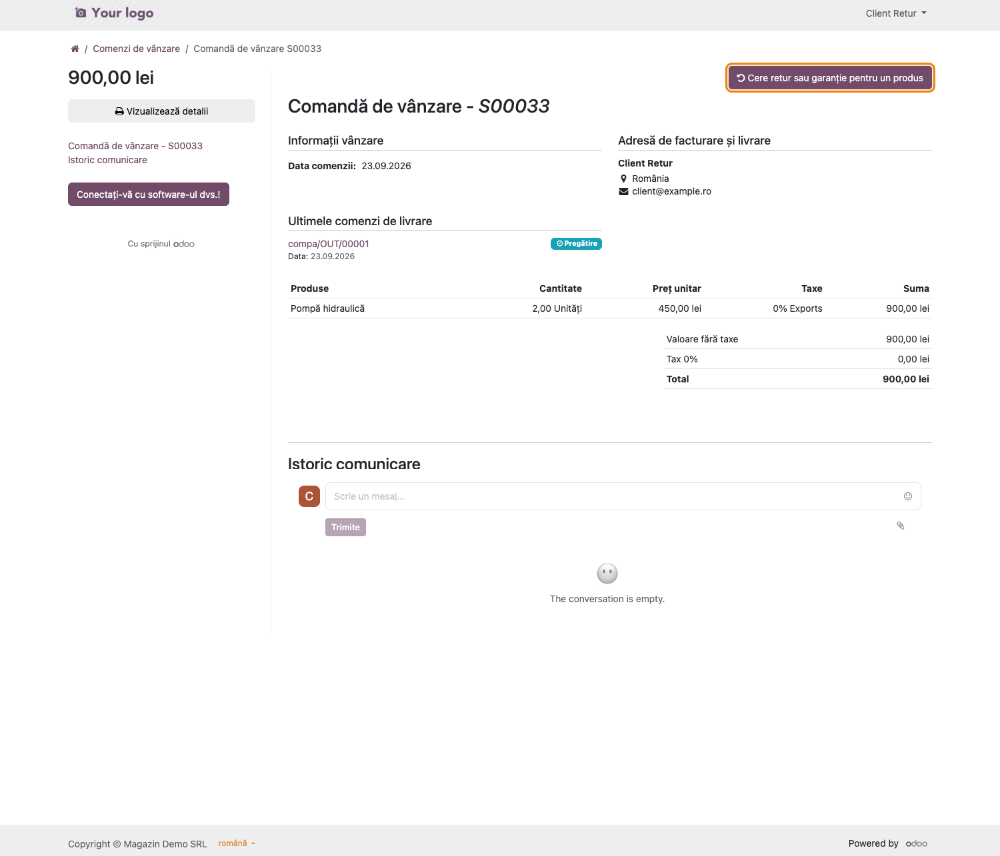

Butonul de pe comandă sare direct la pasul cu produsele, cu comanda deja aleasă.

#### 6.2 Ce s-a întâmplat

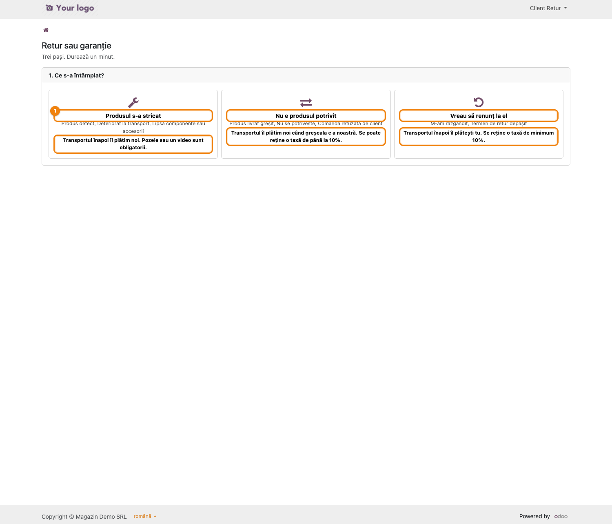

Trei cartonașe, nu o listă de motive. Sub fiecare scrie politica: cine plătește transportul, dacă
pozele sunt obligatorii, ce taxă se poate reține. **Textele se calculează din catalogul de motive**,
nu sunt scrise în șablon: dacă schimbați o taxă în configurare, se schimbă și ce citește clientul.

#### 6.3 Din ce comandă

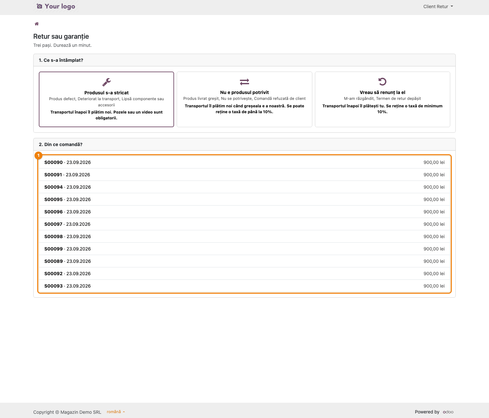

Doar comenzile lui confirmate, filtrate pe fereastra de eligibilitate a tipului ales. Pasul lipsește
dacă a intrat cu butonul de pe o comandă.

#### 6.4 Ce produse

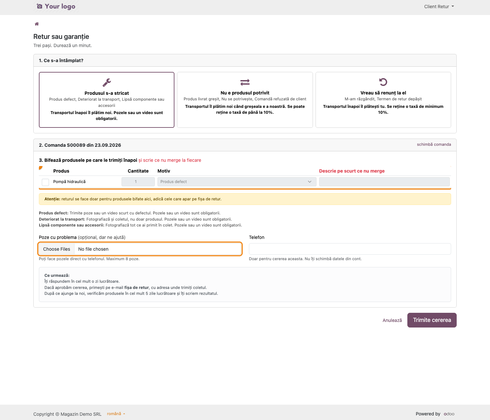

Bifează produsele, cantitatea, motivul per produs, descrierea și pozele. Nu apar în listă:
transportul, taxele, serviciile, produsele marcate „nu se poate returna" și ce a cerut deja pe altă
cerere. Cantitatea e plafonată la cât a cumpărat.

Eticheta câmpului de poze urmează motivul: „opțional” cât timp niciun produs bifat nu le cere,
„obligatorii la motivul ales” altfel. Când motivul cere poze și clientul n-a atașat niciuna, formularul **nu pleacă**: mesajul apare pe loc,
lângă câmpul de poze, fără drum la server. Serverul verifică oricum încă o dată — dacă pozele atașate
nu se pot deschide ca imagine, clientul se întoarce la formular cu un mesaj, nu rămâne cu o cerere
fără dovadă.

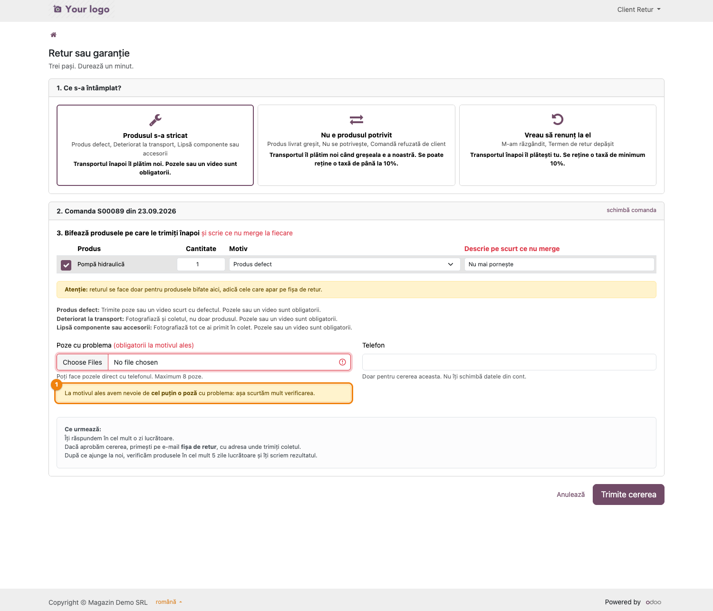

La returul de tip renunțare și la produsul greșit — cele care se pot încheia cu banii înapoi —
formularul cere și **IBAN-ul pentru rambursare**. E opțional: gol, echipa îl cere la rezolvare. Dacă e
completat, se verifică (țară, lungime, sumă de control), iar unul greșit întoarce clientul la formular.
Aceeași verificare se aplică în back office, când colegul îl tastează de la telefon.

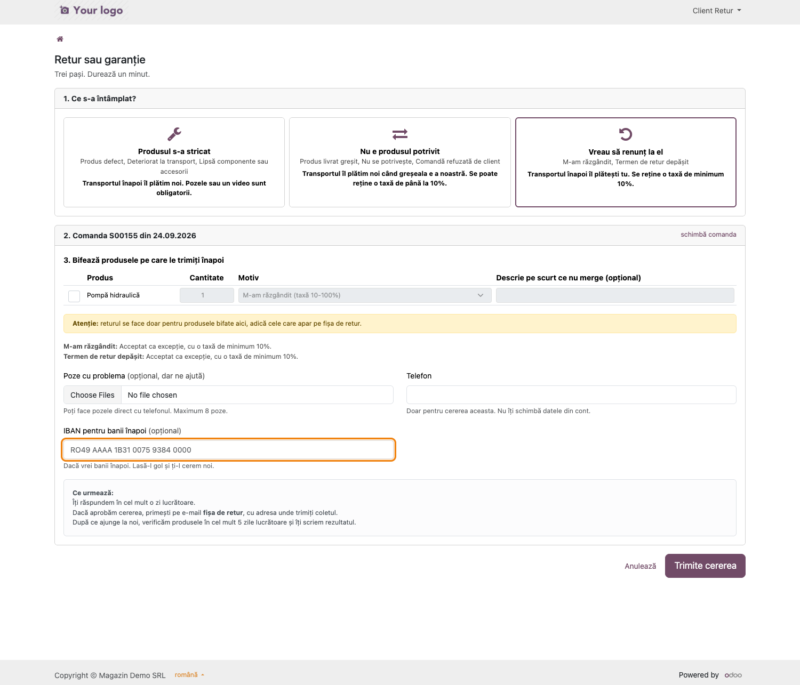

#### 6.5 Confirmarea

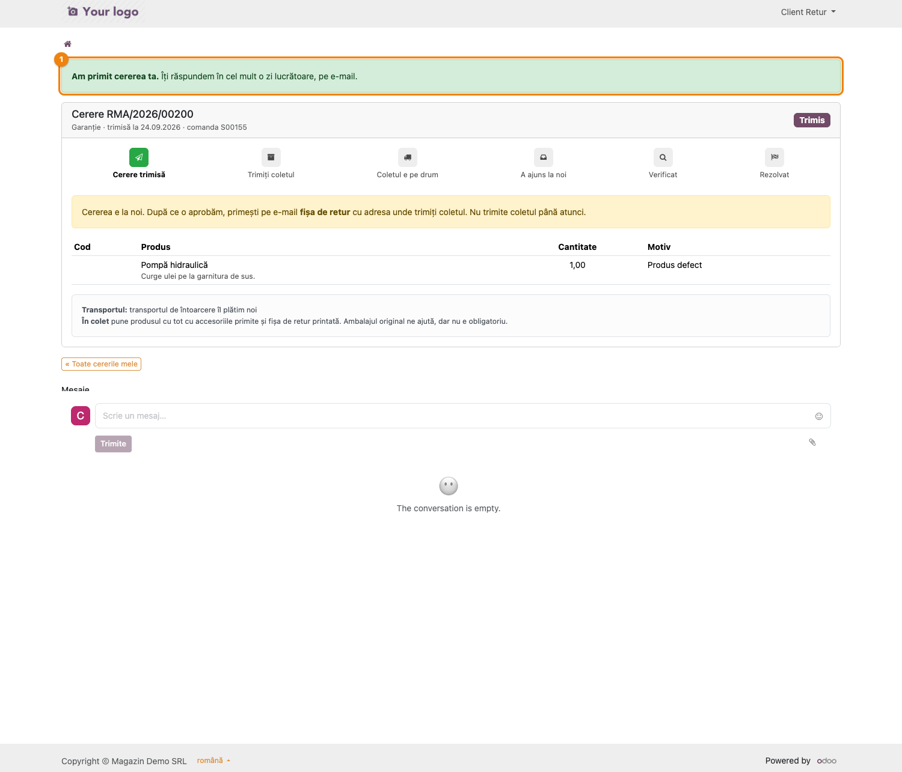

Banda cu șase pași îi arată unde e. Cât timp cererea e la noi, scrie explicit să **nu** trimită
coletul.

#### 6.6 Aprobată: fișa și AWB-ul

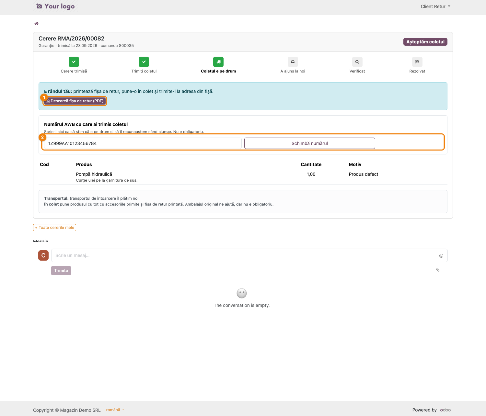

După aprobare descarcă **fișa de retur (PDF)** și își poate scrie numărul AWB. Când îl scrie, cererea
trece singură în „așteptăm coletul".

#### 6.7 Rezolvată

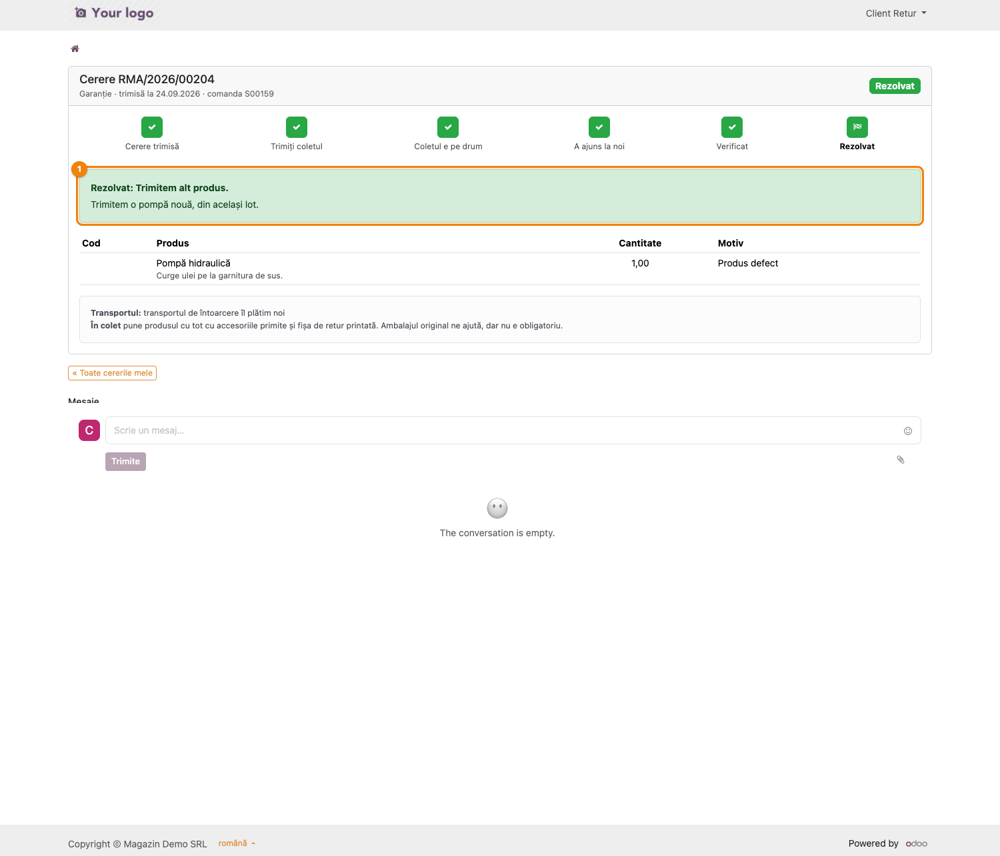

La final vede decizia și textul scris de noi, plus taxa reținută și suma care i se întoarce, dacă e
cazul.

### Partea echipei

#### 6.8 Fișa de retur

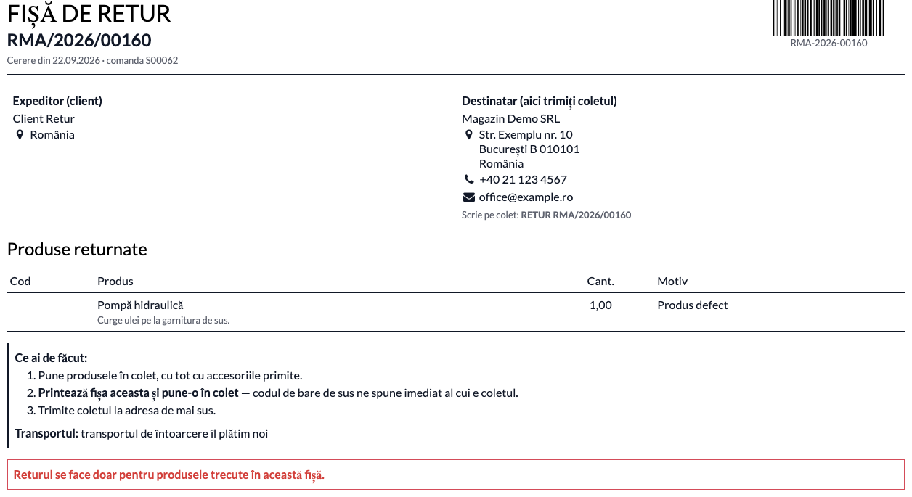

Pleacă atașată la mailul de aprobare. Codul de bare e chiar numărul cererii — de el se agață
recepția prin scanare.

#### 6.9 Registrul

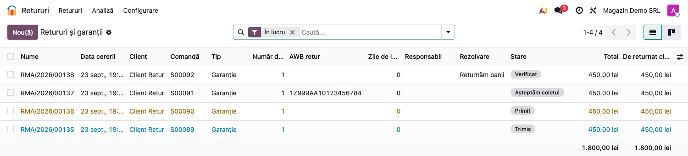

*Retururi → Retururi și garanții*, cu filtrul implicit „În lucru" și vârsta fiecărei cereri.
Filtrele gata făcute urmează fluxul — *De decis*, *Așteptăm coletul*, *De verificat* —, plus *Ale
mele*, *Urgent* și *Cu termenul depășit*. Steaua de pe cerere o marchează **Urgent**, iar
**Etichetele** o grupează după ce vrea echipa să urmărească (de exemplu un furnizor sau o campanie).

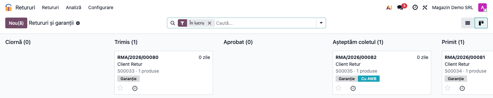

Aceleași cereri pe stări, pentru cine lucrează pe fluxul zilnic.

#### 6.10 Decizia

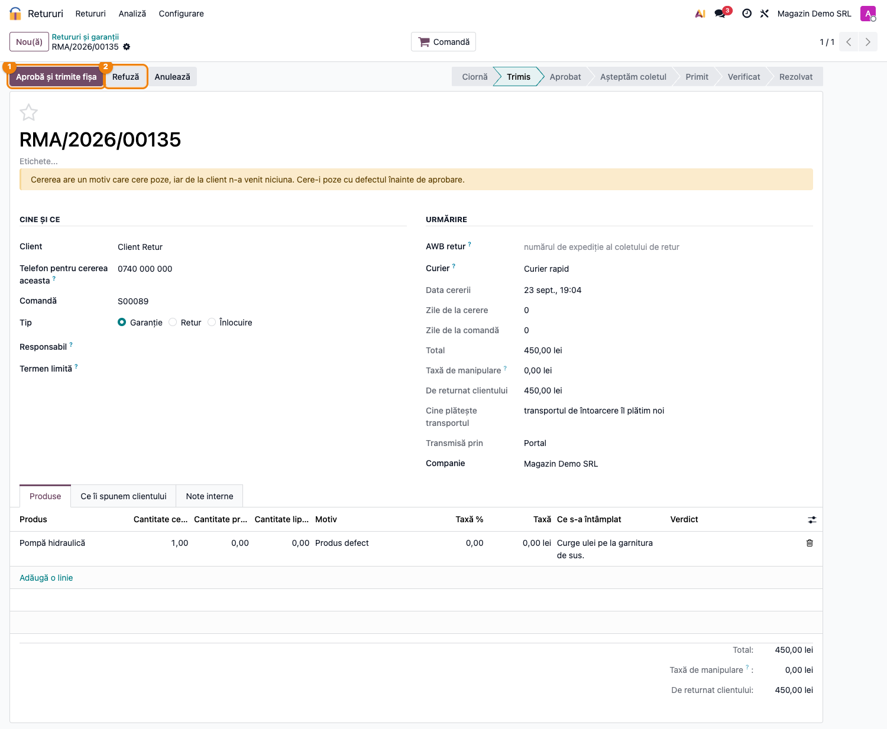

**Aprobă și trimite fișa** trimite clientului mailul cu fișa atașată. O cerere cu motiv care cere
poze, venită fără nicio poză, e semnalată pe formular înainte de aprobare; dacă o aprobați totuși,
rămâne o notă în istoricul cererii. **Refuză** închide cererea cu explicația scrisă de dumneavoastră.

Câmpul **Termen limită** e data până la care i-ați promis clientului un răspuns. La aprobare devine o
activitate pe responsabilul cererii (sau pe cine aprobă, dacă cererea n-are responsabil), cu data
aceea, ca termenul să nu depindă de memoria cuiva.

#### 6.11 Recepția coletului

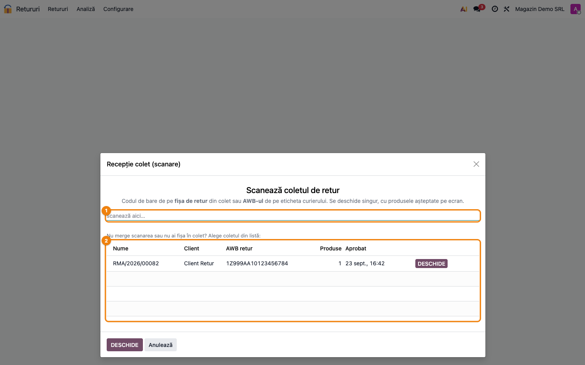

Un singur câmp. Se scanează codul de pe fișă sau AWB-ul; pistolul trimite Enter, iar cererea se
deschide singură. Spațiile, cratimele, slash-urile și literele mari/mici nu contează. Dacă fișa
lipsește din colet, coletul se alege din lista celor așteptate.

Trei cazuri în care ecranul nu deschide direct cererea:

- **Același AWB pe mai multe cereri** — ecranul afișează lista lor („Codul … se potrivește la N
  cereri. Alege-o pe cea din mână.”) și alegeți cererea; nu se alege la întâmplare prima.
- **Colet scanat a doua oară** — cererea deja primită nu-și schimbă starea; rămâne doar o notă în
  istoric („Coletul a fost scanat din nou la recepție.”).
- **Cerere închisă** (rezolvată, refuzată sau anulată) — scanarea e refuzată, cu motivul. Dacă a mai
  venit un colet pe ea, o deschideți din registru și apăsați **Redeschide**.

#### 6.12 Verificarea

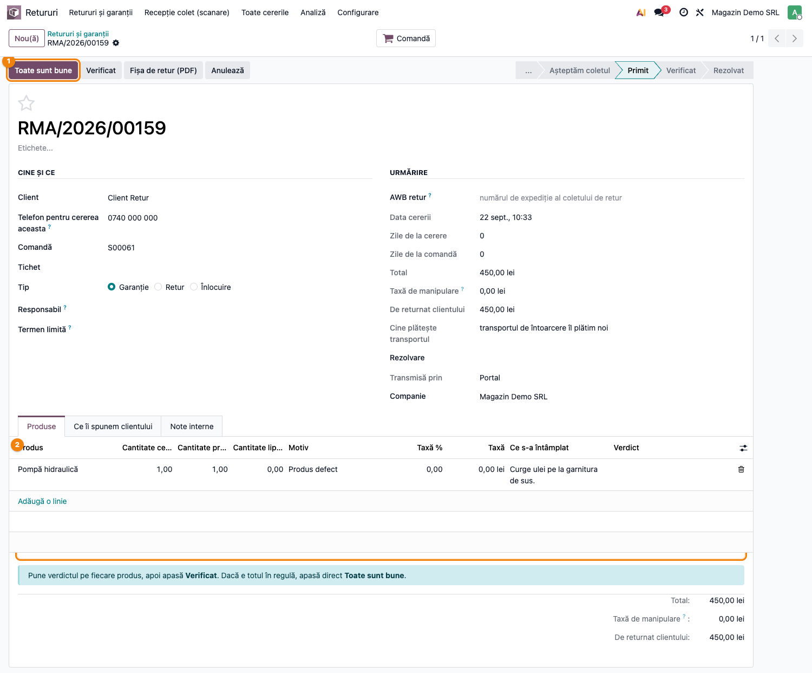

Cantitatea primită se pregătește cu cea cerută, iar lipsa se vede pe coloana ei. Verdictul se pune pe
fiecare produs; **Toate sunt bune** face coletul întreg dintr-o apăsare. Fără verdict pe fiecare
linie nu se trece mai departe.

#### 6.13 Rezolvarea

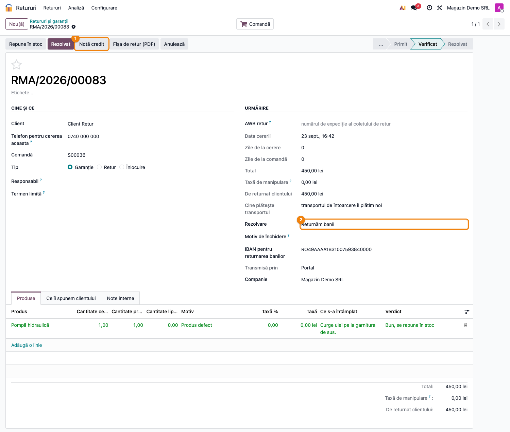

Înlocuire, reparație, banii înapoi sau refuz. Banii cer IBAN-ul. De aici pleacă nota de credit în
ciornă și comanda de înlocuire, tot în ciornă.

Când verificarea nu găsește defectul, **Trimite înapoi la client** returnează marfa așa cum a venit.
Transferul de ieșire pleacă pe **curierul cererii** — preluat de pe comandă, se poate schimba în
fișa cererii —, deci AWB-ul îl generează conectorul curierului, ca la orice livrare.

#### 6.14 Repunerea în stoc

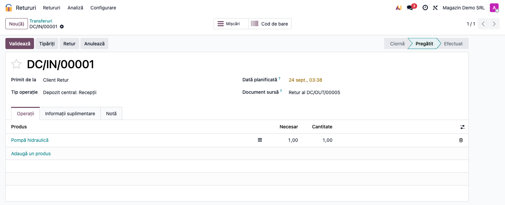

**Repune în stoc** creează transferul **numai** din liniile cu verdictul „bun". Observați
*Document sursă: Return of …* — legătura cu livrarea pe care o anulează. Marfa intră în stoc când
**validați** transferul, nu înainte.

### Configurarea

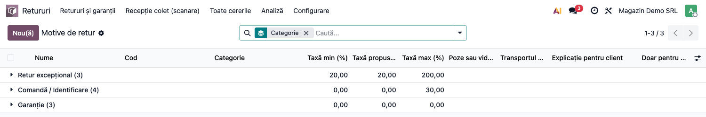

*Retururi → Configurare → Motive de retur*: politica întreagă, ca date. Taxa minimă / propusă /
maximă, pozele obligatorii, cine plătește transportul, explicația pentru client.

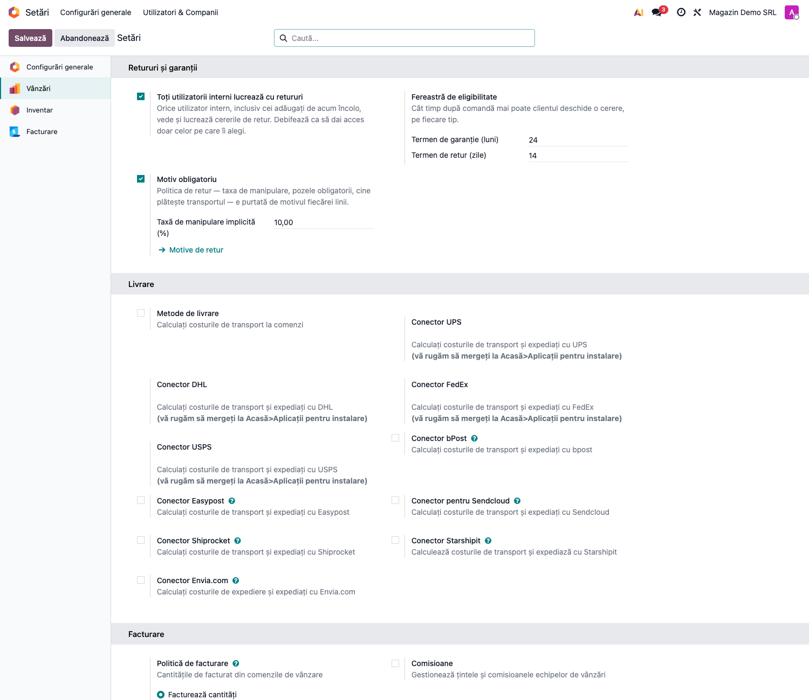

*Vânzări → Configurare → Setări → Retururi și garanții*: accesul colegilor, fereastra de
eligibilitate, termenele promise clientului, motivul obligatoriu sau opțional, taxa implicită.

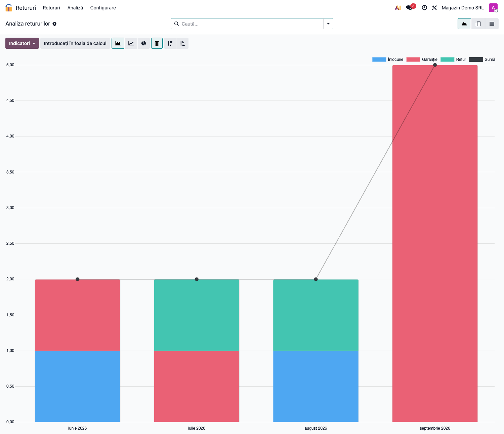

*Retururi → Analiză*: retururile pe luni și tipuri, iar pe liniile de retur, cantitatea returnată
față de cea vândută — adică rata de retur per produs.

## 7. Legături cu alte module / declarații

| Modul | Legătura |
|---|---|
| `deltatech_sale_withdrawal` | retragerea în 14 zile, act juridic diferit; model separat, intenționat |
| `deltatech_rma_withdrawal` (punte) | retragerea își ia fișa cu cod de bare și recepția prin scanare de aici, fără stare de aprobare și fără taxă |
| `deltatech_rma_lot` (punte) | lot / serie pe linia de retur, verificat față de ce s-a livrat clientului, dus pe transferul de retur |
| `deltatech_rma_helpdesk` (punte, `bitshop_ent`) | cerere de retur deschisă dintr-un tichet de Helpdesk, cu rezultatul scris înapoi pe tichet |
| `sale_stock` | comanda, livrarea, transferul de retur |
| `stock_delivery` / `delivery` | curierul cererii, preluat de pe comandă; transferul „trimite înapoi" pleacă pe el |
| `account` | nota de credit în ciornă |
| `deltatech_marketplace_sale` | `marketplace.return.request` e a treia entitate, a eMAG / Shopify; se leagă printr-o punte, nu se contopește |

Niciun raport ANAF nu se alimentează direct din acest modul. Nota de credit, odată înregistrată de
contabil, e o factură cu valori negative (art. 330 alin. (2) Cod fiscal):

- se transmite în **RO e-Factura**, în 5 zile lucrătoare, ca orice factură, B2B și B2C;
- trebuie să facă referire la factura inițială (art. 319 alin. (20) lit. r)) — nota pregătită de
  modul e legată de ea când produsele au fost facturate pe o singură factură; altfel contabilul o
  leagă înainte de înregistrare. În XML-ul e-Factura, trimiterea structurată (BillingReference) nu
  e completată încă de localizare din această legătură: verificați XML-ul la prima notă;
- reduce baza TVA în **D300** din perioada emiterii, cu cota facturii inițiale, și apare în **D394**
  și **D406** ca orice storno de vânzare.

## 8. Verificări pentru consultant

- [ ] Motivele de retur reflectă politica scrisă a clientului (taxă, poze, transport), confirmată
      de el, nu presupusă.
- [ ] Fereastra de eligibilitate e cea agreată; la garanție, cel puțin 24 de luni.
- [ ] Produsele de tip taxă și transport au bifa „Nu se poate returna”.
- [ ] Firma are adresă completă și e-mail — apar pe fișa de retur.
- [ ] Fișa de retur se tipărește corect, iar codul de bare se scanează cu pistolul clientului.
- [ ] Un retur de test intră în stoc cu **costul cu care a ieșit**, nu cu cel curent: verificați
      evaluarea pe transferul de retur.
- [ ] Nota de credit de test are prețul și TVA-ul facturii inițiale (inclusiv pe o linie cu
      discount), e legată de ea, iar totalul ei e suma *De returnat clientului* de pe cerere.
- [ ] Încadrarea taxei de manipulare (reducere de bază / serviciu 704 / penalitate 7581) e stabilită
      cu contabilul clientului.
- [ ] Există o locație pentru marfa cu verdict „defect” și o procedură de ieșire (retur la furnizor
      sau casare).
- [ ] Clientul de portal vede doar cererile lui: testați cu doi clienți diferiți.

## 9. Mesaje de eroare frecvente

| Mesaj | Ce înseamnă | Ce faceți |
|---|---|---|
| „Pune verdictul pe fiecare produs” | o linie a rămas fără verdict | completați verdictul sau apăsați *Toate sunt bune* |
| „Nimic de repus în stoc” | nicio linie cu verdict „bun” și cantitate primită legabilă de o livrare validată | verificați verdictele și dacă livrarea originală e validată |
| „Returul X e deja închis” | s-a scanat un colet pe o cerere finalizată | deschideți cererea din registru și redeschideți-o |
| „Nu găsesc nicio cerere cu codul …” | cod greșit sau cerere din altă companie | căutați clientul în registru |
| „Ca să dăm banii înapoi avem nevoie de IBAN” | decizie „banii înapoi” fără IBAN | completați IBAN-ul sau sunați clientul |
| „… de pe comanda … nu are nicio factură înregistrată, deci nu e nimic de creditat” | notă de credit cerută pe un produs nefacturat | ajustați comanda (cantitate, anulare) în loc de notă de credit |
| „La «motiv», taxa poate fi doar între X% și Y%” | s-a depășit intervalul motivului | schimbați procentul sau motivul |

## 10. Capturi de ecran

Cele 21 de capturi din `readme/screenshots/` sunt cele folosite în secțiunea 6, în ordinea fluxului:
zece de pe partea clientului (01–08, plus 05a fără poze și 05b cu IBAN-ul), șase de pe partea echipei (09–16) și trei de configurare și
analiză (17–19).

Se generează cu testul `tests/test_screenshots.py`, în română, pe planul de conturi RO:

```bash
./odoo/odoo-bin -c odoo.conf -d <db> -i deltatech_rma,l10n_ro_doc_screenshots \
    --test-tags=fise_screenshots --stop-after-init
```

Testul își face singur datele: client de portal, comenzi livrate, cereri în fiecare stare, un
transfer de retur și puțin istoric, ca ecranul de analiză să arate o distribuție, nu o singură bară.

## 11. Observații pentru manual

- Insistați, la instruire, pe **fișa din colet**: fără ea recepția prin scanare se face pe AWB, iar
  dacă nici AWB-ul n-a fost declarat, coletul se caută de mână. Fișa e ce face diferența.
- Taxa de manipulare se discută **înainte** de implementare, cu cifre. E singura parte a modulului
  care produce discuții cu clienții finali.
- Transferul de retur rămâne nevalidat până îl validează cineva. Asta e intenționat: marfa se
  numără fizic înainte să intre în stoc.
