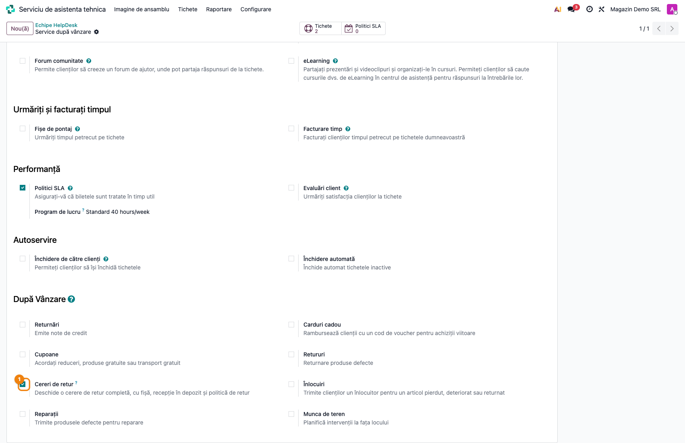
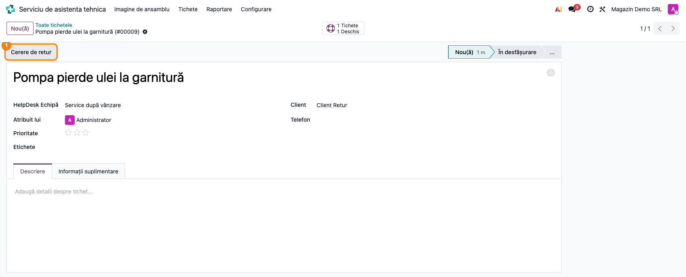
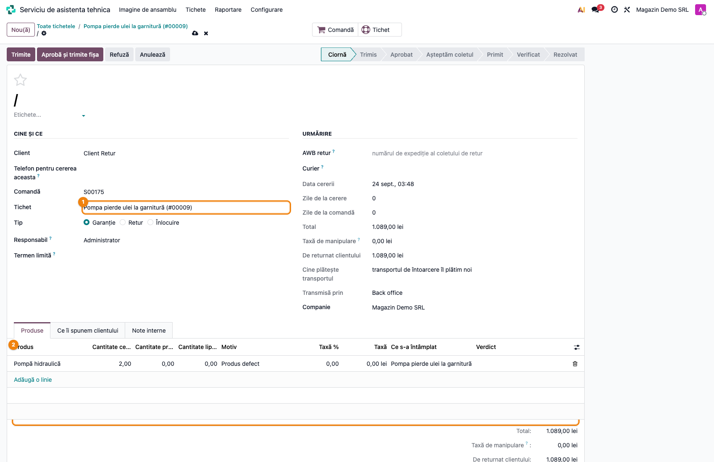
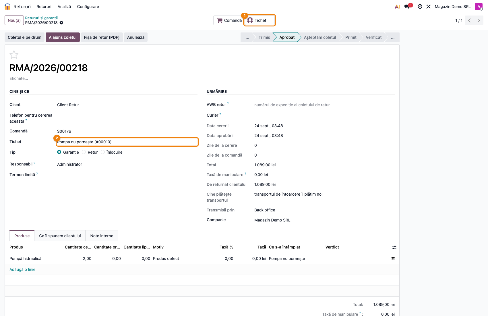
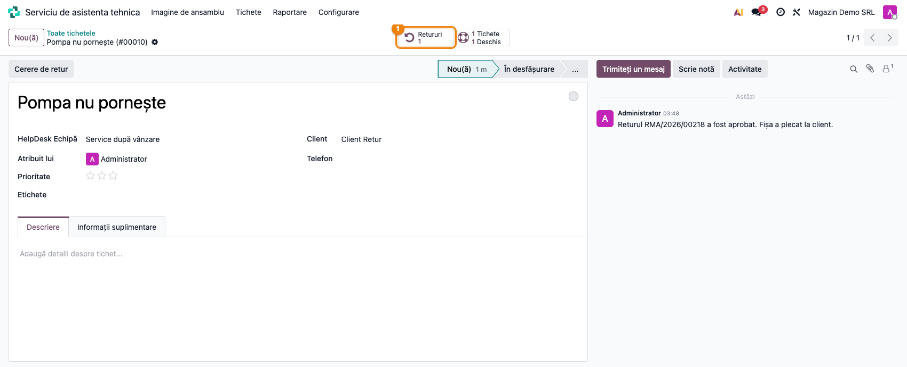

# Fișă Modul: Cerere de retur din tichetul de Helpdesk (RMA Helpdesk)

**Modul:** `deltatech_rma_helpdesk`
**Versiune:** 19.0.1.0.2
**Suită:** bitshop_ent (Enterprise)
**Dependențe:** `deltatech_rma`, `helpdesk_sale`

---

## 1. Scop business

Helpdesk-ul îi răspunde clientului; puntea aceasta răspunde de colet.

Un tichet e o conversație. Un retur e un document: linii cu cantități, un motiv care poartă o
politică, o fișă care călătorește în colet, un verdict pe fiecare produs și banii la final. Panoul
After-Sales din Odoo îi dă tichetului wizardul standard de retur; puntea îi dă în schimb o cerere de
retur completă, din `deltatech_rma`, și le leagă pe cele două.

## 2. Bază legală și context

Nicio obligație legală nouă. Regulile returului — motivul, taxa, pozele, garanția — sunt cele din
`deltatech_rma`; tichetul doar deschide cererea și primește rezultatul.

## 3. Utilizatori și roluri

Butonul și contorul de pe tichet se văd doar utilizatorilor cu **Retururi / Utilizator** — adică, în
configurarea implicită a `deltatech_rma`, oricărui utilizator intern. Agentul de suport nu are nevoie
de alt drept ca să deschidă o cerere de retur.

## 4. Conturi și date implicate

Puntea nu generează note contabile. Nota de credit, dacă e cazul, se pregătește din cererea de
retur, ca în fișa `deltatech_rma`.

## 5. Configurare inițială

**Helpdesk → Configurare → Echipe HelpDesk** → echipa → secțiunea **După Vânzare** → **Cereri de retur**.



Bifa e proprie, nu *Retururi* a Odoo: aceea instalează `helpdesk_stock` și aduce wizardul standard
de retur pe livrare. Cele două pot sta împreună, dar echipa le alege separat — activarea uneia nu o
impune pe cealaltă.

## 6. Flux de utilizare

#### 6.1 Butonul de pe tichet



Pe un tichet al unei echipe cu bifa activă și cu client completat apare butonul **Cerere de retur**
(scurtătură *Alt+Shift+R*). Fără client pe tichet, butonul nu apare: o cerere de retur e întotdeauna a
cuiva.

#### 6.2 Formularul precompletat



Butonul deschide formularul cererii, **nesalvat**, completat cu ce știe deja tichetul: clientul,
comanda de vânzare de pe tichet, tichetul însuși și liniile de pe comandă care se pot returna, cu
cantitatea disponibilă și titlul tichetului ca descriere. Agentul alege motivul și ajustează
cantitățile. Cererea primește număr abia la salvare — o apăsare greșită nu consumă un număr de RMA
și nu lasă o cerere goală în registru.

Fără comandă pe tichet, formularul se deschide doar cu clientul și tichetul, iar liniile se adaugă
de mână.

#### 6.3 Legăturile în ambele sensuri



Cererea are câmpul **Tichet** și butonul cu același nume; în registrul de retururi se poate căuta
după tichet. Dacă tichetul se șterge, cererea de retur rămâne — doar legătura se golește.

#### 6.4 Rezultatul scris pe tichet



Tichetul are contorul **Retururi**. La aprobare, refuz și rezolvare, cererea scrie rezultatul în
istoricul tichetului:

- „Returul … a fost aprobat. Fișa a plecat la client.”
- „Returul … a fost refuzat.”
- „Returul … a fost rezolvat: …” (cu rezolvarea aleasă)

Agentul de suport citește rezultatul fără să deschidă returul.

## 7. Legături cu alte module / declarații

| Modul | Legătura |
|---|---|
| `deltatech_rma` | cererea de retur, fișa, recepția, verdictele, nota de credit |
| `helpdesk_sale` | comanda de vânzare de pe tichet, din care se precompletează liniile |

Niciun raport ANAF nu se alimentează din această punte.

## 8. Verificări pentru consultant

- [ ] Bifa **Cereri de retur** e activă pe echipele care primesc reclamații de produs.
- [ ] Un tichet de test cu comandă deschide formularul cu liniile comenzii.
- [ ] Aprobarea cererii apare în istoricul tichetului.
- [ ] Dacă echipa folosește și *Retururi* din Odoo, e clar pentru agenți când se
      folosește care.

## 9. Mesaje de eroare frecvente

| Mesaj | Ce înseamnă | Ce faceți |
|---|---|---|
| „Pune întâi clientul pe tichet: o cerere de retur e întotdeauna a cuiva.” | tichet fără client | completați clientul pe tichet |

## 10. Capturi de ecran

Cele cinci capturi din `readme/screenshots/` sunt cele din secțiunile 5 și 6. Se generează cu testul
`tests/test_screenshots.py`, în română:

```bash
./odoo/odoo-bin -c odoo.conf -d <db> -i deltatech_rma_helpdesk,l10n_ro_doc_screenshots \
    --test-tags=/deltatech_rma_helpdesk:TestBitshopRmaHelpdeskScreenshots --stop-after-init
```

## 11. Observații pentru manual

- Tichetul rămâne conversația cu clientul; tot ce ține de colet — AWB, recepție, verdict — se face
  pe cererea de retur. Nu dublați informația în tichet.
