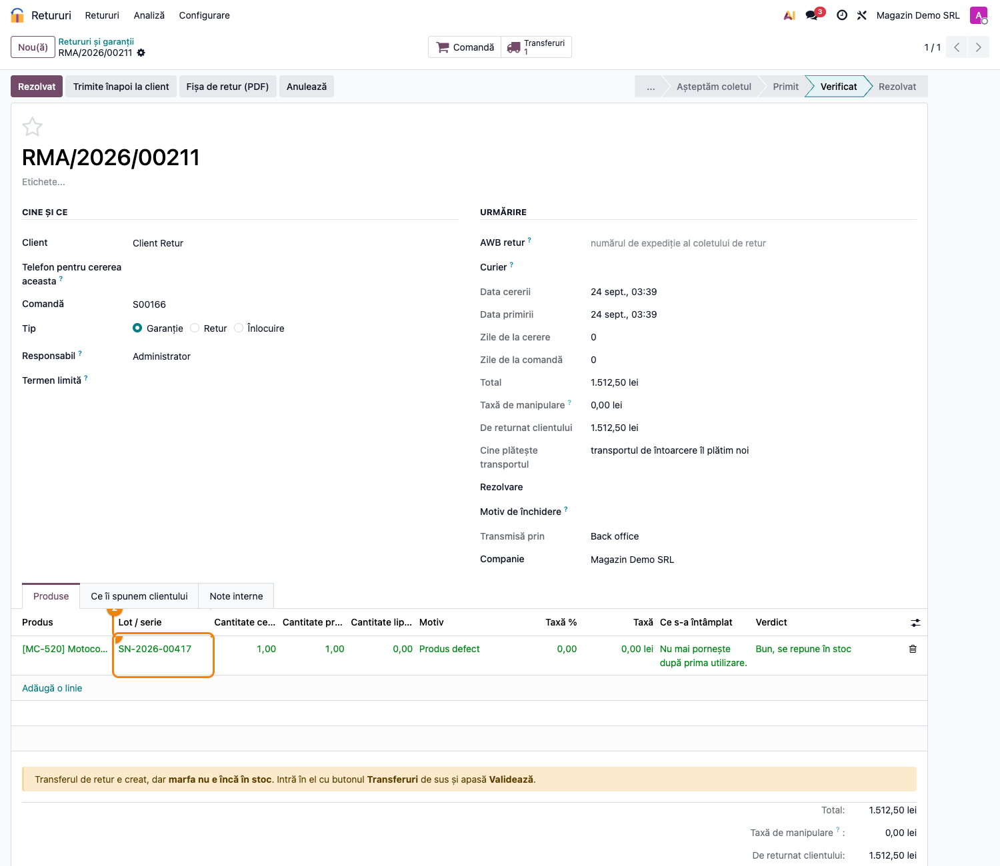
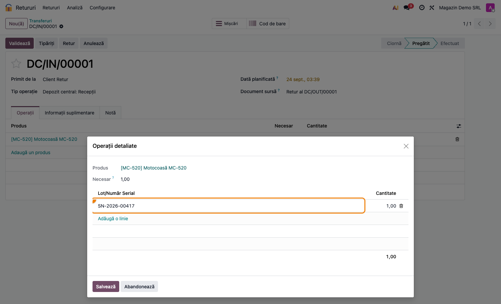
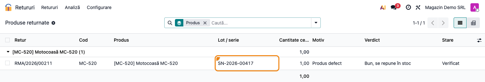

# Fișă Modul: Retururi — lot / serie (RMA Lot)

**Modul:** `deltatech_rma_lot`
**Versiune:** 19.0.1.0.2
**Suită:** bitshop
**Dependențe:** `deltatech_rma`

---

## 1. Scop business

Un produs urmărit pe lot sau pe serie se întoarce cu un număr pe el. Puntea pune numărul acela pe
cererea de retur, îl verifică față de ce a plecat efectiv din depozit către clientul respectiv și îl
duce pe transferul de retur, ca depozitul să nu-l mai tasteze a doua oară.

Trasabilitatea valorează ceva doar dacă e adevărată. Un lot tastat de mână la intrare e locul cel
mai ușor de stricat: numărul intră în stoc, raportul pare complet și nimic nu semnalează că seria
aceea n-a plecat niciodată către clientul acesta.

Puntea e separată de `deltatech_rma` pentru că cele mai multe magazine nu vând nimic urmărit pe
lot și n-au de ce să poarte câmpul, verificarea și coloana în plus.

## 2. Bază legală și context

Nicio obligație legală nouă. Puntea ține de trasabilitatea internă: garanția se acordă pe seria
vândută, iar o serie greșită pe retur înseamnă o garanție acordată pe un produs care nu e al
clientului, sau o piesă a altui client ajunsă în stoc pe numele lui.

## 3. Utilizatori și roluri

Aceleași grupuri ca `deltatech_rma`. Coloana de lot se vede doar utilizatorilor cu **Loturi și
numere de serie** activate (grupul standard `stock.group_production_lot`), ca oriunde în Odoo.

## 4. Conturi și date implicate

Puntea nu generează note contabile. Lotul ajunge pe mișcarea de retur, deci reintrarea în stoc se
face pe lotul livrat, cu costul lui — relevant la evaluarea FIFO pe lot.

## 5. Configurare inițială

1. **Inventar → Configurare → Setări → Loturi și numere de serie** — activat.
2. Pe produs, **Urmărire** pe *Lot* sau *Număr serial unic*.

Altceva nu e de configurat: puntea se instalează lângă `deltatech_rma` și lucrează singură.

## 6. Flux de utilizare

#### 6.1 Lotul pe linia de retur



Pe cerere, fiecare linie are coloana **Lot / serie**, limitată la loturile produsului de pe linie și
editabilă doar la produsele urmărite. La salvare, lotul se verifică față de livrarea liniei de
comandă:

- un lot al altui produs e refuzat;
- un lot al produsului corect, dar livrat altui client, e refuzat, iar mesajul enumeră loturile
  livrate efectiv pe comanda aceea;
- dacă livrarea n-a fost încă validată, cererea **nu** se blochează: coletul ajunge uneori înaintea
  hârtiilor.

#### 6.2 Transferul de retur, cu lotul deja pus



**Repune în stoc** creează transferul de retur cu lotul de pe cerere deja completat pe operațiile
detaliate. Depozitul doar validează: nu mai tastează numărul, deci nu-l poate tasta altfel decât
scrie pe fișă.

#### 6.3 Produsele returnate, pe loturi



*Retururi → Analiză → Produse returnate* are coloana de lot și căutarea după lot: câte bucăți s-au
întors dintr-un lot anume, util la o reclamație de serie către furnizor.

## 7. Legături cu alte module / declarații

| Modul | Legătura |
|---|---|
| `deltatech_rma` | cererea, liniile și transferul de retur pe care puntea le completează |
| `stock` | loturile (`stock.lot`) și mișcările de livrare față de care se verifică |

Niciun raport ANAF nu se alimentează din această punte.

## 8. Verificări pentru consultant

- [ ] Loturile sunt activate, iar produsele urmărite au *Urmărire* setată.
- [ ] Un retur de test pe un lot livrat trece; unul pe un lot livrat altui client e refuzat.
- [ ] Transferul de retur are lotul pe operațiile detaliate, fără intervenție.

## 9. Mesaje de eroare frecvente

| Mesaj | Ce înseamnă | Ce faceți |
|---|---|---|
| „Lotul X nu a fost livrat niciodată acestui client pe S… Livrate: …” | seria de pe cerere nu e printre cele livrate pe comanda aceea | alegeți una din seriile enumerate în mesaj sau verificați dacă e comanda corectă |
| „Lotul X e al produsului Y, nu al lui Z” | lot al altui produs | alegeți lotul produsului de pe linie |

## 10. Capturi de ecran

Cele trei capturi din `readme/screenshots/` sunt cele din secțiunea 6. Se generează cu testul
`tests/test_screenshots.py`, în română:

```bash
./odoo/odoo-bin -c odoo.conf -d <db> -i deltatech_rma_lot,l10n_ro_doc_screenshots \
    --test-tags=fise_screenshots --stop-after-init
```

## 11. Observații pentru manual

- Verificarea se face față de **livrare**, nu față de loturile produsului în general. Un serial al
  produsului corect, dar livrat altcuiva, e exact cazul pe care un filtru pe produs l-ar lăsa să
  treacă.
