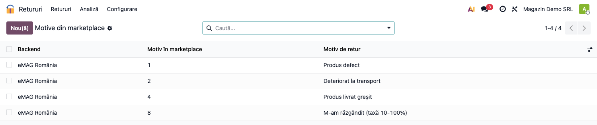
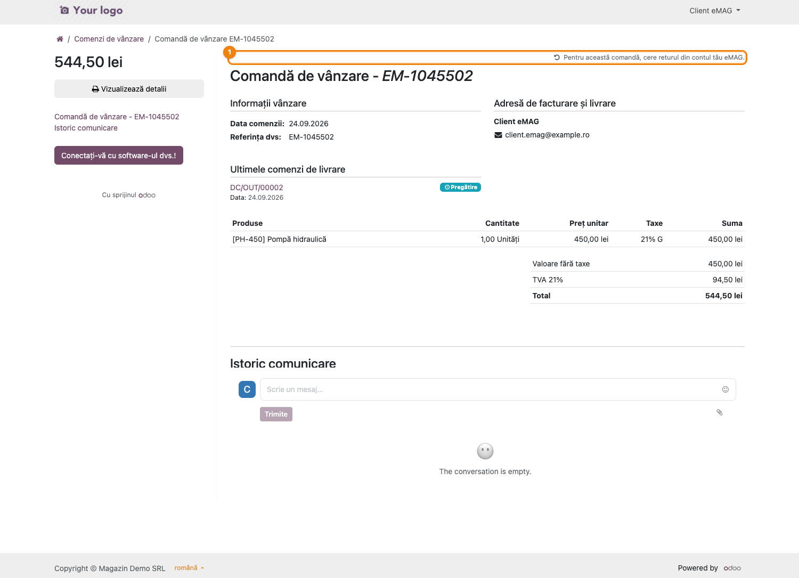
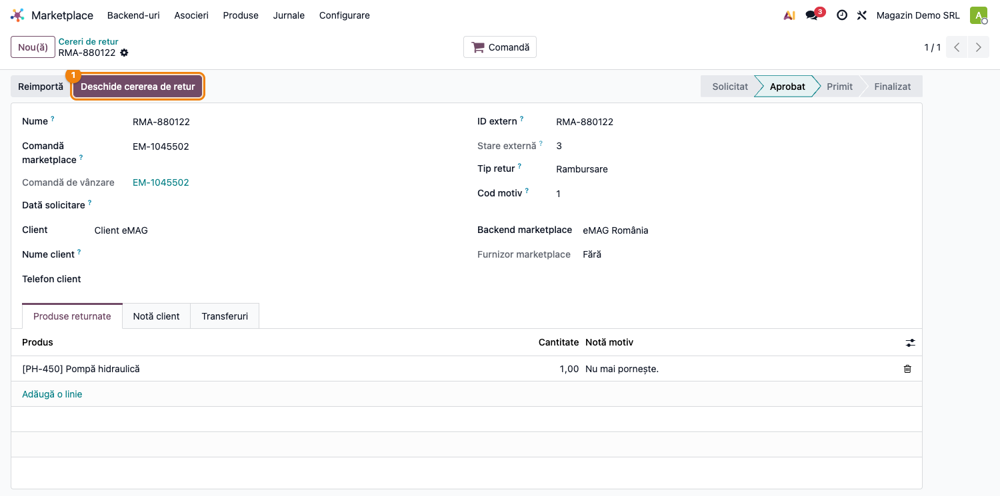
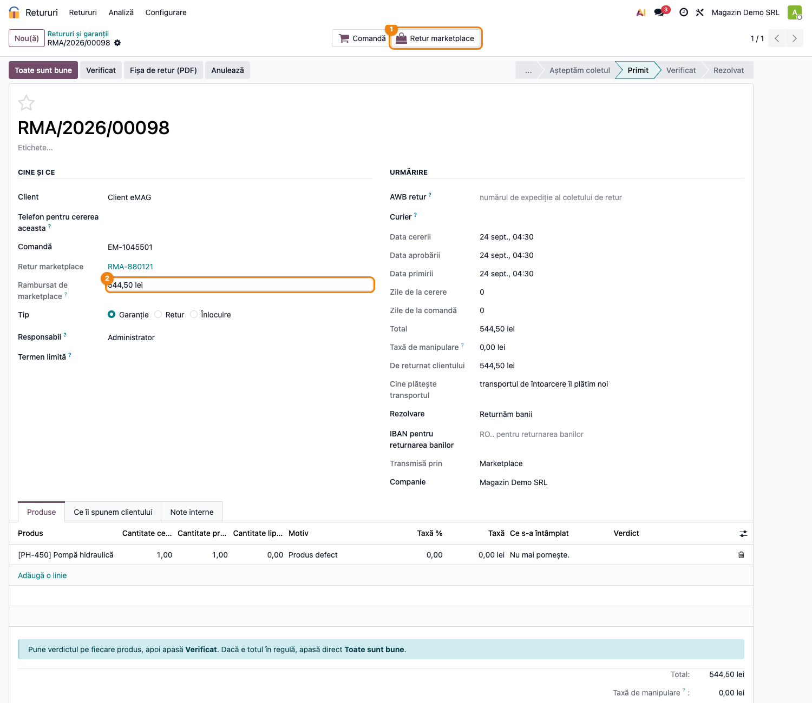
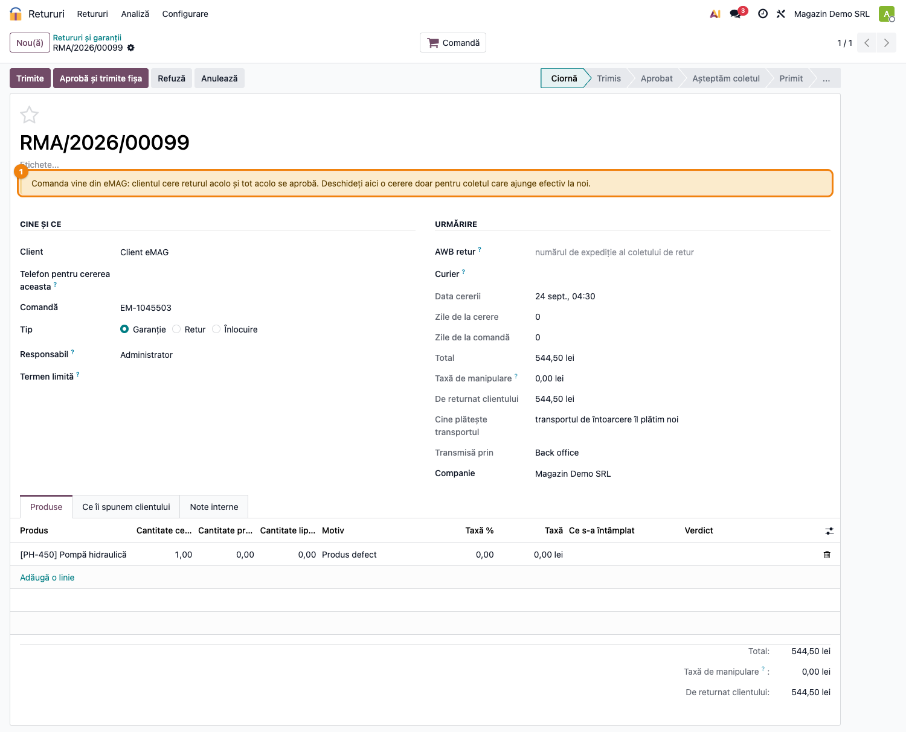

# Fișă Modul: Retururi din marketplace (RMA Marketplace)

**Modul:** `deltatech_rma_marketplace`
**Versiune:** 19.0.1.0.1
**Suită:** bitshop_marketplace
**Dependențe:** `deltatech_rma`, `deltatech_marketplace_sale` (se instalează automat când ambele sunt prezente)

---

## 1. Scop business

Un retur cerut pe eMAG sau pe Shopify se aprobă acolo și ajunge la noi ca un colet. Puntea duce
coletul acela pe același flux de depozit ca orice retur — recepție prin scanare, verificare,
transfer de retur, notă de credit —, fără ca echipa să retasteze cererea, și pune banii dați înapoi
de marketplace lângă nota de credit.

Fără punte, cele două circuite stau separat: returul importat din marketplace nu produce nimic în
depozit, iar coletul scanat nu găsește nicio cerere. Colegii deschid atunci o cerere de mână, fără
legătură cu returul din marketplace, și pot credita de două ori aceeași marfă.

## 2. Bază legală și context

Nicio obligație legală nouă. Returul și rambursarea se decid în marketplace, după regulile lui;
conectorii eMAG și Shopify **doar citesc** retururile, intenționat — aprobarea unui retur decide
ce se întâmplă cu banii cumpărătorului. Puntea nu scrie nimic înapoi în marketplace.

Cererea noastră se naște **la recepție**, nu la aprobarea din marketplace: o bună parte din
retururile aprobate se anulează înainte să plece vreun colet, iar o cerere deschisă la aprobare ar
rămâne în registru pentru un colet care nu mai vine.

## 3. Utilizatori și roluri

Aceleași grupuri ca `deltatech_rma`. Butonul *Deschide cererea de retur* de pe returul importat îl
văd utilizatorii de retururi; corespondența motivelor o configurează responsabilul de retururi.
Legătura dintre retur și cerere se scrie de modul, și pentru utilizatorii care au doar drept de
citire pe retururile din marketplace.

## 4. Conturi și date implicate

Puntea nu generează note contabile. Nota de credit se pregătește, ca la orice retur, din cererea
noastră (fișa `deltatech_rma`). **Rambursarea din marketplace nu devine notă de credit**: ea
arată banii pe care marketplace-ul i-a dat cumpărătorului, iar nota de credit e documentul fiscal al
storno-ului. Sunt amândouă necesare și trebuie să spună aceeași sumă: la crearea notei, cererea
primește un mesaj cu ambele sume și semnalează o diferență.

De unde vin rambursările: **eMAG** le aduce din RMA — la un retur cu rambursare, câte o sumă pe
fiecare produs, iar totalul se adună din ele (de la `deltatech_marketplace_emag` 19.0.2.8.0).
**Shopify** le aduce din entitatea `Refund`, cu totalul, TVA-ul și transportul rambursat raportate
de Shopify (de la `deltatech_marketplace_shopify` 19.0.1.3.0). O rambursare Shopify **fără retur**
(banii dați înapoi, marfa nu se întoarce) nu ajunge pe nicio cerere de-a noastră: nu există colet de
recepționat. Rambursările se importă din același cron ca retururile.

## 5. Configurare inițială

1. Conectorul eMAG sau Shopify importă retururile (**Marketplace → Backend → Disable Return Import**
   debifat). Un backend fără import de retururi (WooCommerce, PrestaShop, Magento…) rămâne pe
   portalul nostru de retururi, ca un magazin propriu.
2. **Retururi → Configurare → Motive din marketplace** — codul motivului din marketplace (eMAG:
   id-ul numeric, pe țară; Shopify: numele) mapat pe motivul nostru, pe fiecare backend. Politica —
   taxa, pozele, cine plătește transportul — vine din motivul nostru.



Un motiv nemapat devine **Alt motiv (de clarificat)**, doar pentru colegi, pe care echipa îl
lămurește pe cerere.

## 6. Flux de utilizare

#### 6.1 Clientul: returul se cere în marketplace



Pe o comandă venită dintr-un marketplace care își gestionează retururile, portalul nu mai oferă
butonul de retur, iar comanda nu apare în formularul de retur. Pagina comenzii îi spune clientului
să ceară returul din contul lui de marketplace.

#### 6.2 Depozitul: coletul ajunge și se scanează

În **Retururi → Recepție colet (scanare)** se scanează ce e pe colet. Dacă nu se potrivește cu
nicio cerere de-a noastră, codul se caută în retururile importate:

- numărul returului din marketplace (ex. `RMA-880121`);
- numărul comenzii din marketplace sau al comenzii din Odoo.

Găsit, cererea noastră se deschide atunci, din retur: clientul, comanda, produsele cu liniile de
comandă și prețul plătit după discount, motivele mapate, rezolvarea (*Returnăm banii* la un retur cu
rambursare, *Înlocuire* la un schimb), trecută direct prin „Așteptăm coletul” în **Primit**. De
aici fluxul e cel din `deltatech_rma`: verdicte, repunere în stoc, notă de credit.

Nu se deschide cerere pentru un retur **anulat** sau **refuzat** în marketplace și nici pentru unul
**Fulfilled by eMAG**, al cărui colet merge la depozitul eMAG. Un retur scanat a doua oară, după
alt cod, găsește aceeași cerere.

#### 6.3 Coletul neidentificat la scanare



Pe returul importat (**Marketplace → Cereri de retur**), **Deschide cererea de retur** face același
lucru de mână, pentru un colet care n-a putut fi identificat la scanare. După deschidere, butonul
devine legătura *Cerere de retur*, iar lista retururilor are coloana cererii.

#### 6.4 Cererea, cu returul și banii din marketplace



Cererea are *Transmisă prin: Marketplace*, legătura **Retur marketplace** și, când marketplace-ul
a raportat o rambursare, **Rambursat de marketplace**. Transferul de retur apare și pe returul din
marketplace, la *Transferuri*. O schimbare ulterioară de stare în marketplace (ex. anulat) se scrie
în istoricul cererii, fără să-i schimbe starea: decizia rămâne la echipă.

#### 6.5 Cererea deschisă de mână pe o comandă din marketplace



O cerere deschisă direct în registru pe o comandă eMAG primește un avertisment: returul se cere și
se aprobă în marketplace. Sub el apar retururile importate pentru comandă și, dacă e cazul, faptul
că marfa merge la depozitul marketplace-ului.

## 7. Legături cu alte module / declarații

| Modul | Legătura |
|---|---|
| `deltatech_rma` | cererea de retur, recepția prin scanare, verdictele, transferul, nota de credit |
| `deltatech_marketplace_sale` | registrul retururilor (`marketplace.return.request`) și al rambursărilor (`marketplace.refund`) |
| `deltatech_marketplace_emag` (≥ 19.0.2.8.0), `deltatech_marketplace_shopify` (≥ 19.0.1.3.0) | importul retururilor și al rambursărilor; câmpul *Fulfilled by eMAG* |

Niciun raport ANAF nu se alimentează din această punte. Nota de credit rămâne cea din `deltatech_rma`.

## 8. Verificări pentru consultant

- [ ] Importul de retururi e activ pe backend-urile eMAG / Shopify.
- [ ] Motivele marketplace-ului folosite de client sunt mapate pe motivele noastre.
- [ ] Un colet de test, scanat după numărul returului eMAG, deschide cererea în *Primit*.
- [ ] Pe o comandă eMAG, portalul nu oferă returul.
- [ ] La nota de credit, suma rambursată de marketplace și totalul notei coincid.

## 9. Mesaje de eroare frecvente

| Mesaj | Ce înseamnă | Ce faceți |
|---|---|---|
| „Returul … e Fulfilled by marketplace: marfa se întoarce în depozitul marketplace-ului, nu la noi” | retur eMAG FBE | nimic de recepționat la noi |
| „Comanda returului … nu e încă importată” | returul a venit înaintea comenzii | importați comanda, apoi scanați din nou |
| „Returul … nu are niciun produs cunoscut în Odoo” | produsele returului nu sunt legate de produse Odoo | importați produsele comenzii |
| „Returul … este Anulat / Refuzat în marketplace” | coletul nu mai era așteptat | verificați în marketplace ce e coletul |

## 10. Capturi de ecran

Cele cinci capturi din `readme/screenshots/` sunt cele din secțiunile 5 și 6, pe o firmă românească
(plan RO, TVA 21%). Se generează cu testul `tests/test_screenshots.py`:

```bash
./odoo/odoo-bin -c odoo.conf -d <db> -i deltatech_rma_marketplace,l10n_ro_doc_screenshots \
    --test-tags=/deltatech_rma_marketplace:TestRmaMarketplaceScreenshots --stop-after-init
```

## 11. Observații pentru manual

- AWB-ul coletului de retur nu vine din marketplace: coletul se identifică după numărul returului
  sau al comenzii. Merită ca depozitul să știe unde îl găsește pe eticheta eMAG.
- Puntea nu trimite nimic în marketplace. Aprobarea, refuzul și rambursarea rămân acolo.
