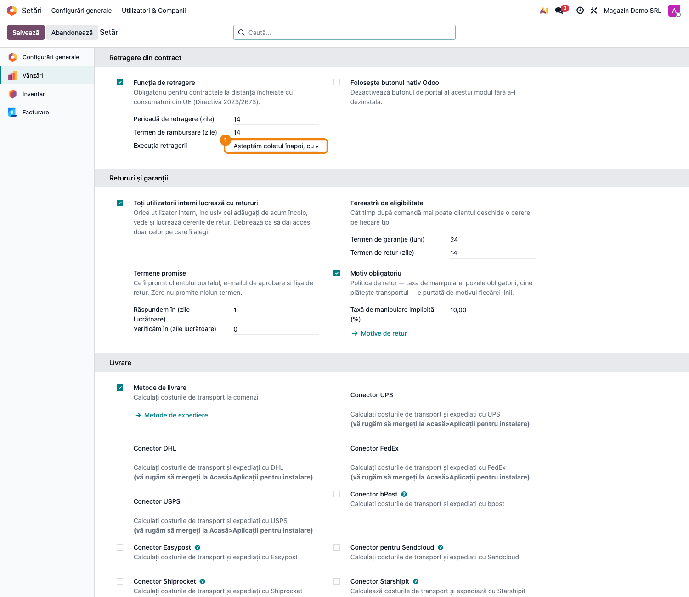
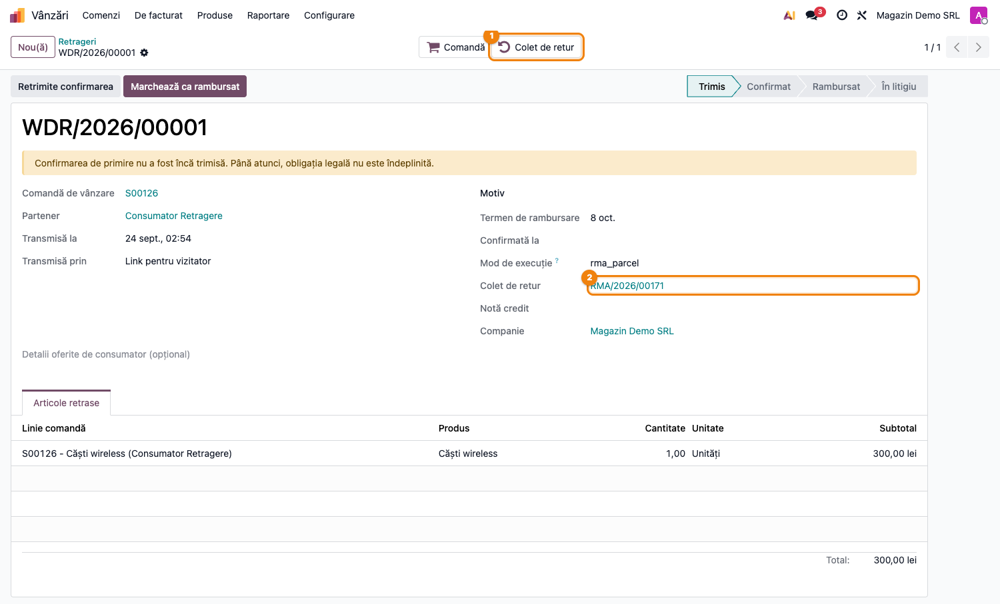
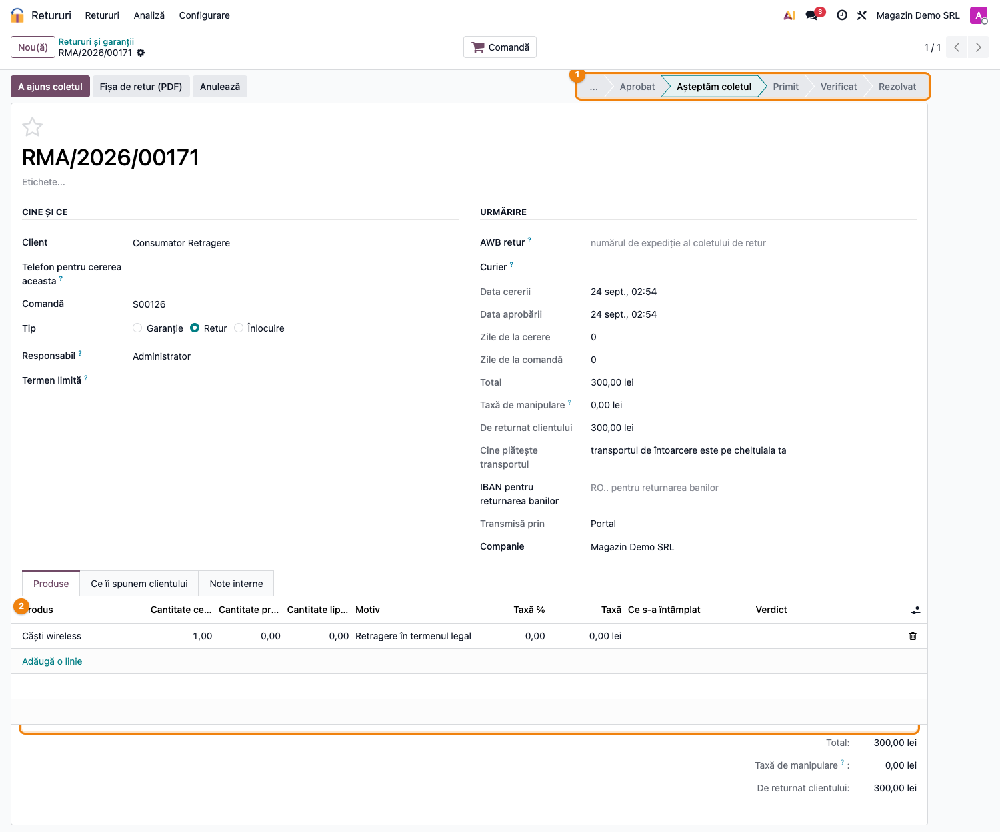
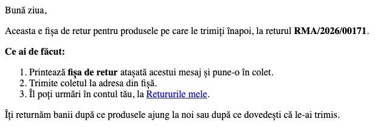

# Fișă Modul: Retragere cu fișă de retur și recepție prin scanare (RMA Withdrawal)

**Modul:** `deltatech_rma_withdrawal`
**Versiune:** 19.0.1.0.1
**Suită:** bitshop
**Dependențe:** `deltatech_rma`, `deltatech_sale_withdrawal`

---

## 1. Scop business

Retragerea din contract și returul comercial sunt acte diferite și rămân înregistrări diferite:
`deltatech.sale.withdrawal` e declarația consumatorului, `deltatech.rma` e coletul. Puntea le leagă,
ca un consumator care se retrage să primească aceeași fișă de retur cu cod de bare și coletul lui să
treacă prin aceeași recepție prin scanare ca orice retur — fără ca retragerea să capete vreodată o
stare de aprobare pe care nu are voie s-o aibă.

## 2. Bază legală și context

Directiva 2011/83/UE (transpusă prin OUG 34/2014), cu articolul 11a adăugat de Directiva
2023/2673:

| Regula | Ce face puntea |
|---|---|
| Retragerea produce efecte la declarare; comerciantul confirmă primirea, nu aprobă (art. 11a) | cererea de retur se naște direct în **Așteptăm coletul**, nu în *Ciornă* sau *Trimis*, din care ar putea fi aprobată |
| Nu se reține nicio taxă pentru exercitarea dreptului (art. 14) | motivul rezervat retragerii are taxa 0–0, iar linia se creează cu 0% |
| Consumatorul suportă costul direct al returnării, dacă a fost informat (art. 14 alin. (1)) | motivul spune că transportul de întoarcere e pe cheltuiala clientului |
| Rambursarea poate aștepta până la primirea bunurilor sau dovada expedierii (art. 13 alin. (3)) | mailul cu fișa spune exact asta, fără niciun cuvânt despre aprobare |

Diminuarea de valoare (art. 14 alin. (2)) nu e un procent fix pe linie: se stabilește după
verificare, de aceea nu intră în motiv.

## 3. Utilizatori și roluri

Aceleași grupuri ca `deltatech_rma` și `deltatech_sale_withdrawal`. Cererea de retur se creează
automat, ca superuser, la confirmarea retragerii: consumatorul (inclusiv cel fără cont, pe link de
invitat) nu are drepturi pe retururi și nici nu trebuie să aibă.

## 4. Conturi și date implicate

Puntea nu generează note contabile. Cererea de retur ține de latura logistică — coletul care se
întoarce și intrarea mărfii în stoc prin transferul de retur, cu nota standard de reintrare descrisă
în fișa `deltatech_rma`.

Rambursarea: nota de credit în ciornă se pregătește **din cererea de retur**, după verificare
(butonul **Notă credit**, vizibil pentru că rezolvarea e deja *Returnăm banii*), iar retragerea se
marchează apoi **Marchează ca rambursat**. Câmpul *Notă credit* de pe retragere nu e completat de
punte. Faceți o singură notă de credit pe retragere, nu câte una din fiecare document.

## 5. Configurare inițială

1. **Vânzări → Configurare → Setări → Retragere din contract** — funcția de retragere activată.
2. **Execuția retragerii** = *Așteptăm coletul înapoi, cu fișă de retur*.



Puntea aduce motivul **Retragere în termenul legal**, bifat *Doar pentru colegi* — nu apare niciodată
în formularul de retur din portal, ca un client să nu-și poată alege singur „retragerea” pe un retur
comercial.

## 6. Flux de utilizare

#### 6.1 Retragerea deschide coletul de retur



La confirmarea retragerii se creează o cerere de retur pe produsele retrase și cantitățile lor.
Retragerea are butonul **Colet de retur** și câmpul cu același nume. Câmpul *Mod de execuție*
afișează codul tehnic al modului (`rma_parcel`): e câmpul modulului de retragere, care păstrează
codul și după o eventuală dezinstalare a punții.

Executarea de două ori nu deschide un al doilea colet.

#### 6.2 Cererea de retur, direct în „Așteptăm coletul”



Cererea e de tip *Retur*, cu rezolvarea *Returnăm banii* pusă din start, motivul **Retragere în
termenul legal** și taxa **0**. Bara de stări a cererii arată și *Aprobat*, pentru că e bara comună
a retururilor; cererea nu trece însă prin ea — pornește din *Așteptăm coletul*. *Data aprobării*
e data transmiterii retragerii.

De aici coletul urmează fluxul obișnuit din `deltatech_rma`: recepția prin scanare, verdictele,
repunerea în stoc prin transferul de retur.

#### 6.3 Mailul cu fișa de retur



Fișa pleacă pe mail cu un șablon propriu. Șablonul din `deltatech_rma` spune „am aprobat cererea”,
ceea ce pe o retragere ar fi neadevărat și, în fața ANPC, contestabil. Acesta spune doar ce are de
făcut clientul și când primește banii.

## 7. Legături cu alte module / declarații

| Modul | Legătura |
|---|---|
| `deltatech_sale_withdrawal` | declarația de retragere, confirmarea de primire, rambursarea |
| `deltatech_rma` | cererea de retur, fișa cu cod de bare, recepția prin scanare, transferul de retur |

Niciun raport ANAF nu se alimentează din această punte.

## 8. Verificări pentru consultant

- [ ] Modul de execuție e *Așteptăm coletul înapoi, cu fișă de retur*.
- [ ] O retragere de test deschide cererea în *Așteptăm coletul*, cu taxă 0.
- [ ] Mailul primit de consumator nu pomenește nicio aprobare.
- [ ] Rambursarea se face o singură dată: nota de credit din cererea de retur, apoi retragerea
      marcată *rambursat* în termenul de rambursare afișat pe ea.
- [ ] Motivul *Retragere în termenul legal* nu apare în formularul de retur din portal.
- [ ] Informarea consumatorului despre costul returnării (art. 14 alin. (1)) există în termenii
      magazinului — altfel transportul de întoarcere e în sarcina comerciantului.

## 9. Mesaje de eroare frecvente

| Mesaj | Ce înseamnă | Ce faceți |
|---|---|---|
| „Lipsește motivul de retur rezervat retragerilor legale.” | motivul livrat de punte a fost șters | reinstalați puntea sau refaceți motivul cu codul `statutory_withdrawal` |

## 10. Capturi de ecran

Cele patru capturi din `readme/screenshots/` sunt cele din secțiunile 5 și 6. Se generează cu testul
`tests/test_screenshots.py`, în română:

```bash
./odoo/odoo-bin -c odoo.conf -d <db> -i deltatech_rma_withdrawal,l10n_ro_doc_screenshots \
    --test-tags=/deltatech_rma_withdrawal:TestBitshopRmaWithdrawalScreenshots --stop-after-init
```

## 11. Observații pentru manual

- La instruire, insistați pe diferență: retragerea **nu se aprobă și nu se refuză**. Colegul care
  primește coletul verifică doar starea mărfii, pentru o eventuală diminuare de valoare.
