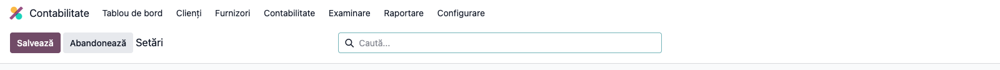
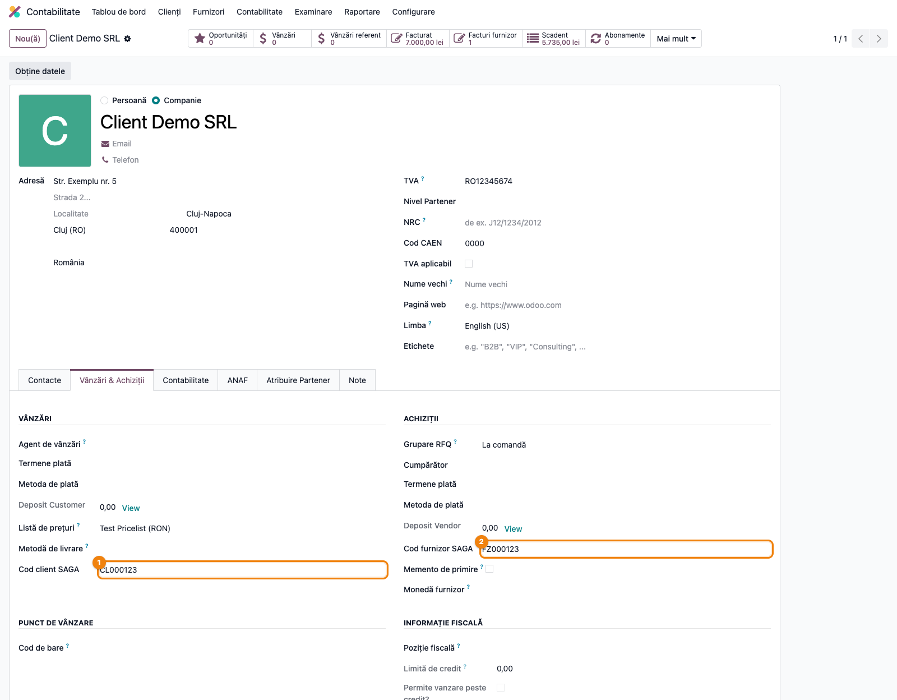
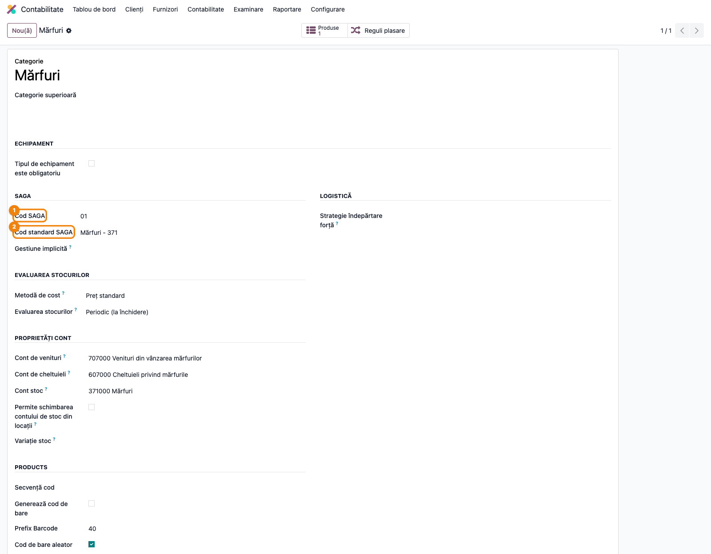
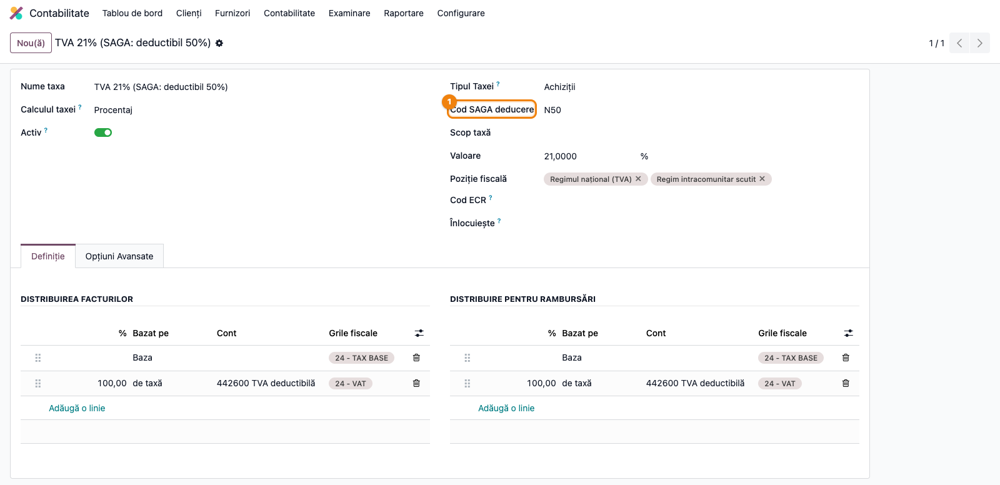
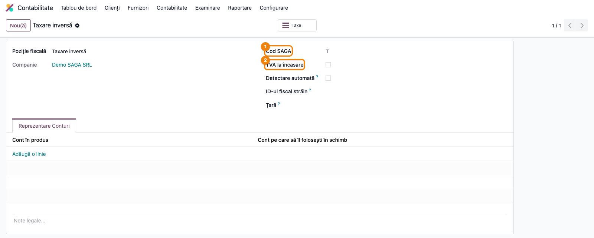
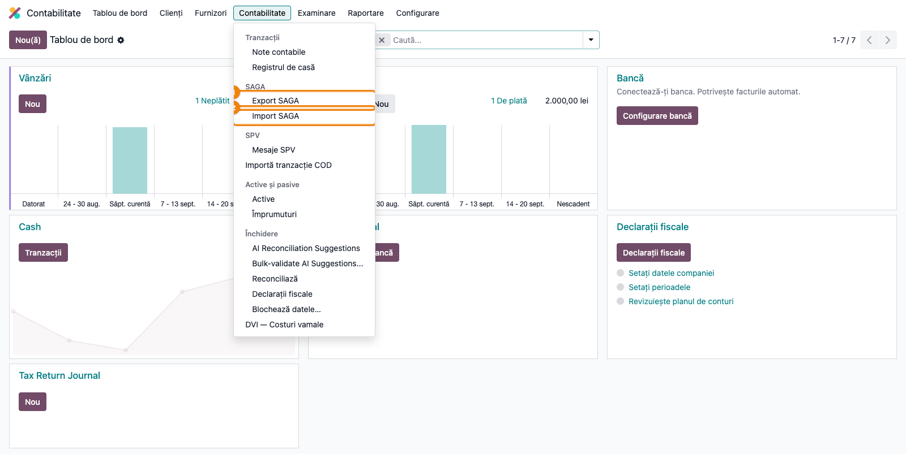
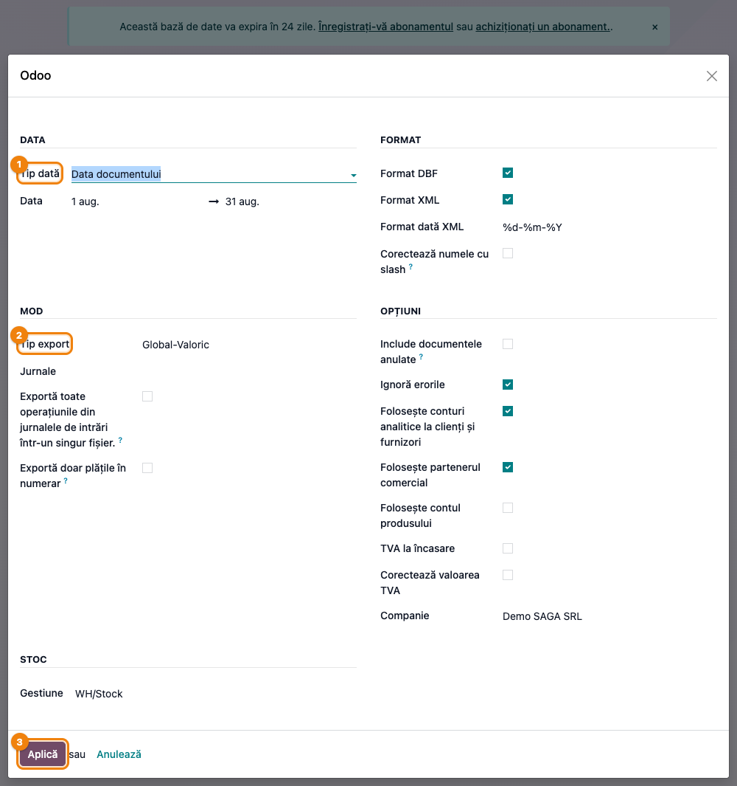
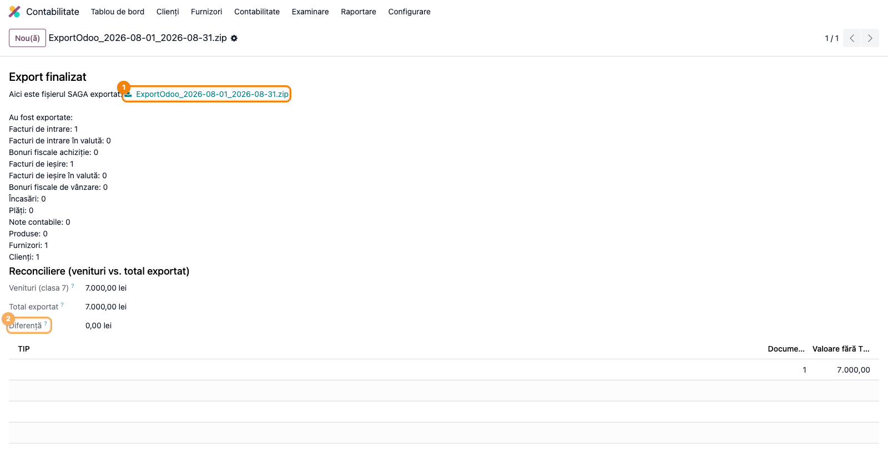
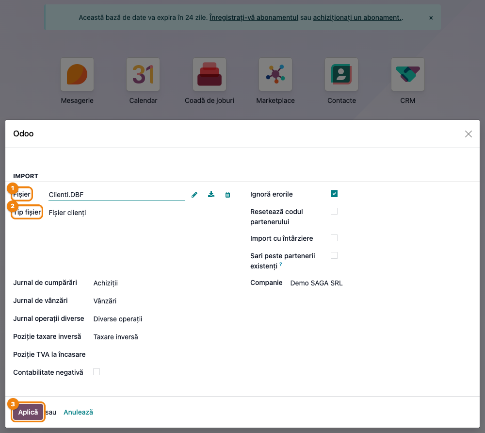

# Fișă Modul: Export și import date contabile către/dinspre SAGA

**Modul:** `deltatech_saga`
**Utilizator principal:** Contabil / responsabil financiar care ține contabilitatea în SAGA; administrator funcțional Odoo
**Prioritate:** 🔴 Ridicată (fluxul lunar de predare a datelor către contabilitate la majoritatea clienților locali)

---

## 1. Scop business

Multe firme operează vânzările, achizițiile și stocurile în Odoo, dar contabilitatea oficială
(balanță, declarații, bilanț) rămâne în **SAGA**, ținută intern sau de un cabinet de contabilitate.
Modulul `deltatech_saga` elimină reintroducerea manuală: la sfârșitul perioadei, operatorul
generează dintr-un singur asistent o arhivă ZIP cu partenerii, articolele, facturile de intrare și
ieșire, notele contabile și plățile, în formatul de import nativ SAGA (XML și/sau DBF). În sens
invers, modulul importă în Odoo fișiere exportate din SAGA (parteneri, articole, facturi, note
contabile), util la pornirea unei implementări sau la sincronizarea soldurilor.

Fișa descrie fluxul complet: configurarea codurilor SAGA, exportul lunar, controlul total pe
venituri și importul de date dinspre SAGA.

## 2. Bază legală și context

- **Legea contabilității nr. 82/1991** — obligația ținerii contabilității și a înregistrării
  cronologice a documentelor justificative; exportul asigură că documentele emise/primite în Odoo
  ajung integral în registrele contabile din SAGA.
- **OMFP 1802/2014** — planul de conturi general pe care se mapează tipurile de articole SAGA
  (371 mărfuri, 301 materii prime, 3028 alte materiale consumabile, 345 produse finite etc.).
- **Codul fiscal (Legea 227/2015)**: art. 298 — limitarea la 50% a deducerii TVA pentru vehicule
  (codul de deducere `N50` al taxei); art. 282 — TVA la încasare (opțiunea *TVA la încasare* pe
  poziția fiscală și în asistent); art. 307/331 — taxare inversă (codul `T` pe poziția fiscală).
- **OUG 28/1999 (aparate de marcat electronice fiscale)** — bonurile fiscale și facturile emise pe
  bază de bon fiscal se raportează distinct în SAGA prin coloana `TIP` (`f`, `B`, `C`).

Contextul operațional: integrarea este **pe fișiere**, nu în timp real. SAGA rămâne autoritatea
finală asupra validării contabile; erorile de configurare din SAGA se rezolvă în SAGA. Documentația
oficială de import SAGA: https://manual.sagasoft.ro/sagac/topic-76-import-date.html

## 3. Utilizatori și roluri

- **Contabil / cabinet de contabilitate** — primește arhiva ZIP și o importă în SAGA; verifică
  totalul de control pe venituri.
- **Responsabil financiar / operator facturare** — rulează exportul lunar din Odoo, corectează
  partenerii fără cod SAGA.
- **Administrator funcțional** — configurează codurile SAGA pe categorii, taxe, poziții fiscale,
  locații și setările generale.

Meniul **SAGA** și acțiunile lui sunt vizibile doar grupului **Contabilitate / Administrator**
(`account.group_account_manager`). Pe Odoo Community, utilizatorul are nevoie și de opțiunea
**Afișează toate funcțiile contabile** activă pe profil.

Roluri recomandate pentru testare:
- Administrator funcțional: instalează modulul, configurează codurile și verifică meniurile.
- Utilizator operațional (contabil): rulează exportul și importul pe baza demo.
- Manager: validează totalul de control și conținutul arhivei.

## 4. Conturi și date implicate

Conturile RO care apar în fișierele exportate sau sunt cerute de mapare:
- **4111 / 401** — clienți și furnizori; codurile SAGA de client/furnizor identifică partenerul
  în fișierele `Clienti` și `Furnizori`; opțional se exportă cu analitic pe partener.
- **4426 / 4427** — TVA deductibilă/colectată, cu tipul de deducere SAGA (`N50`, `I`) pe taxă.
- **Clasa 7 (704, 707, 709 etc.)** — totalul de control după export compară veniturile postate
  în perioadă cu totalul documentelor exportate.
- **Tipuri de articole SAGA** pe categoria de produs: 371, 301, 3021, 3022, 3024, 3028, 303, 341,
  345, 346, 381, 4091/4092 avansuri, 419 avans clienți, 609/709 discount comercial.
- **Gestiune** (cod SAGA pe locația de stoc, 4 caractere) — folosită numai la exportul
  cantitativ-valoric.

Date minime pentru demo:
- companie românească cu planul de conturi RO (`l10n_ro`), CUI completat;
- câțiva parteneri români (client, furnizor, unul fără CUI pentru a provoca avertismentul);
- categorii de produs cu cod SAGA, o taxă cu cod de deducere, o poziție fiscală de taxare inversă;
- facturi de vânzare și de achiziție **postate** în luna de test, ideal și una în valută și una pe
  bon fiscal;
- pentru import: fișierele de test din `tests/` (`Clienti.DBF`, `Furnizori.DBF`, `IE.DBF`,
  `IN.DBF`, `NC.xls`).

## 5. Configurare inițială

1. Instalați `deltatech_saga` (trage după el `account`, `stock`, `sale_stock`, `purchase_stock`,
   `l10n_ro` și `deltatech_contact`). Bibliotecile Python `xlrd`, `openpyxl`, `xlsxwriter`, `xlwt`,
   `dicttoxml` și `unidecode` trebuie instalate pe server.
2. **Contabilitate → Configurare → Setări**, secțiunea **SAGA**: decideți cum se generează codurile de
   partener — **Folosește codul TVA drept cod** (CUI drept cod SAGA), **Folosește lungimea coloanei
   pentru codul furnizorului/clientului** (implicit 8 caractere), **Setează cod SAGA la export**
   pentru partenerii fără cod, **Aceeași secvență de cod** (client/furnizor).
3. **Bază SAGA deja existentă (cazul obișnuit)**: nu introduceți codurile de mână. Exportați din
   SAGA, în format **DBF**, nomenclatoarele de **Clienți**, **Furnizori** și **Articole**, apoi
   importați-le în Odoo prin **Contabilitate → Contabilitate → SAGA → Import SAGA** (vezi Pasul 7).
   Importul creează sau actualizează partenerii și produsele cu **codurile SAGA originale**, astfel
   încât exporturile ulterioare din Odoo se leagă de înregistrările existente și SAGA nu creează
   duplicate. Faceți acest import **înainte** de primul export și repetați-l dacă în SAGA se adaugă
   parteneri direct.
4. **Contacte** (parteneri creați ulterior în Odoo, sau implementare fără istoric SAGA): completați
   **Cod client SAGA** și **Cod furnizor SAGA** în tabul **Vânzări & Achiziții**, identice cu cele
   din SAGA, sau lăsați setarea *Setează cod SAGA la export* să le genereze.
5. **Categorii de produs**: completați **Cod SAGA** (2 caractere, implicit `01`) sau alegeți un
   **Cod standard SAGA** care îl completează automat; opțional gestiunea implicită.
6. **Taxe**: pe taxele cu deductibilitate limitată completați **Cod SAGA deducere** (`N50` pentru
   50%, `I` pentru nedeductibil). Câmpul este doar o **etichetă** transmisă în fișierul de export —
   nu recalculează nimic în Odoo. Dacă limitarea de 50% (art. 298 Cod fiscal, vehicule mixte) trebuie
   reflectată și în contabilitatea din Odoo, configurați taxa cu repartiția corespunzătoare (jumătate
   pe 4426 TVA deductibilă, jumătate pe un cont de cheltuială nedeductibilă); dacă taxa rămâne 100%
   deductibilă în Odoo și doar codul `N50` semnalează limitarea, jumătatea nedeductibilă se
   recalculează în SAGA la import, iar soldul 4426 din Odoo nu va coincide cu cel din SAGA până la
   acea corecție.
7. **Poziții fiscale**: completați **Cod SAGA** (`T` taxare inversă, `A` aviz) și bifați **TVA la
   încasare** unde este cazul. Codul de pe poziția fiscală are prioritate la stabilirea coloanei `TIP`.
8. **Locații de stoc** (doar pentru export cantitativ-valoric): completați **Cod SAGA** (4 caractere)
   pe locațiile interne.
9. Pentru bonuri fiscale: configurați jurnalele de bonuri fiscale și partenerul generic conform
   ghidului `deltatech_sale_store`; nu marcați jurnalele obișnuite de vânzări drept jurnale de bonuri.
10. Verificați că utilizatorul de test este în grupul **Contabilitate / Administrator**.

## 6. Flux de utilizare

### Pasul 1 — Setările generale SAGA

Accesați **Contabilitate → Configurare → Setări** și derulați la secțiunea **SAGA**. Aici se
stabilește politica de coduri de partener: CUI drept cod, lungimea coloanei, completarea automată la
export și secvența comună client/furnizor. Salvați.



### Pasul 2 — Codurile SAGA pe partener

Deschideți un partener din **Contacte** și, în tabul **Vânzări & Achiziții**, completați **Cod client
SAGA** și **Cod furnizor SAGA**. Câmpurile sunt per companie. Dacă ați bifat *Folosește CUI drept cod*,
codurile se completează automat din CUI; dacă ați bifat *Completare cod la export*, partenerii fără
cod primesc unul din secvență la primul export.



### Pasul 3 — Codurile SAGA pe categorii, taxe și poziții fiscale

**Inventar → Configurare → Categorii de produse**: pe fiecare categorie completați **Cod SAGA** sau
alegeți un **Cod standard SAGA** (de exemplu *Mărfuri - 371*), care completează codul automat.



**Contabilitate → Configurare → Taxe**: pe taxele cu deducere limitată completați **Cod SAGA deducere**.



**Contabilitate → Configurare → Poziții fiscale**: completați **Cod SAGA** (aici `T`, taxare inversă)
și, pe pozițiile fiscale de acest tip, bifa **TVA la încasare**.



### Pasul 4 — Deschiderea asistentului de export

Accesați **Contabilitate → Contabilitate → SAGA → Export SAGA**. Meniul **SAGA** apare în grupul
de meniuri contabile și conține **Export SAGA** și **Import SAGA**.



### Pasul 5 — Completarea asistentului și generarea arhivei

În asistent completați, în ordine:

- **Tip dată**: *Data documentului* (implicit, exportul lunar obișnuit, selectează documentele după
  data contabilă) sau *Data modificării* (selectează după data creării, pentru exporturi
  incrementale; filtrează și partenerii creați/modificați în interval).
- **Perioada**: implicit luna precedentă pentru *Data documentului*, respectiv ziua de ieri pentru
  *Data modificării*.
- **Format**: **Format DBF** și/sau **Format XML** (ambele bifate implicit; XML recomandat pentru
  versiunile noi de SAGA). Pentru XML alegeți **Format dată XML** (implicit `%d-%m-%Y`) și, dacă
  numerele de document conțin `/`, bifați **Corectează numele cu slash**.
- **Tip export**: *Global-Valoric* (implicit: parteneri, facturi, note contabile, plăți) sau
  *Cantitativ-Valoric* (adaugă fișierul de articole și mișcările de consum/producție, cu câmpul
  **Gestiune**).
- **Jurnale**: goliți pentru toate jurnalele sau restrângeți la câteva.
- Opțiuni: **Exportă toate operațiunile din jurnalele de intrări într-un singur fișier**, **Exportă
  doar plățile în numerar** (⚠️ nu doar plățile: restrânge *toate* notele contabile colectate la
  jurnalele de casă, deci reduce și fișierele `NC_*` — nu o folosiți la exportul lunar complet, ci
  doar când chiar vreți exclusiv operațiunile de casă), **Include documentele anulate**, **Ignoră
  erorile** (continuă peste un document defect), **Folosește conturi analitice la clienți și
  furnizori**, **Folosește partenerul comercial**, **Folosește contul produsului**, **TVA la
  încasare** (aplică regimul de TVA la încasare la nivelul întregului export, nu doar poziției
  fiscale), **Corectează valoarea TVA**.



Apăsați **Aplică**. Odoo generează o singură arhivă `ExportOdoo_<de la>_<până la>.zip`.

### Pasul 6 — Citirea rezultatului și controlul total

Ecranul de rezultat are trei zone. **Găsiți pe ecran**:

1. **Fișierul exportat** — linkul de descărcare al arhivei ZIP.
2. **Sumarul** „Au fost exportate:" — numărul de furnizori, clienți, articole, facturi de intrare
   și ieșire (RON și valută), note contabile și plăți cuprinse.
3. **Reconciliere (venituri vs. total exportat)** — **Venituri (clasa 7)**: totalul liniilor postate
   pe conturile de venituri din perioadă; **Total exportat**: suma fără TVA a facturilor, notelor de
   credit și bonurilor de vânzare exportate; **Diferență**; dedesubt, tabelul pe **TIP** cu numărul
   de documente și valoarea fără TVA.

**Verificați** înainte de a preda arhiva, cu criteriul **„diferența este explicată"**, nu neapărat
zero — diferența are două cauze structurale, pe lângă cea accidentală:
- **Venituri (clasa 7) se calculează pe toată compania**, fără să țină cont de jurnalele alese la
  Pasul 5. Dacă restrângeți exportul la câteva jurnale de vânzare, diferența crește cu veniturile din
  jurnalele excluse — nu e o eroare.
- **Conturile de clasa 7 fără corespondent în facturi** (711 variația stocurilor, 766 dobânzi
  încasate, 758x alte venituri) intră în totalul de venituri, dar nu apar niciodată în totalul
  exportat (bazat strict pe facturi). La o firmă cu producție sau venituri financiare, o parte din
  diferență e permanentă și normală.
- Peste aceste două, o diferență **suplimentară** apare de regulă când o notă contabilă manuală a
  atins direct un cont de venituri sau când o factură de furnizor a fost înregistrată pe un cont de
  clasa 7; acestea sunt în afara exportului de facturi și se discută cu contabilul.
- Numărul de documente din sumar corespunde cu **Contabilitate → Clienți → Facturi** filtrat pe
  perioadă și stare *Postat*.
- Rândurile `TIP` = `f`/`B`/`C` există doar dacă ați avut bonuri fiscale în perioadă; rândul cu
  `TIP` **necompletat** corespunde facturilor obișnuite (fără bon fiscal, fără poziție fiscală cu
  cod SAGA propriu).

**Apoi** descărcați arhiva și predați-o contabilului. Conținutul, în funcție de datele găsite:
`Furnizori`/`FUR`, `Clienti`/`CLI`, `Articole`/`ART` (doar cantitativ-valoric), `IN_<jurnal>`
și `INV_<jurnal><valută>` (intrări RON/valută), `IE_<jurnal>` și `IEV_<jurnal><valută>` (ieșiri
RON/valută), `NC_<jurnal>` (note contabile, doar DBF), `I_<jurnal>`/`P_<jurnal>` (încasări/plăți,
doar XML), `BC_`/`PRODUCTIE_` (consumuri/producție, doar DBF, cantitativ-valoric).



**Importul în SAGA** se face în ordinea: parteneri (furnizori, clienți), articole (dacă există),
facturi (IN/IE/INV/IEV), apoi note contabile și plăți. **Nu importați și DBF și XML** din aceeași
arhivă: conțin aceleași date și SAGA le-ar dubla.

### Pasul 7 — Importul de date din SAGA

Acest pas este **primul** care se execută la o implementare peste o bază SAGA existentă: exportați
din SAGA nomenclatoarele **Clienți**, **Furnizori** și **Articole** în format DBF și importați-le în
Odoo, ca partenerii și produsele să primească codurile SAGA originale. Același asistent servește apoi
la importul facturilor și notelor contabile din SAGA, când e nevoie.

Accesați **Contabilitate → Contabilitate → SAGA → Import SAGA**. Încărcați fișierul exportat din SAGA;
dacă numele respectă convenția SAGA, **Tipul fișierului** (Furnizori, Clienți, Articole, Intrări,
Ieșire, Note contabile DBF/XLS) se detectează automat. Alegeți jurnalul de achiziții, de vânzări sau
de operațiuni diverse după tipul fișierului, pozițiile fiscale pentru taxare inversă și TVA la
încasare, și opțiunile **Ignoră erorile**, **Sari peste partenerii existenți**, **Resetează codul
partenerului**, **Import cu întârziere** (rulează în fundal prin coada de joburi, dacă `queue_job` e
instalat). Apăsați **Aplică**; importul de parteneri rulează pe loturi de 500 cu bară de progres, iar
ecranul final listează înregistrările create/actualizate și erorile.



### Ce pleacă spre SAGA și ce nu

Exportul transferă **numai documente contabile**. Comenzile de vânzare, ofertele, comenzile de
achiziție, recepțiile și livrările **nu se exportă**: SAGA nu are un corespondent pentru ele, iar
contabilitatea lor apare în SAGA abia prin factura sau nota contabilă pe care le generează în Odoo.
Din perioada selectată intră în arhivă:

- **Facturile** (`IE`/`IEV` ieșiri, `IN`/`INV` intrări): toate facturile, notele de credit și
  bonurile **postate** din jurnalele de vânzări și achiziții alese, cu partenerul, liniile, TVA-ul,
  coloana `TIP` și, pentru valută, cursul documentului. O factură în ciornă sau anulată nu pleacă
  (anulatele doar cu *Include documentele anulate*).
- **Încasările și plățile** (`I_<jurnal>` încasări clienți, `P_<jurnal>` plăți furnizori, doar în
  XML): notele contabile **postate** din jurnalele de tip **Bancă** și **Casă** ale perioadei (plăți
  înregistrate, linii de extras contabilizate). Sensul se deduce din linia pe contul jurnalului:
  credit pe 5121/5311 = plată furnizor, debit = încasare client. Cu *Exportă doar plățile în numerar*
  rămân numai cele din jurnalele de casă.
- **Reconcilierea plată ↔ factură** se transmite pe fiecare linie de încasare/plată prin câmpul
  `FacturaNumar` (și `FacturaID`): dacă linia de partener a plății este **reconciliată în Odoo** cu o
  singură factură, SAGA primește numărul acelei facturi și stinge factura la import; dacă e
  reconciliată cu mai multe facturi, primește lista numerelor; dacă **nu** e reconciliată, primește
  doar referința liniei, iar stingerea rămâne de făcut în SAGA. De aceea reconcilierea extraselor și a
  plăților se face în Odoo **înainte** de export.
- **Notele contabile** (`NC_<jurnal>`, doar DBF): toate notele **postate** de tip înregistrare
  contabilă din jurnalele alese (diverse, salarii, amortizări, dar și cele de bancă/casă, care apar
  astfel și ca note brute). SAGA le importă ca note contabile cu conturile din fișier.

Nu importați în SAGA, pentru aceeași perioadă, și `NC` (DBF) și `I`/`P` (XML) ale jurnalelor de bancă
și casă: sunt aceleași operațiuni în două forme. Alegeți formatul potrivit versiunii SAGA.

### Pasul 8 — Preluarea soldurilor din balanța SAGA (implementare inițială)

La trecerea de la SAGA la Odoo, soldurile de deschidere pe parteneri se pot prelua direct din
**balanța de verificare analitică** exportată ca PDF din SAGA, fără să le retastați. Meniul e vizibil
doar în **modul dezvoltator** (`account.group_account_manager` + `base.group_no_one`): **Contabilitate
→ Contabilitate → SAGA → Balance Mapping**.

Încărcați PDF-ul balanței, alegeți **Tip partener** (client/furnizor) și, opțional, **Synthetic
Account** pentru a limita maparea la un cont sintetic (ex. `4111` sau `401`). La **Generează maparea**,
asistentul potrivește fiecare rând din balanță cu un partener Odoo după codul SAGA (`ref_customer`/
`ref_supplier`) și, unde codul nu se regăsește, după numele normalizat (fără diacritice și fără forme
juridice precum SRL/SA). Rezultatul e un fișier **XLSX** cu totalul de rânduri, câte s-au potrivit
automat și câte rămân de verificat manual (rândurile roșii, duplicate sau nepotrivite).

Încărcarea propriu-zisă a soldurilor **nu e automată**: fișierul XLSX se completează manual pentru
rândurile nepotrivite, apoi se importă cu importul nativ Odoo în **import.chart.of.accounts** (record
de sincronizare pe contul 401100/411100), iar nota de deschidere se postează separat, la final, cu
butonul **Postează diferența**. Acest pas se face o singură dată, la implementare, nu la fiecare
export lunar.

### Note de monografie și raportare

Modulul **nu generează note contabile proprii la export**; el transcrie documentele deja postate în
Odoo în formatul SAGA. Notele rezultă în SAGA la import, după monografia standard:
- factură de vânzare (`IE`): **Dr 4111 = Cr 70x + Cr 4427**; în valută (`IEV`) cu cursul din
  document;
- factură de achiziție (`IN`): **Dr 3xx/6xx + Dr 4426 = Cr 401**; pentru taxa cu cod `N50`, SAGA
  deduce doar 50% din TVA; pentru codul `I`, TVA rămâne nedeductibilă;
- taxare inversă (`TIP` = `T`): **Dr 4426 = Cr 4427** în SAGA, pe baza codului poziției fiscale;
- bonuri fiscale (`TIP` = `f`/`B`/`C`): se raportează în jurnalul de vânzări SAGA ca vânzări cu
  bon fiscal, cu sau fără factură;
- încasări/plăți (`I`/`P`): **Dr 5311/5121 = Cr 4111** respectiv **Dr 401 = Cr 5311/5121**, cu
  stingerea facturii indicate în `FacturaNumar`;
- note contabile (`NC`): liniile Dr/Cr ale notelor din jurnalele selectate sunt transferate ca atare.

La import (SAGA → Odoo), notele contabile din `NC` se creează în jurnalul de operațiuni diverse ales,
cu conturile din fișier; facturile din `IN`/`IE` se creează în jurnalele alese și preiau pozițiile
fiscale configurate.

## 7. Legături cu alte module / declarații

| Modul / proces | Rol în flux | Tip legătură |
|---|---|---|
| `account`, `l10n_ro` | facturi, note contabile, planul de conturi RO | dependență (manifest) |
| `stock`, `sale_stock`, `purchase_stock` | gestiuni, exportul cantitativ-valoric, consumuri/producție | dependență (manifest) |
| `deltatech_contact` | CUI/NRC pe partener, folosite ca cod SAGA | dependență (manifest) |
| `deltatech_sale_store` | flagul *Vânzare din magazin* care stabilește `TIP` = `f` pe facturile cu bon fiscal | opțional |
| `deltatech_saga_mrp` | exportul consumurilor și al producției din MRP | extensie opțională |
| Declarații ANAF (D300, D394) | rămân în SAGA, pe baza datelor importate | în afara Odoo |

Ce este automat: colectarea documentelor din perioadă, generarea codurilor de partener (dacă e
configurată), împachetarea în ZIP, legarea plăților de facturi pe baza reconcilierii din Odoo,
controlul total pe clasa 7, detectarea tipului de fișier la import.
Ce rămâne manual: maparea inițială a codurilor SAGA, reconcilierea plăților cu facturile în Odoo
înainte de export, importul propriu-zis în SAGA, analiza diferenței din reconciliere și corectarea
documentelor semnalate la *Ignoră erorile*.
Ce nu se exportă niciodată: comenzi de vânzare și achiziție, oferte, recepții și livrări (fără
corespondent în SAGA); ele ajung în SAGA doar prin facturile și notele contabile generate.

## 8. Verificări pentru consultant

- [ ] Modulul se instalează fără erori și bibliotecile Python externe sunt prezente pe server.
- [ ] Meniul **Contabilitate → Contabilitate → SAGA** e vizibil pentru contabil și ascuns pentru un
      utilizator fără grupul de administrator contabil.
- [ ] Pe o bază SAGA existentă, nomenclatoarele Clienți/Furnizori/Articole exportate din SAGA în DBF
      s-au importat în Odoo înainte de primul export, iar partenerii au codurile SAGA originale.
- [ ] Un partener existent în SAGA are aceleași coduri client/furnizor în Odoo; exportul lui nu
      creează duplicat la import în SAGA.
- [ ] O categorie fără cod SAGA produce avertismentul „Categoria … nu are cod SAGA" la exportul
      cantitativ-valoric.
- [ ] Exportul lunar cu *Data documentului* pe luna de test generează arhiva ZIP cu fișierele
      `Clienti`, `Furnizori`, `IE_*`, `IN_*` corespunzătoare jurnalelor.
- [ ] Sumarul „Au fost exportate" corespunde numărului de facturi postate din perioadă.
- [ ] **Diferența** din reconciliere este zero pe baza demo; după o notă manuală pe 707, diferența
      devine exact valoarea acelei note.
- [ ] O factură pe bon fiscal apare cu `TIP` = `f`, o factură cu poziție fiscală de taxare inversă cu
      `TIP` = `T`.
- [ ] O încasare reconciliată în Odoo cu o factură apare în fișierul `I_*` cu numărul facturii în
      `FacturaNumar`; una nereconciliată apare doar cu referința liniei.
- [ ] O comandă de vânzare confirmată dar nefacturată nu produce nimic în arhivă.
- [ ] Fișierul XML se importă în SAGA fără erori de structură; DBF-ul nu se importă în paralel.
- [ ] Importul fișierelor de test `Clienti.DBF`/`IE.DBF` creează partenerii și facturile în jurnalul ales.
- [ ] Mesajele de eroare sunt în română și indică partenerul/categoria problematică.

## 9. Mesaje de eroare frecvente

| Mesaj / simptom | Cauză probabilă | Remediere |
|-----------------|-----------------|-----------|
| „Partenerul … nu are cod de client SAGA" / „… cod de furnizor SAGA" | Partener fără cod și *Completare cod la export* nebifată | Completați codul pe partener sau bifați completarea automată în Setări |
| „Partenerul … nu are CUI" | Partener companie fără CUI, iar codul se generează din CUI | Completați CUI-ul sau treceți partenerul pe persoană fizică |
| „Partenerul … nu este de fapt o companie?" | Partener persoană fizică cu CUI/denumire de firmă | Bifați *Este companie* pe partener |
| „Categoria … a produsului … nu are cod SAGA" | Categorie fără cod la export cantitativ-valoric | Completați **Cod SAGA** pe categoria de produs |
| „Locația … nu are setat un cod SAGA (Gestiune)" | Locație internă fără cod la export cantitativ-valoric | Completați **Cod SAGA** pe locația de stoc |
| „Factura … fără linii" | Factură postată fără linii (de regulă document de test) | Anulați factura sau bifați *Ignoră erorile* |
| Meniul SAGA nu apare | Utilizatorul nu e în grupul administrator contabil (Community: *Afișează toate funcțiile contabile*) | Acordați grupul și reîncărcați pagina |
| SAGA raportează parteneri duplicat după import | Codurile din Odoo diferă de cele din SAGA sau s-au importat și DBF și XML | Aliniați codurile; importați un singur format |
| „Biblioteca python xlrd/openpyxl nu este instalată…" | Lipsesc dependențele Python la importul XLS/XLSX | Instalați `xlrd`/`openpyxl` pe server |
| „Partenerul având cod … de SAGA nu se găsește în Odoo" | Fișierul de facturi importat înaintea fișierului de parteneri | Importați întâi Furnizori/Clienți, apoi facturile |
| „În Odoo nu se găsește contul …" | Contul din fișierul NC lipsește din planul de conturi | Creați contul sau corectați fișierul |
| „Compania trebuie setată pentru a folosi contabilitatea în storno" | Import cu *Contabilitate negativă* fără companie selectată | Selectați compania în asistentul de import |

## 10. Capturi de ecran

Capturile (`readme/screenshots/`) sunt **generate automat** din `tests/test_screenshots.py`
(mixinul `ScreenshotCase` din `l10n_ro_doc_screenshots`, import defensiv), în **limba română**, pe
planul de conturi RO:

1. `01_setari_saga.png` — secțiunea SAGA din Contabilitate → Configurare → Setări.
2. `02_partener_coduri_saga.png` — partener, tabul Vânzări și achiziții cu codurile SAGA.
3. `03_categorie_produs_cod_saga.png` — categorie de produs cu Cod SAGA / Cod standard SAGA.
4. `04_taxa_cod_deducere.png` — taxă cu Cod SAGA deducere `N50`.
5. `05_pozitie_fiscala_saga.png` — poziție fiscală de taxare inversă cu Cod SAGA `T` (bifa TVA la
   încasare rămâne nesetată pe acest tip de poziție — vezi Pasul 3).
6. `06_meniu_saga.png` — meniul Contabilitate → Contabilitate → SAGA.
7. `07_export_wizard.png` — asistentul Export SAGA completat.
8. `08_export_rezultat.png` — rezultatul exportului: arhiva, sumarul și reconcilierea pe clasa 7.
9. `09_import_wizard.png` — asistentul Import SAGA cu fișierul de test încărcat.

Regenerare:

```bash
./odoo/odoo-bin -c odoo.conf -d <db> -i deltatech_saga,l10n_ro_doc_screenshots \
    --test-tags=fise_screenshots --stop-after-init
```

## 11. Observații pentru manual

Păstrați accentul pe activitatea lunară a contabilului: pregătirea codurilor o singură dată, exportul
cu *Data documentului* pe luna închisă, citirea reconcilierii **înainte** de predare și ordinea de
import în SAGA (parteneri → articole → facturi → note → plăți). Explicați clar că doar documentele
contabile pleacă (facturi, plăți, note), nu și comenzile, și că reconcilierea plăților cu facturile
se face în Odoo înainte de export, ca SAGA să stingă facturile automat. Subliniați cele două capcane
care produc duplicate în SAGA: coduri de partener nealiniate și importul simultan DBF + XML. Menționați că
modulul nu sincronizează în timp real și că SAGA rămâne sursa de adevăr pentru declarații.
