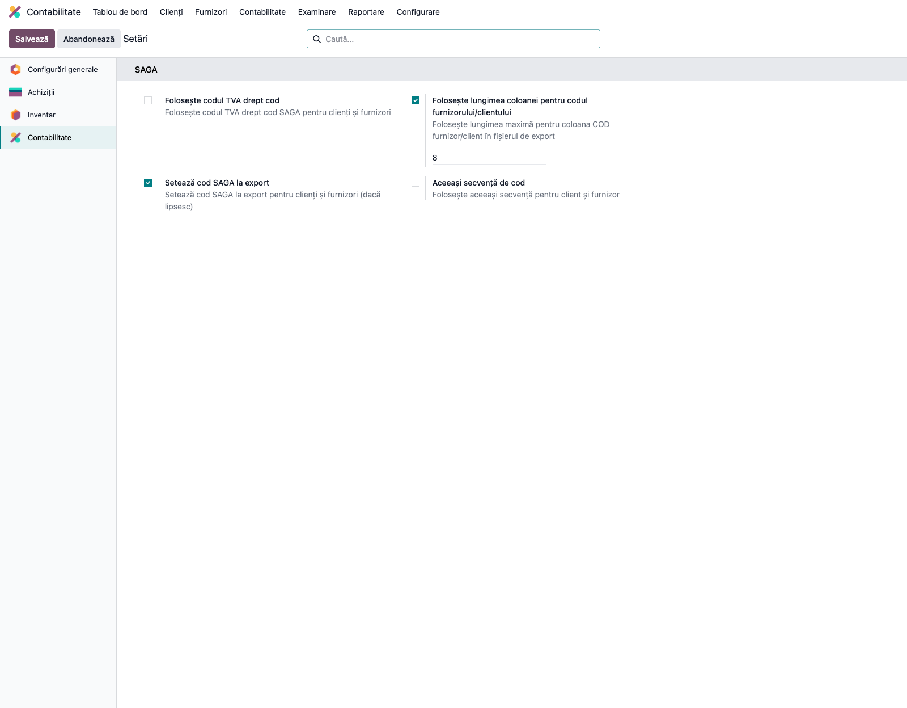
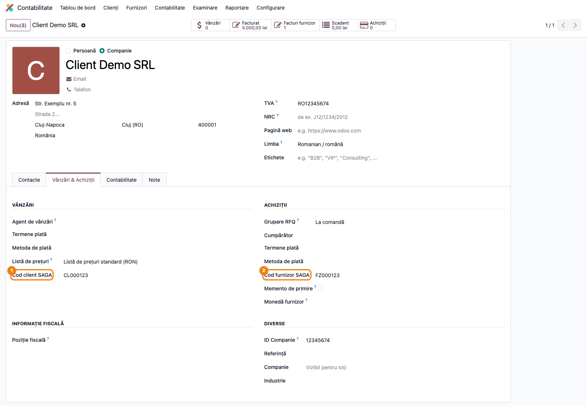
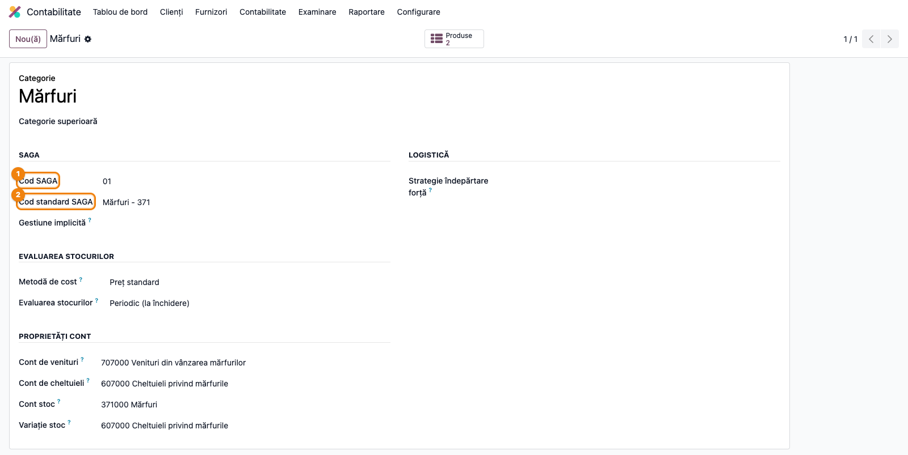
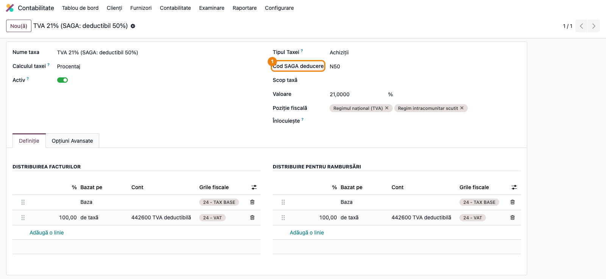
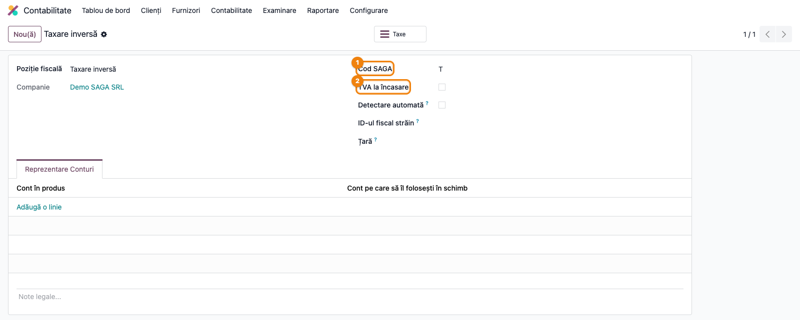
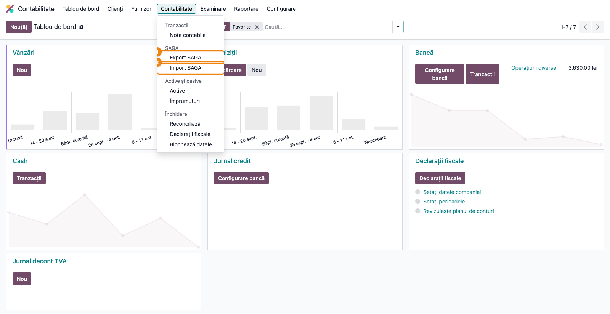
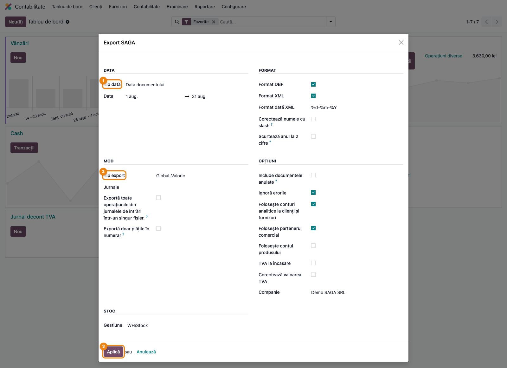
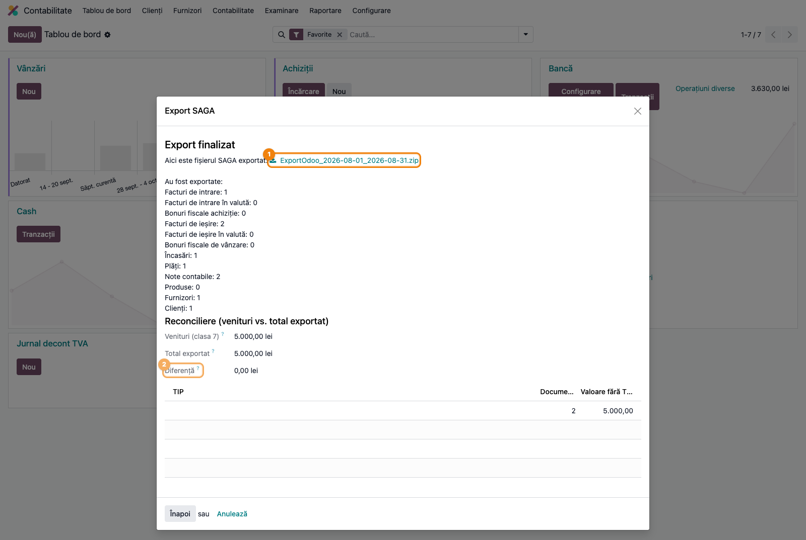
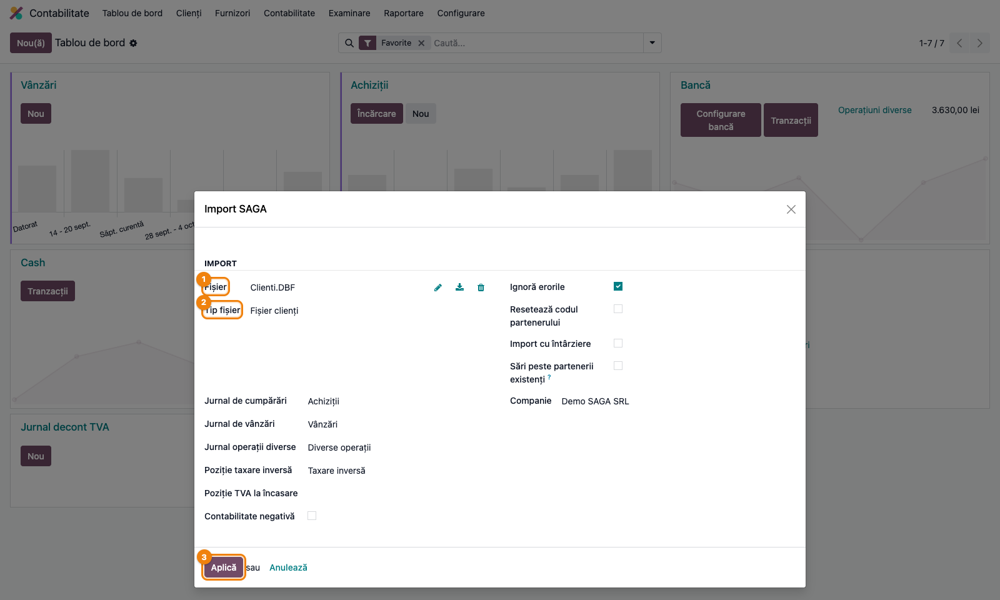

# Fișă Modul: Export și import date contabile către/dinspre SAGA

**Modul:** `deltatech_saga`
**Utilizator principal:** Contabil / responsabil financiar care ține contabilitatea în SAGA; administrator funcțional Odoo
**Prioritate:** 🔴 Ridicată (fluxul lunar de predare a datelor către contabilitate la majoritatea clienților locali)

---

## 1. Scop business

Multe firme operează vânzările, achizițiile și stocurile în Odoo, dar contabilitatea oficială
(balanță, declarații, bilanț) rămâne în **SAGA**, ținută intern sau de un cabinet de contabilitate.
Modulul `deltatech_saga` elimină reintroducerea manuală: la sfârșitul perioadei, operatorul
generează dintr-un singur asistent o arhivă ZIP cu partenerii, articolele, facturile de intrare și
ieșire, notele contabile și plățile, în formatul de import nativ SAGA (XML și/sau DBF). În sens
invers, modulul importă în Odoo fișiere exportate din SAGA (parteneri, articole, facturi, note
contabile), util la pornirea unei implementări sau la sincronizarea soldurilor.

Fișa descrie fluxul complet: configurarea codurilor SAGA, exportul lunar, controlul total pe
venituri și importul de date dinspre SAGA.

## 2. Bază legală și context

- **Legea contabilității nr. 82/1991** — obligația ținerii contabilității și a înregistrării
  cronologice a documentelor justificative; exportul asigură că documentele emise/primite în Odoo
  ajung integral în registrele contabile din SAGA.
- **OMFP 1802/2014** — planul de conturi general pe care se mapează tipurile de articole SAGA
  (371 mărfuri, 301 materii prime, 3028 alte materiale consumabile, 345 produse finite etc.).
- **Codul fiscal (Legea 227/2015)**: art. 298 — limitarea la 50% a deducerii TVA pentru vehicule
  (codul de deducere `N50` al taxei); art. 282 — TVA la încasare (opțiunea *TVA la încasare* pe
  poziția fiscală și în asistent); art. 307/331 — taxare inversă (codul `T` pe poziția fiscală).
- **OUG 28/1999 (aparate de marcat electronice fiscale)** — bonurile fiscale și facturile emise pe
  bază de bon fiscal se raportează distinct în SAGA prin coloana `TIP` (`f`, `B`, `C`).

Contextul operațional: integrarea este **pe fișiere**, nu în timp real. SAGA rămâne autoritatea
finală asupra validării contabile; erorile de configurare din SAGA se rezolvă în SAGA. Documentația
oficială de import SAGA: https://manual.sagasoft.ro/sagac/topic-76-import-date.html

## 3. Utilizatori și roluri

- **Contabil / cabinet de contabilitate** — primește arhiva ZIP și o importă în SAGA; verifică
  totalul de control pe venituri.
- **Responsabil financiar / operator facturare** — rulează exportul lunar din Odoo, corectează
  partenerii fără cod SAGA.
- **Administrator funcțional** — configurează codurile SAGA pe categorii, taxe, poziții fiscale,
  locații și setările generale.

Meniul **SAGA** și acțiunile lui sunt vizibile doar grupului **Contabilitate / Administrator**
(`account.group_account_manager`). Pe Odoo Community, utilizatorul are nevoie și de opțiunea
**Afișează toate funcțiile contabile** activă pe profil.

Roluri recomandate pentru testare:
- Administrator funcțional: instalează modulul, configurează codurile și verifică meniurile.
- Utilizator operațional (contabil): rulează exportul și importul pe baza demo.
- Manager: validează totalul de control și conținutul arhivei.

## 4. Conturi și date implicate

Conturile RO care apar în fișierele exportate sau sunt cerute de mapare:
- **4111 / 401** — clienți și furnizori; codurile SAGA de client/furnizor identifică partenerul
  în fișierele `Clienti` și `Furnizori`; opțional se exportă cu analitic pe partener.
- **4426 / 4427** — TVA deductibilă/colectată, cu tipul de deducere SAGA (`N50`, `I`) pe taxă.
- **Clasa 7 (704, 707, 709 etc.)** — totalul de control după export compară veniturile postate
  în perioadă cu totalul documentelor exportate.
- **Tipuri de articole SAGA** pe categoria de produs: 371, 301, 3021, 3022, 3024, 3028, 303, 341,
  345, 346, 381, 4091/4092 avansuri, 419 avans clienți, 609/709 discount comercial.
- **Gestiune** (cod SAGA pe locația de stoc, 4 caractere) — folosită numai la exportul
  cantitativ-valoric.

Date minime pentru demo:
- companie românească cu planul de conturi RO (`l10n_ro`), CUI completat;
- câțiva parteneri români (client, furnizor, unul fără CUI pentru a provoca avertismentul);
- categorii de produs cu cod SAGA, o taxă cu cod de deducere, o poziție fiscală de taxare inversă;
- facturi de vânzare și de achiziție **postate** în luna de test, ideal și una în valută și una pe
  bon fiscal;
- pentru import: fișierele de test din `tests/` (`Clienti.DBF`, `Furnizori.DBF`, `IE.DBF`,
  `IN.DBF`, `NC.xls`).

## 5. Configurare inițială

1. Instalați `deltatech_saga` (trage după el `account`, `stock`, `sale_stock`, `purchase_stock`,
   `l10n_ro` și `deltatech_contact`). Bibliotecile Python `xlrd`, `openpyxl`, `xlsxwriter`, `xlwt`,
   `dicttoxml` și `unidecode` trebuie instalate pe server.
2. **Contabilitate → Configurare → Setări**, secțiunea **SAGA**: decideți cum se generează codurile de
   partener — **Folosește codul TVA drept cod** (CUI drept cod SAGA), **Folosește lungimea coloanei
   pentru codul furnizorului/clientului** (implicit 8 caractere), **Setează cod SAGA la export**
   pentru partenerii fără cod, **Aceeași secvență de cod** (client/furnizor).
3. **Bază SAGA deja existentă (cazul obișnuit)**: nu introduceți codurile de mână. Exportați din
   SAGA, în format **DBF**, nomenclatoarele de **Clienți**, **Furnizori** și **Articole**, apoi
   importați-le în Odoo prin **Contabilitate → Contabilitate → SAGA → Import SAGA** (vezi Pasul 7).
   Importul creează sau actualizează partenerii și produsele cu **codurile SAGA originale**, astfel
   încât exporturile ulterioare din Odoo se leagă de înregistrările existente și SAGA nu creează
   duplicate. Faceți acest import **înainte** de primul export și repetați-l dacă în SAGA se adaugă
   parteneri direct. La final, importul mută secvențele de cod client/furnizor **după cel mai mare
   cod preluat**, ca partenerii creați ulterior în Odoo să nu primească un cod deja ocupat.
   ⚠️ Dacă preluați codurile pe altă cale (import CSV nativ Odoo, scriere directă în câmpuri),
   secvențele **nu** se realiniază singure în acel moment; modulul le corectează la primul cod
   ocupat pe care l-ar emite, dar verificați după preluare că un partener nou creat primește un cod
   liber (vezi secțiunea 8).
4. **Contacte** (parteneri creați ulterior în Odoo, sau implementare fără istoric SAGA): completați
   **Cod client SAGA** și **Cod furnizor SAGA** în tabul **Vânzări & Achiziții**, identice cu cele
   din SAGA, sau lăsați setarea *Setează cod SAGA la export* să le genereze.
5. **Categorii de produs**: completați **Cod SAGA** (2 caractere, implicit `01`) sau alegeți un
   **Cod standard SAGA** care îl completează automat; opțional gestiunea implicită.
6. **Taxe**: pe taxele cu deductibilitate limitată completați **Cod SAGA deducere** (`N50` pentru
   50%, `I` pentru nedeductibil). Câmpul este doar o **etichetă** transmisă în fișierul de export —
   nu recalculează nimic în Odoo. Dacă limitarea de 50% (art. 298 Cod fiscal, vehicule mixte) trebuie
   reflectată și în contabilitatea din Odoo, configurați taxa cu repartiția corespunzătoare (jumătate
   pe 4426 TVA deductibilă, jumătate pe un cont de cheltuială nedeductibilă); dacă taxa rămâne 100%
   deductibilă în Odoo și doar codul `N50` semnalează limitarea, jumătatea nedeductibilă se
   recalculează în SAGA la import, iar soldul 4426 din Odoo nu va coincide cu cel din SAGA până la
   acea corecție.
7. **Poziții fiscale**: completați **Cod SAGA** (`T` taxare inversă, `A` aviz) și bifați **TVA la
   încasare** unde este cazul. Codul de pe poziția fiscală are prioritate la stabilirea coloanei `TIP`.
8. **Locații de stoc** (doar pentru export cantitativ-valoric): completați **Cod SAGA** (4 caractere)
   pe locațiile interne.
9. Pentru bonuri fiscale: configurați jurnalele de bonuri fiscale și partenerul generic conform
   ghidului `deltatech_sale_store`; nu marcați jurnalele obișnuite de vânzări drept jurnale de bonuri.
10. Verificați că utilizatorul de test este în grupul **Contabilitate / Administrator**.

## 6. Flux de utilizare

### Pasul 1 — Setările generale SAGA

Accesați **Contabilitate → Configurare → Setări** și derulați la secțiunea **SAGA**. Aici se
stabilește politica de coduri de partener: CUI drept cod, lungimea coloanei, completarea automată la
export și secvența comună client/furnizor. Salvați.



### Pasul 2 — Codurile SAGA pe partener

Deschideți un partener din **Contacte** și, în tabul **Vânzări & Achiziții**, completați **Cod client
SAGA** și **Cod furnizor SAGA**. Câmpurile sunt per companie. Dacă ați bifat *Folosește codul TVA
drept cod*, codurile se completează automat din CUI. Altfel, un partener creat din formular primește
codul din secvență **chiar la creare**; *Setează cod SAGA la export* completează la export codurile
care încă lipsesc (parteneri creați pe alte căi). Un cod generat din secvență este verificat înainte de
atribuire: dacă îl deține deja un alt partener (inclusiv unul arhivat, și indiferent dacă e scris cu
zerouri în față sau fără), secvența este mutată după cel mai mare cod existent și se emite următorul
cod liber — nu apar coduri duplicate.



### Pasul 3 — Codurile SAGA pe categorii, taxe și poziții fiscale

**Inventar → Configurare → Categorii de produse**: pe fiecare categorie completați **Cod SAGA** sau
alegeți un **Cod standard SAGA** (de exemplu *Mărfuri - 371*), care completează codul automat.



**Contabilitate → Configurare → Taxe**: pe taxele cu deducere limitată completați **Cod SAGA deducere**.



**Contabilitate → Configurare → Poziții fiscale**: completați **Cod SAGA** (aici `T`, taxare inversă),
**fără** bifa **TVA la încasare** — operațiunile cu taxare inversă sunt excluse din sistemul TVA la
încasare (art. 282 alin. (6) Cod fiscal). Bifa se pune doar pe poziția fiscală dedicată TVA la
încasare.



Dacă taxarea inversă se aplică pe produs, prin taxă (de exemplu `0% R331` / `21% R331` din
`l10n_ro_reverse_charge_331`), poziția fiscală nu are nevoie de cod: exportul pune `TIP` = `T`
singur pe facturile ale căror linii au taxe cu bifa *Reverse Charge Art. 331*, taxe din grupul
„TVA Taxare Inversa" sau, la achiziții de la furnizori din țară, taxe cu autolichidare
(+100% 4426 / −100% 4427). Tipul ține de document, nu de linie, așa că o factură mixtă
(cherestea și bere pe același document) nu poate pleca corect așa cum e. Opțiunea **Facturi mixte
cu taxare inversă** din asistentul de export alege ce se face:
- *Nu se exportă (se introduce manual)* — implicit: rezultatul exportului afișează o eroare, iar
  factura se introduce manual în programul de contabilitate, cu același număr;
- *Se exportă cu tipul T*: tot documentul pleacă cu `T`; după import se corectează liniile cu TVA
  obișnuit, care apar ca taxare inversă (la achiziție li s-ar autolichida TVA-ul);
- *Se exportă fără tip*: după import se corectează liniile cu taxare inversă, care apar ca livrări
  obișnuite.

Pentru fiecare factură mixtă, rezultatul exportului spune ce linii trebuie corectate.

### Pasul 4 — Deschiderea asistentului de export

Accesați **Contabilitate → Contabilitate → SAGA → Export SAGA**. Meniul **SAGA** apare în grupul
de meniuri contabile și conține **Export SAGA** și **Import SAGA**.



### Pasul 5 — Completarea asistentului și generarea arhivei

În asistent completați, în ordine:

- **Tip dată**: *Data documentului* (implicit, exportul lunar obișnuit, selectează documentele după
  data contabilă) sau *Data modificării* (selectează după data creării, pentru exporturi
  incrementale; filtrează și partenerii creați/modificați în interval).
- **Perioada**: implicit luna precedentă pentru *Data documentului*, respectiv ziua de ieri pentru
  *Data modificării*.
- **Format**: **Format DBF** și/sau **Format XML** (ambele bifate implicit; XML recomandat pentru
  versiunile noi de SAGA). Pentru XML alegeți **Format dată XML** (implicit `%d-%m-%Y`). Opțiunea
  **Corectează numele cu slash** scoate `/` din numărul facturilor de ieșire în DBF și din `NR_DOC` al
  notelor contabile; în XML numărul facturii pleacă neschimbat. Opțiunea **Scurtează anul la 2 cifre**
  (implicit nebifată) scurtează anul de 4 cifre la 2 în numărul încasărilor/plăților (`Numar`, ex.
  `BNK1/2026/08/0088` → `BNK1260800088`) și în `NR_DOC` al notelor atunci când acesta cade pe numărul
  notei (referința era prea lungă). **Nu** scurtează `NDP` și nici un `NR_DOC` luat din referință.
  Bifați-o dacă numerele încasărilor/plăților depășesc limita practică SAGA de 16 caractere.
- **Tip export**: *Global-Valoric* (implicit: parteneri, facturi, note contabile, plăți) sau
  *Cantitativ-Valoric* (adaugă fișierul de articole și mișcările de consum/producție, cu câmpul
  **Gestiune**).
- **Jurnale**: goliți pentru toate jurnalele sau restrângeți la câteva. Jurnalul generat automat de
  Odoo pentru **TVA la încasare** (cod `CABA`) este exclus mereu din notele contabile: exigibilizarea
  TVA-ului (4428 → 4427/4426) o face SAGA la import, pe baza marcajului de TVA la încasare al
  facturii. De aceea, la firmele cu TVA la încasare, bifați opțiunea pe poziția fiscală sau în
  asistent — altfel SAGA înregistrează TVA-ul direct ca exigibil.
- Opțiuni: **Exportă toate operațiunile din jurnalele de intrări într-un singur fișier**, **Exportă
  doar plățile în numerar** (⚠️ nu doar plățile: restrânge *toate* notele contabile colectate la
  jurnalele de casă, deci reduce și fișierele `NC_*` — nu o folosiți la exportul lunar complet, ci
  doar când chiar vreți exclusiv operațiunile de casă), **Include documentele anulate**, **Ignoră
  erorile** (continuă peste un document defect), **Folosește conturi analitice la clienți și
  furnizori**, **Folosește partenerul comercial**, **Folosește contul produsului**, **TVA la
  încasare** (aplică regimul de TVA la încasare la nivelul întregului export, nu doar poziției
  fiscale), **Corectează valoarea TVA**.



Apăsați **Aplică**. Odoo generează o singură arhivă `ExportOdoo_<de la>_<până la>.zip`.

### Pasul 6 — Citirea rezultatului și controlul total

Ecranul de rezultat are trei zone. **Găsiți pe ecran**:

1. **Fișierul exportat** — linkul de descărcare al arhivei ZIP.
2. **Sumarul** „Au fost exportate:" — numărul de furnizori, clienți, articole, facturi de intrare
   și ieșire (RON și valută), note contabile și plăți cuprinse. Dacă în perioadă există facturi de
   furnizor al căror partener nu are **țara** completată, sub sumar apare avertismentul „Facturi de
   intrare cu furnizor fără țară, exportate ca facturi din România", cu lista facturilor.
3. **Reconciliere (venituri vs. total exportat)** — **Venituri (clasa 7)**: totalul liniilor postate
   pe conturile de venituri din perioadă; **Total exportat**: suma fără TVA a facturilor, notelor de
   credit și bonurilor de vânzare exportate; **Diferență**; dedesubt, tabelul pe **TIP** cu numărul
   de documente și valoarea fără TVA.

**Verificați** înainte de a preda arhiva, cu criteriul **„diferența este explicată"**, nu neapărat
zero — diferența are câteva cauze structurale, pe lângă cea accidentală:
- **Venituri (clasa 7) se calculează pe toată compania**, fără să țină cont de jurnalele alese la
  Pasul 5. Dacă restrângeți exportul la câteva jurnale de vânzare, diferența crește cu veniturile din
  jurnalele excluse — nu e o eroare.
- **Conturile de clasa 7 fără corespondent în facturi** (711 variația stocurilor, 766 dobânzi
  încasate, 765 diferențe de curs, 767 sconturi primite, 758x alte venituri) intră în totalul de venituri, dar nu apar niciodată în totalul
  exportat (bazat strict pe facturi). La o firmă cu producție sau venituri financiare, o parte din
  diferență e permanentă și normală.
- Cu *Include documentele anulate* bifat, facturile anulate intră în **Total exportat**, dar nu și în
  **Venituri**, care numără doar liniile postate — diferența crește cu valoarea lor.
- Peste acestea, o diferență **suplimentară** apare de regulă când o notă contabilă manuală a
  atins direct un cont de venituri sau când o factură de furnizor a fost înregistrată pe un cont de
  clasa 7; acestea sunt în afara exportului de facturi și se discută cu contabilul.
- Numărul de documente din sumar corespunde cu **Contabilitate → Clienți → Facturi** filtrat pe
  perioadă și stare *Postat*.
- Rândurile `TIP` = `f`/`B`/`C` există doar dacă ați avut bonuri fiscale în perioadă; rândul cu
  `TIP` **necompletat** corespunde facturilor obișnuite (fără bon fiscal, fără poziție fiscală cu
  cod SAGA propriu).

**Apoi** descărcați arhiva și predați-o contabilului. Conținutul, în funcție de datele găsite:
`Furnizori`/`FUR`, `Clienti`/`CLI`, `Articole`/`ART` (doar cantitativ-valoric), `IN_<jurnal>`
(furnizori din România sau fără țară) și `INV_<jurnal><valută>` (furnizori străini), `IE_<jurnal>` și
`IEV_<jurnal><valută>` (ieșiri RON/valută) — în XML, fișierele de facturi au în față prefixul
`F_<CUI>_` / `f_<CUI>_` (ex. `F_14388698_IN_BILL_…xml`), `NC_<jurnal>` (note contabile, doar DBF), `I_<jurnal>`/`P_<jurnal>` (încasări/plăți,
doar XML), `BC_`/`PRODUCTIE_` (consumuri/producție, doar DBF, cantitativ-valoric).



**Importul în SAGA** se face în ordinea: parteneri (furnizori, clienți), articole (dacă există),
facturi (IN/IE/INV/IEV), apoi note contabile și plăți. Cele două formate **nu** conțin aceleași date:

| Date | XML | DBF |
|---|---|---|
| parteneri, articole, facturi | da | da (aceleași date — alegeți **un singur** format) |
| încasări/plăți (`I_`/`P_`) | da | — |
| note contabile (`NC_`) | — | da (inclusiv jurnalele de bancă/casă) |

Regula recomandată: **XML** pentru parteneri, facturi și încasări/plăți, plus din DBF **doar
fișierele `NC_<jurnal>` ale jurnalelor care nu sunt de bancă sau casă** (diverse, salarii,
amortizări, diferențe de curs). Dacă importați doar XML, notele diverse lipsesc din SAGA; dacă
importați și `NC_` al jurnalelor de bancă, operațiunile bancare se dublează.

### Pasul 7 — Importul de date din SAGA

Acest pas este **primul** care se execută la o implementare peste o bază SAGA existentă: exportați
din SAGA nomenclatoarele **Clienți**, **Furnizori** și **Articole** în format DBF și importați-le în
Odoo, ca partenerii și produsele să primească codurile SAGA originale. Același asistent servește apoi
la importul facturilor și notelor contabile din SAGA, când e nevoie.

Accesați **Contabilitate → Contabilitate → SAGA → Import SAGA**. Încărcați fișierul exportat din SAGA;
**Tipul fișierului** se detectează automat doar când numele are prefixul SAGA (`Clienti_…`,
`Furnizori_…`, `IN_…`, `IE_…`, `NC_…`); pentru **Articole** și pentru fișierele redenumite (ex.
`Clienti.DBF`) alegeți tipul manual. Alegeți jurnalul de achiziții, de vânzări sau
de operațiuni diverse după tipul fișierului, pozițiile fiscale pentru taxare inversă și TVA la
încasare, și opțiunile **Ignoră erorile**, **Sări peste partenerii existenți**, **Resetează codul
partenerului**, **Import cu întârziere** (rulează în fundal prin coada de joburi, dacă `queue_job` e
instalat). Apăsați **Aplică**; importul de parteneri rulează pe loturi de 500 cu bară de progres, iar
ecranul final listează înregistrările create/actualizate și erorile.



### Ce pleacă spre SAGA și ce nu

Exportul transferă **numai documente contabile**. Comenzile de vânzare, ofertele, comenzile de
achiziție, recepțiile și livrările **nu se exportă**: SAGA nu are un corespondent pentru ele, iar
contabilitatea lor apare în SAGA abia prin factura sau nota contabilă pe care le generează în Odoo.
Din perioada selectată intră în arhivă:

- **Facturile** (`IE`/`IEV` ieșiri, `IN`/`INV` intrări): toate facturile, notele de credit și
  bonurile **postate** din jurnalele de vânzări și achiziții alese, cu partenerul, liniile, TVA-ul,
  coloana `TIP` și, pentru valută, cursul documentului. O factură în ciornă sau anulată nu pleacă
  (facturile de ieșire anulate pleacă doar cu *Include documentele anulate*; cele de intrare niciodată).
  Facturile de intrare se împart între `IN` și `INV` după **țara furnizorului**, nu după monedă:
  `IN` = furnizor din România sau fără țară, `INV` = furnizor străin. O factură în valută de la un
  furnizor din România pleacă deci în `IN` — verificați-o după import în SAGA. O factură de furnizor
  al cărui partener nu are **țara** completată pleacă în `IN`, ca un furnizor din România, și e
  listată în avertismentul din sumar (Pasul 6). Furnizorii străini fără țară sunt tocmai cei care
  facturează în valută: completați-le țara și reexportați, ca factura să plece în `INV`.
  Bonurile de vânzare (`out_receipt`) se exportă numai din jurnalele marcate ca jurnale de bonuri
  fiscale; un bon dintr-un jurnal nemarcat nu pleacă.
- **Încasările și plățile** (`I_<jurnal>` încasări clienți, `P_<jurnal>` plăți furnizori, doar în
  XML): notele contabile **postate** din jurnalele de tip **Bancă** și **Casă** ale perioadei care au
  o linie pe **contul jurnalului** (5121 / 5311) — adică liniile de extras de bancă și registrul de
  casă, contabilizate și reconciliate. Sensul se deduce din acea linie: credit pe 5121/5311 → `P_`,
  debit → `I_`. Intră **toate** mișcările băncii/casei, nu doar cele cu clienți și furnizori:
  contrapartida (`ContClient`/`ContFurnizor`) este contul real al liniei — 4111/401, dar și 627
  comisioane, 421 salarii, 581 transferuri etc. Cu *Exportă doar plățile în numerar* rămân numai cele
  din jurnalele de casă.
  **Plăți înregistrate prin contul de plăți în curs** (butonul **Plată** din factură, apoi
  reconcilierea extrasului cu plata): până la reconcilierea cu extrasul, plata nu are linie pe
  5121 și nu apare în `I_`/`P_`. După reconciliere, linia extrasului e înlocuită în export cu
  liniile notei de plată: contrapartida e 4111/401 al partenerului, împărțită pe facturi, cu
  `FacturaNumar`, deci SAGA stinge factura. O diferență trecută ca *write-off* la înregistrarea
  plății (ex. o reducere acceptată, Dr 401 = Cr 767) apare ca două mișcări brute (plată 401 + încasare
  767): soldurile sunt corecte, dar registrul de bancă din SAGA arată două linii în locul sumei nete
  de pe extras. Dacă reducerea modifică baza impozabilă, ajustarea TVA se face separat, pe baza
  documentului furnizorului.
  Până la reconcilierea extrasului, soldurile 4111/401 din Odoo și din SAGA diferă temporar cu
  plățile aflate încă pe contul de plăți în curs (factura e închisă în Odoo, deschisă în SAGA);
  diferența dispare la exportul lunii în care se reconciliază extrasul.
  **Plată și extras în valută, la cursuri diferite:** Odoo închide cele două linii de pe contul de
  plăți în curs și printr-o notă de diferență de curs. Diferența pleacă în `I_`/`P_` pe 765 (curs
  extras mai mare: Dr 5121 110 = Cr 4111 100 + Cr 765 10) sau pe 665 (curs extras mai mic: încasare
  4111 100 plus plată 665 10, net 90 cât e pe extras), iar clientul/furnizorul se stinge cu suma
  integrală a plății. Nota de diferență de curs **nu** mai pleacă și în `NC_<jurnal diferențe de
  curs>` (ex. `NC_EXCH`), deci SAGA înregistrează diferența o singură dată, iar contul de plăți în
  curs nu apare deloc. Excepție: cu formatul XML debifat nu există `I_`/`P_`, extrasul pleacă în
  `NC_` al băncii pe contul de plăți în curs, iar nota de curs rămâne în `NC_` ca să-l închidă.
  Corectat în 19.0.6.23.3; o arhivă exportată cu 19.0.6.23.0–19.0.6.23.2 are nota și în `NC_` al
  jurnalului de diferențe de curs — la ea nu importați notele din acel fișier care închid contul de
  plăți în curs, sau reexportați perioada.
- **Suma și moneda plății**: `Suma` este întotdeauna în **moneda companiei (RON)**, iar `Moneda`
  este RON — o plată încasată în EUR/USD pleacă cu contravaloarea în lei din Odoo, nu cu suma în
  valută.
- **Reconcilierea plată ↔ factură** se transmite pe fiecare linie de încasare/plată prin câmpul
  `FacturaNumar` (și `FacturaID`):
  - linia de partener a plății **reconciliată în Odoo** cu o singură factură → o linie, cu numărul
    acelei facturi; SAGA stinge factura la import;
  - plată reconciliată cu **mai multe facturi** → **câte o linie pe factură**, fiecare cu suma
    efectiv stinsă pe acea factură (SAGA stinge o singură factură pe linie);
  - factură plătită **în mai multe tranșe** → fiecare tranșă pleacă doar cu suma ei, nu cu totalul
    facturii;
  - plată reconciliată **parțial** (ex. supraplată, avans rămas pe cont) → câte o linie pe factură,
    cu suma stinsă, plus o linie cu **restul**, fără factură (doar referința liniei); restul rămâne de
    alocat în SAGA;
  - plată **nereconciliată** → primește doar referința liniei, iar stingerea rămâne de făcut în SAGA.

  SAGA leagă plata de factură întâi după `FacturaID` (când factura a intrat în SAGA prin XML), apoi
  după număr. `FacturaNumar` este numărul cu care factura a ajuns în SAGA: la facturile de
  **client**, numărul facturii din Odoo (ex. `INV/2026/00012`, același ca în `IE` XML; în DBF, cu
  *Corectează numele cu slash*, `IE` pleacă fără `/`), nu referința ei —
  pe facturile create din comenzi, referința e numărul comenzii sau PO-ul clientului (ex. `S00012`),
  pe care SAGA nu îl cunoaște; la facturile de **furnizor**, **numărul facturii furnizorului**
  (câmpul *Referință furnizor*, ex. `FAS26294`), sau numărul intern din Odoo (`BILL/2026/08/0039`)
  dacă referința lipsește — același număr cu care factura a ajuns în SAGA prin fișierul `IN`.
  Completați deci *Referința furnizor* pe facturile de achiziție. Reconcilierea extraselor și a
  plăților se face în Odoo **înainte** de export.
- **Numărul documentului de plată** (`Numar`): SAGA identifică o încasare/plată după „număr + dată",
  deci două linii cu același număr s-ar suprascrie la import. Numărul pleacă **fără caracterele `/`**
  (ex. `BNK1/2026/08/0088` devine `BNK12026080088`), iar când aceeași plată produce mai multe linii
  (o plată reconciliată cu mai multe facturi), prima linie păstrează numărul, iar următoarele primesc
  sufixul `*1`, `*2` etc. Verificarea de 16 caractere nu se aplică aici (doar notelor `NC_`); dacă
  numerele depășesc limita practică SAGA de 16 caractere, bifați *Scurtează anul la 2 cifre*; exportul
  nu avertizează la depășirea acestei limite pe `Numar`, deci verificați lungimea (secțiunea 8).
  **Încasări cu comision reținut** (ex. Stripe, POS bancar: Dr 5121 97 + Dr 627 3 = Cr 4111 100):
  fiecare contrapartidă pleacă în fișierul potrivit sensului ei — încasarea 4111 în `I_`, comisionul
  627 în `P_` (Dr 627 = Cr 5121). O notă cu contrapartide în ambele sensuri apare deci în ambele
  fișiere, cu sufixe `*N` numărate pe toată nota, ca numerele să nu se repete între fișiere.

  Extras din fișierul `I_BNK1_…xml` generat pe baza demo — o singură încasare de 6.050 lei (facturi de 4.235 și 1.815 lei, TVA 21% inclus),
  reconciliată cu două facturi, pleacă în două linii, fiecare cu suma stinsă pe factura ei:

  ```xml
  <Incasari>
    <Linie>
      <Data>20-08-2026</Data>
      <Numar>BNK1202600001</Numar>
      <Suma>1815.0</Suma>
      <Cont>5121.1</Cont>
      <ContClient>4111.CL000123</ContClient>
      <FacturaNumar>INV/2026/00002</FacturaNumar>
      <Moneda>RON</Moneda>
    </Linie>
    <Linie>
      <Data>20-08-2026</Data>
      <Numar>BNK1202600001*1</Numar>
      <Suma>4235.0</Suma>
      <Cont>5121.1</Cont>
      <ContClient>4111.CL000123</ContClient>
      <FacturaNumar>INV/2026/00001</FacturaNumar>
      <Moneda>RON</Moneda>
    </Linie>
  </Incasari>
  ```

  Iar în `P_BNK1_…xml`, plata către furnizor poartă referința furnizorului, nu numărul intern
  `BILL/2026/08/0001`:

  ```xml
  <Plati>
    <Linie>
      <Data>20-08-2026</Data>
      <Numar>BNK1202600002</Numar>
      <Suma>2420.0</Suma>
      <Cont>5121.1</Cont>
      <ContFurnizor>401.FZ000123</ContFurnizor>
      <FacturaNumar>FAS26294</FacturaNumar>
      <Moneda>RON</Moneda>
    </Linie>
  </Plati>
  ```

  (Extrasele sunt scurtate: câmpurile `Explicatie`, `FacturaID`, `CodFiscal`, `PartnerName` există
  în fișier, dar nu sunt redate aici.)
- **Notele contabile** (`NC_<jurnal>`, doar DBF): toate notele **postate** de tip înregistrare
  contabilă din jurnalele alese (diverse, salarii, amortizări, dar și cele de bancă/casă, care apar
  astfel și ca note brute), cu excepția jurnalului de TVA la încasare. SAGA le importă ca note
  contabile cu conturile din fișier. Coloanele fișierului sunt, în ordine, `DATA, NR_DOC, CONT_D,
  CONT_C, SUMA, EXPLICATIE, …`; explicația are până la 70 de caractere, cursul valutar 4 zecimale.
  Câmpurile **`NDP`** (număr articol contabil) și **`NR_DOC`** au limita SAGA de **16 caractere**:
  dacă `NR_DOC` vine dintr-o referință prea lungă (ex. eticheta tranzacției de la Stripe), exportul
  folosește automat numărul notei (fără `/`); dacă nici acela nu încape, exportul semnalează documentul (vezi
  secțiunea 9) în loc să taie tăcut valoarea — două documente tăiate la același identificator ar fi
  unite de SAGA într-unul singur.
- **Adresa partenerului** din nomenclatoare și din facturi conține doar strada (stradă + detalii
  adresă, maximum 48 de caractere); țara, județul și localitatea pleacă în câmpurile lor separate.

Nu importați în SAGA, pentru aceeași perioadă, și `NC` (DBF) și `I`/`P` (XML) ale jurnalelor de bancă
și casă: sunt aceleași operațiuni în două forme (vezi tabelul de la Pasul 6).

### Pasul 8 — Preluarea soldurilor din balanța SAGA (implementare inițială)

La trecerea de la SAGA la Odoo, soldurile de deschidere pe parteneri se pot prelua direct din
**balanța de verificare analitică** exportată ca PDF din SAGA, fără să le retastați. Meniul e vizibil
doar în **modul dezvoltator** (`account.group_account_manager` + `base.group_no_one`): **Contabilitate
→ Contabilitate → SAGA → Mapare balanță**.

Încărcați PDF-ul balanței, alegeți **Tip partener** (client/furnizor) și, opțional, **Cont sintetic** pentru a limita maparea la un cont sintetic (ex. `4111` sau `401`). La **Generează maparea**,
asistentul potrivește fiecare rând din balanță cu un partener Odoo după codul SAGA (`ref_customer`/
`ref_supplier`) și, unde codul nu se regăsește, după numele normalizat (fără diacritice și fără forme
juridice precum SRL/SA). Rezultatul e un fișier **XLSX** cu totalul de rânduri, câte s-au potrivit
automat și câte rămân de verificat manual (rândurile roșii, duplicate sau nepotrivite).

Încărcarea propriu-zisă a soldurilor **nu e automată**: fișierul XLSX se completează manual pentru
rândurile nepotrivite, apoi se importă cu importul nativ Odoo în **import.chart.of.accounts** (din
modulul `deltatech_chart_of_accounts`, care trebuie instalat separat), iar nota de deschidere se postează separat, la final, cu
butonul **Postează diferența**. Acest pas se face o singură dată, la implementare, nu la fiecare
export lunar.

### Note de monografie și raportare

Modulul **nu generează note contabile proprii la export**; el transcrie documentele deja postate în
Odoo în formatul SAGA. Notele rezultă în SAGA la import, după monografia standard:
- factură de vânzare (`IE`): **Dr 4111 = Cr 70x + Cr 4427**; în valută (`IEV`) cu cursul din
  document;
- factură de achiziție (`IN`): **Dr 3xx/6xx + Dr 4426 = Cr 401**; pentru taxa cu cod `N50`, SAGA
  deduce doar 50% din TVA; pentru codul `I`, TVA rămâne nedeductibilă;
- taxare inversă (`TIP` = `T`): la **achiziție** (`IN`) beneficiarul autolichidează TVA-ul —
  **Dr 4426 = Cr 4427**; la **vânzare** (`IE`) nota este **Dr 4111 = Cr 70x**, fără TVA, cu mențiunea
  „taxare inversă";
- bonuri fiscale (`TIP` = `f`/`B`/`C`): se raportează în jurnalul de vânzări SAGA ca vânzări cu
  bon fiscal, cu sau fără factură;
- încasări/plăți (`I`/`P`): **Dr 5311/5121 = Cr 4111** respectiv **Dr 401 = Cr 5311/5121**, cu
  stingerea facturii indicate în `FacturaID`/`FacturaNumar`; pentru celelalte mișcări ale băncii,
  contrapartida este contul din fișier (ex. **Dr 627 = Cr 5121** comision, **Dr 421 = Cr 5121**
  salarii);
- note contabile (`NC`): liniile Dr/Cr ale notelor din jurnalele selectate sunt transferate ca atare.

La import (SAGA → Odoo), notele contabile din `NC` se creează în jurnalul de operațiuni diverse ales,
cu conturile din fișier; facturile din `IN`/`IE` se creează în jurnalele alese și preiau pozițiile
fiscale configurate.

## 7. Legături cu alte module / declarații

| Modul / proces | Rol în flux | Tip legătură |
|---|---|---|
| `account`, `l10n_ro` | facturi, note contabile, planul de conturi RO | dependență (manifest) |
| `stock`, `sale_stock`, `purchase_stock` | gestiuni, exportul cantitativ-valoric, consumuri/producție | dependență (manifest) |
| `deltatech_contact` | CUI/NRC pe partener, folosite ca cod SAGA | dependență (manifest) |
| `deltatech_sale_store` | flagul *Vânzare din magazin* care stabilește `TIP` = `f` pe facturile cu bon fiscal | opțional |
| `deltatech_saga_mrp` | exportul consumurilor și al producției din MRP | extensie opțională |
| `deltatech_chart_of_accounts` | importul soldurilor inițiale (`import.chart.of.accounts`, butonul *Postează diferența*) din Pasul 8 | necesar doar pentru Pasul 8 |
| Declarații ANAF (D300, D394) | rămân în SAGA, pe baza datelor importate | în afara Odoo |

Ce este automat: colectarea documentelor din perioadă, generarea codurilor de partener (dacă e
configurată) fără duplicate, realinierea secvențelor de cod după importul de parteneri, împachetarea
în ZIP, legarea plăților de facturi pe baza reconcilierii din Odoo (câte o linie pe factură, cu suma
stinsă), conversia plăților în valută în lei, excluderea jurnalului de TVA la încasare din note,
controlul total pe clasa 7, detectarea tipului de fișier la import.
Ce rămâne manual: maparea inițială a codurilor SAGA, reconcilierea plăților cu facturile în Odoo
înainte de export, importul propriu-zis în SAGA, analiza diferenței din reconciliere și corectarea
documentelor semnalate la *Ignoră erorile*.
Ce nu se exportă niciodată: comenzi de vânzare și achiziție, oferte, recepții și livrări (fără
corespondent în SAGA); ele ajung în SAGA doar prin facturile și notele contabile generate.

## 8. Verificări pentru consultant

- [ ] Modulul se instalează fără erori și bibliotecile Python externe sunt prezente pe server.
- [ ] Meniul **Contabilitate → Contabilitate → SAGA** e vizibil pentru contabil și ascuns pentru un
      utilizator fără grupul de administrator contabil.
- [ ] Pe o bază SAGA existentă, nomenclatoarele Clienți/Furnizori/Articole exportate din SAGA în DBF
      s-au importat în Odoo înainte de primul export, iar partenerii au codurile SAGA originale.
- [ ] Un partener existent în SAGA are aceleași coduri client/furnizor în Odoo; exportul lui nu
      creează duplicat la import în SAGA.
- [ ] O categorie fără cod SAGA produce avertismentul „Categoria … nu are cod SAGA" la exportul
      cantitativ-valoric.
- [ ] Exportul lunar cu *Data documentului* pe luna de test generează arhiva ZIP cu fișierele
      `Clienti`, `Furnizori`, `IE_*`, `IN_*` corespunzătoare jurnalelor.
- [ ] Sumarul „Au fost exportate" corespunde numărului de facturi postate din perioadă.
- [ ] **Diferența** din reconciliere este zero pe baza demo; după o notă manuală pe 707, diferența
      devine exact valoarea acelei note.
- [ ] O factură pe bon fiscal apare cu `TIP` = `f`; o factură de achiziție cu poziție fiscală de
      taxare inversă apare cu `TIP` = `T` și, după import, SAGA o înregistrează Dr 4426 = Cr 4427.
- [ ] O factură cu linii pe taxa `21% R331` / `0% R331`, fără cod pe poziția fiscală, apare tot cu
      `TIP` = `T`; una mixtă, cu opțiunea implicită, lipsește din `IE_*`/`IN_*` și apare cu eroare
      în rezultatul exportului.
- [ ] O încasare reconciliată în Odoo cu o factură apare în fișierul `I_*` cu numărul facturii în
      `FacturaNumar`; una nereconciliată apare doar cu referința liniei.
- [ ] O plată către furnizor apare în `P_*` cu **Referința furnizor** a facturii în `FacturaNumar`,
      nu cu numărul intern `BILL/…`.
- [ ] O plată reconciliată cu două facturi produce două linii în `I_*`/`P_*`, fiecare cu suma
      stinsă pe factura ei; a doua linie are numărul cu sufixul `*1`.
- [ ] O factură achitată în două tranșe: fiecare tranșă apare cu suma ei, iar suma lor este totalul
      facturii (nu de două ori totalul).
- [ ] O plată înregistrată din factură, încă nereconciliată cu extrasul de bancă, nu apare în
      `I_*`/`P_*`. După reconcilierea extrasului apare cu `ContClient`/`ContFurnizor` = 4111/401 și cu
      `FacturaNumar` al facturii, nu pe contul de plăți în curs.
- [ ] O încasare cu comision reținut: 4111 apare în `I_*`, comisionul 627 în `P_*`.
- [ ] O încasare în EUR apare cu `Suma` în lei (contravaloarea din Odoo) și `Moneda` = RON.
- [ ] Niciun `Numar` din `I_*`/`P_*` nu conține `/` și niciunul nu depășește 16 caractere (altfel
      bifați *Scurtează anul la 2 cifre* și reexportați).
- [ ] O plată mai mare decât factura (supraplată): în `I_*` apare linia pe factură cu suma facturii și
      o linie separată cu restul, fără factură.
- [ ] O încasare în valută la alt curs decât plata: diferența apare o singură dată în arhivă — în
      `I_*` pe 765 (curs extras mai mare) sau în `P_*` pe 665 (curs extras mai mic) —, iar nota de
      diferență de curs care închide contul de plăți în curs **nu** apare în `NC_` al jurnalului de
      diferențe de curs. Clientul se stinge cu suma integrală a plății, contul de plăți în curs rămâne
      fără sold în SAGA.
- [ ] Pe o firmă cu TVA la încasare, `NC_*` nu conține linii din jurnalul `CABA` (cont debitor =
      cont creditor).
- [ ] Raportul de export nu are mesaje „peste limita SAGA de 16" caractere; dacă are, documentul
      indicat a fost renumerotat înainte de predarea arhivei.
- [ ] După preluarea codurilor de parteneri (import SAGA sau CSV), un partener nou creat în Odoo
      primește un cod SAGA care nu există deja la alt partener.
- [ ] O încasare pe o factură creată dintr-o comandă de vânzare are în `FacturaNumar` numărul facturii
      (`INV/…`), nu numărul comenzii (`S…`) și nici PO-ul clientului.
- [ ] O factură de furnizor cu partener fără țară apare în `IN_*` și în avertismentul din sumar.
- [ ] O comandă de vânzare confirmată dar nefacturată nu produce nimic în arhivă.
- [ ] Fișierul XML se importă în SAGA fără erori de structură; din DBF se importă doar `NC_` al
      jurnalelor care nu sunt de bancă/casă, iar în SAGA nu apar nici note diverse lipsă, nici
      operațiuni bancare dublate.
- [ ] Importul fișierelor de test `Clienti.DBF`/`IE.DBF` creează partenerii și facturile în jurnalul ales.
- [ ] Mesajele de eroare sunt în română și indică partenerul/categoria problematică.

## 9. Mesaje de eroare frecvente

| Mesaj / simptom | Cauză probabilă | Remediere |
|-----------------|-----------------|-----------|
| „Partenerul … nu are cod de client SAGA" / „… cod de furnizor SAGA" | Partener fără cod și *Setează cod SAGA la export* nebifată | Completați codul pe partener sau bifați completarea automată în Setări |
| „Partenerul … nu are CUI" | Partener companie fără CUI, iar codul se generează din CUI | Completați CUI-ul sau treceți partenerul pe persoană fizică |
| „Partenerul … nu este de fapt o companie?" | Partener persoană fizică cu CUI/denumire de firmă | Bifați *Este companie* pe partener |
| „Categoria … a produsului … nu are cod SAGA" | Categorie fără cod la export cantitativ-valoric | Completați **Cod SAGA** pe categoria de produs |
| „Locația … nu are setat un cod SAGA (Gestiune)" | Locație internă fără cod la export cantitativ-valoric | Completați **Cod SAGA** pe locația de stoc |
| „Documentul …: câmpul NDP/NR_DOC are N caractere (…), peste limita SAGA de 16" | Număr de notă prea lung (NDP, mai ales cu sufixul `*N`) sau referință prea lungă | Pentru `NR_DOC`: bifați *Scurtează anul la 2 cifre* și reexportați. Pentru `NDP` opțiunea nu ajută, iar scurtarea codului de jurnal nu schimbă notele deja înregistrate — singura remediere e renumerotarea notei. Cu *Ignoră erorile* bifat (implicit) exportul continuă, dar valoarea e tăiată la 16 caractere și poate coincide cu a altei note — **nu predați arhiva** cu astfel de mesaje |
| SAGA preia o singură plată din mai multe cu același număr | Arhivă generată cu o versiune mai veche a modulului (fără sufixul `*N`) | Actualizați modulul și regenerați exportul pentru perioadă |
| Sold furnizor rămas deschis în SAGA deși plata s-a importat | Factura de furnizor nu are *Referință furnizor* sau plata nu e reconciliată în Odoo | Completați referința, reconciliați plata și reexportați |
| Partener nou creat fără cod SAGA (în jurnalul serverului: „no free code found for sequence …") | Secvența nu a găsit un cod liber după mai multe încercări | Completați codul manual pe partener și verificați secvența `saga.ref.customer`/`saga.ref.supplier` |
| Avertisment „Facturi de intrare cu furnizor fără țară, exportate ca facturi din România" | Furnizor fără **țară** completată; factura a plecat în `IN` (RON) | Dacă furnizorul e din România, nimic de făcut (completați totuși țara); dacă e străin, completați țara și reexportați, ca factura să plece în `INV` |
| „Factura … fără linii" | Factură postată fără linii (de regulă document de test) | Anulați factura sau bifați *Ignoră erorile* |
| Meniul SAGA nu apare | Utilizatorul nu e în grupul administrator contabil (Community: *Afișează toate funcțiile contabile*) | Acordați grupul și reîncărcați pagina |
| SAGA raportează parteneri duplicat după import | Codurile din Odoo diferă de cele din SAGA sau s-au importat și DBF și XML | Aliniați codurile; importați un singur format |
| „Biblioteca python xlrd/openpyxl nu este instalată…" | Lipsesc dependențele Python la importul XLS/XLSX | Instalați `xlrd`/`openpyxl` pe server |
| „Partenerul având cod … de SAGA nu se găsește în Odoo" | Fișierul de facturi importat înaintea fișierului de parteneri | Importați întâi Furnizori/Clienți, apoi facturile |
| „În Odoo nu se găsește contul …" | Contul din fișierul NC lipsește din planul de conturi | Creați contul sau corectați fișierul |
| „Compania trebuie setată pentru a folosi contabilitatea în storno" | Import cu *Contabilitate negativă* fără companie selectată | Selectați compania în asistentul de import |

## 10. Capturi de ecran

Capturile (`readme/screenshots/`) sunt **generate automat** din `tests/test_screenshots.py`
(mixinul `ScreenshotCase` din `l10n_ro_doc_screenshots`, import defensiv), în **limba română**, pe
planul de conturi RO:

1. `01_setari_saga.png` — secțiunea SAGA din Contabilitate → Configurare → Setări.
2. `02_partener_coduri_saga.png` — partener, tabul Vânzări și achiziții cu codurile SAGA.
3. `03_categorie_produs_cod_saga.png` — categorie de produs cu Cod SAGA / Cod standard SAGA.
4. `04_taxa_cod_deducere.png` — taxă cu Cod SAGA deducere `N50`.
5. `05_pozitie_fiscala_saga.png` — poziție fiscală de taxare inversă cu Cod SAGA `T` (bifa TVA la
   încasare rămâne nesetată pe acest tip de poziție — vezi Pasul 3).
6. `06_meniu_saga.png` — meniul Contabilitate → Contabilitate → SAGA.
7. `07_export_wizard.png` — asistentul Export SAGA completat.
8. `08_export_rezultat.png` — dialogul de rezultat al exportului: arhiva, sumarul și reconcilierea pe clasa 7.
9. `09_import_wizard.png` — asistentul Import SAGA cu fișierul de test încărcat.

Seed-ul testului conține, pe lângă facturi, o încasare de bancă reconciliată cu două facturi de
vânzare și o plată reconciliată cu factura furnizorului (cu *Referință furnizor* `FAS26294`); de
aici provin sumarul din `08_export_rezultat.png` (Încasări: 1, Plăți: 1) și extrasele XML din
Pasul 6. Testul `test_xml_payment_excerpt` scrie în log extrasele `I_`/`P_` din arhivă, pentru
reîmprospătarea lor în fișă. Capturile se fac pe o bază cu `accountant` instalat (meniul
**Contabilitate**; pe Community aplicația se numește **Facturare**).

Regenerare:

```bash
./odoo/odoo-bin -c odoo.conf -d <db> -i deltatech_saga,l10n_ro_doc_screenshots \
    --test-tags=fise_screenshots --stop-after-init
```

## 11. Observații pentru manual

Păstrați accentul pe activitatea lunară a contabilului: pregătirea codurilor o singură dată, exportul
cu *Data documentului* pe luna închisă, citirea reconcilierii **înainte** de predare și ordinea de
import în SAGA (parteneri → articole → facturi → note → plăți). Explicați clar că doar documentele
contabile pleacă (facturi, plăți, note), nu și comenzile, și că reconcilierea plăților cu facturile
se face în Odoo înainte de export, ca SAGA să stingă facturile automat — iar la facturile de furnizor
*Referința furnizor* trebuie completată, pentru că ea leagă plata de factură în SAGA. Menționați că
plățile în valută pleacă în lei și că mesajele de depășire a limitei de 16 caractere din raportul de
export se rezolvă înainte de predarea arhivei, nu după. Subliniați cele două capcane
care produc duplicate în SAGA: coduri de partener nealiniate și importul simultan DBF + XML. Menționați că
modulul nu sincronizează în timp real și că SAGA rămâne sursa de adevăr pentru declarații.
