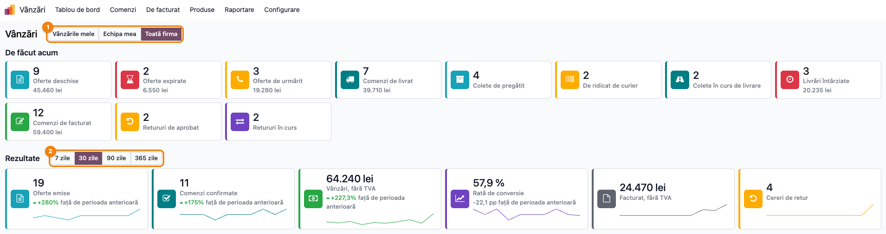
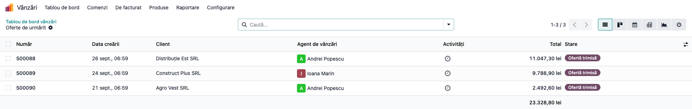
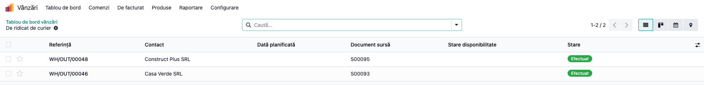
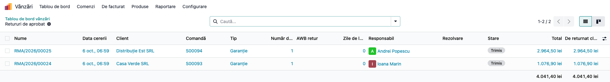
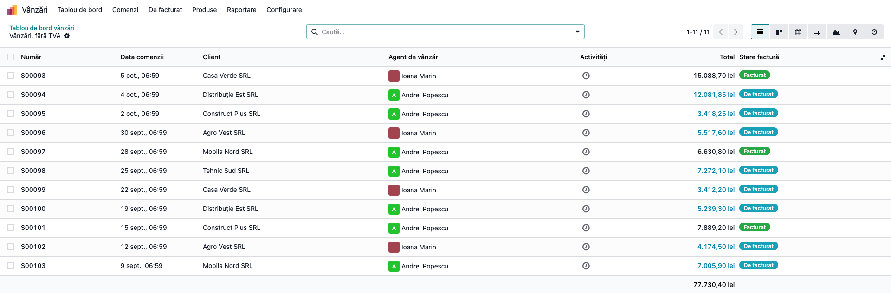
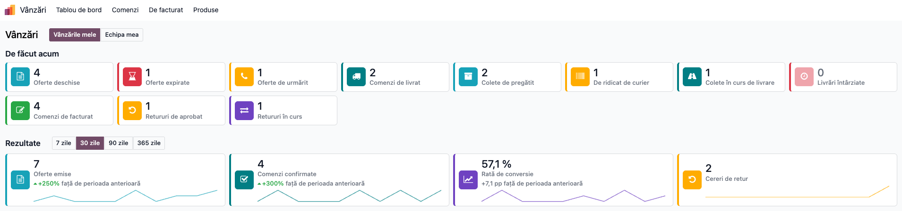

# Fișă Modul: Tablou de bord vânzări — ce așteaptă acum și cum a mers perioada

**Modul:** `deltatech_sale_dashboard` (cu punțile `deltatech_sale_dashboard_rma` și `deltatech_sale_dashboard_delivery`)
**Utilizator principal:** Agent de vânzări, Manager vânzări
**Prioritate:** 🟡 Medie (nu schimbă fluxul de vânzare, dar arată zilnic ofertele, comenzile, coletele și retururile care cer intervenție)

---

## 1. Scop business

Agentul și managerul de vânzări au nevoie să vadă dintr-o privire ce îi așteaptă azi și cum a mers perioada, fără să caute prin listele de oferte, comenzi, transferuri și retururi. Modulul adaugă în aplicația Vânzări un ecran cu două benzi de carduri:

- **De făcut acum** — ce așteaptă, oricât de veche ar fi: oferte deschise, expirate și de urmărit, comenzi de livrat, livrări întârziate, comenzi de facturat; cu punțile, și coletele (de pregătit, de ridicat de curier, în curs de livrare) și retururile (de aprobat, în curs);
- **Rezultate** — pe ultimele 7, 30, 90 sau 365 de zile, fiecare față de perioada anterioară de aceeași lungime, cu o linie de evoluție: oferte emise, comenzi confirmate, vânzări fără TVA, rata de conversie, facturat fără TVA și, cu puntea de retururi, cererile de retur.

Un clic pe un card deschide lista exactă a înregistrărilor numărate. Agentul își vede vânzările lui, managerul și pe ale echipei sau ale întregii firme; **sumele de bani le vede doar managerul**.

## 2. Bază legală și context

Nu are bază legală fiscală proprie — este un instrument operațional de urmărire a vânzărilor. De reținut:

- **„Vânzări, fără TVA" și „Facturat, fără TVA" sunt indicatori operaționali, nu rapoarte contabile.** „Vânzări" adună valoarea fără TVA a comenzilor confirmate în perioadă; „Facturat" adună valoarea fără TVA a facturilor client emise din comenzi în perioadă, minus facturile de stornare. Nu se reconciliază automat cu rulajul conturilor de venituri și nu înlocuiesc jurnalul de vânzări sau balanța.
- **Moneda:** „Vânzări, fără TVA" și valorile de sub cardurile de oferte și comenzi convertesc comenzile în altă monedă **la cursul de azi**, în moneda companiei — arată volumul, nu o valoare contabilă. „Facturat, fără TVA" folosește valoarea facturii **în moneda companiei (lei), la cursul din factură**, așa cum e înregistrată în contabilitate.
- Modulul **nu generează note contabile**, nu modifică oferte, comenzi, facturi sau transferuri.

## 3. Utilizatori și roluri

Agentul de vânzări (oferte de urmărit, comenzi de livrat și de facturat, colete) și managerul de vânzări (aceleași, pe echipă sau pe firmă, plus valorile și rezultatele perioadei).

Ce vede fiecare depinde de grupul din aplicația **Vânzări**:

| Grup Vânzări | Butoane de vizibilitate | Sume |
|---|---|---|
| **Utilizator: Numai documente proprii** | Vânzările mele; Echipa mea, dacă face parte dintr-o echipă de vânzări sau o conduce | nu |
| **Utilizator: Toate documentele** | plus **Toată firma** | nu |
| **Administrator** | Vânzările mele, Echipa mea, Toată firma | da |

Cifrele se calculează cu drepturile utilizatorului: regulile de acces ale aplicației Vânzări și companiile selectate se aplică la fel ca în liste. Un card pe înregistrări pe care utilizatorul nu le poate citi nu apare deloc — de exemplu cardurile de retur, pentru cine nu are un rol în aplicația **Retururi și garanții**.

Pentru **Utilizator: Numai documente proprii**, **Echipa mea** nu adaugă ofertele și comenzile colegilor: regula de acces din Vânzări îi arată doar documentele proprii și pe cele fără agent. Pe cardurile de colete și de retur, care nu au o astfel de regulă, **Echipa mea** cuprinde și înregistrările colegilor din echipă.

Roluri recomandate pentru testare:
- Administrator Vânzări: parcurge fluxul din secțiunea 6 și setează parametrii din secțiunea 5.
- Agent cu **Utilizator: Numai documente proprii**, membru într-o echipă: confirmă că vede doar numere (Pasul 6).
- Utilizator fără drepturi în Vânzări: confirmă că meniul **Tablou de bord** nu apare.

## 4. Conturi și date implicate

Nu sunt implicate conturi contabile — modulul nu creează note contabile.

Date minime pentru demo:
- două persoane: un manager (Administrator Vânzări) și un agent, în aceeași echipă de vânzări (**Vânzări → Configurare → Echipe de vânzări**);
- oferte în stări diferite: în ciornă, trimise și cu data ofertei mai veche de 7 zile, încă valabile, cu data de expirare depășită;
- comenzi confirmate în ultimele 60 de zile, unele livrate, unele cu livrarea programată înainte de azi, unele facturate;
- pentru cardurile de colete: o metodă de livrare (curier) și livrări în stările **Avizat** (AWB generat), **În tranzit**, **În livrare**;
- pentru cardurile de retur: cereri de retur în stările **Trimis**, **Aprobat**, **Așteptăm coletul**.

## 5. Configurare inițială

1. Instalați `deltatech_sale_dashboard` (aduce `sale_stock` și `deltatech_web_kpi_cards`).
2. Punțile se instalează singure când e prezent modulul de care depind:
   - `deltatech_sale_dashboard_rma` — cu `deltatech_rma` (cererile de retur și reclamațiile în garanție);
   - `deltatech_sale_dashboard_delivery` — cu `deltatech_delivery_status` (starea coletului pe transfer; starea **Avizat** o pune `deltatech_delivery` la generarea AWB-ului).
3. Verificați echipele de vânzări: **Echipa mea** cuprinde echipele în care utilizatorul este membru sau lider.
4. Opțional, din **Setări → Tehnic → Parametri → Parametri sistem** (meniul apare în modul dezvoltator):
   - `deltatech_sale_dashboard.follow_up_days` — după câte zile de la data ofertei o ofertă trimisă și încă valabilă intră la „Oferte de urmărit". Implicit `7`. Se numără de la data ofertei, nu de la trimitere: o ofertă creată acum 20 de zile și trimisă ieri intră pe card.
   - `deltatech_sale_dashboard_delivery.recent_days` — câte zile în urmă se numără transferurile pe cardurile de colete. Implicit `60`.

   Parametrul lipsă, gol sau care nu e număr întreg înseamnă valoarea implicită.
5. Setați fusul orar pe utilizatori: de el depinde ziua de azi pentru „Oferte expirate" și „Livrări întârziate".

## 6. Flux de utilizare

### Pasul 1 — Deschiderea tabloului și citirea cardurilor

Din **Vânzări → Tablou de bord** se deschide ecranul cu cele două benzi. Implicit arată **Vânzările mele** și ultimele **30 zile**; managerul alege **Toată firma** din butoanele de sus (①), iar perioada rezultatelor se alege din butoanele **7 / 30 / 90 / 365 zile** (②).



**Găsește pe ecran.** Fiecare card are cifra sus, titlul dedesubt și, la manager, valoarea fără TVA. Ce numără fiecare:

| Card | Ce numără |
|---|---|
| **Oferte deschise** | oferte în ciornă sau trimise, neconfirmate și neanulate |
| **Oferte expirate** | oferte deschise cu data de expirare înainte de azi |
| **Oferte de urmărit** | oferte în starea **Ofertă trimisă**, cu data ofertei mai veche de 7 zile, încă valabile (fără dată de expirare sau neexpirate) |
| **Comenzi de livrat** | comenzi confirmate, nelivrate complet |
| **Colete de pregătit** *(punte livrări)* | livrări gata în depozit, cu curier ales și fără AWB |
| **De ridicat de curier** *(punte livrări)* | colete cu AWB generat (Avizat), încă nepreluate de curier |
| **Colete în curs de livrare** *(punte livrări)* | colete în tranzit, în depozitul curierului sau în livrare |
| **Livrări întârziate** | comenzi cu o livrare încă neefectuată, programată înainte de azi |
| **Comenzi de facturat** | comenzi confirmate cu cantități de facturat |
| **Retururi de aprobat** *(punte retururi)* | cereri de retur și reclamații trimise, care așteaptă decizia |
| **Retururi în curs** *(punte retururi)* | cereri aprobate și neînchise: colet așteptat, primit sau verificat |

În banda **Rezultate**, fiecare card arată valoarea perioadei, schimbarea față de perioada anterioară (verde în creștere, roșu în scădere) și linia de evoluție pe perioadă:

| Card | Ce arată |
|---|---|
| **Oferte emise** | ofertele create în perioadă, orice s-ar fi întâmplat cu ele |
| **Comenzi confirmate** | comenzile confirmate în perioadă |
| **Vânzări, fără TVA** *(doar manager)* | valoarea fără TVA a comenzilor confirmate în perioadă, în moneda companiei |
| **Rată de conversie** | câte dintre ofertele create în perioadă sunt azi comenzi confirmate; schimbarea se arată în puncte procentuale (pp) |
| **Facturat, fără TVA** *(doar manager)* | facturile client emise din comenzi în perioadă, minus stornările |
| **Cereri de retur** *(punte retururi)* | cererile primite în perioadă, fără ciorne și anulate |

**Verifică.**
- Cardurile **se suprapun intenționat** și nu se adună: o comandă cu livrarea întârziată este și la „Comenzi de livrat", și la „Livrări întârziate", și, dacă e facturabilă, la „Comenzi de facturat".
- „Oferte deschise" include ofertele expirate și pe cele de urmărit.
- Schimbarea procentuală față de perioada anterioară lipsește când perioada anterioară e zero (nu se poate calcula un procent). La **Rată de conversie** diferența în puncte procentuale apare mereu.
- Cifrele se recalculează la fiecare schimbare de vizibilitate sau de perioadă și la redeschiderea ecranului.

### Pasul 2 — Ofertele de urmărit: pe cine sunăm azi

Click pe cardul **Oferte de urmărit**. Se deschide lista ofertelor numărate de card, cu titlul cardului în bara de navigare; **Tablou de bord vânzări**, din bara de navigare, întoarce la ecranul de carduri.



**Găsește pe ecran.** Pe fiecare rând: numărul ofertei, **Data creării**, clientul, agentul, totalul și starea **Ofertă trimisă**; în subsol, totalul ofertelor.

**Verifică.**
- Lista urmează vizibilitatea aleasă pe ecranul de carduri, la momentul click-ului: din **Vânzările mele** se deschid doar ofertele proprii, din **Toată firma** toate. Capturile din pașii 2–5 sunt deschise din **Toată firma**, ca în Pasul 1.
- Numărul de rânduri (dreapta sus, „1-3 / 3") este egal cu cifra de pe card (3). Lista se deschide fără filtrele implicite ale meniului **Oferte**, ca să arate exact ce numără cardul.
- Toate ofertele au starea **Ofertă trimisă** și **Data creării** mai veche de 7 zile.

**Treci mai departe.** Deschideți oferta, contactați clientul, apoi confirmați-o, actualizați data de expirare sau anulați-o. La următoarea deschidere a tabloului, oferta iese de pe card.

### Pasul 3 — Coletele de ridicat de curier *(punte livrări)*

Click pe cardul **De ridicat de curier**. Se deschide lista transferurilor de ieșire ale comenzilor, cu AWB generat și nepreluate încă de curier.



**Găsește pe ecran.** Referința transferului, clientul (**Contact**) și comanda (**Document sursă**). AWB-ul și starea coletului se văd în formularul transferului.

**Verifică.**
- Transferul e al unei comenzi de vânzare și a fost creat în ultimele 60 de zile (parametrul `deltatech_sale_dashboard_delivery.recent_days`); unul mai vechi nu mai apare pe card, oricare i-ar fi starea.
- Starea coletului este **Avizat**: AWB-ul există, curierul nu a confirmat preluarea.
- Transferul poate avea starea **Efectuat**, ca în captură: validarea în depozit (marfa a ieșit din gestiune) nu înseamnă că a preluat-o curierul. Starea coletului se urmărește separat de starea transferului.

**Treci mai departe.** Verificați cu depozitul că coletul a fost predat curierului. Cardurile **Colete de pregătit** (fără AWB încă) și **Colete în curs de livrare** se citesc la fel. Întârzierile față de termenul curierului, refuzurile și rambursul se urmăresc în tabloul de livrări (`deltatech_delivery_dashboard`), nu aici.

### Pasul 4 — Retururile de aprobat *(punte retururi)*

Click pe cardul **Retururi de aprobat**. Se deschide lista cererilor de retur și a reclamațiilor în garanție în starea **Trimis**.



**Găsește pe ecran.** **Nume** (numărul cererii), **Data cererii**, clientul, comanda, **Tip** (Garanție / Retur / Înlocuire), **Responsabil** și **Total**.

**Verifică.** Responsabilul cererii este agentul comenzii: cererea apare în **Vânzările mele** ale lui și în **Echipa mea** a echipei comenzii.

**Treci mai departe.** Deschideți cererea și aprobați-o sau refuzați-o (fluxul din `deltatech_rma`). După aprobare, cererea trece la **Retururi în curs**.

### Pasul 5 — Rezultatele perioadei: comenzile din „Vânzări, fără TVA" *(manager)*

Click pe cardul **Vânzări, fără TVA** din banda **Rezultate**. Se deschide lista comenzilor confirmate în perioada aleasă (aici, ultimele 30 de zile).



**Găsește pe ecran.** **Data comenzii** (data confirmării), clientul, agentul, **Total** (cu TVA) și **Stare factură**.

**Verifică.**
- Toate comenzile au data comenzii în ultimele 30 de zile și starea confirmată.
- Cardul adună valorile **fără TVA**, iar coloana **Total** din listă este cu TVA: cele două nu se compară direct (în captură, 77.730,40 lei cu TVA în listă, față de 64.240 lei fără TVA pe card). Pentru comparație, afișați coloana **Valoare fără taxe** din selectorul de coloane.
- O comandă în altă monedă este convertită pe card la cursul de azi; în listă apare în moneda ei.

**Treci mai departe.** Pentru analiză pe agent, client sau produs folosiți **Vânzări → Raportare**; cardul răspunde doar la „cât s-a vândut în perioadă".

### Pasul 6 — Ce vede un agent de vânzări

Autentificat ca agent (**Utilizator: Numai documente proprii**), același meniu **Vânzări → Tablou de bord** arată doar numere.



**Găsește pe ecran.** Butoanele **Vânzările mele** și **Echipa mea** (fără **Toată firma**); sub cardurile din „De făcut acum" nu apare valoarea; în **Rezultate** lipsesc „Vânzări, fără TVA" și „Facturat, fără TVA".

**Verifică.**
- Cifrele sunt doar ale agentului (în captură, 4 oferte deschise, față de 9 pe toată firma în Pasul 1).
- Restricția sumelor nu este doar ascunsă pe ecran: serverul nu le calculează și nu le trimite pentru un agent, iar un card ascuns nu poate fi deschis.

### Note de monografie și raportare

Modulul **nu generează note contabile**. Ce trebuie reținut pentru raportare:

- **Vânzări, fără TVA** este volumul comenzilor confirmate, nu cifra de afaceri contabilă: o comandă confirmată poate fi încă nefacturată sau anulată ulterior.
- **Facturat, fără TVA** adună facturile client emise din comenzi, minus stornările, în moneda companiei (lei), la cursul facturii; facturile emise fără comandă nu intră. Facturile de avans emise din comandă intră pe card la emitere și se scad la factura finală. Nu se reconciliază automat cu rulajul conturilor de venituri și nu înlocuiește jurnalul de vânzări.
- Cardurile sunt instantanee ale momentului, nu un istoric: banda „De făcut acum" se schimbă pe măsură ce ofertele, comenzile, coletele și retururile își schimbă starea.

## 7. Legături cu alte module / declarații

| Modul / proces | Rol în flux | Tip legătură |
|---|---|---|
| `sale_stock` | comenzile, starea livrării și transferurile lor | dependență (manifest) |
| `deltatech_web_kpi_cards` | aspectul cardurilor (aceleași ca în celelalte tablouri Terrabit), tema luminoasă și întunecată | dependență (manifest) |
| `deltatech_sale_dashboard_rma` | cardurile de retur, din cererile `deltatech_rma` | punte, instalare automată |
| `deltatech_sale_dashboard_delivery` | cardurile de colete, din starea livrării `deltatech_delivery_status` | punte, instalare automată |
| `deltatech_delivery` | generează AWB-ul și pune starea **Avizat** | sursă de date (indirectă) |
| `deltatech_delivery_dashboard` | întârzieri față de SLA-ul curierului, refuzuri, ramburs pe drum | modul complementar |
| Facturare (`account`) | facturile din „Facturat, fără TVA" | sursă de date |

Ce este automat: numărarea pe carduri, comparația cu perioada anterioară, conversia comenzilor în moneda companiei la cursul de azi, ascunderea sumelor pentru agenți, instalarea punților.
Ce rămâne manual: urmărirea ofertelor, livrarea și facturarea comenzilor, predarea coletelor la curier, decizia pe retururi.

## 8. Verificări pentru consultant

- [ ] Meniul **Vânzări → Tablou de bord** apare pentru un utilizator din Vânzări și lipsește pentru unul fără drepturi în Vânzări.
- [ ] Un agent cu **Utilizator: Numai documente proprii** vede butoanele **Vânzările mele** și, dacă e într-o echipă, **Echipa mea**; un **Administrator** vede și **Toată firma**.
- [ ] La agent nu apar sume sub carduri și lipsesc cardurile „Vânzări, fără TVA" și „Facturat, fără TVA"; la manager apar.
- [ ] Click pe fiecare card: numărul de rânduri din listă („1-N / N") este egal cu cifra de pe card, iar titlul listei este numele cardului.
- [ ] O ofertă trimisă, cu data ofertei acum 8 zile și expirarea peste o lună, apare la „Oferte de urmărit"; cu parametrul `deltatech_sale_dashboard.follow_up_days` = `10`, nu mai apare.
- [ ] O ofertă cu data de expirare ieri apare la „Oferte expirate" și nu la „Oferte de urmărit".
- [ ] O comandă cu livrarea programată ieri și nevalidată apare la „Livrări întârziate"; una programată azi dimineață, nu.
- [ ] O comandă confirmată acum 40 de zile intră în perioada anterioară a selecției **30 zile**: schimbarea de pe „Comenzi confirmate" o ia în calcul.
- [ ] Rata de conversie: din 3 oferte create în perioadă, 2 confirmate → 66,7 %.
- [ ] „Facturat, fără TVA" scade cu valoarea unei facturi de stornare emise din comandă.
- [ ] *(punte livrări)* Un transfer cu AWB în stare **Avizat** apare la „De ridicat de curier"; trecut **În tranzit**, se mută la „Colete în curs de livrare"; un transfer mai vechi de 60 de zile nu apare pe niciun card de colete.
- [ ] *(punte retururi)* O cerere **Trimis** apare la „Retururi de aprobat"; după aprobare, la „Retururi în curs".

## 9. Mesaje de eroare frecvente

| Mesaj / simptom | Cauză probabilă | Remediere |
|-----------------|-----------------|-----------|
| „Doar un agent de vânzări poate deschide bordul de vânzări." | Utilizatorul nu are niciun grup în aplicația Vânzări | Acordați un grup din **Setări → Utilizatori & Companii → Utilizatori**, aplicația Vânzări |
| Butonul **Echipa mea** lipsește | Utilizatorul nu e membru și nici lider al unei echipe de vânzări | Adăugați-l într-o echipă din **Vânzări → Configurare → Echipe de vânzări** |
| Lipsesc sumele și cardurile „Vânzări" / „Facturat" | Utilizatorul nu este **Administrator** în Vânzări — comportament intenționat | Acordați grupul **Administrator** doar celor care trebuie să vadă valorile |
| Lipsesc cardurile de colete sau de retur | Punțile nu sunt instalate (lipsește `deltatech_delivery_status`, respectiv `deltatech_rma`) | Instalați modulul de bază al punții; puntea se instalează automat |
| Lipsesc doar cardurile de retur, pentru un utilizator | Utilizatorul nu are un rol în aplicația **Retururi și garanții** (rolul se dă tuturor utilizatorilor interni la instalare, dar poate fi scos) | Acordați rolul **Utilizator** în **Retururi și garanții** |
| „De ridicat de curier" rămâne mare deși coletele au plecat | Starea coletului nu se actualizează (cronul de stare din `deltatech_delivery` oprit sau curierul nu răspunde) | Porniți cronul; verificați tabloul de livrări, cardul „Fără urmărire" |
| Pragul nou din parametri nu se aplică | Valoarea nu este un număr întreg de zile (se folosește implicitul) | Scrieți un număr întreg, ex. `10` |

## 10. Capturi de ecran

Capturile (`readme/screenshots/`) sunt generate automat din `tests/test_screenshots.py` (mixinul `ScreenshotCase` din `l10n_ro_doc_screenshots`, import defensiv), în limba română, pe o companie RO („Magazin Demo SRL") în lei, cu planul de conturi RO, cu un manager (Andrei Popescu) și o agentă (Ioana Marin) în „Echipa București", oferte, comenzi pe ultimele 60 de zile, colete și cereri de retur seedate. În ordinea pașilor din secțiunea 6:

1. `01_bord_vanzari.png` — tabloul ca manager, pe **Toată firma**, cu comutatorul de vizibilitate și selectorul de perioadă evidențiate.
2. `02_oferte_de_urmarit.png` — lista deschisă din cardul „Oferte de urmărit".
3. `03_colete_de_ridicat.png` — lista transferurilor deschisă din cardul „De ridicat de curier" (punte livrări).
4. `04_retururi_de_aprobat.png` — lista cererilor deschisă din cardul „Retururi de aprobat" (punte retururi).
5. `05_vanzari_perioada.png` — lista comenzilor deschisă din cardul „Vânzări, fără TVA".
6. `06_bord_agent.png` — tabloul ca agentă: doar numere, fără sume.

Regenerare (cere `l10n_ro` pentru compania RO; capturile 03 și 04 apar doar cu punțile instalate):

```bash
./odoo/odoo-bin -c odoo.conf -d <db> \
    -i deltatech_sale_dashboard_rma,deltatech_sale_dashboard_delivery,l10n_ro,l10n_ro_doc_screenshots \
    --load-language=ro_RO --test-tags=fise_screenshots --stop-after-init
```

## 11. Observații pentru manual

Păstrați în manual trei idei. Întâi, **cardurile se suprapun și nu se adună** — fiecare răspunde la propria întrebare („ce oferte sun azi", „ce comenzi întârzie", „ce colete n-au plecat"), iar un clic pe card deschide exact lista numărată. Apoi, **vizibilitatea și sumele țin de rol**: agentul își vede vânzările lui și doar numere; managerul alege între ale lui, ale echipei și ale firmei și vede valorile. În al treilea rând, **„Vânzări" și „Facturat" sunt indicatori operaționali, nu cifre contabile** — comenzi confirmate convertite la cursul de azi, respectiv facturi din comenzi minus stornări, în moneda companiei (lei), la cursul facturii; modulul nu face nicio înregistrare contabilă. Pentru colete, trimiteți cititorul la tabloul de livrări pentru întârzierile față de curier, refuzuri și ramburs.
