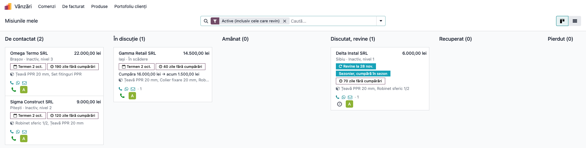
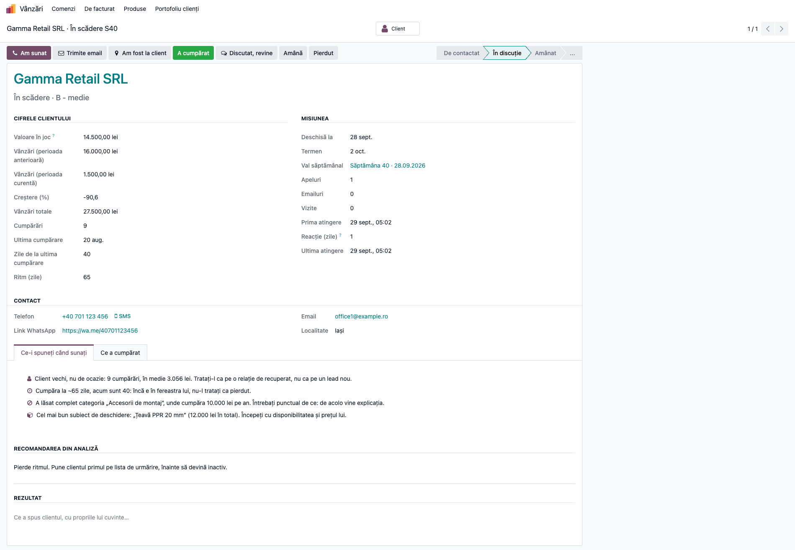
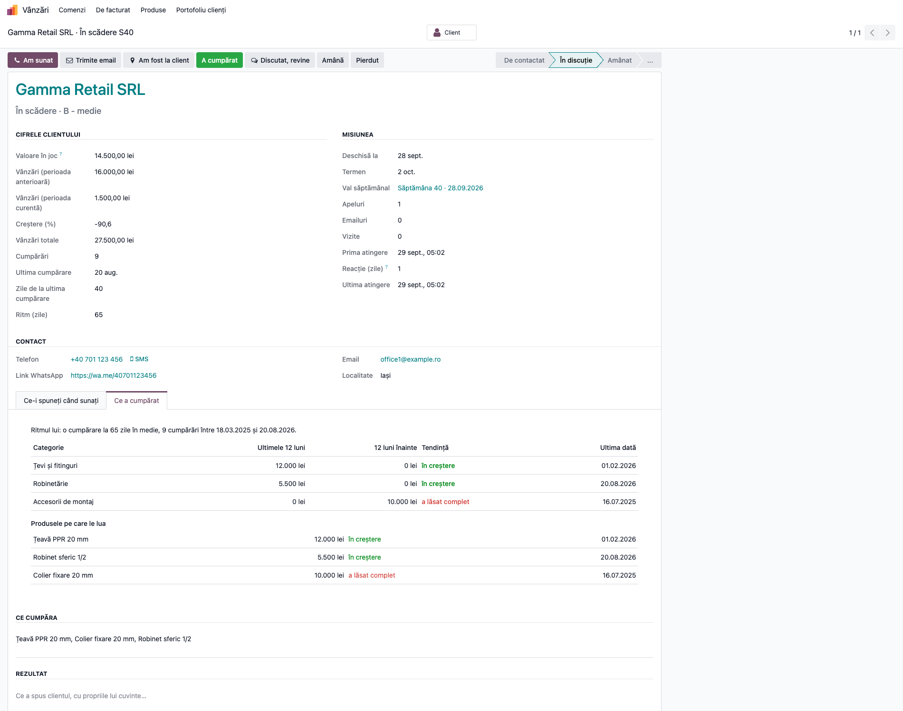
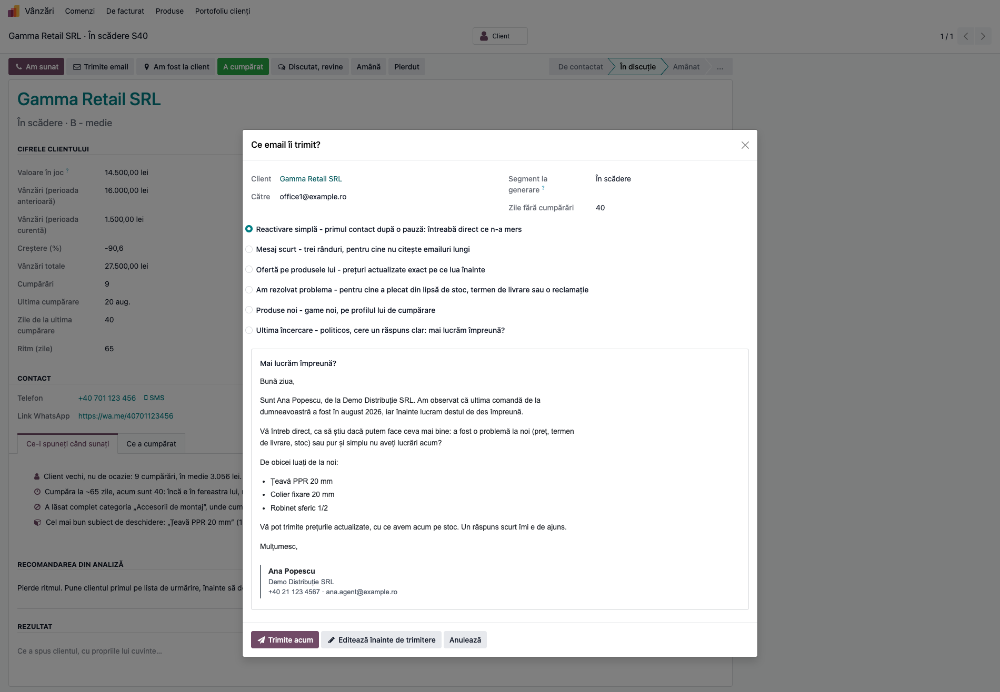
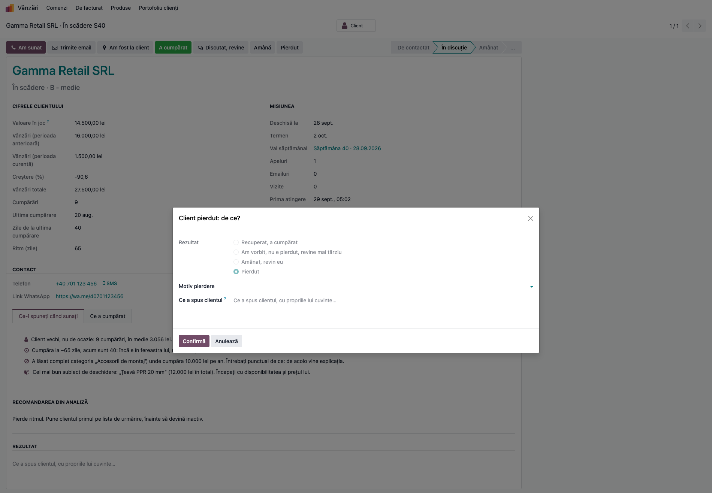
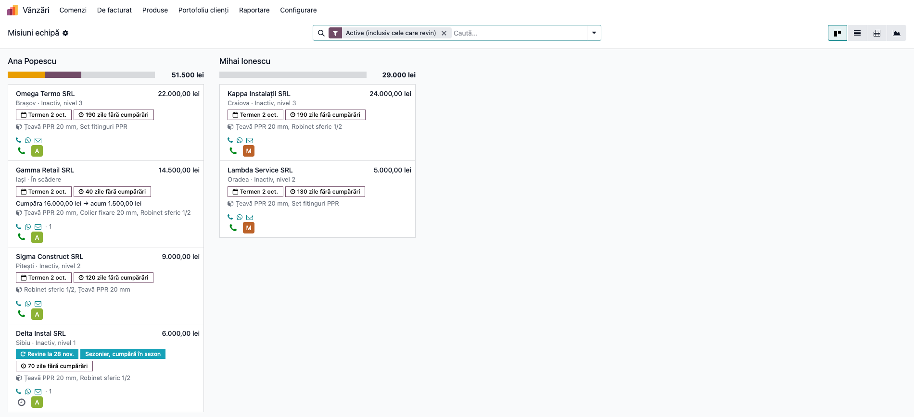
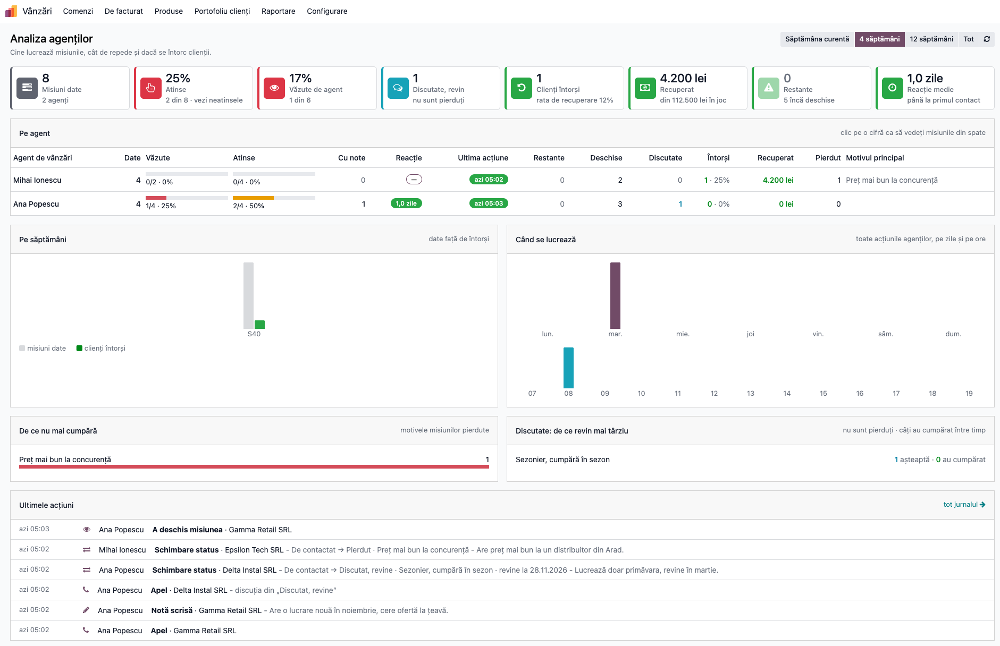
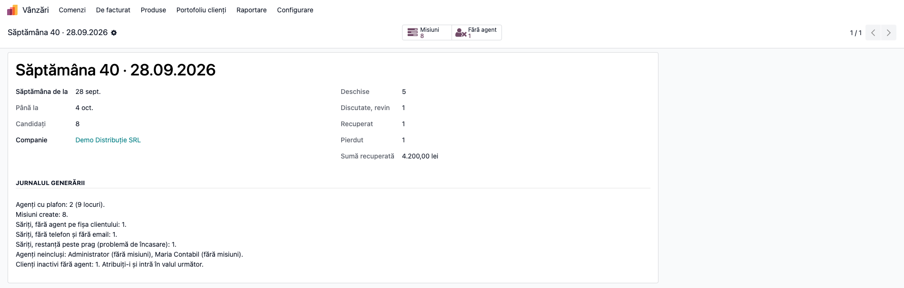
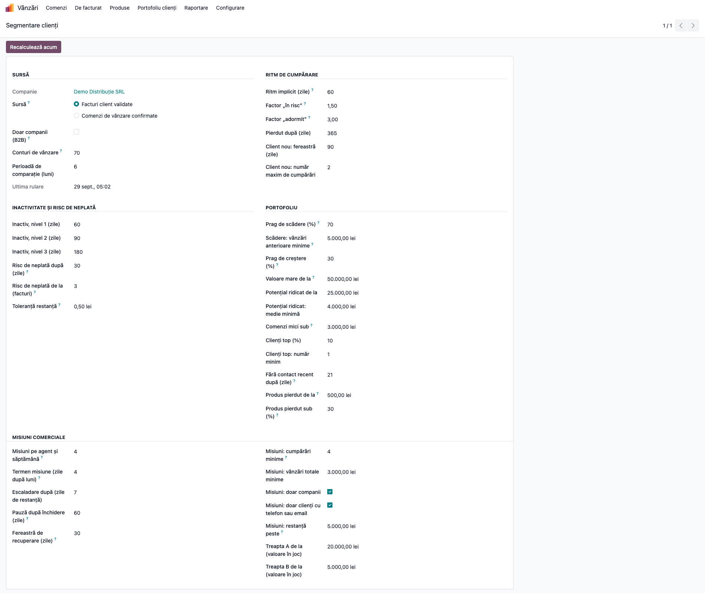
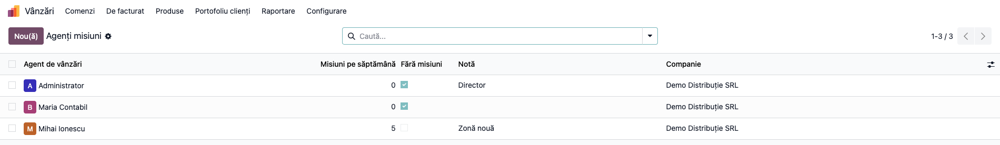

# Fișă Modul: Misiuni comerciale — recuperarea săptămânală a clienților în scădere și inactivi

**Modul:** `deltatech_sale_missions`
**Utilizator principal:** Agent de vânzări (misiunile proprii), director de vânzări (echipa, valul, setările)
**Prioritate:** 🟡 Medie (modul nou, vandabil pe Apps; al treilea din familia analizei clienților, după `deltatech_customer_segment` și `deltatech_customer_analysis`)

---

## 1. Scop business

Tabloul *Analiza clienților* arată pe cine trebuie sunat. Fără o listă scurtă, cu termen, apelurile se
amână, iar la sfârșitul lunii nimeni nu știe ce s-a întâmplat cu clienții pierduți. Modulul transformă
analiza într-o rutină săptămânală:

- **în fiecare luni**, fiecare agent primește câteva **misiuni de recuperare** (implicit 4): clienții lui
  *În scădere* sau *Inactivi*, primii cei cu cei mai mulți bani în joc, cu termen vineri;
- **o misiune se lucrează până la un rezultat**: clientul cumpără din nou (*Recuperat*), revine mai
  târziu (*Discutat, revine*), agentul revine el (*Amânat*) sau clientul e pierdut (*Pierdut*, cu motiv);
- **recuperarea se vede singură**: o factură validată sau o comandă confirmată închide misiunea, iar
  vânzările din fereastra de recuperare (implicit 30 de zile) se numără ca bani recuperați;
- **directorul vede munca**: cine a deschis misiunile, cine a sunat, cât de repede, ce restanțe are
  fiecare și de ce nu mai cumpără clienții.

Modulul provine din modulul de misiuni scris de Alexandru Grecu pentru MD Trade Concept SRL, portat pe
Odoo 19 și construit peste segmentarea clienților și tabloul de analiză.

## 2. Bază legală și context

Nu există o bază legală specifică: modulul nu generează documente contabile și nici note. E o unealtă
de organizare a vânzărilor peste facturile și comenzile existente.

Cum lucrează:

- **Valul săptămânal** se generează luni dimineață, câte unul pe companie și săptămână. Înainte de
  generare, segmentele clienților se recalculează, ca un client care a cumpărat duminică să nu primească
  misiune luni. Pe o companie fără agenți cu plafon nu se creează val.
- **Candidații** sunt clienții clasificați în segmentare *În scădere* sau *Inactiv* pe cele trei niveluri,
  cu cel puțin 4 cumpărări și 3.000 lei vânzări totale (setabile), doar firme (setabil). La *Generează
  valul acum* valul se creează chiar dacă nu există agenți cu plafon (gol); cronul de luni nu creează val
  gol.
- **Nu intră**, în ordinea în care se verifică:
  1. clienții cu o misiune deschisă sau discutată, în pauză după închidere (implicit 60 de zile), sau
     pierduți dintr-un motiv pe care firma nu îl poate corecta (a închis firma, nu mai lucrează în
     domeniu);
  2. clienții fără agent pe fișă: apar separat în valul săptămânii, la *Fără agent*, înaintea celorlalte
     filtre (lista poate conține deci și clienți fără telefon sau cu restanță);
  3. clienții al căror agent nu primește misiuni: agentul nu are rolul *Portofoliu clienți*, e marcat
     *Fără misiuni* sau are plafonul 0;
  4. clienții fără telefon și fără email;
  5. clienții cu restanță peste prag (implicit 5.000 lei): ei sunt o problemă de încasare, nu de vânzare.
- **Plafonul** e implicit 4 misiuni pe agent și săptămână. Dacă agentul are clienți *În scădere*, o
  parte din plafon e rezervată lor: o treime rotunjită în jos, dar cel puțin un loc (la plafonul 4: un
  loc). E un minim: alți clienți în scădere pot intra și după valoarea în joc. Inactivii sunt mai mulți și
  ar ocupa tot, iar clientul în scădere e cel mai ieftin de salvat.
- **Valoarea în joc** stabilește ordinea: la un client în scădere, cât a cumpărat în perioada anterioară
  și nu mai cumpără acum; la un inactiv, cât cumpăra înainte să se oprească. Treapta A / B / C vine din
  aceeași valoare (implicit de la 20.000 / 5.000 lei).
- **Închiderea la cumpărare** se face la validarea facturii și la confirmarea comenzii. Un cron zilnic
  prinde facturile intrate prin import sau prin conectori. O eroare în misiuni nu blochează niciodată
  factura sau comanda.
- **Niciun câmp pe modelele standard**: plafoanele pe agent, cardurile șabloanelor de email și setările
  pe companie au înregistrări proprii.

## 3. Utilizatori și roluri

Rolurile sunt cele ale portofoliului de clienți, în **Setări → Utilizatori → (utilizator) → tab Drepturi
de acces → secțiunea Vânzări → Portofoliu clienți**:

- **Clienții proprii:** agentul primește misiuni pentru clienții la care este trecut ca *Agent de
  vânzări* și vede doar misiunile lui. Nu poate crea misiuni și nu poate schimba clientul, agentul sau
  cifrele unei misiuni, nici prin RPC.
- **Toți clienții:** directorul vede toate misiunile, reatribuie, generează valul, vede jurnalul și
  analiza agenților și modifică setările.

Orice utilizator cu unul dintre roluri primește misiuni, dacă e agent pe clienți. Rolul *Toți clienții*
îl include pe *Clienții proprii*, deci directorul și administratorul se numără și ei printre agenții cu
plafon; marcați-i *Fără misiuni* în *Setări misiuni → Agenți*.

Agentul poate completa *Ce a spus clientul* și după închidere, dar nu își poate muta termenul: termenul
îl schimbă doar directorul.

Roluri recomandate la testare:
- un director cu *Toți clienții*;
- doi agenți cu *Clienții proprii*, drept de vânzări, fiecare cu clienți atribuiți;
- un utilizator intern fără rol: nu vede meniul *Portofoliu clienți*.

## 4. Conturi și date implicate

Modulul nu generează note contabile. Citește:

- **rândurile segmentării** (clasificarea, vânzările, ritmul, restanța), recalculate la generare;
- **liniile facturilor client validate** pe conturile de vânzare din setările segmentării (implicit
  **70x** pe o firmă RO), fără TVA, fără avansuri: pentru ce cumpăra clientul, tab-ul *Ce a cumpărat*
  și suma recuperată. Aceasta e sursa implicită a segmentării (*Facturi client validate*); cu sursa
  *Comenzi de vânzare confirmate*, cifrele vin din liniile comenzilor confirmate, fără legătură cu 70x;
- **facturile client validate** și **comenzile confirmate**: pentru închiderea automată pe *Recuperat*.

Creează:
- **misiunile**, cu fotografia clientului de la generare (valoarea în joc, vânzările, zilele fără
  cumpărări, restanța, ce cumpăra, recomandarea);
- **activitatea *Apel*** pentru agent, pe fiecare misiune;
- **jurnalul** (deschideri, apeluri, emailuri, note, schimbări de status);
- **emailurile** trimise clientului, din chatter-ul misiunii.

*Suma recuperată* este fără TVA: vânzările clientului (70x) de la deschiderea misiunii până la sfârșitul
ferestrei de recuperare.

Date minime pentru demo: o firmă RO cu plan de conturi RO și 8–10 clienți firme, cu telefon și email,
repartizați la doi agenți, cu facturi validate pe ultimul an. Trebuie să existe:

- clienți inactivi de 2–6 luni, cu 4+ cumpărări;
- un client în scădere (cumpăra mult acum 6–12 luni, puțin acum);
- câțiva clienți activi, care nu primesc misiune.

## 5. Configurare inițială

1. Instalați `deltatech_sale_missions`. Aduce `deltatech_customer_analysis`, care aduce
   `deltatech_customer_segment` și `deltatech_web_kpi_cards`.
2. Configurați segmentarea ca în fișa ei: rolurile, agentul pe fiecare client, sursa și pragurile.
3. În **Vânzări → Portofoliu clienți → Setări**, grupul **Misiuni comerciale**, verificați plafonul,
   termenele și filtrele (§6, Pasul 9).
4. În **Vânzări → Portofoliu clienți → Setări misiuni → Agenți**, adăugați un rând doar pentru agenții
   cu alt plafon sau fără misiuni (§6, Pasul 10).
5. Așteptați luni dimineață, sau generați valul săptămânii curente din **Setări misiuni → Generează
   valul acum**.

## 6. Flux de utilizare

### Pasul 1 — Misiunile mele (agentul, luni dimineață)

Deschideți **Vânzări → Portofoliu clienți → Misiuni comerciale → Misiunile mele**.

1. **Găsiți pe ecran:** un kanban pe statusuri (*De contactat*, *În discuție*, *Amânat*, *Discutat,
   revine*, *Recuperat*, *Pierdut*). Pe fiecare card:
   - clientul și valoarea în joc;
   - localitatea și segmentul (*În scădere*, *Inactiv, nivel 1–3*);
   - termenul, zilele fără cumpărări, iar la cele care revin data și motivul;
   - la clienții *În scădere*: cât cumpăra înainte și cât acum (perioada de comparație din segmentare,
     implicit 6 luni față de cele 6 dinainte);
   - ce cumpăra (primele produse din ultimii doi ani);
   - telefonul, WhatsApp, emailul, numărul de atingeri și activitatea *Apel*.
2. **Verificați:**
   - filtrul implicit *Active (inclusiv cele care revin)* ascunde misiunile închise;
   - cardurile sunt ordonate după valoarea în joc, cea mai mare prima;
   - o misiune cu termenul depășit are eticheta roșie *Restantă … zile*.
3. **Treceți mai departe:** deschideți misiunea cu cea mai mare valoare în joc (Pasul 2).



### Pasul 2 — Fișa misiunii: ce-i spuneți când sunați

1. **Găsiți pe ecran:**
   - butoanele *Am sunat*, *Trimite email*, *Am fost la client*, *A cumpărat*, *Discutat, revine*,
     *Amână*, *Pierdut* și statusul;
   - **Cifrele clientului**: valoarea în joc, vânzările înainte și acum, creșterea, totalul, numărul de
     cumpărări, ultima cumpărare, zilele de atunci și ritmul;
   - **Misiunea**: termenul, valul, apelurile, emailurile, vizitele, prima atingere și reacția în zile;
   - **Contact**: telefonul, linkul WhatsApp, emailul;
   - tab-ul **Ce-i spuneți când sunați**: sfaturi, fiecare cu cifra din spate (câte cumpărări avea, dacă
     și-a rupt ritmul, ce categorie a lăsat, cel mai bun subiect de deschidere, restanța), apoi
     recomandarea din analiză.
2. **Verificați:**
   - cifrele sunt fotografia de la generare și nu se schimbă dacă clientul cumpără între timp;
   - *Valoare în joc* la un client în scădere = vânzările din perioada anterioară minus cele din perioada
     curentă, fără TVA.
3. **Treceți mai departe:**
   - după apel apăsați **Am sunat**: misiunea trece în *În discuție*, apelul intră în jurnal, iar prima
     atingere și reacția se înregistrează o singură dată;
   - **Am fost la client** înregistrează o vizită.



### Pasul 3 — Ce a cumpărat

Pe aceeași fișă, tab-ul **Ce a cumpărat**.

1. **Găsiți pe ecran:** ritmul clientului, apoi un tabel pe categorii (ultimele 12 luni, cele 12 luni
   dinainte, tendința, ultima dată) și unul pe produse. Tab-ul compară **12 luni cu 12 luni**, spre
   deosebire de segment, care compară perioada din setări (implicit 6 luni): un client *În scădere* pe
   ultimele 6 luni poate avea categorii *în creștere* pe 12 luni.
2. **Verificați:**
   - tendința e *a lăsat complet* când în ultimele 12 luni nu a mai cumpărat din categorie, *în scădere*
     sub 70 % din anul dinainte, *în creștere* peste 130 %;
   - sumele sunt fără TVA, doar liniile de vânzare (70x).
3. **Treceți mai departe:** o categorie lăsată complet e primul subiect al apelului.



### Pasul 4 — Trimite email

Apăsați **Trimite email**. Butonul cere un email pe fișa clientului.

1. **Găsiți pe ecran:** șabloanele ca opțiuni, fiecare cu *când se folosește* (reactivare simplă, mesaj
   scurt, ofertă pe produsele lui, am rezolvat problema, produse noi, ultima încercare), și previzualizarea
   emailului randată pe clientul real: numele agentului, luna ultimei comenzi, produsele pe care le lua,
   semnătura.
2. **Verificați:**
   - textul e scrisoarea agentului, fără coduri interne ale produselor;
   - la șabloanele *Am rezolvat problema* și *Produse noi* apare avertismentul că textul are o parte de
     completat, iar *Trimite acum* lipsește.
3. **Treceți mai departe:**
   - **Trimite acum** trimite emailul din chatter-ul misiunii; emailul se numără ca atingere;
   - **Editează înainte de trimitere** deschide compozitorul standard cu șablonul încărcat.



### Pasul 5 — Închiderea misiunii

Butoanele de rezultat deschid o fereastră care cere mereu *Ce a spus clientul*:

- **Pierdut**: motivul pierderii (obligatoriu) și ce a spus clientul;
- **Discutat, revine**: de ce revine mai târziu (sezonier, nu are lucrări acum, are ofertă în lucru,
  cumpără pe altă firmă, alt motiv) și ziua în care revine, strict în viitor (propusă: peste 60 de zile).
  În acea zi misiunea se redeschide singură, cu termen nou și o activitate *Apel*;
- **Amână**: ziua în care reveniți, azi sau mai târziu (propusă: peste 30 de zile); misiunea se
  redeschide singură atunci;
- **A cumpărat**: confirmare manuală a recuperării.

1. **Găsiți pe ecran:** rezultatul ales, motivul (la *Pierdut*) și câmpul *Ce a spus clientul*.
2. **Verificați:**
   - fără motiv sau fără text, fereastra marchează câmpul ca obligatoriu și nu confirmă;
   - data de revenire nu poate fi în trecut;
   - o misiune închisă (*Recuperat* sau *Pierdut*) nu mai poate fi schimbată de agent, doar de director;
   - o misiune *Pierdută* trece singură pe *Recuperat* dacă clientul cumpără în fereastra ei de
     recuperare;
   - o comandă confirmată închide misiunea pe *Recuperat* cu 0 lei: suma apare după facturare, la cronul
     de reconciliere din noaptea următoare (până atunci misiunea apare la filtrul *Recuperat fără
     factură*).
3. **Treceți mai departe:** **Confirmă**. Activitatea *Apel* se închide, iar textul intră în chatter și
   în jurnal.



### Pasul 6 — Misiunile echipei (directorul)

Deschideți **Vânzări → Portofoliu clienți → Misiuni comerciale → Misiuni echipă**.

1. **Găsiți pe ecran:** aceleași carduri, grupate pe agent, cu bara colorată pe statusuri și suma
   valorii în joc a fiecărui agent.
2. **Verificați:** fiecare agent are cel mult plafonul lui de misiuni în val. Filtrul implicit *Active*
   arată și misiunile care revin din săptămânile trecute; pentru valul curent grupați după *Săptămână*
   sau folosiți *Săptămâna curentă*.
3. **Treceți mai departe:**
   - *Misiuni restante* arată misiunile cu termenul depășit, grupate pe agent. O misiune restantă de peste
     7 zile (setabil) e trimisă directorului în chatter, o singură dată pe ciclu: după o redeschidere
     poate fi escaladată din nou;
   - *De ce nu mai cumpără* grupează misiunile pierdute pe motive (pivot și grafic);
   - *Jurnal misiuni* are toate acțiunile, pe om, tip și zi.



### Pasul 7 — Analiza agenților

Deschideți **Vânzări → Portofoliu clienți → Misiuni comerciale → Analiza agenților**.

1. **Găsiți pe ecran:**
   - perioada (săptămâna curentă, 4 săptămâni, 12 săptămâni, tot);
   - cardurile: misiuni date, atinse, văzute de agent, discutate, clienți întorși, suma recuperată,
     restanțe, reacția medie;
   - tabelul pe agent: date, văzute, atinse, cu note, reacție, ultima acțiune, restante, deschise,
     discutate, întorși, recuperat, pierdute, motivul principal;
   - graficele: pe săptămâni, pe zile și ore, motivele de pierdere, motivele de revenire;
   - ultimele acțiuni.
2. **Verificați:**
   - *Atinse* numără misiunile cu cel puțin un apel, email sau vizită;
   - *Văzute* numără misiunile deschise de agent măcar o dată; deschiderile directorului nu contează;
   - *Recuperat* e suma fără TVA a misiunilor recuperate.
3. **Treceți mai departe:** un clic pe o cifră din tabel deschide misiunile din spatele ei. Cardul
   *Atinse* deschide misiunile **neatinse**, iar *Văzute de agent* pe cele **nevăzute**. Numele agentului
   deschide toate misiunile lui. Coloanele *Date*, *Recuperat*, *Reacție* și *Ultima acțiune* nu sunt
   clicabile.



### Pasul 8 — Valul săptămânal

Deschideți **Vânzări → Portofoliu clienți → Misiuni comerciale → Valuri săptămânale** și un val.

1. **Găsiți pe ecran:** săptămâna, numărul de candidați, misiunile pe statusuri, suma recuperată și
   **Jurnalul generării**: câți agenți au plafon (orice utilizator cu rol de portofoliu care nu e marcat
   *Fără misiuni*), câte misiuni s-au creat, de ce au fost săriți ceilalți clienți și ce agenți nu au fost
   incluși. Butonul *Fără agent* apare când există clienți inactivi fără agent pe fișă.
2. **Verificați:**
   - clienții săriți apar în jurnal, numărați pe motive (misiune deschisă sau pauză, fără agent, agent
     fără misiuni, fără telefon și email, restanță peste prag);
   - *Candidați* numără clienții rămași după aceste filtre; misiunile create sunt cel mult candidații,
     pentru că plafonul agenților poate lăsa candidați fără misiune.
3. **Treceți mai departe:** atribuiți clienții fără agent; intră în valul următor.



### Pasul 9 — Setările misiunilor

Deschideți **Vânzări → Portofoliu clienți → Setări** (setările segmentării), grupul **Misiuni
comerciale**:

- *Misiuni pe agent și săptămână* (4), *Termen misiune (zile după luni)* (4 = vineri), *Escaladare după
  (zile de restanță)* (7), *Pauză după închidere (zile)* (60), *Fereastră de recuperare (zile)* (30);
- *Misiuni: cumpărări minime* (4), *Misiuni: vânzări totale minime* (3.000), *Misiuni: doar companii*,
  *Misiuni: doar clienți cu telefon sau email*, *Misiuni: restanță peste* (5.000; 0 = fără filtru),
  *Treapta A de la (valoare în joc)* (20.000) și *Treapta B de la (valoare în joc)* (5.000).

Setările sunt pe companie. Schimbarea ferestrei de recuperare se aplică și misiunilor existente.



### Pasul 10 — Agenții misiunilor

Deschideți **Vânzări → Portofoliu clienți → Setări misiuni → Agenți**.

1. **Găsiți pe ecran:** câte un rând pe agent și companie, cu *Misiuni pe săptămână*, *Fără misiuni* și o
   notă.
2. **Verificați:** un agent fără rând primește plafonul din setări; *Misiuni pe săptămână* 0 înseamnă tot
   plafonul din setări.
3. **Treceți mai departe:** tot în *Setări misiuni*, *Motive de pierdere* și *Șabloane email* se
   ajustează fără cod. Șablonul *Invitație la showroom* e arhivat la instalare.



### Note de monografie și raportare

Modulul **nu generează note contabile** și nu modifică documente contabile. Creează misiuni, activități,
emailuri și înregistrări de jurnal. Cifrele sunt de gestiune:

- *Valoare în joc*, *Vânzări (perioada anterioară / curentă)*, *Vânzări totale* = din segmentare, fără
  TVA, pe liniile de vânzare 70x (nota 4111 = 70x + 4427), stornările scăzute.
- *Recuperat* = vânzările fără TVA (70x) ale clientului de la data deschiderii misiunii până la sfârșitul
  ferestrei de recuperare (deschiderea + 30 de zile; la misiunile cu dată de revenire, data revenirii +
  30 de zile), stornările scăzute.
- *Restanță la generare* = restul de plată al facturilor client scadente, cu TVA, din segmentare.

## 7. Legături cu alte module / declarații

| Modul | Rol |
| --- | --- |
| `deltatech_customer_segment` | clasificarea clienților (în scădere, inactiv), rolurile, meniul *Portofoliu clienți* și setările, în care intră grupul *Misiuni comerciale* |
| `deltatech_customer_analysis` | recomandarea fiecărei misiuni și liniile de vânzare folosite la *Ce a cumpărat* și la suma recuperată |
| `deltatech_web_kpi_cards` | cardurile din *Analiza agenților* |
| `account` | închiderea pe *Recuperat* la validarea facturii |
| `sale` | închiderea pe *Recuperat* la confirmarea comenzii |
| `mail` | activitatea *Apel*, emailurile, chatter-ul și escaladarea |

**Ce e automat:**
- valul de luni, cu plafon, rezervare pentru clienții în scădere și ordine după valoarea în joc;
- închiderea pe *Recuperat* la factură sau comandă, și cronul zilnic de reconciliere;
- redeschiderea misiunilor amânate sau discutate, la data lor;
- escaladarea restanțelor la director, o dată pe ciclu;
- jurnalul acțiunilor.

**Ce rămâne manual:**
- apelul, emailul, vizita și rezultatul lor;
- motivul pierderii și ce a spus clientul;
- rolurile, agentul de pe fiecare client, plafoanele diferite;
- textele șabloanelor și motivele.

## 8. Verificări pentru consultant

- [ ] *Generează valul acum* creează un singur val pe săptămână; o a doua apăsare deschide același val.
- [ ] Fiecare agent are cel mult plafonul lui de misiuni; cu clienți în scădere, cel puțin un loc (o treime din plafon, rotunjit în jos) e al lor.
- [ ] Un client fără agent apare în butonul *Fără agent* al valului, nu ca misiune.
- [ ] Un client cu misiune deschisă sau închisă de mai puțin de 60 de zile nu intră în valul următor.
- [ ] Un client pierdut pe *A închis firma / insolvență* nu mai primește misiuni.
- [ ] Un client fără telefon și email nu intră; cu filtrul debifat, intră.
- [ ] Un client cu restanță peste 5.000 lei nu intră; cu pragul 0, intră.
- [ ] Validarea unei facturi către client închide misiunea pe *Recuperat*, cu vânzările fără TVA (70x) din fereastră (la o singură factură doar pe 70x, egale cu baza ei).
- [ ] Confirmarea unei comenzi închide misiunea pe *Recuperat* (cu 0 lei până la factură și cronul de noapte).
- [ ] O misiune pierdută trece singură pe *Recuperat* la o factură din fereastra ei (la cel mult 30 de zile de la deschidere).
- [ ] O factură de după fereastra de recuperare închide misiunea, dar nu se numără la *Recuperat*.
- [ ] O misiune pierdută acum 6 luni nu se redeschide la o factură nouă.
- [ ] *Am sunat* mută misiunea în *În discuție* și înregistrează reacția o singură dată.
- [ ] *Discutat, revine* cere motivul, ziua de revenire și textul; la acea zi misiunea redevine *De contactat*.
- [ ] *Pierdut* cere motivul și textul; agentul nu mai poate schimba rezultatul, directorul poate.
- [ ] Emailul trimis din *Trimite email* are clientul ca destinatar și se numără ca atingere.
- [ ] Șablonul *Am rezolvat problema* nu se poate trimite fără editare.
- [ ] Un agent vede doar misiunile lui și nu poate schimba valoarea în joc, suma recuperată sau agentul.
- [ ] O misiune restantă de peste 7 zile ajunge o singură dată la director.
- [ ] Un agent nu își poate schimba termenul misiunii; directorul poate.
- [ ] În *Analiza agenților*, deschiderea unei misiuni de către director nu o face *văzută* pentru agent.

## 9. Mesaje de eroare frecvente

| Mesaj | Cauză | Remediere |
| --- | --- | --- |
| câmpul *Motiv pierdere* sau *Ce a spus clientul* marcat obligatoriu | închidere fără motiv sau fără text | completați câmpul |
| *Ca să închideți misiunea pentru … ca pierdută, alegeți motivul* / *Scrieți în două rânduri ce a spus …* | aceeași lipsă, la import sau RPC | completați motivul și textul |
| *Ziua în care revine clientul trebuie să fie în viitor.* | *Discutat, revine* cu data de azi sau trecută | alegeți o zi viitoare |
| *Data de revenire nu poate fi în trecut.* | amânare cu o dată trecută | alegeți azi sau o dată viitoare |
| *Misiunea pentru … e deja închisă. Doar directorul de vânzări îi poate schimba rezultatul.* | agentul redeschide o misiune închisă | o face directorul |
| *Doar directorul de vânzări poate schimba clientul, agentul sau cifrele unei misiuni.* | agentul modifică cifrele sau agentul | o face directorul |
| *Clientul … nu are adresă de email. Completați-o întâi.* | *Trimite email* fără email pe client | completați emailul pe fișa clientului |
| *Șablonul „…” are o parte de completat.* | trimitere directă a unui șablon cu text de completat | *Editează înainte de trimitere* |
| *… nu are acces la compania … și nu ar vedea misiunea.* | reatribuire către un agent din altă companie | alegeți un agent al companiei |
| *Doar directorul de vânzări poate genera valul de misiuni.* | un agent a cerut generarea | o face directorul, sau se așteaptă luni |
| valul nu are misiuni | niciun client în scădere sau inactiv cu istoricul minim, clienții nu au agent, sau agentul lor nu are rolul *Portofoliu clienți* | verificați segmentele, rolurile și *Jurnalul generării* |

## 10. Capturi de ecran

Capturile sunt generate automat de `tests/test_screenshots.py`, cu mixinul `ScreenshotCase` din
`l10n_ro_doc_screenshots` (import defensiv, fără dependență în manifest). Interfața e în română, pe planul
de conturi RO, pe o firmă demo în RON, cu 12 clienți, doi agenți și un val generat, în care s-au făcut un
apel, o notă, o discuție, o pierdere și o recuperare. Trei clienți sunt săriți intenționat (fără agent,
fără telefon și email, cu restanță mare), ca să apară în jurnalul valului. Setările misiunilor sunt cele
implicite; din setările segmentării se schimbă doar *Clienți top* (10 %, minimum 1), pentru portofoliul
mic. Testul e și singurul care încarcă formularele și
tabloul în browser: o eroare JavaScript îl face să pice.

| Fișier | Ce arată |
| --- | --- |
| `screenshots/01_misiunile_mele.png` | kanbanul agentului |
| `screenshots/02_fisa_misiunii.png` | fișa misiunii, cu sfaturile pentru telefon |
| `screenshots/03_ce_a_cumparat.png` | tab-ul *Ce a cumpărat* |
| `screenshots/04_email.png` | alegerea emailului și previzualizarea |
| `screenshots/05_inchidere.png` | închiderea pe *Pierdut* |
| `screenshots/06_misiuni_echipa.png` | kanbanul echipei, pe agenți |
| `screenshots/07_analiza_agenti.png` | tabloul *Analiza agenților* |
| `screenshots/08_val_saptamanal.png` | valul săptămânii, cu jurnalul generării |
| `screenshots/09_setari.png` | grupul *Misiuni comerciale* din setări |
| `screenshots/10_agenti.png` | plafonul diferit al unui agent |

Regenerare:

```bash
./odoo/odoo-bin -c <config> -d <db_test> -i deltatech_sale_missions,l10n_ro,l10n_ro_doc_screenshots \
    --test-tags=/deltatech_sale_missions:TestSaleMissionsFisaScreenshots \
    --stop-after-init --http-port=8987
```

## 11. Observații pentru manual

- Prezentați modulul ca **rutina de luni a agentului**: kanbanul, fișa, apelul, rezultatul. Nu e un
  raport; e o listă scurtă care trebuie golită până vineri.
- Insistați pe **Ce a spus clientul**: din aceste texte și din motive vine răspunsul la „de ce nu mai
  cumpără clienții”.
- *Discutat, revine* nu e o pierdere: clientul sezonier revine singur la data lui, iar dacă cumpără
  între timp, misiunea se numără ca recuperată.
- Pragurile implicite sunt în lei, pentru un distribuitor. Ajustați-le înainte de prezentarea către
  agenți; pe o firmă cu comenzi mari, *Treapta A* și pragul de restanță trebuie ridicate.
