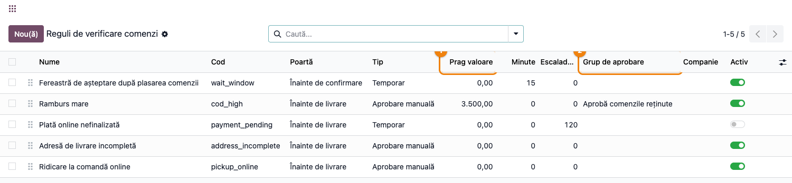
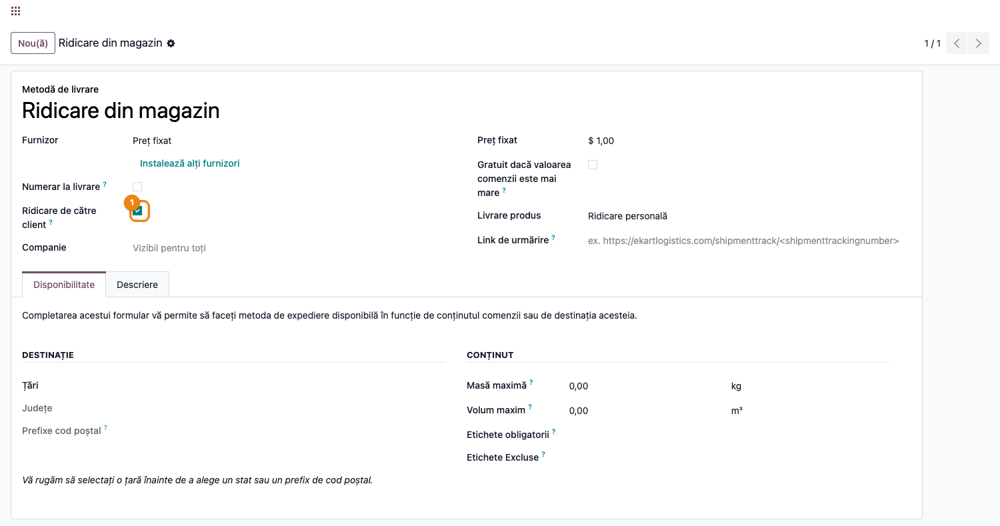
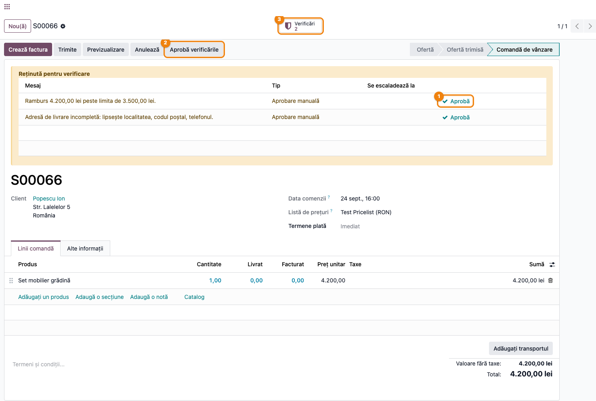
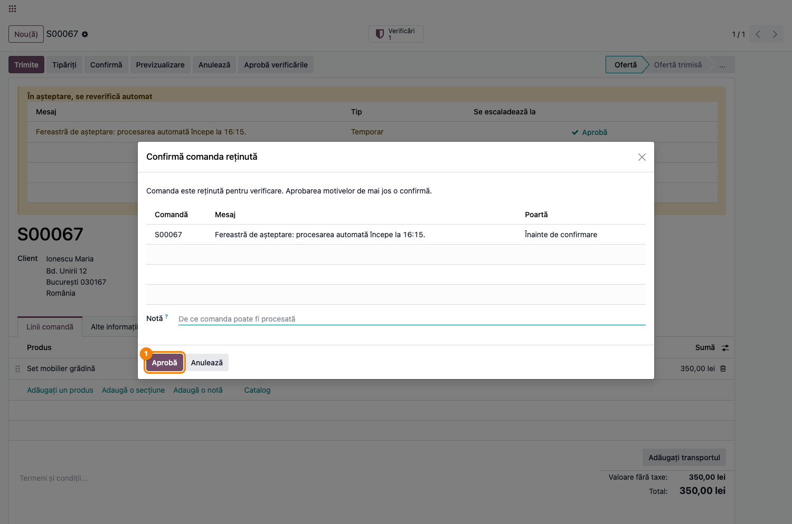
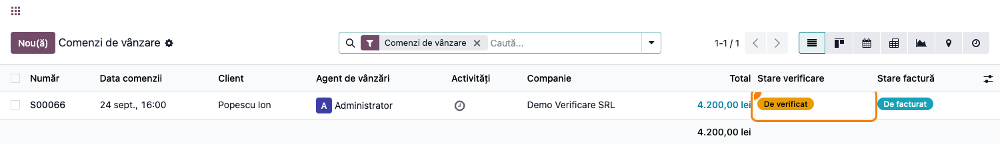
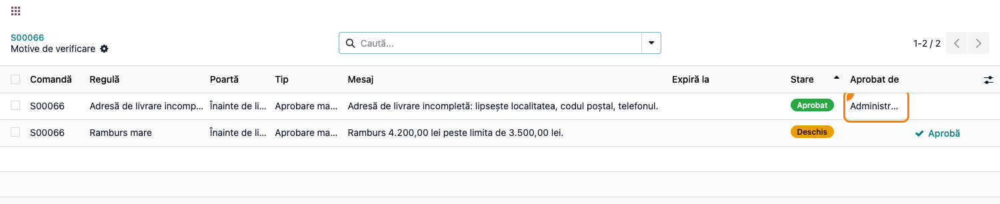

# Fișă Modul: Verificarea comenzilor înainte de procesare

**Modul:** `deltatech_sale_order_review`
**Utilizator principal:** Operator comenzi (e-commerce / marketplace), Responsabil vânzări, Consultant de implementare
**Prioritate:** 🟡 Medie (control operațional de risc — ramburs, plată, adresă; nu obligație legală)

---

## 1. Scop business

Această fișă descrie utilizarea modulului `deltatech_sale_order_review` pentru scenariul
**Verificarea comenzilor înainte de procesare**. Modulul reține comenzile de vânzare care nu sunt
sigure de procesat și **arată de ce**: fiecare oprire devine un motiv înregistrat pe comandă, cu
stare proprie, vizibil într-un banner pe formular și ca badge în lista de comenzi. Operatorul vede
dintr-o privire ce are de verificat, aprobă cu un clic ce a verificat, iar istoricul rămâne pe
comandă. Fără modul, Odoo poate bloca o comandă, dar nu explică blocajul: o ofertă rămâne ofertă, o
livrare rămâne în așteptare, o notă se pierde în chatter.

Cazurile acoperite de regulile livrate: ramburs peste un prag, plată cu cardul inițiată dar
nefinalizată, adresă de livrare incompletă, ridicare personală cerută la o comandă online și o
fereastră de așteptare după plasarea comenzii (timp în care clientul mai poate adăuga un mesaj sau
alege un punct de ridicare).

## 2. Bază legală și context

Nu există o obligație legală specifică — este un control intern al riscului operațional și
comercial. Contextul: magazinele online și vânzătorii pe marketplace primesc comenzi pe care nimeni
nu le-a văzut înainte să ajungă în depozit. O comandă cu ramburs de 5.000 lei de la un client nou,
o adresă fără telefon sau o plată cu cardul care nu s-a finalizat costă un transport dus-întors dacă
pleacă neverificată. Modulul pune aceste comenzi într-o coadă vizibilă, cu motivul lângă ele, fără
să oprească restul fluxului.

Două **porți** definesc unde se oprește comanda:

- **Înainte de confirmare** — comanda rămâne ofertă cât timp motivul e deschis (fereastra de
  așteptare, mesaj de la client).
- **Înainte de livrare** — comanda se confirmă (stocul se rezervă), dar livrarea e reținută
  (ramburs mare, plată nefinalizată, adresă incompletă, ridicare la comandă online). Blocarea
  efectivă a livrării vine prin modulul de amânare a livrării (`deltatech_delivery_status`), când
  este instalat; modulul de bază marchează comanda și o ține în coadă.

Două **tipuri** de motiv:

- **Temporar** — se rezolvă singur când condiția dispare (plata se finalizează, fereastra trece).
  După un termen configurabil se escaladează la aprobare manuală.
- **Aprobare manuală** — așteaptă decizia unei persoane din grupul potrivit. Aprobarea reține
  cine, când și pentru ce valoare; dacă valoarea se schimbă ulterior (rambursul crește), motivul se
  redeschide.

## 3. Utilizatori și roluri

- **Operator comenzi** — lucrează coada „De verificat", aprobă motivele pe care le poate aproba.
- **Responsabil vânzări** — aprobă motivele rezervate grupului de aprobare (ramburs mare),
  configurează regulile.
- **Consultant de implementare** — activează regulile, stabilește pragurile și grupurile.

Roluri introduse de modul:

- **Aprobă comenzile reținute** (`group_sale_order_review_approve`) — poate aproba motivele
  regulilor care au acest grup setat ca „Grup de aprobare" (implicit: regula „Ramburs mare").
  Managerii de vânzări îl primesc automat.
- Regulile **fără** grup de aprobare pot fi aprobate de orice utilizator cu drepturi de vânzări.
- Configurarea regulilor: **Vânzări / Administrator** (meniul de configurare e vizibil doar
  managerilor).

Roluri recomandate la testare:

- Administrator funcțional: instalează modulul, activează regulile, setează pragurile.
- Agent de vânzări simplu (fără grupul de aprobare): vede bannerul și butonul „Aprobă" doar pe
  motivele fără grup; la „Confirmă" pe o comandă reținută primește mesajul cu motivele.
- Manager de vânzări: aprobă tot, inclusiv rambursul mare, și confirmă prin wizard.

## 4. Conturi și date implicate

Modulul **nu generează note contabile** și nu introduce conturi. Lucrează pe comanda de vânzare
(`sale.order`), pe tranzacțiile de plată (`payment.transaction`) și pe metodele de livrare
(`delivery.carrier`).

Date minime pentru demo:

- un produs vandabil, cu preț de listă (ex. 4.200 lei) — ca rambursul să depășească pragul;
- un client cu adresă **incompletă** (fără localitate / cod poștal / telefon) și unul cu adresă
  completă;
- o metodă de livrare de tip „ridicare personală";
- opțional, un furnizor de plată online în modul test, pentru regula „Plată online nefinalizată".

## 5. Configurare inițială

1. Instalați modulul `deltatech_sale_order_review` (depinde de `sale` și `delivery`).
2. Accesați **Vânzări → Configurare → Reguli de verificare comenzi** și parcurgeți cele cinci reguli
   livrate. Pentru fiecare, verificați **Poartă**, **Tip**, **Prag valoare** (3.500 la ramburs),
   **Minute** (fereastra de așteptare), **Escaladează după** (120 min la plata online) și **Grup de
   aprobare**.
3. Activați regulile de care aveți nevoie. **Fereastra de așteptare** și **Ridicarea la comandă
   online** sunt inactive implicit — le porniți doar dacă fluxul clientului le cere.
4. Pe metodele de livrare la care clientul ridică personal marfa (**Inventar → Configurare → Metode
   de livrare**), bifați **Ridicare de către client**. Metodele Click & Collect standard sunt
   recunoscute și fără bifă.
5. Verificați că utilizatorii care aprobă rambursul mare au grupul **Aprobă comenzile reținute**
   (managerii de vânzări îl au implicit).
6. Acțiunea planificată **Verificare comenzi: reevaluează comenzile reținute** rulează la 5 minute;
   nu are nevoie de configurare.

## 6. Flux de utilizare

### Pasul 1 — Regulile de verificare

Accesați **Vânzări → Configurare → Reguli de verificare comenzi**. Lista e editabilă direct: fiecare
rând e o regulă cu poarta la care oprește comanda, tipul, pragul sau minutele și grupul care poate
aproba. Comutatorul **Activ** pornește și oprește regula fără să o șteargă; o regulă oprită își
închide singură motivele deschise la următoarea reevaluare.



### Pasul 2 — Metoda de livrare cu ridicare personală

Accesați **Inventar → Configurare → Metode de livrare → deschideți metoda** și bifați **Ridicare de
către client**. De acum, o comandă **online** (venită din magazinul web sau din marketplace, ori cu
o tranzacție de plată) cu această metodă este reținută înainte de livrare, ca cineva să confirme cu
clientul înainte de rezervarea mărfii. Comenzile întocmite de un agent de vânzări nu sunt afectate.



### Pasul 3 — Comanda reținută înainte de livrare

O comandă cu ramburs de 4.200 lei către un client fără localitate și telefon intră din magazin și se
**confirmă** (stocul se rezervă), dar rămâne reținută: bannerul galben **Reținută pentru verificare**
listează motivele deschise — „Ramburs 4.200,00 lei peste limita de 3.500,00 lei" și „Adresă de
livrare incompletă: lipsește localitatea, codul poștal, telefonul" — fiecare cu tipul și, la cele
temporare, ora la care se escaladează.

Operatorul are trei acțiuni:

1. **Aprobă** pe rândul unui motiv — după ce l-a verificat (a sunat clientul, a completat adresa);
2. **Aprobă verificările** în antet — aprobă toate motivele deschise dintr-o dată, cu o notă;
3. smart button **Verificări** — istoricul complet al motivelor de pe comandă.

Butonul „Aprobă" apare doar pe motivele pe care utilizatorul curent are dreptul să le aprobe. Dacă
adresa se completează pe client, motivul „Adresă incompletă" se **rezolvă singur** la următoarea
reevaluare, fără aprobare.



### Pasul 4 — Confirmarea unei oferte reținute înainte de confirmare

Cu regula **Fereastră de așteptare** activă, o ofertă nou intrată stă 15 minute în starea **În
așteptare, se reverifică automat**: fluxurile automate (importul din marketplace) nu o confirmă până
nu trece fereastra. Dacă operatorul apasă totuși **Confirmă**, nu primește o eroare seacă: se
deschide wizardul **Confirmă comanda reținută**, cu motivele deschise, poarta la care opresc și un
câmp **Notă**. **Aprobă** aprobă motivele pe numele lui, notează în chatter și confirmă comanda în
același pas. **Anulează** lasă oferta neatinsă.

Un utilizator care **nu** are dreptul să aprobe motivele primește în locul wizardului un mesaj cu
lista motivelor și comanda rămâne ofertă.



### Pasul 5 — Coada zilnică în lista de comenzi

Accesați **Vânzări → Comenzi → Comenzi** (sau **Oferte**). Coloana **Stare verificare** arată badge-ul
**De verificat** (galben) sau **În așteptare** (albastru); comenzile fără motive deschise nu au
badge. Filtrele **De verificat** și **În așteptare verificare** din căutare și gruparea după
**Stare verificare** dau coada operatorului. Pe o selecție de comenzi, **Acțiuni → Aprobă
verificările** deschide același wizard pentru toate — util când operatorul lucrează pe loturi.

**Găsește pe ecran:** fiecare rând este o comandă; badge-ul din coloana „Stare verificare" spune dacă
așteaptă un om („De verificat") sau se rezolvă singură („În așteptare").
**Verifică:** înainte de a aproba în bloc, deschideți cel puțin o comandă din selecție și citiți
motivele din banner — aprobarea în bloc le acoperă pe toate, cu aceeași notă.
**Treci mai departe:** după aprobare, badge-ul dispare și comanda intră în fluxul normal de livrare
și facturare.



### Pasul 6 — Istoricul verificărilor

Din smart button-ul **Verificări** se deschide lista **Motive de verificare** ale comenzii: regula,
poarta, tipul, mesajul, starea (**Deschis** / **Rezolvat** / **Aprobat**), cine și când a aprobat,
cu nota. Aici se vede că adresa incompletă a fost aprobată de administrator, iar rambursul mare e
încă deschis. Un motiv aprobat pentru o valoare (4.200 lei) se **redeschide** dacă comanda e editată
și valoarea crește — aprobarea nu acoperă o comandă mai mare decât cea văzută.



### Note de monografie și raportare

Modulul nu generează note contabile — condiționează doar procesarea comenzii de vânzare
(confirmarea, prin wizard, și marcarea pentru livrare). Facturarea și livrarea urmează fluxul
standard odată ce motivele sunt aprobate sau rezolvate. Urma de audit este lista de motive de pe
comandă și notele din chatter („Comandă reținută pentru verificare: …", „Verificare aprobată de …").

## 7. Legături cu alte module / declarații

| Modul / proces | Rol în flux | Tip legătură |
|---|---|---|
| `sale` | comanda de vânzare, butonul Confirmă (redirecționat prin poartă), lista și filtrele | dependență (manifest) |
| `delivery` | metoda de livrare, bifa „Ridicare de către client", regula de ridicare la comandă online | dependență (manifest) |
| `payment` (prin `sale`) | tranzacțiile de plată — regula „Plată online nefinalizată" se reevaluează la fiecare schimbare de stare a tranzacției | integrare |
| `deltatech_delivery_status` | amânarea efectivă a livrării (`postponed`) pentru motivele de pe poarta de livrare — printr-un modul-punte separat | extindere planificată |
| `deltatech_delivery` | acțiunile bulk „Validare livrări" și „Trimite la curier" sar comenzile reținute și raportează motivul | extindere planificată |
| `deltatech_marketplace_sale` | confirmarea automată a comenzilor importate întreabă `_review_can_auto_confirm()`; regulile „mesaj de la client", „fără locker", „total diferit de magazin" | extindere planificată |
| `terrabit_partner_credit_limit` | limita de credit și facturile restante ca motive pe poarta de confirmare | extindere planificată |

Ce este automat: evaluarea regulilor la crearea și modificarea comenzii, la schimbarea stării
plății și din acțiunea planificată; rezolvarea motivelor temporare; escaladarea după termen;
redeschiderea la schimbarea valorii; notele din chatter.
Ce rămâne manual: aprobarea motivelor de tip „Aprobare manuală", decizia de a confirma o ofertă
reținută înainte de confirmare, stabilirea pragurilor și a grupurilor.

## 8. Verificări pentru consultant

- [ ] Modulul se instalează fără erori pe baza demo (dependențe: `sale`, `delivery`).
- [ ] Meniul **Vânzări → Configurare → Reguli de verificare comenzi** apare pentru managerul de
      vânzări și listează cele cinci reguli, cu „Fereastră de așteptare" și „Ridicare la comandă
      online" inactive implicit.
- [ ] O comandă cu ramburs peste prag primește motivul „Ramburs … peste limita de …", badge-ul
      **De verificat** și nota în chatter; comanda se confirmă totuși (poartă „Înainte de livrare").
- [ ] Un client fără localitate/cod poștal/telefon generează motivul „Adresă de livrare
      incompletă"; completarea adresei îl rezolvă la următoarea rulare a acțiunii planificate.
- [ ] Cu „Fereastră de așteptare" activă, o ofertă nouă e **În așteptare**; după trecerea minutelor
      motivul se rezolvă singur.
- [ ] Butonul **Confirmă** pe o ofertă reținută deschide wizardul pentru un utilizator cu drept de
      aprobare și afișează mesajul cu motivele pentru unul fără.
- [ ] **Aprobă** pe motivul „Ramburs mare" e vizibil doar utilizatorilor din grupul **Aprobă
      comenzile reținute**; agentul simplu primește eroare de acces dacă încearcă altfel.
- [ ] După aprobare, mărirea cantității pe comandă (ramburs mai mare) redeschide motivul.
- [ ] Filtrele **De verificat** / **În așteptare verificare** și gruparea după **Stare verificare**
      funcționează în lista de comenzi; **Acțiuni → Aprobă verificările** deschide wizardul pe
      selecție.
- [ ] Smart button-ul **Verificări** arată istoricul, cu „Aprobat de" și data.
- [ ] Anularea comenzii închide toate motivele deschise.

## 9. Mesaje de eroare frecvente

| Mesaj / simptom | Cauză probabilă | Remediere |
|-----------------|-----------------|-----------|
| „Comanda este reținută pentru verificare și nu poate fi confirmată: …" la Confirmă | Utilizatorul nu are dreptul să aprobe cel puțin unul din motivele deschise pe poarta de confirmare | Un utilizator din grupul de aprobare confirmă prin wizard, sau se așteaptă rezolvarea motivelor temporare |
| „Nu aveți dreptul să aprobați motivul de verificare „…" de pe …" | Regula are un „Grup de aprobare" din care utilizatorul nu face parte | Adăugați utilizatorul în grup (implicit **Aprobă comenzile reținute**) sau lăsați grupul gol pe regulă |
| Comanda are badge „De verificat", dar bannerul nu arată butonul Aprobă | Utilizatorul curent nu poate aproba niciun motiv deschis | Vezi rândul anterior; motivele temporare nu au buton pentru nimeni până nu se escaladează |
| Motivul „Adresă incompletă" rămâne deschis după completarea adresei pe client | Modificarea s-a făcut pe partener, nu pe comandă; reevaluarea vine din acțiunea planificată (5 min) | Așteptați rularea acțiunii planificate sau salvați o modificare pe comandă (ex. adresa de livrare) |
| Un motiv aprobat a apărut din nou ca „Deschis" | Valoarea verificată s-a schimbat de la aprobare (rambursul a crescut) | Verificați din nou comanda și aprobați; comportamentul e intenționat |
| Nicio comandă nu primește motive, deși regulile sunt active | Regula are „Companie" setată pe altă companie, sau condiția nu e îndeplinită (ex. pragul de ramburs e 0) | Verificați compania și parametrii regulii în **Reguli de verificare comenzi** |

## 10. Capturi de ecran

Capturile (`readme/screenshots/`) sunt generate automat din `tests/test_screenshots.py` (mixinul
`ScreenshotCase` din `l10n_ro_doc_screenshots`, import defensiv), în limba română, pe compania RO:

1. `01_reguli_verificare.png` — lista regulilor de verificare, cu pragul de ramburs și grupul de
   aprobare.
2. `02_transportator_ridicare.png` — metoda de livrare cu bifa „Ridicare de către client".
3. `03_comanda_retinuta.png` — comanda confirmată, reținută înainte de livrare: bannerul cu
   motivele, „Aprobă", „Aprobă verificările" și smart button-ul „Verificări".
4. `04_wizard_confirmare.png` — wizardul „Confirmă comanda reținută" pe o ofertă în fereastra de
   așteptare.
5. `05_lista_comenzi_badge.png` — lista comenzilor cu badge-ul „De verificat" în coloana „Stare
   verificare".
6. `06_istoric_verificari.png` — istoricul motivelor de pe comandă, cu unul aprobat și unul
   deschis.

Regenerare (test Playwright, `tests/test_screenshots.py`; cere `l10n_ro` instalat pentru compania
RO):

```bash
./odoo/odoo-bin -c odoo.conf -d <db> -i l10n_ro -u deltatech_sale_order_review,l10n_ro_doc_screenshots \
    --test-tags=fise_screenshots --stop-after-init
```

## 11. Observații pentru manual

Păstrați în manual distincția dintre cele două porți — „Înainte de confirmare" ține comanda ofertă,
„Înainte de livrare" o confirmă, dar o oprește la livrare — și dintre cele două tipuri de motiv:
temporarul se rezolvă singur, manualul așteaptă un om. Insistați că aprobarea e **pe valoare**: o
comandă editată după aprobare se redeschide singură, deci operatorul nu trebuie să țină minte ce a
aprobat. Subliniați coada zilnică din lista de comenzi (filtrul „De verificat") ca punct de plecare
al operatorului, nu chatterul. Când sunt instalate și punțile către amânarea livrării și către
marketplace, adăugați în manual că livrarea reținută nu poate fi validată sau trimisă la curier și
că importul din marketplace lasă comanda ofertă cu motivele vizibile.
